### *Bölüm 1*

## *KARAR VERME ve MODELLER*

# 

### 1.1 GİRİŞ

İnsan yaşamı bir dizi karar verme durumunu içeren bir süreçtir. Her insan günlük
yaşantısında ne yiyeceği, ne giyeceği, saat kaçta uyuyacağı, TV’de hangi
programı izleyeceği gibi son derece basit konuların yanı sıra, tasarrufunu nasıl
değerlendireceği, bütçesini nasıl ayarlayacağı, çocuğunu hangi okula göndereceği
gibi daha önemli konularda, zaman zaman da sözgelimi, hastalığının tedavisinde
ne yapması gerektiği gibi yaşamsal öneme sahip konular hakkında karar vermek
durumundadır.

İşletme yöneticileri de zamanlarının büyük bir bölümünü özel yaşamlarıyla ilgili
konuların yanında işletmenin organizasyonu ve yönetimi, pazarlama, üretim,
finansman, yatırım, ulaşım gibi işletme için son derece önemli konular üzerinde
karar vermeye ayırırlar.

Günümüzde yoğun rekabet piyasası ortamında faaliyet gösteren işletmelerin
başarısı, esas olarak yöneticilerin verdikleri kararların doğruluk derecesine ve
alınan kararların uygulanış biçimine bağlıdır. İşletmenin sahip olduğu kıt
kaynakların en uygun biçimde kullanılması, her şeyden önce yöneticilerin
alternatif çözüm yollarından hangisinin seçilmesi gerektiği konusunda vereceği
kararlara bağlıdır. Alınan kararların işletmenin başarı derecesinin ölçütü
olması nedeniyle *karar verme* modern işletmeciliğin en önemli fonksiyonu olarak
kabul edilir. Karar verme nedir, nasıl tanımlanır? Geniş anlamda karar verme,
bir kişinin veya bir örgütün karşılaştığı alternatif davranış biçimleri
arasından belirli ölçütlere göre en iyi olan bir veya birkaçını seçme eylemi
olarak tanımlanabilir.

Esas olarak işletme yöneticisinin karar verme fonksiyonuna yardımcı olmayı
amaçlayan sayısal yöntemler, problemin matematiksel modelini kurmayı ve model
üzerinde işlem yapmayı kapsadığından, bu bölümde bu konular üzerinde
durulacaktır. Bu bölümde ele alınan konular karar verme ile ilgili kavramların
tamamını içermemektedir. Bununla birlikte, açıklamaların kitap kapsamındaki
konuları anlamak bakımından yeterli olacağı kanısında olduğumuzu belirtmeliyiz.

### 1.2 KARAR VERME SÜRECİ

Dar anlamda karar verme, çeşitli alternatifler arasından en uygun olanının
seçiminin yapıldığı bir süreç olarak tanımlanabilir. *Karar verme süreci*, ilk
kez Devey (1910) tarafından ele alınmış ve üç aşamadan oluşan bir bütün olarak
tanımlanmıştır. Devey’e göre bu sürecin aşamaları aşağıdaki gibidir.

\- Problemin belirlenmesi

\- Alternatiflerin listelenmesi

\- Alternatifler arasından en iyi olanın seçilmesi

Devey’in bu yaklaşımı zaman içinde bir karar kuramının oluşumunu başlatmıştır.
1950’li yıllardan sonra karar kuramında hızlı bir gelişme başlamış ve karar
verme sürecinin üç aşamalı bir bütün olarak tanımlanmasının yeterli olmadığı
görüşü ağırlık kazanmıştır. Değişik kaynaklarda karar verme süreci aşamalarının
farklı biçimlerde sıralandığı ve sınıflandırıldığı görülmekle birlikte, farklı
yaklaşımların ortak noktaları dikkate alındığında, söz konusu sürecin aşağıdaki
beş temel aşamadan oluştuğunu söylemek yanlış olmaz.

*A*. Karar probleminin tanımlanması

*B*. Karar probleminin modelinin kurulması

*C*. Modelden çözüm elde edilmesi

*D*. Modelin ve çözümün test edilmesi

*E*. Karar verme ve kararın uygulamaya konulması

Bunlar şöyle özetlenebilir.

*A*. **Karar probleminin tanımlanması**: Problem kavramının ne olduğu
konusundaki farklı yaklaşımlar problemin belirlenmesi konusunda da değişik
anlayışlara neden olmaktadır. Bununla birlikte, değişik yaklaşımların ortak
noktası herhangi bir karar probleminin tanımlanabilmesi için her şeyden önce bir
problemin bulunması gerektiğidir. Bu nedenle, önce herhangi bir problemin ortaya
çıkması için gerekli koşulların neler olduğunu açıklayalım. Bir problemin söz
konusu olabilmesi için gerekli koşullar veya kısaca *problemin bileşenleri*
aşağıdaki gibi açıklanabilir.

*1*. **Karar verecek kişi veya kişiler**: Problemle ilgili karar vermek isteyen
en az bir kişinin bulunması gerekir. Bu kişi veya kişiler topluluğuna *karar
verici* denir.

*2*. **Amaç**: Kararlar belirli bir amaca ulaşmak için verilir. Karar vericinin
ulaşmak istediği bir veya birden fazla amacının bulunması gerekir.

*3*. **Alternatif eylem biçimleri**: Alternatif eylem biçimleri bir sorunun
çözümünde kullanılabilecek birbirlerinden farklı yaklaşımlardır. Karar vericinin
amaç veya amaçlarına ulaşabilmesi için aralarından seçim yapabileceği birden
fazla eylem biçiminin veya çözüm yolunun bulunması gerekir. Bütün bunların yanı
sıra alternatif eylem biçimlerinin karar verici için eşit değerde olmaması
beklenir.

*4*. **Belirsizlik**: Amaca veya amaçlara en etkin (hızlı ve doğru) biçimde
ulaşabilmek için hangi eylem biçiminin en iyi olduğu konusunda belirsiz bir
durumun veya *belirsizliğin* söz konusu olması gerekir.

Problemin varlığı ve tanımlanması için gerekli koşulların açıklanmasından sonra
karar verme sürecinin önemli aşamalarından biri olan problemin *modelinin
kurulması-modelleme* aşamasına geçebiliriz.

*B*. **Problemin modelinin kurulması**: Problemin tanımlanmasından sonra
yapılması gereken en önemli iş problemin kolayca çözümlenebilen bir yapıya
oturtulması, diğer bir deyişle problemi en iyi biçimde temsil edecek ve
problemin çözümündeki belirsizlikleri en aza indirecek bir modelin kurulmasıdır.
Kimilerinin söylediği gibi model kurma bir deneyim işi, ayrıca bir sanattır.
Model için bir dizi tanım verilebilirse de aşağıdaki iki tanım model kavramını
anlayabilmek bakımından yeterli olacaktır.

Bir sistemin değişen şartlar altındaki davranışlarını incelemek, kontrol etmek
ve geleceği hakkında tahminlerde bulunmak amacıyla elemanları arasındaki
bağıntıları kelimeler veya matematik terimlerle belirten ifadeler topluluğuna
*model* denir. Bir başka tanıma göre *model* olayların, nesnelerin veya
durumların bir temsilcisi ve özetidir. Ele aldığı problemin tüm ayrıntılarını
belirtmekten çok konu ile ilgili ve özelliği önemli olan ilişkileri gösterir.

Çok geniş kullanım alanı olan modeller çeşitli özelliklerine göre
sınıflandırılabilir. Sınıflandırmada temsil şekilleri, zaman esası, modellenecek
sistem hakkındaki bilgi miktarı, yapı, amaç, değişkenlerinin özellikleri,
fonksiyonel ilişkiler ve kapsam dikkate alınmaktadır. Ele alınan konuya ve amaca
göre çok basit veya karmaşık olabilen modelleri basit ve karmaşık modeller
başlıkları altında incelemek mümkün olmakla birlikte, daha başka
sınıflandırmalar da yapılabilir. Modellerin en ayrıntılı sınıflandırılması J. W.
Forrester tarafından gerçekleştirilmiştir. Forrester modelleri ilk önce soyut ve
fiziki modeller olarak ele almış, soyut modelleri ise matematik, dinamik ve
statik olmak üzere üçe ayırdıktan sonra her birini doğrusal ve doğrusal olmama
özelliklerine göre sınıflandırmıştır.

Modellerin diğer bir sınıflandırılması R. L. Ackoff tarafından yapılmıştır.
Ackoff’a göre modeller (yapıları dikkate alındığında) uyuşum (iconic) modelleri,
benzetim (analog) modelleri ve sembolik modeller olmak üzere üç başlık altında
incelenebilir.

**Uyuşum (ölçek) modelleri**: Fizik bir büyüklüğün, orijinalinden farklı bir
ölçekle temsil edilmesidir. Fazla soyut olmayan bu tip modeller boyutlarına göre
sınıflandırılmaktadır. Bir fabrikanın, bir uçağın, bir arabanın vb. maketi üç
boyutlu, fotoğraflar, çizimler, bilgisayar ikonları vb. iki boyutlu uyuşum
modelleridir.

**Benzetim modelleri**: Gerçek durum ve nesneleri, üzerinde işlem yapılması daha
kolay diğer büyüklükler ile temsil eder. Benzetim modelleri de iki boyutta
(haritalar, grafikler, diyagramlar vb.) ve üç boyutta (benzetim araçları)
düzenlenebilirler. Benzetim modellerinin temsil ettikleri sistemlerle fiziksel
benzerlikleri olmamakla birlikte onlar gibi davranırlar. Özetle bir benzetim
modeli fiziksel değişkenlerle aynı biçimde davranan başka bir değişkenler kümesi
kullanılarak oluşturulan modeldir. Örneğin bir ekonomik sistemdeki kaynakların
veya bir elektrik şebekesindeki elektrik akışı su borularıyla oluşturulan bir
şebekeyle temsil edilebilir. Benzetim modelleri uyuşum modellerinden daha
soyuttur.

**Sembolik modeller**: Öyle sistemler vardır ki fiziksel araçlarla
açıklanamazlar veya bu amaca yönelik çalışmalar çok uzun zaman ve büyük
maliyetler gerektirebilir. Bu gibi durumlarda en mantıklı yaklaşım, incelenen
durum veya problemin matematik anlamda sembollerle açıklanmasıdır. Sayıları
göstermede sembollerin kullanıldığı bu tür modellere *sembolik* veya
*matematiksel model* denir. Matematiksel modeller, çözümleri sistemin durumunu
açıklayan veya haber veren bir eşitlikler kümesi olarak da tanımlanmaktadır.
Kimyasal formüller, nota kağıtları, matematiksel eşitliklerin her biri bir
sembolik modeldir.

Bu kitapta incelenen konular açısından bizi ilgilendiren modeller yalnızca
matematiksel modellerdir. Bu nedenle, matematiksel modeller üzerinde kısaca
durulması uygun olacaktır([^1]).

[^1]: Modellerin daha kapsamlı sınıflandırılması için bkz.: Öner Esen, **İşletme
    Yönetiminde Sistem Yaklaşımı**, İstanbul: İşletme Fakültesi Yayınları,
    No:174, 1984, ss. 19-24., İmdat Kara, **Yöneylem Araştırmasının
    Yöntembilimi**, Eskişehir: İktisadi ve Ticari İlimler Akademisi Yayınları,
    No: 215/139, 1979, ss. 85-100.

Bir problemin matematiksel modelinde, problemi tanımlayan açıklamaların
oluşturduğu dört temel eleman vardır. Bunlar aşağıdaki gibi sıralanabilir.

*1*. Karar değişkenleri

*2*. Parametreler

*3*. Kısıtlayıcı fonksiyonlar veya kısaca kısıtlayıcılar ya da kısıtlar

*4*. Amaç fonksiyonu

*1*. **Karar değişkenleri**: Karar vericinin denetimi altında olan niteliklere
*karar değişkenleri* denir. Bunlar modele ilişkin bilinmeyenler olup değerleri
modelin çözümünden sonra belirlenir. Modelin kapsamını ve çözümünü
zorlaştırmayan, başka modellerle karşılaştırma olanağı sağlayan değişkenlerin
seçilmesi çok önemlidir. Değişkenlerin sayısı ve ölçü birimleri, hedeflenen amaç
ve bilgi kaynaklarının elverişliliği göz önüne alınarak belirlenir. Bu
değişkenler karar vericinin denetimi altında olduklarından bunlara *kontrol
değişkenleri* de denir.

*2*. **Parametreler**: Alabileceği değerlerde, karar vericinin hiçbir etkisi
olmayan niteliklere *parametre* veya *kontrol dışı değişkenler* denir. Belirli
koşullarda belirli değerler alan parametreler problem için veri durumundadır.

*3*. **Kısıtlayıcı fonksiyonlar (kısıtlayıcılar)**: Karar değişkenleri ve karar
değiş- kenleriyle parametrelerin birbirleriyle olan ilişkilerinde sağlanması
zorunlu olan ilişkilerin matematiksel olarak açıklanmasıyla elde edilen
denklemlere *kısıtlayıcı fonksiyonlar* veya kısaca *kısıtlayıcılar* ya da
*kısıtlar* denir. Kısıtlayıcıların değerleri kesin ve önceden belirlenmiş olup
sistemin tanımlanmasında kullanılırlar.

*4*. **Amaç fonksiyonu**: Karar vericinin ulaşmak istediği hedef bir denklem ile
açıklanır. *Amaç fonksiyonu* olarak bilinen bu denklem, karar değişkenleriyle
karar vericinin amacı arasındaki fonksiyonel ilişkiyi gösterir.

*C*. **Modelden çözüm elde edilmesi**: Modelin kurulmasından sonra uygun bir
teknikle çözülmesi gerekir. Modelin çözümünden karar değişkenlerinin
değerlerinin bulunması anlaşılır. Modellerin yapılarına göre çeşitli çözüm
teknikleri geliştirilmiştir. Bu teknikler genellikle aşağıdaki başlıklar altında
toplanır.

\-Analitik çözüm

\-Ardışık yaklaşım yoluyla çözüm

\-Benzetim yoluyla çözüm

\-Yordamlama yardımıyla çözüm

Model yapısına en uygun olan tekniğin uygulanmasıyla çözülür ve karar
değişkenlerinin değerleri belirlenir. Yapıya en uygun teknikle; çözümün güçlü,
hızlı ve ekonomik olması kastedilmektedir.

*D*. **Modelin ve çözümün test edilmesi**: Modelin çözülmesinden sonra çözümün,
dolayısıyla modelin geçerliliğinin denenmesi gerekir. Model, gerçeğin bir takım
varsayımlarla basitleştirilmiş biçimi olduğuna göre gerçeğe ne kadar ve nasıl
yaklaştığı konusunun bilinmesi ve incelenmesi son derecede önemlidir. Modelden
elde edilen çözümün güvenilirliği modelin geçerliliğine bağlıdır. Bir modelin
iyi ya da iyi olmadığı başka bir deyişle, modelin ve çözümün geçerliliği değişik
yollarla test edilebilir. Bu yollardan biri, elde edilen sonuçlarla geçmiş dönem
sonuçlarının karşılaştırılmasını öngörmektedir. Model benzer girdi koşulları
altında geçmiş dönem koşullarını yaklaşık veya tam olarak sağlayabiliyorsa
geçerli olduğuna dolayısıyla, sağladığı sonuçların uygulanabileceğine karar
verilir.

Sistemin kullandığı aynı girdilerle geçmiş dönem sonuçlarını sağlamayan model,
dolayısıyla çözüm geçerli değildir. Çözüm gerçeğe ters düşüyorsa bunun nedenleri
araştırılmalı ve araştırma işlemleri olumlu sonuç elde edilinceye değin
sürdürülmelidir. Ancak, burada bir nokta son derecede önemlidir. O da geçmişte
bulunmayan bir sistemin geçmiş dönem verileri ve geçmiş dönem sonuçları
olmayacağına göre karşılaştırma yapılamamasıdır. Bu durumda bir *benzetim*
(*simülasyon*) modeli geliştirilebilir ve bu model üzerinde gerekli testler
yapılarak modelin ve çözümün geçerliliği test edilebilir.

**Karar verme ve kararın uygulamaya konulması**: Karar verme sürecinin son
aşaması, model denenip sonuçları değerlendirildikten sonra ulaşılan çözüm
sonuçlarının uygulamaya konulmasıyla ilgilidir. Uygulama, model sonuçlarının
sistemi uygulayacak olan kişilere anlaşılır bir çalışma yönergesiyle
aktarılmasını da içerir.

### *Bölüm 2*

## *DOĞRUSAL PROGRAMLAMA*

## 

### 2.1 GİRİŞ

Özellikle II. Dünya Savaşından sonra üretimin artan oranda makineleşmesi ve
örgütlerin sürekli büyümeleri sonucu etkileşim uzaylarının genişlemesi,
insan-makina sistemlerinin([^2]) problemlerini daha da karmaşıklaştırmıştır. Bu
karmaşıklığın oluşturduğu gereksinimlerin baskısıyla gerçekleştirilen
çalışmalarla, hızla gelişen bilgi birikimine özgün sayısal teknikler
geliştirilmiştir. Bugün endüstriyel, iktisadi ve sosyal sorunların çözümünde
yaygın biçimde kullanılan doğrusal programlama, sayısal teknikler arasında en
geniş kullanım alanı bulmuş olandır.

[^2]: İnsan-makine sistemleri, temel iki unsuru insan ve makine olan amaçlı
    sistemlerdir. Sistemi oluşturan unsurların bir araya geliş nedenine, başka
    bir deyişle sistemin varlık nedenine *amaç* denir. Sistemin varlığını
    sürdürmesi amacına göre işleyişine bağlıdır.

Doğrusal programlama insan, makina, para ve malzemeden oluşan endüstriyel,
ticari, resmi ve askeri sistemlerin yönetiminde karşılaşılan ulaşım, üretim,
finansman, dağıtım, reklamcılık gibi faaliyetlerde yaygın biçimde
kullanılmaktadır. Sistemdeki darboğazların giderilmesinde, alternatif üretim
tekniklerinden en iyi olanının seçilmesinde de doğrusal programlamaya baş
vurulmaktadır.

Gerçekte kökeni çok eskilere, 1920’li yıllara kadar uzanmakla birlikte, doğrusal
programlama problemi ilk kez Rus matematikçi L. V. Kantorovich tarafından 1939
yılında formüle edilmiştir. Kantorovich gerçek bir üretim planlaması ve
organizasyon problemini bir doğrusal programlama problemi olarak ele almıştır.
1941’de Hitchock doğrusal programlama problemlerinin özel bir sınıfı olan
ulaştırma problemleri üzerinde çalışmıştır. İktisatcı C. Stigler 1945 yılında en
küçük maliyetli diyet problemini formüle etmiştir.

Konuyla ilgili çok sayıda çalışmaya karşılık doğrusal programlama bugünkü
anlamıyla ilk kez 1947 yılında ABD’nin askeri faaliyetlerini planlamak amacıyla
George B. Dantzig tarafından formüle edilmiş ve *simpleks yöntem* olarak bilinen
bir çözüm yöntemi önerilmiştir.

Doğrusal programlama matematiksel bir yaklaşım olmasına karşın, sadece
matematikçilerin değil, kıt kaynakların en uygun biçimde kullanımının sağlanması
konusunda çalışan iktisatçıların da ilgisini fazlasıyla çekmektedir.

Simpleks yöntemin geliştirilmesinden sonra geçen uzun yıllar boyunca oldukça
yavaş gelişme gösteren doğrusal programlamadaki asıl gelişme, bilgisayarların
yaygın biçimde kullanılmaya başlamasından sonra, yani son 25-30 yılda olmuştur.
Bu süreçte doğrusal programlama problemlerinin bilgisayar programları
hazırlanmış ve büyük boyutlu problemlerde rahatlıkla uygulanabilmesi sağlanmış
ve uygulama alanları genişlemiştir.

### 2.2 DOĞRUSAL PROGRAMLAMANIN TANIMI

Doğrusal programlama için bir dizi tanım yapılmıştır. Verilen tüm tanımları ele
almaya ve tartışmaya gerek yoktur. Aşağıdaki tanım kanımızca en tatminkar
olandır ve yalnızca bu tanımın verilmesiyle yetinilecektir.

*Doğrusal programlama*, iyi tanımlanmış doğrusal eşitliklerin veya
eşitsizliklerin kısıtlayıcı koşulları altında doğrusal bir amaç fonksiyonunu en
iyi (optimum) kılan değişken değerlerinin belirlenmesinde kullanılan bir
matematiksel programlama tekniğidir.

Tanımdaki en iyileme (optimizasyon) iki yolla gerçekleştirilir.

*1*. Amaç fonksiyonu değerinin en büyüklenmesi (maksimizasyon)

*2*. Amaç fonksiyonu değerinin en küçüklenmesi (minimizasyon)

Genellikle karşılaşılan sorunlar, olanaklar çerçevesinde krın en büyüklenmesi
veya maliyetin en küçüklenmesidir.

## 2.3 DOĞRUSAL PROGRAMLAMANIN YAPISAL GÖRÜNÜMÜ

Problemlerin doğrusal programlama ilkelerine uygun biçimde formüle edilmesi,
başka bir deyişle modelinin kurulması başlı başına bir sanattır. Modelin çözümü
için geliştirilmiş kesin yöntemler bulunmakla birlikte formülleme konusunda
kesin yöntemlerin varlığından söz edilemez. Doğrusal programlama modelinin
yapısının anlaşılması durumunda formüllemedeki zorluk büyük ölçüde ortadan
kalkar. Bir doğrusal programlama modeli aşağıdaki üç temel unsurdan oluşur.

*1*. Amaç fonksiyonu

*2*. Kısıtlayıcı fonksiyonlar (kısıtlayıcılar)

*3*. Negatif olmama koşulu

*1*. **Amaç Fonksiyonu**

Tüm doğrusal programlama modellerinde amaç ve bu amacı etkileyen faktörlerin
matematiksel biçimde veya fonksiyonel olarak ifade edildiği doğrusal bir amaç
fonksiyonu vardır. Doğrusallıkla, değişkenlerin birinci dereceden olması ve
çarpımlarının bulunmaması kastedilmektedir. Yukarıda açıklandığı gibi amaç
genellikle kârın en büyüklenmesi veya maliyetin en küçüklenmesidir. Doğrusal
programlamadan beklenen sonucun alınabilmesi, amacın kesin olarak bilinmesine ve
nicel olarak yazılmasına bağlıdır.

Karar değişkenleri X1, X2, ..., Xn ve katsayılar C1, C2, ...,Cn ile gösterilirse
amaç fonksiyonu Z,

Z = C1X1 + C2X2 + ... + CnXn

biçiminde veya sembolünün kullanılmasıyla aşağıdaki gibi yazılabilir.

Z =

İzleyen kesimlerde kullanacağımız Zenb amacın en büyüklemeye, Zenk ise en
küçüklemeye yönelik olduğunu ifade etmektedir.

*2*. **Kısıtlayıcı Fonksiyonlar**

Gerek işletmelerin gerekse ekonomiyi yönetenlerin sahip oldukları para, işgücü,
hammadde, enerji, zaman gibi kaynakları sınırsız değildir. Ekonomik kaynaklar
sınırlı olmasaydı, ekonomi bilimi ve doğrusal programlama gibi yönetim
araçlarına gerek kalmazdı. Sınırlı kaynaklarla karar verme durumunda olan kişi
veya kişiler kontrol etme şansına sahip oldukları ekonomik değerlerin
sınırlarını belirten kısıtlayıcı koşullar altında karar almak durumundadırlar.
Kısıtlayıcı fonksiyonlar sadece kaynakların sınırlarını değil, gereksinim ve
yönetim kararlarını ifade etmekte de kullanılırlar.

a11, a12, ..., amn ve b1, b2, ...,bm sabit sayılar olmak üzere kısıtlayıcılar
karar değişkenlerinin doğrusal fonksiyonları olarak aşağıdaki gibi
gösterilirler.

a11X1 + a12X2 + ... + a1nXn (≤, =, ≥) b1

a21X1 + a22X2 + ... + a2nXn (≤, =, ≥) b2

. . ... . .

am1X1 + am2X2 + ... + amnXn (≤, =, ≥) bm

Kesin bir kural olmamakla birlikte, en büyükleme problemlerinin kısıtlayıcı
fonksiyonları genellikle ≤, en küçükleme problemlerinin kısıtlayıcı
fonksiyonları ise ≥ işaretli olurlar. Öte yandan, = işaretli kısıtlayıcı
fonksiyonlara hem en büyükleme hem de en küçükleme problemlerinde rastlanır.

Kısıtlayıcı fonksiyonlar için daha genel olarak aşağıdaki bağıntılar
yazılabilir.

≤ bi i = 1, 2, ..., m

≥ bi i = 1, 2, ..., m

= bi i = 1, 2, ..., m

*3*. **Negatif Olmama Koşulu**

Doğrusal programlama gerçek problemlere uygulanır. Bu nedenle, değişkenler
negatif olamazlar. Sözgelimi, bir işletme üretim yapar veya yapmaz. Üretimin
gerçekleşmesi durumunda pozitif bir eylem söz konusu olur ki, bu durumda
değişkenler sıfırdan büyük, yani pozitiftir. Üretim yapılmaması durumunda
gerçekleşmeyen, yani nötr bir eylem söz konusu olur ki, bu durumda değişkenler
sıfıra eşittir. Bu yüzden, doğrusal programlama modelindeki değişkenler sıfıra
eşit veya sıfırdan büyük olurlar[^3]. Değişken değerlerine konulan bu kısıt
matematiksel olarak aşağıdaki gibi açıklanır.

[^3]: Çok sık olmasa da uygulamada bazı değişkenlerin işaretleri üzerine herhangi
    bir sınırlama konulmamasının gerektiği durumlarla da karşılaşılabilmektedir.
    Bu değişkenlere işaretçe sınırlandırılmamış değişkenler denir. Bu tür
    değişkenlerin bulunduğu doğrusal programlama problemleri ileride ayrıca
    incelenecektir.

X1 ≥ 0, X2 ≥ 0, ..., Xn ≥ 0 veya kısaca Xj ≥ 0 j = 1, 2, ..., n

Özetle, en büyükleme amaçlı bir doğrusal programlama problemi matematiksel
olarak şöyle gösterilir.

Amaç Fonksiyonu:

Zenb = C1X1 + C2X2 + ... + CnXn

Kısıtlayıcı Fonksiyonlar:

a11X1 + a12X2 + .... + a1nXn ≤ b1

a21X1 + a22X2 + ... + a2nXn ≤ b2 2.1

. . ... . .

am1X1 + am2X2 + ... + amnXn ≤ bm

Negatif olmama koşulu:

X1 ≥ 0, X2 ≥ 0, ..., Xn ≥ 0

Amaç Z’yi en küçükleyen değişken değerlerinin belirlenmesi olduğunda doğrusal
programlama problemi aşağıdaki gibi gösterilir.

Amaç fonksiyonu:

Zenk = C1X1 + C2X2 + ... + CnXn

Kısıtlayıcı fonksiyonlar:

a11X1 + a12X2 + ... + a1nXn ≤ b1

a21X1 + a22X2 + ... + a2nXn ≤ b2 2.2

. . ... . .

am1X1 + am2X2 + ... + amnXn ≤ bm

Negatif olmama koşulu:

X1 ≥ 0, X2 ≥ 0, ..., Xn ≥ 0

Doğrusal programlamanın matematiksel model olarak açıklanması sayısal sonuçlarda
karar vericinin kişisel etki ve kararlarını ortadan kaldırır.

Problemin türüne göre değişiklik göstermekle birlikte modeldeki sembollerin
genellikle ne anlam taşıdıklarını açıklamaya çalışalım. Bu tür bir açıklama,
kitaptaki modellerin daha iyi anlaşılabilmesi bakımından yararlı olur.

i = 1, 2, ..., m: Üretim bölümlerinin veya üretim kaynaklarının sayısı.

j = 1, 2, ..., n: Ürün çeşidi (faaliyet) sayısı.

X1, X2, ..., Xn veya kısaca Xj: Belirli bir zaman döneminde üretilen j’inci
ürünün üretim miktarı veya faaliyet düzeyi.

C1, C2, ...,Cn veya kısaca Cj: Xj’de oluşan bir birimlik artışın Z’de
oluşturacağı değişiklik (birim fiyat, birim kr, birim maliyet vb.).

aij: j’inci üründen bir birim üretmek için i’inci kaynaktan tüketilen kaynak
miktarı veya girdi katsayısı.

bi: n sayıdaki ürün için elde bulunan i’inci sınırlı kaynak miktarı.

Doğrusal programlamada, girdi katsayılarının oluşturduğu matrisin özel bir yeri
vardır. 2.1 ve 2.2 nolu modellerin ortaya koyduğu gibi bu matris aşağıdaki
gibidir.

**A** = 

Üretim teknolojisini gösteren bu matrise *teknoloji matrisi* denir. Gerçekten,
bu matrisin elemanları olan aij’ler her üründen bir birim üretmek için gerekli
kaynak miktarını, başka bir deyişle üretim teknolojisini ifade etmektedir.
Matris, satırları bakımından incelendiğinde, her bir satırın n çeşit ürünün her
birinden birer birim üretmek için gerekli olan belirli bir kaynak gereksinimine
karşılık geldiği görülebilir. Örnek olması bakımından matrisin birinci satırını
inceleyelim.

Yukarıdaki satır vektörün elemanlarından a11, birinci maldan bir birim üretmek
için birinci kaynaktan kullanılan miktarı, a12 ikinci maldan bir birim üretmek
için yine birinci kaynaktan kullanılan miktarı ve nihayet a1n n’inci maldan bir
birim üretmek için aynı kaynaktan kullanılan miktarı gösterir. n çeşit malın her
birinden birer birim üretebilmek için gerekli birinci kaynak miktarı yukarıdaki
satır vektörün elemanları toplamına eşit olur.

Matrisin sütunları da belirli bir üründen bir birim üretmek için gerekli olan
kaynak gereksinimini gösterir. **A** matrisinin ilk sütunu satır vektör olarak
şöyledir:

Burada, a11 birinci maldan bir birim üretmek için gerekli birinci kaynak
miktarını, a21 yine birinci maldan bir birim üretmek için gerekli ikinci kaynak
miktarını ve nihayet am1 aynı maldan bir birim üretmek için gerekli m’inci
kaynak miktarını gösterir. Kısaca her sütun karşılık geldiği malın üretim
teknolojisinden başka bir şey değildir. Bu yüzden bu sütunlara *faaliyet* denir.

Doğrusal programlamada **A** ile birlikte bulunan diğer matrisler aşağıda
gösterilmiştir.

*1*. Kaynakların sınırlarını açıklayan kaynak miktarı veya gereksinme (sağ taraf
değerleri) vektörü:

**b** = 

*2*. Amaç fonksiyonu katsayıları (birim kr, birim maliyet vb.) satır vektörü:

**C** = 

*3*. Karar değişkenleri matrisi: Karar değişkenleri matrisi, aslında n satır 1
sütundan oluşan bir sütun vektör olmakla birlikte, yerden tasarruf etmek
amacıyla aşağıda olduğu gibi bir satır vektör olarak da gösterilebilir.

**X** = 

Yukarıda açıklanan **A**, **b**, **C** ve **X** matrislerinin kullanılmasıyla
doğrusal programlama problemi,

Amaç fonksiyonu:Zenb/enk =

= **CX**

Kısıtlayıcı fonksiyonlar:

(≤, =, ≥) = **AX** (≤, =, ≥)
**b**

Negatif olmama koşulu:**X** ≥ 0biçiminde yazılır.

## 2.4 DOĞRUSAL PROGRAMLAMANIN VARSAYIMLARI

Bir tanıma göre model, anlaşılması güç ve karmaşık sistemlerin veya problemlerin
bir takım varsayımlarla basitleştirilmiş soyut bir temsilcisi veya taklididir.
Bir modelin dayandığı varsayımların azlığı ya da çokluğu o modelin
uygulanabilirliği ve yararlılığı açısından büyük bir önem taşır. Başka bir
deyişle, modelin dayandığı varsayımlar modelin olumsuz bir özelliği sayılabilir.
Bu nedenle, herhangi bir modelden gereği gibi yararlanabilmek için modelin
dayandığı varsayımları iyi bilmek, varsayımların sağlanıp sağlanmadığı konusunda
tarafsız olmak gerekir. Her model gibi doğrusal programlama modelleri de bir
takım varsayımlara dayanmaktadır. Bu varsayımlar aşağıdaki gibi açıklanabilir.

*1*. **Doğrusallık varsayımı**: Modeldeki fonksiyonların hepsi doğrusaldır. Bu
varsayımı açıklamak için bir adet tabak (Xtabak = 1) üretme maliyetinin (Ctabak)
3 TL olduğunu düşünelim. Bu durumda 15 adet tabak üretme maliyeti Xtabak X
Ctabak = 15 X 3 = 45 TL olacaktır. Tabak üretim miktarının amaç fonksiyonuna
katkısı diğer karar değişkenlerinin değerinden bağımsızdır. İşletmenin hem tabak
hem de bardak ürettiğini düşünelim. Bardak üretim miktarı ne olursa olsun Xtabak
adet tabak üretmenin maliyete katkısı 3Xtabak olur.

Bu varsayımın kısıtlayıcı fonksiyonlardaki sonucu da aynı yaklaşımla
incelenebilir. Sözgelimi, bir bardak 2.5 dakikada üretiliyorsa, üç bardağın
üretilme süresi 7.5 dakika olacaktır.

Değişken değerlerindeki artışın veya azalışın fonksiyonlarda yol açtığı artış
veya azalış arasındaki bu ilişki *oransallık varsayımı* olarak da bilinir.

*2*. **Toplanabilirlik varsayımı**: Oransallık varsayımı amaç fonksiyonu ile
kısıtlayıcı fonksiyonların doğrusallığını garanti etmek için yeterli değildir.
Doğrusallığın sağlanabilmesi için değişkenler birbirlerinden bağımsız olmalıdır.
Değişkenlerin bağımsızlığı varsayımına *toplanabilirlik varsayımı* da denir.
Sözgelimi, tabak için 3 birim, bardak için 2 birim cam gerekliyse, bir adet
tabak ve bir adet bardak üretimi 5 birim cam gerektirir. Bu varsayım, Z = C1X1 +
C2X2 + ... + CnXn şeklinde tanımlanan amaç fonksiyonunun, her biri modeldeki
değişkenlerden yalnızca birinin fonksiyonu olan n fonksiyonun toplamı olarak (Z
= Z1(X1) + Z2(X2) + ... + Zn(Xn)) yazılabileceğini ifade etmektedir.

*3*. **Kesinlik varsayımı**: Modeldeki tüm parametrelerin (Cj, aij, bi)
bilindiği ve öngörü- len dönem içinde değişmediği kabul edilir. Gerçek
problemlerde bu varsayım seyrek olarak sağlanır. Girdi değerlerinin belirsizlik
arz etmesi durumunda değişkenlerin beklenen değerleri kullanılabilir. Modelin
parametrelerdeki değişimlere olan duyarlılığı *duyarlılık çözümlemesi* ile
incelenebilir.

*4*. **Negatif olmama varsayımı**: Doğrusal programlamada negatif faaliyet
düzeyine izin verilmediğinden, değişkenlerin değerleri ya sıfır ya da
pozitiftir.

*5*. **Bölünebilirlik (süreklilik) varsayımı**: Değişkenler ≥ 0 olmak üzere
kesirli değerler alabilirler. Bu varsayım doğrusal programlamanın karar
değişkenleri süreklidir şeklinde de açıklanabilir. Ancak, fiziksel
gereksinmelerde ve bazı özel durumlarda karar değişkenlerinden bir ya da
birkaçının veya hepsinin tamsayı değerler alması istenebilir. Değişkenlerin
tamsayı değerler alması istendiğinde, *tamsayı programlama* söz konusu olur.

Bazı durumlarda, karar değişkenlerinin en iyi değerlerini etkilemeden amaç
fonksiyonu, bu varsayımların kullanılmasıyla basitleştirilebilir. Sözgelimi,
amaç fonksiyonunun orijinalinde eklenmiş veya çıkartılmış bir sabit terim varsa
problem çözülürken bu sabit terim dikkate alınmayabilir. Yapılacak olan problemi
sabit terimsiz çözmek, en iyi çözümü elde ettikten sonra dikkate alınmayan
sabiti amaç fonksiyonunun en iyi olan değerine eklemek veya çıkartmaktır.

Sözgelimi amaç fonksiyonu Zenb = 6X1 + 5X2 + 250 olsun. Çözüm için Zenb = 6X1 +
5X2 olarak kabul edilebilir. Problem çözüldükten sonra amaç fonksiyonu için
bulunan değere 250 eklenmesiyle işlem tamamlanmış, orijinal amaç fonksiyonunun
en iyi değeri elde edilmiş olur. Amaç fonksiyonunun bir sabitle çarpılması veya
bölünmesi de karar değişkenleri değerlerini değiştirmez. Bu duruma örnek olması
bakımından amaç fonksiyonunun Zenb = 10X1 + 100X2 olarak formüllendiğini
düşünelim. Çözüme geçmeden önce amaç fonksiyonu 10 ile bölünerek Zenb = X1 +
10X2 şeklinde daha basit bir amaç fonksiyonu elde edilebilir. Yapılacak tek şey
problemi orijinalinden daha basit olan bu amaç fonksiyonunu kullanarak çözmek,
çözüm tamamlandığında amaç fonksiyonunun en iyi değeri olarak bulunan sonucu 10
ile çarpmaktan ibarettir.

## 2.5 DOĞRUSAL PROGRAMLAMANIN MODELLENMESİ

Doğrusal programlama modellerinin kurulması ile ilgili örnek problemlere
geçmeden önce herhangi bir problemin doğrusal programlama olarak formüle
edilmesinde izlenmesi gereken adımları açıklayalım.

*1*. Karar değişkenlerinin tanımlanması ve bunların uygun sembollerle
gösterilmesi.

*2*. Amacın belirlenerek karar değişkenlerinin doğrusal fonksiyonu olarak
yazılması.

3\. Tüm kısıtlamaların karar değişkenlerinin doğrusal fonksiyonları olarak
eşitlik veya eşitsizlik biçiminde ifade edilmesi.

İlk olarak askeri alanda uygulanan doğrusal programlama günümüzde başta endüstri
alanında olmak üzere çeşitli ekonomik, sosyal, politik ve toplumsal sorunların
çözümünde kullanılmaktadır. Doğrusal programlama ile ilgili uygulamalar
aşağıdaki başlıklar altında toplanabilir.

*1.* Ulaştırma veya dağıtım problemleri

*2*. Karıştırma-Beslenme problemleri

*3*. Üretimin planlanması

*4*. Yatırım planlaması

*5*. Görev dağıtımının organizasyonu

*6*. Arazi kullanımının planlanması

*7*. Kesme kaybı problemleri

*8*. Kuruluş yeri seçimi

*9*. Oyun problemleri

Yukarıda sözü edilen problemlerin bir doğrusal programlama problemi olarak nasıl
formüle edileceğini göstermek amacıyla çeşitli örnek problemleri ele alalım.

*1.* **Ulaştırma Problemleri**: Karar vericinin karşılaştığı en önemli
sorunlardan bir tanesi de birkaç sunum merkezinden (fabrika, depo vb.) birkaç
istem merkezine (depo, şehir, tüketim merkezi vb.) mal ve hizmet dağıtımının en
küçük harcamayla sağlanmasıdır. Uygulamada sıkça karşılaşılan bu problemler
doğrusal programlama problemlerinin özel bir türü olup her biri bir ulaştırma
problemidir. Ulaştırma problemlerinin doğrusal programlama olarak formüle
edilebilmesi için doğrusal programlama için benimsenen varsayımlara ek olarak
gerçekleşmesi gereken başka varsayımlar ve belirli koşullar vardır. Bu konu,
yedinci bölümde ayrıntılı olarak inceleneceğinden burada çok basit bir ulaştırma
probleminin şimdiye kadar anlatılanların ışığı altında formüle edilmesiyle
yetinilecektir.

**Örnek 2.1**: Üç ayrı fabrikada beyaz eşya üreten bir işletme satışlarını
değişik bölgelerdeki üç depo aracılığıyla yapmaktadır. İşletme yönetiminin temel
sorunu beyaz eşyanın fabrikalardan satış depolarına ulaştırılmasında
karşılaştığı yüksek ulaştırma giderleridir. Fabrikalardan depolara birim
ulaştırma maliyetleri aşağıda verilmiştir.

|         | Depo |    |    |
|---------|------|----|----|
| Fabrika | A    | B  | C  |
| 1       | 30   | 25 | 15 |
| 2       | 16   | 45 | 29 |
| 3       | 25   | 10 | 16 |

Üretim miktarları sırasıyla 150, 200 ve 400 adettir. Depoların aylık istemleri A
için 220, B için 150, C için 380 adettir. Depoların gereksinimini tam olarak
sağlamak isteyen işletme, tüm üretimini toplam ulaştırma maliyetini en küçük
yapacak şekilde dağıtmak istemektedir. Problemin doğrusal programlama modelini
kurunuz.

**Çözüm 2.1**: İlk olarak karar değişkenlerini, i’inci fabrikadan j’inci depoya
taşınan beyaz eşya miktarı (adet olarak) olmak üzere Xij (i = 1, 2, 3; j = A, B,
C) şeklinde tanımlayalım. Buna göre, karar değişkenleri aşağıdaki gibi olur.

X1A = 1 nolu fabrikadan A deposuna gönderilen beyaz eşya sayısıX1B = 1 nolu
fabrikadan B deposuna gönderilen beyaz eşya sayısı ....................X3C = 3
nolu fabrikadan C deposuna gönderilen beyaz eşya sayısı

İşletmenin amacı aylık taşıma maliyetleri toplamını en küçükleyen değişken
değerlerini belirlemek olduğuna göre, amaç fonksiyonu aşağıdaki gibi yazılır.

Zenk = 30X1A + 25X1B + 15X1C + 16X2A + 45X2B + 29X2C + 25X3A + 10X3B + 16X3C

Problemin kısıtlayıcıları, fabrikaların üretim miktarları ile depoların
gereksinim miktarlarıdır.

Herhangi bir fabrikadan üretiminden fazla taşıma yapılamayacağından ve üretimin
tamamı dağıtılmak istendiğinden,

X1A + X1B + X1C = 150

X2A + X2B + X2C = 200

X3A + X3B + X3C = 400

olur.

Bunlar üretim miktarı ile ilgili kısıtlayıcı fonksiyonlardır.Depoların beyaz
eşya gereksiniminin eksiksiz karşılanması koşulu aşağıdaki eşitlikler sistemiyle
açıklanabilir.

X1A + X2A + X3A = 220

X1B + X2B + X3B = 150

X1C + X2C + X3C = 380

Negatif taşıma olamayacağına göre,

Xi,j ≥ 0 (i = 1, 2, 3; j = A, B, C)

negatif olmama koşulunun yazılmasıyla model kurulmuş olur.

Ulaştırma modellerinin uygulamaları sadece malların coğrafi bir yerden başka bir
coğrafi yere taşınmasıyla sınırlı değildir. Diğer ulaştırma modelleri yedinci
bölümde açıklanacaktır.

*2*. **Beslenme (Diyet) Problemleri**: Beslenme problemleri doğrusal programlama
ile formüle edilen ilk ekonomik problemlerdir. Bu problemlerin, başlangıçta
yalnızca bir örnek olması üzere araştırılan çözümleri, umulmadık bir şekilde
önemli uygulamalara ışık tutmuştur. Bilindiği gibi, beslenme sorununun hem
kişilerin yaşamında hem de ekonomilerde önemli bir yeri vardır. Bir kişinin
sağlıklı yaşaması değişik besin maddelerinden belirli besin elemanlarını yeterli
miktarlarda almasına bağlıdır. Bu durum diğer canlılar için de geçerlidir.
Ayrıca, akışkanların ya da katı maddelerin belirli karışımlarının
hazırlanmasında beslenme problemlerine benzer sorunlarla karşılaşılabilir. Bu
tür problemlerde amaç, karışımı belirli ölçütleri sağlayacak biçimde oluşturarak
maliyeti en küçüklemektir.

**Örnek 2.2**: Bir çiftçi çiftliğindeki tavukların günlük karbonhidrat, protein
ve vitamin gereksinimini en küçük maliyetle karşılamak amacıyla en uygun besin
maddelerini ve bunların miktarlarını belirlemek istemektedir. Alternatif besin
maddelerinin birim maliyetleri, içerdikleri karbonhidrat, protein ve vitamin
miktarları ile bunlara olan günlük gereksinim aşağıdaki tabloda özetlenmiştir.

Bu verilere göre, tavukların günlük besin gereksinimini tam olarak karşılayan en
küçük maliyetli besin karışımının belirlenmesinde kullanılacak doğrusal
programlama modelini kurunuz.

|  Besin            | Besin Türü (kg) | En Az Günlük  |      |             |
|-------------------|-----------------|---------------|------|-------------|
|  Elemanı          | Suni Yem        | Buğday        | Arpa | Gereksinim  |
| Karbonhidrat (gr) | 9               | 2             | 4    | 20          |
| Protein (gr)      | 3               | 8             | 6    | 18          |
| Vitamin (mgr)     | 1               | 2             | 6    | 15          |
| Birim Fiyat (TL)  | 7               | 6             | 5    | -           |

**Çözüm 2.2**: Karışım suni yem, buğday ve arpadan oluştuğundan, karar
değişkenleri aşağıdaki gibi tanımlanabilir.

X1: Suni yem tüketim miktarı (kg/gün) X2: Buğday tüketim miktarı (kg/gün)X3:
Arpa tüketim miktarı (kg/gün)

Toplam maliyet tüketilen her bir besin türünün birim maliyeti ile o besinden
tüketilen miktarın çarpımlarının toplamına eşittir. Buna göre toplam maliyet,

Z = 7X1 + 6X2 + 5X3

biçiminde yazılır.

Amaç bu toplamı en küçüklemek olduğundan, amaç fonksiyonu amaca uygun olarak
aşağıdaki gibi ifade edilir.

Zenk = 7X1 + 6X2 + 5X3

Problemin kısıtlayıcı fonksiyonları günlük besin elemanlarına aittir.
Kısıtlayıcı koşulların ise sırasıyla karbonhidrat, protein ve vitamin
gereksinimlerinin göz önünde bulundurulmasıyla aşağıdaki gibi yazılacakları
açıktır.

9X1 + 2X2 + 4X3 ≥ 20 (Karbonhidrat kısıtı)3X1 + 8X2 + 6X3 ≥ 18 (Protein
kısıtı)1X1 + 2X2 + 6X3 ≥ 15 (Vitamin kısıtı)≥ işareti alınması gereken besin
elemanlarının belirtilen miktarların altına düşmeyeceğini, fakat bu miktarlardan
fazla olabileceğini belitmektedir.

Negatif tüketim olamayacağından,

X1 ≥ 0, X2 ≥ 0, X3 ≥ 0

yazılmasıyla modelleme işlemi tamamlanmış olur.

*3*. **Üretim Planlaması**: İşletmelerin karşılaştığı problemlerin çoğu para,
işgücü, ham-madde, araç-gereç, alan, zaman gibi kısıtlı kaynakların belirli
amaçlar doğrultusunda çeşitli üretim faaliyetler arasında en uygun biçimde
dağıtılması ve kullanılması yoluyla kârın en büyüklenmesi veya maliyetin en
küçüklenmesidir.

**Örnek 2.3**: Bereket AŞ düşük ve yüksek fosfatlı olmak üzere iki çeşit gübre
üretmektedir. Gübreler üç farklı hammaddenin (A, B, C) karışımından
oluşmaktadır. 1 ton yüksek fosfatlı gübre üretiminde 2 ton A, 1’er ton B ve C; 1
ton düşük fosfatlı gübre üretiminde ise A ve B’den 1’er ton kullanılmaktadır.
İşletmenin aylık hammadde kapasitesi 150 ton A, 120 ton B, 50 ton C’dir. Düşük
fosfatlı gübre isteminin en çok 20 ton/ay olduğu bilinmektedir. Yüksek fosfatlı
gübrenin satış fiyatı 150 TL/ton, düşük fosfatlı gübrenin satış fiyatı ise 100
TL/ton dur. İşletme, toplam satış gelirini en büyüklemek için her ay her bir
üründen kaç birim üretmelidir? Problemi doğrusal programlama olarak
modelleyiniz.

**Çözüm 2.3**: Düşük ve yüksek fosfatlı gübre miktarlarının belirlenmesi
gerekmektedir. Dolayısıyla, model değişkenleri aşağıdaki gibi tanımlanmalıdır.

X1: Yüksek fosfatlı gübre üretim miktarı (ton/ay)X2: Düşük fosfatlı gübre üretim
miktarı (ton/ay)

Amaç toplam aylık satış gelirini en büyüklemek olduğuna göre, amaç fonksiyonu
aşağıdaki gibi olur.

Zenb = 150X1 + 100X2

Problemin kısıtlayıcı elemanları her iki gübre için gerekli ve sınırlı olan
hammadde miktarları ile düşük fosfatlı gübreye olan istem miktarıdır. Buna göre,
kısıtlayıcı fonksiyonlar aşağıdaki gibi olur.

2X1 + 1X2 ≤ 150 (A hammaddesi kısıtı)

1X1 + 1X2 ≤ 120 (B hammaddesi kısıtı)

1X1 + 0X2 ≤ 50 (C hammaddesi kısıtı)

1X1 ≤ 20 (Düşük fosfatlı gübre istem miktarı kısıtı)

Son olarak, üretim miktarı negatif olamayacağından, X1 ≥ 0, X2 ≥ 0 yazılmasıyla
model tamamlanmış olur.

**Örnek 2.4**: Biri alüminyum diğeri ahşap çerçeveli olmak üzere iki tip pencere
üretimi planlanmaktadır. Üretim atölyelerinin günlük çalışma kapasiteleri ve her
üründen bir adet üretmek için gerekli zaman (saat olarak) aşağıdaki gibidir.
Ahşap çerçeveli pencerenin kâra katkısı 300 TL, alüminyum çerçevelininki ise 500
TL’dir. İşletme, günlük krını en büyüklemek için her üründen kaç birim
üreteceğini belirlemek istediğine göre, problemi doğrusal programlama modeli
olarak formüle ediniz.

|               | Pencere   | Çalışma Kapasitesi |             |
|---------------|-----------|--------------------|-------------|
| Atölye        | Alüminyum | Ahşap              |  (gün/saat) |
| Alüminyum     | 1         | 0                  | 4           |
| Ahşap         | 0         | 2                  | 12          |
| Cam Üretim    | 3         | 2                  | 18          |
| Birim Kr (TL) | 300       | 500                | -           |

**Çözüm 2.4**: Problemin karar değişkenleri aşağıdaki gibi tanımlanabilir.

X1: Ahşap çerçeveli pencere üretim miktarı (adet/gün)

X2: Alüminyum çerçeveli pencere üretim miktarı (adet/gün)

Amaç, günlük toplam krı en büyükleyecek X1, X2 değerlerini belirlemek olduğuna
göre, amaç fonksiyonu aşağıdaki gibi yazılır.

Zenb = 300X1 + 500X2

İşletmenin her iki ürünün üretimi için gerekli ve sınırlı olan kaynakları
atölyelerinin günlük çalışma kapasiteleridir.

Buna göre kısıtlayıcı fonksiyonlar aşağıdaki gibi olur.

X1 + 0X2 ≤ 4 (Alüminyum kaplama atölyesi çalışma zamanı kısıtı)

0X1 + 2X2 ≤ 12 (Ahşap kaplama atölyesi çalışma zamanı kısıtı)

3X1 + 2X2 ≤ 18 (Cam üretme atölyesi çalışma zamanı kısıtı)

Negatif üretim olamayacağına göre, X1 ≥ 0, X2 ≥ 0 yazılmasıyla model tamamlanır.

**Örnek 2.5**: Hazır gıda AŞ kg’ı 0.85 TL’den 120000 kg domates alarak domates
suyu ve domates salçası üretmektedir. Konserve edilen ürünler 12 kutuluk koliler
halinde paketlenmektedir. Bir kutu domates suyu için 0.75 kg, 1 kutu salça için
1 kg domates kullanılmaktadır. Şirketin pazar payı 2500 koli domates suyu, 7500
koli domates salçası olarak belirlenmiştir. Bir koli domates suyunun satış
fiyatı 36 TL, bir koli salçanın satış fiyatı 18 TL dir. Toplam satış gelirinin
en büyük olmasını isteyen işletmenin üretim planını belirleyiniz.

**Çözüm 2.5**: Üretim domates suyu ve salçadan oluştuğundan, modelin
değişkenleri şöyle tanımlanır.

X1: Domates suyu kolisi miktarı (adet)

X2: Domates salçası kolisi miktarı (adet)

Toplam satış gelirinin en büyük olması amaçlandığından, amaç fonksiyonu
aşağıdaki gibi olur.

Zenb = 36X1 + 18X2

Üretimin planlanmasında, satın alınan domates miktarı ile ürünlerin pazar
payları göz önünde bulundurulması gerektiğinden, kısıtlayıcı fonksiyonlar şöyle
olur.

9X1 + 12X2 ≤ 120000 (Domates miktarı kısıtı)

X1 ≤ 2500 (Domates suyu pazar payı kısıtı)

X2 ≤ 7500 (Salça pazar payı kısıtı)

X1, X2 ≥ 0 (Negatif olmama koşulu)

*4*. **Yatırım Planlaması**: Doğrusal programlamanın çözüm bulduğu başka bir
sorun da yatırım planlamasıdır. Bir çok kuruluş ya da kişiler zaman zaman
çeşitli yatırım seçenekleri arasından bir ya da birkaçına yatırım yapmak
isterler. Söz konusu yatırım seçenekleri çok sayıda değişik faktörler açısından
birbirlerine oranla farklılıklar gösterirler. Doğrusal programlama, bu farklı
seçeneklerden hangisine ne miktarda yatırım yapılırsa yatırımların getirisi en
büyük olur veya risk en küçük olur sorusuna yanıt arar.

**Örnek 2.6**: Cihan Bey 60 milyon TL tutarındaki emekli ikramiyesi ile yıllık
gelirini en büyük yapacak yatırımlara girmeyi planlamaktadır. Cihan Bey için
uygun yatırım seçenekleri ile bu yatırımların yıllık getiri oranları aşağıda
verilmiştir. Cihan Bey’in amacı, yıllık getirisi en büyük olan yatırım planını
belirlemektir. Cihan Bey karşılaşabileceği risklere karşın aşağıdaki prensip
kararlarını almıştır.

**a**. Banka mevduatı, devlet tahvili ile altına yatırımların toplamına eşit
olmalıdır.

**b**. Altına yatırım, nakit olarak saklanan paranın %30’undan fazla
olmamalıdır.

**c**. Hisse senedi yatırımı 15 milyon TL’yi geçmemelidir.

**d**. Devlet tahvili yatırımı en fazla 10 milyon TL olmalıdır.

| Yatırım Seçeneği (Milyon TL) | Getiri Oranı (%) |
|------------------------------|------------------|
| Banka Mevduatı               | 52               |
| Hisse Senedi                 | 40               |
| Devlet Tahvili               | 32               |
| Altın                        | 16               |
| Nakit                        | -5               |

**Çözüm 2.6**: Modelin değişkenleri j yatırım seçeneğine ayrılan para miktarı
(milyon TL) olarak aşağıdaki gibi tanımlanır.

X1: Banka mevduatı yatırım miktarı

X2: Hisse senedi yatırım miktarı

X3: Devlet tahvili yatırım miktarı

X4: Altına yatırım miktarı

X5: Nakit olarak ayrılan para miktarı

Cihan Bey’in amacı yıllık getirisini en büyük yapacak yatırım miktarlarını
belirlemek olduğuna göre, problemin amaç fonksiyonu şöyle olacaktır.

Zenb = 0.52X1 + 0.40X2 + 0.32X3 + 0.16X4 – 0.05X5

Karar değişkenlerinin değerleri milyon TL olarak ifade edildiğinden, amaç
fonksiyonunun değeri de milyon TL olacaktır.

Modelin kısıtlayıcı fonksiyonları, Cihan Bey’in prensip kararları doğrultusunda,
aşağıdaki gibi belirlenecektir.

**a**. Banka mevduatı (X1), devlet tahvili (X3) ile altına (X4) yatırımların
toplamına eşit olmalıdır. Buna göre,

X1 = X3 + X4

yazılabilir. Doğrusal programlamadaki kısıtlayıcı fonksiyonların sağ
taraflarında bir sabit olması gerektiği bilinmektedir. Bu koşulu sağlamak için,
eşitliğin sağ tarafı sol taraftan çıkartılır. Bu yolla söz konusu kısıt doğru
formda aşağıdaki gibi olur.

X1 - (X3 + X4) = 0 veya X1 - X3 - X4 = 0

**b**. Nakit olarak ayrılan paranın X5 olduğu düşünülürse, altına yapılan
yatırıma ilişkin kısıtlayıcı aşağıdaki gibi formüllenir.

X4 ≤ 0.30X5 veya X4 – 0.30X5 ≤ 0

**c**. X2 ≤ 15 (Hisse senedi yatırımı)

**d**. X3 ≤ 10 (Devlet tahvili yatırımı)

X1 + X2 + X3 + X4 + X5 = 60 (Paranın tamamının değerlendirilmesi kısıtı)

X1 ≥ 0, X2 ≥ 0, X3 ≥ 0, X4 ≥ 0, X5 ≥ 0 yazılmasıyla model kurulmuş olur.

**Örnek 2.7**: B-Bank müşterilerine verdiği krediler toplamının en çok 360
milyon TL olduğu bir politikayı hayata geçirmek istemektedir. Farklı kredilere
ait veriler aşağıda verilmiştir.

|  Kredi Tipi |  Faiz Oranı | Kredinin Ödenmeme Olasılığı  |
|-------------|-------------|------------------------------|
| Kişisel     | 0.150       | 0.13                         |
| Araba       | 0.140       | 0.10                         |
| Ev          | 0.130       | 0.06                         |
| Tarım       | 0.135       | 0.08                         |
| Ticari      | 0.110       | 0.05                         |

Kredi verilirken göz önünde bulundurulması gereken hususlar şöyledir: **a**.
Kredilerin en az %45’i tarım ve ticari kredilere ayrılmalıdır. **b**. Ev
kredileri; kişisel, araba ve ev kredileri toplamının %50’sinden az olmamalıdır.
**c**. Ödenmemiş kredilerin, krediler toplamına oranı %5’i aşmamalıdır. Bankanın
amacı faiz gelirleri ile şüpheli alacaklar arasındaki farkı (net kâr) en
büyüklemektir. Bu amaçla kullanılabilecek modeli formülleyiniz.

**Çözüm 2.7**: Modelin değişkenleri kredi seçeneklerine ayrılacak kredi
miktarlarıdır. Buna göre modelin değişkenleri (milyon TL olarak) şöyle olur.

X1: Kişisel kredi miktarı

X2: Araba kredisi miktarı

X3: Ev kredisi miktarı

X4: Tarım kredisi miktarı

X5: Ticari kredi miktarı

Bankanın amacı toplam faiz geliri ile geri dönmesi mümkün olmayan şüpheli
alacaklar arasındaki fark olarak tanımlanan net kârı en büyüklemektir. Amaç
fonksiyonunu oluşturmak için sırasıyla toplam faiz geliri ile şüpheli alacaklar
toplamını tanımlayalım.

Bankanın toplam faiz geliri, kredi miktarlarının (Xi i = 1, 2, 3, 4, 5)
kendilerine karşılık gelen faiz oranları ve ödenme olasılıklarının çarpımlarının
toplamı olarak aşağıdaki gibi elde edillir.

Gelir = 0.15(0.87X1) + 0.14(0.90X2) + 0.13(0.94X3) + 0.135(0.92X4) +
0.11(0.95X5)

= 0.1305X1 + 0.1260X2 + 0.1222X3 + 0.1242X4 + 0.1045X5

Şüpheli alacaklar toplamı, kredi miktarlarının kendilerine karşılık gelen
ödenmeme olasılıkların çarpımlarının toplamı olarak aşağıdaki gibi hesaplanır.

Şüpheli alacaklar = 0.13X1 + 0.10X2 + 0.06X3 + 0.08X4 + 0.05X5

Buna göre faiz geliri ile şüpheli alacaklar arasındaki fark, yani amaç
fonksiyonu aşağıdaki gibi olur.

Zenb = 0.0005X1 + 0.0260X2 + 0.0622X3 + 0.0442X4 + 0.0545X5

Problemin kısıtlayıcı fonksiyonları kredi verirken göz önünde bulundurulan
hususlardır. Buna göre kısıtlayıcı fonksiyonlar aşağıdaki gibi olur.

**a**. X4 + X5 ≥ 0.45 X 360 veya X4 + X5 ≥ 162 (Tarım ve ticari krediler)

**b**. X3 ≥ 0.5(X1 + X2 + X3) veya -0.5X1 – 0.5X2 + 0.5X3 ≥ 0 (Ev kredileri)

**c**. ≤ 0.05 veya

0.08X1 + 0.05X2 + 0.01X3 + 0.03X4 ≤ 0 (Şüpheli alacaklar)

**d**. X1 + X2 + X3 + X4 + X5 ≤ 360 (Krediler toplamı)

X1, X2, X3, X4, X5 ≥ 0 Negatif olmama koşulu

*5*. **Kitle İletişim Araçları Seçimi**: Kaynak ayırma problemlerinin değişik
bir türü de reklam kampanyalarının organizasyonunda ortaya çıkmaktadır. Bir
reklam kampan- yasındaki genel amaç eldeki olanaklar (para, zaman, iş gücü vb.)
çerçevesinde en fazla sayıda kişinin etkilenmesini sağlayacak kampanyayı
gerçekleştirmektir. Bu tür problemler *reklam bütçelemesi* veya *kitle iletişim
araçları seçimi* problemleri olarak bilinir.

Doğrusal programlamanın reklam kampanyası organizasyonunda kullanımına örnek
olarak aşağıdaki problemi ele alalım.

**Örnek 2.8**: Doğa reklam ajansı yeni bir makarnanın tüketiciye tanıtımı için
on günlük bir reklam kampanyası hazırlamaktadır. Kampanya sırasında iletişim
araçlarında (günlük gazete, TV, radyo) dört tür reklam yapılması
düşünülmektedir. Ajans, kampanyada 10 milyon TL’den daha fazla harcama yapmak
istememektedir. Kullanılacak iletişim araçları ile yapılması düşünülen reklamlar
ve bunların bazı özellikleri aşağıdaki tabloda sunulmuştur.

|                                | TV     |       |       |        |
|--------------------------------|--------|-------|-------|--------|
|                                | Gündüz | Akşam | Radyo | Gazete |
| Rbb\* Maliyet (TL)             |  600   |  800  | 300   | 160    |
| Rbb Ulaşılanların Sayısı       | 1100   | 5750  | 890   | 350    |
| Rbb Ulaşılan Kadınların Sayısı | 700    | 3600  | 450   | 210    |

Rbb\*: Reklam birimi başına

Kampanya düzenlenirken göz önünde bulundurulması gereken koşullar şöyledir.

**a**. Kampanya ile ulaşılan kadın müşteri sayısı en az 35000 olmalıdır.

**b**. Televizyondaki reklamların maliyeti 5 milyon TL’yi geçmemelidir.

**c**. Radyo reklamlarının maliyeti televizyon reklamlarının maliyetinden az
olmalıdır.

**d**. TV’de en az 5 reklam birimi gündüz, en az 8 reklam birimi gece
yayınlanmalıdır.

**e**. Radyo ve günlük gazetedeki reklamların sayıları en fazla 6’şar birim
olmalıdır.

Kampanyanın amacı en fazla sayıdaki müşteriye ulaşmak olduğuna göre, problemi
doğrusal programlama olarak modelleyiniz.

**Çözüm 2.8**: Problemin karar değişkenleri aşağıda tanımlandıkları gibidir.

X1: Televizyonda gündüz saatlerinde yayınlanan reklam birimlerinin sayısı

X2: Televizyonda gece saatlerinde yayınlanan reklam birimlerinin sayısı

X3: Radyodaki reklam birimlerinin sayısı

X4: Gazetedeki reklam birimlerinin sayısı

Bu değişkenler kullanılarak problem aşağıdaki gibi formüle edilir.

Zenb = 1100X1 + 5750X2 + 890X3 + 350X4

600X1 + 800X2 + 300X3 + 160X4 ≤ 10000000 (Bütçe kısıtı)

**a**. 700X1 + 3,600X2 + 450X3 + 210X4 ≥ 35000 (Kadın müşteri sayısı)

**b**. 600X1 + 800X2 ≤ 5,000,000 (Televizyondaki reklamların maliyeti)

**c**. 300X3 ≤ 600X1 + 800X2 veya -600X1 - 800X2 + 300X3 ≤ 0 (Radyo
reklamlarının maliyeti)

**d**. X1 ≥ 5 (Televizyondaki gündüz reklamlarının sayısı)

X2 ≥ 8 (Televizyondaki gece reklamlarının sayısı)

**e**. X3 ≤ 6 (Radyodaki reklamların sayısı)

X4 ≤ 6 (Gazetedeki reklamların sayısı)

X1, X2, X3, X4 ≥ 0 (Negatif olmama koşulu)

*6*. **Arazi Kullanımı**: Kaynak ayırma problemlerinin değişik bir türü de arazi
kulla- nımının planlanmasında ortaya çıkmaktadır. Arazi kullanımının
planlanmasındaki amaç genellikle eldeki olanaklar (para, arazi, yasal
zorunluluklar vb.) doğrultusunda proje maliyetini en küçükleyecek veya projeden
sağlanacak getiriyi en büyükleyecek planlamayı gerçekleştirmektir. Bu duruma
uygun bir problem aşağıda örneklenmiştir.

**Örnek 2.9**: Yeşil Vadi AŞ 1800 dönümlük bir arazi üzerine müstakil, dubleks
ve tripleks evlerden oluşacak bir site kurmayı düşünmektedir. Toplam arazinin
%15’i cadde, yol ve diğer kullanım alanları için ayrılacaktır. Farklı tip
evlerin getirileri farklıdır. Ev tipine göre net getiriler şöyledir.

| Ev Tipi    | Müstakil | Dubleks | Tripleks |
|------------|----------|---------|----------|
| Net Getiri | 20000    | 22000   | 25000    |

Araştırmalar sonucunda; müstakil evlerin, toplamın %50’sini oluşturmasına,
ayrıca müstakil evlerin en az 3 dönüm, dubleks evlerin en az 4 dönüm, tripleks
evlerin de en az 5 dönümlük arazi parçası üzerine kurulmalarına karar
verilmiştir. Her biri 1.5 dönüm olan eğlence-dinlenme alanları 150 aile başına 1
adet olarak belirlenmiştir. Siteye su getirme maliyeti yapılacak ev sayısıyla
orantılıdır. Su projesinin ekonomik olabilmesi için en az 225000 TL’lik bir
bağlantı olması zorunludur. Ayrıca, su harcaması gün başına en çok 200000 kg ile
sınırlandırılmıştır. Bir ailenin ortalama su tüketimine ait varsayımlar ve su
getirme maliyetleri aşağıdaki tabloda verilmiştir.

| Ev Tipi Başına      | Müstakil | Dubleks | Tripleks | Eğl.-Dinl. Alanı |
|---------------------|----------|---------|----------|------------------|
| Su getirme maliyeti |  1500    | 1700    | 1900     | 1000             |
| Su tüketimi         | 500      | 800     | 950      | 560              |

Şirket, yönetimin koyduğu kurallara uyacak şekilde eğlence-dinlenme alanlarının
sayısıyla birlikte, inşa edilecek her bir tip ev sayısına karar vermek
durumundadır.

**Çözüm 2.9**: Müstakil, dubleks ve tripleks ev sayılarıyla birlikte
eğlence-dinlenme alanlarının sayısına karar verileceğinden, karar değişkenleri
aşağıdaki gibi tanımlanabilir.

X1: Müstakil ev sayısı

X2: Dubleks ev sayısı

X3: Tripleks ev sayısı

X4: Eğlence-dinlenme alanı sayısı

Şirketin amacı toplam getiriyi en büyüklemektir. Dolayısıyla,

Zenb = 20000X1 + 22000X2+ 25000X3

yazılacaktır.

Problemin kısıtlayıcıları ve bunların matematiksel ifadeleri aşağıdaki gibidir.

**1**. Kullanılabilir arazi büyüklüğü kısıtı

3X1 + 4X2 + 5X3 + 1.5X4 ≤ 1530 (= 0.85 X 1800)

**2**. Müstakil ev sayısının toplam ev sayısına oranıyla ilgili kısıt

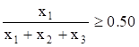 veya 0.5X1 – 0.5X2 – 0.5X3 ≥ 0

**3**. Eğlence ve dinlenme alanlarıyla ilgili kısıt

 veya 100X4 – X1 – X2 –X3 ≥ 0

**4**. Su getirme maliyeti ile ilgili bütçe kısıtı

1500X1 + 1700X2 + 1900X3 + 1000X4 ≥ 200000

**5**. Günlük su tüketimi ile ilgili kısıt

500X1 + 800X2 + 950X3 + 560X4 ≤ 200000

Negatif olmama koşulu

X1, X2, X3, X4 ≥ 0

*7*. **Kesim Kaybı ya da Stok Kesim Problemleri**: Standart boyutlara sahip
ürünlerin (kağıt, kumaş, kereste, boru vb.) satandart dışı boyutlarda
kesilmesiyle oluşan kesim kayıpları önemli sorun olabilmektedir. Doğrusal
programlama bu sorunun çözülmesinde kullanılan etkin tekniklerden biridir.

**Örnek 2.10**: Park Parke AŞ 17 m uzunluğunda standart kereste üretmektedir.
Farklı boylardaki siparişler standart keresteler kesilerek karşılanmaktadır.
Siparişler genellikle 25 adet 3 m, 20 adet 5 m ve 15 adet 9 m uzunluğunda
olmaktadır. Standart boydaki keresteler bu siparişlere göre kesilmektedir. Bu
sipariş için kesim sonucu oluşacak toplam kaybın en küçük olmasını sağlayacak
kesim planı nasıl olmalıdır?

**Çözüm 2.10**: Burada amaç siparişi (kısıtlayıcılar) en az kesim kaybıyla
karşılamaktır. İşletme, 17 m uzunluğundaki standart keresteleri nasıl keseceğine
karar vermek durumundadır. Bu konuda karar verebilmek için bir standart
kerestenin uygun kesim biçimlerinin kararlaştırılması gerekir. Sözgelimi 17 m
uzunluğundaki standart kereste üç adet 5 metreye bölünebilir. Bu durumda kesme
kaybı 2 m olur. Kesim 2 adet 3 m, 2 adet de 5 m şeklinde de
gerçekleştirilebilir. Bu durumda kayıp 1 m olur. Standart kereste 4 adet 2 m, 1
adet de 9 metrelik parçalar halinde de kesilebilir. Bu durumda kayıp söz konusu
olmaz. Olası kesim biçimlerinin tümünün dikkate alınmasına gerek yoktur. Söz
gelimi standart kerestenin 9 m ve 5 m olarak kesilmesi hiç akıllıca olmaz, çünkü
bu durumda kayıp 3 metre olur. Genel olarak kesme kaybının 3 veya daha fazla
olmasına yol açan kesme alternatiflerinin dikkate alınmasına gerek yoktur. Bu
durum göz önünde bulundurularak belirlenen alternatif kesim biçimleri aşağıdaki
tabloda listelenmiştir.

| Kombinasyon No | 3 m’lik Parça Sayısı | 5 m’lik Parça Sayısı | 9 m’lik Parça Sayısı | Kayıp (m) |
|----------------|----------------------|----------------------|----------------------|-----------|
| 1              | 5                    | 0                    | 0                    | 2         |
| 2              | 4                    | 1                    | 0                    | 0         |
| 3              | 2                    | 2                    | 0                    | 1         |
| 4              | 2                    | 0                    | 1                    | 2         |
| 5              | 1                    | 1                    | 1                    | 0         |
| 6              | 0                    | 3                    | 0                    | 2         |

Modeli matematiksel olarak açıklayabilmek için öncelikle karar değişkenleri
tanımlanmalıdır. Karar değişkenleri i (i = 1, 2, 3, 4, 5, 6) kombinasyonuna göre
kesilecek standart kereste sayısı olarak tanımlanabilir. Buna göre,

Xi = i kombinasyonuna göre kesilen standart kereste sayısı

olsun.

Amaç fonksiyonunu oluşturmak için toplam kesim kaybının belirlenmesi gerekir.
Toplam kesim kaybı uzunluğu, kesilen standart kereste uzunluğu ile siparişin
toplam uzunluğu arasındaki farka eşittir. Söz konusu büyüklükler aşağıda
hesaplandıkları gibidir.

Siparişin toplam uzunluğu = 25(3) + 20(5) + 15(9) = 310 m

Kullanılan standart kereste uzunluğu = 17(X1 + X2 + X3 + X4 + X5 + X6)

Buna göre, toplam kesim kaybı aşağıdaki gibi olur.

Toplam kesim kaybı (m) = 17X1 + 17X2 + 17X3 + 17X4 + 17X5 + 17X6 – 310

Amaç bu toplamı en küçüklemek olduğundan Z aşağıdaki gibi formüle edilir.

Zenk = 17X1 + 17X2 + 17X3 + 17X4 + 17X5 + 17X6 – 310

Amaç fonksiyonunda bulunan sabitin göz ardı edilmesi problemin en iyi çözümünü
etkilemeyeceğinden, amaç fonksiyonu 17X1 + 17X2 + 17X3 + 17X4 + 17X5 + 17X6
olarak kabul edilebilir. Ayrıca fonksiyonun tüm değerlerinin aynı sayıya
bölünmesi (burada 17) de değişkenlerin çözüm değerlerini etkilemez. Buna göre
problemin orijinal amaç fonksiyonu yerine, daha basit olan X1 + X2 + X3 + X4 +
X5 + X6 toplamı alınabilir. Buna göre amaç fonksiyonu,

Zenk = X1 + X2 + X3 + X4 + X5 + X6

olur.

Bu toplamın ortaya koyduğu gibi, toplam kesim kaybının en küçük olması için
kesilen standart kereste sayısı en küçük olmalıdır.

Siparişin incelenmesinin ortaya koyduğu gibi problemin kısıtlayıcıları aşağıdaki
gibi açıklanır.

Kısıt 1: En az 25 adet 3 m’lik parça

Kısıt 2: En az 20 adet 5 m’lik parça

Kısıt 3: En az 15 adet 9 m’lik parça

3 metrelik parçaların toplam sayısı 5X1 + 4X2 + 2X3 + 2X4 + 1X5 olduğundan ilk
kısıtlayıcı aşağıda gösterildiği gibidir.

5X1 + 4X2 + 2X3 + 2X4 + 1X5 ≥ 25

Benzer şekilde ikinci ve üçüncü kısıtlayıcı fonksiyonlar şöyledir:

X2 + 2X3 + X5 + 3X6 ≥ 20

X4 + X5 ≥ 15

Negatif olmaması yanında Xi’nin tamsayı değer alması gerektiği açıktır.

Böylece problemin modeli,

Zenk = X1 + X2 + X3 + X4 + X5 + X6

5X1 + 4X2 + 2X3 + 2X4 + 1X5 ≥ 25 (3 m kısıtı)

X2 + 2X3 + X5 + 3X6 ≥ 20 (5 m kısıtı)

X4 + X5 ≥ 15 (9 m kısıtı)

X1, X2, X3, X4, X5, X6 ≥ 0

olarak formüllenir.

*8*. **Nöbet Çizelgeleme**: Doğrusal programlama nöbet çizelgelerinin
oluşturulmasında, ders programlarının hazırlanmasında, postacıların çalışma
günlerinin düzenlen- mesinde, taşıt çizelgelenmesinde de kullanılmaktadır. Nöbet
çizelgeleme durumu, aşağıdaki problemle örneklenebilir.

**Örnek 2.11**: Bir işyerinde haftanın günlerine göre tam-gün çalışması
gerekenlerin sayısı aşağıdaki tabloda gösterilmiştir. Yasa gereği çalışanlar beş
gün arka arkaya çalışmakta, arka arkaya 2 gün de tatil yapmaktadırlar.
Sözgelimi, Pazartesi-Cuma çalışan biri Cumartesi-Pazar, Perşembe-Pazartesi
çalışan biri Salı-Çarşamba izin yapmaktadır.

Günlük işgücü gereksinimini eksiksiz karşılayacak ve çalışan sayısının en az
olmasını sağlayacak modeli kurunuz.

| Gün       | Gereksinim |
|-----------|------------|
| Pazartesi | 27         |
| Salı      | 23         |
| Çarşamba  | 18         |
| Perşembe  | 19         |
| Cuma      | 11         |
| Cumartesi | 14         |
| Pazar     | 10         |

**Çözüm 2.11**: Burada amaç çalışan sayısını, günlük gereksinimi eksiksiz
karşılamak koşuluyla en az yapmaktır. Görüldüğü gibi, değişkenlerin tanımları
çok belirgin değildir. Değişken tanımıyla ilgili bu belirsizlik değişkenlerin
“Xi i (i = 1, 2, ..., 7) gününün gerektirdiği çalışan sayısı” olarak
tanımlanmasına yol açar. Bu tanıma göre “çalışanların sayısı = Pazar çalışanlar
\+ Pazartesi çalışanlar + ... + Cumartesi çalışanlar” olur. Dolayısıyla amaç
fonksiyonu aşağıdaki gibi belirtilir.

Zenk = X1 + X2 + X3 + X4 + X5 + X6 + X7

Kısıtlayıcılar da günlük gereksinimin eksiksiz karşılanmasını sağlamak üzere
aşağıdaki gibi tanımlanır.

X1 ≥ 17 (Pazartesi çalışması gerekenlerin sayısı)

X2 ≥ 13 (Salı çalışması gerekenlerin sayısı)

X3 ≥ 15 (Çarşamba çalışması gerekenlerin sayısı)

X4 ≥ 19 (Perşembe çalışması gerekenlerin sayısı)

X5 ≥ 14 (Cuma çalışması gerekenlerin sayısı)

X6 ≥ 16 (Cumartesi çalışması gerekenlerin sayısı)

X7 ≥ 11 (Pazar çalışması gerekenlerin sayısı)

Dikkatli bir incelemeyle bu formülasyonun kusurlu olduğu görülebilir.
Kusurlardan birisi amaç fonksiyonunun çalışan sayısını göstermemesi, her bir
çalışanı beş kez saymasıdır. Mesela ilk iş günü Pazartesi olan biri
Pazartesi-Cuma çalışmaktadır. Bu da X1, X2, X3, X4, X5’in kapsanması demektir.
Diğer kusur ise formülasyonun değişkenler arasındaki ilişkiyi yansıtmamasıdır.
Sözgelimi Pazartesi çalışanlar (X1) Salı da çalışıyor (X2) olacağından, X1 ile
X2 ilişkilidir. Oysa kısıtlar bu ilişkiyi yansıtmamaktadır.

Aşağıdaki şeklin de ortaya koyduğu gibi problemin doğru formülasyonu için
(değişkenler günlere göre çalışanların sayısı olarak değil, herhangi bir günün
başında çalışmaya başlayanların sayısı olarak tanımlanmalıdır.

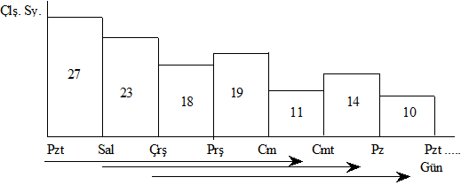

**Şekil 2.1**

# Örnek 2.11’in Değişkenleri

Buna göre modeldeki değişkenler aşağıdaki gibi tanımlanır.

Xi = i günü başında işe başlayanların sayısı

Buna göre, X1 Pazartesi işe başlayanların (bunlar cumaya kadar çalışırlar)
sayısı olur. Uygun ve doğru biçimde tanımlanmış bu değişkenlerin kullanılmasıyla
amaç fonksiyonu ile kısıtlayıcı fonksiyonlar aşağıdaki gibi formüle edilir. Amaç
fonksiyonunu formüle etmek için,

Tam gün çalışanların sayısı = (Pazartesi çalışmaya başlayanların sayısı) + (Salı
çalışmaya başlayanların sayısı) + ... + (Pazar çalışmaya başlayanların sayısı)

olduğunu gözönünde bulunduralım.

Her bir çalışan tam olarak haftanın bir gününün başlangıcında işe
başlayacağından, bu açıklama çalışanları sadece bir kez sayar. Buna göre, amaç
fonksiyonu,

Zenk = X1 + X2 + X3 + X4 + X5 + X6 + X7

olur.

İşveren her günün gerektirdiği sayıda işçinin çalışmasını sağlamak durumundadır.
Söz gelimi Pazartesi günü en az 17 kişi çalışmalıdır. Pazartesi çalışanlar
kimlerdir? Salı veya Çarşamba günü başında işe başlayanların dışındakilerdir.
Zira Salı günü başlayanlar Pazar, Pazartesi; Çarşamba işe başlayanlar Pazartesi,
Salı izin yapmaktadırlar. Bu demektir ki, Pazartesi çalışanların sayısı X1 + X4
\+ X5 + X6 + X7 toplamına eşittir. Bu toplamın en az 17 ye eşit olması
gerektiğinden,

X1 + X4 + X5 + X6 + X7 ≥ 17

yazılır.

Bu eşitsizlik Pazartesi günü çalışanların sayısı ile ilgili kısıtlayıcıdır.
Benzer kısıtlayıcıların haftanın diğer günleri için yazılması ve negatif olmama
koşulunun eklenmesiyle problemin doğru modeli aşağıdaki gibi formüllenmiş olur.

Zenk = X1 + X2 + X3 + X4 + X5 + X6 + X7

X1 + X4 + X5 + X6 + X7 ≥ 27 (Pazartesi çalışanların sayısı)

X1 + X2 + X5 + X6 + X7 ≥ 23 (Salı çalışanların sayısı)

X1 + X2 + X3 + X6 + X7 ≥ 18 (Çarşamba çalışanların sayısı)

X1 + X2 + X3 + X4 + X7 ≥ 19 (Perşembe çalışanların sayısı)

X1 + X2 + X3 + X4 + X5 ≥ 11 (Cuma çalışanların sayısı)

X2 + X3 + X4 + X5 + X6 ≥ 14 (Cumartesi çalışanların sayısı)

X3 + X4 + X5 + X6 + X7 ≥ 10 (Pazar çalışanların sayısı)

X1, X2, X3, X4, X5, X6, X7 ≥ 0

Doğrusal programlamanın uygulama alanlarından olan kuruluş yeri seçimi, proje
yönetimi, stok planlanması ve oyun problemleri özel bilgi gerektirdiğinden bu
tür problemlerin modellenmesi üzerinde durulmayacaktır.

## 

## 

## 

## PROBLEMLER

**1**. Gülüm AŞ kuru ciltlerin bakımı için KUR, yağlı ciltlerin bakımı için YAĞ
ve normal ciltlerin bakımı için NOR marka krem üretmeyi planlamaktadır.
Ürünlerin satışa hazır duruma gelmesi için dört ayrı işlem biriminde işlem
görmesi gerekmektedir. İşletmenin işlem birimlerinin haftalık çalışma
kapasiteleri (saat/hafta olarak) ve her ürünün 10 adetinin gerektirdiği işlem
süreleri aşağıdaki gibidir.

|          | İşlem Birimi |    |     |    |
|----------|--------------|----|-----|----|
| Krem     | I            | II | III | IV |
| KUR      | 3            | 2  | 1   | -  |
| YAĞ      | 4            | 2  | 3   | 1  |
| NOR      | 6            | 8  | 1   | 3  |
| Kapasite | 80           | 40 | 25  | 35 |

İşletmenin elinde üç ürünün her birinden 300’er şişe üretecek hammaddesi
bulunmasına karşın elindeki şişe adeti toplamı 850’dir. Diğer taraftan, yapılan
pazar araştırmaları KUR marka kremin haftalık üretim miktarının en fazla 250
şişe, NOR marka kremin ise en az 250 şişe olması gerektiğini ortaya çıkarmıştır.
KUR marka kremin şişesinden 75 TL, YAĞ marka kremin şişesinden 90 TL, NOR marka
kremin şişesinden 60 TL kr elde edilmektedir. İşletmenin krını en büyükleyecek
üretim planının belirlenmesinde kullanılacak doğrusal programlama modelini
kurunuz.

**2**. Bebek maması üreten bir işletme piyasaya özel ambalajlı paketler halinde
yeni bir tip bebek maması sürmeyi planlamaktadır. Üretim A, B ve C
hammaddelerinin karışımıyla gerçekleştirilmektedir. A’nın birim maliyeti 40 TL,
B’nin birim maliyeti 60 TL, C’nin ise 75 TL’dir. A, B ve C hammaddelerinde
bulunan karbonhidrat, protein ve yağ miktarları aşağıdaki tabloda
gösterilmiştir.

| Besin        | Hammadde (kg) |   |   |
|--------------|---------------|---|---|
| Elemanı      | A             | B | C |
| Karbonhidrat | 6             | 3 | 2 |
| Protein      | 2             | 8 | 9 |
| Yağ          | 5             | 9 | 1 |

Yeni tip mamanın her bir paketinde bulunması gereken en düşük karbonhidrat
miktarı 20 birim, en düşük protein miktarı 25 birim, en düşük yağ miktarı 10
birimdir. Bu bilgilerin ışığı altında en küçük maliyetle üretime olanak
sağlayacak doğrusal programlama modelini kurunuz.

**3**. 20 ton taşıma kapasitesi olan bir taşımacılık şirketi tüm kapasitesini
taşınabilir üç değişik mal için kullanmayı planlamaktadır. Taşınabilecek
mallarla ilgili bilgiler aşağıdaki tabloda verilmiştir.

| Mal | Birim Ağırlık (ton) | Ton Başına Kr (TL) |
|-----|---------------------|--------------------|
| A   | 2                   | 300                |
| B   | 4                   | 250                |
| C   | 3                   | 450                |

İşletme, toplam taşıma kapasitesinin en fazla %10’luk kısmını A için kullanmak
istemektedir. Ayrıca, B’den taşıyacağı miktarın C’den taşıyacağı miktardan az
olmamasını da garanti etmek istemektedir. İşletmenin taşıyacağı yükten elde
edeceği kârı en büyükleyecek taşıma planının programlanmasında kullanılacak
doğrusal programlama modelini kurunuz.

**4**. Pil üreticisi bir işletmenin, pillerinin kalite kontrolünü
gerçekleştirdiği biri klasik diğeri modern olmak üzere iki aygıtı vardır.
İşletme 8 saatlik bir iş gününde en az 6500 adet pilin kontrol edilmesini
istemektedir. Modern aygıt bir saat içinde 25 pili %98 doğrulukla kontrol
ederken, klasik aygıt aynı süre içinde 14 pili %95 doğrulukla kontrol
etmektedir. Modern aygıtta çalışan denetmenlerin ücreti saat başına 75 TL,
klasik aygıtta çalışanların ücreti ise saat başına 60 TL’dir. Her bir hatalı
kontrolün işletmeye maliyeti 8 TL’dir. Modern aygıtta 10, klasik aygıtta 8
denetmen çalışmaktadır. İşletme kalite kontrolünü en düşük maliyetle
gerçekleştirmek amacıyla her bir aygıtta çalışacak denetmen sayısını belirlemek
istemektedir. Buna göre, problemin doğrusal programlama modelini kurunuz.

**5**. Bir reklam ajansı, yeni bir deterjanın tüketiciye tanıtımı için bir
reklam kampanyası hazırlamaktadır. Kampanya sırasında iletişim araçlarında beş
tür reklam yapılması düşünülmektedir. Kullanılacak iletişim araçları ile
yapılması düşünülen reklamlar ve bunların bazı özellikleri aşağıdaki tabloda
sunulmuştur.

|                          | Yerel TV | Yerel Radyo | Günlük |       |        |
|--------------------------|----------|-------------|--------|-------|--------|
|                          | Gündüz   | Akşam       | Gündüz | Akşam | Gazete |
| Rbb\* Maliyet            |  600     |  800        | 150    | 300   | 160    |
| İzleyici Kitle Büyüklüğü | 1000     | 1750        | 290    | 490   | 120    |
| Etkilenen Kişi Sayısı    |  600     | 1200        | 240    | 360   | 90     |

Rbb\*: Reklam birimi başına

Şirket, kampanyada 50 milyon TL’den daha fazla harcama yapmak istememektedir.
Ayrıca, diğer istenenler aşağıda açıklanmıştır.

**a**. Günlük gazetedeki reklamlar için en fazla 25 milyon TL harcanabilir.

**b**. Televizyondaki reklamların sayısı en az 36 olmalıdır.

**c**. Radyodaki reklamların maliyeti televizyondaki reklamların maliyetini
aşmamalıdır.

**d**. Reklamları izleyecek kişi sayısı en az 3000 olmalıdır.

Kampanyadan etkilenen kişi sayısının en büyük olmasını sağlayan doğrusal
programlama modelini kurunuz.

**6**. Güzel Koku AŞ biri kadınlar diğeri erkekler için iki çeşit kolonya
üretmeyi planlamaktadır. Her iki ürünün üretiminde tek bir hammadde
kullanılmaktadır. 1 gram hammaddenin işletmeye maliyeti 60 TL’dir. 10 gram
hammaddenin işlenmesi sonucunda 3 gram kadın kolonyası veya 4 gram erkek
kolonyası elde edilmektedir. İşletme, gram başına kadın kolonyasından 20 TL,
erkek kolonyasından 15 TL kr beklemektedir. İşletmenin kolonyalar üzerinde işlem
yapıp parfüm üretme şansı da vardır. 10 gram kadın kolonyasından 1 gram kadın
parfümü elde edebilmek için 1,5 saat laboratuar zamanı gerekmekte bu ise,
işletmeye 5 TL’ye malolmaktadır. 10 gr erkek kolonyasından 1 gr erkek parfümü
elde edebilmek için 1 saat laboratuar zamanı gerekmekte bunun işletmeye maliyeti
3 TL olmaktadır. İşletme gram başına kadın parfümünden 35 TL, erkek parfümünden
25 TL kr beklemektedir. İşletmenin yıllık çalışma kapasitesi 6000 saattir ve
yıllık hammadde alışı en fazla 40 kg’dır. İşletmenin amacı, en yüksek krı elde
edebilmek için her bir üründen kaçar gram üretmesi gerektiğini ve satın alması
gereken hammadde miktarını belirlemek olduğuna göre problemi doğrusal
programlama modeli olarak formüle ediniz.

**7**. Bir çiftçinin mısır, buğday ve arpa ürünlerinin ekiminde kullanabileceği
800 dönümlük toprağı ve haftada 40 saat işgücü vardır. Dönüm başına ürün
verimlilikleri mısır için 4 ton, buğday için 3 ton ve arpa için 2 tondur. Dönüm
başına olmak üzere mısır tarımı için haftada 4 saat, buğday tarımı için haftada
10 saat, arpa tarımı için ise haftada 3 saat işgücü gerekmektedir. 1 ton mısırın
satış fiyatı 200 TL, 1 ton buğdayın satış fiyatı 400 TL, 1 ton arpanın satış
fiyatı ise 100 TL’dir. Yasal düzenlemeler yıllık buğday üretim miktarının en az
40 ton olmasını öngörmektedir. Çiftçinin amacı toplam satış gelirini en
büyüklemek olduğuna gore, hangi ürüne ne kadarlık ekim alanı ayrılması
gerektiğini bulunuz.

**8**. Bir yatırımcının elindeki 2.5 milyar TL’sini 5 yıl boyunca yatırabileceği
X, Y, Z, W gibi dört ayrı yatırım seçeneği vardır. Y’nin ikinci, W’nin ise
dördüncü yılın başından önce değerlendirilmesi söz konusu değildir. X’e
yatırılan 1 TL iki yıl sonra 1.70 TL, Y’ye yatırılan 1 TL üç yıl sonra 1.90 TL,
Z’ye yatırılan 1 TL dört yıl sonra 2.4 TL, W’ye yatırılan 1 TL 1 yıl sonra 1.30
TL olarak geri alınmaktadır. Altıncı yılın başında yatırımcının toplam parasının
en büyük olmasını sağlayacak yatırım planını bir doğrusal programlama problemi
olarak formüle ediniz.

**9**. Bir yatırımcının 5 milyar TL’sini değerlendirebileceği 4 ayrı yatırım
seçeneği vardır. Her bir yatırım seçeneğine yatırılabilecek para miktarı
sınırlıdır. Yatırım seçenekleri ve bunlarla ilgili bazı bilgiler aşağıdaki
tabloda verilmiştir.

| Yatırım  Seçeneği | Getiri Oranı (%) | Risk Katsayısı | Yatırım İçin Üst Sınır |
|-------------------|------------------|----------------|------------------------|
| A                 | 37               | 3              | 1.5 milyar             |
| B                 | 28               | 1              | 2.0 milyar             |
| C                 | 40               | 4              | 1.0 milyar             |
| D                 | 38               | 3              | 3.5 milyar             |

Yatırımcının amacı aşağıdaki kısıtlayıcıları sağlayacak ve portföyün getirisini
en büyük yapacak çözümü araştırmaktadır. Problemi modelleyiniz.

**a**. Elde bulunan paranın tümü değerlendirilmelidir.

**b**. A için ayrılan para B için ayrılan paradan fazla olmamalıdır.

**c**. C için ayrılan para oranı A ve B için ayrılandan fazla olmamalıdır.

**d**. Portföyün ortalama riski 6’yı geçmemelidir.

**10**. Bir hastane yöneticisi hemşirelerin nöbet çizelgesini oluşturmaya
çalışmaktadır. Bu amaçla bir gün her biri dört saatlik 6 periyoda ayrılmıştır.
Periyotlar ve her periyotta gerek duyulan en az hemşire sayıları aşağıdaki
tabloda verilmiştir.

| Periyot       | Hemşire Sayısı |
|---------------|----------------|
| 08:00 – 12:00 | 40             |
| 12:00 – 16:00 | 20             |
| 16:00 – 20:00 | 60             |
| 20:00 – 24:00 | 18             |
| 24:00 – 04:00 | 10             |
| 04:00 – 08:00 | 12             |

Hemşireler ard arda 2 periyotta çalışıp diğer periyotlarda dinlenmektedir.
Hastanenin günlük hemşire gereksinimini karşılayan ve hemşire sayısını en
küçükleyen doğrusal programlama modelini kurunuz.

**11**. Kalite Kağıt Sanayii 30 cm uzunluğunda standart kağıt bobin
üretmektedir. Farklı uzunlukta bobin sipariş edilmesi durumunda siparişler
standart bobinler kesilerek karşılanmaktadır. Kalite Kağıt Sanayii, aşağıdaki
siparişi kesme kaybını en küçük yapacak şekilde karşılamak istemektedir.
İşletmenin problemini doğrusal programlama olarak modelleyiniz.

| İstenen Uzunluk | Bobin Sayısı |
|-----------------|--------------|
| 3               | 200          |
| 5               | 250          |

### *Bölüm 3*

### *GRAFİKLE ÇÖZÜM YÖNTEMİ*

## 3.1 GİRİŞ

Doğrusal programlama problemlerinin çözümü için çeşitli yöntemler
geliştirilmiştir. Bu bölümde, grafikle çözüm yöntemi örnek problemler
çerçevesinde açıklanacaktır. Doğrusal programlama problemlerinin grafik
çözümleri oldukça açık ve kolay anlaşılır bir özelliğe sahiptir. Ancak, yöntemin
uygulanabilmesi için problemin iki ya da en fazla üç değişkenli olması gerekir.
Bilindiği gibi, iki değişkenli problemlerin çözümü düzlemde, üç değişkenli
problemlerin çözümü üç boyutlu uzayda gerçekleştirilir. Çok sayıda (3 veya daha
fazla) değişken varsa grafikle çözüm çok zor hatta olanaksızdır. Özetle,
grafikle çözümün uygulama alanı değişken sayısı ile sınırlandırılmıştır.
Grafiklerde basitlik, anlatımda sadelik sağlamak bakımından bu bölümde yalnızca
iki değişkenli doğrusal programlama problemleri ele alınacaktır.

## 3.2 GRAFİKLE ÇÖZÜM YÖNTEMİ

Grafikle çözüm yöntemine geçmeden önce iki değişkenli doğrusal eşitlik ve
eşitsizliklerin koordinat sisteminde görüntülenmeleri üzerinde duralım. Genel
olarak, A veya B’den en az biri sıfırdan farklı olmak üzere A, B ve C sabit
sayılar olarak alındığında,

AX + By + C = 0

denklemi bir doğru belirler. Bu doğru denkleminin kartezyen düzlemde (Xy
koordinat sisteminde) bir doğru ile temsil edildiği ve bir doğrunun iki
noktasıyla belirlendiği dikkate alınırsa istenilen grafik kolayca çizilir.
Aranan doğrunun herhangi iki noktası değişkenlerden birine (X veya y) herhangi
iki değer verip denklemden karşılık gelen diğer değişken (y veya X) değerlerinin
bulunmasıyla belirlenir. Doğrunun herhangi iki noktası yerine eksenleri kestiği
noktaları bulmak hesaplamalarda büyük kolaylık sağlar. Bunun için denklemde X =
0 koyarak karşılığındaki y değerini, y = 0 koyarak karşılığındaki X değerini
hesaplamak yeterli olur. Bunlar doğrunun sırasıyla, y ve X eksenlerini kestiği
noktaların koordinatlarıdır. O halde, AX + By + C = 0 doğrusu (0, -C/B) ve
(-C/A, 0) noktalarından geçer.

**Örnek 3.1**: Örnek olmak üzere 2X + 3y - 6 = 0 doğrusunu görüntüleyelim.

**Çözüm 3.1**: X = 0 için, 2(0) + 3y - 6 = 0 çözülürse, y = 2 (X, y) = (0, 2)

y = 0 için, 2X + 3(0) - 6 = 0 çözülürse, X = 3 (X, y) = (3, 0)

bulunur. Buna göre, denklemi 2X + 3y - 6 = 0 olan doğru (0, 2) ve (3, 0)
noktalarından geçer. Bu doğrunun grafiği Şekil 3.1’de gösterilmiştir.

**Şekil 3.1**

**2X + 3y - 6 = 0 Doğrusunun Gösterimi**

Kısıtlayıcı fonksiyonların genellikle eşitsizlik biçiminde belirdikleri
düşünülürse, bu formdaki denklemlerin grafikle gösteriminin önemi ortaya çıkar.
Bilindiği gibi, bir doğru denklemi A, B ve C sabit sayılar ve A ile B birlikte
sıfır olmamak üzere aşağıdaki gibi ifade edilmektedir.

AX + By + C = 0

Böyle bir doğru düzlemi üç bölgeye ayırır. Bu bölgeler aşağıdaki denklemlerle
tanımlanırlar.

AX + By + C = 0

AX + By + C ≥ 0

AX + By + C ≤ 0

Eşit işaretli birinci denklem bir doğru, diğer ikisi ise bu doğrunun altında
veya üstünde (bazı durumlarda sağında veya solunda) kalan birer alan
tanımlarlar. Doğrusal eşitsizliklerin koordinat sisteminde nasıl görüntüleneceği
ile ilgili bütün problemler bu iki alanın ayırdedilmesini gerektirir. Herhangi
bir eşitsizliğin belirlediği alanı görüntülemek için öncelikle eşitsizlik
biçimindeki denklemin eşitlik şeklinde düşünülmesi ve = işaretli denklemin
belirlediği doğrunun çizilmesi gerekir. Doğrunun çizilmesinden sonra doğru
üzerinde bulunmamak koşuluyla keyfi olarak seçilen bir noktanın koordinatları
eşitsizlikte yerine konur. Eşitsizliğin sağlanması durumunda, aranan bölgenin
keyfi olarak seçilen noktanın bulunduğu tarafta olduğu kararlaştırılır. Aksi
halde, aranan bölgenin diğer tarafta bulunduğu kararlaştırılır. İşlemlerde
basitlik sağlamak için keyfi olarak seçilen nokta (doğrunun orijinden geçmemesi
koşuluyla) genellikle orijin olur. Eşitsizlik biçimindeki bir fonksiyonun
düzlemde nasıl görüntüleneceğini aşağıdaki örnek üzerinde açıklayalım.

**Örnek 3.2**: 3X + 5y - 15 ≥ 0 eşitsizliğini görüntüleyiniz.

**Çözüm 3.2**: İlk olarak verilen eşitsizliği eşitlik biçiminde (3X + 5y - 15 =
0) düşüne- rek doğrunun geçtiği iki noktayı belirleyelim.

X = 0 için 3(0) + 5y - 15 = 0 çözülürse, y = 3 (X, y) = (0, 3)

y = 0 için 3X + 5(0) - 15 = 0 çözülürse, X = 5 (X, y) = (5, 0)

bulunur. Demek ki, bu doğru X eksenini (5, 0), y eksenini de (0, 3) noktasında
kesmektedir. Bu iki noktayı birleştiren doğrunun çizilmesinden sonra
eşitsizlikte X = 0, y = 0 konulduğunda, 3(0) + 5(0) -15 = -15 bulunur. Orijin
eşitsizliği gerçeklemediğinden (-15 0 ) aranan bölgenin orijinin bulunmadığı
tarafta, yani doğrunun yukarısında kaldığı kararlaştırılır. Bu bölgeyi taramadan
önce eşitsizliğin (≥ veya ≤) ya da (≥, ≤) şeklinde olup olmadığına dikkat
edilmesi gerekir. Eşitsizlik (≥) veya (≤) ise, çözüm bölgesi doğru üzerindeki
noktaları da kapsar. Bu durumda doğru genellikle dolu çizgiyle görüntülenir.
Eşitsizlik (≥) veya (≤) şeklinde ise, çözüm alanı doğru üzerindeki noktaları
kapsamaz. Bu durumda doğru, kesikli çizgi ile gösterilir. Örnekteki eşitsizlik
doğru üzerindeki noktaları kapsamadığından, Şekil 3.2’de kesikli çizgi ile
gösterilmiştir.

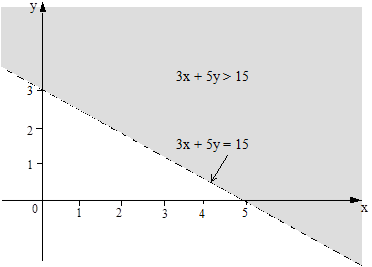

**Şekil 3.2**

**3X + 5y ≥ 15 Bölgesinin Gösterimi**

Bir doğrusal programlama probleminde genellikle birden çok kısıtlayıcı vardır.
Bu nedenle iki ya da daha fazla sayıdaki doğrusal eşitsizliğin belirlediği
alanın araştırılması önemlidir. İki ya da daha fazla eşitsizliğin belirlediği
bölgenin araştırılması işlemleri ile tek eşitsizliğin tanımladığı bölgenin
araştırılması işlemleri birbirlerinden çok farklı değildir. Ancak, eşitsizlik
sayısı arttıkça işlem sayısı da artar. İki ya da daha fazla sayıda eşitsizliğin
oluşturduğu bir sistemin çözümü eşitsizliklerin tümünü sağlayan noktaların
oluşturduğu kümeden başka bir şey değildir.

İki eşitsizliğin aynı grafikte görüntülenmesini aşağıdaki örnek üzerinde
açıklayalım.

**Örnek 3.3**: X + 2y - 4 ≤ 0 ve X - y + 1 ≤ 0 eşitsizlik çifti tarafından
belirlenen çözüm bölgesini bulunuz.

**Çözüm 3.3**: Her iki eşitsizliği sağlayan alanlar önceki örneklerde olduğu
gibi ayrı ayrı bulunur ve farklı yönlerde taranırsa Şekil 3.3’deki taralı alan
elde edilir. Bu alana dahil noktalar iki eşitsizliği aynı anda sağladığından
aranan çözüm bölgesini oluştururlar. Taralı alanın belirlenmesi için önce
birinci eşitsizliği ele alalım.

X + 2y = 4 eşitliğinde, X = 0 için y = 2, y = 0 için X = 4 elde edilir.

İkinci olarak X - y = -1 eşitliğinde, X = 0 için y = 1, y = 0 için X = -1
bulunur.

Bu belirlemelerden sonra doğruların çizilmesi ve eşitsizliklerin yönlerinin
dikkate alınmasıyla elde edilen grafik Şekil 3.3’de gösterilmiştir.

**Şekil 3.3**

**Örnek 3.3’ün Gösterimi**

**Örnek 3.4**: Aşağıdaki eşitsizlikler sisteminin çözümünü grafik yöntemiyle
bulunuz.

X + 2y - 4 ≤ 0, X + 2y - 6 ≥ 0

**Çözüm 3.4**: Eşitsizliklerin belirlediği doğruların görüntülenmeleri için
doğruların X ve y eksenlerini kestiği noktaları ayrı ayrı belirleyelim.

Söz konusu noktaların koordinatları aşağıda verilmiştir.

X + 2y = 4 eşitliğinde X = 0 için y = 2, y = 0 için X = 4

X + 2y = 6 eşitliğinde X = 0 için y = 3, y = 0 için, X = 6

Doğruların çizilmesinden sonra eşitsizlikleri sağlayan alanlar önceki örneklerde
olduğu gibi ayrı ayrı bulunur ve taranırsa, Şekil 3.4’deki taralı alanlar elde
edilir. Eşitsizlikleri ayrı ayrı sağlayan iki bölgenin ortak herhangi bir
noktası olmadığı kolayca görülebilir. Bu durum sistemin çözümünün olmadığının
kanıtıdır.

**Şekil 3.4**

##### Örnek 3.4’ün Grafikle Gösterimi

Daha önce belirtildiği gibi, grafikle çözüm en fazla üç değişkenli problemlerde
herhangi bir karışıklığa neden olmadan kullanılabilir. Gerçek doğrusal
programlama problemlerinin genellikle çok sayıda değişken ve kısıtlayıcı
içerdiği düşünülürse, grafikle çözüm üzerinde durmanın gereksiz olduğu
düşünülebilir. Uygulama alanı değişken sayısı ile sınırlı da olsa grafikle çözüm
doğrusal program lamanın biçimsel bakımdan açıklanmasında olduğu kadar, dördüncü
bölümde açıklanan simpleks yöntemin kurallarına açıklık getirmesi bakımından son
derece yararlıdır. Hangi yöntem kullanılırsa kullanılsın doğrusal programlama
problemlerinin çözümüne ulaşmak için çözümün anlamı ve özelliklerinin
anlaşılması gerekir.

**Çözüm**: Bir doğrusal programlama probleminin kısıtlayıcı fonksiyonlarının
hepsini birden sağlayan karar değişkenlerinin (X1, X2, ..., Xn) oluşturduğu
kümeye *çözüm* denir.

**Uygun çözüm**: Negatif olmama koşulunu sağlayan çözüme *uygun çözüm* denir.

**En iyi çözüm**: Amaç fonksiyonuna en iyi değeri (en küçük veya en büyük)
sağlayan uygun çözüme *en iyi çözüm* denir.

Bir doğrusal programlama probleminin grafik çözümünde aşağıdaki adımlar izlenir:

*1*. Değişkenlerin koordinat sisteminin yatay ve dikey eksenlerine
yerleştirilmesi,

*2*. Kısıtlayıcı fonksiyonların grafiğinin çizilmesi,

*3*. Uygun çözüm bölgesinin belirlenmesi,

*4*. En iyi çözümün araştırılması.

Bu adımları aşağıdaki örnek problem üzerinde açıklayalım.

**Örnek 3.5**: Amaç fonksiyonu:

Zenb = 6X1 + 8X2

Kısıtlayıcı fonksiyonları:

7X1 + 3X2 ≤ 21 (1)

6X1 + 7X2 ≤ 42 (2)

X1 ≤ 3 (3)

X2 ≤ 4 (4)

Negatif olmama koşulu:

X1, X2 ≥ 0

olarak verilen doğrusal programlama problemini grafik yöntemiyle çözünüz.

**Çözüm 3.5**: X1 değişkenini yatay, X2 değişkenini dikey eksen üzerinde
gösterelim. Negatif olmama (X1 ≥ 0, X2 ≥ 0) koşulundan dolayı uygun çözümler
X1X2 düzleminin birinci bölgesinde bulunacaktır. Kısıtlayıcı fonksiyonların
oluşturduğu sınır, bu bölgeyi (X1 ≥ 0, X2 ≥ 0) iki kısma ayırır. Bölgelerden
biri negatitif olmama koşulu dahil tüm kısıtlayıcıları sağlarken, diğeri
yalnızca negatif olmama koşulunu sağlayan noktalardan oluşur.

Çözüm bölgesini belirlemek için kısıtlayıcı fonksiyonları sırasıyla ele alalım
ve kendilerine karşılık gelen doğruların X ve y eksenlerini kestikleri
noktaların koordinatlarını belirleyelim.

Koordinat belirleme ilgili tüm işlemler aşağıda verilmiştir.

1.  7X1 + 3X2 = 21 eşitliğinde,

X1 = 0 için X2 = 7, X2 = 0 için X1 = 3

olur.

1.  6X1 + 7X2 = 42 eşitliğinde,

X1 = 0 için X2 = 6, X2 = 0 için X1 = 8

olur.

(3) X1 = 3 eşitliği, yatay ekseni (3, 0) noktasında kesen ve dikey eksene
paralel olan bir doğru tanımlar.

(4) X2 = 4 eşitliği, dikey ekseni (0, 4) noktasında kesen ve yatay eksene
paralel doğru denklemidir.

Bu belirlemelerden sonra kısıtlayıcı fonksiyonlarla ilgili doğruları
çizebiliriz.

Sayıları dört olan kısıtlayıcı fonksiyonların her biri için bir doğru çizilmesi
ve eşitsizliklerin yönlerinin dikkate alınmasıyla uygun çözüm bölgesi Şekil
3.5’deki taralı alan olarak belirir.

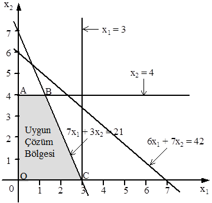

**Şekil 3.5**

**Örnek 3.5’in Gösterimi**

Şekil 3.5’deki taralı alanın içindeki (koyu renk çizilmiş sınırları dahil) tüm
noktalar kısıtlayıcıları aynı anda sağladığından, OABC dörtgeni uygun çözüm
bölgesidir. Bu alan içindeki sınırsız sayıdaki noktaların her biri uygun çözüm
olarak nitelendirilir.

Şekilden görüldüğü gibi 6X1 + 7X2 ≤ 42 kısıtı olsa da olmasa da uygun çözüm
bölgesi OABC alanı olacaktır. Çözüm bölgesini etkilemeksizin modelden
çıkartılabilen bu tür kısıtlayıcılara *gereksiz* (*fazlalık*) *kısıtlayıcılar*
denir. X1 ≤ 3 kısıtının da gereksiz olduğu görülebilir.

Taralı alanın içinde ve sınırları üzerindeki tüm noktalar bütün kısıtlayıcı
fonksiyonları (negatif olmama koşulu dahil) sağladığından uygun çözüm bölgesi
bir konveks (dış bükey) alan olarak ortaya çıkar. Geometrik olarak *konveks
alan* kenarlarında çukurlaşmalar olmayan ve içinde delikler bulunmayan bir
alandır. Bu alanın A, B gibi herhangi iki noktası göz önüne alındığında AB doğru
parçasının tamamı alan içinde kalır.

Aşağıda, konveks ve konveks olmayan alanlarla ilgili birer örnek
gösterilmektedir.

**Örnek 3.6**: Aşağıdaki kısıtlayıcıları görüntüleyerek uygun çözüm bölgesinin
konveks olup olmadığını gerekçesiyle belirtiniz.

X1 + 2X2 ≥ 6

X2 ≤ 4

X1 ≤ 6

X1, X2 ≥ 0

**Çözüm 3.6**: Kısıtlayıcıların oluşturduğu uygun çözüm bölgesi Şekil 3.6’da
gösterilmiştir.

**Şekil 3.6**

**Örnek 3.6’nın Uygun Çözüm Bölgesi**

Şekilden görüldüğü gibi ABCD dörtgeninin (sınırlar dahil) herhangi iki noktasını
birleştiren doğru parçası tümüyle alan içinde kalacağından ABCD konveks alandır.

**Örnek 3.7**: Aşağıdaki eşitlikler sisteminin çözümünü bularak elde ettiğiniz
çözüm bölgesinin konveks olup olmadığını gerekçesiyle belirtiniz.

X² + y² = 9, X = 0, y = 0

**Çözüm 3.7**: Yukarıdaki eşitliklerle tanımlanan ve Şekil 3.7’de gösterilen
alan konveks değildir. Çünkü bu alanın sınırı üzerinde bulunan A, B gibi
herhangi iki noktayı birleştiren AB doğru parçasının yalnızca A ve B ile
isimlendirilen iki noktası alan içinde (sınırların üzerinde) kalırken diğerleri
bu alana ait değildir.

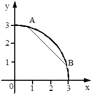

**Şekil 3.7**

**Örnek 3.7’nin Gösterimi**

Buraya kadar uygun çözüm bölgesinin belirlenmesi üzerinde durduk, amaç
fonksiyonunun en iyilenmesi konusuna değinmedik. Şimdi amaç fonksiyonu için en
iyi değeri sağlayan çözümün belirlenmesine geçelim. Bir doğrusal programlama
probleminde amaç fonksiyonuna en iyi değerini kazandıran bir nokta varsa, bu
nokta uygun çözüm bölgesinin köşe noktalarından biridir. Bu köşe noktalarına uç
noktalar da denir. Amaç fonksiyonunun değerini en iyileyen çözüm noktasının
belirlenmesinde uygun çözüm bölgesindeki sonsuz sayıdaki noktanın değil, bu
bölgenin sonlu sayıdaki uç noktasının denetlenmesi yeterli olur. Eğer amaç
fonksiyonu en büyük ya da en küçük değerine birden fazla uç noktasında
ulaşıyorsa amaç fonksiyonu bu noktaların her birinde aynı değeri alır. Bu özel
durum yeri geldiğinde açıklanacaktır.

En iyi çözümün ortaya çıktığı uç noktanın belirlenmesinde izlenebilecek iki yol
vardır.

Birincisi amaç fonksiyonuna rasgele bir değer verip belirlediği doğruyu
çizmektir. Bu doğru üzerindeki bütün noktalarda Z sabit olduğundan *Z
doğrularına* en büyükleme problemlerinde *eş kazanç* (*eş kâr*), en küçükleme
problemlerinde *eş kayıp* (*eş maliyet*) doğruları da denilmektedir. Bulunan
doğruyu uygun çözüm alanında, duruma göre aşağı veya yukarıya doğru, kaydırarak
yine duruma göre en son veya en önce değdiği uç noktasını belirlemektir. Bu
nokta amaç fonksiyonunun değerini en iyileyen noktadır ve bu noktanın
koordinatları karar değişkenlerinin en iyi değerlerini verir.

En iyi çözümü belirlemenin ikinci yolu uygun çözüm alanının her uç noktasının
koordinat değerlerini amaç fonksiyonunda yerine koymak ve fonksiyonun bunlara
karşılık gelen değerlerini hesaplamaktır. Problemin niteliğine göre en büyük ya
da en küçük değeri sağlayan uç nokta en iyi çözümü sağlayan noktadır.

Zenb = 6X1 + 8X2

7X1 + 3X2 ≤ 21 (1)

6X1 + 7X2 ≤ 42 (2)

X1 ≤ 6 (3)

X2 ≤ 4 (4)

X1, X2 ≥ 0

olarak verilen örnek problemimize dönelim ve amaç fonksiyonu değerini en
iyileyen (en büyükleyen) uç noktayı belirleyelim. Söz konusu belirleme işleminde
ilk olarak yukarıda açıklanan birinci yolu kullanalım. Bu amaçla amaç
fonksiyonuna rasgele bir değer vererek belirlediği doğruyu çizelim. Z için
seçtiğimiz rasgele değer 24 olsun. Bu durumda, Z = 6X1 + 8X2 = 24 olur.

X1 = 0 için 6(0) + 8X2 = 24 çözülürse X2 = 3

X2 = 0 için 6X1 + 8(0) = 24 çözülürse X1 = 4

elde edilir.

Z = 24 için çizilen doğru (Şekil 3.8’de kesik çizgiyle gösterilmiştir)
incelendiğinde uygun çözüm bölgesinin içinde, bu doğrunun yukarısında A ve B ile
isimlendirilmiş iki uç noktanın bulunduğu görülebilir. Bu durum, orijinden
uzaklaştıkça amaç fonksiyonu değerinin artacağına işaret eder.

O halde, biz de amaç fonksiyonunun değerini arttıralım ve araştırmamızı Z = 36
seçimiyle sürdürelim.

Z = 6X1 + 8X2 = 36 olsun.

X1 = 0 için 6(0) + 8X2 = 36 çözülürse X2 = 4.5

X2 = 0 için 6X1 + 8(0) = 36 çözülürse X1 = 6

elde edilir.

Z = 36 için çizilen doğru incelendiğinde, bu doğrunun Z = 24 için çizilen
doğruya paralel (eğimleri aynı olduğundan) olduğu ve yukarısında tek bir uç
noktanın (B) kaldığı görülebilir. Böylece, amaç fonksiyonunu en iyileyen uç
noktanın B olduğu kararlaştırılır.

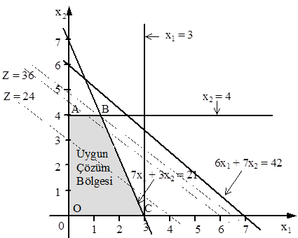

**Şekil 3.8**

##### Örnek 3.5’in Uygun Çözüm Bölgesi ve Eş Kazanç Doğruları

ZB’nin, yani Zenb’nin hesaplanabilmesi için B noktasının koordinatlarının
bulunması gerekir. Bu nokta X2 = 4 ve 7X1 + 3X2 = 21 doğrularının kesiştiği
nokta olduğundan, bu noktanın koordinatları bulunmalıdır. Kesim noktası her iki
eşitliği de sağlayacağından denklemlerin bu noktada eşitlenip çözülmesiyle; X2 =
4 ve 7X1 + 3(4) = 21 eşitliğinin çözümünden, X1 = 9/7 bulunur.

Bu değerlerin amaç fonksiyonunda yerine konulmasıyla, Zenb = ZB = 6(9/7) + 8(4)
= 278/7 = 39.7 olarak hesaplanır. Özetle, en iyi çözüm Zenb = 39.7, X1 = 9/7 =
1.3, X2 = 4 olarak belirlenmiştir.

Aynı sonuca ikinci yolu izleyerek, yani uygun çözüm bölgesinin uç noktaları olan
O, A, B ve C noktalarının koordinat değerlerinin amaç fonksiyonuna
yerleştirilmesi ve fonksiyonun bu noktalarda aldığı değerlerin
karşılaştırılmasıyla da ulaşılabilirdi. Bu yöntemin uygulanmasıyla ilgili
aritmetik işlemler aşağıda topluca verilmiştir.

Amaç fonksiyonunun uç noktalardaki değerlerini hesaplayabilmek için herşeyden
önce bu uç noktaların koordinatları hesaplanmalıdır.

A’nın koordinatları X1 = 0, X2 = 4’dür. Buna göre, ZA = Z(0, 4) = 6(0) + 8(4) =
32 olarak bulunur.

O orijin olup koordinatları X1 = 0, X2 = 0’dır. Buna göre, ZO = Z(0, 0) = 6(0) +
8(0) = 0 olarak hesaplanır.

B’nin koordinatları yukarıda hesaplandığından işlemlerin tekrarlanması gerekmez.
ZB’nin 39.7 olarak hesaplandığının hatırlanması yeterlidir.

C’nin koordinatları X1 = 3, X2 = 0 olduğundan, ZC = Z(3, 0) = 6(3) + 8(0) = 18
olur.

Amaç fonksiyonunun en büyük değeri B’de hesaplandığından, bu noktanın
koordinatları en iyi çözümü verir.

Birinci yolla da amaç fonksiyonunun en iyi değerinin 39.7 olarak belirlendiği
hatırlanabilir.

**Örnek 3.8**: Aşağıdaki doğrusal programlama problemini grafik yöntemiyle
çözünüz.

Zenb = X1 + 3X2

X1 + X2 ≤ 8

X1 + 2X2 ≥ 8

X2 ≥ 3

X1, X2 ≥ 0

**Çözüm 3.8**: Önceki problemlerde olduğu gibi eşitsizlik biçimindeki
kısıtlayıcı fonksiyonların eşitlik biçiminde düşünülmesiyle kısıtlayıcı
doğruların çizilmesinden sonra, eşitsizliklerin yönlerinin dikkate alınmasıyla
uygun çözüm bölgesi şekildeki taralı alan olarak belirlenecektir.

Doğruların çizilmesiyle ilgili aritmetik işlemler aşağıda topluca
gösterilmiştir.

X1 + X2 = 8 eşitliğinde X1 = 0 için X2 = 8, X2 = 0 için X1 = 8 bulunur.

X1 + 2X2 = 8 eşitliğinde X1 = 0 için X2 = 4, X2 = 0 için X1 = 8 bulunur.

Şekilden görüldüğü gibi, uygun çözüm bölgesi ABCD konveks kümesidir.

Bu bölgenin uç noktalarından en az bir tanesi amaç fonksiyonu değerini en
büyükleyecektir.

Z = 6, Z = 12 ve Z = 18 eş kr doğruları Şekil 3.9’da kesikli çizgi ile
gösterilmişlerdir. Z = 18 için çizilen eş kr doğrusu incelendiğinde, bu doğrunun
yukarısında tek bir uç noktanın (B) bulunduğu görülebilir. Bu durumda problemin
en iyi çözümünün bu noktada ortaya çıkacağını söylemek kehanet olmaz.

**Şekil 3.9**

**Örnek 3.8’in Uygun Çözüm Bölgesi ve Eş Kr Doğruları**

Görüldüğü gibi, B amaç fonksiyonuna en büyük değeri sağlamaktadır. B’nin
koordinatlarının X1 = 0, X2 = 8 olduğu göz önünde bulundurulduğunda ZB(Zenb)
aşağıdaki gibi hesaplanır.

ZB = Zenb = 0 + 3(8) = 24

Özetle, karar değişkenlerinin en iyi değerleri X1 = 0, X2 = 8 ve amaç
fonksiyonunun en büyük değeri 24 olarak belirlenmiştir.

Uç noktaların koordinatlarının ayrı ayrı hesaplanıp amaç fonksiyonuna
yerleştirilmesiyle hesaplanan Z değerleri aşağıda verilmiştir.

Bu hesaplamalar da amaç fonksiyonunun en büyük değerine B(0, 8) noktasında
ulaştığını göstermektedir.

ZA = Z(0, 4) = 1(0) + 3(4) = 12

ZB = Z(0, 8) = 1(0) + 3(8) = 24

ZC = Z(5, 3) = 1(5) + 3(3) = 14

ZD = Z(2, 3) = 1(2) + 3(3) = 11

Buraya kadar, en büyükleme amaçlı problemlerin çözümü üzerinde durduk. Şimdi de,
en küçükleme amaçlı problemlerin grafikle çözümü üzerinde duralım.

En küçükleme problemlerinin grafik çözümü ile en büyükleme problemlerinin grafik
çözümleri arasında temelde hiçbir fark yoktur. Birinde amaç fonksiyonunun
değerini en büyük kılan uç nokta belirlenirken, diğerinde amaç fonksiyonunun en
küçük değerini sağlayan uç noktanın belirlenmesine çalışılmaktadır.

**Örnek 3.9**: Aşağıdaki doğrusal programlama problemini grafik yöntemiyle
çözünüz.

Zenk = 3X1 + 5X2

3X1 + X2 ≥ 9

X1 + 2X2 ≥ 8

X1 + 5X2 ≥ 10

X1, X2 ≥ 0

**Çözüm 3.9**: En büyükleme problemlerinde olduğu gibi öncelikle eşitsizlik
biçimindeki kısıtlayıcı fonksiyonların eşitlik biçiminde düşünülmesiyle
kısıtlayıcı doğrular çizilmelidir. Doğruların çizilmesinden sonra,
eşitsizliklerin yönlerinin dikkate alınmasıyla uygun çözüm bölgesi Şekil
3.10’daki taralı alan olarak ortaya çıkar.

Doğruların çizilmesiyle ilgili aritmetik işlemler aşağıda topluca
gösterilmiştir.

3X1 + X2 = 9 eşitliğinde X1 = 0 için X2 = 9, X2 = 0 için X1 = 3,

X1 + 2X2 = 8 eşitliğinde X1 = 0 için X2 = 4, X2 = 0 için X1 = 8,

X1 + 5X2 = 10 eşitliğinde X1 = 0 için X2 = 2, X2 = 0 için X1 = 10.

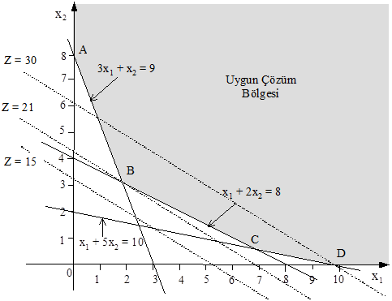

**Şekil 3.10**

**Örnek 3.9’un Uygun Çözüm Bölgesi ve Eş Maliyet Doğruları**

Şekil 3.10’da sınırı dolu çizgi ile gösterilen uygun çözüm bölgesinin bükülü
sınır çizgisi üzerindeki uç noktalardan biri amaç fonksiyonuna en küçük değeri
kazandırır. Daha önceki işlemleri göz önüne alarak en iyi çözümün hangi uç
noktada ortaya çıktığını araştıralım.

Z = 15, Z = 30 eş maliyet doğruları kesikli çizgi ile gösterilmiştir. Bu iki
doğru, orijinden uzaklaştıkça amaç fonksiyonunun değerinin arttığını ortaya
koymaktadır. Amacımız Z’yi en küçükleyen uç noktasını belirlemek olduğuna göre,
orijinden uzaklaşmak yerine ona yaklaşmalı ve ona en yakın uç noktasını
belirlemeliyiz. Daha önceki açıklamalara göre B noktası amaç fonksiyonuna en
küçük değeri kazandıran noktadır.

B noktası 3X1 + X2 = 9 ve X1 + 2X2 = 8 doğrularının kesim noktası olduğundan bu
noktanın koordinatları, 3X1 + X2 = 9 ve X1 + 2X2 = 8 eşitlikler sisteminin
çözümüyle bulunur. X1 = 2, X2 = 3 olarak belirlenmiştir. Bulunan değerlerin amaç
fonksiyonuna yerleştirilmesiyle, ZB = Zenk = 3(2) + 5(3) = 21 olarak
hesaplanacaktır.

Uç noktaların koordinatlarının ayrı ayrı hesaplanıp amaç fonksiyonunda yerine
konulmasıyla elde edilen değerler de (aşağıda topluca verilmiştir) B noktasının
en iyi çözümü sağlayan nokta olduğunu göstermektedir.

ZA = Z(0, 9) = 3(0) + 5(9) = 45

ZB = Z(2, 3) = 3(2) + 5(3) = 21

ZC = Z(20/3, 2/3) = 3(20/3) + 5(2/3) = 23.3

ZD = Z(10, 0) = 3(10) + 5(0) = 30

**Örnek 3.10**: Aşağıdaki doğrusal programlama problemini grafik yöntemiyle
çözünüz.

Zenk = 2X1 + 3X2

3X1 + 2X2 ≥ 6

X1 - 2X2 ≤ 4

X1 ≤ 5

X2 ≤ 3

X1, X2 ≥ 0

**Çözüm 3.10**: Kısıtlayıcı fonksiyonların oluşturduğu çözüm bölgesi Şekil
3.11’deki ABCDE konveks kümedir.

Z = 2X1 + 3X2 = 12 olduğunu düşünelim. Z = 12 için çizilen doğru incelendiğinde,
uygun çözüm bölgesinin uç noktalarından olan A, C, D ve E’nin bu doğrunun
altında kaldıkları görülebilir. Amaç, Z’yi en küçükleyen uç noktasını belirlemek
olduğuna göre, orijinden uzaklaşmak yerine ona yaklaşmalı ve ona en yakın uç
noktası belirlenmelidir. O halde Z’ye daha küçük bir değer verelim ve Z = 2X1 +
3X2 = 6 olduğunu düşünelim. Şekil 3.11’den görüldüğü gibi, Z = 6 doğrusunun
altında tek bir uç nokta (E) bulunmaktadır. Daha önceki açıklamalar
doğrultusunda E’nin amaç fonksiyonuna en küçük değeri sağlayan nokta olduğu
kararlaştırılır. E noktasının koordinatları (2, 0) olduğundan, ZE = Zenk = 2(2)
\+ 3(0) = 4 olarak hesaplanır.

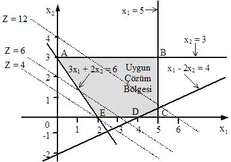

**Şekil 3.11**

**Örnek 3.10’un Uygun Çözüm Bölgesi**

Uç noktaların koordinatlarının ayrı ayrı hesaplanıp amaç fonksiyonunda yerine
konulmasıyla ulaşılan değerler de (aşağıda topluca verilmiştir) E noktasının en
iyi çözümü sağlayan nokta olduğunu göstermektedir.

ZA = Z(0, 3) = 2(0) + 3(3) = 9

ZB = Z(5, 3) = 2(5) + 3(3) = 19

ZC = Z(5, 0,5) = 2(5) + 3(0.5) = 11.5

ZD = Z(4, 0) = 2(4) + 3(0) = 8

ZE = Z(2, 0) = 2(2) + 3(0) = 4

## 3.3 GRAFİK ÇÖZÜMDE KARŞILAŞILAN ÖZEL DURUMLAR

Buraya kadar ele alınan tüm örneklerin uygun çözüm bölgeleri konveks alanlar
olarak ortaya çıkmış ve en iyi çözüme bu bölgelerin bir uç noktasında
ulaşılmıştır. Zaman zaman, uygun çözüm bölgesinin bulunmadığı veya uygun çözüm
bölgesi olsa da en iyi çözümü veren bir uç noktanın belirlenemediği ya da en iyi
çözüme birden fazla uç noktada ulaşıldığı doğrusal programlama problemleriyle de
karşılaşılabilmektedir. İzleyen kesimde, çoğunlukla modelin kurulmasında veya
çözümde yapılan yanlışlar sonucu ortaya çıkan özel durumlar açıklanacaktır.

### *3.3.1 Eşitsizliklerin Tutarsız Olması*

Doğrusal programlama problemlerinin çözümünde her zaman uygun bir çözüm bölgesi
bulunmayabilir. Bazı durumlarda uygun çözüm bölgesi oluşsa da negatif olmama
koşulu sağlanmayabilir.

Kısıtlayıcıların tutarsız olmaları sonucu gerçekleşen bu iki özel durumu birer
örnekle açıklayalım.

**Örnek 3.11**: Aşağıdaki doğrusal programlama problemini grafik yöntemiyle
çözünüz.

Zenb = 6X1 + 3X2

X1 + 2X2 ≤2

2X1 + X2 ≥ 6

X1, X2 ≥ 0

**Çözüm 3.11**: Önceki örneklerde olduğu gibi önce eşitsizlikleri eşitlik
biçiminde ele alarak uygun çözüm bölgesini belirleyelim.

Şekil 3.12’den görüldüğü gibi kısıtlayıcı fonksiyonları sağlayan farklı yönlerde
taranmış alanların ortak herhangi bir noktası bulunmadığından, uygun çözüm
bölgesi boştur. Bu nedenle de problemin çözümü yoktur. Bu gibi durumlarda
problemin yeniden ele alınması uygun olur.

**Şekil 3.12**

**Örnek 3.11’in Gösterimi**

**Örnek 3.12**: Aşağıdaki doğrusal programlama problemini grafik yöntemiyle
çözünüz.

Zenb = 6X1 + 3X2

X1 + 2X2 ≤ 2

4X1 + 3X2 ≥12

X1, X2 ≥ 0

**Çözüm 3.12**: Problemin uygun çözüm bölgesi Şekil 3.13’de verildiği gibidir.
Şekil’den görüldüğü gibi kısıtlayıcıları sağlayan çözüm bölgesi X1 ≥ 0 koşulunu
sağlarken, X2 ≥ 0 koşulunu gerçeklemediğinden, bir en iyi çözümden söz edilemez.

**Şekil 3.13**

**Örnek 3.12’nin Çözüm Bölgesi**

### *3.3.2 Sınırsız Çözüm*

Doğrusal programlama problemlerinin çözümünde karşılaşılan diğer bir durum da
uygun çözüm bölgesinin sınırsız olmasıdır. Uygum çözüm bölgesi sınırsız
olduğunda, amaç fonksiyonu giderek artan değerler alır ve bir türlü en iyi olan
sonuca ulaşılamaz. Uygun çözüm bölgesinin sınırsız olması, hiçbir zaman en iyi
çözümün elde edilmeyeceği anlamına gelmez. Sınırsız çözüm durumunda, amaç
fonksiyonunu en büyükleyen uç noktanın belirlenmesi yerine amaç fonksiyonunun
değerini en küçükleyen uç nokta araştırılabilir. Sınırsız çözümün nedeni
problemin yanlış modellenmesidir.

Aşağıda sınırsız çözüm durumuyla ilgili bir örnek verilmiştir.

**Örnek 3.13**: Aşağıdaki doğrusal programlama problemini grafik yöntemiyle
çözünüz.

Zenb = 2X1 + X2

\-2X1 + X2 ≤ 4

X1 - X2 ≤ 1

X1, X2 ≥ 0

**Çözüm 3.13**: Problemin uygun çözüm bölgesi Şekil 3.14’de gösterilmiştir.
Şeklin ortaya koyduğu gibi uygun çözüm bölgesi kapalı değildir. Amaç
fonksiyonunda X1 ve X2’nin katsayılarının pozitif ve problem en büyükleme amaçlı
olduğundan sınırlı bir çözüm bulunamaz. Bu durumda problemin sınırsız çözümü
vardır. Ancak problem en küçükleme amaçlı olsa idi orijin (nötr faaliyetler
durumu) en iyi çözümün ortaya çıktığı nokta olurdu.

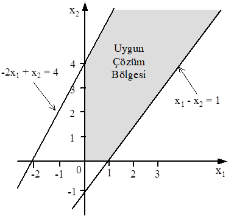

**Şekil 3.14**

**Örnek 3.13’ün Uygun Çözüm Bölgesi**

### *3.3.3 Uygun Çözüm Bölgesinin Bir Nokta Olması*

Kimi zaman uygun çözüm bölgesi tek bir nokta şeklinde ortaya çıkar. Bu gibi
durumlarda amaç ne olursa olsun en iyi çözüme söz konusu noktada ulaşılır.

**Örnek 3.14**: Aşağıdaki doğrusal programlama problemini grafik yöntemiyle
çözünüz.

Zenb = 6X1 + 3X2

X1 + X2 ≤ 6

3X1 + 5X2 ≥ 24

X2 = 3

X1, X2 ≥ 0

**Çözüm 3.14**: Problemin uygun çözüm bölgesi Şekil 3.15’deki A noktasıdır. Buna
gore değişkenlerin en iyi değerleri söz konusu noktanın koordinatları olarak
ortaya çıkar. Bu notanın koordinatları yukarıdaki kısıtlayıcı fonksiyonlardan
herhangi ikisinin birlikte çözülmesiyle bulunabilir.

Üç doğrunun kesiştiği noktanın koordinatlarının belirlenmesi amacıyla bunlardan
rasgele seçilen ikisi, 3X1 + 5X2 = 24 ve X2 = 3 olsun. Bu iki denklemin
çözümünden X1 = 3, X2 = 3 elde edilir. Buradan amaç fonksiyonunun en büyük
değeri,

Z’de X1 = 3, X2 = 3 yerleştirilmesiyle,

Zenb = 6(3) + 3(3) = 27

olarak hesaplanır.

**Şekil 3.15**

**Örnek 3.14’ün Uygun Çözüm Bölgesi**

### *3.3.4 Alternatif En İyi Çözümler*

Amaç fonksiyonunun en iyi değerine birden çok sayıda uç noktasında ulaşması
durumunda alternatif, yani birden fazla en iyi çözümden söz edilir. Bu gibi
durumlarda amaç fonksiyonunun en iyi değeri, ilgili her uç noktasında eşittir.
Farklı olan yalnızca, karar değişkenlerinin en iyi değerleridir.

**Örnek 3.15**: Aşağıdaki doğrusal programlama problemini grafik yöntemiyle
çözünüz.

Zenb = 8X1 + 8X2

2X1 + 3X2 ≥ 12

3X1 + 2X2 ≥ 12

X1 + X2 ≤ 6

X1, X2 ≥ 0

**Çözüm 3.15**: Problemin uygun çözüm bölgesi Şekil 3.16’daki ABC üçgen
alanıdır. Amaç fonksiyonunun ABC üçgeninin uç noktalarındaki değerleri aşağıda
verilmiştir.

ZA = Z(0, 6) = 8(0) + 8(6) = 48

ZB = Z(6, 0) = 8(6) + 8(0) = 48

ZC = Z(12/5, 12/5) = 8(12/5) + 8(12/5) = 192/5

Amaç fonksiyonu en büyük değerine A(0, 6) ve B(6, 0) noktalarında ulaşmıştır.
Dolayısıyla A ve B noktalarındaki çözümler birbirlerine alternatif olan en iyi
çözümlerdir. Z = 48 doğrusu çizildiğinde bu doğrunun uygun çözüm bölgesinin AB
üst sınırıyla çakıştığı görülebilir. Bu nedenle AB üzerindeki sınırsız sayıdaki
noktanın her biri bu problemin en iyi çözümüdür.

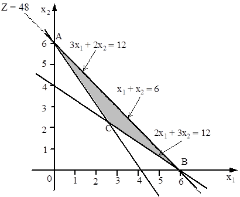

**Şekil 3.16**

**Örnek 3.15’in Uygun Çözüm Bölgesi**

Örnek problemlerin ortaya koyduğu gibi, herhangi bir doğrusal programlama
probleminin en iyi çözümü varsa, uygun çözüm bölgesinin en azından bir köşe
noktası bu çözümü verecektir.

## PROBLEMLER

**1**. Aşağıdaki problemleri grafik yöntemiyle çözerek, sonuçları yorumlayınız.

**a**. Zenb = 3X1 + 6X2

X1 + X2 ≥ 3

X1 + X2 ≤ 6

X1 ≥ 4

X1, X2 ≥ 0

**b**. Zenb = 3X1 + 6X2

X1 + X2 ≤ 4

X1 + X2 ≤ 1

X1 - X2 ≤ -1

X1, X2 ≥ 0

**c**. Zenb = 4X1 + 2X2

X1 + X2 ≥ 2

\-X1 + X2 ≤ 1

4X1 - 2X2 ≥ 2

X1, X2 ≥ 0

**d**. Zenb = 4X1 + 2X2

\-X1 + 2X2 ≤ 4

X1 - X2 ≥ 1

X1, X2 ≥ 0

**e**. Zenk = 2X1 + 4X2

X1 + 2X2 ≤ 10

X2 ≤ 4

X1 + X2 ≤ 1

X1, X2 ≥ 0

**f**. Zenk = X1 + 5X2

2X1 + X2 ≤ 6

5X1 + 4X2 ≥ 20

X1, X2 ≥ 0

**g**. Zenb = 3X1 + X2

2X1 + X2 ≤ 6

X1 + 3X2 ≤ 9

X1, X2 ≥ 0

**h**. Zenb = X1 + X2

X1 + 2X2 ≤ 10

X1 + X2 ≥ 1

X2 ≤ 4

X1, X2 ≥ 0

**i**. Zenb = 5X1 + X2

X1 + X2 ≤ 12

4X1 + 3X2 ≤ 20

X1, X2 ≥ 0

**j**. Zenk = 3X1 - X2

2X1 + 3X2 ≥ 10

3X1 + X2 ≥ 8

X2 ≤ 4

X1, X2 ≥ 0

**k**. Zenk = 0.3X1 + 0.9X2

X1 + X2 ≥ 200

0.21X1 – 0.30X2 ≤ 0

0.03X1 – 0.01X2 ≥ 0

X1, X2 ≥ 0

**l**. Zenk = 5X1 + 4X2

3X1 + 2X2 ≤ 12

0.5X1 + X2 ≤ 3

\-X1 + X2 ≤ 1

X2 ≤ 2

X1, X2 ≥ 0

### *Bölüm 4*

### *SİMPLEKS YÖNTEMİ*

## 4.1 GİRİŞ

Doğrusal programlama problemlerinin çözümünü kavrayabilmek bakımından önemli
olan grafik yöntemi, çok değişkenli doğrusal programlama problemlerinin
çözümünde son derece yetersiz kalmaktadır. Grafikle çözümün uygulanamadığı çok
değişkenli doğrusal programlama problemlerinin çözümünde yaygın biçimde
kullanılan yöntem *simpleks yöntemidir*. George B. Dantzig tarafından
geliştirilen bu yöntem tekrarlı bir yöntem olduğundan *simpleks algoritma*
olarak da adlandırıl-maktadır. Simpleks adı uygun çözüm bölgesinin şeklinden
türetilmiştir. n boyutlu uzayda (n + 1) uç noktaya sahip konveks çoklu düzleme
*simpleks* denir. Örneğin, iki boyutlu uzayda simpleks bir üçgen, üç boyutlu
uzayda bir dörtgendir. Simpleks yöntemin tekrarları simpleksin bir uç
noktasından daha büyük (en büyükleme problemlerinde) veya daha küçük (en
küçükleme problemlerinde) bir Z değeri sağlayacak komşu uç noktalarına yapılan
hareketlerden oluşur. Sonlu sayıda uç noktası olan simpleks üzerinde belirli
sayıda tekrardan sonra en iyi çözüme ulaşılır. Yöntemin en belirgin özelliği çok
sayıda değişken içeren doğrusal programlama problemlerine kolayca
uygulanabilmesidir. Yöntemle ilgili açıklamalara geçmeden önce yöntemin kuramsal
açıklamaları üzerinde durmayacağımızı, simpleks yöntemini matematiksel olmayan
bir yaklaşımla açıklayacağımızı belirtmeliyiz.

## 4.2 KANONİK VE STANDART BİÇİMLER

Daha önce açıklandığı gibi problemin belirlenmesinden sonra yapılması gerekli en
önemli iş, problemi en iyi biçimde temsil eden ve çözümü kolay olan bir modelin
kurulmasıdır. Bilindiği gibi, doğrusal programlama problemleri farklı biçimlerde
gösterilmektedir. Amaç fonksiyonu Zenb veya Zenk, kısıtlayıcı fonksiyonları
eşitsizlik (≥ veya ≤) ya da eşitlik biçiminde tanımlanabilir. Bu kesimde,
doğrusal programlamanın kanonik ve standart biçimleri üzerinde durulacaktır.

**1***.* **Kanonik Biçim**

Zenb = C1X1 + C2X2 + ... + CnXn

a11X1 + a12X2 + ... + a1nXn ≤ b1

a21X1 + a22X2 + ... + a2nXn ≤ b2

. . ... . .

am1X1 + am2X2 + ... + amnXn ≤ bm

X1 ≥ 0, X2 ≥ 0, ..., Xn ≥ 0

olarak formüle edilen doğrusal programlama aşağıdaki özelliklere sahipse,
*kanonik* biçimde olduğu söylenir.

*1*. Tüm karar değişkenleri negatif değildir.

*2*. Amaç fonksiyonu en büyükleme tipindedir.

*3*. Tüm kısıtlayıcı fonksiyonlar (≤) işaretlidir.

**2***.* **Standart Biçim**

Zenk/enb = C1X1 + C2X2 + ... + CnXn

a11X1 + a12X2 + ... + a1nXn = b1

a21X1 + a22X2 + ... + a2nXn = b2

. . ... . .

am1X1 + am2X2 + ... + amnXn = bm

X1 ≥ 0, X2 ≥ 0, ..., Xn ≥ 0

olarak formüle edilen doğrusal programlama modeli aşağıdaki özelliklere sahipse,
*standart* biçimde olduğu söylenir.

*1*. Tüm karar değişkenleri negatif değildir.

*2*. Amaç fonksiyonu en büyükleme veya en küçükleme tipindedir.

*3*. Tüm kısıtlayıcı fonksiyonlar (negatif olmama koşulu dışında) = işaretlidir.

*4*. Kısıtlayıcı fonksiyonların sağ taraf sabitleri negatif değildir.

Herhangi bir doğrusal programlama modeli bazı basit dönüştürme işlemleriyle her
iki biçimde de yazılabilir. Dönüştürme işlemlerinin yaygın biçimde
kullanılanları aşağıda açıklanmıştır.

**1***.***En iyilemenin anlamını değiştirme**: Bilindiği gibi, bir fonksiyonun
en büyük değeri ile ters işaretlisinin en küçük değeri birbirine eşittir. Bu
nedenle, en büyükleme amaçlı bir doğrusal programlama problemi en küçükleme
problemi olarak çözülebilir. Bunun tersi de doğrudur. Her iki durumda da amaç
fonksiyonunun (-1) ile çarpılması yeterlidir. Örneğin,

Zenb = C1X1 + C2X2 + ... + CnXn

olarak tanımlanmışken,

= (-Zenb ) = -C1X1 - C2X2 - ... - CnXn

veya

Zenk = C1X1 + C2X2 + ... + CnXn

olarak verilmişken,

= (-Zenk) = -C1X1 - C2X2 - ... - CnXn

yazılabilir.

Bu dönüşümü mümkün kılan, her iki amacın aynı uygun çözüm bölgesinde en
iyilenmesidir.

Örnek olması bakımından amaç fonksiyonunun aşağıdaki gibi formüle edildiğini
düşünelim.

Zenk = 3X1 - 4X2 + 2X3 - 5X4

Amaç fonksiyonundaki tüm terimlerin işaretlerinin değiştirilmesiyle amaç fonksi-
yonu aşağıdaki gibi yazılabilir.

= (-Zenk) = -3X1 + 4X2 - 2X3 + 5X4

Dönüştürme işlemi, karar değişkenlerinin en iyi değerlerini değiştirmez.
Problemi çözdükten sonra amaç fonksiyonunun en iyi değeri (-1) ile çarpılırsa
orijinal problemin Zenk (Zenb) değeri bulunur.

**2***.***Eşitsizliklerin yönünü değiştirme**: Herhangi bir eşitsizliğin her iki
tarafı (-1) ile çarpıldığında eşitsizlik yön değiştirir. Sözgelimi, a1X1 + a2X2
≥ b ile her iki tarafının (-1) ile çarpılmasıyla elde edilen -a1X1 - a2X2 ≤ -b
birbirlerine eşittir. Benzer biçimde, a1X1 + a2X2 ≤ b yerine -a1X1 - a2X2 ≥ -b
yazılabilir.

**3***.***Eşitliği eşitsizliğe dönüştürme**: Eşitlik biçimindeki bir kısıtlayıcı
fonksiyon iki eşitsizlikle açıklanabilir. Örneğin, a1X1 + a2X2 = b biçimindeki
bir fonksiyon yerine, a1X1 + a2X2 ≥ b ve a1X1 + a2X2 ≤ b veya a1X1 + a2X2 ≤ b ve
\-a1X1 - a2X2 ≤ -b yazılabilir.

**4***.***İşareti sınırlandırılmamış değişkenler**: İşareti sınırlandırılmamış
bir değişken (pozitif, negatif veya sıfır) negatif olmayan iki değişken
arasındaki fark olarak açıklanabilir. Sözgelimi, X işareti sınırlandırılmamış
bir değişken ise, X yerine kullanılabilir. Burada, ≥ 0 ve ≥ 0’dır. Negatif
olmayan ve değişkenlerinden en fazla biri en iyi çözümde pozitif değerli olur.

**5***.***Eşitsizlik biçimindeki kısıtlayıcı fonksiyonların eşitlik biçimine
dönüştürülmesi**:

Simpleks yöntem bir eşitlikler sistemine, standart işlemlerin tekrar tekrar
uygulanmasıyla çözüm arayan bir süreçtir. Bu nedenle yöntemin en önemli adımı
kısıtlayıcı fonksiyonların eşitlik biçiminde yazılmasıdır. Eşitsizlik
biçimindeki bir kısıtlayıcının eşitsizliğin yönü bakımından iki türlü olduğu
bilinmektedir. Eşitsizlikler ≤ bi veya ≥ bi biçimindedir.

(≤) işaretli eşitsizlikleri eşitlik biçimine dönüştürmek için bunların sol
taraflarına negatif olmayan birer değişken eklenir. *Aylak değişken* adı verilen
bu değişkenler Xn+1, Xn+2, ..., Xn+m ile gösterilir. (≥) işaretli eşitsizlikler
ise, sol taraflarından negatif olmayan birer değişken çıkartılmasıyla eşitlik
biçimine dönüştürülür. Eşitsizliğin iki tarafı arasındaki farkı gösteren bu
değişkene *artık değişken* denir. Bu değişkenler de aylak değişkenler gibi Xn+1,
Xn+2 , ..., Xn+m sembolleriyle gösterilirler. Yukarıda açıklandığı gibi, negatif
olmama koşulu karar değişkenlerinin yanı sıra aylak ve artık değişkenlere de
uygulanmaktadır. Bunun nedeni, kısıtlayıcı fonksiyonlardaki (≥) ve (≤)
şartlarının gerçekleşmesini sağlamaktır.

**6***.* **Mutlak değerli kısıtlayıcı fonksiyonların eşitsizlik biçiminde
yazılması**: Çok sık olmasa da mutlak değer içeren kısıtlayıcı fonksiyonlara
rastlanabilir. Hangi yöntem uygulanırsa uygulansın bu tür kısıtlayıcılarla
çözüme ulaşılamaz. Bu yüzden mutlak değerden kurtulmak gerekir. Örnek olması
bakımından, kısıtlayıcı fonksiyonun ≤b şeklinde formüllendiğini düşünelim. Bu
durumda yapılması gereken ≤ b yerine a1X1 + a2X2 ≥ -b ve a1X1 + a2X2 ≤ b
ikilisini yerleştirmektir. Kısıtlayıcı ≥ b ise ≥ b yerine geçecek eşitsizlikler
a1X1 + a2X2 ≥ b ve a1X1 + a2X2 ≤ -b biçimindedir.

Herhangi bir doğrusal programlama modelinin standart veya kanonik biçimde
yazılmasını bir örnek üzerinde açıklayalım.

**Örnek 4.1**: Aşağıdaki gibi verilmiş olan doğrusal programlama problemini,
**a**. Kanonik biçimde, **b**. Standart biçimde yazınız.

Zenk = -6X1 + 7X2 + 7X3 - X4

X1 + 2X2 - 4X3 ≥ 30

2X1 + 9X2 + 6X3 + X4 ≤ 60

6X1 + X3 + X4 = 15

\|3X1 + 4X2\| ≤ 80

X1, X2, X4 ≥ 0, X3 sınırlandırılmamış

**Çözüm 4.1**: **a**. Kanonik biçimde amaç fonksiyonunun Zenb olması
gerektiğinden Zenk olarak verilen amaç fonksiyonu her iki tarafının (-1) ile
çarpılmasıyla Zenb biçimine dönüştürülür. X3’ün işareti bakımından
sınırlandırılmamış olduğu göz önünde bulundurulduğunda amaç fonksiyonu aşağıdaki
gibi elde edilir.

= 6X1 - 7X2 - 7() + X4

Kanonik biçimin kısıtlayıcı fonksiyonlarının (≤) işaretli olması gerektiğinden,
bu özelliği taşımayan kısıtlayıcıların uygun dönüştürme işlemleriyle (≤)
biçiminde yazılması zorunludur. Bu amaçla, kısıtlayıcı fonksiyonları sırasıyla
ele alalım. İlk kısıtlayıcı (≥) işaretli olduğundan, her iki yanı (-1) ile
çarpılır. X3’ün işareti sınırlandırılmamış olduğundan, X3 yerine () yazılmasıyla
birinci kısıtlayıcı fonksiyon aşağıdaki gibi düzenlenir.

\-X1 - 2X2 + 4() ≤ -30

İkinci kısıtlayıcı fonksiyonun yönü doğrudur. X3 yerine () yazılmasıyla
fonksiyon aşağıdaki gibi düzeltilmiş olur.

2X1 + 9X2 + 6() + X4 ≤ 60

Üçüncü kısıtlayıcı eşitlik biçiminde olduğundan aşağıdaki eşitsizlikler çiftiyle
açıklanmalıdır.

6X1 + X3 + X4 ≤ 15

6X1 + X3 + X4 ≥15

Bu eşitsizlik çiftine X3 = yerleştirilmesi ve (≥işaretli kısıtlayıcının her
iki tarafının (-1) ile çarpılması sonucunda bu kısıtlayıcı fonksiyon,

6X1 + () + X4 ≤ 15

\-6X1 - () - X4 ≤ -15

olarak kanonik biçime uygun hale dönüştürülmüş olur.

Dördüncü kısıtlayıcı fonksiyonun sol tarafındaki mutlak değer bu kısıtlayıcının,

3X1 + 4X2 ≤ 80

3X1 + 4X2 ≥ -80

biçiminde yazılmasını gerektirir. (≥işaretli kısıtlayıcının her iki tarafının
(-1) ile çarpılmasıyla mutlak değerli kısıtlayıcının yerine kullanılacak
fonksiyonlar: 3X1 + 4X2 ≤ 80 ve -3X1 - 4X2 ≤ 80 olarak elde edilmiş olur.
Kanonik biçim tümüyle aşağıdaki gibi yazılabilir.

= 6X1 - 7X2 - 7() + X4

\-X1 - 2X2 + 4() ≤ -30

2X1 + 9X2 + 6() + X4 ≤ 60

6X1 + () + X4 ≤ 15

\-6X1 - () - X4 ≤ -15

3X1 + 4X2 ≤ 80

\-3X1 - 4X2 ≤ 80

X1, X2, , , X4 ≥ 0

**b**. *S*tandart modelin amaç fonksiyonu Zenb veya Zenk türünde olabilir. Bu
yüzden orijinal amaç fonksiyonu standart biçim için de geçerli olur. Burada,
dikkat edilmesi gereken en önemli nokta, X3’ün işaretçe sınırlandırılmamış
olduğudur. O halde, standart biçimin amaç fonksiyonu aşağıdaki gibi olur.

Zenk = -6X1 + 7X2 + 7() - X4

Standart biçimde tüm kısıtlayıcı fonksiyonların eşitlik biçiminde olması
gerektiğinden, bu biçime uymayan kısıtlayıcılar eşitlik biçiminde
düzenlenmelidir. Kısıtlayıcı fonksiyonları sırasıyla ele alalım.

Birinci kısıtlayıcının yönü (≥) olduğundan, eşitsizliğin sol tarafından negatif
olmayan bir değişkenin (X5) çıkartılması gerekir. X3’ün sınırlandırılmamış
olduğunun dikkate alınmasıyla, standart biçimin ilk kısıtlayıcı fonksiyonu
aşağıdaki gibi elde edilir.

X1 + 2X2 - 4() - X5 = 30

İkinci kısıtlayıcıya bir aylak değişken (X6) eklenmesi ve X3 = yazılmasıyla
kısıtlayıcı fonksiyon aşağıdaki gibi olur.

2X1 + 9X2 + 6() + X4 + X6 = 60

Üçüncü kısıtlayıcı eşitlik biçiminde olduğundan değişmez. X3 yerine ()
yazılmasıyla elde edilen kısıtlayıcı kısıtlayıcı fonksiyon şöyledir:

6X1 + () + X4 = 15

Modelin son kısıtlayıcı fonksiyonu yerine -3X1 - 4X2 ≤ 80 ve 3X1 + 4X2 ≤ 80
yazılması bunlara sırasıyla X7 ve X8 aylak değişkenlerinin eklenmesiyle,

\-3X1 - 4X2 + X7 = 80

3X1 + 4X2 + X8 = 80

elde edilir.

Tüm kısıtlayıcı fonksiyonlar uygun biçimde düzenlendiğinden, negatif olmama
koşulunun yazılmasıyla standart biçim,

Zenk = -6X1 + 7X2 + 7() - X4

X1 + 2X2 - 4() - X5 = 30

2X1 + 9X2 + 6() + X4 + X6 = 60

6X1 + () + X4 = 15

\-3X1 - 4X2 + X7 = 80

3X1 + 4X2 + X8 = 80

X1, X2, , X4, , , X5, X6, X7, X8 ≥ 0

olarak düzenlenmiş olur.

## 4.3 SİMPLEKS YÖNTEMİN AÇIKLANMASI

Yukarıda belirtildiği gibi, simpleks yöntem herhangi bir doğrusal programlama
problemine, eğer varsa, sınırlı sayıda tekrar sonucunda bir en iyi çözüm bulan
veya sınırsız çözüm olduğunu belirten bir tekrarlar sürecidir. Yani, en iyi
çözüm standart işlemlerin sınırlı tekrarı ile elde edilir. Her bir tekrarda
uygun çözümlerden bir tanesi incelenir. Ardışık çözümlerin her biri kendisinden
önceki çözümden daha gelişmiş, başka bir deyişle en iyi çözüme biraz daha yakın
(en kötü ihtimalle önceki çözüme eşit) bir çözümdür. Ardışık tekrarların sayısı
değişebilir. Deneyimler m kısıtlayıcı, n karar değişkeninden oluşan bir doğrusal
programlama probleminin en iyi çözümüne ulaşılıncaya kadarki tekrar sayısının m
ile 3m arasında değiştiğini, ortalama 2m olduğunu, göstermiştir.

Yöntemi açıklamak için problemin aşağıdaki gibi formüllendiğini düşünelim.

Zenb = C1X1 + C2X2 + ... + CnXn

a11X1 + a12X2 + ... + a1nXn ≤ b1

a21X1 + a22X2 + ... + a2nXn ≤ b2

. . ... . .

am1X1 + am2X2 + ... + amnXn ≤ bm

X1 ≥ 0, X2 ≥ 0, ..., Xn ≥ 0

Simpleks yöntemin ilk adımı tüm eşitsizliklerin (negatif olmama koşulu hariç)
eşitlik biçimine dönüştürülmesidir. Kesim 4.2’de açıklandığı gibi (≤) işaretli
bir eşitsizliği eşitliğe dönüştürmek için eşitsizliğin sol tarafına negatif
olmayan bir aylak değişken eklenir. Her bir eşitsizlik için bir aylak değişken
kullanılmasıyla yukarıdaki kısıtlayıcı fonksiyonlar aşağıdaki gibi olur.

a11X1 + a12X2 + ... + a1nXn + 1Xn+1 + 0Xn+2 + ... + 0Xn+m = b1

a21X1 + a22X2 + ... + a2nXn + 0Xn+1 + 1Xn+2 + ... + 0Xn+m = b2

. . ... . . . ... . .

am1X1 + am2X2 + ... + amnXn + 0Xn+1 + 0Xn+2 + ... + 1Xn+m = bm

Aylak değişkenlerin eklendikleri kısıtlayıcı fonksiyonlardaki katsayılarının +1,
diğerlerinde sıfıra eşit olduğu görülebilir.

Karar değişkenleri ile aylak değişkenler negatif olmadığından, standart biçimin
negatif olmama koşulu aşağıdaki gibi olur.

X1, X2, ..., Xn, Xn+1, Xn+2, ..., Xn+m ≥ 0

Aylak değişkenlerin amaç fonksiyonu katsayıları, bir başka deyişle bu
değişkenlerin amaç fonksiyonuna birim katkıları (birim kârları) sıfırdır([^4]).

[^4]: Eşitsizliğin sağ tarafı kullanılabilir, sol tarafı kullanılan kaynak
    miktarını gösterdiğinden, bu ikisi arasındaki farka eşit olan aylak
    değişken, kullanılmayan kaynak miktarını gösterir. Kullanılmayan kaynağın
    amaç fonksiyonuna, yani kra katkısının sıfır olması doğaldır.

Bu durumda amaç fonksiyonu aşağıdaki gibi olur.

Zenb = C1X1 + C2X2 + ... + CnXn + 0Xn+1 + 0Xn+2 + ... + 0Xn+m

Standart biçimdeki doğrusal programlama modelinin kısıtlayıcı fonksiyonları
matrislerle şöyle gösterilir.

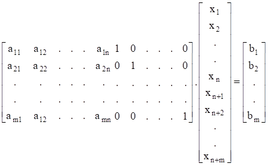

Kısıtlayıcıların eşitlik biçimine dönüştürülmesiyle, modelin yürürlükteki n
karar değişkenine m değişken eklenmiş, yani bilinmeyen sayısı n’den (n + m)’ye
çıkar- tılmıştır. (n + m) bilinmeyene karşılık denklem sayısı m olduğundan,
herhangi n bilinmeyen sıfıra eşitlenip diğer m bilinmeyen eşitlikler sisteminin
birlikte çözülmesiyle elde edilir. Bu yolla ulaşılan çözüme *temel çözüm*, temel
çözümde değerleri sıfırdan farklı olan değişkenlere ise *temel değişken* denir.
Çözüm değerleri sıfır olan değişkenler *temel olmayan değişkenlerdir*.

Temel çözüm sayısı sonlu bir sayıdır ve herhangi m sayıdaki değişkeni göz önünde
tutarak elde edilir. m kısıtlayıcı, n değişkenin bulunduğu standart biçimdeki
problemin temel çözümlerinin sayısının hesaplama formülü şöyledir.

=

İçeriğindeki değişkenlerin tümü pozitif (≥ 0) olan temel çözüme *temel uygun
çözüm* denir. Temel değişkenlerden bir ya da bir kaçının sıfıra eşit olması
durumundaki çözüme bozuk (dejenere) çözüm denir. Temel uygun çözümlerin sayısı
da yukarıdaki bağıntıyla hesaplanan sayı ile sınırlıdır. Standart biçimin
oluşturulmasından sonra en iyi çözümün araştırılması işlemine geçilebilir.
Simpleks yöntemin ardışık tekrarları *başlangıç çözüm tablosu* adı verilen bir
tablonun düzenlenmesinden sonra başlar. Başlangıç çözüm tablosu, aşağıdaki tablo
esasına göre düzenlenir. Özü, daha doğrusu kapsadıkları bilgi aynı olmakla
birlikte bazı kaynaklarda simpleks çözüm tablolarının değişik düzenlemelerine
rastlanabilir.

**Tablo 4.1**

##### Simpleks Başlangıç Çözüm Tablosu

| TDV     | X1  | X2   | … | Xn  | Xn+1 | Xn+2 | … | Xn+m | ÇV |
|---------|-----|------|---|-----|------|------|---|------|----|
| 0 Xn+1  | A11 | a12  | … | a1n | 1    | 0    | … | 0    | b1 |
| 0 Xn+2  | A21 | a22  | … | a2n | 0    | 1    | … | 0    | b2 |
| .       | .   | .    | … | .   | .    | .    | … | .    | .  |
| .       | .   | .    | … | .   | .    | .    | … | .    | .  |
| 0 Xn+m  | am1 | am2. | … | amn | 0    | 0    | … | 1    | bm |
| Zj      | 0   | 0    | … |     | 0    | 0    | … | 0    | 0  |
| Zj - Cj | -C1 | -C2  | … | -Cn | 0    | 0    | … | 0    | -  |

Tablo 4.1 kapsamındaki bölümler aşağıda açıklanmıştır.

**1***.* **Değişkenler satırı***:* Tablonun ilk satırıdır. Standart biçimin tüm
değişkenleri önce karar değişkenleri, sonra diğer değişkenler olmak üzere bu
satırda gösterilir.

**2**. **Temel değişkenler sütunu**: Tablonun ilk sütunudur. Tablodaki çözüme
karşılık gelen temel çözümün değişkenleri ile bu değişkenlerin amaç fonksiyonu
katsayılarını gösterir. Başlangıçta sadece aylak değişkenler temelde
bulunduklarından, Cj’ler sıfıra eşittir. Bu sütunun önemli özelliği başlangıç
çözümünün sıfır olduğunu göstermesidir. Yani, başlangıç simpleks tablosunda
aylak değişkenler temel değişkenler, karar değişkenleri ise temel olmayan
değişkenlerdir. Yukarıda açıklandığı gibi, temelde bulunmayan değişkenlerin
çözüm değerleri sıfırdır. Temel olmayan değişkenler için sıfır konulmasıyla
temel değişkenler ve değerleri,

X1, X2, ... , Xn = 0 ve Xn+1 = b1, Xn+2 = b2, ... , Xn+m = bm

olur.

Matematik olarak mümkün olan ve *başlangıç* *temel uygun çözüm* olarak
isimlendirilen bu çözümün pratik bir anlamı olmamakla birlikte, uygun çözümlerin
ve giderek en iyi çözümün bulunmasında bir başlangıç olması bakımından
önemlidir. Bu çözüm koordinat sisteminin orijin noktasına karşılık gelir.

**3**. **Gövde**: Problemin orijinal karar değişkenlerinin kısıtlayıcı
fonksiyonlardaki katsa- yılarından (aij, i = 1, 2, ..., m; j = 1, 2, ..., n)
oluşan m X n matristir.

**4***.* **Birim matris**: Aylak değişkenlerin kısıtlayıcı fonksiyon
katsayılarının oluşturduğu m X m birim matristir.

**5***.* **Çözüm vektörü**: Temeldeki değişkenlerin çözüm değerlerini gösteren m
X 1 sütun vektördür. Başlangıçta, kısıtlayıcı fonksiyonların sağ taraf
sabitlerinden oluşur.

**6**. **Zj satırı**: Yürülükteki temelde bulunan değişkenlerin amaç fonksiyonu
katsayıları ile Xj sütunundaki katsayıların karşılıklı çarpımlarının toplamından
oluşur. Buna göre örneğin, Z1 = 0(a11) + 0(a21) + ... + 0(am1) = 0 olur.

Başlangıçtaki temelde yalnızca aylak değişkenlerin bulunmasının doğal sonucu
olarak tüm Zj değerleri sıfıra eşittir. İzleyen tablolarda Zj’lerin sıfırdan
farklı olabilecekleri unutulmamalıdır.

Temel değişkenlerde ortaya çıkan değişiklikler nedeniyle, amaç fonksiyonu
değerinin değişimi Zj sembolünde toplanır. Ayrıca, bu satırın son elemanı amaç
fonksiyonunun o simpleks tablo için aldığı değeri gösterir. Başlangıç tablosunda
bu değer genellikle sıfıra (0(Xn+1) + 0(Xn+2) + ... + 0(Xn+m) = 0) eşittir.

**7**. **Zj - Cj satırı**: Tablonun son satırıdır. Elemanları, Zj ile o sütunla
ilgili değişkenin amaç fonksiyonu katsayısı arasındaki farka eşittir. Zj - Cj
farkları Xj değişkeninin temele alınmasının amaç fonksiyonunda yol açacağı
değişikliği ters işaretle gösterir.

Başlangıç çözümünün bulunmasından sonra sıra amaç fonksiyonunun değerini
artıracak diğer temel değişkenlerin araştırılmasına gelir. Bunun için, temelde
bulunan değişkenlerden bir tanesinin temelden çıkartılması, yerine bu adımda
temelde bulunmayan değişkenlerden bir tanesinin alınması gerekir.

Çıkan ve giren değişkenlerin seçimi nasıl yapılacaktır? Çıkan ve giren
değişkenlerin seçiminde hangi ölçüt esas alınmalıdır? Kuşkusuz, amaç
fonksiyonuna marjinal katkısı en büyük olan değişken çözüme giren ilk değişken
olacaktır. Marjinal katkının büyüklüğü değişkenlerin amaç fonksiyonundaki
katsayılarının incelenmesiyle belirlenir.

O halde, simpleks çözüm tablosu göz önüne alındığında giren değişkeni belirleyen
ölçüt şudur: Zj - Cj satırındaki negatif değerler arasında mutlak değerce en
büyük Zj - Cj değerli değişken çözüme girmelidir. Bu kural en büyükleme
problemleri için geçerlidir.

En küçükleme problemlerinde kullanılan kural, yeri geldiğinde açıklanacaktır.

Giren değişkenin seçiminde kullanılan bu kurala *Dantzig kuralı* denir. Mutlak
değerce aynı en büyük negatif değerli birden fazla Zj - Cj varsa, temele giren
değişkenler arasında bağ vardır denir. Bu durumda izlenmesi gereken yöntem 4.4.
kesimde açıklanacaktır.

Yeni bir değişken temele girdiğine göre, yürürlükteki temelde bulunan
değişkenlerden bir tanesinin temeli terketmesi gerekir. Bu yolla temeldeki
değişken sayısının aynı kalması sağlanır.

Temeli terkedecek değişken ölçütü, çözüm vektörü elemanlarının çözüme girmesine
karar verilen değişkene ait sütunun karşılıklı elemanlarının oranına dayanır.

Bu oranlar arasından (negatif ve sıfır olanlar dışında([^5])) en küçük olana
sahip değişken temelden ayrılır([^6]).

[^5]: Bölen olarak yalnızca pozitif katsayıların dikkate alınmasının nedeni
    açıktır. Sıfır, amaç fonksiyonunun değerinde bir değişiklik yaratmamakta,
    negatif sayılar ise uygun olmayan, yani negatif olmama koşulunu sağlamayan
    bir çözüme yol açmaktadır.

[^6]: Bu kural, hem en büyükleme hem de en küçükleme problemleri için geçerlidir.

Simpleks yöntemle çözümde, temele giren değişkenin bulunduğu sütuna *anahtar
sütun*, temeli terkeden değişkenin bulunduğu satıra *anahtar satır* denir.

Temele giren ve temelden çıkan değişkenlerin belirlenmesinden sonra yeni çözüm
tablosu hazırlanır. Yeni çözüm tablosunun temel değişkenler sütunu, çıkan
değişken yerine giren değişkenin yazılmasıyla oluşturulacaktır.

Temele girmesine karar verilen değişkenin temele girmesi ancak ve ancak bu
anahtar sütunun çözümü terkedecek değişkenle ilgili sütun vektöre benzemesiyle,
yani bir birim vektör olmasıyla olanaklıdır. Anahtar sütun, birim sütun vektöre
dönüştü- rülmek istendiğinde bu sütunun hangi elemanı 1 olmalıdır? *Anahtar
sayı*, anahtar sütunla anahtar satırın kesiştiği gözedeki sayıya eşittir.

Bu sayının belirlenmesinden sonra anahtar sütun birim sütun vektöre
dönüştürülebilir. Bunu sağlamak için *Gauss- Jordan* *eleme* yöntemindeki eleme
işlemine denk olan anahtar işlemlerden yararlanılır. Bu yönteme göre yapılacak
ilk iş anahtar satır elemanlarını anahtar sayıya bölerek anahtar satırın yeni
elemanlarının hesaplanmasıdır. Bu yolla anahtar sayının bulunduğu gözedeki sayı
1 yapılır.

Diğer bütün satır elemanlarının (Zj ve Zj - Cj satırları dışında) yeni değerleri
aşağıdaki formülle bulunur.

-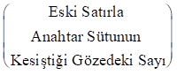X

Yöntemin uygulanışını aşağıdaki örnek problem üzerinde gösterelim.

**Örnek 4.2**: Bir sanayii işletmesi bakır, alüminyum ve çinko metallerinin
farklı alaşımlarını kullanarak A ve B gibi iki çeşit ürün üretmektedir.
İşletmenin elinde 20 ton bakır, 30 ton alüminyum ve 40 ton çinko vardır. Bir
birim A ve bir birim B’nin üretiminde kullanılan bakır, alüminyum ve çinko
miktarları (ton) ile A ve B’nin bir biriminden elde edilen krlar (TL) aşağıdaki
tabloda gösterilmiştir.

Bu bilgileri ve tablodaki verileri kullanarak problemin doğrusal programlama
modelini kurunuz ve işletmenin krını en büyükleyen üretim miktarlarını simpleks
yöntemle bulunuz.

|      | Hammadde  |           |       |    |
|------|-----------|-----------|-------|----|
| Ürün | Bakır     | Alüminyum | Çinko | Kr |
| A    | 6         | 3         | 1     | 2  |
| B    | 4         | 1         | 1     | 3  |

**Çözüm 4.2**: Problemin doğrusal programlama modeli aşağıda gösterilmiştir.

Zenb = 2X1 + 3X2

6X1 + 4X2 ≤ 20 (Bakır kısıtı)

3X1 + X2 ≤ 30 (Alüminyum kısıtı)

X1 + X2 ≤ 40 (Çinko kısıtı)

X1, X2 ≥ 0

Simpleks yöntemle çözüm için öncelikle problem standart biçimde yazılmalıdır.
Eşitsizliklerin tümü (≤) işaretli olduğundan, her bir eşitsizliğin sol tarafına
bir aylak değişken eklenmesiyle standart biçim aşağıdaki gibi olur.

Zenb = 2X1 + 3X2 + 0X3 + 0X4 + 0X5

6X1 + 4X2 + X3 + 0X4 + 0X5 = 20

3X1 + X2 + 0X3 + X4 + 0X5 = 30

X1 + X2 + 0X3 + 0X4 + X5 = 40

X1, X2, X3, X4, X5 ≥ 0

Görüldüğü gibi, başlangıç tablosunun gerektirdiği bütün bilgiler elde
edilmiştir. Standart biçim kapsamındaki tüm bilgilerin simpleks tablosuna
yerleştirilmesiyle başlangıç tablosu aşağıdaki gibi oluşurulur.

**Tablo 4.2**

**Simpleks Başlangıç Çözüm Tablosu**

| TDV     | X1 | X2     | X3 | X4 | X5 | ÇV | Oran |
|---------|----|--------|----|----|----|----|------|
| 0 X3    |  6 |  **4** | 1  | 0  | 0  | 20 | 20/4 |
| 0 X4    |  3 |  1     | 0  | 1  | 0  | 30 | 30/1 |
| 0 X5    |  1 |  1     | 0  | 0  | 1  | 40 | 40/1 |
| Zj      |  0 |  0     | 0  | 0  | 0  | 0  |      |
| Zj - Cj | -2 | -3     | 0  | 0  | 0  | -  |      |

Zj satır elemanları, bulundukları sütundaki katsayılarla temel değişkenlerin
amaç fonksiyonu katsayılarının karşılıklı çarpımlarının toplamı olarak aşağıdaki
gibi hesaplanmıştır.

Z1 = 0(6) + 0(3) + 0(1) = 0

Z2 = 0(4) + 0(1) + 0(1) = 0

Z3 = 0(1) + 0(0) + 0(0) = 0

Z4 = 0(0) + 0(1) + 0(0) = 0

Z5 = 0(0) + 0(0) + 0(1) = 0

Z6 = 0(20) + 0(30) + 0(40) = 0

Yukarıdaki Zj değerlerinin kullanılmasıyla Zj - Cj değerleri aşağıdaki gibi
bulunur.

Z1 - C1 = 0 - 2 = -2

Z2 - C2 = 0 - 3 = -3

Z3 - C3 = 0 - 0 = 0

Z4 - C4 = 0 - 0 = 0

Z5 - C5 = 0 - 0 = 0

Başlangıç tablosunun düzenlenmesinden sonra Zj - Cj satırının gözden
geçirilmeli, tüm Zj - Cj ≥ 0 ise (problem en büyükleme amaçlı olduğundan),
tablodaki çözümün en iyi olduğu kararlaştırılmalıdır. Tablo 4.2’den görüldüğü
gibi, Z1 - C1, Z2 - C2 negatif olduğundan, başlangıçtaki temel uygun çözüm en
iyi değildir. Temele giren değişken ölçütüne göre enb(,) = Z2 - C2 olduğundan,
anahtar sütun X2 değişken sütunudur. X2 yeni çözüm tablosunda temel değişken
olarak karşımıza çıkacaktır.

Anahtar satırı belirlemek için çözüm vektörü sütun elemanlarını bire bir olmak
koşuluyla anahtar sütun elemanlarına bölelim. Bölme işlemi ile bulunan değerler,
başlangıç tablosunun hemen sağında oran başlığı altında gösterilmiştir. En küçük
oran X3’e ait olduğundan, X3’ün temelden ayrılması gerektiğine karar verilir.
Buna göre, yeni simpleks tablosundaki temel değişkenler sırasıyla X2 (X3’ün
yerine), X4 ve X5 olacaktır.

X3 değişken satırı anahtar satır, X2 değişken sütunu anahtar sütun olduğuna göre
anahtar sayı 4 olur([^7]).

[^7]: Anahtar sayılar koyu renk basılarak diğerlerinden ayırdedilmesi
    sağlanmıştır.

Anahtar sayının belirlenmesinden sonra anahtar satır elemanları anahtar sayıya
bölünmeli ve anahtar satırın yeni elemanları hesaplanmalıdır. Bu işlemler
aşağıda topluca verilmiştir.

Anahtar satırın eski elemanları,

olduğuna göre anahtar satırın yeni elemanları,

veya gerekli aritmetik işlemlerin yapılmasıyla aşağıdaki gibi olur.

Bu değerlerin yeni çözüm tablosuna yerleştirilmesinden sonra tablonun diğer
elemanları hesaplanabilir.

X4 değişken satırından başlayarak diğer satır elemanlarını hesaplayalım. X4
değişken satırının eski elemanları aşağıda gösterildiği gibidir.

Bu satırla anahtar sütunun kesiştiği yerdeki sayı 1 ve anahtar satırın yeni
elemanları,

olduğuna göre, X4 değişken satırının yeni elemanları,

3 1 0 1 0 30

(-1)

3/2 0 -1/4 1 0 25

olarak hesaplanır.

Aynı yaklaşımla X5 değişken satırının yeni elemanlarının,

|  [1      |  1 |  0   |  0 |  1 |  40] |
|----------|----|------|----|----|------|
| (-1)[3/2 |  1 |  1/4 |  0 |  0 |  5]  |

\-1/2 0 -1/4 0 1 35

olarak hesaplanacakları bellidir.

Zj satır elemanları aşağıdaki gibi hesaplanmıştır.

Z1 = 3(3/2) + 0(3/2) + 0(-1/2) = 9/2

Z2 = 3(1) + 0(0) + 0(0) = 3

Z3 = 3(1/4) + 0(-1/4) + 0(-1/4) = 3/4

Z4 = 3(0) + 0(1) + 0(0) = 0

Z5 = 3(0) + 0(0) + 0(1) = 0

Z6 = 3(5) + 0(25) + 0(35) = 15

Zj - Cj satır elemanları Zj değerlerinden ilgili Cj değerlerinin
çıkartılmasıyla,

Z1 - C1 = (9/2) - 2 = 5/2

Z2 - C2 = 3 - 3 = 0

Z3 - C3 = (3/4) - 0 = 3/4

Z4 - C4 = 0 - 0 = 0

Z5 - C5 = 0 - 0 = 0

olarak hesaplanmıştır.

Elde edilen bu değerlerin simpleks çözüm tablosuna yerleştirilmesiyle birinci
simpleks çözüm tablosu aşağıdaki gibi düzenlenir.

**Tablo 4.3**

**Simpleks Birinci (En İyi) Çözüm Tablosu**

| TDV     | X1   | X2 | X3   | X4 | X5 | ÇV |
|---------|------|----|------|----|----|----|
| 3 X2    |  3/2 | 1  |  1/4 | 0  | 0  | 5  |
| 0 X4    |  3/2 | 0  | -1/4 | 1  | 0  | 25 |
| 0 X5    | -1/2 | 0  | -1/4 | 0  | 1  | 35 |
| Zj      |  9/2 | 3  |  3/4 | 0  | 0  | 15 |
| Zj - Cj |  5/2 | 0  |  3/4 | 0  | 0  | -  |

Tablo 4.3’den görüldüğü gibi tüm Zj - Cj ≥ 0 olduğundan, yürürlükteki çözüm en
iyidir. Temelde bulunmayan değişkenlerin amaç fonksiyonuna katkıları negatif
olduğundan, temelde gerçekleştirilecek bir değişiklik Z’nin azalmasına yol
açacaktır. Bu durumda Z = 15, amaç fonksiyonu için bulunabilecek en büyük
değerdir. Bu çözümde X1 = 0, X2 = 5, X3 = 0, X4 = 25, X5 = 35’dir. Bu durumda,
işletme B’den 5 birim üretirken A’dan hiç üretmeyecek, böylece en yüksek kârı 15
TL olacaktır.

Aylak değişkenlerin en iyi çözümdeki değerleri X3 = 0, X4 = 25, X5 = 35’dir.

Bilindiği gibi, eşitsizliklerin sağ tarafları kullanılabilir kaynak miktarlarını
gösterirken, sol tarafları kullanılan kaynak miktarlarını göstermektedir. Bu
durumda, bu ikisi arasındaki fark kullanılmayan kaynak miktarına karşılık gelir.

Buna göre, bakırın tamamının kullanıldığı anlaşılır. Nitekim, X1 ve X2’nin en
iyi çözümdeki değerleri bakır kısıtına yerleştirildiğinde 6X1 + 4X2 = 6(0) +
4(5) = 20 olarak elde edilecektir.

Öte yandan, alüminyum ve çinkonun tamamının kullanılmasının gerekmediği, üretim
işleminin 25 ton alüminyum ve 35 ton çinkonun kullanılmasına gerek kalmadan
tamamlandığı görülebilir. Aylak değişkenlerin Zj - Cj değerleri incelendiğinde,
1 ton bakırın kullanımından vazgeçilmesi durumunda krdaki azalmanın (Z3 - C3)
3/4 TL, 1 ton alüminyum ve 1 ton çinkonun kullanımlarından vazgeçilmesi
durumunda krdaki azalmaların sırasıyla, Z4 - C4 = 0 ve Z5 - C5 = 0 olacağı
görülebilir.

Amaç fonksiyonunun Zenb ve tüm kısıtlayıcıların (≤) biçiminde formüllendiği
doğrusal programlama problemlerinin simpleks yöntemle çözülmesine son bir örnek
olmak üzere aşağıdaki problemi ele alalım.

**Örnek 4.3**: Aşağıdaki doğrusal programlama problemini simpleks yöntemle
çözünüz.

Zenb = 10X1 + 22X2 + 18X3

X1 + 4X2 + 3X3 ≤ 24

2X1 + 2X2 + 4X3 ≤ 46

3X1 + 5X2 + 6X3 ≤ 60

4X1 + 8X2 + 3X3 ≤ 120

X1, X2, X3 ≥ 0

**Çözüm 4.3**: Problemin standart biçimi aşağıda gösterilmiştir.

Zenb = 10X1 + 22X2 + 18X3 + 0X4 + 0X5 + 0X6 + 0X7

X1 + 4X2 + 3X3 + X4 + 0X5 + 0X6 + 0X7 = 24

2X1 + 2X2 + 4X3 + 0X4 + X5 + 0X6 + 0X7 = 46

3X1 + 5X2 + 6X3 + 0X4 + 0X5 + X6 + 0X7 = 60

4X1 + 8X2 + 3X3 + 0X4 + 0X5 + 0X6 + X7 = 120

X1, X2, X3, X4, X5, X6, X7 ≥ 0

Problemin simpleks başlangıç çözüm tablosu şöyledir.

**Tablo 4.4**

**Simpleks Başlangıç Çözüm Tablosu**

| TDV     | X1  | X2     | X3  | X4 | X5 | X6 | X7 | ÇV  |  Oran      |
|---------|-----|--------|-----|----|----|----|----|-----|------------|
| 0 X4    |  1  |  **4** |  3  | 1  | 0  | 0  | 0  | 24  |  24/4 = 6  |
| 0 X5    |  2  |  2     |  4  | 0  | 1  | 0  | 0  | 46  |  46/2 = 23 |
| 0 X6    |  3  |  5     |  6  | 0  | 0  | 1  | 0  | 60  |  60/5 = 12 |
| 0 X7    |  4  |  8     |  3  | 0  | 0  | 0  | 1  | 120 | 120/8 = 15 |
| Zj      |  0  |  0     |  0  | 0  | 0  | 0  | 0  | 0   |            |
| Zj - Cj | -10 | -22    | -18 | 0  | 0  | 0  | 0  | -   |            |

Tablo 4.4’den görüldüğü gibi tüm Zj - Cj ≥ 0 olmadığından başlangıçtaki temel
uygun çözüm en iyi değildir.

Enb () = 22 olduğundan X2’nin bulunduğu sütun anahtar sütundur. Anahtar satırı
belirlemek için çözüm vektörü elemanlarını anahtar sütunun karşılıklı
elemanlarına oranlayarak en küçük oranı bulalım. Başlangıç çözüm tablosunun sağ
tarafında gösterilen oranlar incelendiğinde, en küçük oranın 6 olduğu ve X4’ün
bulunduğu satır için hesaplandığı görülebilir. Buna göre, anahtar satır X4
değişken satırı, anahtar sayı 4 olacaktır. Anahtar sayının belirlenmesinden
sonra anahtar satır elemanlarının anahtar sayıya bölünmesi ve anahtar satırın
yeni elemanlarının hesaplanması gerekir. Bu işlem aşağıda gösterilmiştir.

Anahtar satır:

| [1 | 4 | 3 | 1 | 0 | 0 | 0 | 24] |
|----|---|---|---|---|---|---|-----|

olduğuna göre, anahtar satırın yeni elemanları,

| [1/4 | 4/4 | 3/4 | 1/4 | 0/4 | 0/4 | 0/4 | 24/4] |
|------|-----|-----|-----|-----|-----|-----|-------|

veya gerekli aritmetik işlemlerin yapılmasıyla aşağıdaki gibi bulunur.

| [1/4 | 1 | 3/4 | 1/4 | 0 | 0 | 0 | 6] |
|------|---|-----|-----|---|---|---|----|

Bu değerlerin yeni çözüm tablosuna yerleştirilmesinden sonra bu tablonun diğer
elemanları hesaplanabilir.

X5 değişken satırından başlayarak diğer satır elemanlarını hesaplayalım. Söz
konusu değerler aşağıdaki gibi bulunur.

X5 değişken satırının yeni elemanlarının hesaplanması:

|  [2      | 2 |  4  |  0   | 1 | 0 | 0 | 46] |
|----------|---|-----|------|---|---|---|-----|
| (-2)[1/4 | 1 | 3/4 |  1/4 | 0 | 0 | 0 |  6] |

3/2 0 5/2 -1/2 1 0 0 34

X6 değişken satırının yeni elemanlarının hesaplanması:

|  [3      | 5 |  6  |  0  | 0 | 1 | 0 | 60] |
|----------|---|-----|-----|---|---|---|-----|
| (-5)[1/4 | 1 | 3/4 | 1/4 | 0 | 0 | 0 |  6] |

7/4 0 9/4 -5/4 0 1 0 30

X7 değişken satırının yeni elemanlarının hesaplanması:

|  [4      | 8 |  3  |  0  | 0 | 0 | 1 | 120] |
|----------|---|-----|-----|---|---|---|------|
| (-8)[1/4 | 1 | 3/4 | 1/4 | 0 | 0 | 0 |  6]  |

2 0 -3 -2 0 0 1 72

Zj değerleri,

Z1 = 22(1/4) + 0(3/2) + 0(7/4) + 0(2) = 11/2

Z2 = 22(1) + 0(0) + 0(0) + 0(0) = 22

Z3 = 22(3/4) + 0(5/2) + 0(9/4) + 0(-3) = 33/2

Z4 = 22(1/4) + 0(-1/2) + 0(-5/4) + 0(-2) = 11/2

Z5 = 22(0) + 0(1) + 0(0) + 0(0) = 0

Z6 = 22(0) + 0(0) + 0(1) + 0(0) = 0

Z7 = 22(0) + 0(0) + 0(0) + 0(1) = 0

Z8 = 22(6) + 0(34) + 0(30) + 0(72) = 132

olarak hesaplanmışlardır.

Zj - Cj değerlerinin hesaplanmasıyla ilgili tüm işlemler aşağıda topluca
gösterilmiştir.

Z1 - C1 = 11/2 - 10 = -9/2

Z2 - C2 = 22 - 22 = 0

Z3 - C3 = 33/2 - 18 = -3/2

Z4 - C4 = 11/2 - 0 = 11/2

Z5 - C5 = Z6 - C6 = Z7 - C7 = 0 - 0 = 0

Zj ve Zj – Cj için hesaplanan yeni değerlerle oluşturulan simpleks çözüm tablosu
aşağıda gösterilmiştir.

**Tablo 4.5**

**Simpleks Birinci Çözüm Tablosu**

| TDV     | X1      | X2 | X3   | X4   | X5 | X6 | X7 | ÇV  |  Oran             |
|---------|---------|----|------|------|----|----|----|-----|-------------------|
| 22 X2   | 1/4     | 1  | 3/4  | 1/4  | 0  | 0  | 0  | 6   |  6/(1/4) = 24.00  |
|  0 X5   | 3/2     | 0  | 5/2  | -1/2 | 1  | 0  | 0  | 34  | 34/(3/2) = 22.33  |
|  0 X6   | **7/4** | 0  | 9/4  | -5/4 | 0  | 1  | 0  | 30  | 30/(7/4) = 17.11  |
|  0 X7   | 2       | 0  | -3   | -2   | 0  | 0  | 1  | 72  |                   |
| Zj      | 11/2    | 22 | 33/2 | 11/2 | 0  | 0  | 0  | 132 |                   |
| Zj - Cj | -9/2    | 0  | -3/2 | 11/2 | 0  | 0  | 0  | -   | -                 |

Z1 - C1 = -9/2, Z3 - C3 = -3/2 ≤ 0 olduğundan çözüm en iyi değildir. Birinci
tablonun hazırlanmasında yapılan işlemlerin tekrarlanması ve yeni bir tablonun
hazırlanması gerekmektedir. 9/2 ≥ 3/2 olduğundan X1 temele alınarak, en küçük
oranlı X6 temel olmayan değişken konumuna getirilir. Anahtar sütun X1 değişken
sütunu, anahtar satır X6 değişken satırı olduğundan anahtar sayı 7/4 olur.
Anahtar işlemlerin uygulanmasıyla oluşturulan yeni çözüm tablosu aşağıda
gösterilmiştir.

**Tablo 4.6**

**Simpleks İkinci (En iyi) Çözüm Tablosu**

| TDV     | X1 | X2 | X3    | X4   | X5 | X6   | X7 | ÇV     |
|---------|----|----|-------|------|----|------|----|--------|
| 22 X2   | 0  | 1  | 3/7   | 3/7  | 0  | -1/7 | 0  | 12/7   |
|  0 X5   | 0  | 0  | 4/7   | 4/7  | 1  | -6/7 | 0  | 58/7   |
| 10 X1   | 1  | 0  | 9/7   | -5/7 | 0  | 4/7  | 0  | 120/7  |
|  0 X7   | 0  | 0  | -39/7 | -4/7 | 0  | -8/7 | 1  | 264/7  |
| Zj      | 10 | 22 | 156/7 | 16/7 | 0  | 18/7 | 0  | 1464/7 |
| Zj - Cj | 0  | 0  | 30/7  | 16/7 | 0  | 18/7 | 0  | -      |

Tablodan görüldüğü gibi tüm Zj - Cj ≥ 0 olduğundan, tablodaki temel uygun çözüm
en iyidir. En iyi olduğu belirlenen bu çözümde; X1 = 120/7, X2 = 12/7, X3 = 0,
X4 = 0, X5 = 58/7, X6 = 0 ve X7 = 264/7’dir. Birinci tekrarda 132 olarak
hesaplanan Z değeri, bu tekrarda 1464/7 (= 209.42) olarak hesaplanmış olup
209.42, Z için bulunabilecek en büyük değerdir.

Buraya kadar, simpleks yöntemin tüm kısıtlayıcı fonksiyonları (≤) biçiminde olan
en büyükleme problemlerine uygulanışı üzerinde durduk. Kısıtlayıcı
fonksiyonların (≥) veya (=) biçiminde olması durumunda simpleks yöntem nasıl
uygulanacaktır?

Tüm kısıtlayıcıların (≥) işaretli olduğunu ve problemin aşağıdaki gibi
modellendiğini düşünelim.

Zenb = C1X1 + C2X2 + ... + CnXn

a11X1 + a12X2 + ... + a1nXn ≥ b1

a21X1 + a22X2 + … + a2nXn ≥ b2

. . ... . .

am1X1 + am2X2 + ... + amnXn ≥ bm

X1 ≥ 0, X2 ≥ 0, ..., Xn ≥ 0

Bilindiği gibi (≥) biçimindeki bir fonksiyon sol tarafından negatif olmayan bir
artık değişken çıkartılmasıyla eşitlik biçimine dönüştürülür. Artık
değişkenlerin modele sokulmasıyla kısıtlayıcı fonksiyonlar aşağıdaki gibi olur.

a11X1 + a12X2 + ... + a1nXn - Xn+1 + 0Xn+2 + ... + 0Xn+m = b1

a21X1 + a22X2 + ... + a2nXn + 0Xn+1 - Xn+2 + ... + 0Xn+m = b2

. . ... . . . ... . .

am1X1 + am2X2 + ... + amnXn + 0Xn+1 + 0Xn+2 + ... - Xn+m = bm

Artık değişkenler negatif olmadığından, bu modelin negatif olmama koşulu,

X1, X2, ..., Xn, Xn+1, Xn+2, ..., Xn+m ≥ 0

olarak düzenlenir.

Standart biçimin kısıtlayıcı fonksiyonları matrislerle şöyle gösterilir.

Kısıtlayıcı fonksiyonların değişken katsayılarından oluşan m X (n + m) matrisin
son m sütununun negatif birim matris oluşturduğu kolayca görülebilir. Böylece
eşitlik sisteminin X1 = X2 = ...= Xn = 0 uç noktasındaki başlangıç temel çözümü,
Xn+1 = -b1, Xn+2 = -b2, …, Xn+m = -bm olarak belirlenir. Negatif olmayan artık
değişkenler için negatif değerler bulunması, bu temel çözümün uygun olmadığına
işaret eder. Bu nedenle, negatif olmama koşulunu gerçekleyen diğer bir başlangıç
çözümünün araştırılması zorunludur. Başlangıç çözümünü araştırmanın yolu,
önceden olduğu gibi katsayılar matrisi yanında bir birim matris oluşturmaktır.
Birim matris oluşturmak için artık değişkenlerle eşitlik biçimine dönüştürülen
kısıtlayıcı fonksiyonlara negatif olmayan birer *yapay değişken* eklenir. Yapay
değişkenlerin hiçbir fiziki yorumu yoktur, bunlar yalnızca bir başlangıç uygun
çözüme ulaşmak amacıyla, (≥) işaretli kısıtlayıcılara eklenen değişkenlerdir. Bu
değişkenler Ai (i = 1, 2, ..., m) ile gösterildiğinde, kısıtlayıcılar aşağıdaki
gibi elde edilir ([^8]).

[^8]: Bu kez kısıtlayıcı fonksiyonlarda sıfır katsayısına sahip değişkenlerin
    gösterilmediğine dikkat edilmelidir. Bundan sonra da bu yol izlenecek, sıfır
    katsayılı değişkenler kısıtlayıcılarda gösterilmeyecektir.

a11X1 + a12X2 + ... + a1nXn - Xn+1 + A1 = b1

a21X1 + a22X2 + ... + a2nXn - Xn+2 + A2 = b2

. . ... . . . . … . .

am1X1 + am2X2 + ... + amnXn . . . . … - Xn+m + Am = bm

Tüm değişkenler negatif olmadığından, negatif olmama koşulu şöyle olur.

X1, X2, ..., Xn, Xn+1, Xn+2, ..., Xn+m, A1, A2, ..., Am ≥ 0

Yapay değişkenlerin eklenmesiyle kısıtlayıcı fonksiyonlara ilişkin katsayılar
matrisi şöyle gösterilir.

Kısıtlayıcı fonksiyon katsayılarından oluşan matrisin son m sütununun bir birim
matris oluşturduğu görülebilir.

X1 = 0, X2 = 0, ..., Xn = 0, Xn+1 = 0, Xn+2 = 0, ..., Xn+m = 0

olduğunda, söz konusu kısıtlayıcılar aşağıdaki başlangıç temel çözümü verir.

A1 = b1, A2 = b2, …, Am = bm

Bilindiği gibi aylak ve artık değişkenlerin amaç fonksiyonundaki katsayıları
sıfırdır. Yapay değişkenler için durum farklıdır. Yukarıda belirtildiği gibi,
ilk temel uygun çözümün bulunmasına yardımcı olmalarına karşın hiçbir fiziki ve
ekonomik anlamı olmayan bu yapay değişkenlerin en iyi çözüme girmeleri
engellenmelidir. Bunu sağlamak için yapay değişkenlerin amaç fonksiyonundaki
katsayılarının çok büyük olduğu düşünülür.

Büyük değerli katsayılar genellikle M ile gösterildiğinden, uygulanacak simpleks
yöntemi *büyük M* *yöntemi* olarak adlandırılır. Bu yönteme *Charnes’in M
yöntemi* de denilmektedir. Büyük M yöntemi, yalnızca en büyükleme problemlerine
değil en küçükleme problemlerine de uygulanır. En büyükleme problemlerinde M
mutlak değerce çok büyük bir negatif sayı olarak alınır. Böylece, temelde
pozitif değerli bir yapay değişken kaldığında, amaç fonksiyonu değerinin
arttırılması mümkün olmaz. Bu yolla yapay değişkenlerin çözüme girmeleri
engellenir. Problem en küçükleme problemi olduğunda, yapay değişkenlerin amaç
fonksiyonundaki katsayıları çok büyük pozitif sayılar olarak alınır. Böylece, en
büyükleme durumunda olduğu gibi yapay değişkenlerin en iyi çözümün temeline
girmeleri engellenir([^9]).

[^9]: M yerine büyük sayıların kullanıldığı kaynaklara rastlanabilir.

Kısıtlayıcı fonksiyonlarının tümü (≥) işaretli olan bir doğrusal programlama
probleminin büyük M yöntemiyle çözümü aşağıdaki örnek problemde açıklanmıştır.

**Örnek 4.4**: Aşağıdaki doğrusal programlama problemini simpleks yöntemle
çözünüz.

Zenb = -2X1 - 3X2 - X3

X1 + 4X2 + 2X3 ≥ 8

3X1 + 2X2 + X3 ≥ 6

X1, X2, X3 ≥ 0

**Çözüm 4.4**: Simpleks yöntemle çözüm yapabilmek için önce eşitsizlikleri
eşitlik biçiminde yazalım. Her bir kısıtlayıcı fonksiyona birer yapay değişken
eklenir, aynı kısıtlayıcılardan birer artık değişken çıkartılırsa örnek
problemin modeli simpleks yöntem için uygun biçime dönüştürülmüş olur([^10]).

[^10]: M yerine sabit bir sayı kullanılmak istenseydi, karar değişkenlerinin amaç
    fonksiyonundaki katsayılardan daha büyük bir sayının alınması yeterli
    olurdu. Örneğimizde, X1, X2 ve X3 değişkenlerinin katsayıları sırasıyla
    (-2), (-3) ve (-1) olduğundan, M = 50 veya M = 100 almak yeterlidir.

Zenb = -2X1 - 3X2 - X3 + 0X4 + 0X5 - MA1 - MA2

X1 + 4X2 + 2X3 - X4 + A1 = 8

3X1 + 2X2 + X3 - X5 + A2 = 6

X1, X2, X3, X4, X5, A1, A2 ≥ 0

Standart biçimdeki bilgilerin kullanılmasıyla oluşturulan tablo aşağıda
gösterilmiştir.

**Tablo 4.7**

**Simpleks Başlangıç Çözüm Tablosu**

| TDV     | X1    | X2    | X3    | X4 | X5 | A1 | A2 | ÇV   | Oran     |
|---------|-------|-------|-------|----|----|----|----|------|----------|
|  -M A1  | 1     | **4** | 2     | -1 |  0 | 1  | 0  | 8    | 8/4 = 2  |
| -M A2   | 3     | 2     | 1     |  0 | -1 | 0  | 1  | 6    | 6/2 = 3  |
| Zj      | -4M   | -6M   | -3M   | M  | M  | M  | M  | -14M |          |
| Zj - Cj | -4M+2 | -6M+3 | -3M+1 | M  | M  | 0  | 0  | -    |          |

Bu kez başlangıç tablosundaki Zj değerlerinin, önceki iki örnek problemin
başlangıç tablolarındaki Zj değerlerinden farklı olarak sıfır olmadığına dikkat
edilmelidir. Bunun nedeni başlangıçtaki temel değişkenlerinin amaç fonksiyonu
katsayılarının sıfırdan farklı olmasıdır. Buna göre Zj değerleri aşağıdaki gibi
hesaplanır.

Z1 = (-M)(1) + (-M)(3) = -4M

Z2 = (-M)(4) + (-M)(2) = -6M

Z3 = (-M)(2) + (-M)(1) = -3M

Z4 = (-M)(-1) + (-M)(0) = M

Z5 = (-M)(0) + (-M)(-1) = M

Z6 = (-M)(1) + (-M)(0) = -M

Z7 = (-M)(0) + (-M)(1) = -M

Z8 = (-M)(8) + (-M)(6) = -14M

Zj değerlerinden o sütunlarla ilgili değişkenlerin amaç fonksiyonundaki
katsayılarının çıkartılmasıyla,

Z1 - C1 = (-4M) - (-2) = -4M + 2

Z2 - C2 = (-6M) - (-3) = -6M + 3

Z3 - C3 = (-3M) - (-1) = -3M + 1

Z4 - C4 = M - (0) = M

Z5 - C5 = M - (0) = M

Z6 - C6 = (-M) - (-M) = 0

Z7 - C7 = (-M) - (-M) = 0

olarak hesaplanmıştır.

Yukarıdaki işlemlerin tamamlanıp başlangıç tablosunun düzenlenmesinden sonra,
çözümden çıkacak ve çözüme girecek değişkenler belirlenir.

M çok büyük bir sayı olarak tanımlandığından, Zj - Cj satırındaki mutlak değerce
en büyük negatif sayı (-6M+3)’dür. O halde, X2 değişken sütunu anahtar sütun
olacak, yani X2 bir sonraki tabloda temel değişken olarak işlem görecektir.

Çözümden çıkacak değişken, önceden olduğu gibi, oranların hesaplanmasıyla
belirlenir. Başlangıç tablosunun sağ tarafındaki oranlar incelendiğinde, en
küçük olanın A1 değişken satırı için hesaplandığı görülebilir. O halde, A1
çözümden çıkacak yerine X2 girecektir.

Anahtar sayının 4 olduğunun belirlenmesinden sonra gerçekleştirilen anahtar
işlemlerle yeni çözüm tablosu aşağıdaki gibi olur.

Tablo 4.8’den görüldüğü gibi, Tablo 4.7’deki başlangıç çözümünde (-14M)’e eşit
olan Z değeri bu çözümde (-2M-6)’ya yükselmiştir. Birinci çözümün verildiği
Tablo 4.8’in son satırı incelendiğinde, bu değerin daha da artacağı görülebilir.
Zira, en iyi çözüme ulaşılıp ulaşılmadığının araştırılmasında kullanılan son
satırda hala negatif değerler vardır.

**Tablo 4.8**

**Simpleks Birinci Çözüm Tablosu**

| TDV     | X1      | X2 | X3   | X4   | X5 | A1   | A2 | ÇV    |
|---------|---------|----|------|------|----|------|----|-------|
| -3 X2   | 1/4     |  1 |  1/2 | -1/4 |  0 |  1/4 | 0  | 2     |
| -M A2   | **5/2** |  0 |  0   |  1/2 | -1 | -1/2 | 1  | 2     |
| Zj      |         | -3 | -3/2 |      | M  |      | -M | -2M-6 |
| Zj - Cj |         |  0 | -1/2 |      | M  |      | 0  | -     |

Mutlak değerce en büyük negatif değer [(5 - 10M)/4] olduğundan, X1 ikinci
simpleks tabloda temel değişken olarak işlem görecektir. Oranlar birinci satır
için 8, ikinci satır için (4/5) olarak hesaplandığından, A2 temeli terkeden
değişken olur. Anahtar sayının (5/2) olduğunun belirlenmesinden sonra simpleks
yöntemin standart işlemleriyle yeni çözüm tablosu aşağıdaki gibi olur.

##### Tablo 4.9

##### Simpleks İkinci Çözüm Tablosu

| TDV     | X1 | X2 | X3       | X4    | X5   | A1    | A2    | ÇV  |
|---------|----|----|----------|-------|------|-------|-------|-----|
| -3 X2   |  0 |  1 |  **1/2** | -3/10 | 1/10 |  3/10 | -1/10 | 9/5 |
| -2 X1   |  1 |  0 |  0       |  1/5  | -2/5 | -1/5  | 2/5   | 4/5 |
| Zj      | -2 | -3 | -3/2     | 1/2   |  1/2 | -1/2  | -1/2  | -7  |
| Zj - Cj |  0 |  0 | -1/2     |  1/2  |  1/2 |       |       | -   |

Z3 - C3 ≤ 0 olduğundan, tablodaki çözüm en iyi değildir. X3 temele alınarak en
küçük oranlı X2 temelden çıkartılır. Anahtar sayının 1/2 olduğunun
belirlenmesinden sonra standart işlemler uygulanır. Elementer satır işlemlerinin
gerçekleştirilmesiyle ulaşılan yeni çözüm tablosu aşağıda verilmiştir.

##### Tablo 4.10

**Simpleks Üçüncü (En iyi) Çözüm Tablosu**

| TDV     | X1 | X2 | X3 | X4   | X5   | A1   | A2   | ÇV    |
|---------|----|----|----|------|------|------|------|-------|
|  -1 X3  | 0  | 2  | 1  | -3/5 | 1/5  | 3/5  | -1/5 | 18/5  |
|  -2 X1  | 1  | 0  | 0  | 1/5  | -2/5 | -1/5 | 2/5  | 4/5   |
| Zj      | -2 | -2 | -1 | 1/5  | 3/5  | -1/5 | -3/5 | -26/5 |
| Zj - Cj | 0  | 1  | 0  | 1/5  | 3/5  |      |      | -     |

Tablo 4.10’daki temel uygun çözümde tüm Zj - Cj ≥ 0 olduğundan çözüm en iyidir.
Bu çözümde, X1 = 4/5, X2 = 0, X3 = 18/5, X4 = 0, X5 = 0, A1 = 0, A2 = 0 olarak
belirlenmiştir. Amaç fonksiyonunun en büyük değeri Zenb = -26/5’dir.

Buraya kadar kısıtlayıcı fonksiyonlarının tamamı ya (≤) veya (≥) işaretli olan
problemler üzerinde durulmuştur. Oysa kısıtlayıcı fonksiyonlardan bir ya da bir
kaçı veya hepsi (=) biçiminde olabilir. Kısıtlayıcılar (=) biçiminde olduğundan,
aylak değişken eklenmesi gerekmeyecek dolayısıyla, modelin dönüştürülmüş biçimi
aynı kalacaktır. Kısıtlayıcılar aylak değişkene sahip olmadığı için de başlangıç
temel uygun çözüme ulaşılamayacaktır. Bu sorunu ortadan kaldırmak, yani birim
matris oluşturmak amacıyla eşitlik biçimindeki kısıtlayıcı fonksiyonların sol
taraflarına (+1) katsayılı yapay değişkenler eklenir. Yapay değişkenlerin amaç
fonksiyonundaki katsayıları önceden açıklandığı gibi, en büyükleme
problemlerinde çok büyük bir negatif sayı (-M), en küçükleme problemlerinde çok
büyük bir pozitif sayıdır (M). Bu yolla, yapay değişkenlerin en iyi çözümün
temeline girmeleri engellenmiş olur.

İleride açıklanacağı gibi, en iyi çözümde yapay değişkenin bulunması durumunda
çözüm uygun değildir veya kısıtlayıcı fonksiyonlar çelişiktir denir.

**Örnek 4.5**: Aşağıdaki doğrusal programlama problemini simpleks yöntemle
çözünüz.

Zenb = 21X1 + X2 + X3

2X1 + X2 + 4X3 = 20

X1 + 3X2 + 4X3 = 30

X1, X2, X3 ≥ 0

**Çözüm 4.5**: Kısıtlayıcılar eşitlik biçiminde olduğundan, her birine (+1)
katsayılı yapay değişken eklenmesi gerekir. Bu yolla elde edilen model aşağıda
gösterilmiştir.

Zenb = 21X1 + X2 + X3 - MA1 - MA2

2X1 + X2 + 4X3 + A1 = 20

X1 + 3X2 + 4X3 + A2 = 30

X1, X2, X3, A1, A2 ≥ 0

Simpleks yöntemle çözüm yapabilmek için başlangıç tablosunu düzenleyelim. Bu
amaçla düzenlenen simpleks başlangıç çözüm tablosu aşağıda gösterilmiştir.

**Tablo 4.11**

**Simpleks Başlangıç Çözüm Tablosu**

| TDV     | X1     | X2    | X3    | A1 | A2 | ÇV   |
|---------|--------|-------|-------|----|----|------|
| -M A1   |  2     | 1     | **4** |  1 |  0 | 20   |
| -M A2   |  1     | 3     | 4     |  0 |  1 | 30   |
| Zj      | -3M    | -4M   | -8M   | -M | -M | -50M |
| Zj - Cj | -3M-21 | -4M-1 | -8M-1 |  0 |  0 | -    |

Başlangıç tablosundaki Zj ve Zj - Cj değerleri aşağıdaki gibi bulunur.

Z1 = (-M)(2) + (-M)(1) = -3M, Z1 - C1 = -3M - 21

Z2 = (-M)(1) + (-M)(3) = -4M, Z2 - C2 = -4M - 1

Z3 = (-M)(4) + (-M)(4) = -8M, Z3 - C3 = -8M - 1

Z4 = (-M)(1) + (-M)(0) = -M, Z4 - C4 = -M - (-M) = 0

Z5 = (-M)(0) + (-M)(1) = -M, Z5 - C5 = -M - (-M) = 0

Z6 = (-M)(20) + (-M)(30) = -50M

Z1 - C1, Z2 - C2, Z3 - C3 ≤ 0 olduğundan, başlangıçtaki temel uygun çözüm en iyi
değildir. M çok büyük bir sayı olarak tanımlandığından, mutlak değerce en büyük
negatif Zj - Cj = Z3 - C3 = (-8M-1)’dir. Bu durumda X3’ün bulunduğu sütun
anahtar sütundur. En küçük değerli oran A1’e ait olduğundan A1’in temeli
terketmesi kararlaştırılır. Anahtar sayının 4 olduğunun belirlenmesinden sonra
elementer işlemlerle elde edilen bigilerle oluşturulan yeni çözüm tablosu
aşağıda gösterilmiştir.

**Tablo 4.12**

**Simpleks Birinci Çözüm Tablosu**

| TDV     | X1  | X2    | X3 | A1  | A2 | ÇV     |
|---------|-----|-------|----|-----|----|--------|
| 1 X3    | 1/2 | 1/4   | 1  | 1/4 | 0  | 5      |
| -M A2   | -1  | **2** | 0  | -1  | 1  | 10     |
| Zj      |     |       | 1  |     | -M | -10M+5 |
| Zj - Cj |     |       | 0  |     | 0  | -      |

Z2 - C2 ≤ 0 olduğundan Tablo 4.12’deki çözüm en iyi değildir ve X2’nin temele
alınması gerekir. Oranlar incelendiğinde, çözümü terkedecek değişkenin A2 olduğu
görülür. Anahtar sayı 2’dir. Simpleks yöntemin standart işlemlerinin
uygulanmasıyla bulunan değerlerle oluşturulan yeni çözüm tablosu aşağıda
gösterilmiştir.

**Tablo 4.13**

**Simpleks İkinci Çözüm Tablosu**

| TDV     | X1       | X2 | X3 | A1   | A2   | ÇV   |
|---------|----------|----|----|------|------|------|
| 1 X3    |  **5/8** | 0  | 1  | 3/8  | -1/8 | 15/4 |
| 1 X2    | -1/2     | 1  | 0  | -1/2 |  1/2 | 5    |
| Zj      | 1/8      | 1  | 1  | -1/8 | 3/8  | 35/4 |
| Zj - Cj | -167/8   | 0  | 0  |      |      | -    |

Z1 - C1 ≤ 0 olduğundan en iyi çözüme henüz ulaşılamamıştır. X1 değişken
sütununun anahtar sütun, X3 değişken satırının anahtar satır, anahtar sayının
5/8 olduğunun belirlenmesinden sonra belirlenen üçüncü çözüm tablosu aşağıda
gösterilmiştir.

**Tablo 4.14**

**Simpleks Üçüncü (En İyi) Çözüm Tablosu**

| TDV     | X1 | X2 | X3    | A1   | A2    | ÇV  |
|---------|----|----|-------|------|-------|-----|
| 21 X1   | 1  | 0  | 8/5   |  3/5 | -1/5  | 6   |
| 1 X2    | 0  | 1  | 4/5   | -1/5 |  2/5  | 8   |
| Zj      | 21 | 1  | 172/5 | 62/5 | -19/5 | 134 |
| Zj - Cj | 0  | 0  | 167/2 |      |       | -   |

Son satırın tüm elemanları ≥ 0 olduğundan, en iyi çözüm elde edilmiştir. Bu en
iyi çözümde, X1 = 6, X2 = 8, X3 = X4 = X5 = 0 ve Zenb = 134’dür.

Şimdiye kadar simpleks yöntemi kısıtlayıcı fonksiyonları (≥), (≤) veya (=)
biçiminde olan en büyükleme problemlerine uyguladık ve açıkladık. Oysa yöntem
sadece en büyükleme problemlerine değil, en küçükleme problemlerine de
uygulanır.

Problem en küçükleme türünde olduğunda simpleks yöntem nasıl uygulanacaktır?
4.2. kesimde açıklandığı gibi, herhangi bir en büyükleme problemi en küçükleme
problemine veya en küçükleme problemi en büyükleme problemine dönüştürülebilir.
Bu dönüştürme sonucunda orijinalinde en küçükleme amaçlı olan doğrusal
programlama problemi, en büyükleme problemlerinin çözümünde kullanılan ardışık
işlemlerle çözülebilir.

En küçükleme problemleri en iyilemenin anlamını değiştirmeksizin de çözülebilir.
Simpleks yöntemin en küçükleme problemlerine uygulanışı ile en büyükleme
problemlerine uygulanışı arasında çok büyük fark olduğu söylenemez. Aralarındaki
en önemli fark anahtar sütunun seçiminde kullanılan ölçüttür. En küçükleme
problemlerinde, en büyükleme problemlerdekinin tersine en büyük pozitif Zj -
Cj’ye sahip değişken temele girer. Problemin niteliği gereği bütün Zj - Cj
değerleri ≤ 0 olduğunda en iyi çözüme ulaşılmış olur.

En küçükleme probleminin simpleks yöntem ile çözümü Örnek 4.6 üzerinde
açıklanacaktır.

**Örnek 4.6**: Aşağıdaki doğrusal programlama problemini simpleks yöntemle
çözünüz.

Zenk = 3X1 + 2X2 + X3

2X1 + 3X2 + X3 ≥ 21

X1 + X2 + X3 ≥ 12

X1, X2, X3 ≥ 0

**Çözüm 4.6**: Önceden olduğu gibi öncelikle problemin standart biçimde
yazılması gerekmektedir. Yukarıda yapılan açıklamalar doğrultusunda eklenen ve
çıkartılan değişkenlerle problemin standart biçimi aşağıdaki gibi elde edilir.

Zenk = 3X1 + 2X2 + X3 + 0X4 + 0X5 + MA1 + MA2

2X1 + 3X2 + X3 - X4 + A1 = 21

X1 + X2 + X3 - X5 + A2 = 12

X1, X2, X3, X4, X5, A1, A2 ≥ 0

Problemin standart biçimindeki bilgilerin kullanılmasıyla düzenlenen başlangıç
çözüm tablosu aşağıda gösterilmiştir.

**Tablo 4.15**

**Simpleks Başlangıç Çözüm Tablosu**

| TDV     | X1   | X2    | X3   | X4 | X5 | A1 | A2 | ÇV  |
|---------|------|-------|------|----|----|----|----|-----|
| M A1    | 2    | **3** | 1    | -1 |  0 | 1  | 0  | 21  |
| M A2    | 1    | 1     | 1    |  0 | -1 | 0  | 1  | 12  |
| Zj      | 3M   | 4M    | 2M   | -M | -M | M  | M  | 33M |
| Zj - Cj | 3M-3 | 4M-2  | 2M-1 | -M | -M | 0  | 0  | -   |

Tablo 4.15’in son satırından görüldüğü gibi Z1 - C1, Z2 - C2, Z3 - C3 ≥ 0
olduğundan, en küçükleme amaçlı problem için belirlenen başlangıç temel uygun
çözüm en iyi değildir. Enb(3M-3, 4M-2, 2M-1) = 4M-2 olduğundan, X2 temele
alınır. En küçük oran (7) A1 değişken satırı için hesaplandığından, A1’in bir
sonraki tabloda temelde bulunmaması kararlaştırılır.

Anahtar sayının 3 olduğunun belirlenmesinden sonra öncekinden daha gelişmiş
çözümü içeren Tablo 4.16’yı oluşturacak değerler hesaplanır. Yeni değerlerle
oluşturulan birinci çözüm tablosu aşağıda gösterilmiştir.

**Tablo 4.16**

**Simpleks Birinci Çözüm Tablosu**

| TDV     | X1  | X2 | X3      | X4   | X5 | A1   | A2 | ÇV    |
|---------|-----|----|---------|------|----|------|----|-------|
| 2 X2    | 2/3 | 1  | 1/3     | -1/3 |  0 |  1/3 | 0  | 7     |
| M A2    | 1/3 | 0  | **2/3** | 1/3  | -1 | -1/3 | 1  | 5     |
| Zj      |     | 2  |         |      | -M |      | M  | 5M+14 |
| Zj - Cj |     | 0  |         |      | -M |      | 0  | -     |

Birinci çözümün yer aldığı Tablodan görüldüğü gibi Z1 - C1, Z3 - C3, Z4 - C4 ≥
0’dır. O halde, en iyi çözüme henüz ulaşılamamıştır ve çözüm daha
geliştirilebilir. En büyük pozitif Zj - Cj, X3’e ait olduğundan, X3 bir sonraki
çözümün temelinde bulunacaktır.

Anahtar satırın A2 değişken satırı, anahtar sayının (2/3) olduğunun
belirlenmesinden sonra gerekli işlemlerin tamamlanmasıyla düzenlenen tablo
aşağıda gösterilmiştir.

**Tablo 4.17**

**Simpleks İkinci (En İyi) Çözüm Tablosu**

| TDV     | X1   | X2 | X3 | X4   | X5   | A1   | A2   | ÇV   |
|---------|------|----|----|------|------|------|------|------|
| 2 X2    | 1/2  | 1  | 0  | -1/2 | 1/2  | 1/2  | -1/2 | 9/2  |
| 1 X3    | 1/2  | 0  | 1  |  1/2 | -3/2 | -1/2 |  3/2 | 15/2 |
| Zj      | 3/2  | 2  | 1  | -1/2 | -1/2 |  1/2 |  1/2 | 33/2 |
| Zj - Cj | -3/2 | 0  | 0  | -1/2 | -1/2 |      |      | -    |

Tüm Zj - Cj ≤ 0 olduğundan, en iyi çözüme ulaşılmış ve X1 = 0, X2 = 9/2, X3 =
15/2, X4 = 0, X5 = 0, A1 = 0, A2 = 0 ve Zenk = 33/2 olarak belirlenmiştir.

## 4.4 SİMPLEKS YÖNTEM UYGULAMASINDA

## KARŞILAŞILAN ÖZEL DURUMLAR

Grafikle çözümde olduğu gibi, simpleks yöntemin uygulanması sırasında da ele
alınan problemin niteliğine göre bazı özel durumlar ve bunlarla ilgili sorunlar
ortaya çıkabilir. Bu kesimde, ortaya çıkabilecek önemli sorunlar, bunların
simpleks çözüme ne şekilde yansıdıkları ve nasıl giderildikleri konuları
üzerinde durulacaktır.

### *4.4.1 Temele Girecek Değişken Katsayılarının Eşit Olması*

Bilindiği gibi, doğrusal programlama problemlerinde amaç fonksiyonunun değeri
temel olmayan değişkenlerden birinin temele alınmasıyla geliştirilmektedir. En
büyükleme problemlerinde Z’nin değerini en hızlı biçimde büyütebilmek için
mutlak değerce en büyük negatif Zj - Cj’ye sahip değişken temele alınır. En
küçükleme problemlerinde ise temele girecek değişken (Zj - Cj)’nin en büyük
pozitif değerine sahiptir.

Bazı durumlarda iki ya da daha fazla sayıdaki değişken aynı en büyük (veya en
küçük) Zj - Cj’ye sahip olabilir. Bu durum hangi değişkenin temele alınması
gerektiği konusunda kararsızlığa yol açar. Bu gibi durumlarda kararsızlık
yaratan değişkenlerden rasgele seçilen herhangi biri temele alınabilir. Ancak,
bu yöntem en iyi çözüme ulaşmayı uzatabileceğinden fazla tatminkar değildir. En
iyi çözüme ulaşmada daha az tekrarı garanti etmemekle birlikte, en küçük sayının
bulunduğu sütun değişkeninin temele alınması önerilebilir. Böyle bir durumda
kullanılabilecek diğer bir yaklaşım ise, çözüm vektörünün elemanlarının anahtar
sütun olmaya aday sütunların elemanlarına bölünmesiyle elde edilen oranlar
arasından en küçük pozitif değerin bulunduğu sütunun anahtar sütun olarak
seçilmesidir. Aynı en küçük pozitif değerli oranların birden fazla olması da
özel bir durumdur. Bu konu izleyen kesimde ayrıntılı bir biçimde açıklanacaktır.

Anahtar sütun seçiminde kararsızlığın yaşandığı bir örnek aşağıda verilmiştir.

**Örnek 4.7**: Aşağıdaki doğrusal programlama problemini simpleks yöntemle
çözünüz.

Zenb = 8X1 + 8X2 + 6X3

2X1 + 3X2 + 4X3 ≤ 12

X1 + 2X2 + X3 ≤ 4

3X1 + 5X2 ≤ 10

X1, X2, X3 ≥ 0

**Çözüm 4.7**: Problemin standart biçimi aşağıda verilmiştir.

Zenb = 8X1 + 8X2 + 6X3 + 0X4 + 0X5 + 0X6

2X1 + 3X2 + 4X3 + X4 = 12

X1 + 2X2 + X3 + X5 = 4

3X1 + 5X2 + X6 = 10

X1, X2, X3, X4, X5, X6 ≥ 0

Standart biçimden hareketle düzenlenen başlangıç çözüm tablosu aşağıda
gösterilmiştir.

**Tablo 4.18**

**Simpleks Başlangıç Çözüm Tablosu**

| TDV     | X1    | X2 | X3 | X4 | X5 | X6 | ÇV |
|---------|-------|----|----|----|----|----|----|
| 0 X4    | 2     | 3  | 4  | 1  | 0  | 0  | 12 |
| 0 X5    | 1     | 2  | 1  | 0  | 1  | 0  | 4  |
| 0 X6    | **3** | 5  | 0  | 0  | 0  | 1  | 10 |
| Zj      | 0     | 0  | 0  | 0  | 0  | 0  | 0  |
| Zj - Cj | -8    | -8 | -6 | 0  | 0  | 0  | -  |

Tablo 4.18’den görüldüğü gibi tüm Zj - Cj ≤ olduğundan, tablodaki çözüm en iyi
değildir. Aynı en büyük negatif değerli birden fazla Zj - Cj (Z1 – C1 ve Z2 –
C2) olduğundan anahtar sütun seçiminde kararsızlığa düşülmüştür. Bu sorunu
ortadan kaldırmak için en küçük sayının bulunduğu sütunu belirleyelim([^11]).

[^11]: Diğer yaklaşım, anahtar satır seçiminde zorluk çıkaracağından tercih
    edilmemiştir.

Her iki sütunun elemanlarının en küçüğü olan 1, X1 değişken sütununda
bulunduğundan, X1’in temele alınması uygun olur.

En küçük oran X6 değişkeni için hesaplandığından, anahtar satır X6 değişken
satırıdır. Bu durumda anahtar sayı 3 olur. Simpleks yöntemin standart
işlemleriyle oluşturulan yeni çözüm tablosu aşağıda verilmiştir.

**Tablo 4.19**

**Simpleks Birinci Çözüm Tablosu**

| TDV     | X1 | X2   | X3    | X4 | X5 | X6   | ÇV   |
|---------|----|------|-------|----|----|------|------|
| 0 X4    | 0  | -1/3 | 4     | 1  | 0  | -2/3 | 16/3 |
| 0 X5    | 0  | 1/3  | **1** | 0  | 1  | -1/3 | 2/3  |
| 8 X1    | 1  | 5/3  | 0     | 0  | 0  | 1/3  | 10/3 |
| Zj      | 8  | 40/3 | 0     | 0  | 0  | 8/3  | 80/3 |
| Zj - Cj | 0  | 16/3 | -6    | 0  | 0  | 8/3  | -    |

Tablo 4.19’dan görüldüğü gibi Z3 - C3 ≤ 0 olduğundan, tablodaki çözüm en iyi
değildir. Daha gelişmiş bir çözüm için X3 temele alınmalıdır. En küçük oran X5’e
ait olduğundan X5 temelden çıkartılır. Buna göre anahtar sayı 1 olur. Simpleks
yöntemin standart işlemleriyle yeni çözüm tablosu aşağıdaki gibi olur.

**Tablo 4.20**

##### Simpleks İkinci (En İyi) Çözüm Tablosu

| TDV     | X1 | X2   | X3 | X4 | X5 | X6   | ÇV   |
|---------|----|------|----|----|----|------|------|
| 0 X4    | 0  | -5/3 | 0  | 1  | -4 |  2/3 | 8/3  |
| 6 X3    | 0  |  1/3 | 1  | 0  | 1  | -1/3 | 2/3  |
| 8 X1    | 1  |  5/3 | 0  | 0  | 0  |  1/3 | 10/3 |
| Zj      | 8  | 46/3 | 6  | 0  | 6  |  2/3 | 92/3 |
| Zj - Cj | 0  | 22/3 | 0  | 0  | 6  |  2/3 | -    |

Görüldüğü gibi ikinci denemede elde edilen Zj - Cj satır elemanlarının hepsi ≥ 0
olduğundan, en iyi çözüme ulaşılmıştır. Bu en iyi çözümde X1 = 10/3, X2 = 0, X3
= 2/3, X4 = 8/3, X5 = 0, X6 = 0, Zenb = 92/3’dür.

### *4.4.2 Bozulma Durumu*

Doğrusal programlama problemlerinin çözümünde karşılaşılan diğer bir sorun da
bozulma (dejenarasyon) durumudur. Bozulma durumu anahtar satır seçiminde
kendisini gösterir. Anahtar satırın belirlenmesi amacıyla hesaplanan oranlar
arasında aynı en küçük değere sahip olanların sayısı birden fazla ise bozulma
var demektir. Bozulma durumuna başlangıç çözümünde veya ara çözümlerden herhangi
birinde rastlanabilir. Bozulmanın giderilebilmesi için çeşitli yöntemlere
başvurulabilir. Eşit orana sahip değişkenlerden rasgele seçilen bir tanesi
temelden çıkartılarak işlemler sürdürülebilir. Ancak böyle bir yaklaşım,
birtakım karışıklıklara neden olabilir. Rasgele seçim sonucunda tekrar tekrar
aynı çözüm tablosunu veren bir kısır döngüye girilmesi kaçınılmaz olabilir.
Seçimin uygun olması durumunda bozulma hızlı bir şekilde giderilebilecektir.
Anahtar satır seçiminde kullanılan diğer bir yaklaşım ise yaygın bir kullanım
alanı bulmuş olan *Charnes’in karıştırma yöntemidir*. Yöntem aşağıdaki
işlemlerin sırasıyla izlenmesiyle uygulanır.

1.  Bozulmanın ortaya çıktığı tabloda anahtar satır olmaya aday satırların
    başlangıçtaki temel değişkenlerin bulunduğu yerdeki matrisin([^12]) ilk
    sütununa rastlayan elemanları, bire bir olmak koşuluyla anahtar sütun
    elemanlarına bölünür.

2.  Birinci adımda hesaplanan oranlardan en küçük değerlisinin bulunduğu satır
    anahtar satır olarak seçilir.

[^12]: Bu matrisin başlangıç tablosunda bir birim matris olduğu unutulmamalıdır.

İlk bölme işleminde bulunan en küçük oranların değerleri birbirlerine eşit
olursa tekrar birinci adıma geçilir. Aynı işlemler yukarıda sözü edilen matrisin
ikinci sütununa uygulanır. Eşitlik yine bozulmazsa, aynı işlemler eşit olmayan
iki orana rastlanıncaya kadar sürdürülür. Bu matrisin sütunlarıyla ilgili
işlemler tamamlandığı halde eşitlik bozulmamışsa, işlemler gövdeyi oluşturan
matrisin birinci sütunundan başlamak üzere uygulanır.

Bu durumu aşağıdaki problem üzerinde inceleyelim.

**Örnek 4.8**: Aşağıdaki doğrusal programlama problemini simpleks yöntemle
çözünüz.

Zenb = 8X1 + 6X2 + 5X3

3X1 + 4X2 + 5X3 ≤ 12

2X1 + 5X3 ≤ 8

X1 + 4X2 + 2X3 ≤ 4

X1, X2, X3 ≥ 0

**Çözüm 4.8**: Problemin standart biçimi aşağıda gösterilmiştir.

Zenb = 8X1 + 6X2 + 5X3 + 0X4 + 0X5 + 0X6

3X1 + 4X2 + 5X3 + X4 = 12

2X1 + 5X3 + X5 = 8

X1 + 4X2 + 2X3 + X6 = 4

X1, X2, X3, X4, X5, X6 ≥ 0

Problem için hazırlanan simpleks başlangıç çözüm tablosu aşağıda gösterilmiştir.

**Tablo 4.21**

**Simpleks Başlangıç Çözüm Tablosu**

| TDV     | X1 | X2 | X3 | X4 | X5 | X6 | ÇV   | Oran     |
|---------|----|----|----|----|----|----|------|----------|
| 0 X4    |  3 |  4 |  5 | 1  | 0  | 0  | 16/3 | 12/3 = 4 |
| 0 X5    |  2 |  0 |  5 | 0  | 1  | 0  |  2/3 |  8/2 = 4 |
| 0 X6    |  1 |  4 |  2 | 0  | 0  | 1  | 10/3 |  4/1 = 4 |
| Zj      |  0 |  0 |  0 | 0  | 0  | 0  | 80/3 |          |
| Zj - Cj | -8 | -6 | -5 | 0  | 0  | 0  | -    |          |

Başlangıç temel uygun çözümün bulunduğu Tablo 4.21’den görüldüğü gibi çözüm en
iyi değildir ve enb= Z1 - C1 = 8 olduğundan X1 temele alınmalıdır. Temelden
çıkacak değişkenin belirlenmesi amacıyla hesaplanan oranlar tablonun sağ
tarafında oranlar başlığı altında gösterilmiştir. Anahtar satır seçiminde
kullanılacak olan bu oranlar incelendiğinde (bkz. Tablo 4.21) üçünün birden en
küçük değerde olduğu görülecektir. Sonuç olarak, anahtar satırın seçiminde bir
kararsızlık söz konusudur. Bu kararsızlıktan kurtulmak için Charnes’in yöntemini
kullanalım. Önce, eşit oranlı satırlardaki her bir elemanı bulunduğu satırın
anahtar sütun üzerindeki sayısına bölelim. Bu uygulamayla elde edilen oranlar
aşağıda gösterilmiştir.

| TDV | X1  | X2  | X3  | X4  | X5  | X6  |
|-----|-----|-----|-----|-----|-----|-----|
| X4  | 3/3 | 4/3 | 5/3 | 1/3 | 0/3 | 0/3 |
| X5  | 2/2 | 0/2 | 5/2 | 0/2 | 1/2 | 0/2 |
| X6  | 1/1 | 4/1 | 2/1 | 0/1 | 0/1 | 1/1 |

İlk önce birim matristen başlayarak eşit olmayan oranlara rastlayıncaya kadar
oranları karşılaştıralım. Görüldüğü gibi, birim matrisin her sütununda en küçük
değerli oran olan sıfıra her seferinde iki satırda rastlanmaktadır. O halde,
gövdeye geçmek gerekmektedir. Gövdeye geçildiğinde X2’ye ait sütunda üç farklı
oran olduğu görülür. Bu oranlar arasından en küçük değerli olan X5 değişken
satırı için hesaplandığından anahtar satır X5 değişken satırıdır.

Anahtar sütun ve satırın belirlenmesi ve bilinen işlemlerin tekrarlanmasıyla
aşağıdaki tabloya ulaşılır.

**Tablo 4.22**

**Simpleks Birinci Çözüm Tablosu**

| TDV     | X1 | X2     | X3   | X4 | X5   | X6 | ÇV |
|---------|----|--------|------|----|------|----|----|
| 0 X4    | 0  |  4     | -5/2 | 1  | -3/2 | 0  | 0  |
| 8 X1    | 1  |  0     |  5/2 | 0  | 1/2  | 0  | 4  |
| 0 X6    | 0  |  **4** | -1/2 | 0  | -1/2 | 1  | 0  |
| Zj      | 8  |  0     |  20  | 0  |  4   | 0  | 32 |
| Zj - Cj | 0  | -6     |  15  | 0  |  0   | 0  | -  |

Tablo 4.22’den görüldüğü gibi bir önceki adımda sorun yaratan değişkenlerden X4
ve X6’nın temel çözümdeki değerleri sıfırdır. X4 ve X6 temel değişkenlerinin
pozitif olması beklenen çözüm değerlerinin sıfır olarak elde edilmesinin nedeni
bu değişkenler arasında bağ olmasıdır. Z2 - C2 = 6 ≤ 0 olduğundan çözüm en iyi
değildir. X2 temele alınmalıdır.

X2 değişken sütununun anahtar sütun olarak seçilmesi sonucunda anahtar satır
olmaya aday iki satır bulunduğu görülür. Anahtar satır olmaya aday iki satırdan
hangisinin anahtar satır olmaya uygun olduğunu Charnes’in yaklaşımıyla
belirleyelim.

Yukarıda açıklandığı gibi hesaplanan oranlar, X6 değişken satırının anahtar
satır olarak seçilmesinin uygun olduğunu göstermiştir. Bu durumda anahtar sayı 4
olacaktır.

Bu belirlemelerin ardından simpleks yöntemin klasik anahtar işlemleriyle elde
edilen yeni çözüm tablosu aşağıda gösterilmiştir.

**Tablo 4.23**

##### Simpleks İkinci (En iyi) Çözüm Tablosu

| TDV     | X1 | X2 | X3    | X4 | X5   | X6  | ÇV |
|---------|----|----|-------|----|------|-----|----|
| 0 X4    | 0  | 0  | -2    | 1  | -1   | -1  | 0  |
| 8 X1    | 1  | 0  |  5/2  | 0  |  1/2 | 0   | 4  |
| 6 X2    | 0  | 1  | -1/8  | 0  | -1/8 | 1/4 | 0  |
| Zj      | 8  | 6  |  77/4 | 0  | 13/4 | 3/2 | 32 |
| Zj - Cj | 0  | 0  |  57/4 | 0  | 13/4 | 3/2 | -  |

Tablo 4.23’ün tüm Zj - Cj değerleri ≥ 0 olduğundan en iyi çözüme ulaşılmıştır.
En iyi olan bu çözüm incelendiğinde yine iki değişkenin (X4 ve X2) temelde
bulunmalarına rağmen çözüm değerlerinin sıfır olduğu görülebilir. Burada olduğu
gibi, temel değişkenlerden bir ya da birkaçının en iyi çözüm değerinin sıfır
olduğu bu tür temel uygun çözümlere *bozuk en iyi çözüm* denir.

### *4.4.3 Sınırsız Çözüm*

Simpleks yöntemle çözüm yaparken gerçekleşmesi muhtemel bir özel durum da
sınırsız çözüm durumudur. Sınırsız çözüm, uygun çözüm bölgesinin belli bir
sınırının olmaması durumunda ortaya çıkar ve amaç fonksiyonunun her tekrarda
gittikçe artan değerler alması durumunu gösterir. Böyle bir durumda, çözüme
girecek değişkenin değeri, buna bağlı olarak amaç fonksiyonunun değeri sınırsız
artar ve bir türlü en iyi olan çözüme ulaşılamaz.

Bazı durumlarda uygun çözüm bölgesinin belli bir sınırı olmasa da en iyi çözüme
ulaşılabilir. Bu, *sınırsız çözüm bölgesi*-*sınırlı en iyi çözümü* ifade eder.
Herhangi bir doğrusal programlama probleminin sınırsız çözüme sahip olup
olmadığı anahtar sütun elemanlarının incelenmesiyle anlaşılır. Problemin türü ne
olursa olsun, çözümün herhangi bir aşamasında anahtar sütun olarak belirlenen
sütunun tüm elemanları negatif değerli olursa çözüm sınırsızdır. Aşağıda
sınırsız çözüm durumunu yansıtan bir örnek problem verilmiştir.

**Örnek 4.9**: Aşağıdaki doğrusal programlama problemini simpleks yöntemle
çözünüz.

Zenb = 2X1 + 5X2 + 9X3

X1 + X2 + 4X3 ≥ 12

X1 + X2 + X3 ≥ 4

X1, X2, X3 ≥ 0

**Çözüm 4.9**: Problemin standart biçimi aşağıda verilmiştir.

Zenb = 2X1 + 5X2 + 9X3 + 0X4 + 0X5 - MA1 - MA2

X1 + X2 + 4X3 - X4 + A1 = 12

X1 + X2 + X3 - X5 + A2 = 4

X1, X2, X3, X4, X5, A1, A2 ≥ 0

Simpleks yöntemle çözüm için hazırlanan başlangıç tablosu aşağıda
gösterilmiştir.

**Tablo 4.24**

**Simpleks Başlangıç Çözüm Tablosu**

| TDV     | X1    | X2    | X3    | X4 | X5 | A1 | A2 | ÇV   |
|---------|-------|-------|-------|----|----|----|----|------|
| -M A1   |  1    | 1     | **4** | -1 |  0 |  1 | 1  | 12   |
| -M A2   |  1    | 1     | 1     |  0 | -1 |  0 | 0  | 4    |
| Zj      | -2M   | -2M   | -5M   | M  | M  | -M | -M | -16M |
| Zj - Cj | -2M-2 | -2M-5 | -5M-9 | M  | M  |  0 | 0  | -    |

M çok büyük bir sayı olarak tanımlandığından, Zj - Cj satırında mutlak değerce
en büyük negatif sayı (-5M-9)’dur. O halde, X3 çözüme giren değişken olacaktır.
Oranlar hesaplandığında çözümü terkedecek değişkenin A1 olduğu görülür. Anahtar
sayı 4’dür. Yeni çözüm tablosu aşağıda verilmiştir.

**Tablo 4.25**

##### Simpleks Birinci Çözüm Tablosu

| TDV     | X1  | X2      | X3 | X4   | X5 | A1   | A2 | ÇV   |
|---------|-----|---------|----|------|----|------|----|------|
| 9 X3    | 1/4 | 1/4     | 1  | -1/4 |  0 | 1/4  |  0 | 3    |
| -M A2   | 3/4 | **3/4** | 0  | 1/4  | -1 | -1/4 |  1 | 1    |
| Zj      |     |         | 9  |      | M  |      | -M | 27-M |
| Zj - Cj |     |         | 0  |      | M  |      | 0  | -    |

Tablo 4.25’den görüldüğü gibi Z1 - C1, Z2 - C2, Z4 - C4 ≤ 0 olduğundan, çözüm en
iyi değildir. Ayrıca, enb(,,) = = [(-3M-11)/4] olduğundan X2 değişken sütunu
anahtar sütundur. Oranlar, X3 değişken satırı için 12, A2 değişken satırı için
(4/3) olarak hesaplandığından, A2 değişken satırı anahtar satırdır. Anahtar sayı
(3/4) dür. Simpleks yöntemin standart işlemlerinin uygulanmasıyla elde edilen
yeni çözüm tablosu aşağıda gösterilmiştir.

**Tablo 4.26**

**Simpleks İkinci Çözüm Tablosu**

|  TDV    | X1 | X2 | X3 | X4   | X5       | A1   | A2   | ÇV   |
|---------|----|----|----|------|----------|------|------|------|
| 9 X3    | 0  | 0  | 1  | -1/3 |  **1/3** |  1/3 | -1/3 | 8/3  |
| 5 X2    | 1  | 1  | 0  |  1/3 | -4/3     | -1/3 |  4/3 | 4/3  |
| Zj      | 5  | 5  | 9  | -4/3 | -11/3    |  4/3 | 11/3 | 92/3 |
| Zj - Cj | 3  | 0  | 0  | -4/3 | -11/3    |      |      | -    |

Z4 - C4 = -4/3, Z5 - C5 = -11/3 ≤ 0 olduğundan çözüm en iyi değildir. Tablodan
görüldüğü gibi, X5 çözüme girecek X3 temelden çıkacaktır. Bilinen işlemlerden
sonra elde edilen üçüncü çözüm tablosu aşağıda gösterilmiştir.

**Tablo 4.27**

**Simpleks Üçüncü Çözüm Tablosu**

| TDV     | X1 | X2 | X3 | X4 | X5 | A1  | A2 | ÇV  |
|---------|----|----|----|----|----|-----|----|-----|
| 0 X5    | 0  | 0  | 3  | -1 | 1  | 1   | -1 | 8/3 |
| 5 X2    | 1  | 1  | 4  | -1 | 0  | 1   | 0  | 12  |
| Zj      | 5  | 5  | 20 | -5 | 0  | 5   | 0  | 60  |
| Zj - Cj | 3  | 0  | 11 | -5 | 0  | M+5 | M  | -   |

Z4 - C4 = -5 ≤ 0 olduğundan, kural gereği bu sayıyla ilgili değişkenin, yani
X4’ün temele girmek üzere seçilmesi gerekir. Ancak bu durumda bütün satırlar
için negatif değerli oranlar hesaplanacağından anahtar satır seçilemez. Bu
durum, temel çözüm için öngörülen X4 değişkeninin büyümesi yoluyla eldeki temel
değişkenlerden hiçbirinin daha da küçülemeyeceği ve dolayısıyla sıfır
olamayacakları anlamına gelmektedir. Bu da çözümün bir sınırının olmadığını,
amaç fonksiyonu değerininin sınırsız artabileceği sonucunu vermektedir.

### *4.4.4 Alternatif En iyi Çözümler*

Bazı doğrusal programlama problemlerinde, amaç fonksiyonu en iyi değerine birden
fazla uç noktasında ulaşabilir. Bu durumda amaç fonksiyonunun en iyi değeri her
uç noktası için aynıdır. Farklı olan yalnızca temel değişkenler ve onların çözüm
değerleridir.

Herhangi bir doğrusal programlama problemini çözerken en iyi çözümün birden
fazla olduğunu söyleyebilmek için en iyi çözümün elde edildiği çözüm tablosunda
temel olmayan herhangi bir değişkene ait Zj - Cj değeri sıfır olmalıdır. Özetle,
en iyi çözümün temelinde bulunmayan herhangi bir değişkenin Zj - Cj = 0 ise
yürürlükteki en iyi çözüm tek değildir. Bu durumda, alternatif çözümü elde etmek
üzere söz konusu değişken temele alınır. Yeni en iyi çözüm bulunduğunda işlemler
tamamlanmış olur.

Bu özel durumun ortaya çıktığı bir örnek problem aşağıda verilmiştir.

**Örnek 4.10**: Aşağıdaki problemi simpleks yöntemle çözerek problemin en iyi
çözümünü bulunuz.

Zenb = 2X1 + 4X2 + 6X3

4X1 + 8X2 + 12X3 ≤ 36

X1 + X2 + 3X3 ≤ 12

2X1 + 2X2 + X3 ≤ 20

X1, X2, X3 ≥ 0

**Çözüm 4.10**: Aylak değişkenlerin modele sokulmasıyla elde edilen standart
biçim aşağıda gösterilmiştir.

Zenb = 2X1 + 4X2 + 6X3 + 0X4 + 0X5 + 0X6

4X1 + 8X2 + 12X3 + X4 = 36

X1 + X2 + 3X3 + X5 = 12

2X1 + 2X2 + X3 + X6 = 20

X1, X2, X3, X4, X5, X6 ≥ 0

Buna göre başlangıç çözüm tablosu aşağıdaki gibi olur.

**Tablo 4.28**

**Simpleks Başlangıç Çözüm Tablosu**

| TDV     | X1 | X2 | X3      | X4 | X5 | X6 | ÇV |
|---------|----|----|---------|----|----|----|----|
| 0 X4    |  4 |  8 |  **12** | 1  | 0  | 0  | 36 |
| 0 X5    |  1 |  1 |  3      | 0  | 1  | 0  | 12 |
| 0 X6    |  2 |  2 |  1      | 0  | 0  | 1  | 20 |
| Zj      | 0  | 0  | 0       | 0  | 0  | 0  | 0  |
| Zj - Cj | -2 | -4 | -6      | 0  | 0  | 0  | -  |

Tüm Zj - Cj ≥ 0 olmadığından başlangıç temel uygun çözüm en iyi değildir.  ≥ , 
olduğundan, X3 temele alınıp X4 temelden çıkartılarak anahtar işlemler
uygulandığında yeni çözüm Tablo 4.29’da gösterildiği gibi elde edilir.

##### Tablo 4.29

**Simpleks Birinci Çözüm Tablosu**

| TDV     | X1      | X2  | X3 | X4    | X5 | X6 | ÇV |
|---------|---------|-----|----|-------|----|----|----|
| 6 X3    | **1/3** | 2/3 | 1  |  1/12 | 0  | 0  | 3  |
| 0 X5    | 0       | -1  | 0  | -1/4  | 1  | 0  | 3  |
| 0 X6    | 5/3     | 4/3 | 0  | -1/12 | 0  | 1  | 17 |
| Zj      | 2       | 4   | 6  |  1/2  | 0  | 0  | 18 |
| Zj - Cj | 0       | 0   | 0  |  1/2  | 0  | 0  | -  |

Tüm Zj - Cj ≥ 0 olduğundan, tablodaki çözüm en iyidir. Bu en iyi çözümde X1 = 0,
X2 = 0, X3 = 3, X4 = 0, X5 = 3, X6 = 17, Zenb = 18’dir. X1, X2, X4 temel olmayan
değişkenler olmakla birlikte Z1 - C1 = 0 ve Z2 - C2 = 0 olması alternatif en iyi
çözümün göstergesidir. Yukarıdaki açıklamalar X1 ve X2’nin temele gireceğine
işaret etmektedir. O halde, ilk olarak X1’i temele alalım. X1 değişken sütunu
anahtar sütun olarak belirlendiğinden, anahtar satır X3 değişken satırı, anahtar
sayı da (1/3) olur. Yeni çözüm tablosu aşağıdaki gibi elde edilmiştir.

**Tablo 4.30**

**Simpleks İkinci En İyi Çözüm Tablosu**

| TDV     | X1 | X2 | X3 | X4   | X5 | X6 | ÇV |
|---------|----|----|----|------|----|----|----|
| 2 X1    | 1  |  2 | 3  |  1/4 | 0  | 0  | 9  |
| 0 X5    | 0  | -1 | 0  | -1/4 | 1  | 0  | 3  |
| 0 X6    | 0  | -2 | -5 | -1/2 | 0  | 1  | 2  |
| Zj      | 2  |  4 |  6 | 1/2  | 0  | 0  | 18 |
| Zj - Cj | 0  |  0 |  0 |  1/2 | 0  | 0  | -  |

Tüm Zj - Cj ≥ 0 olduğundan tablodaki çözüm en iyidir. Bu en iyi çözümde: X1 = 9,
X2 = 0, X3 = 0, X4 = 0, X5 = 3, X6 = 2, Zenb = 18’dir. Görüldüğü gibi, amaç
fonksiyonunun en iyi değeri olan 18’e farklı bir temel değişkenler kümesiyle
yeniden ulaşılmıştır. Ayrıca, tablodan görüldüğu gibi temel olmayan X2
değişkenine ait Z2 - C2’nin sıfıra eşit olması problemin üçüncü bir en iyi
çözümünün daha bulunduğuna işaret etmektedir. X2’nin temele alınması, X1’in
temelden çıkarılmasıyla belirlenen alternatif çözüm şöyledir: X1 = 0, X2 = 9/2,
X3 = X4 = 0, X5 = 15/2, X6 = 112, Zenb = 18

### *4.4.5 Uygun Olmayan Çözüm*

Doğrusal programlama problemlerinin çözümünde karşılaşılan diğer bir sorun da
uygun bir çözümün bulunamamasıdır. Bu sorun, kısıtlayıcıları aynı anda sağlayan
ortak bir noktanın bulunmaması sonucu ortaya çıkar. Nedeni de eşitsizliklerin
tutarsız olmasıdır. Böyle bir durumda problem modelinin gözden geçirilmesi ve
gerekli düzenlemelerin yapılması uygun olur.

**Örnek 4.11**: Aşağıdaki problemi simpleks yöntemle çözünüz.

Zenk = 2X1 + 2X2

\-X1 + X2 ≤ 4

X1 + 2X2 ≥ 5

3X1 + 4X2 ≤ 6

X1, X2 ≥ 0

**Çözüm 4.11**: Uygun değişkenlerin eklenip çıkartılmasıyla belirlenen standart
biçim aşağıda verildiği gibidir.

Zenk = 2X1 + 2X2 + 0X3 + 0X4 + 0X5 + MA1

\-X1 + X2 + X3 = 4

X1 + 2X2 - X4 + A1 = 5

3X1 + 4X2 + X5 = 6

X1, X2, X3, X4, A1 ≥ 0

Standart biçimdeki bilgilerle düzenlenen simpleks başlangıç çözüm tablosu
şöyledir.

**Tablo 4.31**

**Simpleks Başlangıç Çözüm Tablosu**

| TDV     | X1  | X2    | X4 | X3 | X5 | A1 | ÇV |
|---------|-----|-------|----|----|----|----|----|
| 0 X3    | -1  | 1     |  0 | 1  | 0  | 0  | 4  |
| M A1    |  1  | 2     | -1 | 0  | 0  | 1  | 5  |
| 0 X5    |  3  | **4** |  0 | 0  | 1  | 0  | 6  |
| Zj      | M   | 2M    | -M | 0  | 0  | M  | 5M |
| Zj - Cj | M-2 | 2M-2  | -M | 0  | 0  | 0  | -  |

Z2 - C2 = 2M-2 ≥ Z1 - C1 = M-2 olduğundan X2 temele alınıp, en küçük orana (3/2)
sahip X5 temelden çıkartılarak simpleks yöntemin klasik işlemleri uygulandığında
yeni çözüm tablosu aşağıdaki gibi elde edilmiş olur.

##### Tablo 4.32

**Simpleks Birinci Çözüm Tablosu**

| TDV     | X1   | X2 | X4 | X3 | X5   | A1 | ÇV   |
|---------|------|----|----|----|------|----|------|
| 0 X3    | -7/4 | 0  |  0 | 1  | -1/4 | 0  | 5/2  |
| M A1    | -1/2 | 0  | -1 | 0  | -1/2 | 1  | 2    |
| 2 X2    | 3/4  | 1  |  0 | 0  |  1/4 | 0  | 3/2  |
| Zj      |      | 2  | -M | 0  |      | M  | 2M+3 |
| Zj - Cj |      | 0  | -M | 0  |      | 0  | -    |

Tüm Zj - Cj ≤ 0 olduğundan, en iyi olma koşulu sağlanmış ve çözüm X1 = 0, X2 =
3/2, X3 = 5/2, X4 = 0, X5 = 0, A1 = 2, Zenb = 2M+3 olarak belirlenmiştir. Ancak
simpleks yöntemde mutlaka sıfır düzeyinde bulunması gereken yapay değişken A1 =
2 olduğundan çözüm uygun değildir.

### *4.4.6 Sınırlandırılmamış Değişkenlerle Çözüm*

Bilindiği gibi doğrusal programlamanın simpleks algoritması ile çözümünde temeli
terkedecek değişkenin belirlenmesinde oranlar incelenmekte ve yalnızca pozitif
oranlar dikkate alınmaktadır. Bu yolla çözümün uygun olması, yani tüm
değişkenlerin negatif olmayan değerler alması sağlanmaktadır. Bazı değişkenlerin
işaretleri üzerine herhangi bir sınırlama getirilmemesi durumunda oran testi
uygulanamayacağından, simpleks yöntem uygulaması şansı ortadan kalkar. Bu
durumda yapılacak tek şey, problemin simpleks yöntemle çözümüne imkan verecek
değişiklikleri gerçekleştirmektir.

İşaretçe sınırlandırılmamış değişkenlerin bulunduğu bir doğrusal programlama
probleminin simpleks yöntemle çözülebilmesi için önce problemin klasik doğrusal
programlamaya dönüştürülmesi, yani negatif olmama koşulunun oluşturulması
gerekir. Bu amaçla işaretçe sınırlandırılmamış her bir Xi değişkeni için iki
yeni değişken tanımlanır. Yeni değişkenler ve olsun. Xi = - olarak tanımlanır ve
amaç fonksiyonu ile kısıtlayıcı fonksiyonlardaki tüm Xi ler (-) ile
değiştirilir. Modelin negatif olmama koşulunda ise ≥ 0, ≥ 0 düzeltmesi yapılır.
Böylece işaretçe sınırlandırılmamış her bir değişken negatif olmayan iki
değişkenin farkı olarak açıklanmış ve orijinal problem klasik doğrusal
programlama problemine dönüştürülmüş, böylece simpleks yöntem uygulanmasına
olanak sağlanmış olur.İleride görüleceği gibi herhangi bir temel uygun çözümde
ve değişkenlerinin her ikisi birden sıfırdan büyük olamaz. Bu herhangi bir temel
uygun çözümde işaretçe sınırlandırılmamış her bir Xi’nin aşağıda açıklanan üç
durumdan birine düşeceği anlamına gelmektedir.

**Durum 1**: ≥ 0 ve = 0.

Bu durum temel uygun çözümde işareti sınırlandırılmamış Xi’nin ≥ 0 olacağına
işaret eder. Bu durumda Xi - = olur. Buradan Xi = elde edilir. Örneğin, eğer
temel uygun çözümde = 3 ise = 3, = 0 olur.

**Durum 2**: = 0 ve ≥ 0.

Bu durum temel uygun çözümde Xi ≤ 0 olması demektir. Xi - olduğundan, Xi = -
elde edilir. Örneğin, eğer temel uygun çözümde = 3 ise tanım gereği - = 0 - 3 =
\-3 dolayısıyla Xi = -3 elde edilir.

**Durum 3**: = 0 ve = 0.

Bu durumda Xi - = 0 - 0 = 0 elde edilir.

Açıklamaların ortaya koyduğu gibi aynı simpleks tabloda ve ’den en fazla bir
tanesi temelde bulunabilir. Bunun nedeni şu şekilde açıklanabilir. ’nin temelde
bulunduğunu düşünelim. Bu durumda sütununun sadece ’nin bulunduğu satırında 1
diğer satırlarında 0 bulunacaktır. sütun değerleri sütun değerlerinin ters
işaretlisine eşit olduğundan, sütun elemanlarından sadece bir tanesi -1’e
diğerleri sıfıra eşit olacaktır. Bu durumda temelde bulunamaz. Aynı gerekçeden
dolayı ve aynı anda temelde bulunamazlar. Bu herhangi bir simpleks tabloda ,
veya her ikisinin birden sıfıra eşit olması demektir. Sınırlandırılmamış
değişken içeren bir problemin simpleks yöntemle çözümü aşağıdaki örnek problem
üzerinde açıklanacaktır.

**Örnek 4.12**: Aşağıdaki problemi simpleks yöntemle çözünüz.

Zenb = 2X1 + X2

3X1 + X2 ≤ 6

X1 + X2 ≤ 4

X1 ≥ 0, X2 işareti sınırlandırılmamış

**Çözüm 4.12**: Simpleks yöntem için önce işareti sınırlandırılmamış X2
değişkeni yerine, X2 = - yazalım. Bu durumda yukarıda verilen doğrusal
programlama problemi aşağıdaki gibi olur.

Zenb = 2X1 + (-)

3X1 + (-) ≤ 6

X1 + (-) ≤ 4

X1, , ≥ 0

Artık çözülecek problem, içeriğinde X2 yerine (-)’yi bulunduran problemdir.
Problemin simpleks yöntemin gerektirdiği forma dönüştürülmesinin ardından
uygulamaya geçilebilir.

Düzenlenmiş problemin simpleks yöntemin gerektirdiği standart formu ve çözüm
tabloları aşağıda arka arkaya verilmiştir.

Zenb = 2X1 + (-)

3X1 + (-) + X 3 = 6

X1 + (-) + X4 = 4

X1, ,, X3, X4 ≥ 0

**Tablo 4.33**

**Simpleks Başlangıç Çözüm Tablosu**

| TDV     | X1    |    |   | X3 | X4 | ÇV |
|---------|-------|----|---|----|----|----|
| X3      | **3** | 1  | 2 | -1 | 0  | 6  |
| X4      | 1     | 1  | 1 | 0  | -1 | 4  |
| Zj      | 0     | 0  | 0 | 0  | 0  | 0  |
| Zj - Cj | -2    | -1 | 1 | 0  | 0  | -  |

##### Tablo 4.34

**Simpleks Birinci Çözüm Tablosu**

| TDV     | X1    |    |    | X3 | X4 | ÇV |
|---------|-------|----|----|----|----|----|
| X3      | **3** | 1  | -1 | 1  | 0  | 6  |
| X4      | 1     | 1  | -1 | 0  | 1  | 4  |
| Zj      | 0     | 0  | 0  | 0  | 0  | 0  |
| Zj - Cj | -2    | -1 | 1  | 0  | 0  | -  |

**Tablo 4.35**

**Simpleks İkinci Çözüm Tablosu**

| TDV     | X1 |      |      | X3   | X4 | ÇV |
|---------|----|------|------|------|----|----|
| X1      | 1  | 1/3  | -1/3 | 1/3  | 0  | 2  |
| X4      | 0  | 2/3  | -2/3 | -1/3 | 1  | 2  |
| Zj      | 2  | 2/3  | -2/3 | 2/3  | 0  | 4  |
| Zj - Cj | 0  | -1/3 | 1/3  | 2/3  | 0  | -  |

##### Tablo 4.36

##### Simpleks Üçüncü (En iyi) Çözüm Tablosu

| TDV     | X1 |   |    | X3   | X4   | ÇV |
|---------|----|---|----|------|------|----|
| X1      | 1  | 0 | 0  | 1/2  | -1/2 | 1  |
|         | 0  | 1 | -1 | -1/2 | 3/2  | 3  |
| Zj      | 2  | 1 | -1 | 1/2  | 1/2  | 5  |
| Zj - Cj | 0  | 0 | 0  | 1/2  | 1/2  | -  |

Tablo 4.36’daki temel uygun çözümde tüm Zj - Cj ≥ 0 olduğundan çözüm en iyidir.
Bu çözümde, X1 = 1, = 3, = 0, X3 = 0, X4 = 0 olarak belirlenmiştir. Amaç
fonksiyonunun en büyük değeri Zenb = 5’dir. X2 = - olduğu göz önünde
bulundurulduğunda X2 = 3 olarak belirlenir. Diğer taraftan en iyi çözümün
temelde bulunmayan değişkenlerinden ’ye ait Zj – Cj değerinin sıfıra eşit
olduğu, dolayısıyla bir alternatif çözüm bulunduğu görülebilir.

## 

## 

## 

## PROBLEMLER

1.  Aşağıdaki doğrusal programlama

    problemlerini simpleks yöntemle çözünüz.

**a***.* Zenb = 16X1 + 32X2

2X1 + 3X2 ≤ 18

X1 + 3X2 ≤ 9

3X1 + 8X2 ≤ 40

X1, X2 ≥ 0

**c***.* Zenb = 7X1 + 8X2 + 8X3

2X1 + 3X2 + X3 ≤ 18

4X1 + 6X2 ≤ 32

3X1 + 8X2 + 4X3 ≤ 40

X1, X2, X3 ≥ 0

**e***.* Zenb = 17X1 + 22X2 + 19X3

2X1 + 4X2 ≤ 10

X1 + X2 + X3 ≥ 16

2X1 + 3X2 + 4X3 = 18

X1, X2, X3 ≥ 0

**g***.* Zenk = 2X1 + X2 - 2X3 - 3X4

X1 - X2 + 3X3 + 4X4 = 4

2X1 + X2 + X3 + X4 = 5

X1 + X2 + X3 = 6

X1, X2, X3, X4 ≥ 0

1.  Aşağıdaki doğrusal programlama problemlerini simpleks yöntemle çözünüz.

**a***.* Zenb = 16X1 + 32X2

2X1 + 3X2 ≤ 18

X1 + 3X2 ≤ 9

3X1 + 8X2 ≤ 40

X1, X2 sınırlandırılmamış

**b***.* Zenk = 2X1 + 3X2 + 2X3 + X4

3X1 - 3X2 + 4X3 + 2X4 ≤ 2

X1 + X2 + X3 + 3X4 ≤ 5

2X1 + X2 + 3X3 + 3X4 ≤ 25

X1, X2, X3, X4 ≥ 0

**d***.* Zenb = 3X1 + 4X2 + 6X3

2X1 + 2X2 + 3X3 ≤ 12

X1 + 2X2 + 3X3 ≤ 9

3X1 + 6X2 + 9X3 ≤ 27

X1, X2, X3 ≥ 0

**f***.* Zenk = 15X1 + 13X2

3X1 + 4X2 ≥ 12

4X1 + 8X2 ≥ 20

X1 + X2  4

X1, X2 ≥ 0

**h***.* Zenb = 20X1 + 30X2 + 10X3

2X1 + 4X2 + 6X3 ≤ 10

X1 + 3X2 + 5X3 ≤ 15

2X1 + 3X2 + 4X3 = 18

X1, X2, X3, ≥ 0

**b***.* Zenk = X1 + 3X2 + 2X3 + X4

3X1 - 3X2 + 4X3 ≤ 2

X1 + X2 + X3 ≤ 5

2X1 + X2 + 3X3 ≤ 25

X1, X2, X3 sınırlandırılmamış

# 

# 

### *DUAL PROGRAMLAMA ve DUYARLILIK ÇÖZÜMLEMESİ*

# 

## 

## 

## 

## 5.1 GİRİŞ

Dual programlama ve duyarlılık çözümlemesi doğrusal programlamanın son derece
önemli ve ilgi çekici iki konusudur. İlk olarak J. Von Neuman tarafından ortaya
atılan dual programlama, pek çok araştırmacının ilgisini çekmiş, özellikle
Tucker (1960) ve A. C. Williams’ın (1970) konuya önemli katkıları olmuştur. Dual
programlamayı önemli ve ilgi çekici yapan dualite kuramının dayandığı ana
fikirdir. Şöyle ki, her doğrusal programlama problemine karşılık gelen başka bir
doğrusal programlama problemi vardır. Bu problemlerden birisi *primal problem*
diğeri *dual problem* olarak isimlendirilir.

Primal ve dual problemler arasında öylesine sıkı ilişkiler vardır ki, birinin en
iyi çözümünden diğerinin en iyi çözümüne kolayca ulaşılır. Ayrıca, primal ve
dual problemlerin değişkenleri arasında özellikle ekonomik yorum bakımından
ilginç ve yararlı ilişkiler vardır. Bu konu izleyen kesimde açıklanacaktır.

Bilindiği gibi, amaç fonksiyonu ile kısıtlayıcı fonksiyon katsayıları herhangi
bir doğrusal programlama problemi için veri, karşılık gelen model için birer
parametredir. Konuyla ilgili açıklamaların ortaya koyduğu gibi en iyi çözüm,
parametre değerlerine bağlıdır. Bu yüzden en iyi çözümün elde edildiği veri
kümesindeki değişiklikler doğrudan doğruya orijinal modelin değişmesine neden
olur. Parametrelerdeki değişmeler yalnızca modelin formülasyonunu değil, en iyi
çözümü de etkiler. Kuşkusuz ilk akla gelen, problemin gerçekleşen değişiklikleri
dikkate alarak yeniden çözülmesidir. Bu yaklaşım küçük boyutlu problemler için
sorun yaratmamakla birlikte yüzlerce değişken ve kısıtlayıcıya sahip
problemlerin yeni baştan çözülmesi sorun olabilmektedir. Bu nedenle, problemi
yeniden çözmek yerine model parametrelerindeki değişikliklerin yürürlükteki en
iyi çözümü nasıl etkilediğinin incelenmesi uygun olur. En iyi çözümün
parametrelerdeki değişmelere ne denli duyarlı olduğunun belirlenmesine ilişkin
işlemlerin tümü *duyarlılık çözümlemesi* başlığı altında incelenir.

## 5.2 DUAL PROBLEMİN TANIMI

Genel olarak dual doğrusal programlama problemini modellemek son derece basit ve
mekanik bir işlemdir. Ancak, dual problemin *dual değişken* denilen karar
değişkenlerinin önemli bir iktisadi anlamı vardır. Bu anlama açıklık kazandırmak
için öncelikle kanonik ve standart biçimdeki doğrusal programlama modellerinin
dualleri üzerinde duralım.

### *5.2.1 Kanonik Doğrusal Programlamanın Duali*

Bilindiği gibi, kanonik biçimdeki bir doğrusal programlama modeli şöyledir:

Zenb = C1X1 + C2X2 + ... + CnXn

a11X1 + a12X2 + ... + a1nXn ≤ b1

a21X1 + a22X2 + ... + a2nXn ≤ b2

. . ... . .

am1X1 + am2X2 + ... + amnXn ≤ bm

X1, X2, ..., Xn ≥ 0

Bu model primal kabul edildiğinde, duali aşağıdaki gibi olur.

= b1Y1 + b2Y2 + ... + bmym

a11Y1 + a21Y2 + ... + am1ym ≥ C1

a12Y1 + a22Y2 + ... + am2ym ≥ C2

. . ... . .

a1nY1 + a2nY2 + ... + amnym ≥ Cn

Y1, Y2, ..., ym ≥ 0

Burada Y1, Y2, ..., ym dual değişkenlerdir.

Görüldüğü gibi, primaldeki n değişken (Xj, j = 1, 2, ...,n), m kısıtlayıcı
fonksiyona karşılık dual modelde m değişken (yi, i = 1, 2, ...,m), n kısıtlayıcı
vardır. Primal ve dual modellerin değişken ve kısıtlayıcı sayılarının
birbirinden farklı olması birinin diğerinden daha kolay çözülmesini sağlar. Buna
göre primal veya dual problemlerden hangisi daha kolay çözülüyorsa onu çözmek
uygun olur. Diğer taraftan, primal model en büyükleme amaçlı iken dual problemin
en küçükleme amaçlı olduğu görülebilir. Bunun tersi de doğrudur, yani primalde
hedef amaç fonksiyonunun en küçük değerini belirlemek olduğunda, dual problemde
hedef en büyük değere ulaşmaktır. Primal model ile dual model arasında dikkat
çeken bir başka ilişki, primaldeki kısıtlayıcıların sağ taraf sabitlerinin (bi)
dual problemin amaç fonksiyonu katsayıları olmasıdır. Eşitsizliklerin yön
değiştirmiş olması, primal ve dual modeller arasındaki bir başka önemli
ilişkidir. Primal problemin teknoloji matrisi **A**’nın devriğinin (**A**T) dual
modelin katsayılar matrisi olması primal-dual ilişkilerinin diğer bir
özelliğidir. Primal ve dual problemlerin ayrılmış bir biçimde gösterilmesi bir
tablo ile yapılır. Primal-dual ilişkilerini net biçimde açıklayan bu tablo ilk
kez Tucker tarafından hazırlandığından, *Tucker Tablosu* olarak anılır ve
aşağıdaki gibi düzenlenir.

###### Tablo 5.1

###### Tucker Tablosu

|   | P R İ M A L |                        |        |       |
|---|-------------|------------------------|--------|-------|
|   | Değişken    | X1 ≥ 0 X2 ≥ 0 … Xn ≥ 0 | İlişki | Sabit |
|   | Y1 ≥ 0      |  a11 a12 … a1n         | ≥      | b1    |
|   | Y2 ≥ 0      |  a21 a22 … a2n         | ≥      | b2    |
|   |             |                        |        |       |
|   | .           |  . . … .               |        | .     |
|   | .           |  . . … .               |        | .     |
|   | ym ≥ 0      |  am1 am2 … amn         | ≥      | bm    |
|   | İlişki      |  ≤ ≤ … ≤               |        | Zenb  |
|   | Sabit       |  C1 C2 … Cn            |  Zenk  |       |

Görüldüğü gibi, tablonun sütunları primal problemin faaliyetlerini, satırları
ise dual problemin faaliyetlerini göstermektedir. Öte yandan, (b1 b2 ... bm)T
sütununun primal modelin kısıtlayıcılarının sağ tarafında, (C1 C2 ... Cn)
satırının ise dual model kısıtlayıcılarının sağ tarafında bulunduğu görülebilir.
Tablonun ortaya koyduğu gibi, primal modelin amaç fonksiyonu katsayıları (C1 C2
... Cn), dual modelin amaç fonksiyonu katsayıları (b1 b2 ... bm) olmaktadır.
Tablo ayrıca, primal problem en büyükleme amaçlı olduğunda, dual problemin en
küçükleme amaçlı olduğunu, primal kısıtlayıcılar ile dual kısıtlayıcıların
farklı yöndeki eşitsizliklerle tanımlandıklarını göstermektedir.

Kanonik doğrusal programlama problemlerinin duallerinin modellenmesini iki örnek
problem üzerinde gösterelim.

**Örnek** **5.1**: Aşağıdaki doğrusal programlama probleminin dualini yazınız.

Zenb = X1 + 4X2 + 5X3

X1 + 2X2 + 3X3 ≤ 2

3X1 + X2 + X3 ≤ 2

2X1 + 3X2 + X3 ≤ 4

X1, X2, X3 ≥0

**Çözüm 5.1**: Problem kanonik biçimdedir. Primalin amaç fonksiyonu en büyükleme
türünde olduğundan, dualin amaç fonksiyonu en küçükleme türünde olacaktır.
Primal problem üç kısıtlayıcılı olduğundan, dual problemde üç değişken
bulunacaktır. Y1’in birinci, Y2’nin ikinci, Y3’ün üçüncü primal kısıtlayıcıya
karşılık gelen dual değişkenler olduğu düşünüldüğünde dual problem aşağıdaki
gibi yazılacaktır.

= 2Y1 + 2Y2 + 4Y3

Y1 + 3Y2 + 2Y3 ≥ 1

2Y1 + Y2 + 3Y3 ≥ 4

3Y1 + Y2 + Y3 ≥ 5

Y1, Y2, Y3 ≥ 0

Verilen primal problem ile modellenen dual problemin boyutları aynı (değişken ve
kısıtlayıcı fonksiyon sayıları aynı) olmakla birlikte, simpleks yöntem
uygulamasında daha az sayıda işlem gerektireceği düşünülen primal problemin
çözümü daha kolay olacaktır. Çözümü daha kolay olan problemin (örneğimizde
primal) en iyi çözümünden de diğerinin (örneğimizde dual) en iyi çözümü kolayca
bulunabilir. Bu özellik yeri geldiğinde açıklanacaktır.

**Örnek** **5.2**: Aşağıdaki doğrusal programlama probleminin dualini
modelleyiniz.

Zenb = 25X1 + 30X2 + 12X3

5X1 + 5X2 + X3 ≤ 12

X1 ≤ 3

X1, X2, X3 ≥ 0

**Çözüm 5.2**: Problem kanonik biçimdedir. Primal problem en büyükleme amaçlı
olduğundan, dual problem en küçükleme amaçlı olur. Primalde iki kısıtlayıcı
fonksiyon olduğundan dual model, Y1 birinci, Y2 ikinci primal kısıtlayıcıya
karşılık gelmek üzere iki değişkenli olur. Dual problemin amaç fonksiyonu
katsayıları sırasıyla 12 ve 3’dür. Primal modelin **A** matrisinin devriğinin
alınmasıyla dual model aşağıdaki gibi yazılacaktır.

= 12Y1 + 3Y2

5Y1 + Y2 ≥ 25

5Y1 ≥ 30

Y1 ≥ 12

Y1, Y2 ≥ 0

### *5.2.2 Standart Doğrusal Programlamanın Duali*

Bilindiği gibi, standart biçimdeki bir doğrusal programlama modeli şöyledir:

Zenb/enk = C1X1 + C2X2 + ... + CnXn

a11X1 + a12X2 + ... + a1nXn = b1

a21X1 + a22X2 + ... + a2nXn = b2

. . ... . .

am1X1 + am2X2 + ... + amnXn = bm

X1, X2, ..., Xn ≥ 0

İlk olarak, amaç fonksiyonunun Zenb biçiminde olduğunu düşünelim. Bu durumda
dual problem aşağıdaki gibi düzenlenecektir.

= b1Y1 + b2Y2 + ... + bmym

a11Y1 + a21Y2 + ... + am1ym ≥ C1

a12Y1 + a22Y2 + ... + am2ym ≥ C2

. . ... . .

a1nY1 + a2nY2 + ... + amnym ≥ Cn

Y1, Y2,..., ym işaretleri sınırlandırılmamış değişkenlerdir.

Primal modelin amaç fonksiyonu Zenk biçiminde olduğunda, dual modelin amaç
fonksiyonu,

= b1Y1 + b2Y2 + ... + bmym

olur.

Dual modelin kısıtlayıcı fonksiyonları,

a11Y1 + a21Y2 + ... + am1ym ≤ C1

a12Y1 + a22Y2 + ... + am2ym ≤ C2

. . ... . .

a1nY1 + a2nY2 + ... + amnym ≤ Cn

olarak düzenlenecektir.

Burada Y1, Y2,..., ym işaretleri sınırlandırılmamış değişkenlerdir.

Son iki dual modelin negatif olmama koşulları incelendiğinde, dual değişkenlerin
işaretçe sınırlandırılmamış oldukları görülebilir. Buradan, primal problemin
eşitlik biçimindeki kısıtlayıcılarına işaretçe sınırlandırılmamış dual
değişkenlerin karşılık geldiği söylenebilir. Bunun tersi de doğrudur. Yani,
primalin işaretçe sınırlandırılmamış değişkenlerine karşılık gelen dual
kısıtlayıcılar eşitlik biçimindedir.

Standart biçimdeki primal modelin dualinin oluşturulmasıyla ilgili olarak
söylediklerimizi örnek problemler üzerinde uygulayalım.

**Örnek** **5.3**: Aşağıdaki problemin dualini yazınız.

Zenb = 12X1 + 5X2 + 6X3 + 4X4

X1 + X2 + X3 + X4 = 21

X1 + 2X2 = 10

2X3 + 3X4 = 5, X1, X2, X3, X4 ≥ 0

**Çözüm 5.3**: Standart biçimdeki primal problem üç kısıtlayıcılı olduğundan,
dual problem üç değişkenli olur. Y1, Y2, Y3 dual değişkenlerinin sırasıyla
birinci, ikinci, üçüncü primal kısıtlayıcılara karşılık geldikleri
düşünüldüğünde, dual problemin en amaç (en küçükleme) fonksiyonu katsayıları,
sırasıyla 21, 10, 5 olur. Dual değişkenler eşitlik biçimindeki kısıtlayıcılara
karşılık geldiğinden, sınırlandırılmamışlardır. Dual kısıtlayıcılar (≥) işaretli
olacaktır. Dualin katsayılar matrisi primalin katsayılar matrisinin devriğidir.
Buna göre dual problem aşağıdaki gibi elde edilir.

= 21Y1 + 10Y2 + 5Y3

Y1 + Y2 ≥ 12

Y1 + 2Y2 ≥ 5

Y1 + 2Y3 ≥ 6

Y1 + 3Y3 ≥ 4

Y1, Y2, Y3 işaretleri sınırlandırılmamış değişkenlerdir.

**Örnek** **5.4**: Aşağıdaki doğrusal programlama modelinin dualini yazınız.

Zenk = 3X1 + 4X2 + 6X3 + X4 + 5X5

X1 + X2 + X4 = 10

X2 + X3 = 7

X3 + X4 = 8

X1 + X5 = 6

X1, X2, X3, X4, X5 ≥ 0

**Çözüm 5.4**: Primal problem standart biçimde olduğundan duali aşağıdaki gibi
olur.

= 10Y1 + 7Y2 + 8Y3 + 6Y4

Y1 + Y4 ≤ 3

Y1 + Y2 ≤ 4

Y2 + Y3 ≤ 6

Y1 + Y3 ≤ 1

Y4 ≤ 5

Y1, Y2, Y3, Y4 işaretleri sınırlandırılmamış değişkenlerdir.

Dual problemin modellenmesi için primal modelin mutlaka kanonik veya standart
biçimde olması gerekmez. Kısıtlayıcı fonksiyonları eşitlikler ve/veya her iki
yönlü eşitsizliklerden oluşan herhangi bir doğrusal programlamanın da duali
yazılabilir. Ayrıca, primal modelde işaretçe sınırlandırılmamış değişkenlerin
bulunması da dual modelin oluşturulmasını engellemez.

Bu ve benzeri durumlara örnek olması bakımından primal problemin aşağıdaki gibi
modellendiğini düşünelim.

Zenb = C1X1 + C2X2 + ... + CnXn

a11X1 + a12X2 + ... + a1nXn ≤ b1

a21X1 + a22X2 + ... + a2nXn ≤ b2

. . ... . .

am1X1 + am2X2 + ... + amnXn ≤ bm

X1, X2, ..., Xn işaretçe sınırlandırılmamış değişkenlerdir.

Bu durumda, dual problem aşağıdaki gibi olur.

= b1Y1 + b2Y2 + ... + bmym

a11Y1 + a21Y2 + ... + am1ym = C1

a12Y1 + a22Y2 + ... + am2ym = C2

. . ... . .

a1nY1 + a2nY2 + ... + amnym = Cn

Y1 ≥ 0, Y2 ≥ 0, ... , ym ≥ 0

Dual modelin standart biçimde olduğu gözden kaçırılmaması gereken önemli bir
noktadır.

Bu durumu aşağıdaki örnek problem üzerinde açıklayalım.

**Örnek** **5.5**: Aşağıda verilen primal problemin dualini yazınız.

Zenb = 6X1 + 16X2 + 26X3 + 36X4

2X1 + 3X2 + X4 ≤ 16

2X1 + X2 + X3 + X4 ≤ 8

X1, X2, X3, X4 işaretçe sınırlandırılmamış değişkenlerdir.

**Çözüm 5.5**: X1, X2, X3 ve X4 değişkenleri işaretçe sınırlandırılmamış
olduklarından, bunlara karşılık gelen dual kısıtlayıcılar eşitlik biçimindedir.
Y1 birinci, Y2 ikinci primal kısıtlayıcıya karşılık gelen dual değişkenler
olarak tanımlandıklarında, dual modelin en küçükleme odaklı amaç fonksiyonu
katsayıları sırasıyla 16 ve 8 olur. İşaretçe sınırlandırılmamış değişkenlere
karşılık gelen dual kısıtlayıcıların eşitlik biçiminde olacaklarının göz önünde
bulundurulmasıyla dört kısıtlayıcı içeren dual problem aşağıdaki gibi
düzenlenir.

= 16Y1 + 8Y2

2Y1 + 2Y2 = 6

3Y1 + Y2 = 16

Y2 = 26

Y1 + Y2 = 36

Y1, Y2 ≥ 0

Primal modelin dual modele dönüştürülmesiyle ilgili son bir örnek olmak üzere,
aşağıdaki problemi ele alalım.

**Örnek** **5.6**: Aşağıdaki problemin **a**. Kanonik, **b**. Standart şeklinin
dualini yazınız.

Zenk = 6X1 + 7X2 + 3X3

2X1 + X2 + 3X3 ≤ 5

X1 + X2 + 6X3 = 12

3X1 + 3X2 + 4X3 ≥ 15

X1, X2, X3 ≥ 0

**Çözüm 5.6**: **a**. İlk olarak problem kanonik biçime dönüştürülmelidir. Bunun
için amaç fonksiyonu ile (≥) işaretli kısıtlayıcı fonksiyon (-1) ile
çarpılmalıdır. Eşitlik biçimindeki kısıtlayıcının yerine, X1 + X2 + 6X3 ≤ 12 ve
X1 + X2 + 6X3 ≥ 12 yazılması, ayrıca X1 + X2 + 6X3 ≥ 12 eşitsizliğinin (-1) ile
çarpılmasıyla primal problemin kanonik şekli şöyle olur.

= -6X1 - 7X2 - 3X3

2X1 + X3 + 3X3 ≤ 5

X1 + X2 + 6X3 ≤ 12

\-X1 - X2 - 6X3 ≤ -12

\-3X1 - 3X2 - 4X3 ≤ -15

X1, X2, X3 ≥ 0

Y1, , , Y3 kanonik biçimin kısıtlayıcılarına karşılık gelen dual değişkenler
olsun. Buna göre, Y1, , , Y3 ≥ 0 koşulu altında dual model aşağıdaki gibi olur.

= 5Y1 + 12(- ) - 15Y3

2Y1 + (-) - 3Y3 ≥ -6

Y1 + (-) - 3Y3 ≥ -7

3Y1 + 6(-) - 4Y3 ≥ -3

, ≥ 0 olmak üzere - = Y2 olarak tanımlandığında elde edilen dual model aşağıda
gösterilmiştir.

= 5Y1 + 12Y2 - 15Y3

2Y1 + Y2 - 3Y3 ≥ -6

Y1 + Y2 - 3Y3 ≥ -7

3Y1 + 6Y2 - 4Y3 ≥ -3

Y1, Y3 ≥ 0, Y2 işareti sınırlandırılmamış

**b**. Problemin standart biçiminin duali istendiğinden öncelikle standart biçim
oluşturulmalıdır. Problemin standart biçimi aşağıda gösterilmiştir([^13]).

[^13]: Standart yazılımda amaç fonksiyonunun Zenb olması gerekmemekle birlikte,
    problemin a şıkkındaki yazılımla uygunluk sağlamak için amaç fonksiyonu Zenb
    olarak ifade edilmiştir.

Zenb = -6X1 - 7X2 - 3X3 + 0X4 + 0X5 - MA6

2X1 + X2 + 3X3 + X4 = 5

X1 + X2 + 6X3 = 12

3X1 + 3X2 + 4X3 - X5 + A6 = 15

X1, X2, X3, X4, X5, A6 ≥ 0

Standart biçimin oluşturulmasından sonra dual model aşağıdaki gibi yazılabilir.

= 5Y1 + 12Y2 + 15Y3

2Y1 + Y2 + 3Y3 ≥ -6

Y1 + Y2 + 3Y3 ≥ -7

3Y1 + 6Y2 + 4Y3 ≥ -3

Y1 ≥ 0

Y3 ≥ 0

Y3 ≥ -M

Y1, Y3 ≥ 0, Y2 işareti sınırlandırılmamış

**5.3 DUALİTE KURAMI**

Dualite hem uygulama hem de kuram bakımından doğrusal programlamanın en önemli
kavramlarından biridir. Herhangi bir primal problem ile onun duali arasında
öylesine yakın ilişkiler vardır ki, herhangi bir primal problem dualiyle eşdeğer
kabul edilir. Primal-dual arasındaki ilişkiler öylesine sıkıdır ki, primal veya
dual problemlerden herhangi birinin en iyi çözümü diğerinin de en iyi çözümüdür.

Primal ve dual arasındaki ilişkilerin belli başlıcaları aşağıda açıklanmıştır.

*1*. Dual problemin duali primal problemi verir.

*2*. Eğer primal ve dual problemlerin çözümleri varsa, primal problemin (en
küçükleme) amaç fonksiyonunun herhangi bir uygun çözümdeki değeri dual problemin
(en büyükleme) amaç fonksiyonunun bir uygun çözümdeki değerine eşit veya ondan
daha büyüktür. Bunun tersi de doğrudur. Bu önermeye *zayıf dualite önermesi*
denir.

*3*. Primal veya dual problemlerden herhangi birinin en iyi çözümü varsa,
diğerinin de en iyi çözümü vardır ve primal ile dual problemlerinin amaç
fonksiyonlarının en iyi değerleri birbirine eşittir. Bu önermeye *temel dualite
önermesi* denir.

*4*. Primal problem sınırsız çözüme sahipse, dual problemin uygun çözümü yoktur.

*5*. Primal problemin uygun bir çözümü yoksa, dual problem sınırsız çözüme
sahiptir.

## 5.4 DUAL PROBLEMİN SİMPLEKS YÖNTEMLE ÇÖZÜMÜ

Dual problemlerin simpleks çözüm süreci ile primal problemlerin simpleks çözüm
süreci arasında hiçbir fark yoktur. Bununla birlikte, problemlerden birinin en
iyi çözümünden öteki problemin en iyi çözümüne ulaşmak için problemleri çözerken
bazı noktalara dikkat etmek gerekir.

Eğer problem en küçükleme odaklı ise, tüm kısıtlayıcı fonksiyonların
(≥biçiminde yazılmaları, bu duruma uymayan kısıtlayıcı fonksiyonların bu
biçime dönüştürülmeleri uygun olur. Problem en büyükleme amaçlı ise tüm
kısıtlayıcılar (≤biçiminde olmalıdır. Bu duruma uymayan kısıtlayıcı
fonksiyonların bu forma dönüştürülmeleri gerekir. Böylece problemlerden birinin
(primal ya da dual) çözümünden öteki problemin çözümü kolayca elde edilir.
Aşağıdaki örnek problem bu durumu açıklıkla ortaya koymaktadır.

**Örnek** **5.7**: Bir anne hasta çocuğu için bir beslenme programını bilimsel
olarak planlamak istemektedir. Çocuğun sağlığına kavuşabilmesi için günde en az
9 birim karbonhidrat, 19 birim A vitamini, 21 birim protein alması
gerekmektedir. Anılan beslenme elemanlarını içeren altı çeşit yiyecek vardır. Bu
yiyeceklerin içerdikleri vitamin, karbonhidrat ve protein miktarları (birim
olarak) ile fiyatları aşağıda verildiği gibidir. Bu bilgileri ve tablodaki
verileri kullanarak aşağıdaki soruları yanıtlayınız.

|                   | Yiyecek |          |          |             |          |            |
|-------------------|---------|----------|----------|-------------|----------|------------|
| Beslenme  Elemanı | Et (kg) | Süt (lt) | Yağ (kg) | Peynir (kg) | Bal (kg) | Sebze (kg) |
| Karbonhidrat      | 1       | 0        | 2        | 2           | 1        | 2          |
| A Vitamini        | 0       | 1        | 3        | 1           | 3        | 2          |
| Protein           | 1       | 2        | 2        | 3           | 1        | 1          |
| Birim Fiyat       | 35      | 30       | 60       | 50          | 27       | 22         |

**a**. Problemi formüle ederek en düşük maliyetli beslenme programını
belirleyiniz.

**b**. Dual problemin en iyi çözümünü bulunuz.

**c**. Primal problemin en iyi çözüm tablosuyla dual problemin en iyi çözüm
tablosunu karşılaştırarak primal ve dual değişkenler arasındaki ilişkileri
inceleyiniz.

**d**. Dual problemin çözümünü yorumlayınız.

**Çözüm 5.7**: **a**. İlk olarak primal problemin karar değişkenlerini
tanımlayalım. Karar değişkenleri aşağıdaki gibi tanımlanabilir.

X1: Günlük et tüketim miktarı (kg)

X2: Günlük süt tüketim miktarı (lt)

X3: Günlük yağ tüketim miktarı (kg)

X4: Günlük peynir tüketim miktarı (kg)

X5: Günlük bal tüketim miktarı (kg)

X6: Günlük sebze tüketim miktarı (kg)

Buna göre, annenin günlük harcaması,

Z = 35X1 + 30X2 + 60X3 + 50X4 + 27X5 + 22X6

olarak açıklanır.

Amaç günlük harcamayı en küçüklemek olduğundan amaç fonksiyonu,

Zenk = 35X1 + 30X2 + 60X3 + 50X4 + 27X5 + 22X6

biçimindedir.

Kısıtlayıcı fonksiyonlar öneriler doğrultusunda,

X1 + 0X2 + 2X3 + 2X4 + 1X5 + 2X6 ≥ 9 (Karbonhidrat kısıtı)

0X1 + 1X2 + 3X3 + 1X4 + 3X5 + 2X6 ≥ 19 (A Vitamini kısıtı)

X1 + 2X2 + 2X3 + 3X4 + 1X5 + 1X6 ≥ 21 (Protein kısıtı)

olarak yazılabilir.

Negatif tüketim söz konusu olamayacağından,

X1, X2, X3, X4, X5, X6 ≥ 0

yazılmalıdır.

Problemin simpleks yöntemin gerektirdiği standart biçimi aşağıda gösterilmiştir.

Zenk = 35X1 + 30X2 + 60X3 + 50X4 + 27X5 + 22X6 + 0X7 + 0X8 + 0X9 + MA1 + MA2 +
MA3

X1 + 0X2 + 2X3 + 2X4 + 1X5 + 2X6 - X7 + A1 = 9

0X1 + 1X2 + 3X3 + 1X4 + 3X5 + 2X6 - X8 + A2 = 19

X1 + 2X2 + 2X3 + 3X4 + 1X5 + 1X6 - X9 + A3 = 21

X1, X2, X3, X4, X5, X6, X7, X8, X9, A1, A2, A3 ≥ 0

Problemin simpleks başlangıç çözüm tablosu aşağıda verilmiştir.

###### Tablo 5.2

###### Primal Problem Simpleks Başlangıç Çözüm Tablosu

| TDV       | X1     | X2    | X3    | X4    | X5    | X6    | X7 | X8 | X9 | A1 | A2 | A3 | ÇV  |
|-----------|--------|-------|-------|-------|-------|-------|----|----|----|----|----|----|-----|
| M A1      | 1      | 0     | 2     | 2     | 1     | 2     | -1 |  0 |  0 | 1  | 0  | 0  | 9   |
| M A2      | 0      | 1     | 3     | 1     | 3     | 2     | 0  | -1 |  0 | 0  | 1  | 0  | 19  |
| M A3      | 1      | 2     | 2     | 3     | 1     | 1     | 0  |  0 | -1 | 0  | 0  | 1  | 21  |
| Zj        | 2M     | 3M    | 7M    | 6M    | 5M    | 5M    | -M | -M | -M | M  | M  | M  | 49M |
|  Zj - Cj  |  2M-35 | 3M-30 | 7M-60 | 6M-50 | 5M-27 | 5M-22 | -M | -M | -M | 0  | 0  | 0  | -   |

Problemin en iyi çözümüne altıncı tabloda ulaşılmış olup aşağıda
gösterilmiştir([^14]).

[^14]: Ara tabloların düzenlenmesi öğrenciye bırakılmıştır.

###### Tablo 5.3

###### Primal Problemin En İyi Çözüm Tablosu

| TDV     | X1    | X2 | X3    | X4    | X5   | X6 | X7 | X8    | X9    | A1 | A2   | A3   | ÇV     |
|---------|-------|----|-------|-------|------|----|----|-------|-------|----|------|------|--------|
| X7      | -5/3  | 0  | 2/3   | -8/3  |  7/3 | 0  | 1  | -4/3  |  2/3  | -1 |  4/3 | -2/3 | 7/3    |
| X2      |  2/3  | 1  | 1/3   |  5/3  | -1/3 | 0  | 0  |  1/3  | -2/3  |  0 | -1/3 |  2/3 | 23/3   |
| X6      | -1/3  | 0  | 4/3   | -1/3  |  5/3 | 0  | 0  | -2/3  |  1/3  |  0 |  2/3 | -1/3 | 17/3   |
| Zj      | 38/3  | 30 | 118/3 | 128/3 | 80/3 | 1  | 0  | -14/3 | -38/3 | 0  | 14/3 | 38/3 | 1064/3 |
| Zj - Cj | -67/3 | 0  | -62/3 | -22/3 | -1/3 | 0  | 0  | -14/3 | -38/3 | -M |      |      | -      |

En iyi çözüm tablosundan görüldüğü gibi günlük harcamanın en az olması için bir
günde 23/3 lt süt, 17/3 kg sebze alması gerekir. Buna göre Zenk = 1064/3 olur.

**b**. Kanonik biçimdeki primal problemde üç kısıtlayıcılı olduğundan, dual
problem üç değişkenli (Y1, Y2, Y3) olur. Dual problemin en büyükleme amaçlı amaç
fonksiyonu katsayıları sırasıyla 9, 19, 21 olur. Dual kısıtlayıcılar (≤)
işaretli olacaktır.

= 9Y1 + 19Y2 + 21Y3

Y1 + Y3 ≤ 35

Y2 + 2Y3 ≤ 30

2Y1 + 3Y2 + 2Y3 ≤ 60

2Y1 + Y2 + 3Y3 ≤ 50

Y1 + 3Y2 + Y3 ≤ 27

2Y1 + 2Y2 + Y3 ≤ 22

Y1, Y2, Y3 ≥ 0

Dual problemin standart biçimi, başlangıç ve en iyi çözüm tabloları([^15])
aşağıdadır.

[^15]: Ara tabloların düzenlenmesi öğrenciye bırakılmıştır.

= 9Y1 + 19Y2 + 21Y3 + 0Y4 + 0Y5 + 0Y6 + 0Y7 + 0Y8 + 0Y9

Y1 + Y3 + Y4 = 35

Y2 + 2Y3 + Y5 = 30

2Y1 + 3Y2 + 2Y3 + Y6 = 60

2Y1 + Y2 + 3Y3 + Y7 = 50

Y1 + 3Y2 + Y3 + Y8 = 27

2Y1 + 2Y2 + Y3 + Y9 = 22

Y1, Y2, Y3, Y4, Y5, Y6, Y7, Y8, Y9 ≥ 0

###### Tablo 5.4

###### Dual Problemin Simpleks Başlangıç Çözüm Tablosu

| TDV     | Y1 | Y2  | Y3  | Y4 | Y5 | Y6 | Y7 | Y8 | Y9 | ÇV |
|---------|----|-----|-----|----|----|----|----|----|----|----|
| 0 Y4    | 1  | 0   | 1   | 1  | 0  | 0  | 0  | 0  | 0  | 35 |
| 0 Y5    | 0  | 1   | 2   | 0  | 1  | 0  | 0  | 0  | 0  | 30 |
| 0 Y6    | 2  | 3   | 2   | 0  | 0  | 1  | 0  | 0  | 0  | 60 |
| 0 Y7    | 2  | 1   | 3   | 0  | 0  | 0  | 1  | 0  | 0  | 50 |
| 0 Y8    | 1  | 3   | 1   | 0  | 0  | 0  | 0  | 1  | 0  | 27 |
| 0 Y9    | 2  | 2   | 1   | 0  | 0  | 0  | 0  | 0  | 1  | 22 |
| Zj      | 0  | 0   | 0   | 0  | 0  | 0  | 0  | 0  | 0  | 0  |
| Zj - Cj | -9 | -19 | -21 | 0  | 0  | 0  | 0  | 0  | 0  | -  |

###### Tablo 5.5

###### Dual Problemin En İyi Çözüm Tablosu

| TDV     | Y1   | Y2 | Y3 | Y4 | Y5   | Y6 | Y7 | Y8 | Y9   | ÇV     |
|---------|------|----|----|----|------|----|----|----|------|--------|
| 0 Y4    |  5/3 |  0 | 0  | 1  | -2/3 | 0  | 0  | 0  |  1/3 |  67/3  |
| 21 Y3   | -2/3 |  0 | 1  | 0  |  2/3 | 0  | 0  | 0  | -1/3 |  38/3  |
| 0 Y6    | -2/3 |  0 | 0  | 0  | -1/3 | 1  | 0  | 0  | -4/3 |  62/3  |
| 0 Y7    |  8/3 |  0 | 0  | 0  | -5/3 | 0  | 1  | 0  |  1/3 |  22/3  |
| 0 Y8    | -7/3 |  0 | 0  | 0  |  1/3 | 0  | 0  | 1  | -5/3 |  1/3   |
| 19 Y2   |  4/3 |  1 | 0  | 0  | -1/3 | 0  | 0  | 0  |  2/3 |  14/3  |
| Zj      | 34/3 | 19 | 21 | 0  | 23/3 | 0  | 0  | 0  | 17/3 | 1064/3 |
| Zj - Cj | 7/3  |  0 | 0  | 0  | 23/3 | 0  | 0  | 0  | 17/3 | -      |

Tablodan da görüleceği üzere gibi dual problemin en iyi çözümü şöyledir.

Y1 = 0, Y2 = 14/3, Y3 = 38/3, Y4 = 67/3, Y5 = 0, Y6 = 62/3, Y7 = 22/3, Y8 = 1/3,
Y9 = 0, Zenk = 1064/3

**c**. Primal ve dual değişkenler arasındaki ilişkileri incelemeden önce primal
ve dual problemlerin amaç fonksiyonlarının en iyi değerlerini karşılaştıralım.
Tablo 5.3 ve Tablo 5.5’in ortaya koyduğu gibi, primal ve dual problemlerin amaç
fonksiyonlarının en iyi değerleri birbirine eşittir (Zenb = = 1064/3).

Artık, primal ve dual değişkenlerin en iyi çözüm değerlerini
karşılaştırabiliriz. İlk olarak primal problemin başlangıç çözümünde temelde
bulunan değişkenler ile bu değişkenlerin en iyi çözüm tablosundaki Zj - Cj
değerlerini inceleyelim.

| Pirimalin Başlangıç Temel Değişkenleri  | A1  | A2         | A2         |
|-----------------------------------------|-----|------------|------------|
| Zj - Cj                                 | -M  | (14/3) - M | (38/3) - M |
| Karşılık Gelen Dual Değişken            |  Y1 | Y2         | Y3         |

Y1, Y2 ve Y3 dual değişkenleri sırasıyla A1, A2, A3 değişkenlerinin bulunduğu
kısıtlara karşılık geldiğinden, (Zj - Cj)’lerdeki M’lerin göz ardı edilmesiyle
(M = 0) Y1 = 0, Y2 = 14/3, Y3 = 38/3 olarak belirlenir. Y1 = 0, Y2 = 14/3 ve Y3
= 38/3 olduğu dual problemin en iyi çözüm tablosundan (Tablo 5.5) da
görülebilir.

Benzer inceleme dual problemin en iyi çözüm tablosunun esas alınmasıyla da
yapılabilir. İlk olarak dual problemin başlangıç çözümünün temelinde bulunan
değişkenler ile bunların en iyi çözüm tablosundaki Zj - Cj değerlerini
belirleyelim.

| Dualin Başlangıç Temel Değişkenler  | Y4 | Y5   | Y6 | Y7 | Y8 | Y9   |
|-------------------------------------|----|------|----|----|----|------|
| Zj - Cj                             | 0  | 23/3 | 0  | 0  | 0  | 17/3 |
| Karşılık Gelen Primal Değişken      | X1 | X2   | X3 | X4 | X5 | X6   |

Primal ve dual problemlerin en iyi çözüm tabloları karşılaştırıldığında ortaya
çıkan önemli sonuçlar şöyle özetlenebilir.

**Kural 1**: Dual değişken aylak değişken içeren primal kısıtlayıcı fonksiyona
karşılık geliyorsa, dual değişkenin en iyi değeri kendisine karşılık gelen aylak
değişkenin en iyi çözüm tablosundaki Zj - Cj katsayısına eşittir.

**Kural 2**: Dual değişken yapay değişkenli kısıtlayıcı fonksiyona karşılık
geliyorsa, dual değişkenin en iyi değeri kendisine karşılık gelen yapay
değişkenin en iyi çözüm tablosundaki Zj - Cj satır elemanına eşittir (M = 0
kabulüyle).

**d**. Daha önce değindiğimiz gibi, dual değişkenler özellikle iktisadi bakımdan
önemli değişkenlerdir. Dual problemi yorumlayabilmek için primal probleme
dönelim. Bilindiği gibi primal problemdeki annenin amacı, yiyeceğe yaptığı
günlük harcamanın en küçük olmasını sağlayacak yiyecek miktarlarını
belirleyebilmektir. Diğer taraftan dual modelin amaç fonksiyonu, problemin
kısıtlayıcı koşulları altında 9Y1 + 19Y2 + 21Y3 toplamının en büyüklenmesi
şeklinde formüle edilmiştir. Dual modelin amaç fonksiyonundaki sabit sayılar,
hasta çocuğun sağlığına kavuşması için bir günde alması gereken beslenme
elemanlarının (karbonhidrat, A vitamini, protein) en düşük düzeyini gösterdiğine
göre, dual değişkenler (yi) bir birim beslenme elemanının TL cinsinden piyasa
fiyatlarını gösterir. Buradaki fiyat gerçek piyasa fiyatı değildir. Fiyat
değişkenleri olarak tanımlanan yi değerleri, aslında beslenme elemanlarının
*alternatif maliyetleri* veya *gölge fiyatlarıdır*.

Şimdi de dual kısıtlayıcı fonksiyonların anlamları üzerinde duralım. İlk olarak
birinci kısıtlayıcı fonksiyonu ele alalım. Bilindiği gibi birinci kısıtlayıcı
fonksiyon şöyledir.

Y1 + 0Y2 + Y3 ≤ 35

Eşitsizliğin sağ tarafındaki sabit (35) bir kg etin piyasa fiyatını
göstermektedir. Eşitsizliğin sol tarafında ise, bir kg etin içerdiği
karbonhidrat, A vitamini ve protein miktarları ile bu beslenme elemanlarının
fiyatları (Y1, Y2, Y3) vardır. Bir kg et tüketiminin sonucu olarak karbonhidrat
tüketiminin yol açtığı maliyet Y1 (1Y1), yine aynı miktarda et tüketimin sonucu
olarak A vitamini tüketiminin yol açtığı maliyet 0 (0Y2), protein tüketiminin
yol açtığı maliyet Y3 (1Y3) olacaktır. Bu üç maliyetin toplam değeri, söz konusu
beslenme elemanları için bir kg etin toplam maliyetini verir. Eşitsizliğin (≤
biçiminde olması, bir kg etin içerdiği beslenme elemanlarına karşılık gelen
toplam değerin en fazla etin piyasa fiyatına eşit olması gerektiğini gösterir.
Etteki beslenme elemanlarının toplam maliyeti etin piyasa fiyatından az ise,
parasını akıllıca harcamamış olacağından et satın alınmaması gerekir. Bu durumda
en iyi çözüm, beslenme elemanlarına karşılık gelen maliyetler toplamının etin
fiyatına eşit olduğu zaman satın alınmasını gerektirecektir.

Benzer yorumlama diğer kısıtlayıcı fonksiyonlar için de yapılabilir. Bir örnek
daha olması bakımından sonuncu kısıtlayıcı fonksiyonu ele alalım. Bu
kısıtlayıcının sebze fiyatı ve sebzedeki beslenme elemanlarının fiyatlarıyla
ilgili olduğu görülebilir. Eşitsizliğin sol tarafındaki toplam (= 2Y1 + 2Y2 +
Y3) üç değişik beslenme elemanı bakımından bir kg sebzenin toplam maliyetini
verecektir. Bu değer, sebzenin beslenme elemanlarının gölge fiyatı cinsinden
toplam maliyeti olup bir kg sebze tüketiminin yol açtığı maliyetten az ise sebze
satın alınmayacak, harcama diğer gıda maddelerine yapılacaktır([^16]).

[^16]: Diğer kısıtlayıcı fonksiyonların yorumu öğrenciye bırakılmıştır.

Primal ve dual problemler arasındaki ilişkileri açıklamak amacıyla ikinci bir
örnek problemi ele alalım.

**Örnek** **5.8**: Net Görüntü AŞ üç tip (I, II, III) ampul üretmektedir.
Ampuller işletmenin parça kontrol, montaj, kalite kontrol birimlerinde işlem
gördükten sonra satışa sunulmaktadır. Her üç ürünün satışa hazır hale
gelebilmesi için, üretim birimlerinde geçirdikleri süreler aşağıdaki tabloda
saat olarak verilmiştir. Üretim birimlerinin günlük çalışma kapasiteleri
sırasıyla 12, 8 ve 10 saattir. I. tip ampulden 50 TL, II. tip ampulden 60 TL,
III. tip ampulden 40 TL satış geliri sağlanmaktadır.

| Üretim         | Ampul Tipi | Birimlerin |     |                    |
|----------------|------------|------------|-----|--------------------|
| Birimi         | I          | II         | III | Çalışma Kapasitesi |
| Parça Kontrol  | 3          | 2          | 3   | 12                 |
| Montaj         | 1          | 3          | 2   | 8                  |
| Kalite Kontrol | 1          | 2          | 1   | 10                 |
| Satış Fiyatı   | 50         | 60         | 40  |                    |

Yukarıdaki bilgileri ve tablodaki verileri kullanarak,

**a**. Toplam satış gelirinin en büyük olmasını sağlayacak üretim planını
belirleyiniz.

**b**. Dual problemi yazınız ve en iyi çözümünü bulunuz.

**c**. Primal problemin en iyi çözüm tablosu ile dual problemin en iyi çözüm
tablosunu karşılaştırarak değişkenler arasındaki ilişkileri inceleyiniz.

**d**. Dual problemin çözümünü yorumlayınız.

**Çözüm 5.8**: **a**. İlk olarak primal problemin karar değişkenlerini
tanımlayalım.

X1 = I. tip ampul üretim miktarı (adet)

X2 = II. tip ampul üretim miktarı (adet)

X3 = III. tip ampul üretim miktarı (adet)

Üretim birimlerinin çalışma kapasiteleri günlük olarak verildiğinden üretimin
günlük planlanması söz konusudur. I. tip ampulden 50 TL, II. tip ampulden 60 TL,
III. tip ampulden 40 TL satış geliri elde edildiğine göre, birimlerin çalışma
kapasitelerini aşmamak koşuluyla, en büyük satış geliri sağlayacak üretim planı
belirlenecek, yani üç tip ampulden kaçar adet üretilmesi gerektiği
kararlaştırılacaktır. Bu açıklamalar doğrultusunda, primal modelin amaç
fonksiyonu ile kısıtlayıcı fonksiyonları aşağıdaki gibi formüle edilecektir.

Zenb = 50X1 + 60X2 + 40X3

3X1 + 2X2 + 3X3 ≤ 12

X1 + 3X2 + 2X3 ≤ 8

X1 + 2X2 + X3 ≤ 10

X1, X2, X3 ≥ 0

Problemin standart biçimi aşağıda verilmiştir.

Zenb = 50X1 + 60X2 + 40X3 + 0X4 + 0X5 + 0X6

3X1 + 2X2 + 3X3 + X4 = 12

X1 + 3X2 + 2X3 + X5 = 8

X1 + 2X2 + X3 + X6 = 10

X1, X2, X3, X4, X5, X6 ≥ 0

Başlangıç çözüm tablosu aşağıda verildiği gibidir.

###### Tablo 5.6

###### Primal Problemin Simpleks Başlangıç Çözüm Tablosu

| TDV     | X1  | X2  | X3  | X4 | X5 | X6 | ÇV |
|---------|-----|-----|-----|----|----|----|----|
| 0 X4    |  3  |  2  |  3  | 1  | 0  | 0  | 12 |
| 0 X5    |  1  |  3  |  2  | 0  | 1  | 0  |  8 |
| 0 X6    |  1  |  2  |  1  | 0  | 0  | 1  | 10 |
| Zj      |  0  |  0  |  0  | 0  | 0  | 0  |  0 |
| Zj - Cj | -50 | -60 | -40 | 0  | 0  | 0  | -  |

Dördüncü tekrarda ulaşılan çözüm tablosu aşağıda gösterilmiştir.

###### Tablo 5.7

###### Primal Problemin En İyi Çözüm Tablosu

| TDV     | X1 | X2 | X3    | X4   | X5   | X6 | ÇV     |
|---------|----|----|-------|------|------|----|--------|
| 50 X1   |  1 |  0 |  5/7  |  3/7 | -2/7 | 0  | 20/7   |
| 60 X2   |  0 |  1 |  3/7  | -1/7 |  3/7 | 0  | 12/7   |
| 0 X6    |  0 |  0 | -4/7  | -1/7 | -4/7 | 1  | 26/7   |
| Zj      | 50 | 60 | 430/7 | 90/7 | 80/7 | 0  | 1720/7 |
| Zj - Cj |  0 |  0 | 150/7 | 90/7 | 80/7 | 0  | -      |

Tüm Zj - Cj ≥ 0 olduğundan en iyi çözüme ulaşılmıştır([^17]). En iyi çözümde X1
= 20/7, X2 = 12/7, X3 = 0, X4 = 0, X5 = 0, X6 = 26/7 ve Zenb = 1720/7 olarak
belirlenmiştir. Buna göre, işletmenin toplam satış gelirini en büyüklemesi için,
I. tip ampulden 20/7 adet, II. tip ampulden 12/7 adet üretmesi, III. tip
ampulden ise üretmemesi gerekmektedir.

[^17]: Ara işlemler, önceden olduğu gibi, öğrenciye bırakılmıştır.

1.  Dual problem aşağıda gösterilmiştir.

= 12Y1 + 8Y2 + 10Y3

3Y1 + Y2 + Y3 ≥ 50

2Y1 + 3Y2 + 2Y3 ≥ 60

3Y1 + 2Y2 + Y3 ≥ 40

Y1, Y2, Y3 ≥ 0

Dual kısıtlayıcıların her birinden bir artık değişken çıkartılması ve her birine
bir yapay değişken eklenmesiyle dual problemin standart biçimi aşağıdaki gibi
olur.

Amaç fonksiyonu:

Zenk = 12Y1 + 8Y2 + 10Y3 + 0Y4 + 0Y5 + 0Y6 + MA1 + MA2 + MA3

Kısıtlayıcı fonksiyonlar:

3Y1 + Y2 + Y3 - Y4 + A1 = 50

2Y1 + 3Y2 + 2Y3 - Y5 + A2 = 60

3Y1 + 2Y2 + Y3 - Y6 + A3 = 40

Y1, Y2, Y3, Y4, Y5, Y6, A1, A2, A3 ≥ 0

Standart biçimdeki bilgilerin kullanılmasıyla düzenlenen dual problemin simpleks
çözüm başlangıç tablosu aşağıdadır.

###### Tablo 5.8

###### Dual Problemin Simpleks Başlangıç Çözüm Tablosu

| TDV     | Y1    | Y2   | Y3    | Y4 | Y5 | Y6 | A1 | A2 | A3 | ÇV   |
|---------|-------|------|-------|----|----|----|----|----|----|------|
| M A1    | 3     | 1    | 1     | -1 |  0 |  0 | 1  | 0  | 0  | 50   |
| M A2    | 2     | 3    | 2     |  0 | -1 |  0 | 0  | 1  | 0  | 60   |
| M A3    | 1     | 2    | 1     |  0 |  0 | -1 | 0  | 0  | 1  | 40   |
| Zj      | 8M    | 6M   | 4M    | -M | -M | -M | M  | M  | M  | 150M |
| Zj - Cj | 8M-12 | 6M-8 | 4M-10 | -M | -M | -M | 0  | 0  | 0  | -    |

Tablo 5.8’deki başlangıç çözümünden hareketle en iyi çözüm yedinci tekrarda
Tablo 5.9’daki gibi elde edilmiştir.

###### Tablo 5.9

###### Dual Problemin En İyi Çözüm Tablosu

| TDV     | Y1 | Y2 | Y3    | Y4    | Y5    | Y6 | A1   | A2   | A3 | ÇV     |
|---------|----|----|-------|-------|-------|----|------|------|----|--------|
| 0 Y6    | 0  | 0  |  4/7  | -5/7  | -3/7  | 1  |  5/7 | 3/7  | -1 | 150/7  |
| 8 Y2    | 1  | 0  |  4/7  |  2/7  | -3/7  | 0  | -2/7 | 3/7  | 0  | 80/7   |
| 12 Y1   | 0  | 1  |  1/7  | -3/7  |  1/7  | 0  |  3/7 | -1/7 | 0  | 90/7   |
| Zj      | 12 | 8  |  44/7 | -20/7 | -12/7 | 0  | 20/7 | 12/7 | 0  | 1720/7 |
| Zj - Cj | 0  | 0  | -26/7 | -20/7 | -12/7 | 0  |      |      | -M | -      |

Sonuç olarak, Y1 = 90/7, Y2 = 80/7, Y3 = 0, Y4 = 0, Y5 = 0, Y6 = 150/7, A1 = 0,
A2 = 0, A3 = 0 ve Zenk = 1720/7 olarak elde edilmiştir.

1.  Primal ve dual değişkenler arasındaki ilişkileri incelemeden önce primal ve
    dual amaç fonksiyonlarının en iyi değerlerini karşılaştıralım.

Tablo 5.7 ve Tablo 5.9’un ortaya koyduğu gibi, primal ve dual problemlerin amaç
fonksiyonlarının en iyi değerleri birbirine eşittir (Zenb = = 1720/7).

Şimdi de değişkenler arasındaki ilişkileri inceleyelim. Bunun için önce primal
problemin başlangıç çözümü temel değişkenleri ile bunların en iyi çözüm
tablosundaki Zj - Cj değerlerini belirleyelim.

| Pirimal Problemin Başlangıç Çözümü Temel Değişkenleri  | X4   | X5   | X6 |
|--------------------------------------------------------|------|------|----|
| Zj - Cj                                                | 90/7 | 80/7 | 0  |
| Karşılık Gelen Dual Değişken                           | Y1   | Y2   | Y3 |

Y1, Y2 ve Y3 dual değişkenleri sırasıyla X4, X5, X6 aylak değişkenlerinin
bulunduğu primal problemin kısıtlayıcı fonksiyonlarına karşılık geldiğine göre,
primal Zj - Cj değerlerinden, Y1 = 90/7, Y2 = 80/7, Y3 = 0 olarak belirlenir.

Dual problemin en iyi çözümünün yer aldığı tablodan (Tablo 5.9) da; Y1 = 90/7,
Y2 = 80/7 ve Y3 = 0 olduğu kontrol edilebilir.

Benzer inceleme, dual problemin en iyi çözüm tablosunun esas alınmasıyla da
gerçekleştirilebilir. İlk olarak dual problemin başlangıç çözümünün temel
değişkenleri ile bu değişkenlerin en iyi çözüm tablosundaki Zj - Cj değerlerini
belirleyelim.

| Dual Problemin Başlangıç Çözümü Temel Değişkenleri  | A1      | A2       | A3 |
|-----------------------------------------------------|---------|----------|----|
| Zj - Cj                                             | 20/7 -M | 12/7 - M | -M |
| Karşılık Gelen Primal Değişken                      | X1      | X2       | X3 |

X1, X2 ve X3 primal karar değişkenleri sırasıyla A1, A2, A3 yapay
değişkenlerinin bulunduğu dual kısıtlayıcı fonksiyonlara karşılık geldiğine göre
(dual en iyi çözümün yukarıda verilen (Zj - Cj)’lerdeki M’lerin göz ardı
edilmesiyle) X1 = 20/7, X2 = 12/7, X3 = 0 olarak belirlenir. Primal problemin en
iyi çözüm tablosundan da aynı değerlerin elde edildiği unutulmamalıdır.

**d**. Primal hedef, satışlardan elde edilecek toplam geliri en büyükleyen
üretim miktarlarının belirlenmesidir. Dual problemde ise amaç, üretim kaynakları
ve her malın birim satış fiyatı belli iken toplam üretim maliyetini en
küçükleyen yi değerlerinin belirlenmesidir. İlk olarak dual problemin amaç
fonksiyonunu ele alalım. Bu fonksiyonun katsayıları üretim faktörlerinin
(birimlerin günlük çalışma kapasiteleri) miktarlarını gösterdiğine göre, dual
değişken değerleri bu faktörlerin gölge fiyatlarından başka bir şey değildir.
Özetle, Y1 parça kontrol, Y2 montaj, Y3 kalite kontrol üretim birimleri
bakımından saat başına üretim maliyetlerini göstermektedir. Bu nedenle, dual
problemde amaç üretim maliyetinin en küçüklenmesidir. Bu amacın gerçekleşmesi
aynı zamanda kârın en yüksek düzeye çıkması demektir. Şimdi de, dual
kısıtlayıcıların anlamını açıklamaya çalışalım. Bunun için kısıtlayıcı
fonksiyonları sırasıyla ele alalım. Bilindiği gibi dual problemin ilk
kısıtlayıcı fonksiyonu aşağıda gösterildiği gibidir.

3Y1 + Y2 + Y3 ≥ 50

Eşitsizliğin sol tarafında üç üretim faktörüne ilişkin bilinmeyen üç fiyat
değişkeni ile I. tip ampul üretim faaliyetinin girdi katsayıları bulunmaktadır.
Buna göre, I. tip ampulden bir birim üretebilmek için gerekli parça kontrol
süresi 3 saat ve Y1 bu kontrol biriminde harcanan sürenin birim maliyeti olmak
üzere 3Y1, I. tip ampulün yapımında parça kontrol biriminin yol açtığı maliyeti
gösterir. Aynı şekilde I. tip ampulden bir birim üretmek için gerekli montaj
süresi (1 saat) ve Y2 montaj biriminde geçirilen sürenin birim maliyeti olmak
üzere Y2 (= 1Y2), I. tip ampulün montaj maliyetini gösterir. Y3’ün ise, aynı
ürünün bir biriminin kalite kontrol maliyetini göstereceği bellidir. Bu üç
maliyet toplandığında, I. tip ampulden bir birim üretmenin faktör fiyatlarıyla
ifade edilen toplam maliyetine ulaşılmış olur. Eşitsizliğin sağ tarafında, bu
malın satış fiyatının bulunduğu düşünülürse, bu malın bir birim üretiminde
kullanılan kaynakların toplam maliyetinin en az bu malın satış fiyatına eşit
olması gerekir. Eğer bu toplam 50’den büyükse işletme I. tip ampul üretiminden
vazgeçecektir. Bu ürün ancak ve ancak toplam maliyet 50’ye eşit olduğunda
üretilecektir.

Benzer yorumlama diğer iki kısıtlayıcı fonksiyon için de yapılabilir. Buna göre,
ikinci kısıtlayıcı fonksiyonun sol tarafını oluşturan 2Y1 + 3Y2 + 2Y2 toplamı,
II. tip ampulden bir birim üretmenin toplam maliyetini verecektir. Bu değer, II.
tip ampulun satış fiyatı olan 60 TL’den büyükse, II. tip ampul üretilmeyecek
kaynaklar bir başka amaç için kullanılacaktır. Birimlerin saat cinsinden
kapasiteleri ürünlerin satış fiyatları cinsinden açıklanabildiğinden kısıtlayıcı
fonksiyonların yönü ≤ olamaz. Çünkü sözgelimi, 2Y1 + 3Y2 + 2Y3 ≤ 60 olarak
tanımlanmış olsa, işletmenin II. tip ampulün üretimini toplam maliyeti 60 TL
oluncaya kadar arttırması gerekecektir. Bu nedenle eşitsizliklerin yönü ≤
olamaz.

Üçüncü kısıtlayıcı fonksiyonu ele alalım. Eşitsizliğin sol tarafındaki 3Y1 + 2Y2
\+ Y3 toplamı, III. tip ampulden bir birim üretmek için katlanılması gereken
maliyeti gösterir. Bu maliyetin değeri, III. tip ampulün satış fiyatından
fazlaysa işletme bu malı üretmeyecektir. III. tip ampul üretimi ancak ve ancak
üretim maliyeti 40 TL olursa gerçekleştirilecektir.

## 5.5 DUYARLILIK ÇÖZÜMLEMESİ ve PRİMAL DUAL

## İLİŞKİLERİNİN BAZI ÖNEMLİ SONUÇLARI

Giriş bölümünde açıklandığı gibi, herhangi bir doğrusal programlama probleminin
en iyi çözümü model parametreleri sabit kaldığı sürece geçerlidir. Oysa, sabit
oldukları varsayılan Cj, aij ve bi parametrelerinden bir ya da birkaçının veya
hepsinin zaman içinde değişmesi kaçınılmazdır. Üstelik yalnızca parametre
değerleri değil problemin formülasyonu da değişebilir. Bu değişiklikler,
orijinal problem için en iyi olduğu saptanan çözümü olumsuz yönde ve büyük
ölçüde etkileyebilir. En iyi çözümün bu değişikliklerden hiç veya çok az
etkilenmesi de mümkündür. Değişikliklerin en iyi çözüm üzerindeki etkisini
görebilmek için problemin yeniden çözülmesi gerektiği düşünülebilir. Ancak hemen
belirtelim ki, problemin yeni baştan çözülmesi yerine değişikliklerin en iyi
çözüm üzerindeki etkilerinin incelenmesi daha akılcı olur. Duyarlılık
çözümlemesi bu noktada devreye girer ve modelin bir veya birkaç parametresindeki
herhangi bir değişikliğin en iyi çözümde yol açabileceği değişmelerin
belirlenmesinde yardımcı olur. Duyarlılık çözümlemesiyle farklı koşullarda en
iyi çözümün nasıl olacağı da belirlenebilmektedir.

Bir doğrusal programlama probleminde ortaya çıkabilecek değişiklikler şunlardır:

*1*. Kısıtlayıcı fonksiyonların sağ taraf sabitlerinin değişmesi.

*2*. Amaç fonksiyonu katsayılarının değişmesi.

*3*. Kısıtlayıcı fonksiyonların sol taraf katsayılarının değişmesi.

*4*. Probleme yeni bir değişken eklenmesi.

*5*. Probleme yeni bir kısıtlayıcı fonksiyon eklenmesi.

Bu değişiklikler sonucunda ortaya çıkabilecek durumlar aşağıda açıklanmıştır.

*1*. En iyi çözüm hiç değişmez. Yani, temel değişkenler ve en iyi değerleri aynı
kalır.

*2*. Temel değişkenler aynı kalır fakat değerleri değişebilir.

*3*. En iyi çözüm tamamen değişir.

Bu durumlardan hangisinin ortaya çıktığının belirlenmesi konusuna geçmeden önce,
primal-dual ilişkilerinin duyarlılık çözümlemesini açıklamak bakımından gerekli
olan bazı önemli sonuçları üzerinde durulalım.

### *5.5.1 Primal-Dual İlişkilerinin Önemli Sonuçları*

Bu kesimde duyarlılık çözümlemesi için gerekli olan primal-dual ilişkilerinin
bazı önemli sonuçları açıklanacaktır. Açıklamalarda kullanılacak primal ve dual
problemler ile bunların en iyi çözümleri aşağıda gösterilmiştir.

**Örnek** **5.9**: Önce aşağıdaki primal problemi daha sonra karşılık gelen dual
problemi simpleks yöntemle çözerek problemlerin çözüm sonuçlarını
karşılaştırınız.

Zenb = 3X1 + 4X2 + 5X3

X1 + 2X2 + 3X3 ≤ 12

2X1 + 4X2 + 6X3 ≤ 10

X1 ≤ 2

X1, X2, X3 ≥ 0

**Çözüm 5.9**: Primal problemin standart biçimi aşağıda gösterilmiştir.

Zenb = 3X1 + 4X2 + 5X3

X1 + 2X2 + 3X3 + X4 = 12

2X1 + 4X2 + 6X3 + X5 = 10

X1 + X6 = 2

X1, X2, X3, X4, X5, X6 ≥ 0

Standart biçimi yukarıda verilen primal problemin simpleks çözüm tabloları
aşağıda arka arkaya verilmiştir.

**Tablo 5.10**

###### Primal Problemin Simpleks Başlangıç Çözüm Tablosu

| TDV     | X1 | X2 | X3  | X4 | X5 | X6 | ÇV |
|---------|----|----|-----|----|----|----|----|
| 0 X4    | 1  | 2  | 3   | 1  | 0  | 0  | 12 |
| 0 X5    | 2  | 4  | 6   | 0  | 1  | 0  | 10 |
| 0 X6    | 1  | 0  | 0   | 0  | 0  | 1  |  2 |
| Zj      | 0  | 0  | 0   | 0  | 0  | 0  |  0 |
| Zj - Cj | -3 | -4 |  -5 | 0  | 0  | 0  | -  |

**Tablo 5.11**

###### Primal Problem Simpleks Birinci Çözüm Tablosu

| TDV     | X1   | X2   | X3 | X4 | X5   | X6 | ÇV   |
|---------|------|------|----|----|------|----|------|
| 0 X4    | 0    | 0    | 0  | 1  | -1/2 | 0  | 7    |
| 5 X3    | 1/3  | 2/3  | 1  | 0  | 1/6  | 0  | 5/3  |
| 0 X6    | 1    | 0    | 0  | 0  | 0    | 1  | 2    |
| Zj      | 5/3  | 10/3 | 5  | 0  | 5/6  | 0  | 25/3 |
| Zj - Cj | -4/3 | -2/3 | 0  | 0  | 5/6  | 0  | -    |

**Tablo 5.12**

###### Primal Problem Simpleks İkinci Çözüm Tablosu

| TDV     | X1 | X2   | X3 | X4 | X5   | X6   | ÇV  |
|---------|----|------|----|----|------|------|-----|
| 0 X4    | 0  | 0    | 0  | 1  | -1/2 | 0    | 7   |
| 5 X3    | 0  | 2/3  | 1  | 0  | 1/6  | -1/3 | 3/2 |
| 3 X1    | 1  | 0    | 0  | 0  | 0    | 1    | 2   |
| Zj      | 3  | 10/3 | 5  | 0  | 5/6  | 4/3  | 11  |
| Zj - Cj | 0  | -2/3 | 0  | 0  | 5/6  | 4/3  | -   |

###### Tablo 5.13

###### Primal Problem En İyi Çözüm Tablosu

| TDV     | X1 | X2 | X3  | X4 | X5   | X6   | ÇV  |
|---------|----|----|-----|----|------|------|-----|
| 0 X4    | 0  | 0  | 0   | 1  | -1/2 | 0    | 7   |
| 4 X2    | 0  | 1  | 3/2 | 0  | 1/4  | -1/2 | 3/2 |
| 3 X1    | 1  | 0  | 0   | 0  | 0    | 1    | 2   |
| Zj      | 3  | 4  | 6   | 0  | 1    | 1    | 12  |
| Zj - Cj | 0  | 0  | 1   | 0  | 1    | 1    | -   |

Tablo5.13’de tüm Zj - Cj ≥ 0 olduğundan, üçüncü tekrarda elde edilen çözüm en
iyidir.

Primal problemin en iyi çözümü şöyledir:

X1 = 2, X2 = 3/2, X4 = 7, X3 = 0, X5 = 0, X6 = 0, Zenb = 12

Problemin duali aşağıda verilmiştir.

= 12Y1 + 10Y2 + 2Y3

Y1 + 2Y2 + Y3 ≥ 3

2Y1 + 4Y2 ≥ 4

3Y1 + 6Y2 ≥ 5

Y1, Y2, Y3 ≥ 0

Dual problemin standart biçimi aşağıda düzenlendiği gibidir.

= 12Y1 + 10Y2 + 2Y3 + 0Y4 + 0Y5 + 0Y6 + MA1 + MA2 + MA3

Y1 + 2Y2 + Y3 - Y4 + A1 = 3

2Y1 + 4Y2 - Y5 + A2 = 4

3Y1 + 6Y2 - Y6 + A3 = 5

Y1, Y2, Y3, Y4, Y5, Y6, A1, A2, A3 ≥ 0

Dual problemin simpleks çözüm tabloları aşağıda arka arkaya verilmiştir.

###### Tablo 5.14

###### Dual Problemin Simpleks Başlangıç Çözüm Tablosu

| TDV     | Y1    | Y2     | Y3  | Y4 | Y5 | Y6 | A1 | A2 | A3 | ÇV  |
|---------|-------|--------|-----|----|----|----|----|----|----|-----|
| M A1    | 1     | 2      | 1   | -1 | 0  | 0  | 1  | 0  | 0  | 3   |
| M A2    | 2     | 4      | 0   | 0  | -1 | 0  | 0  | 1  | 0  | 4   |
| M A3    | 3     | 6      | 0   | 0  | 0  | -1 | 0  | 0  | 1  | 5   |
| Zj      | 6M    | 12M    | M   | -M | -M | -M | M  | M  | M  | 12M |
| Zj - Cj | 6M-12 | 12M-10 | M-2 | -M | -M | -M | 0  | 0  | 0  | -   |

**Tablo 5.15**

###### Dual Problemin Birinci Çözüm Tablosu

| TDV     | Y1  | Y2 | Y3  | Y4 | Y5 | Y6   | A1 | A2 | A3   | ÇV  |
|---------|-----|----|-----|----|----|------|----|----|------|-----|
| M A1    | 0   | 0  | 1   | -1 | 0  | 1/3  | 1  | 0  | -1/3 | 4/3 |
| M A2    | 0   | 0  | 0   | 0  | -1 | 2/3  | 0  | 1  | -2/3 | 2/3 |
| 10 Y2   | 1/2 | 1  | 0   | 0  | 0  | -1/6 | 0  | 0  | 1/6  | 5/6 |
| Zj      | 5   | 10 | M   | -M | -M |      | M  | M  |      |     |
| Zj - Cj | -7  | 0  | M-2 | -M | -M |      | 0  | 0  |      | -   |

**Tablo 5.16**

###### Dual Problemin İkinci Simpleks Çözüm Tablosu

| TDV     | Y1  | Y2 | Y3  | Y4 | Y5   | Y6 | A1 | A2   | A3 | ÇV   |
|---------|-----|----|-----|----|------|----|----|------|----|------|
| M A1    | 0   | 0  | 1   | -1 | 1/2  | 0  | 1  | -1/2 | 0  | 1    |
| 0 Y6    | 0   | 0  | 0   | 0  | -3/2 | 1  | 0  | 3/2  | -1 | 1    |
| 10 Y2   | 1/2 | 1  | 0   | 0  | -1/4 | 0  | 0  | 1/4  | 0  | 1    |
| Zj      | 5   | 10 | M   | -M |      | 0  | M  |      | 0  | M+10 |
| Zj - Cj | -7  | 0  | M-2 | -M |      | 0  | 0  |      | -M | -    |

**Tablo 5.17**

###### Dual Problemin En İyi Çözüm Tablosu

| TDV     | Y1  | Y2 | Y3 | Y4 | Y5   | Y6 | A1  | A2   | A3 | ÇV |
|---------|-----|----|----|----|------|----|-----|------|----|----|
| 2 Y3    | 0   | 0  | 1  | -1 | 1/2  | 0  | 1   | -1/2 | 0  | 1  |
| 0 Y6    | 0   | 0  | 0  | 0  | -3/2 | 1  | 0   | 3/2  | -1 | 1  |
| 10 Y2   | 1/2 | 1  | 0  | 0  | -1/4 | 0  | 0   | 1/4  | 0  | 1  |
| Zj      | 5   | 10 | 2  | -2 | -3/2 | 0  | 2   | 3/2  | 0  | 12 |
| Zj - Cj | -7  | 0  | 0  | -2 | -3/2 | 0  | 2-M |      | -M | -  |

Örnek problemin primal ve dualinin en iyi çözümlerinin belirlenmesinden sonra
primal-dual ilişkilerinin duyarlılık çözümlemesi için gerekli olanlarını
açıklayabiliriz.

**1. Özellik**: Simpleks yöntemle çözümün herhangi bir tekrarında, başlangıç
çözümü temel değişken sütunlarının oluşturduğu matris (**B**)([^18]), başlangıç
çözümünde temelde bulunan değişkenlerin Zj değerlerinin hesaplanmasında
kullanılabilir. Söz konusu elemanların hesaplanabilmesi için aşağıdaki adımların
izlenmesi gerekir.

[^18]: Bu matris Tablo 5.10-Tablo 5.17’de çift çizgi ile sınırlandırılmıştır.

*Adım 1*: İlk olarak simpleks çözümün araştırıldığı aşamada temelde bulunan
değişkenlerin amaç fonksiyonu katsayıları belirlenir. Bu temel değişkenlerle,
simpleks tablodaki sıraları esas olmak üzere bir satır vektör oluşturulur.

Söz konusu satır vektörü belirleyebilmek için primal problemin birinci çözüm
tablosunu (Tablo 5.11) ele alalım. Bu tablonun temel değişkenleri tablodaki
sıralarına göre X4, X3 ve X6’dır. Bu değişkenlerin amaç fonksiyonu
katsayılarının sırasıyla 0, 5, 0 olduğu göz önünde bulundurulduğunda, anılan
satır vektörü (0 5 0) olarak belirlenecektir. Bu belirlemenin ardından aşağıdaki
adıma geçilir.

*Adım 2*: Birinci adımda belirlenen satır vektörü **B** matrisiyle çarpılır.
Böylece, herhangi bir simpleks çözüm tablosunun başlangıç çözümü temel
değişkenlerine karşılık gelen Zj değerleri hesaplanmış olur.

Bu adımda yapılan işlemi sayısal olarak gösterebilmek için tekrar birinci
simpleks çözüm tablosuna dönelim. Örnek problemin başlangıç çözümü temel
değişkenlerinin X4, X5, X6 olduğu göz önünde bulundurulduğunda, **B** matrisi
aşağıdaki gibi olur.

Bu matrisle birinci adımda oluşturulan satır vektör çarpıldığında,

elde edilir. Hesaplanan bu değerler primal problemin birinci simpleks çözüm
tablosundaki Z4, Z5 ve Z6 değerleridir. Bu değerlere *simpleks çarpanları*
denir.

Şimdi de dual problem çözümünün herhangi bir aşamasındaki simpleks çarpanları
hesaplayalım. Bunun için dual problemin en iyi çözümünün elde edildiği tabloyu
dikkate alalım. Dual problemin en iyi çözümünde temelde bulunan değişkenler
(simpleks tablodaki sıraları bakımından) Y3, Y6 ve Y2’dir. Bu değişkenlerin amaç
fonksiyonu katsayılarının 2, 0, ve 10 olduğu göz önünde bulundurulduğunda, Z7,
Z8 ve Z9 değerleri doğrudan hesaplanabilir. Bu işlem aşağıda gösterilmiştir.

Buna göre Z7 = 2, Z8 = 3/2 , Z9 = 0 olur.

Bu işlem primal (dual) problemin son tablosundaki değerlerle
gerçekleştirildiğinde dual (primal) problemin en iyi çözümü doğrudan doğruya
elde edilir. Nitekim, dual problemin en iyi çözüm tablosundaki değerlerin
dikkate alınmasıyla yapılan hesaplamalar sonucunda elde edilen [2 3/2 0] satır
vektörü X1 = 2, X2 = 3/2, X3 = 0 olduğunu ortaya çıkarmıştır.

*3. Adım*: İkinci adımda elde edilen satır vektörünün elemanlarından başlangıç
temel değişkenlerinin amaç fonksiyonu katsayıları çıkartıldığında, başlangıç
çözümü temel değişkenlerine karşılık gelen Zj - Cj değerleri elde edilmiş olur.

Sözgelimi, örnek problemin birinci simpleks tablosu göz önünde
bulundurulduğunda, X4, X5 ve X6 değişkenlerinin Zj - Cj değerleri aşağıdaki gibi
hesaplanacaktır.

Z4 - C4 = X4’ün katsayısı = 0 - 0 = 0

Z5 - C5 = X5’in katsayısı = 5/6 - 0 = 5/6

Z6 - C6 = X6’nın katsayısı = 0 - 0 = 0

Benzer şekilde, dual problemin en iyi çözümü için A1, A2 ve A3 değişkenlerine
karşılık gelen Zj - Cj değerleri aşağıdaki gibi elde edilir.

Z7 - C7 = A1’in katsayısı = 2 - M = 2 - M

Z8 - C8 = A2’nin katsayısı = (3/2) - M = (3 - 2M)/2

Z9 - C9 = A3’ün katsayısı = 0 - M = -M

**2. Özellik**: Simpleks çözümün herhangi bir tekrarında, dual modelin
kısıtlayıcı fonksiyonlarındaki dual değişkenler yerine ilgili simpleks
çarpanları konulduğunda, kısıtlayıcı fonksiyonların iki tarafı arasındaki
farklar primal problemdeki ilgili Zj - Cj değerlerini verir. Aynı işlem primal
modelin kısıtlayıcı fonksiyonlarına uygulandığında dual problemin Zj - Cj
değerleri bulunur. Bu özelliği açıklamak için, önceden olduğu gibi, primal
problemin birinci simpleks tablosunu ele alalım. Bilindiği gibi, bu adımın
simpleks çarpanlarının değeri şöyledir: [0 5/6 0]

X1, X2, X3 primal değişkenlerine karşılık gelen dual kısıtlayıcı fonksiyonların
sırasıyla,

Y1 + 2Y2 + Y3 ≥ 3

2Y1 + 4Y2 ≥ 4

3Y1 + 6Y2 ≥ 5

olduğu göz önünde bulundurulduğunda,

Z1 - C1 = [1(0) + 2(5/6) + 1(0)] - 3 = -4/3

Z2 - C2 = [2(0) + 4(5/6) + 0(0)] - 4 = -2/3

Z3 - C3 = [3(0) + 6(5/6) + 0(0)] - 5 = 0

olur. Birinci çözüm tablosunun ilgili Zj - Cj değerleri incelendiğinde,
yukarıdaki katsayı değerlerinin bu satırda aynen yer aldığı görülebilir.

Aynı işlemi bir de dual problemin ikinci simpleks tablosunda uygulayalım. Y1,
Y2, Y3 dual değişkenlerine karşılık gelen primal kısıtlayıcı fonksiyonların
sırasıyla,

X1 + 2X2 + 3X3 ≤ 12

2X1 + 4X2 + 6X3 ≤ 10

X1 ≤ 2

olduğu, ayrıca simpleks çarpanların sırasıyla A1 için M, A2 için [(5-M)/2] ve A3
için 0 olduğu göz önünde bulundurulduğunda,

Z1 - C1 = [1(M) + 2[(5-M)/2] + 3(0)] - 12 = -7

Z2 - C2 = [2(M) + 4[(5-M)/2] + 6(0)] - 10 = 0

Z3 - C3 = [1(M) + 0[(5-M)/2] + 0(0)] - 2 = M - 2

olur. Dual problemin ikinci çözüm tablosunun ilgili Zj - Cj değerleri
incelendiğinde, hesaplanan değerlerin Zj - Cj satırında aynen bulunduğu
görülebilir.

Bu özellik, primal-dual ilişkilerinin incelenmesi bakımından son derece önemli
bir sonuç ortaya çıkarır. Özellikle 6.2. kesimde açıklanacak olan *dual simpleks
yöntem* için önemli olan bu sonuç şu şekilde açıklanabilir. Bilindiği gibi, en
büyükleme amaçlı bir doğrusal programlama probleminin simpleks yöntemle
çözümünde Zj - Cj satırındaki negatif değerli bir katsayı yürürlükteki çözümün
en iyi olmadığına işaret eder. Bu katsayı kendisine karşılık gelen dual
kısıtlayıcı fonksiyonun iki tarafı arasındaki farka eşit olduğundan,
eşitsizliğin yönü dikkate alındığında, ilgili dual kısıtlayıcı fonksiyonun
sağlanmadığı ortaya çıkar. Bu durumda, primal çözüm en iyi değilse, buna
karşılık gelen dual çözümün uygun olmadığı kararlaştırılır. Bunun tersi de
doğrudur. Bu sonuç, primal problemin uygun ve en iyi olmayan bir başlangıç
çözümünden hareketle, en iyi çözüme ulaşıncaya değin uygun olma özelliğini
korurken, dual problemin uygun nitelikte olmayan bir en iyi çözümden yola
çıkarak en iyi çözüme ulaşıncaya kadar uygun olmama özelliğini koruduğunu
açıklamaktadır. Özetlemek gerekirse, primal problem en iyi çözümü araştırırken
dual problem otomatik olarak uygun bir çözümü araştırır. Bu sonuç doğrusal
programlama problemlerinin simpleks yöntemle çözümünde başlangıç çözümünün uygun
olmasını zorunlu kılmayan bir yöntemin bulunabileceğini ortaya koyar. Bu sonuca
dayanan ve dual simpleks yöntem olarak bilinen yöntem 6. bölümde açıklanacaktır.

**3. Özellik**: Simpleks çözümünün herhangi bir aşamasında temelde bulunan
değişkenlerin çözüm değerleri, **B** matrisi ile kısıtlayıcı fonksiyonların sağ
taraflarındaki sabitlerin oluşturduğu sütun vektörün (**b**) çarpımına eşittir.

Sözgelimi, primal problemin en iyi çözüm tablosundaki temel değişkenlerin (X4,
X2, X1) çözüm değerlerini belirleyelim.

Kısıtlayıcı fonksiyonların sağ taraf sabitlerinin oluşturduğu sütun vektör
aşağıda gösterilmiştir.

**b**

**B** = olduğu dikkate alındığında, primal problemin en iyi çözümünde temelde
bulunan değişkenlerinin değerleri aşağıdaki gibi hesaplanacaktır.

Bir de, dual problemin en iyi çözümünde temelde bulunan Y3, Y6, Y2
değişkenlerinin çözüm değerlerini belirleyelim.

Dual kısıtlayıcı fonksiyonların sağ taraf sabitlerinin oluşturduğu sütun vektör
aşağıda gösterilmiştir.

**C**

**B** = olduğu göz önünde bulundurulduğunda dual problemin en iyi çözümünde
temelde olan değişkenlerinin değerleri aşağıdaki gibi hesaplanır.

**4. Özellik**: Simpleks çözümün herhangi bir tekrarında, herhangi bir
değişkenin tablodaki katsayılarından oluşan sütun vektör, o aşamadaki **B**
matrisi ile dikkate alınan değişkenin başlangıç tablosundaki katsayılarından
oluşan sütun vektörün çarpımına eşittir.

Bu özelliği kullanarak primal problemin değişkenlerinden bazılarının birinci
çözüm tablosundaki sütun elemanlarını hesaplayalım.

Tüm değişkenlerin kısıtlayıcı fonksiyonlardaki orijinal katsayıları aşağıda
gösterilmiştir.

X1 X2 X3 X4 X5 X6

Bu durumda, sözgelimi X1 değişken sütununun birinci simpleks tablosundaki
katsayıları aşağıdaki gibi hesaplanacaktır.

X2 değişken sütunun aynı tablodaki katsayılarının aşağıdaki gibi
hesaplanacakları açıktır.

X3 değişkeni için yapılan hesaplamalar aşağıda gösterilmiştir.

X4, X5, X6 değişkenlerinin, aynı çözüm tablosundaki anılan değerlerinin
hesaplanması öğrenciye bırakılmıştır.

Yukarıdaki açıklamaların ortaya koyduğu gibi, orijinal model ve **B** matrisi
veri olmak koşuluyla simpleks çözüm tablolarının tüm değerleri
hesaplanabilmektedir. Bu ayrıca, işlemlerin doğruluğunu kontrol etmek bakımından
da son derecede önemlidir. Ancak belirttiğimiz gibi yukarıdaki işlemlerin
gerçekleştirilebilmesi için **B** matrisinin bilinmesi zorunludur. Oysa biz,
birbirini izleyen her tabloda bazı değerleri değişen **B** matrisinin
belirlenmesi konusuna, geçerli nedenlerden ötürü, hiç değinmedik. Bu konu 6.
bölümde ele alınacaktır.

### *5.5.2 Duyarlılık Çözümlemesi*

Yukarıda açıklandığı gibi, problemlerinin en iyi olduğu belirlenen çözümleri
model parametrelerinde veya modelin formülasyonunda ortaya çıkan değişmeler
sonucunda en iyi olma özelliğini yitirebilir. Parametrelerin veya model
formülasyonunun değişmesi durumunda en iyi çözümde nasıl bir farklılık
doğacağının incelenmesi *duyarlılık çözümlemesinin* konusudur. Yürürlükteki en
iyi çözüm, parametrelerin hangi değişim aralıklarında en iyi olarak
kalabilmektedir? Model, dolayısıyla en iyi çözüm değişikliklere ne derece
duyarlıdır? Bu ve buna benzer soruların karşılıklarını duyarlılık çözümlemesi
vermektedir.

Bu kesimde, en iyi çözümü bulunmuş herhangi bir doğrusal programlama probleminde
ortaya çıkabilecek değişmelerin en iyi çözüme etkileri, örnek problem 5.9
çerçevesinde açıklanacaktır.

#### 5.5.2.1 Kısıtlayıcıların Sağ Taraf Sabitlerinin Değişmesi

Kısıtlayıcı fonksiyonların sağ taraf sabitlerinden bir ya da birkaçının veya
hepsinin değişmesi temel değişkenlerin en iyi değerlerinin değişmesine yol açar.
Bunun sonucunda iki durum söz konusu olur. Ya çözüm vektörünün yeni
elemanlarının hepsi sıfır veya pozitif olur, yani eldeki en iyi çözüm en iyi
olarak kalır ki, bu durumda değişen yalnızca temel değişkenlerin çözüm değerleri
ile amaç fonksiyonunun en iyi değeridir. Veya temel değişkenlerden bir ya da
birkaçı negatif değerli olabilir ki, bu durumda yürürlükteki çözüm en iyi olmak
bir yana uygun bile değildir. Bu durumda, en iyi olan yeni çözüme ulaşmanın tek
yolu negatif değerli değişkeni temelden uzaklaştırarak en iyi çözüme ulaşmaya
çalışmaktır.

Yukarıdaki primal problemin gereksinme vektörünün aşağıdaki gibi değiştiğini
düşünelim.

**b**

Bu değişiklik, X4 = 7, X2 = 3/2, X1 = 2 ve Zenb = 12 olarak belirlenen en iyi
çözümü ne yönde etkileyecektir? Yukarıda açıklandığı gibi böyle bir değişiklik
çözüm vektörü elemanlarının en iyi değerlerini dolayısıyla yürürlükteki çözümün
uygun olma özelliğini etkiler. Bu değişiklik altında temel değişkenlerin yeni
değerleri (3. özelliğe göre) aşağıdaki gibi olur.

Yeni gereksinme vektörü, temel değişkenlerin ≥ 0 olma özelliğini
etkilemediğinden eldeki en iyi çözüm uygundur. Bu değişiklik altında amaç
fonksiyonunun değeri aşağıdaki gibi hesaplanacaktır.

Z = 3 X 4 + 4 X 1 + 5 X 0 + 0 X 4 = 16

Şimdi de, gereksinme vektörünün aşağıdaki gibi değiştiğini düşünelim.

Bu durumda, aynı özelliğe göre, temel değişkenlerin yeni değerleri aşağıdaki
gibi hesaplanacaktır.

X4 ≤ 0 olduğundan yürürlükteki en iyi çözüm uygun olma özelliğini yitirmiştir.
Uygun en iyi çözüme ulaşmak için X4’ün temelden çıkartılması gerekir. Temele
girecek değişkenin belirlenmesinde kullanılan kural, 6. bölümde dual simpleks
yöntem başlığı altında açıklanacaktır.

#### 5.5.2.2 Amaç Fonksiyonu Katsayılarındaki Değişmeler

Amaç fonksiyonu katsayılarındaki değişmeler doğrudan doğruya Zj - Cj satırını,
dolayısıyla yürürlükteki çözümün en iyi olma özelliğini etkiler. Bu tür
değişmelerle ilgili duyarlılık çözümlemesi yapılmak istendiğinde, öncelikle
değişikliğin temel değişken katsayılarında mı yoksa temel olmayan değişken
katsayılarında mı ortaya çıktığının belirlenmesi gerekir. Çünkü temel değişken
katsayılarının değişmesi durumunda simpleks çarpanlar (dual değişkenlerin
değerleri) değişecektir. Bu yüzden çözümün en iyiliğini kontrol etmeden önce
simpleks çarpanların yeniden hesaplanması gerekir. Yürürlükteki en iyi çözümün
en iyi olarak kalabilmesi için simpleks çarpanların yeni değerlerinin en iyi
olma koşulunu sağlayan yeni bir amaç denklemi yani, Zj - Cj satırı oluşturması
gerekir.

Temel olmayan değişken katsayılarının değişmesi simpleks çarpanları
etkilemeyeceğinden yeni hesaplamalar gerekmeyecek, çözümün doğrudan doğruya yeni
sabit değerlerle kontrol edilmesi yeterli olacaktır.

Hem temel değişken katsayılarının hem de temel olmayan değişken katsayılarının
değişmesi durumuna da rastlanabilir. Bu durum ayrıca incelenecektir.

**Durum 1. Temel değişken katsayılarındaki değişmeler**

1\. özelliğin ortaya koyduğu gibi, simpleks çarpanlarının değerleri temel
değişkenlerin amaç fonksiyonundaki katsayılarına bağlı olduğundan, temel
değişken katsayılarının değişmesi durumunda simpleks çarpanları yeniden
hesaplanmalıdır. Yürürlükteki çözümün en iyi olma özelliğini koruduğunu
söyleyebilmek için simpleks çarpanların yeni değerleriyle hesaplanan Zj - Cj
değerleri de en iyi olma koşulunu sağlamalıdır.

Bilindiği gibi, primal problemin en iyi çözümünün temel değişkenleri X1, X2 ve
X4’dür. X1’in amaç fonksiyonundaki katsayısının 3 yerine 8, X2’nin amaç
fonksiyonundaki katsayısının 4 yerine 10 olduğunu düşünelim. 1. Özelliğe göre
simpleks çarpanların yeni değerleri,

olur.

Bu değişiklik altında, X4, X5 ve X6’ya karşılık gelen Zj - Cj değerleri
aşağıdaki gibi hesaplanır.

Z4 - C4 = X4’ün katsayısı = 0 - 0 = 0

Z5 - C5 = X5’in katsayısı = (5/2) - 0 = 5/2

Z6 - C6 = X6’nın katsayısı = 3 - 0 = 3

Hesaplanan bu üç değerin ≥ 0 olduğuna bakıp çözümün en iyi olma özelliğini
koruduğuna karar vermeden önce, X1, X2 ve X3 değişkenlerinin Zj - Cj değerleri
hesaplanmalıdır.

X1, X2, X3 primal karar değişkenlerine karşılık gelen dual kısıtlayıcı
fonksiyonlarının sağ taraf sabitlerinin yeni değerlerinin dikkate alınmasıyla
söz konusu değerler aşağıdaki gibi hesaplanır.

X1’in katsayısı : [1(0) + 2(5/2) + 1(3)] - 8 = 0

X2’nin katsayısı : [2(0) + 4(5/2) + 0(3)] - 10 = 0

X3’ün katsayısı : [3(0) + 6(5/2) + 0(3)] - 5 = 10

Buna göre tüm Zj - Cj ≥ 0 olduğundan, yürürlükteki çözümün en iyi olma
özelliğini koruduğu kararlaştırılacaktır.

Bazı Zj - Cj ≤ 0 olması durumunda, çözümün en iyi olma özelliğini yitirdiği
kararlaştırılarak simpleks yöntemin bilinen işlemleriyle yeni bir en iyi çözümün
elde edilmesine çalışılır.

**Durum 2. Temel olmayan değişken katsayılarındaki değişmeler**

Temel olmayan değişken katsayılarındaki değişmeler simpleks çarpanlarını
etkilemez. Bu nedenle, yürürlükteki simpleks çarpanları eldeki çözümün en
iyiliğinin kontrol edilmesinde, bir başka deyişle Zj - Cj satırının yeni
elemanlarının hesaplanmasında kullanılabilir.

Sözgelimi, temel olmayan değişken X3’ün katsayısı 8 olarak değişmiş olsun. Bu
durumda, X3’e karşılık gelen dual kısıtlayıcı fonksiyon, 3Y1 + 6Y2 ≥ 5 değil 3Y1
\+ 6Y2 ≥ 8 olacaktır. Simpleks çarpanların Y1 = 0, Y2 = 1, Y3 = 1 olduğu dikkate
alındığında dual kısıtlayıcı fonksiyonun sağlanmadığı (6 8) görülecektir. Bu
durumda X3 değişkenine karşılık gelen Z3 - C3 değeri,

3 X 0 + (6 X 1) - 8 = -2

olur. Bu, en iyi çözümün Zj - Cj satırında gerçekleşen tek değişikliktir ve
X3’ün temele alınmasıyla en iyi çözüme ulaşılabilir.

**Durum 3. Temel olan ve temel olmayan değişken katsayılarının birlikte
değişmesi**

Hem temel hem de temel olmayan değişkenlerin amaç fonksiyonu katsayılarındaki
değişmelerin en iyi çözüm üzerindeki etkisi yukarıda açıklanan iki yaklaşımın
kullanılmasıyla incelenebilir. Bunun için ilk önce simpleks çarpanlarının yeni
değerlerinin hesaplanması ve hesaplanan bu yeni değerlerle başlangıç çözümü
temel değişkenlerine karşılık gelen Zj - Cj değerlerinin belirlenmesi gerekir.
Bu işlemin tamamlanmasından sonra, dual kısıtlayıcı fonksiyonların sağlanıp
sağlanmadığı kontrol edilir. Bu yeni duruma örnek olması bakımından yukarıda
ayrı ayrı ele alınarak incelenen değişikliklerin aynı anda ortaya çıktığını
düşünelim. Bu durumda amaç fonkiyonu aşağıdaki gibi olacaktır.

Zenb = 8X1 + 10X2 + 8X3 + 0X4 + 0X5 + 0X6

Buna göre, simpleks çarpanlarının yeni değerleri aşağıdaki gibi hesaplanacaktır.

Simpleks çarpanların hesaplanan bu yeni değerleriyle hesaplanan Zj - Cj
değerleri aşağıda gösterilmiştir.

X1’in katsayısı : 1(0) + 2(5/2) + 1(3) - 8 = 0

X2’nin katsayısı : 2(0) + 4(5/2) + 0(3) - 10 = 0

X3’ün katsayısı : 3(0) + 6(5/2) + 0(3) - 8 = 7

X4’ün katsayısı : 0 - 0 = 0

X5’in katsayısı : (5/2) - 0 = 5/2

X6’nın katsayısı : 3 - 0 = 3

X3 değişkenine karşılık gelen (Z3 - C3) değerinin öncekinden farklı olarak 10
değil 7 olarak hesaplandığına dikkat edilmelidir. Buna göre, hem temel hem de
temel olmayan değişken katsayılarının birlikte değişmesinin en iyi çözüme etkisi
yalnızca temel veya yalnızca temel olmayan değişken katsayılarının değişmesinin
yol açtığı etkiden farklı olmaktadır.

#### 5.5.2.3 Teknoloji Matrisindeki Değişmeler

Yukarıda açıklanan 2. özelliğin ortaya koyduğu gibi, başlangıç katsayılar
matrisindeki değişmelerden esas olarak dual kısıtlayıcı fonksiyonların sol
tarafları, dolayısıyla dual çözümün uygunluğu etkilenir. Bu, primal çözümün en
iyiliğinin etkilenmesi anlamına gelir. Bu konuda üzerinde önemle durulması
gereken husus, temel değişken katsayılarının mı yoksa temel olmayan değişken
katsayılarının mı değiştiğidir. Çünkü temel değişken katsayılarındaki
değişmelerin en iyi çözüme etkisi ile temel olmayan değişken katsayılarındaki
değişmelerin en iyi çözüme etkileri farklıdır. Bu iki durumu ayrı ayrı
inceleyelim ve ilk olarak temel olmayan değişkenlerin kısıtlayıcı
fonksiyonlardaki katsayılarının değiştiği durumu ele alalım.

**Durum 1. Temel olmayan değişken katsayılarının değişmesi**

Temel olmayan değişken katsayılarının değişmesi simpleks çarpanları etkilemez.
Simpleks çarpanların yürürlükteki değerleri çözümün en iyiliğinin kontrol
edılmesinde kullanılır. Değişen yalnızca katsayıları değişen değişkenin Zj - Cj
değeridir. Bu duruma örnek olması bakımından primal problemin en iyi çözümünde
temelde olmadığı belirlenen X3 değişkenini ele alalım. X3 değişkeninin
kısıtlayıcı fonksiyonlardaki katsayılarının,

olarak değil de,

şeklinde değiştiğini düşünelim. Bu durumda X3’e karşılık gelen dual kısıtlayıcı,

7Y1 - 3Y2 + 2Y3 ≥ 5

olur. Bu değişiklik simpleks çarpanlarını etkilemeyeceğinden, (Z3 - C3)’ün yeni
değeri aşağıdaki gibi hesaplanacaktır.

[7(0) - 3(1) + 2(1)] - 5 = -1 - 5 = -6

Z3 - C3 ≤ 0 olması çözümün en iyi olma özelliğini yitirdiğine, X3’ün temele
alınması gerektiğine işaret eder. Bunun için X3’ün yeni katsayılarının
hesaplanması gerekir. 4. özelliğin dikkate alınmasıyla X3’ün en iyi çözüm
tablosundaki yeni değerleri aşağıdaki gibi olur.

Bundan sonra en iyi çözüme simpleks yöntemin bilinen kuralları doğrultusunda
ulaşılır.

**Durum 2. Temel değişken katsayılarının değişmesi**

Temel değişkenlere ait teknoloji katsayılarının değişmesi doğrudan **B**
matrisini etkiler ve onun değişmesine neden olur. Bu durum eldeki çözümün nasıl
değiştiği konusunda dikkate değer soruna neden olabilir. Böyle bir değişiklik
sonucunda eldeki en iyi çözüm uygun olmaktan çıkar veya en iyi olma özelliğini
yitirebilir. **B** matrisinin değişmesi simpleks çözüm tablosundaki bütün
değerlerin değişmesine yol açar. Bu gibi durumlarda problemi yeniden çözmek daha
uygun olabilir.

#### 5.5.2.4 Probleme Yeni Bir Değişken Eklenmesi

Probleme yeni bir değişken eklenmesi, temel olmayan bir değişkenin hem amaç
fonksiyonundaki hem de teknoloji matrisindeki katsayılarının aynı anda
değişmesiyle eş anlamdadır. Gerçekten bu durum, başlangıçtaki değeri sıfıra eşit
olan temel olmayan bir değişkenin tüm katsayılarının değişmesi demektir. Bunun
doğal sonucu olarak yeni değişkenin modele girmesi, doğrudan doğruya çözümün en
iyi olma özelliği ile ilgili olacaktır. Yeni değişkenin temele girebilmesi için
çözüme katkısının olumlu olması gerekir. Aksi halde bu değişkenin çözüme girmesi
mümkün olmaz ve yeni değişken temel olmayan bir değişken olur.

Bu duruma örnek olması bakımından örnek problemin primal modeline amaç
fonksiyonundaki katsayısı 2, kısıtlayıcı fonksiyonlardaki katsayıları sırasıyla
birinci kısıtlayıcı için 4, ikinci fonksiyon için 2, üçüncü kısıtlayıcı için 1
olan yeni bir değişken (X4) ekleyelim. Bu durumda X4’e karşılık gelen dual
kısıtlayıcı fonksiyon,

4Y1 + 2Y2 + Y3 ≥ 2

olur.

Y1 = 0, Y2 = 1, Y3 = 1 olduğunu hatırlayalım. Bu değerler yukarıdaki dual
kısıtlayıcı fonksiyonda yerine konulduğunda,

4(0) + 2(1) + 1(1) = 3 ≥ 2

elde edilir. Bu durumda, X4 değişkeninin çözüme olumlu katkıda bulunmadığı,
yürürlükteki çözümün en iyi olma özelliğini koruduğu kararlaştırılacaktır.

Primal modele giren yeni değişkenin amaç fonksiyonundaki katsayısının 2 değil 6
olduğunu düşünelim. X4’ün teknoloji matrisindeki katsayıları aynı kalmak
koşuluyla X4’e karşılık gelen dual kısıtlayıcı fonksiyon aşağıdaki gibi olur.

4Y1 + 2Y2 + Y3 ≥ 6

Bu durumda dual değişkenlerin en iyi değerlerinin kullanılmasıyla,

4 X 0 + 2 X 1 + 1 X 1 = 3 6

elde edilir. Eşitliğin sağlanmaması ilgili dual kısıtlayıcı fonksiyonun
sağlanmadığına, X4 değişkenin çözüme katkısının olumlu olduğuna işaret eder.
Sonuç olarak, X4’ün temel çözüme alınması gerektiği ortaya çıkar. Yeni değişken
X4’ün primal problemin en iyi çözüm tablosunda yol açtığı değişiklikler aşağıda
gösterilmiştir. Önce (Z4 - C4) değerini hesaplayalım.

Z4 - C4 = [4(0) + 2(1) + 1(1)] - 6 = -3

Çözüm vektörünün yeni elemanları ise aşağıdaki gibi hesaplanacaktır.

X4 sütununun anahtar sütun olduğunun belirlenmesinden sonra çözümden çıkacak
olan değişken belirlenir ve bilinen işlemlerle en iyi çözüme ulaşılır.

#### 5.5.2.5 Probleme Yeni Bir Kısıtlayıcı Eklenmesi

Probleme yeni bir kısıtlayıcı fonksiyonun eklenmesi doğrudan doğruya varolan en
iyi çözümün uygunluğunu etkileyecektir. Böyle bir durumda yapılması gereken ilk
iş yeni kısıtlayıcı fonksiyonun söz konusu en iyi çözüm için sağlanıp
sağlanmadığının belirlenmesidir. Eğer modelin yeni kısıtlayıcı fonksiyonu,
varolan en iyi çözüm tarafından sağlanıyorsa eldeki çözüm en iyi olarak kalır ve
yeni kısıtlayıcı fonksiyonun modele eklenmesi gerekmez. Bu tür kısıtlayıcı
fonksiyonlara *fazlalık kısıtı* denildiği hatırlanabilir. Diğer taraftan, eldeki
en iyi çözümün yeni kısıtlayıcı fonksiyonu sağlamıyor olması, yeni kısıtlayıcı
fonksiyonun sisteme dahil edilmesi gerektiğine işaret eder. Probleme yeni bir
kısıtlayıcı fonksiyonun dahil edilmesinin en iyi çözüm üzerindeki etkisini
görmek bakımından, primal problemin üç kısıtlayıcı fonksiyonuna, 2X1 + 3X2 + 7X3
≤ 15 biçiminde yeni bir kısıtlayıcı eklendiğini düşünelim.

En iyi çözümde X1 = 2, X2 = 3/2, X3 = 0 olarak belirlenen değerler yeni
kısıtlayıcı fonksiyona yerleştirildiğinde, 17/2 ≤ 15 elde edilecektir. Yukarıda
açıklandığı gibi, bu durumda yeni kısıtlayıcının fazlalık olduğuna, yürürlükteki
en iyi çözümün bu değişiklikten etkilenmeyeceğine karar verilerek işlemler sona
erdirilir.

Modele eklenen kısıtlayıcı fonksiyonun 2X1 + 3X2 + 7X3 ≤ 6 olduğunu düşünelim.
Bu durumda, eldeki çözüm yeni kısıtlayıcı fonksiyonu sağlayamayacağından uygun
bir çözüm olamayacaktır. O halde, diğer kısıtlayıcı fonksiyonlarla birlikte,
yeni eklenen kısıtlayıcı fonksiyonu da sağlayan yeni bir çözümün araştırılması
zorunludur. Bunun için, yeni kısıtlayıcı fonksiyonun primal problemin en iyi
çözümünün elde edildiği simpleks çözüm tablosuna yerleştirilmesi gerekir. Bu
yolla, primal problemin değiştirilmiş en iyi simpleks çözüm tablosu oluşturulur.
Örnek problemimiz için düzenlenen değiştirilmiş simpleks çözüm tablosu aşağıda
gösterilmiştir.

###### Tablo 5.18

**Primal Problemin Değiştirilmiş En İyi Simpleks Çözüm Tablosu**

| TDV     | X1 | X2 | X3  | X4 | X5   | X6   | X7 | ÇV  |
|---------|----|----|-----|----|------|------|----|-----|
| 0 X4    | 0  | 0  | 0   | 1  | -1/2 | 0    | 0  | 7   |
| 4 X2    | 0  | 1  | 3/2 | 0  | 1/4  | -1/2 | 0  | 3/2 |
| 3 X1    | 1  | 0  | 0   | 0  | 0    | 1    | 0  | 2   |
| X7      | 2  | 3  | 7   | 0  | 0    | 0    | 1  | 6   |
| Zj      | 3  | 4  | 6   | 0  | 1    | 1    | 0  | 12  |
| Zj - Cj | 0  | 0  | 1   | 0  | 1    | 1    | 0  | -   |

X1, X2 ve X4 temelde bulunduklarından, bu değişkenlerin yeni kısıtlayıcı
fonksiyonda karşılık bulunan elemanlarının sıfıra eşit olması gerekir. Dikkat
edilirse, X4’e karşılık gelen değeri sıfır olmakla birlikte X1 ve X2’ye karşılık
gelen değerler sırasıyla 2 ve 3’dür. Bu iki değerin uygun satır işlemleriyle
sıfıra dönüştürülmesi gerekmektedir. Bunun için, sırasıyla X1 değişkeni satır
elemanlarının (-2), X2 değişkeni satır elemanlarının (-3) ile çarpılması ve X7
değişken satır elemanlarına eklenmesi yeterli olacaktır. Bu işlemin ardından
elde edilen tablo aşağıda gösterilmiştir.

###### Tablo 5.19

**Primal Problemin Değiştirilmiş En İyi Çözüm Tablosu**

| TDV     | X1 | X2 | X3  | X4 | X5   | X6   | X7 | ÇV   |
|---------|----|----|-----|----|------|------|----|------|
| 0 X4    | 0  | 0  | 0   | 1  | -1/2 | 0    | 0  | 7    |
| 4 X2    | 0  | 1  | 3/2 | 0  | 1/4  | -1/2 | 0  | 3/2  |
| 3 X1    | 1  | 0  | 0   | 0  | 0    | 1    | 0  | 2    |
| 0 X7    | 0  | 0  | 5/2 | 0  | -3/2 | -1/2 | 1  | -5/2 |
| Zj      | 3  | 4  | 6   | 0  | 1    | 1    | 0  | 12   |
| Zj - Cj | 0  | 0  | 1   | 0  | 1    | 1    | 0  | -    |

Yukarıdaki tablodan görüldüğü gibi, çözüm en iyi olmakla birlikte temelde
bulunan X7 değişkeninin negatif değerli oluşu çözümün uygun olmadığına işaret
etmektedir. Bunun için X7 temelden çıkartılmalıdır. Dual problem dikkate
alındığında, X5 ve X6’nın çözüme girmeye aday değişkenler olduğu anlaşılır.
Kural gereği (bkz. dual simpleks yöntem) X5’in temele girmesi kararlaştırılacak
ve simpleks yöntemin bilinen işlemleriyle yeni en iyi çözüm elde edilecektir.

## 

## PROBLEMLER

**1**. Bir marangoz işletmesinde sıra, masa ve sandalye üretilmektedir. İşletme
bir haftada 830 metre kereste doğrayabilmektedir. Doğranan keresteler
işletmenin, yontma, ekleme ve boyama atölyelerinde işlenmektedir. Her bir
atölyede bir usta çalışmaktadır. Yontma atölyesindeki usta haftada 20 saat,
ekleme atölyesindeki usta haftada 35 saat, boyama atölyesindeki usta haftada 25
saat çalışmaktadır. Bir sıranın yapımında 5 metre, bir masanın yapımında 7
metre, bir sandalyenin yapımında ise 3 metre kereste kullanılmaktadır. Ayrıca,
bir sıranın yapımında 1.5 saat yontma, 1 saat ekleme ve 0.5 saat boyama
zamanına, bir masanın yapımında 1 saat yontma, 1 saat ekleme, 0.5 saat boyama
zamanına, bir sandalyenin yapımında ise 0.5 saat yontma, 0.5 saat ekleme ve 0.5
saat boyama zamanına gerek vardır. Ürünlerin satış fiyatları sıra, masa ve
sandalye için sırasıyla 80, 50, 35 TL’dir. İşletme haftalık toplam satış
gelirini en büyükleyebilmek için her bir üründen kaç birim üretmesi gerektiğini
bilmek istemektedir.

**a**. Yukarıdaki primal problemin en iyi çözümünü bulunuz.

**b**. Dual modeli kurarak dual değişkenleri yorumlayınız.

**2**. Dördüncü bölümdeki primal problemlerin duallerini yazınız.

**3**. **2**’de kurduğunuz dual problemleri simpleks yöntemle çözünüz.

**4**. Problem **2** ve problem **3**’de elde ettiğiniz çözümleri
karşılaştırınız.

**5**. Zenb = 6X1 + 5X2 + 8X3 - 2X4

2X1 + X2 + 3X3 - X4 ≤ 10

X1 + X2 + X3 - X4 ≤ 5

X1 + 2X2 - 2X3 + 4X4 ≤ 16

X1, X2, X3, X4 ≥ 0

olarak verilen problemin en iyi çözümünün elde edildiği simpleks çözüm
tablosunun bazı değerleri aşağıdaki tabloda gösterilmiştir.

| TDV     | X1 | X2 | X3 | X4 | X5   | X6   | X7  | ÇV |
|---------|----|----|----|----|------|------|-----|----|
| X3      |    |    |    |    | 1/2  | -1/2 | 0   |    |
| X2      |    |    |    |    | -1/6 | 5/6  | 1/6 |    |
| X4      |    |    |    |    | 1/3  | -2/3 | 1/6 |    |
| Zj      |    |    |    |    |      |      |     |    |
| Zj - Cj |    |    |    |    |      |      |     |    |

**a**. Primal-dual ilişkilerinin sonuçlarını kullanarak tablodaki boş gözeleri
doldurunuz.

**b**. Amaç fonksiyonunun Zenb = 6X1 + 8X2 + 10X3 olarak değişmesinin en iyi
çözüm üzerindeki etkisini inceleyiniz.

**c**. X1’in teknoloji matrisindeki katsayılarının sırasıyla 3, 2, 5 olmasının
en iyi çözüm üzerindeki etkilerini inceleyiniz.

**d**. Problemin gereksinme vektörü elemanlarının sırasıyla 12, 8 ve 10 olarak
değişmesi en iyi çözümü nasıl ve hangi yönde etkiler açıklayınız.

**e**. Modele amaç fonksiyonundaki katsayısı 10, kısıtlayıcı fonksiyonlardaki
katsayıları sırasıyla 2, 2, 2 olan yeni bir değişkenin eklenmesi en iyi çözümü
nasıl ve ne yönde etkiler? Açıklayınız.

### *Bölüm 6*

### *SİMPLEKS YÖNTEM VARYASYONLARI*

## 6.1 GİRİŞ

Simpleks çözüm yöntemi, her çeşit doğrusal programlama problemine uygulanabilir
bir yaklaşım olmakla birlikte, diğer çözüm yöntemleri de araştırmacılar
tarafından incelenmiştir. Değişik çözüm yöntemlerinin araştırılmasındaki başlıca
amaç hesap etkinliğini arttırmak, yani aritmetik işlem ve zamandan tasarruf
sağlamaktır. Bu bölümde, bu amaçla geliştirilen çözüm yöntemlerinden belli
başlıcalarına yer verilecektir.

## 6.2 DUAL SİMPLEKS YÖNTEM

Simpleks yöntemin tekrarlı bir hesaplama yöntemi olduğundan ve hesaplama
işlemlerini başlatabilmek için bir *başlangıç* *temel uygun çözümün*
belirlenmesinin zorunluluğundan daha önce söz etmiştik. Sözü edilen çözümün
belirlenmesinden sonra sıra, amaç fonksiyonu değerini en iyileyecek temel uygun
çözümün araştırılmasına gelir. Açıklamaların ortaya koyduğu gibi, problemin
temel uygun en iyi çözümü dışındaki uygun çözümlerine karşılık gelen dual
çözümlerin hiçbirisi uygun değildir. Buna göre, simpleks yöntemin primal
çözümlerin uygun olması özelliğini koruyarak dual çözümlerin uygun olmama
özelliğini yok etmeye yönelik bir yöntem olduğu söylenebilir. Klasik simpleks
yöntem, primal çözümlerin uygun olması esasına dayandığından *primal simpleks
yöntem* olarak da isimlendirilir.

İlk kez 1954 yılında Lemke tarafından önerilen *dual simpleks yöntem*, yukarıda
açıklanan işlemlerin tam tersinin uygulanması esasına dayanır. Söz konusu yöntem
primal problem için uygun olmamakla birlikte, dual problem için uygun olan bir
başlangıç çözümünden hareketle primal probleme, buna bağlı olarak dual probleme
en iyi çözümü arama tekniğidir. Başka bir deyişle, dual simpleks yöntem dual
çözümlerin uygun olma özelliğini koruyarak primal probleme çözüm arar. Yönteme,
dual simpleks yöntem denilmesinin nedeni de budur.

Açıklamaların ortaya koyduğu gibi dual simpleks yöntem, en iyi olmakla birlikte
uygun olmayan başlangıç çözümünün söz konusu olduğu doğrusal programlama
problemlerine uygulanır. Bu tür çözümlere *süper en iyi çözüm* denir.
Başlangıçtaki temel çözümün uygun olup olmadığının incelenmesi için öncelikle
(≤) biçiminde olmayan kısıtlayıcı fonksiyonların (≤) biçimine dönüştürülmesi
gerekir. Problem en büyükleme veya en küçükleme türünde olabilir.

Dual simpleks yöntem uygulamasının ilk adımı, klasik simpleks yöntemde olduğu
gibi, eşitsizlikler sistemini uygun değişkenlerle eşitlikler sistemine
dönüştürmek ve başlangıç çözüm tablosunu oluşturmaktır. Bu işlemin
tamamlanmasından sonra yöntem, aşağıdaki adımların izlenmesiyle uygulanır.

*1*. *Başlangıç çözümünün en iyi olup olmadığının incelenmesi*: Başlangıç çözümü
en iyi ise buna karşılık gelen dual çözüm uygun olduğundan, ikinci adıma
geçilir. Aksi halde işlemlere son verilir.

*2*. *Çözüm vektörü elemanlarının incelenmesi*: Çözüm vektörü elemanlarının tümü
≥ 0 ise, yürürlükteki en iyi çözüm aynı zamanda uygun olduğundan, işlemlere son
verilir. Çözüm vektörü elemanlarının bir ya da birkaçı negatif ise çözümün uygun
olmaması koşulu sağlandığından üçüncü adıma geçilir.

*3*. *Temeli terkedecek değişkenin belirlenmesi*: Temeli terkedecek değişkenin
belirlenmesinde kullanılan ölçüt temeldeki değişkenlerin çözüm değerlerine
dayanır. Temeli terkedecek değişken en yüksek negatif (mutlak değerce en büyük
negatif sayı) çözüm değerine sahip olan değişkendir. Bu değişkenin bulunduğu
satır anahtar satırdır.

*4*. *Temele girecek değişkenin belirlenmesi*: Temele girecek değişken, önceden
olduğu gibi, temel olmayan değişkenler arasından seçilir. Seçim işlemi için
temel olmayan değişkenlere karşılık gelen Zj - Cj değerleri, anahtar satırın
kendilerine karşılık gelen elemanlarına bölünerek oranlar hesaplanır. Sıfır veya
pozitif paydaya sahip oranlar dikkate alınmazlar. En küçükleme problemlerinde en
küçük, en büyükleme problemlerinde ise mutlak değerce en küçük oranın bulunduğu
sütun anahtar sütundur. Bu yolla anahtar sayının negatif, dolayısıyla temele
giren değişkenin çözüm değerinin pozitif olması sağlanır. Tüm oranların sıfır
veya pozitif paydalara sahip olması durumunda işlemlere son verilir. Böyle bir
durumda çözüm vektörünün ilgili elemanı tekrar negatif değerli bulunacağından
uygun çözüme ulaşılamaz.

*5*. *Gelişmiş çözümün aranması*: Temele giren ve temeli terkeden değişkenlerin
belirlenmesinden sonra simpleks yöntemin bilinen işlemleriyle daha gelişmiş bir
çözüm elde edilerek tekrar ikinci adıma dönülür. Bu yolla uygun bir en iyi çözüm
varsa sonlu sayıda işlemle bu çözüme ulaşılır.

Yukarıda açıklandığı gibi, primal simpleks yöntemde önce anahtar sütun sonra
anahtar satır belirlenirken, dual simpleks yöntemde önce anahtar satır sonra
anahtar sütun belirlenmektedir.

Dual simpleks yöntem uygulamasına örnek olması ve büyük M yöntemiyle dual
simpleks yöntemi arasındaki farkın daha iyi anlaşılması için daha önce büyük M
yöntemiyle çözülen Örnek 4.6’yı ele alalım. Söz konusu örnek problem aşağıda
tekrarlanmıştır.

**Örnek 6.1**: Aşağıdaki doğrusal programlama problemini dual simpleks yöntemle
çözünüz.

Zenk = 3X1 + 2X2 + X3

2X1 + 3X2 + X3 ≥ 21

X1 + X2 + X3 ≥ 12

X1, X2, X3 ≥ 0

**Çözüm 6.1**: Problemi dual simpleks yöntemin uygulanacağı biçime dönüştürmek
için önce (≥) işaretli kısıtlayıcı fonksiyonların her iki tarafını (-1) ile
çarparak (≤) biçimine dönüştürürelim. Bu işlemin tamamlanmasıyla problem
aşağıdaki gibi olur.

Zenk = 3X1 + 2X2 + X3

\-2X1 - 3X2 - X3 ≤ -21

\-X1 - X2 - X3 ≤ -12

X1, X2, X3 ≥ 0

Kısıtlayıcı fonksiyonlara sırasıyla X4 ve X5 aylak değişkenlerini ekleyerek
onları eşitlik biçiminde yazalım. Buna göre problemin standart biçimi aşağıdaki
gibi elde edilir.

Zenk = 3X1 + 2X2 + X3 + 0X4 + 0X5

\-2X1 - 3X2 - X3 + X4 = -21

\-X1 - X2 - X3 + X5 = -12

X1, X2, X3, X4, X5 ≥ 0

Bu düzenlemeyle oluşturulan başlangıç çözüm tablosu aşağıda gösterilmiştir.

**Tablo 6.1**

**Dual Simpleks Başlangıç Çözüm Tablosu**

| TDV     | X1 | X2     | X3 | X4 | X5 | ÇV  |
|---------|----|--------|----|----|----|-----|
| 0 X4    | -2 | **-3** | -1 | 1  | 0  | -21 |
| 0 X5    | -1 | -1     | -1 | 0  | 1  | -12 |
| Zj      |  0 |  0     |  0 | 0  | 0  | 0   |
| Zj - Cj | -3 | -2     | -1 | 0  | 0  | -   |

Tüm Zj - Cj ≤ 0 olduğundan, başlangıç tablosundaki çözüm en iyidir. Ancak, temel
değişkenler negatif değerli olduklarından anılan çözüm primal uygun değildir.

Dual problemin başlangıç çözüm tablosu aşağıda gösterilmiştir. Söz konusu
tablonun ortaya koyduğu gibi tablodaki çözüm uygundur ([^19]).

[^19]: Dual çözümün uygunluğu primal çözüm tablosundan da belirlenebilir.

**Tablo 6.2**

**Dual Problemin Başlangıç Çözüm Tablosu**

| TDV     | Y1  | Y2  | Y3 | Y4 | Y5 | ÇV |
|---------|-----|-----|----|----|----|----|
| 0 Y3    | 2   | 1   | 1  | 0  | 0  | 3  |
| 0 Y4    | 3   | 2   | 0  | 1  | 0  | 2  |
| 0 Y5    | 1   | 1   | 0  | 0  | 1  | 1  |
| Zj      | 0   | 0   | 0  | 0  | 0  | 0  |
| Zj - Cj | -21 | -12 | 0  | 0  | 0  | -  |

Tekrar primal problemin başlangıç çözüm tablosuna (Tablo 6.1) dönelim. Başlangıç
çözümünün tüm temel değişkenleri negatif değerli olduğundan, çözüme anahtar
satır seçimiyle başlanacaktır. Çözüm vektörü elemanlarından en küçüğü (-21) X4’e
ait olduğundan, X4 temelden çıkartılacaktır. Buna göre X4 değişken satırı
anahtar satır olur. X4 yerine temele girecek değişkeni belirlemek için temel
olmayan değişkenlere ait Zj - Cj değerlerinin bire bir olmak koşuluyla anahtar
satır elemanlarına bölünmesi gerekir. Oranların hesaplanması işlemi aşağıda
gösterilmiştir.

X1’e karşılık gelen oran = -3/-2 = 3/2

X2’ye karşılık gelen oran = -2/-3 = 2/3

X3’e karşılık gelen oran = -1/-1 = 1

En küçük oran (2/3) X2’ye ait olduğundan, X2 temele girecektir. X4 değişken
satırı anahtar satır, X2 değişken sütunu anahtar sütun olduğundan, anahtar sayı
(-3) olur. Simpleks yöntemin bilinen işlemlerinin uygulanmasıyla, yeni çözüm
tablosu aşağıdaki gibi elde edilir.

**Tablo 6.3**

**Dual Simpleks Birinci Çözüm Tablosu**

| TDV     | X1   | X2 | X3       | X4   | X5 | ÇV |
|---------|------|----|----------|------|----|----|
| 2 X2    |  2/3 | 1  |  1/3     | -1/3 | 0  |  7 |
| 0 X5    | -1/3 | 0  | **-2/3** | -1/3 | 1  | -5 |
| Zj      |  4/3 | 0  | 2/3      | -2/3 | 0  | 14 |
| Zj - Cj | -5/3 | 0  | -1/3     | -2/3 | 0  | -  |

Bütün Zj - Cj ≤ 0 olduğundan, primal çözüm hal süper en iyi çözümdür. Yukarıdaki
açıklamalar doğrultusunda X5’in temeli terketmesi, X3’ün temel girmesi
kararlaştırılır. Anahtar sayının -2/3 olduğunun belirlenmesi ve gerekli
işlemlerin tamamlanmasıyla elde edilen ikinci çözüm tablosu aşağıda
gösterilmiştir.

**Tablo 6.4**

**Dual Simpleks İkinci (En İyi) Çözüm Tablosu**

| TDV     | X1   | X2 | X3 | X4   | X5   | ÇV   |
|---------|------|----|----|------|------|------|
| 2 X2    |  1/2 | 1  | 0  | -1/2 |  1/2 |  9/2 |
| 1 X3    |  1/2 | 0  | 1  |  1/2 | -3/2 | 15/2 |
| Zj      |  3/2 | 2  | 1  | -1/2 | -1/2 | 33/2 |
| Zj - Cj | -3/2 | 0  | 0  | -1/2 | -1/2 | -    |

İkinci tekrarda elde edilen tablo, çözümün en iyi olma özelliğini koruduğunu
göstermektedir. Ayrıca, çözüm vektörü elemanlarının tümü ≥ 0 olduğundan, en iyi
çözüm aynı zamanda uygundur. Buna göre primalin en iyi çözümü, X1 = 0, X2 = 9/2,
X3 = 15/2, X4 = 0, X5 = 0 ve Zenk = 33/2 olarak belirlenmiş olur. Dual problemin
en iyi çözümünde Y1 = 1/2, Y2 = 1/2, Y3 = 3/2, Y4 = 0, Y5 = 0 olur.

**Örnek 6.2**: Aşağıdaki problemi dual simpleks yöntemle çözünüz.

Zenk = 2X1 + 2X2

\-X1 + X2 ≤ 4

X1 + 2X2 ≥ 5

3X1 + 4X2 ≤ 6

X1, X2 ≥ 0

**Çözüm 6.2**: ≥ işaretli kısıtlayıcının her iki tarafının (-1) ile
çarpılmasıyla problemin dual simpleks yöntem uygulamasına imkan verecek şekli
aşağıdaki gibi elde edilir.

Zenk = 2X1 + 2X2

\-X1 + X2 ≤ 4

\-X1 - 2X2 ≤ -5

3X1 + 4X2 ≤ 6

X1, X2 ≥ 0

Problemin standart biçimi aşağıda gösterilmiştir.

Zenk = 2X1 + 2X2 + 0X3 + 0X4 + 0X5

\-X1 + X2 + X3 = 4

\-X1 - 2X2 + X4 = -5

3X1 + 4X2 + X5 = 6

X1, X2, X3, X4, X5 ≥ 0

Buna göre simpleks başlangıç çözüm tablosu aşağıdaki gibi elde edilir.

**Tablo 6.5**

**Dual Simpleks Yöntem Başlangıç Çözüm Tablosu**

| TDV     | X1 | X2     | X3 | X4 | X5 | ÇV |
|---------|----|--------|----|----|----|----|
| 0 X3    | -1 |  1     |  1 | 0  | 0  |  4 |
| 0 X4    | -1 | **-2** |  0 | 1  | 0  | -5 |
| 0 X5    |  3 |  4     |  0 | 0  | 1  |  6 |
| Zj      |  0 |  0     |  0 | 0  | 0  |  0 |
| Zj - Cj | -2 | -2     |  0 | 0  | 0  | -  |

Yukarıdaki tablodan görüldüğü gibi tüm Zj - Cj ≤ 0 olduğundan, başlangıçtaki
çözüm en iyi olmakla birlikte X4 = -5 olduğundan, uygun değildir. Uygun olmayan
bu çözüme karşılık gelen dual çözümün [Y1 = 0, Y2 = 0, Y3 = 0, Y4 = 2, Y5 = 2]
uygun olduğu görülebilir. Dolayısıyla problem dual simpleks yöntemle
çözülebilir.

Temelden ayrılan değişken ölçütünün kullanılmasıyla X4 değişkeni temelden
çıkartılır. Temele girecek değişkeni belirlemek için temel olmayan değişkenlere
ait Zj - Cj değerleri anahtar satır üzerindeki elemanlara, bire bir olmak
koşuluyla, bölünmelidir. Bu yolla hesaplanan oranlar aşağıda gösterilmiştir.

X1’e karşılık gelen oran = -2/-1 = 2

X2’ye karşılık gelen oran = -2/-2 = 1

Oranlardan en küçüğü (= 1) X2’ye ait olduğundan, bu değişkenin temele girmesi
kararlaştırılır. X4 değişken satırı anahtar satır, X2 değişken sütunu anahtar
sütun olduğundan, anahtar sayı (-2) olur. Bu belirlemelerin ardından simpleks
yöntem uygulanmasıyla yeni çözüm tablosu aşağıdaki gibi oluşturulur.

**Tablo 6.6**

**Dual Simpleks Birinci Çözüm Tablosu**

| TDV     | X1   | X2 | X3 | X4   | X5 | ÇV  |
|---------|------|----|----|------|----|-----|
| 0 X3    | -3/2 | 0  | 1  |  1/2 | 0  | 3/2 |
| 2 X2    |  1/2 | 1  | 0  | -1/2 | 0  | 5/2 |
| 0 X5    |  1   | 0  | 0  |  2   | 1  | -4  |
| Zj      |  1   | 2  | 0  | -1   | 0  |  5  |
| Zj - Cj | -1   | 0  | 0  | -1   | 0  | -   |

Tablo 6.6’dan görüldüğü gibi bütün Zj - Cj ≤ 0 olduğundan, çözümün en iyi olması
koşulu bozulmamıştır. Temelde bulunan X5’in çözüm değeri negatif olduğundan,
yürürlükteki çözüm süper en iyidir. Yukarıdaki açıklamalar doğrultusunda, X5’in
temelden çıkmasına karar verilir. Tablodan görüldüğü gibi, anahtar satırın tüm
elemanları sıfır veya pozitif olduğundan, X5 yerine temele girecek değişkenin
pozitif olmasının sağlanması çabaları sonuçsuz kalacağından, işlemlere son
verilmiş en iyi çözümün bulunmadığı kararlaştırılmıştır.

Dual simpleks yöntemle ilgili açıklamalarımıza son vermeden önce yöntemin yarar
ve sakıncaları üzerinde duralım. Açıklamaların ortaya koyduğu gibi, dual
simpleks yöntemle ulaşılan en iyi çözümün dışındaki çözümlerin hiçbirisi primal
problem için uygun değildir. Bu nedenle, herhangi bir sebepten ötürü dual
simpleks yöntemden vazgeçilmesi durumunda o ana kadar harcanan emek ve zaman
boşa gitmiş olur. Çünkü, böyle bir durumda en iyi olmak bir yana uygun bir çözüm
bile yoktur. Bu, dual simpleks yöntemin önemli bir sakıncası sayılmaktadır.
Oysa, primal simpleks yöntem uygulamasında elde edilen çözümler, en azından
uygun çözümlerdir. Çözümün herhangi bir aşamasında işlemlere son vermek
gerektiğinde, hiç olmazsa o ana kadar elde edilmiş olan uygun çözümlerin en
iyisi elde edilmiş olacağından, herhangi bir problemin hem primal hem de dual
uygun temelleri varsa primal simpleks yöntemin tercih edilmesi gerekir. Bununla
birlikte, dual simpleks yöntem duyarlılık çözümlemelerinde son derecede
yararlıdır. Duyarlılık çözümlemesi konusundan bilindiği gibi, kısıtlayıcı
fonksiyonların sağ taraf sabitlerinin değişmesi sonucunda primal problemin en
iyi çözümü uygun olma özelliğini yitirebilir. Bunun yanında, problemin orijinal
kısıtlayıcılarına yeni kısıtlayıcıların eklenmesi yürürlükteki çözümün uygun
olma koşulunun sağlanmamasına yol açabilir. Bu durumda, dual simpleks yöntem
problemin en iyi çözümünün elde edildiği aşamadan başlayarak yeni bir çözümün
elde edilmesinde kullanılabilir. Bütün bunlardan başka dual simpleks yöntem
yapay değişken kullanmayı gerektirmediğinden, hesaplamalarda kolaylık
sağlamaktadır.

## 6.3 İKİ AŞAMALI SİMPLEKS YÖNTEMİ

Yapay değişken gerektiren doğrusal programlama problemlerinin büyük M yöntemiyle
çözümünde hesaplamanın etkinliği sorunu vardır. Bu sorunun nedeni, yapay
değişkenlere bağlı olarak ortaya çıkan M katsayılarıdır. M’lerle işlem yapmak
küçük boyutlu problemlerde bile bıktırıcı ve zor olabilmektedir. Aritmetik
işlemlerin hesap makinesiyle gerçekleştirilmesi durumunda, M yerine büyük
sayıların kullanılması gerekmekte bu ise diğer bir soruna yol açmaktadır. Bu
sorunu, büyük M yöntemiyle çözülen örnek 4.6’nın başlangıç çözüm tablosu (Tablo
4.15) üzerinde açıklayalım. M = 10000 olarak belirlendiğinde, X1, X2 ve X3
değişkenlerine karşılık gelen (Zj - Cj) değerleri sırasıyla, (30000 - 3), (40000
\- 2) ve (20000 - 1) olarak belirlenirler. Bu değişkenlerin orijinal katsayıları,
M yerine 10000 kullanılmasıyla belirlenen bu değerlerle karşılaştırıldığında son
derece küçük kalırlar. Ayrıca, sayıları yuvarlamadan doğacak hatalar yüzünden
çözüm, karar değişkenleri katsayılarının göreli değerlerine karşı fazla duyarlı
olmaz. Bunun sonucunda değişkenlerin amaç fonksiyonu katsayılarının eşitmiş gibi
değerlendirilmesi tehlikesi doğar. M’lerin ne kadar büyük olması gerektiğinin
belirlenmesi diğer bir sorundur. M yeteri kadar büyük seçilmezse uygun çözümü
olan bir problem için uygun çözümü yoktur sonucuna varılabilmektedir.

Büyük M yöntemi, yapay değişkenlerin kullanıldığı problemlerin çözümünde en çok
kullanılan yöntem olmakla birlikte, diğer çözüm yöntemleri de araştırmacılar
tarafından ele alınmıştır. Değişik çözüm tekniklerinden birisi de *iki aşamalı
simpleks yöntemidir*. Büyük M yönteminin sakıncalarını gidermek ve hesaplamanın
etkinliğini arttırmak amacıyla geliştirilen iki aşamalı yöntem hesaplamada iki
aşama gerektirdiğinden bu isimle anılmaktadır. Bu aşamalar aşağıda
açıklanmıştır.

**Birinci aşama**: Başlangıç temel uygun çözümün araştırılması amacıyla
problemin kısıtlayıcı fonksiyonları uygun değişkenlerle standart biçim
kısıtlayıcı fonksiyonlarına dönüştürülür. Bu işlemden sonra problemin orijinal
amaç fonksiyonu yerine kullanılacak yeni bir amaç fonksiyonu tanımlanır ve
problem klasik simpleks yöntemin bilinen kural ve işlemleriyle aynı süreç
izlenerek çözülür. Gerçek amaç fonksiyonu yerine geçirilen değiştirilmiş amaç
fonksiyonunda, yapay değişkenler dışında kalan tüm değişkenlerin katsayıları
sıfır, yapay değişkenlerin katsayıları ise en büyükleme problemlerinde (-1), en
küçükleme problemlerinde (+1) kabul edilir. Buna göre, en büyükleme
problemlerinin değiştirilmiş amaç fonksiyonu,

= -A1 - A2 - ... - Ar

en küçükleme problemlerinin değiştirilmiş amaç fonksiyonu,

= A1 + A2 + ... + Ar

olur.

Negatif olmama koşulu yapay değişkenler için de geçerli olduğundan, daima
negatif, daima pozitif olacaktır. Orijinal problemin uygun çözümünün bulunması
durumunda, değiştirilmiş amaç fonksiyonunun en büyük değeri (en büyükleme
problemlerinde) ancak ve ancak sıfır olur. = 0 durumu yapay değişkenlerin çözüm
değerlerinin sıfıra eşit olması koşulu altında gerçekleşir. Benzer şekilde,
orijinal problemin uygun bir çözümünün bulunması durumunda, en küçükleme
problemlerinin değiştirilmiş amaç fonksiyonunun en küçük değeri sıfır olur. Bu
durumun ortaya çıkabilmesi için yapay değişkenler sıfır olmalıdır. Özetle,
problem ister en büyükleme ister en küçükleme amaçlı olsun orijinal problemin
uygun bir çözümü varsa değiştirilmiş amaç fonksiyonunun en iyi değeri sıfıra
eşittir. Bunun tersi de doğrudur.

Birinci aşama sonunda üç farklı durum ortaya çıkabilir. Bunlar aşağıda
açıklanmıştır.

*1*. ≤ 0 (≥ 0): Bu durumda temelde pozitif değerli en az bir yapay değişken
vardır. En az bir yapay değişkenin temelde bulunması durumunda problemin uygun
çözümü bulunamayacağından, işlemlere son verilir. Bu durum, değişkenlerin
işaretlerine konan sınırlarla, kısıtlayıcı fonksiyonların uyuşmaması halinde
ortaya çıkar. Sözgelimi, X1 ≥ 0, X2 ≥ 0 olarak tanımlanmışken, kısıtlayıcı
fonksiyonlardan birinin X1 + X2 ≤ -1 olması durumunda, değiştirilmiş amaç
fonksiyonunun en iyi değerinin sıfırdan farklı olması beklenir.

*2*. = 0 (= 0): Bu durumda temelde yapay değişken kalmamıştır. Böylece tüm yapay
değişkenlerin sıfıra eşitliğini gösteren birinci aşamanın çözümü, orijinal
problem için bir başlangıç temel uygun çözüm oluşturur. Diğer bir deyişle,
birinci aşama sonunda orijinal probleme simpleks yöntem uygulamayı mümkün kılan
bir başlangıç temel uygun çözüm elde edilmiş olur.

*3*. = 0 (= 0): Bir ya da birden fazla yapay değişken sıfır değerli olarak
temelde kalmış olabilir. Çözüm değeri sıfır olan yapay değişkenlerin temelde
bulunması orijinal problemin çözümüne ulaşmayı engellememekle birlikte,
kısıtlayıcı fonksiyonlarda fazlalık bulunması söz konusu olabilir.

Birinci aşama, 2 veya 3’deki durumlardan birisiyle sonuçlanırsa ikinci aşamaya
geçilir ve orijinal amaç fonksiyonlu problemin en iyi çözümü bulununcaya değin
simpleks yöntemin klasik işlemleri sürdürülür. İkinci aşama aşağıda
açıklanmıştır.

**İkinci aşama**: Birinci aşamada belirlenen çözüm, orijinal problemin çözümü
için temel oluşturur. İlk olarak birinci aşamanın 2’de açıklanan durumla
sonuçlandığını düşünelim. Bu durumda temelde hiçbir yapay değişken
bulunmayacağından birinci aşamanın çözüm tablosundaki yapay değişken sütunları
devre dışı bırakılır. Bu, çözüm tablosunda gerçekleştirilmesi gereken ilk
değişikliktir. Diğer bir değişiklik, Zj ve Zj - Cj değerlerinde ortaya çıkar.
Değişkenlerin orijinal amaç fonksiyonu katsayıları kullanılarak Zj ve Zj -
Cj’nin yeni değerleri hesaplanır ve ikinci aşamanın başlangıç tablosu
oluşturulur. Bundan sonra simpleks yöntemin bilinen işlemleriyle problemin en
iyi çözümü elde edilir.

Birinci aşamanın 3’deki durumla son bulması halinde ikinci aşamanın başlangıç
tablosunun Zj ve Zj - Cj değerlerinin hesaplanabilmesi için sıfır değerli yapay
değişkenlerin amaç fonksiyonundaki katsayıları sıfır, diğer değişkenlerin ise
orijinal amaç fonksiyonundaki katsayıları esas alınır. Yapay değişken
katsayılarının sıfır olarak alınmasının nedeni bu değişkenlerin temelde pozitif
değerli olarak bulunmalarını engelleyebilmektir. Ancak bu yöntem, yapay
değişkenlerin bir kez sıfır değerini aldıktan sonra pozitif değerli olarak
tekrar çözüme girmelerini engellemede yeterli değildir. İkinci aşamanın
başlangıç tablosunun en az bir satırında sıfır değerli yapay değişken bulunması
durumunda, aşağıda açıklanan yaklaşımlardan duruma uygun olanının izlenmesi
gerekir.

Xk temele girmek üzere seçilen değişken, yani Xk değişken sütunu anahtar sütun
olsun. Yapay değişkenlerin anahtar sütun üzerindeki elemanları sıfır ise yapay
değişkenlerden hiçbiri temeli terketmeyecek, önceden olduğu gibi yapay
değişkenler temelde sıfır düzeyinde bulunacaklardır. Bu yüzden böylesi yapay
değişkenlere ait satırlar yeri geldikçe tablodan çıkarılırlar. Yapay
değişkenlerin anahtar sütundaki elemanlarından en az bir tanesi negatif değerli
ise, Xk’nın değeri arttıkça bu değerin işaret ettiği yapay değişkenin değeri de
artar ve pozitif olur. Bu ise çözümün uygun olma özelliğini yitirmesine yol
açar. Bu durumun giderilmesi gerektiği açıktır. Bu amaçla, temelden çıkacak
değişkenin belirlenmesinde en küçük oran ölçütü yerine anahtar satır üzerindeki
elemanının değeri negatif olan yapay değişkenlerden birisinin temelden
çıkarılması gerekir. Anahtar sütunun yapay değişkenlere karşılık gelen satırdaki
elemanlarının pozitif olması durumunda, çözümden çıkacak yapay değişken en küçük
oran ölçütü ile belirlenir. Bu değişimle temele giren Xk değişkeninin çözüm
değeri de sıfır olur.

Yukarıdaki açıklamaları kullanarak aşağıdaki problemleri iki aşamalı simpleks
yöntemle çözelim.

**Örnek 6.3**: Aşağıdaki doğrusal programlama probleminin iki aşamalı simpleks
yöntemle çözünüz.

Zenk = 2X1 + 3X2 + X3

X1 + 4X2 + 2X3 ≥ 8

3X1 + 2X2 + X3 ≥ 6

X1 + X2 ≥ 3

X1, X2, X3 ≥ 0

**Çözüm 6.3**: *Aşama 1*: Başlangıç temel uygun çözüme ulaşmak için
eşitsizlikler sistemi uygun değişkenlerle eşitlikler sistemine dönüştürülür. (≥)
işaretli kısıtlayıcı fonksiyonların sol taraflarından birer artık değişken
çıkartılması, aynı fonksiyonlara birer yapay değişken eklenmesiyle kısıtlayıcı
fonksiyonlar,

X1 + 4X2 + 2X3 - X4 + A1 = 8

3X1 + 2X2 + X3 - X5 + A2 = 6

X1 + X2 - X6 + A3 = 3

negatif olmama koşulu,

X1, X2, X3, X4, X5, X6, A1, A2, A3 ≥ 0

şeklinde formüllenir.

Problemin en küçükleme amaçlı olduğu ve kısıtlayıcılara sırasıyla A1, A2, A3
yapay değişkenlerin eklendiği göz önünde bulundurulduğunda, birinci aşamanın
değiştirilmiş amaç fonksiyonu aşağıdaki gibi düzenlenir.

= A1 + A2 + A3

Bu düzenlemeden sonra birinci aşama başlangıç çözüm tablosu (Tablo 6.7)
aşağıdaki gibi oluşturulur. Söz konusu tablodan görüldüğü gibi, kısıtlayıcı
fonksiyonlar aynı kalmış yalnızca amaç fonksiyonu (Z\*) Ai’ler cinsinden ifade
edilmiştir. Simpleks Birinci aşamanın çözüm tabloları aşağıda arka arkaya
gösterilmiştir.

# Tablo 6.7

**İki Aşamalı Simpleks Birinci Aşama Başlangıç Çözüm Tablosu**

| TDV  | X1 | X2    | X3 | X4 | X5 | X6 | A1 | A2 | A3 | ÇV |
|------|----|-------|----|----|----|----|----|----|----|----|
| 1 A1 | 1  | **4** | 2  | -1 |  0 |  0 | 1  | 0  | 0  |  8 |
| 1 A2 | 3  | 2     | 1  |  0 | -1 |  0 | 0  | 1  | 0  |  6 |
| 1 A3 | 1  | 1     | 0  |  0 |  0 | -1 | 0  | 0  | 1  |  3 |
|      | 5  | 7     | 3  | -1 | -1 | -1 | 1  | 1  | 1  | 17 |
| -    | 5  | 7     | 3  | -1 | -1 | -1 | 0  | 0  | 0  | -  |

Tablo 6.8

# İki Aşamalı Simpleks Birinci Aşama Birinci Çözüm Tablosu

| TDV  | X1       | X2 | X3   | X4   | X5 | X6 | A1   | A2 | A3 | ÇV |
|------|----------|----|------|------|----|----|------|----|----|----|
| 0 X2 |  1/4     | 1  | 1/2  | -1/4 |  0 |  0 |  1/4 | 0  | 0  | 2  |
| 1 A2 |  **5/2** | 0  | 0    |  1/2 | -1 |  0 | -1/2 | 1  | 0  | 2  |
| 1 A3 |  3/4     | 0  | -1/2 |  1/4 |  0 | -1 | -1/4 | 0  | 1  | 1  |
|      | 13/4     | 0  | -1/2 |  3/4 | -1 | -1 | -3/4 | 1  | 1  | 3  |
| -    | 13/4     | 0  | -1/2 |  3/4 | -1 | -1 | -7/4 | 0  | 0  | -  |

Tablo 6.9

**İki Aşamalı Simpleks Birinci Aşama İkinci Çözüm Tablosu**

| TDV  | X1 | X2 | X3   | X4    | X5       | X6 | A1     | A2     | A3 | ÇV  |
|------|----|----|------|-------|----------|----|--------|--------|----|-----|
| 0 X2 | 0  | 1  | 1/2  | -3/10 | 1/10     | 0  |  3/10  | -1/10  | 0  | 9/5 |
| 0 X1 | 1  | 0  | 0    | 1/5   | -2/5     | 0  | -1/5   |  2/5   | 0  | 4/5 |
| 1 A3 | 0  | 0  | -1/2 | 1/10  | **3/10** | -1 | -1/10  | -3/10  | 1  | 2/5 |
|      | 0  | 0  | -1/2 | 1/10  | 3/10     | -1 | -1/10  | -3/10  | 1  | 2/5 |
| -    | 0  | 0  | -1/2 | 1/10  | 3/10     | -1 | -11/10 | -13/10 | 0  | -   |

Tablo 6.10

# İki Aşamalı Simpleks Birinci Aşama Üçüncü (En İyi) Çözüm Tablosu

| TDV  | X1 | X2 | X3   | X4   | X5 | X6    | A1   | A2 | A3   | ÇV  |
|------|----|----|------|------|----|-------|------|----|------|-----|
| 0 X2 | 0  | 1  | 2/3  | -1/3 | 0  | 1/3   | 1/3  | 0  | -1/3 | 5/3 |
| 0 X1 | 1  | 0  | -2/3 | 1/3  | 0  | -4/3  | -1/3 | 0  | 4/3  | 4/3 |
| 0 X5 | 0  | 0  | -5/3 | 1/3  | 1  | -10/3 | -1/3 | -1 | 10/3 | 4/3 |
|      | 0  | 0  | 0    | 0    | 0  | 0     | 0    | 0  | 0    | 0   |
| -    | 0  | 0  | 0    | 0    | 0  | 0     | -1   | -1 | -1   | -   |

Tüm - ≤ 0 olduğundan, Tablo 6.10’daki çözüm en iyidir. = 0 olduğundan, 1. Aşama
tamamlanmıştır. Artık 2. Aşamaya geçilebilir.

*Aşama 2*: Yapay değişkenlerden hiçbiri temelde bulunmadığından, ikinci aşamada
işlem dışı bırakılmışlardır. Yapay değişkenler dışındaki değişkenlerin orijinal
amaç fonksiyonu katsayılarıyla hesaplanan Zj ve Zj - Cj değerlerinin birinci
aşamanın son tablosuna yerleştirilmesiyle elde edilen ikinci aşama başlangıç
tablosu aşağıda gösterilmiştir.

**Tablo 6.11**

**İki Aşamalı Simpleks İkinci Aşama**

**Başlangıç (En İyi) Çözüm Tablosu**

| TDV     | X1 | X2 | X3   | X4   | X5 | X6    | ÇV   |
|---------|----|----|------|------|----|-------|------|
| 3 X2    | 0  | 1  |  2/3 | -1/3 | 0  | 1/3   |  5/3 |
| 2 X1    | 1  | 0  | -2/3 |  1/3 | 0  | -4/3  |  4/3 |
| 0 X5    | 0  | 0  | -5/3 |  1/3 | 1  | -10/3 |  4/3 |
| Zj      | 2  | 3  |  2/3 | -1/3 | 0  | -5/3  | 23/3 |
| Zj - Cj | 0  | 0  | -1/3 | -1/3 | 0  | -5/3  | -    |

Tablodan görüldüğü gibi bütün Zj - Cj ≤ 0 olduğundan, çözüm en iyidir ve X1 =
4/3, X2 = 5/3, X3 = 0, X4 = 0, X5 = 4/3, X6 = 0, A1 = 0 A2 = 0, A3 = 0, Zenk =
23/3 olarak belirlenmiştir.

**Örnek 6.4**: Aşağıdaki problemi iki aşamalı simpleks yöntemle çözünüz.

Zenb = 5X1 + X2

X1 - X2 ≥ 3

\-X1 + 4X2 ≥ 1

X1 + 2X2 ≤ 8

X1, X2 ≥ 0

**Çözüm 6.4**: *Birinci aşama*: Birinci aşamanın gerektirdiği düzenlemelerden
sonra değiştirilmiş amaç fonksiyonu, eşitlik biçimine dönüştürülmüş kısıtlayıcı
fonksiyonlar ile negatif olmama koşulu aşağıdaki gibi elde edilecektir.

Z\*enb = -A1 - A2

X1 - X2 - X3 + A1 = 3

\-X1 + 4X2 - X4 + A2 = 1

X1 + 2X2 + X5 = 8

X1, X2, X3, X4, X5, A1, A2 ≥ 0

Yukarıda oluşturulan standart biçimin kullanılmasıyla düzenlenen birinci aşama
başlangıç çözüm tablosu aşağıda gösterilmiştir.

**Tablo 6.12**

**İki Aşamalı Simpleks Birinci Aşama Başlangıç Tablosu**

| TDV   | X1 | X2     | X3 | X4 | A1 | A2 | X5 | ÇV |
|-------|----|--------|----|----|----|----|----|----|
| -1 A1 |  1 | -1     | -1 |  0 |  1 |  0 | 0  |  3 |
| -1 A2 | -1 |  **4** | 0  | -1 |  0 |  1 | 0  |  1 |
|  0 X5 |  1 |  2     | 0  |  0 |  0 |  0 | 1  |  8 |
|       |  0 | -3     | 1  |  1 | -1 | -1 | 0  | -4 |
| -     |  0 | -3     | 1  |  1 |  0 |  0 | 0  | -  |

Anahtar işlemlerle elde edilen birinci aşama ilk çözüm tablosu aşağıda
gösterilmiştir.

##### Tablo 6.13

**İki Aşamalı Simpleks Birinci Aşama Birinci Çözüm Tablosu**

| TDV   | X1       | X2 | X3 | X4   | A1 | A2   | X5 | ÇV    |
|-------|----------|----|----|------|----|------|----|-------|
| -1 A1 |  **3/4** | 0  | -1 | -1/4 | 1  |  1/4 | 0  |  13/4 |
|  0 X2 | -1/4     | 1  | 0  | -1/4 | 0  |  1/4 | 0  | 1/4   |
|  0 X5 |  3/2     | 0  | 0  |  1/2 | 0  | -1/2 | 1  |  15/2 |
|       | -3/4     | 0  | 1  |  1/4 | -1 | -1/4 | 0  | -13/4 |
| -     | -3/4     | 0  | 1  |  1/4 | 0  | 3/4  | 0  | -     |

\- ≤ 0 olduğundan çözüm en iyi değildir. Daha gelişmiş çözüm için işlemler
sürdürülmelidir. Simpleks yöntemin basit satır işlemleriyle elde edilen ikinci
deneme çözüm tablosu aşağıda gösterilmiştir.

**Tablo 6.14**

**İki Aşamalı Simpleks Birinci Aşama İkinci (En İyi) Çözüm Tablosu**

| TDV  | X1 | X2 | X3   | X4   | A1  | A2  | X5 | ÇV   |
|------|----|----|------|------|-----|-----|----|------|
| 0 X1 | 1  | 0  | -4/3 | -1/3 | 4/3 | 1/3 | 0  | 13/3 |
| 0 X2 | 0  | 1  | -1/3 | -1/3 | 1/3 | 1/3 | 0  | 4/3  |
| 0 X5 | 0  | 0  | 2    | 1    | -2  | -1  | 1  | 1    |
|      | 0  | 0  | 0    | 0    | 0   | 0   | 0  | 0    |
| -    | 0  | 0  | 0    | 0    | 1   | 1   | 0  | -    |

Birinci aşamanın ikinci çözümünde tüm - ≥ 0 olduğundan, değiştirilmiş amaç
fonksiyonlu problemin en iyi çözümüne ulaşılmış, böylece birinci aşama
tamamlanmıştır. Yapay değişkenlerin hiçbirisi temelde bulunmadığından (= 0),
ikinci aşamaya geçilebilir.

*İkinci Aşama*: Yapay değişkenlere ilişkin sütunların tablodan çıkartılması ve
karar değişkenlerinin orijinal katsayılarının kullanılmasıyla düzenlenen ikinci
aşama başlangıç tablosu aşağıda gösterilmiştir.

**Tablo 6.15**

**İki Aşamalı Simpleks İkinci Aşama Başlangıç Çözüm Tablosu**

| TDV     | X1 | X2 | X3     | X4   | X5 | ÇV   |
|---------|----|----|--------|------|----|------|
| 5 X1    | 1  | 0  | -4/3   | -1/3 | 0  | 13/3 |
| 1 X2    | 0  | 1  | -1/3   | -1/3 | 0  | 4/3  |
| 0 X5    | 0  | 0  |  **2** |  1   | 1  | 1    |
| Zj      | 5  | 1  | -7     | -2   | 0  | 23   |
| Zj - Cj | 0  | 0  | -7     | -2   | 0  | -    |

Klasik satır işlemlerinin uygulanmasıyla elde edilen tablo aşağıda
gösterilmiştir.

**Tablo 6.16**

**İki Aşamalı Simpleks İkinci Aşama**

**Birinci (En İyi) Çözüm Tablosu**

| TDV     | X1 | X2 | X3 | X4   | X5  | ÇV   |
|---------|----|----|----|------|-----|------|
| 5 X1    | 1  | 1  | 0  |  1/3 | 2/3 | 5    |
| 1 X2    | 0  | 1  | 0  | -1/6 | 1/6 | 3/2  |
| 0 X3    | 0  | 0  | 1  |  1/2 | 1/2 | 1/2  |
| Zj      | 5  | 1  | 0  |  3/2 | 7/2 | 53/2 |
| Zj - Cj | 0  | 0  | 0  |  3/2 | 7/2 | -    |

Tüm Zj - Cj ≥ 0 olduğundan, en iyi çözüme ulaşılmış olup en iyi çözüm, X1 = 5,
X2 = 3/2, X3 = 1/2, X4 = 0 X5 = 0, A1 = A2 = 0 ve Zenb = 53/2 olarak
belirlenmiştir.

**Örnek 6.5**: Aşağıdaki problemi iki aşamalı simpleks yöntemle çözünüz.

Zenb = 10X1 + 15X2 + 12X3

5X1 + 3X2 + X3 ≤ 9

\-5X1 + 6X2 + 15X3 ≤ 15

2X1 + X2 + X3 ≥ 5

X1, X2, X3 ≥ 0

**Çözüm 6.5**: *Birinci aşama*: Gerekli düzenlemelerden sonra problemin iki
aşamalı yöntemle çözümü için yapay amaç fonksiyonlu standart modeli şöyledir:

Z\*enb = -A1

5X1 +3X2 + X3 + X4 = 9

\-5X1 + 6X2 + 15X3 + X5 = 15

2X1 + X2 + X3 - X6 + A1 = 5

X1, X2, X3, X4, X5, X6, A1 ≥ 0

Bu düzenlemenin ardından oluşturulan birinci aşama başlangıç çözüm tablosu
aşağıda gösterilmiştir.

**Tablo 6.17**

**İki Aşamalı Simpleks Birinci Aşama Başlangıç Çözüm Tablosu**

| TDV   | X1     | X2 | X3 | X4 | X5 | A1 | ÇV |
|-------|--------|----|----|----|----|----|----|
|  0 X4 |  **5** |  3 |  1 |  1 | 0  |  0 | 9  |
|  0 X5 | -5     |  6 | 15 |  0 | 1  |  0 | 15 |
| -1 A1 |  2     |  1 |  1 |  0 | 0  |  1 | 5  |
|       | -2     | -1 | -1 |  0 | 0  | -1 | -5 |
| -     | -2     | -1 | -1 |  0 | 0  |  0 | -  |

Birinci aşama başlangıç çözüm tablosundan, X4 = 9, X5 = 15, A1 = 5 ve Z\* = -5
olduğu görülebilir.

Bu belirlemenin ardından, simpleks yöntemin bilinen işlemleriyle düzenlenen
simpleks çözüm tabloları aşağıda sırasıyla gösterilmiştir.

**Tablo 6.18**

**İki Aşamalı Simpleks Birinci Aşama Birinci Çözüm Tablosu**

| TDV   | X1 | X2   | X3     | X6 | X4   | X5 | A1 | ÇV   |
|-------|----|------|--------|----|------|----|----|------|
|  0 X1 | 1  |  3/5 |  1/5   |  0 |  1/5 | 0  |  0 |  9/5 |
|  0 X5 | 0  | 9    | **16** |  0 |  1   | 1  |  0 | 24   |
| -1 A1 | 0  | -1/5 |  3/5   | -1 | -2/5 | 0  |  1 |  7/5 |
|       | 0  |  1/5 | -3/5   |  1 |  2/5 | 0  | -1 | -7/5 |
| -     | 0  |  1/5 | -3/5   |  1 |  2/5 | 0  | 0  | -    |

**Tablo 6.19**

**İki Aşamalı Simpleks Birinci Aşama İkinci Çözüm Tablosu**

| TDV   | X1 | X2     | X3 | X6 | X4    | X5    | A1 | ÇV   |
|-------|----|--------|----|----|-------|-------|----|------|
|  0 X1 | 1  |  39/80 | 0  |  0 |  3/16 | -1/80 |  0 |  3/2 |
|  0 X3 | 0  |  9/16  | 1  |  0 |  1/16 |  1/16 |  0 |  3/2 |
| -1 A1 | 0  | -43/80 | 0  | -1 | -7/16 | -3/80 |  1 |  1/2 |
|       | 0  |  43/80 | 0  |  1 |  7/16 |  3/80 | -1 | -1/2 |
| -     | 0  |  43/80 | 0  |  1 |  7/16 |  3/80 |  0 | -    |

Tüm - ≥ 0 olduğundan çözüm en iyidir. Z\* = -1/2 ≤ 0 olduğundan, problemin uygun
çözümünün olmadığı kararlaştırılır ve işlemlere son verilir.

**Örnek 6.6**: Aşağıdaki problemi iki aşamalı simpleks yöntemle çözünüz.

Zenk = 8X1 + 3X2 + 4X3

3X1 + 4X2 + X3 ≥ 6

X1 + 3X2 + X3 ≥ 2

2X1 + X2 ≥ 4

X1, X2, X3 ≥ 0

**Çözüm 6.6**: *Birinci aşama*: Gerekli düzenlemelerden sonra belirlenen yapay
amaç fonksiyonlu model aşağıda gösterilmiştir.

Z\*enk = A1 + A2 + A3

3X1 + 4X2 + X3 - X4 + A1 = 6

X1 + 3X2 + X3 - X5 + A2 = 2

2X1 + X2 - X6 + A3 = 4

X1, X2, X3, X4, X5, X6, A1, A2, A3 ≥ 0

Yukarıdaki düzenlemeyle elde edilen modeldeki bilgilerinin kullanılmasıyla
düzenlenen birinci aşama başlangıç tablosu aşağıda gösterilmiştir.

**Tablo 6.20**

**İki Aşamalı Simpleks Birinci Aşama Başlangıç Tablosu**

| TDV  | X1 | X2    | X3 | X4 | X5 | X6 | A1 | A1 | A1 | ÇV |
|------|----|-------|----|----|----|----|----|----|----|----|
| 1 A1 | 3  | 4     | 1  | -1 | 0  | 0  | 1  | 0  | 0  | 6  |
| 1 A2 | 1  | **3** | 1  | 0  | -1 | 0  | 0  | 1  | 0  | 2  |
| 1 A3 | 2  | 1     | 0  | 0  | 0  | -1 | 0  | 0  | 1  | 4  |
|      | 6  | 8     | 2  | -1 | -1 | -1 | 1  | 1  | 1  | 12 |
| -    | 6  | 8     | 2  | -1 | -1 | -1 | 0  | 0  | 0  | -  |

Başlangıç tablosunun düzenlenmesinin ardından bilinen satır işlemleriyle
ulaşılan birinci çözüm tablosu aşağıda gösterilmiştir.

##### Tablo 6.21

**İki Aşamalı Simpleks Birinci Aşama Birinci Çözüm Tablosu**

| TDV  | X1       | X2 | X3   | X4 | X5   | X6 | A1 | A2   | A3 | ÇV   |
|------|----------|----|------|----|------|----|----|------|----|------|
| 1 A1 |  **5/3** | 0  | -1/3 | -1 |  4/3 |  0 | 1  | -4/3 | 0  | 10/3 |
| 0 X2 |  1/3     | 1  |  1/3 |  0 | -1/3 |  0 | 0  |  1/3 | 0  | 2/3  |
| 1 A3 |  5/3     | 0  | -1/3 |  0 |  1/3 | -1 | 0  | -1/3 | 1  | 10/3 |
|      | 10/3     | 0  | -2/3 | -1 |  5/3 | -1 | 1  | -5/3 | 1  | 20/3 |
| -    | 10/3     | 0  | -2/3 | -1 |  5/3 | -1 | 0  | -8/3 | 0  | -    |

İkinci çözüm aşağıdaki tabloda gösterilmiştir.

**Tablo 6.22**

**İki Aşamalı Simpleks Birinci Aşama İkinci Çözüm Tablosu**

|  TDV | X1 | X2 | X3   | X4   | X5   | X6 | A1   | A2   | A3 | ÇV |
|------|----|----|------|------|------|----|------|------|----|----|
| 0 X1 | 1  | 0  | -1/5 | -3/5 |  4/5 | 0  |  3/5 | -4/5 | 0  | 2  |
| 0 X2 | 0  | 1  |  2/5 |  1/5 | -3/5 | 0  | -1/5 |  3/5 | 0  | 0  |
| 1 A3 | 0  | 0  | 0    | 1    | -1   | -1 | -1   | 1    | 1  | 0  |
|      | 0  | 0  | 0    | 1    | -1   | -1 | -1   | 1    | 1  | 0  |
| -    | 0  | 0  | 0    | 1    | -1   | -1 | -2   | 0    | 0  | -  |

*İkinci aşama*: Z\* = 0 olduğundan 2. aşamaya geçilir. A3 temelde sıfır değerli
olarak bulunmaktadır. Temelde bulunmayan A1 ve A2’nin temel çözümden
çıkartılmaları, A3 dışındaki değişkenlerin gerçek Cj değerlerinin, A3 için ise
sıfır değerinin kullanılmasıyla oluşturulan ikinci aşama başlangıç çözüm tablosu
aşağıdadır.

**Tablo 6.23**

**İki Aşamalı Simpleks İkinci Aşama Başlangıç Tablosu**

| TDV     | X1 | X2 | X3    | X4    | X5     | X6 | A3 | ÇV |
|---------|----|----|-------|-------|--------|----|----|----|
| 8 X1    | 1  | 0  | -1/5  | -3/5  | 4/5    | 0  | 0  | 2  |
| 3 X2    | 0  | 1  | 2/5   | 1/5   | -3/5   | 0  | 0  | 0  |
| 0 A3    | 0  | 0  | 0     | 1     | **-1** | -1 | 1  | 0  |
| Zj      | 8  | 3  | -2/5  | -21/5 | 23/5   | 0  | 0  | 16 |
| Zj - Cj | 0  | 0  | -22/5 | -21/5 | 23/5   | 0  | 0  | -  |

Başlangıç tablosuna göre X5’in temele alınması, X1’in çıkartılması
gerekmektedir. Bu işlemin gerçekleştirilmesi durumunda A3’ün bir sonraki çözüm
değeri 5/2, yani pozitif olur. Bu nedenle, temeli terkedecek değişken olarak X1
yerine yapay değişken seçilmelidir. A3 temeli terkeden değişken olarak
seçildiğinde, anahtar sayı -1 olur. A3 temelde bulunmadığından çözüm aşağıdaki
gibi elde edilir.

##### Tablo 6.24

**İki Aşamalı Simpleks İkinci Aşama Birinci Çözüm Tablosu**

| TDV     | X1 | X2 | X3    | X4       | X5 | X6    | A3   | ÇV |
|---------|----|----|-------|----------|----|-------|------|----|
| 8 X1    | 1  | 0  | -1/5  |  **1/5** | 0  | -4/5  |  4/5 | 2  |
| 3 X2    | 0  | 1  |  2/5  | -2/5     | 0  |  3/5  | -3/5 | 0  |
| 0 X5    | 0  | 0  | 0     | -1       | 1  | 1     | -1   | 0  |
| Zj      | 8  | 3  | -2/5  | 2/5      | 0  | -23/5 | 23/5 | 16 |
| Zj - Cj | 0  | 0  | -22/5 | 2/5      | 0  | -23/5 | 23/5 | -  |

Tabloki, en iyi olmayan bu çözüm için X4 değişken sütunu anahtar sütun, X1
değişken satırı anahtar satırdır. Anahtar sayının 1/5 olduğunun belirlenmesinin
ardından simpleks işlemlerinin yapılmasıyla Tablo 6.25’deki en iyi çözüm elde
edilir.

##### Tablo 6.25

**İki Aşamalı Simpleks İkinci Aşama İkinci (En İyi) Çözüm Tablosu**

| TDV     | X1  | X2 | X3 | X4 | X5 | X6 | ÇV |
|---------|-----|----|----|----|----|----|----|
| 0 X4    | 5   | 0  | -1 | 1  | 0  | -4 | 10 |
| 3 X2    | 2   | 1  |  0 | 0  | 0  | -1 |  4 |
| 0 X5    | 5   | 0  | -1 | 0  | 1  | -3 | 10 |
| Zj      | 6   | 3  |  0 | 0  | 0  | -3 | 12 |
| Zj - Cj |  -2 | 0  | -4 | 0  | 0  | -3 | -  |

Tüm Zj - Cj ≤ 0 olduğundan, tablodaki çözüm en iyidir. Bu en iyi çözümde, X1 =
0, X2 = 4, X3 = 0, X4 = 10, X5 = 10, X6 = 0, A1 = A2 = A3 = 0 ve Zenk = 12’dir.

## 

## 6.5 SINIRLI DEĞİŞKENLERLE SİMPLEKS YÖNTEMİ

Doğrusal programlama problemlerinde çok sık olarak değişkenlerin değerleri için
alt ve/veya üst sınırlar tanımlanır. Söz gelimi, bir diyet probleminde bir
kişinin bir günde tüketebileceği et miktarına 3 kg üst sınırı konulabilir. Aynı
problemde günlük et tüketim miktarının en az 0.25 kg olması gerektiği göz önünde
bulundurularak bu değişken için 0.25 kg alt sınırı konulabilir. Bir üretim
probleminde bir ürünün miktarı, üretim hattının kapasitesi veya ürüne olan istem
miktarı ile sınırlandırılabilir ki, bu üretim miktarı için bir üst sınır
tanımlamak anlamına gelir. Bu ve benzeri örnekler çoğaltılabilir. Değişken
değerlerine sınır konulması, yalnızca doğrusal programlama için değil, doğrusal
programlamanın özel bir hali olan tamsayı programlamanın çözüm yöntemi olan
dal-sınır algoritması için de çok önemlidir. Sonuç olarak, dördüncü bölümde
açıklandığı gibi doğrusal programlama problemlerindeki değişkenler
sınırlandırılmamış olabilecekleri gibi alttan ve/veya üstten sınırlandırılmış
olabilirler. Daha basit olduğundan önce değişken(ler)in alttan sınırlandırılmış
(alt sınır) olması durumunu ele alalım. Bu tür değişkenlere *alttan
sınırlandırılmış* veya kısaca *alt sınırlı değişkenler* diyeceğiz.

Xi ≥ li eşitsizliği Xi için alt sınır (li) tanımladığından bu tür
kısıtlayıcılara alt sınır kısıtlayıcıları denir. Xi ≥ li doğrusal programlamanın
kurallarına uygun olduğundan problemin, klasik simpleks yöntemle çözülmesine
engel bir durum yoktur. Yani alt sınır kısıtlayıcıları diğer kısıtlayıcılarla
birlikte ele alınıp problem simpleks yöntemle çözülebilir. Bununla birlikte
aşağıda açıklanan yöntem bu tür kısıtlayıcıları kapsayan problemlerin çözümü
için daha etkindir.

Xi ≥ li olsun. Bu durumda, ≥ 0 olmak üzere Xi - = li veya Xi = li + yazılabilir.
Xi = li + olduğu dikkate alınarak modeldeki tüm Xi’ler (li +) ile değiştirilir.
Bu işleme alt sınır ikamesi denir. İkame işlemiyle Xi ≥ li ilişkisi modele
sokulmuş, dolayısıyla Xi ≥ li kısıtlayıcısına gerek kalmamış olur. Bu yolla hem
kısıtlayıcı sayısının azalması sağlanmış, hem de daha az sayıda değişkenle
çalışma olanağı yaratılmış olur. İkame işleminin tamamlanmasından sonra çözüme
geçilebilir. Çözüm tamamlandığında için belirlenen değer (li +) bağıntısında
yerine konularak orijinal değişken Xi’nin değeri belirlenir.

**Örnek 6.12**: Aşağıdaki doğrusal programlama problemini çözünüz.

Zenb = 50X1 + 60X2

2X1 + 3X2 ≤ 180

3X1 + 2X2 ≤ 150

X1 ≥ 40 (Alt sınır kısıtı)

X1, X2 ≥ 0

**Çözüm 6.12**: Alt sınır ikamesinin etkinliğini görmek için problemi önce
orijinal haliyle, yani alt sınır ikamesi yapmaksızın çözelim. Alt sınır ikamesiz
problemin simpleks yöntemin gerektirdiği biçimi aşağıda verilmiştir.

Zenb = 50X1 + 60X2 + 0X3 + 0X4 + 0X5 - MA1

2X1 + 3X2 + X3 = 180

3X1 + 2X2 + X4 = 150

X1 - X5 + A1 = 40

X1, X2, X3, X4, X5, A1 ≥ 0

Standart biçimdeki bilgilerin kullanılmasıyla düzenlenen başlangıç tablosu ile
diğer çözüm tabloları aşağıda arka arkaya verilmiştir.

# Tablo 6.27

### Simpleks Başlangıç Çözüm Tablosu

| TDV     | X1    | X2  | X5 | X3 | X4 | A1 | ÇV   |
|---------|-------|-----|----|----|----|----|------|
| 0 X3    | 2     |  3  | 0  | 1  | 0  | 0  | 180  |
| 0 X4    |  3    |  2  | 0  | 0  | 1  | 0  | 150  |
| -M A1   |  1    |  0  | -1 | 0  | 0  | 1  | 40   |
| Zj      |  -M   |  0  | M  | 0  | 0  | -M | -40M |
| Zj - Cj | -M-50 | -60 | M  | 0  | 0  | 0  | -    |

### Tablo 6.28

### Simpleks Üçüncü (En İyi) Çözüm Tablosu

| TDV     | X1 | X2 | X5   | X3 | X4   | A1     | ÇV   |
|---------|----|----|------|----|------|--------|------|
|  0 X3   | 0  | 0  | -5/2 | 1  | -3/2 | 5/2    | 55   |
| 60 X2   |  0 |  1 | 3/2  | 0  | 1/2  | -3/2   | 15   |
| 50 X1   |  1 |  0 | -1   | 0  | 0    | 1      | 40   |
| Zj      | 50 | 60 | 40   | 0  | 30   | -40    | 2900 |
| Zj - Cj | 0  | 0  | 40   | 0  | 30   | M - 40 | -    |

Tüm Zj – Cj ≥ 0 olduğundan, Tablo 6.28’deki çözüm en iyidir. Z, en büyük değeri
olan 2900’a; X1 = 40, X2 = 15, X3 = 55, X4 = 0, X5 = 0, A1 = 0 ile ulaşmıştır.

Şimdi aynı problemi alt sınır ikamesi ile çözelim. X1 ≥ 40 alt sınır kısıtı X1 -
= 40 olarak yazılabilir. Buradan, X1 = + 40 elde edilir. Modeldeki X1’lerin (+
40) ile değiştirilmesiyle ikame işlemi tamamlanmış, böylece X1 ≥ 40
kısıtlayıcısına gerek kalmamış olur. Alt sınır ikamesi tamamlanmış problem
aşağıda gösterilmiştir.

Zenb = 50( + 40) + 60X2

2( + 40) + 3X2 ≤ 180

3( + 40) + 2X2 ≤ 150

, X2 ≥ 0

Bilindiği gibi, doğrusal programlamanın kısıtlayıcı fonksiyonları sadece sağ
taraflarında sabit olacak şekilde yazılmalıdır. Bu durum göz önünde
bulundurularak, alt sınır ikameli problem üzerinde uygun aritmetik işlemlerin
gerçekleştirilmesiyle problem aşağıdaki gibi elde edilmiş olur.

Zenb = 50 + 60X2 + 2000

2 + 3X2 ≤ 100

3 + 2X2 ≤ 30

, X2 ≥ 0

Amaç fonksiyonundaki sabitin (2000) göz ardı edilmesiyle alt sınır ikameli
problemin simpleks yöntemin gerektirdiği biçimi,

Zenb = 50 + 60X2 + 0X3 + 0X4

2 + 3X2 + X3 = 100

3 + 2X2 + X4 = 30

, X2, X3, X4 ≥ 0

olarak düzenlenir.

Problemin başlangıç ve en iyi çözüm tabloları aşağıda arka arkaya
verilmiştir[^20].

[^20]: Ara tabloların düzenlenmesi öğrenciye bırakılmıştır.

### Tablo 6.29

### Simpleks Başlangıç Çözüm Tablosu

| TDV     |     | X2     | X3 | X4 | ÇV  |
|---------|-----|--------|----|----|-----|
| 0 X3    | 2   |  3     | 1  | 0  | 100 |
| 0 X4    |  3  |  **2** | 0  | 1  | 30  |
| Zj      |  0  |  0     | 0  | 0  | 0   |
| Zj - Cj | -50 | -60    | 0  | 0  | -   |

### Tablo 6.30

### Simpleks İkinci (En iyi) Çözüm Tablosu

| TDV     |      | X2  | X3 | X4   | ÇV  |
|---------|------|-----|----|------|-----|
| 0 X3    | -5/2 | 0   | 1  | -3/2 | 55  |
| 60 X2   |  3/2 |  1  | 0  | 1/2  | 15  |
| Zj      | 90   |  60 | 0  | 30   | 900 |
| Zj - Cj | 40   | 0   | 0  | 30   | -   |

Tüm Zj - Cj ≥ 0 olduğundan tablodaki çözüm en iyidir. Buna göre, alt sınır
ikameli problemin en iyi çözümü, X2 = 15, X3 = 55, = 0, X4 = 0, Zenb = 900
olarak elde edilmiştir. Bu çözüme amaç fonksiyonundaki sabit değer 2000’nin göz
ardı edilmesiyle ulaşıldığı dikkate alındığında, Zenb = 900 + 2000 = 2900 elde
edilir. Ayrıca, = 0 olarak hesaplandığı göz önünde bulundurulduğunda X1 = + 40
bağıntısından X1 = 40 olarak hesaplanır. Özetle problemin en iyi çözümü: X1 =
40, X2 = 15, X3 = 15, Zenb = 2900 olarak belirlenmiştir. Görüldüğü gibi alt
sınır ikameli problemin çözümü orijinal problemin çözümünden çok daha hızlı
gerçekleşmiştir. Bunun nedeni alt sınır ikameli problemin boyutunun diğerinden
çok daha küçük olması ve büyük M yöntemine gereksinimin ortadan kalkmasıdır.

Şimdi de üstten sınırlı değişkenlerin bulunduğu problemlerin çözümü üzerinde
duralım. Yukarıda da değinildiği gibi üstten sınırlı değişkenlerin bulunması
durumunda çözüm, alttan sınırlı değişkenlerin bulunduğu durumdaki çözümden daha
zordur.

Xi ≤ ui eşitsizliği Xi için üst sınır tanımladığından bu tür kısıtlayıcılara üst
sınır kısıtlayıcıları denir. Xi ≤ ui eşitsizliği doğrusal programlamanın
kurallarına aykırı olmadığından istenirse problem orijinal haliyle çözülebilir.
Bununla birlikte aşağıda açıklanan yöntem üst sınır kısıtlayıcılarını kapsayan
problemlerin çözümü için daha etkindir. Xi ≤ ui verildiğinde akla ilk gelen, ≥ 0
olmak üzere Xi ≤ ui yerine Xi + = ui, yani Xi = ui - yazmak ve Xi değişkeni
yerine, (ui -) yerleştirmektir. Ancak bu yerleştirme, Xi’nin negatif olmamasını
garanti etmeyeceğinden doğru değildir. Bu tür kısıtları kapsayan problemleri
etkin biçimde çözmek için Xi = 0 veya Xi = ui olduğunda Xi’nin temelde
bulunmamasının sağlanması gerekir. Bunun için aşağıda açıklanan adımlara ve
kurallara uygun davranılması gerekir.

Üst sınırı olan her Xi için Xi + = ui veya Xi = ui - ilişkisini gerçekleyen yeni
bir değişken tanımlanır. Xi = 0 olduğunda = ui, Xi = ui olduğunda = 0 olduğu
görülebilir. Çözümün herhangi bir aşamasında Xi = ui olması istendiğinde Xi
yerine (ui - ) kullanılması üst sınır ikamesi olarak bilinir.

Üst sınırlı değişkenler için simpleks yöntemi aşağıdaki gibi çalışır.
Uygulamanın ilk adımı üst sınır kısıtlayıcılarını ihmal ederek başlangıç çözüm
tablosunun oluşturulmasıdır. Bu noktada, temel başlangıç çözümün bulunduğunu ve
problemin en büyükleme amaçlı olduğunu düşünelim. Her tekrarda Z’ye katkısı en
büyük olan değişkenin temele alınacağı bilinmektedir.

Temele girecek değişkenin değerindeki artış miktarının belirlenmesi aşamasında
üç durumla karşılaşılabilir. Bu durumlara dar boğaz denir. Hangi durumda hangi
dar boğazın ortaya çıktığı ile ilgili açıklamalar aşağıda verilmiştir.

Dar boğaz 1 (DB1) Xi üst sınırı olan ui’den büyük olmamalıdır.

Dar boğaz 2 (DB2) Xi yürürlükteki temel değişkenlerden bir tanesinin negatif
olmasına yol açacak biçimde artabilir. Xi’nin yürürlükteki temel değişkenlerden
bir tanesinin negatif olmasına yol açacak en küçük değeri, her bir temel
değişkenin Xi cinsinden açıklanmasıyla bulunabilir.

Dar boğaz 3 (DB3) Xi’nin değeri yürürlükteki temel değişkenlerden birinin üst
sınır değerini aşmasına yol açacak biçimde artabilir. DB2’de olduğu gibi Xi’nin
buna yol açan en küçük değeri, her bir temel değişkenin Xi cinsinden
açıklanmasıyla elde edilebilir.

DBk(k = 1, 2, 3), Xi’nin dar boğaz k’nın ortaya çıktığı durumdaki değeri olsun.
Bu durumda Xi’nin en büyük değeri enkDB1, DB2, DB3’ya eşit olur.

DB1, DB2, DB3’ün en küçüğüne *kazanan dar boğaz* denir.

Hangi dar boğazın kazandığına bağlı olarak gerekli işlemler yapılır. Kazanan dar
boğaz DB1 olduğunda, üst sınır ikamesi gerçekleştirilir, yani Xi yerine (ui - )
yazılır.

DB2 gerçekleştiğinde, Xi DB2’yi ortaya çıkaran değişkenin yerine temele alınır.

Kazanan DB3 olduğunda, Xj için üst sınır ikamesi (Xj yerine uj - yazılır)
gerçekleştirilir. Bu durumda, Xi halihazırda temelde bulunan Xj yerine
geçirilir.

**Örnek 6.13**: Aşağıdaki problemi üst sınır ikamesiyle çözünüz.

Zenb = 4X1 + 9X2

3X1 + 5X2 ≤ 6

5X1 + 6X2 ≤ 10

2X1 - 3X2 ≤ 4

X1 ≤ 2

X2 ≤ 1

X1, X2 ≥ 0

Alttan sınırlı değişkenlerin bulunduğu doğrusal programlama problemlerinin
çözümünde olduğu gibi, üst sınır ikamesiyle çözümün etkinliğini görmek
bakımından problemi önce orijinal haline dokunmaksızın simpleks yöntemle
çözelim.

Orijinal problemin standart formu aşağıda gösterilmiştir.

Zenb = 4X1 + 9X2 + 0X3 + 0X4 + 0X5 + 0X6 + 0X7

3X1 + 5X2 + X3 = 6

5X1 + 6X2 + X4 = 10

2X1 - 3X2 + X5 = 4

X1 + X6 = 2

X2 + X7 = 1

X1, X2, X3, X4, X5, X6, X7 ≥ 0

### *Standart biçimi yukarıda verilen problemin en iyi çözümü üçüncü denemede elde edilmiştir.*

### *En iyi çözümün elde edildiği tablo aşağıda gösterilmiştir.*

### Tablo 6.31

### Simpleks Üçüncü (En iyi) Çözüm Tablosu

| TDV   | X1 | X2 | X3   | X4 | X5 | X6 | X7   | ÇV   |
|-------|----|----|------|----|----|----|------|------|
| 4 X1  | 1  | 0  | 1/3  | 0  | 0  | 0  | -5/3 | 1/3  |
| 0 X4  | 0  | 0  | -5/3 | 1  | 0  | 0  | 7/3  | 7/3  |
| 0 X5  | 0  | 0  | 2/3  | 0  | 1  | 0  | 13/3 | 13/3 |
| 0 X6  | 0  | 0  | -1/3 | 0  | 0  | 1  | 5/3  | 5/3  |
| 9 X2  | 0  | 1  | 0    | 0  | 0  | 0  | 1    | 1    |
| Zj    | 4  | 9  | 4/3  | 0  | 0  | 0  | 7/3  | 31/3 |
| Zj-Cj | 0  | 0  | 4/3  | 0  | 0  | 0  | 7/3  | -    |

Tüm Zj – Cj ≥ 0 olduğundan tablodaki çözüm en iyidir. Bu çözümde Zenb = 31/3
olup, bu değeri sağlayan değişkenler kümesi, X1 = 1/3, X2 = 1, X3 = 0, X4 = 7/3,
X5 = 13/3, X6 = 5/3, X7 = 0 olarak belirlenmiştir.

Şimdi de problemi üst sınır ikamesi yaklaşımıyla çözelim. Üst sınır kısıtlarının
göz ardı edilmesiyle belirlenen problemin standart formu ve başlangıç çözüm
tablosu aşağıda gösterilmiştir.

Zenb = 4X1 + 9X2 + 0X3 + 0X4 + 0X5

3X1 + 5X2 + X3 = 6

5X1 + 6X2 + X4 = 10

2X1 - 3X2 + X5 = 4

X1, X2, X3, X4, X5 ≥ 0

Problemin başlangıç çözümü aşağıdaki tabloda verilmiştir.

### Tablo 6.32

### Simpleks Başlangıç Çözüm Tablosu

| TDV     | X1 | X2 | X3 | X4 | X5 | ÇV |
|---------|----|----|----|----|----|----|
| 0 X3    | 3  | 5  | 1  | 0  | 0  | 6  |
| 0 X4    | 5  | 6  | 0  | 1  | 0  | 10 |
| 0 X5    | 2  | -3 | 0  | 0  | 1  | 4  |
| Zj      | 0  | 0  | 0  | 0  | 0  | 0  |
| Zj - Cj | -4 | -9 | 0  | 0  | 0  | -  |

Tablodan görüldüğü gibi tüm Zj - Cj ≥ 0 olmadığından yürürlükteki çözüm en iyi
değildir. Enb (,) = 9 olduğundan X2’nin değeri mümkün olduğunca arttırılmalıdır.
X2 giren değişkeninin değerini belirlemede kullanılacak dar boğazlar aşağıda
hesaplandıkları gibidir.

X2 üst sınırı olan 1’den büyük olamaz. Buna göre DB1 = 1 olur. DB2’nin
belirlenebilmesi için temelde bulunan değişkenlerin X2 cinsinden açıklanmaları
ve elde edilen denklemler kümesinin çözülmesi gerekir. Söz konusu denklemler
aşağıda gösterilmiştir.

X3 = 6 - 5X2 (X3 ≥ 0 ancak ve ancak X2 ≤ 6/5 ise)

X4 = 10 - 6X2 (X4 ≥ 0 ancak ve ancak X2 ≤ 10/6 ise)

X5 = 4 + 3X2 (X5 ≥ 0 ancak ve ancak X2 ≥ -4/3 ise)

Buna göre temeldeki değişkenlerin negatif olmama özelliklerini koruyabilmeleri
için X2 ≤ 6/5 olması gerekir. Dolayısıyla DB2 = 6/5 olur.

Yürürlükteki temel değişkenler için bir üst sınır söz konusu olmadığından, DB3
için bir değer belirlenemez. Bu durumda enk{1, 6/5, -} = 1, dolayısıyla kazanan
dar boğaz DB1 olur. DB1 gerçekleştiğinden X2 yerine üst sınır ikamesi
gerçekleştirilmeli, yani X2 yerine 1 - geçirilmelidir. Yerine koyma işlemi
sonucunda simpleks çözüm tablosu aşağıdaki gibi elde edilir.

### Tablo 6.33

### Simpleks Çözüm Tablosu

| TDV     | X1 |    | X3 | X4 | X5 | ÇV |
|---------|----|----|----|----|----|----|
| 0 X3    | 3  | -5 | 1  | 0  | 0  | 1  |
| 0 X4    | 5  | -6 | 0  | 1  | 0  | 4  |
| 0 X5    | 2  | 3  | 0  | 0  | 1  | 7  |
| Zj      | 0  | 0  | 0  | 0  | 0  | 9  |
| Zj - Cj | -4 | 9  | 0  | 0  | 0  | -  |

Zj – Cj satırının tek negatif değeri X1’e ait olduğundan X1’in mümkün olan en
büyük değerine ulaşması sağlanmalıdır. Bu amaçla X1’e ait dar boğazların
hesaplanması ve kazanan dar boğazın belirlenmesi gerekmektedir.

X1 üst sınırı olan 2’den büyük olamaz. Buna göre DB1 = 2 olur. DB2’nin
belirlenebilmesi için temelde bulunan değişkenlerin X1 cinsinden açıklanmaları
ve elde edilen denklemler kümesinin çözülmesi gerekir. Söz konusu denklemler
aşağıda gösterilmiştir.

X3 = 1 - 3X1 (X3 ≥ 0 ancak ve ancak X1 ≤ 1/3 ise)

X4 = 4 - 5X1 (X4 ≥ 0 ancak ve ancak X1 ≤ 4/5 ise)

X5 = 7 - 2X2 (X5 ≥ 0 ancak ve ancak X1 ≤ 7/2 ise)

Temeldeki değişkenlerin negatif olmama özelliklerini koruyabilmeleri için X1 ≤
1/3 olması gerektiği açıktır. Dolayısıyla DB2 = 1/3 olur. Yürürlükteki temel
değişkenler için üst sınır söz konusu olmadığından DB3 için bir değer
belirlenemez. Bu durumda enk{2, 1/3, -} = 1/3, dolayısıyla kazanan dar boğaz DB2
olur. DB2’nin gerçekleşmesine yol açan değişken X3 olduğundan, X1( X3’ün yerine)
temele alınmalıdır. X3’ün temelden çıkartılması, X1’in temele alınması ve
anahtar satır işlemlerinin uygulanmasıyla yeni çözüm tablosu aşağıdaki gibi elde
edilir.

### Tablo 6.33

### Simpleks Çözüm Tablosu

| TDV     | X1 |       | X3   | X4 | X5 | ÇV   |
|---------|----|-------|------|----|----|------|
| 4 X1    | 1  | -5/3  | 1/3  | 0  | 0  | 1/3  |
| 0 X4    | 0  | 7/3   | -7/6 | 1  | 0  | 7/3  |
| 0 X5    | 0  | 19/3  | -1/6 | 0  | 1  | 19/3 |
| Zj      | 4  | -20/3 | 4/3  | 0  | 0  | 31/3 |
| Zj - Cj | 0  | 7/3   | 0    | 0  | 0  | -    |

Tüm Zj – Cj ≥ 0 olduğundan, tablodaki çözüm en iyidir. Z en büyük değeri olan
31/3’e X1 = 1/3, X2 = 1, X3 = 0, X4 = 7/3, X5 = 13/3, X6 = 5/3 ile ulaşmıştır.

**Örnek 6.14**: Aşağıdaki problemi üst sınır ikamesiyle çözünüz.

Zenb = 4X1 + 3X2 + 5X3

2X1 + 2X2 + X3 ≤ 9

4X1 - X2 - X3 ≤ 6

2X2 + X3 ≤ 5

X1 ≤ 2

X2 ≤ 3

X3 ≤ 4, X1, X2, X3 ≥ 0

Problemin en iyi çözüm tablosu([^21]) aşağıda gösterilmiştir.

[^21]: Önceki tabloların düzenlenmesi öğrenciye bırakılmıştır.

### Tablo 6.31

### Simpleks Dördüncü (En iyi) Çözüm Tablosu

| TDV     | X1 | X2 | X3 | X4   | X5 | X6 | X7 | X8 | X9   | ÇV   |
|---------|----|----|----|------|----|----|----|----|------|------|
| 3 X2    | 0  | 1  | 0  | 1/2  | 0  | 0  | -1 | 0  | -1/2 | 1/2  |
| 0 X5    | 0  | 0  | 0  | 1/2  | 1  | 0  | -5 | 0  | 1/2  | 5/2  |
| 0 X6    | 0  | 0  | 0  | -1   | 0  | 1  | 2  | 0  | 0    | 0    |
| 4 X1    | 1  | 0  | 0  | 0    | 0  | 0  | 1  | 0  | 0    | 2    |
| 0 X8    | 0  | 0  | 0  | -1/2 | 0  | 0  | 1  | 1  | 1/2  | 5/2  |
| 5 X3    | 0  | 0  | 1  | 0    | 0  | 0  | 0  | 0  | 1    | 4    |
| Zj      | 4  | 3  | 5  | 3/2  | 0  | 0  | 1  | 0  | 7/2  | 59/2 |
| Zj - Cj | 0  | 0  | 0  | 3/2  | 0  | 0  | 1  | 0  | 7/2  | -    |

Tüm Zj – Cj ≥ 0 olduğundan tablodaki çözüm en iyidir. Bu çözümde Zenb = 59/2
olup bu değeri sağlayan değişkenler kümesi X1 = 2, X2 = 1/2, X3 = 4, X4 = 0, X5
= 5/2, X6 = 0, X7 = 0, X8 = 5/2, X9 = 0 olarak belirlenmiştir.

Şimdi de problemi üst sınır ikamesi yaklaşımıyla çözelim. Üst sınır kısıtlarının
göz ardı edilmesiyle belirlenen problemin standart formu ve başlangıç çözüm
tablosu aşağıda gösterilmiştir.

Zenb = 4X1 + 3X2 + 5X3 + 0X4 + 0X5 + 0X6

2X1 + 2X2 + X3 + X4 = 9

4X1 - X2 - X3 + X5 = 6

2X2 + X3 + X6 = 5

X1, X2, X3, X4, X5, X6 ≥ 0

Problemin başlangıç çözümü aşağıdaki tabloda verilmiştir.

### Tablo 6.32

### Simpleks Başlangıç Çözüm Tablosu

| TDV     | X1 | X2 | X3 | X4 | X5 | X5 | ÇV |
|---------|----|----|----|----|----|----|----|
| 0 X4    | 2  | 2  | 1  | 1  | 0  | 0  | 9  |
| 0 X5    | 4  | -1 | -1 | 0  | 1  | 0  | 6  |
| 0 X6    | 0  | 2  | 1  | 0  | 0  | 1  | 5  |
| Zj      | 0  | 0  | 0  | 0  | 0  | 0  | 0  |
| Zj - Cj | -4 | -3 | -5 | 0  | 0  | 0  | -  |

Tablodan görüldüğü gibi, tüm Zj - Cj ≥ 0 olmadığından yürürlükteki çözüm en iyi
değildir. Enb(,,) = 5 olduğundan, X3’ün değeri mümkün olduğunca arttırılmalıdır.
X3’e ait dar boğazlar aşağıda hesaplandıkları gibidir.

X3 üst sınırı olan 4’den büyük olamaz. Buna göre DB1 = 4 olur.

DB2’nin belirlenebilmesi için temelde bulunan değişkenlerin X3 cinsinden
açıklanmaları ve elde edilen denklemler kümesinin çözülmesi gerekir. Söz konusu
denklemler aşağıda gösterilmiştir.

X4 = 9 – X3 (X4 ≥ 0 ancak ve ancak X3 ≤ 9 ise)

X5 = 6 + X3 (X5 ≥ 0 ancak ve ancak X3 ≥ -6 ise)

X6 = 5 – X3 (X6 ≥ 0 ancak ve ancak X3 ≤ 5 ise)

Temeldeki değişkenlerin negatif olmamaları için X3 ≤ 5 olması gerektiği açıktır.
Dolayısıyla DB2 = 5 olur. Yürürlükteki temel değişkenler için bir üst sınır söz
konusu olmadığından, DB3 için değer belirlenemez. Bu durumda enk{4, 5, -} = 4,
dolayısıyla kazanan dar boğaz DB1 olur. DB1 gerçekleştiğinden X3 yerine üst
sınır ikamesi gerçekleştirilmeli, yani X3 yerine 4 - geçirilmelidir.

Yerine koyma işlemi sonucunda simpleks çözüm tablosu aşağıdaki gibi elde edilir.

### Tablo 6.33

### Simpleks Çözüm Tablosu

| TDV     | X1 | X2 |    | X4 | X5 | X6 | ÇV |
|---------|----|----|----|----|----|----|----|
| 0 X4    | 2  | 2  | -1 | 1  | 0  | 0  | 5  |
| 0 X5    | 4  | -1 | 1  | 0  | 1  | 0  | 10 |
| 0 X6    | 0  | 2  | -1 | 0  | 0  | 1  | 1  |
| Zj      | 0  | 0  | 0  | 0  | 0  | 0  | 20 |
| Zj - Cj | -4 | -3 | 5  | 0  | 0  | 0  | -  |

Tablodan görüldüğü gibi tüm Zj - Cj ≥ 0 olmadığından yürürlükteki çözüm en iyi
değildir. Enb(,) = 4 olduğundan X1’in değeri mümkün olduğunca arttırılmalıdır.

X1’e ait dar boğazlar aşağıda hesaplandıkları gibidir.

X1 üst sınırı olan 2’den büyük olamaz. Buna göre DB1 = 2 olur.

DB2’nin belirlenebilmesi için temelde bulunan değişkenlerin X1 cinsinden
açıklanmaları ve elde edilen denklemler kümesinin çözülmesi gerekir. Söz konusu
denklemler aşağıda gösterilmiştir.

X4 = 5 - 2X1 (X4 ≥ 0 ancak ve ancak X1 ≤ 5/2 ise)

X5 = 10 - 4X1 (X5 ≥ 0 ancak ve ancak X1 ≤ 10/4 ise)

X6 = 1 (X1’in değeri ne olursa olsun X6 ≥ 0)

Temeldeki değişkenlerin negatif olmama özelliklerini koruyabilmeleri için X1 ≤
5/2 olması gerektiği açıktır. Dolayısıyla DB2 = 5/2 olur. Yürürlükteki temel
değişkenler için bir üst sınır söz konusu olmadığından DB3 için bir değer
belirlenemez. Bu durumda enk{2, 5/2, -} = 2, dolayısıyla kazanan dar boğaz DB1
olur.Bu durumda X1’in değeri üst sınırına kadar arttırılmalı, yani X1 yerine 2 -
ikamesi gerçekleştirilmelidir. İkame işleminin tamamlanmasıyla elde edilen çözüm
aşağıdaki tabloda gösterildiği gibidir.

### Tablo 6.33

### Simpleks Çözüm Tablosu

| TDV     |    | X2 |    | X4 | X5 | X6 | ÇV |
|---------|----|----|----|----|----|----|----|
| 0 X4    | -2 | 2  | -1 | 1  | 0  | 0  | 1  |
| 0 X5    | -4 | -1 | 1  | 0  | 1  | 0  | 2  |
| 0 X6    | 0  | 2  | -1 | 0  | 0  | 1  | 1  |
| Zj      | 0  | 0  | 0  | 0  | 0  | 0  | 28 |
| Zj - Cj | 4  | -3 | 5  | 0  | 0  | 0  | -  |

Z2 – C2 ≤ 0 olduğundan, henüz en iyi çözüme ulaşılamamıştır. X2’nin temele
alınması gerektiği açıktır. X2 giren değişkeninin değerinin belirlenmesinde
kullanılacak dar boğaz hesaplamaları aşağıda gösterilmiştir.

X2 üst sınırı olan 3’den büyük olamaz. Buna göre DB1 = 3 olur. DB2’nin
belirlenebilmesi için temelde bulunan değişkenlerin X2 cinsinden açıklanmaları
ve elde edilen denklemler kümesinin çözülmesi gerekir. Söz konusu denklemler
aşağıda gösterilmiştir.

X4 = 1 - 2X2 (X4 ≥ 0 ancak ve ancak X1 ≤ 1/2 ise)

X5 = 2 + X1 (X5 ≥ 0 ancak ve ancak X1 ≥ -2 ise)

X6 = 1 – 2X2 (X6 ≥ 0 ancak ve ancak X1 ≤ 1/2 ise)

Temeldeki değişkenlerin negatif olmama özelliklerini koruyabilmeleri için X1 ≤
1/2 olması gerektiği açıktır. Dolayısıyla DB2 = 5/2 olur. Yürürlükteki temel
değişkenler için bir üst sınır söz konusu olmadığından, DB3 için bir değer
belirlenemez. Bu durumda enk{3, 1/2, -} = 1/2, dolayısıyla kazanan dar boğaz DB2
olur. Bu durumda X1 temele alınacaktır. Temeli terkedecek değişkenin X4 (veya
X6) olduğu görülebilir. X4’ün temeli terkeden değişken olarak seçilmesi ve uygun
işlemlerin tamamlanmasıyla elde edilen yeni çözüm tablosu aşağıda
gösterilmiştir.

### Tablo 6.34

### Simpleks Çözüm Tablosu

| TDV     |     | X2 |       | X4  | X5 | X6 | ÇV   |
|---------|-----|----|-------|-----|----|----|------|
| 3 X2    | -1  | 1  | -1/2  | 1/2 | 0  | 0  | 1/2  |
| 0 X5    | -5  | 0  | 1/2   | 1/2 | 1  | 0  | 5/2  |
| 0 X6    | 2   | 0  | 0     | -1  | 0  | 1  | 0    |
| Zj      |  -3 | 3  |  -3/2 | 0   | 0  | 0  | 59/2 |
| Zj - Cj |  1  | 0  |  7/2  | 3/2 | 0  | 0  | -    |

Üst sınır ikamesiyle çözümde de Z’nin en büyük değeri olan 59/2’ye X1 = 2, X2 =
1/2, X3 = 0, X4 = 0, X5 = 5/2 ile ulaştığı görülebilir.

Her tekrarda kazanan dar boğazın belirlenmesi amacıyla yapılan hesaplamalar göz
önünde bulundurularak, üst sınır ikamesiyle çözümün klasik çözüme oranla çok da
etkin olmadığı düşünülebilir. Konuya açıklık getirmek içni her biri üst sınıra
sahip 100 değişken ile ≤ işaretli beş kısıtlayıcı fonksiyona sahip bir en
büyükleme problemi (bu problemi DP1) ile yüz yüze olduğumuzu düşünelim. DP1
klasik simpleks yöntemle çözülmek istendiğinde, simpleks tabloların boyutu 105 X
205, düzeltilmiş simpleks yöntem uygulanmak istendiğinde ise **B**-1 matrisinin
boyutu 105 X 105 olur. Oysa üst sınır ikamesiyle bu boyutlar sırasıyla klasik
simpleks yöntem için 5 X 105, düzeltilmiş simpleks için 5 X 5 olur. Bu
açıklamalar alt-üst ikamesiyle çözümün etkinliğini ortaya koymaktadır.

## 

## PROBLEMLER

**1**. Aşağıdaki doğrusal programlama problemlerini önce klasik simpleks
yöntemiyle daha sonra dual simpleks yöntemle çözerek yöntemlerin hesaplama
etkinliklerini karşılaştırınız.

**a**. Zenb = -4X1 - 6X2 - 3X3

X1 + 3X2 + 2X3 ≥ 12

6X1 + 2X2 ≤ 4

X1, X2, X3 ≥ 0

**c**. Zenk = 4X1 + 6X2 + 4X3 + 8X4

X1 + X2 + 3X3 + 6X4 ≥ 22

3X1 + 3X2 ≥ 10

2X1 + 2X3 +2X4 ≤ 8

X1, X2, X3, X4 ≥ 0

**b**. Zenk = 8X1 + 6X2 + X3

2X1 + 2X2 + X3 ≥ 8

X1 + X2 + X3 ≥ 4

X1, X2, X3 ≥ 0

**d**. Zenb = 4X1 + 6X2 + 4X3 + 8X4

3X1 + 2X2 + X3 + 7X4 ≤ 45

3X1 + 3X2 ≥ 10

X1 + X2 + 2X4 ≤ 8

X1, X2, X3, X4 ≥ 0

**2**. Aşağıdaki doğrusal programlama problemlerini önce klasik simpleks
yöntemiyle sonar iki aşamalı simpleks yöntemle çözerek yöntemlerin hesaplama
etkinliklerini karşılaştırınız.

**a**. Zenb = 2X1 + 3X2 + 3X3

4X1 + 6X2 + X3 ≤ 32

X1 + X2 + X3 ≤ 8

6X1 + 2X2 ≤ 4

X1, X2, X3 ≥ 0

**b**. Zenk = 8X1 + 6X2 + X3

2X1 + 2X2 + X3 ≥ 8

X1 + X2 + X3 ≥ 4

X1, X2, X3 ≥ 0

**c**. Zenb = 3X1 + 6X2 + 4X3 + 2X4

2X1 + 4X2 + X3 + 3X4 ≥ 12

3X1 + 3X2 + 2X3 + X4 ≥ 10

2X1 + 2X3 + 2X4 ≤ 8

X1, X2, X3, X4 ≥ 0

X1, X2, X3, X4 ≥ 0

X1, X2, X3 ≥ 0

# 

### *Bölüm 7*

### *ULAŞTIRMA ve ATAMA MODELLERİ*

## 7.1 GİRİŞ

Doğrusal programlama probleminin özel bir biçimi olan ulaştırma problemi ve
çözümü ilk olarak 1941 yılında Frank L. Hitchcock tarafından önerilmiş, Tjalling
C. Koopmans (1947) tarafından geliştirilmiştir. Konu ile ilgili asıl gelişme
simpleks yöntemin ulaştırma problemlerine uygulanmasından sonra olmuştur.
Ulaştırma probleminin doğrusal programlama problemi biçiminde modellenmesi ve
simpleks yöntemle çözülmesi ilk olarak Dantzig tarafından gerçekleştirilmiştir.
İkinci Dünya Savaşı sırasında Amerika Birleşik Devletleri’nin askeri
faaliyetlerini planlamak amacıyla uygulanan ulaştırma modeli, savaştan sonra da
endüstride ulaşım, mal ve hizmet dağıtımının planlanması, işletmelerin kuruluş
yeri seçimi, personelin işe yerleştirilmesi gibi hem iktisadi hem de sosyal
problemlerin çözümünde yaygın biçimde kullanılmaya başlanmıştır.

Sunum merkezlerindeki (fabrika, depo vb.) malların istem merkezlerine
dağıtımının planlanması *ulaştırma problemi* olarak adlandırılır. Ulaştırma
problemlerinin çözümüyle, sunum merkezlerinden istem merkezlerine doğru
gerçekleştirilen taşımalar sonucu ortaya çıkan toplam maliyetin en küçük
olmasını sağlayacak taşıma planının belirlenmesi amaçlanmaktadır. Bu bölümde
belli başlı ulaştırma problemleri ile özel bir ulaştırma problemi olan atama
problemleri ayrıntılı olarak ele alınıp çözüm yöntemleri açıklanacaktır.

## 7.2 ULAŞTIRMA MODELİNİN VARSAYIMLARI

Bir tür doğrusal programlama modeli olması nedeniyle doğrusal programlama için
benimsenen varsayımların (doğrusallık, toplanabilirlik, kesinlik vb.) çoğu
ulaştırma modelleri için de geçerlidir. Ayrıca, herhangi bir sorunun ulaştırma
problemi olarak değerlendirilmesi için bu varsayımlara ek olarak yerine
getirilmesi gereken daha başka koşullar ve varsayımlar vardır.

Bu koşul ve varsayımlar dört ana başlık altında toplanabilir.

*1*. Probleme konu olan mal ve hizmetlerin aynı birimle açıklanmaları, yani
homojen olmaları gerekir. Bu koşula *homojenlik koşulu* denir. Bilindiği gibi
doğrusal programlamada karar değişkenlerinin farklı ölçü birimleriyle ifade
edilen farklı ürünlere karşılık gelmesi son derece olağandır. Doğrusal
programlamada geçerli olmayan homojenlik koşulu, ulaştırma problemlerinin en
önemli koşulu sayılır.

*2*. Belirli sayıdaki sunum merkezinde dağıtılmak üzere bekleyen mal miktarları
ile belirli sayıdaki istem merkezlerinin bu mala olan istem miktarlarının kesin
olarak bilinmesi gerekir.

Ayrıca sunum miktarları toplamı ile istem miktarları toplamı eşit olmalı veya bu
eşitlik kuramsal olarak sağlanmalıdır. Toplam istem ile toplam sunumun
eşitliğini ileri süren bu koşula *tutarlılık koşulu* denir. Tutarlılık koşulunun
sağlandığı ulaştırma problemlerinin *dengeli* veya *standart* oldukları kabul
edilir.

Gerçek uygulamalı problemlerde bu duruma pek seyrek olarak rastlanır.
Sunum-istem eşitliğinin sağlanmaması, ulaştırma modelinde değişiklik yapılmasını
gerektiren özel bir durumdur. Uygulamada sıkça karşılaşılan bu özel durum kesim
7.6’da ayrıntılı biçimde açıklanacaktır.

*3.* Sunum merkezleri ile istem merkezleri arasında aktarma yapılması söz konusu
değildir. Bu, malların sunum merkezlerinden istem merkezlerine doğrudan
taşınması demektir.

Bazı durumlarda malın, bulunduğu kaynak noktalarından aktarılacağı esas
noktalara doğrudan taşınması ekonomik olmayabilir. Dağıtım işleminde, malların
önce bazı transfer noktalarına daha sonra esas istem merkezlerine nakledilmesi
daha ekonomik olabilir. Bu tip ulaştırma problemlerine *aktarmalı* veya
*konaklamalı ulaştırma problemi* denir. Ulaştırma problemlerinin daha genel
biçimi olan bu tip problemler kesim 7.8.2’de ele alınacaktır.

*4*. Herhangi bir sunum merkezinden herhangi bir istem merkezine bir birim mal
taşımanın yol açtığı maliyetin sabit olması gerekir. Kısacası, taşıma
maliyetleri doğrusal nitelikli amaç fonksiyonunun özelliklerine uymaktadır.

Yukarıdaki varsayımların geçerli olması veya geçerliliklerinin sağlanması
durumunda, herhangi bir problem ulaştırma modeli olarak formüle
edilebilmektedir.

## 7.3 ULAŞTIRMA MODELİNİN YAPISAL GÖRÜNÜMÜ

Bir tür doğrusal programlama problemi olması nedeniyle bir ulaştırma probleminin
modeli de; *1*. Amaç fonksiyonu, *2*. Kısıtlayıcı fonksiyonlar, *3*. Negatif
olmama koşulu olmak üzere üç temel unsurdan oluşur.

Bir ulaştırma probleminin matematiksel modelini düzenleyebilmek için, model
kurmanın gereği olarak, öncelikle modeldeki sembolleri açıklayalım.

m = Sunum merkezi sayısı (i = 1, 2, ..., m)

n = İstem merkezi sayısı (j = 1, 2, ..., n)

Cij = i sunum merkezinden j istem merkezine bir birim malın taşınması maliyeti

Xij = i sunum merkezinden j istem merkezine taşınan mal miktarı

ai = i sunum merkezinin sunum miktarı

bj = j istem merkezinin istem miktarı

olmak üzere modelin genel gösterimi aşağıdaki gibidir.

*1*. **Amaç Fonksiyonu**

Tüm doğrusal programlama modellerinde olduğu gibi, ulaştırma modellerinde de
hedeflenen amaç ve bu amacı etkileyen faktörlerin matematiksel bir biçimde ifade
edildiği doğrusal bir amaç fonksiyonu vardır. Taşıma maliyetleri ve taşınan
miktarlar göz önünde bulundurulduğunda toplam ulaştırma maliyeti,

Z = C11X11 + C12X12 + … + C1nX1n + C21X21 + C22X22 + … + C2nX2n + … + Cm1Xm1

\+ Cm2Xm2 + … + CmnXmn

veya sembolünün kullanılmasıyla,

Z =

olarak yazılır.

Amaç, bu maliyetin en küçük olmasını sağlayan ulaştırma planının programlanması
olduğuna göre amaç fonksiyonu,

Zenk = 7.1

olacaktır.

*2*. **Kısıtlayıcı Fonksiyonlar**

Doğrusal programlama problemlerinde olduğu gibi, ulaştırma problemlerinde de
alternatif stratejilerden amaca en uygun olanının seçimi bazı sınırlayıcı
koşullar altında gerçekleştirilir.

Ulaştırma probleminin karar vericiyi kısıtlayan koşulları iki başlık altında
incelenir.

1\. Herhangi bir sunum merkezinden istem merkezlerine gönderilen mal miktarları
toplamı, bu sunum merkezinin sunumuna eşit olmalıdır. Herhangi bir sunum
merkezinden istem merkezlerine gönderilen mal miktarı bu sunum merkezinin
sunumundan az ise, diğer sunum merkezlerinden gönderilecek mal miktarlarının bu
merkezlerin sunumlarından fazla olması gerekir. Bu durumun yaratacağı
tutarsızlıklar “bir sunum merkezinden gönderilen mal miktarı bu sunum merkezinin
sunumuna eşit olmalıdır” varsayımı ile önlenebilir.

Bu koşul matematiksel olarak,

X11 + X12 + ... + X1n = a1

X21 + X22 + ... + X2n = a2

Xm1 + Xm2 + ... + Xmn = am

bçiminde açıklanır.

Bu kısıtlayıcılar sunum miktarları ile ilgili olduklarından bunlara *sunum
miktarı kısıtlayıcı fonksiyonları* veya kısaca *sunum kısıtlayıcıları* denir.
Sunum kısıtlayıcıları sembolüyle,

i = 1, 2, ..., m ve ai ≥ 0 7.2

olarak açıklanır.

2\. Bir istem merkezine, belirli sunum merkezlerinden gönderilen mal miktarları
toplamı o istem merkezinin istemine eşit olmalıdır. Aksi halde denge durumuna
ulaşmak mümkün olmaz.

Bu koşul matematiksel olarak,

X11 + X21 + Xm1 = b1

X12 + X22 + Xm2 = b2

X1n + X2n + Xmn = bn

olarak yazılabilir.

İstem miktarlarıyla ilgili olan bu fonksiyonlara *istem miktarı kısıtlayıcı
fonksiyonları* veya kısaca *istem kısıtlayıcıları* denir.

İstem kısıtlayıcıları sembolüyle,

j = 1, 2, ..., n ve bj ≥ 0 7.3

şeklindedir.

Görüldüğü gibi, m sunum merkezi ile n istem merkezinin söz konusu olduğu bir
ulaştırma modelinin kısıtlayıcı fonksiyon sayısı (m + n)’ye eşittir.

Bir Xij değişkeninin biri sunum, diğeri istem kısıtlayıcısı olmak üzere sadece
iki kısıtlayıcı fonksiyonda bulunduğuna dikkat edilmelidir.

*3*. **Negatif Olmama Koşulu**

Negatif taşıma söz konusu olmadığından, taşınan miktarlara karşılık gelen Xij
değişkenlerinin negatif değerler almasının bir anlamı yoktur([^22]).

[^22]: Negatif değer, taşımanın sunum merkezinden istem merkezlerine değil istem
    merkezlerinden sunum merkezine yapıldığını ifade eder. Ulaştırma
    problemlerinde taşımanın sunum merkezlerinden istem merkezlerine yapıldığı
    varsayılmaktadır.

Negatif olmama koşulu matematiksel olarak,

Xij ≥ 0 i = 1, 2, ..., m; j = 1, 2, ..., n 7.4

biçiminde açıklanır.

Negatif olmama koşulunun yazılmasıyla ulaştırma probleminin formülasyonu
tamamlanmış olur.

7.2 ile 7.3’ün uygun olabilmeleri için,

olması gerektiği açıktır.

Yukarıda belirtildiği gibi bu eşitliğin geçerli olmadığı ulaştırma
problemleriyle karşılaşmak çok daha olağandır. Toplam sunumun toplam isteme eşit
olmadığı durumdaki ulaştırma modeline *dengeli olmayan* ulaştırma problemi
denir. Ulaştırma problemlerinin çözümü için önerilen özel yöntemlerin
uygulanabilmeleri bu eşitliğin sağlanmasına bağlıdır. Eşitliğin sağlanmaması
istenmeyen bir durum olup, bu durumdan kurtulmanın yolları ileride ele
alınacaktır.

Doğrusal programlama ilkelerine göre formüle edilen bir ulaştırma problemi, çok
sık olarak, hatta her zaman, bir tablo biçiminde sunulur. *Ulaştırma modeli
tablosu* veya kısaca *ulaştırma tablosu* adı verilen tablo (bkz. Tablo 7.1)
problemle ilgili tüm bilgileri ve malların sunum merkezlerinden istem
merkezlerine nasıl taşındığını açıkça göstermektedir.

Tablodan görüleceği gibi, bir birim malın sunum merkezlerinden (i = 1, 2, …, m)
istem merkezlerine (j = 1, 2, …n) gönderilmesi işleminde, Cij tutarında bir
ulaştırma giderine katlanmak gerekmektedir. Bu maliyetler genellikle
gözelerin([^23]) sağ veya sol üst köşelerinde gösterilir. Biz sağ üst köşeyi
seçtik.

[^23]: Maliyet katsayıları ve değişkenlerin gösterildiği kare ya da dikdörtgenlere
    *göze* (hücre) denir.

Sunum merkezlerinin sunum kapasiteleri ile ilgili kısıtlayıcı koşullar tablonun
son sütununda *sunum* *miktarı* başlığı altında, istem merkezlerinin istem
kapasiteleri ile ilgili olan kısıtlayıcı koşullar ise, tablonun son satırında
*istem miktarı*  başlığı altında verilmiştir.

##### Tablo 7.1

**Ulaştırma Modeli Tablosu**

**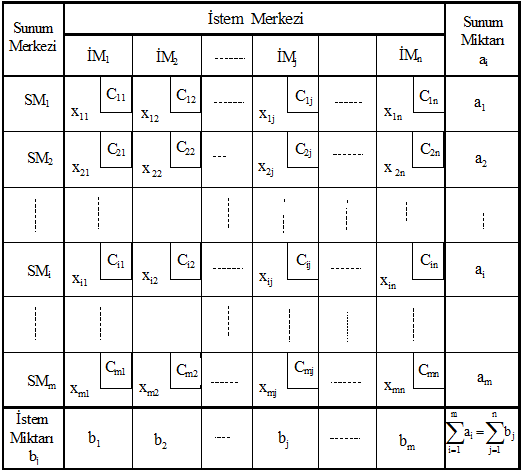**

Ulaştırma probleminin modellenmesi ve ulaştırma tablosunun kurulması konusunda
söylediklerimizi, basit bir örnek problem üzerinde uygulayalım.

**Örnek 7.1**: Güven AŞ değişik yerlerdeki dört fabrikasında deterjan
üretmektedir. Satışlarını değişik bölgelerde bulunan dört ana depo ile sağlayan
işletme yönetiminin temel sorunu, deterjanın fabrikalardan satış depolarına
ulaşımını sağlarken karşılaştığı yüksek tutarlardaki taşıma giderleridir.

Malların fabrikalardan satış depolarına gönderilirken katlanılması gereken birim
ulaştırma maliyetleri aşağıdaki gibi belirlenmiştir. Öte yandan, fabrika 1, 2, 3
ve 4’ün aylık üretim kapasiteleri sırasıyla, 50, 200, 150 ve 300 ton’dur.
Depoların istemleri, depo 1, 2, 3 ve 4 için sırasıyla 150, 75, 175 ve 300 ton
olarak belirlenmiştir. Buna göre,

**a**. Problemin dengeli olup olmadığını belirtiniz.

**b**. Ulaştırma tablosunu düzenleyiniz.

**c**. Problemin matematiksel modelini kurunuz.

|         |  Depo |    |    |    |
|---------|-------|----|----|----|
| Fabrika | D1    | D2 | D3 | D4 |
| F1      | 3     | 5  | 7  | 10 |
| F2      | 6     | 8  | 13 | 5  |
| F3      | 4     | 2  | 6  | 7  |
| F4      | 12    | 9  | 4  | 10 |

**Çözüm 7.1**: **a**. Problemin dengeli olup olmadığını belirlemek için,
tutarlılık koşulunun sağlanıp sağlanmadığının kontrol edilmesi gerekir. Bunun
için öncelikle, fabrikaların üretim miktarları toplamı (toplam sunum) ile
depoların ihtiyaç duydukları ürün miktarları toplamını (toplam istem)
hesaplayalım.

Toplam sunum = 50 + 200 + 150 + 300 = 700 ton

Toplam istem = 150 + 75 + 175 + 300 = 700 ton

İstem-sunum eşitliğinin sağlanması problemin dengeli olduğunu göstermektedir.

**b**. Düzenlenen ulaştırma modeli tablosu aşağıda gösterilmiştir.

**Tablo 7.2**

##### Problem 7.1’in Ulaştırma Modeli Tablosu

**c**. Amaç, en küçük toplam ulaştırma maliyetini belirlemek olduğuna göre,

X11: Fabrika 1’den depo 1’e taşınan deterjan miktarı

X12: Fabrika 1’den depo 2’ye taşınan deterjan miktarı

X33: Fabrika 3’den depo 3’e taşınan deterjan miktarı

. ...

X43: Fabrika 4’den depo 3’e taşınan deterjan miktarı

X44: Fabrika 4’den depo 4’e taşınan deterjan miktarı

olarak tanımlandığında, modelin amaç fonksiyonu aşağıdaki gibi yazılır.

Zenk = 3X11 + 5X12 + 7X13 + 10X14 + 6X21 + 8X22 + 13X23 + 5X24 + 4X31 + 2X32 +
6X33

\+ 7X34 + 12X41 + 9X42 + 4X43 + 10X44

Her bir fabrikadan gönderilecek deterjan miktarı o fabrikanın üretim miktarına
eşit olacağına göre,

X11 + X12 + X13 + X14 = 50

X21 + X22 + X23 + X24 = 200

X31 + X32 + X33 + X34 = 150

X41 + X42 + X43 + X44 = 300

yazılabilir.

Diğer taraftan, her satış deposunun ürün gereksiniminin tam olarak karşılanması
istendiğinden,

X11 + X21 + X31 + X41 = 150

X12 + X22 + X32 + X42 = 75

X13 + X23 + X33 + X43 = 175

X14 + X24 + X34 + X44 = 300

yazılmasıyla, kısıtlayıcı fonksiyonların tanımlanması işlemi tamamlanmış olur.

Son olarak negatif taşıma olmayacağına göre,

Xij ≥ 0 (i = 1, 2, 3, 4; j = 1, 2, 3, 4)

yazılacak, böylece problem ulaştırma modeli olarak formüllenmiş olacaktır.

## 7.4 ULAŞTIRMA PROBLEMLERİ ÇÖZÜM YÖNTEMLERİ

Esas olarak, bir tür doğrusal programlama problemi olması nedeniyle, herhangi
bir ulaştırma problemi doğrusal programlamanın genel çözüm yöntemi olan simpleks
yöntemle çözülebilir. Ulaştırma problemine simpleks yöntem uygulanması
kararlaştırıldığında, uygun bir başlangıç çözümüne ulaşmak amacıyla modelin
yürürlükteki (m X n) karar değişkenine (m + n) yapay değişken eklenmesi gerekir.
Bunun sonucunda, simpleks çözüm tabloları (m + n) satır ve [(m X n) + (m + n)]
sütundan oluşur. İşlemleri bu boyuttaki simpleks tablolarla sürdürmenin zaman
alıcı ve yorucu olacağı açıktır. Üstelik, gerçek uygulama problemlerinde sunum
ve istem merkezleri sayılarının binli rakamlarla açıklandıkları düşünüldüğünde,
simpleks yöntemin ulaştırma problemlerinin çözümü için etkin bir hesaplama
tekniği olmadığını söylemek yanlış olmaz. Sözgelimi, 7.1 nolu örnek problem
simpleks yöntemle çözülmek istenirse yürürlükteki on altı karar değişkenine
sekiz yapay değişken eklenmesi gerekir. Böylece, simpleks çözümün tekrarları
toplam yirmi dört değişkenle sürdürülür ki, bu da uzun aritmetik işlemlerin
yapılması demektir.

Ulaştırma problemlerinin çözümü için ulaştırma modelinin içerdiği basitleştirici
unsurlar (aij’lerin sıfır ya da bire eşit olması, kısıtlayıcı fonksiyonların
eşitliklerle ifade edilmesi ve temel uygun çözümlerin üçgen matris oluşturması
gibi) göz önünde bulundurularak simpleks yöntemden çok daha etkin yöntemler
geliştirilmiştir.

Ulaştırma problemlerinin çözümü için geliştirilen özel çözüm yöntemlerine
geçmeden önce, ulaştırma problemlerinin çözümüyle ilgili bazı tanımları vermek
uygun olur. Bu tanımlarla, 3.4. kesimde doğrusal programlama problemlerinin
çözümü için verilen tanımların benzerliklerine dikkat edilmelidir.

*Çözüm*: Bir ulaştırma probleminde tüm kısıtlayıcı fonksiyonları sağlayan
herhangi bir X = (X11, X12, ..., Xij, ..., Xmn) vektörüne *çözüm* denir.

*Uygun çözüm*: Herhangi bir çözüm sunum ve istem kısıtlayıcılarıyla birlikte
negatif olmama koşulunu da sağlıyor ise *uygun bir çözümdür*.

*Temel uygun çözüm*: Uygun bir çözümdeki temel değişkenlerin sayısı (m + n -
1)’e eşitse, bu uygun çözüm aynı zamanda temel bir çözümdür. Bu özelliklere
sahip olan çözüme *temel uygun çözüm* denir.

7.2 ve 7.3 nolu eşitlikler sistemi kısıtlayıcı fonksiyonlar olduğuna göre, genel
doğrusal programlama problemlerinde olduğu gibi herhangi bir ulaştırma
probleminin temel uygun çözümü, Xij’lerin [(m X n) - (m + n)] tanesinin sıfıra
eşitlenmesiyle elde edilebilir. Toplam sunumun toplam isteme eşitliği kabul
edildiğinden, (m + n - 1) eşitliğin değeri bilindiğinde, (m + n)’inci eşitliğin
değeri de biliniyor demektir. Bu durumda, iki gruptaki kısıtlayıcı
fonksiyonlardan biri gereksiz olduğundan, temel uygun çözüme (m + n - 1) pozitif
taşıma ile ulaşılabilir.

En iyi çözümün, amaç fonksiyonunun en iyi değerde olmasını sağlayan temel uygun
çözüm olduğu, ayrıca bir uygun çözümde pozitif değerli değişkenlere temel
değişken denildiğinin hatırlatılmasıyla ulaştırma modellerinin çözümü için
önerilen özel çözüm yöntemlerine geçebiliriz. İzlenen ve önerilen yaklaşımların
tümü genel olarak aşağıdaki dört temel aşamayı gerektirir.

*1*. Çözümlenmesi istenen soruna ilişkin verilerin matris formu biçimindeki
*ulaştırma modeli başlangıç tablosunda*([^24]) gösterilmesi.

[^24]: Karar değişkenlerinin (Xij) bulunmadığı ulaştırma tablosuna *başlangıç
    tablosu* diyeceğiz.

*2*. Satır ve sütun gereklerine uyularak *başlangıç* *temel uygun çözümün* elde
edilmesi için uygun dağıtımın yapılması.

*3*. Bir önceki adımda belirlenen çözümün en iyi olup olmadığının kontrol
edilmesi.

*4*. Çözüm en iyi değilse, en iyi çözüme ulaşıncaya kadar işlemlere devam
edilmesi.

Ulaştırma problemlerinin çözüm yöntemlerinde de simpleks yöntemdeki gibi bir
başlangıç çözümünün elde edilmesi zorunludur. Ulaştırma probleminin başlangıç
çözümünün bulunmasında başlangıç tablosunun boyutu göz önünde bulundurularak
değişik yöntemler uygulanabilir. Aşağıda belli başlıcaları açıklanacak
yöntemlerin esas amacı, en iyi çözüme en yakın bir başlangıç temel uygun çözüme
ulaşmaktır. Yöntemleri açıklamadan önce ele alacağımız yöntemlerle ulaşacağımız
başlangıç çözümlerinin hepsinin temel olacağını söylemenin doğru olmayacağını
belirtmeliyiz. Doğrusal programlamaya ilişkin yapıtlar incelendiğinde, sözü
edilen başlangıç çözümünün belirlenmesinde kullanılan yöntemlerin belli
başlıcalarının,

*1*. Kuzey-batı köşesi yöntemi

*2*. En düşük maliyetli gözeler yöntemi

*3*. VAM yöntemi

*4*. RAM yöntemi

olduğu görülebilir. Bu dört yöntem, genel olarak doğrusal programlama konusunda
çalışanlar tarafından en fazla tutulan ve kullanılan yöntemlerdir. Bu yöntemleri
sırasıyla açıklayalım.

### *7.4.1 Kuzey-Batı Köşesi Yöntemi*

Dantzig tarafından önerilen ve A. Charnes ve W. W. Cooper tarafından
isimlendirilen bu yöntem başlangıç tablosunun kuzey-batı (sol-üst) köşesindeki
gözeden başlayarak gerekli miktarların nasıl dağıtılacağını gösterir. Dağıtım
işleminde, satır ve sütunlara ilişkin kısıtlayıcı koşullar göz önünde
bulundurularak en uygun miktarlar gözelere yerleştirilmektedir. Yöntem,
aşağıdaki basamakların dizgesel bir biçimde izlenmesi ile uygulanmaktadır.

*1*. Başlangıç tablosunun sol-üst köşesindeki gözenin saptanması.

*2*. Birinci adımda saptanan gözeye, satır ve sütun gereklerine uygun olarak en
yüksek miktarda dağıtım için belirli bir rakamın yerleştirilmesi.

*3*. İkinci adımda gerçekleştirilen dağıtım sonucunda, ilgili sunum merkezinin
sunumu tümüyle kullanılmış, fakat bu gözenin ait olduğu sütundaki istem
merkezinin istemi tam olarak karşılanmamış (a1 ≤ b1) ise aşağıya doğru
kayıldığında rastlanan ilk gözeye satır ve sütun koşullarına uygun olarak yine
en yüksek miktarda dağıtımın yapılması. Aşağı doğru kayma işlemi, ilgili sütunun
istemi karşılanıncaya kadar sürdürülür. Gerçekleştirilen dağıtımla deponun
istemi tam olarak karşılanmış, fakat sunum merkezinin sunumu tamamiyle
dağıtılmamış (a1 ≥ b1) ise sağa doğru kayıldığında rastlanan gözeye en yüksek
miktarda dağıtım yapılır. Bu işlem, ilgili sunum merkezinin sunumunun tamamı
dağıtılıncaya kadar sürdürülür. Diğer taraftan, sol-üst köşedeki gözeye dağıtım
yapıldıktan sonra, hem satır hem de sütun gereği yerine getirilmiş ise bu
gözenin sağ altındaki gözeye kayılarak işlemler sürdürülür.

Kuzey-batı köşesi yöntemini aşağıdaki örnek probleme uygulayalım. Yöntemleri
açıklarken, pek çok yazarın yaptığı gibi, aynı kuramsal örnek kullanılacak
böylece, yöntemler arasında karşılaştırma yapma olanağı yaratılmış olacaktır.

**Örnek 7.2**: Bulaşık makinesi üreticisi Alet AŞ’nin değişik yerlerde dört
fabrikası vardır. İşletme, satışlarını değişik yerlerdeki dört deposu ile
yapmaktadır. İşletme yönetiminin temel sorunu, makineleri depolara en küçük
maliyetle taşımaktır. Fabrikaların üretim kapasiteleri, depoların istem
miktarları ve birim ulaştırma maliyetleri aşağıdaki ulaştırma tablosunda
gösterilmiştir. Başlangıç çözümünü ve bu çözüme ilişkin toplam ulaştırma
maliyetini bulunuz.

**Tablo 7.3**

**Problem 7.2’nin Başlangıç Tablosu**

****

**Çözüm 7.2**: Ulaştırma problemlerinin modellenmesine ilişkin bir örnek daha
olması bakımından önce problemin matematiksel modelini kuralım.

Xij, i (i = 1, 2, 3, 4) fabrikasından j (j = 1, 2, 3, 4) satış deposuna
gönderilen makine sayısını göstersin. Buna göre, amaç fonksiyonu aşağıdaki gibi
yazılacaktır.

Zenk = 4X11 + 3X12 + 4X13 + 5X14 + 6X21 + 8X22 + 5X23 + 8X24 + 3X31 + 4X32 +
5X33 + 5X34 + 1X41 + 2X42 + 3X43 + 4X44

Kısıtlayıcı fonksiyonlar,

X11 + X12 + X13 + X14 = 40

X21 + X22 + X23 + X24 = 60

X31 + X32 + X33 + X34 = 40

X41 + X42 + X43 + X44 = 50

X11 + X21 + X31 + X41 = 55

X12 + X22 + X32 + X42 = 25

X13 + X23 + X33 + X43 = 50

X14 + X24 + X34 + X44 = 60

olarak formüle edilir.

Negatif taşıma söz konusu olmadığına göre,

Xij ≥ 0 i = 1, 2, 3, 4; j = 1, 2, 3, 4

yazılmasıyla model kurulmuş olur.

Modelin düzenlenmesinin ardından yöntemin uygulanmasına geçebiliriz.

Başlangıç tablosunun sol üst köşesindeki göze F1D1 olduğundan, ilk taşıma bu
gözeye yapılacak, böylece ilk olarak X11 değişkeninin değeri belirlenecektir. b1
≥ a1 (55 ≥ 40) olduğundan, F1D1 gözesine en fazla 40 adet makine gönderilebilir.
Bu dağıtımla birinci fabrikanın sunumunun tamamı kullanıldığından, bundan
sonraki dağıtımlarda bu fabrika dikkate alınmaz. Birinci deponun istemi tam
olarak karşılanmadığından, aşağıya doğru kayılır ve rastlanan ilk gözeye (F2D1)
en yüksek miktarda dağıtım yapılır. Bu gözeye en fazla birinci deponun isteminin
karşılanamayan kısmı (b1 - a1) kadar, yani 15 makine gönderilebilir.

Bu dağıtımla sütun gereği sağlanmış olmakla birlikte satır gereği henüz yerine
getirilmemiş olduğundan, hemen sağa doğru kayıldığında rastlanan gözeye (F2D2)
taşınacak miktar belirlenir. İkinci fabrikanın sunumunun kullanılmayan kısmı 45
(60 - 15) birim, ikinci deponun istemi ise 25 birim olduğundan, bu gözeye en
fazla 25 birim taşınabileceği kararlaştırılır. Böylece, ikinci deponun istemi
bütünüyle karşılanmış olur. İkinci fabrikanın sunumuyla ilgili satır gereği
henüz karşılanmadığından, aynı satır üzerinde sağa doğru kayılması
gerekmektedir. Sağa doğru kayıldığında rastlanan gözeye (F2D3) en fazla 20 birim
taşınabilir. Bu dağıtımla, üçüncü deponun 50 birim olan isteminin 20 birimlik
kısmı karşılanmış, ikinci fabrikanın sunumunun tamamı dağıtılmış olur. F2D3
gözesine yapılan dağıtımdan sonra ikinci fabrikanın sunumuyla ilgili satır
gereği yerine getirilmiş olur.

Üçüncü deponun istemiyle ilgili sütun gereği henüz karşılanmadığı için aşağı
kayılması gerekir. Aşağı doğru kayıldığında rastlanan gözeye (F3D3)
taşınabilecek en yüksek miktar, üçüncü deponun isteminin henüz karşılanamayan
kısmı kadar, yani 30 (= 50 - 20) birimdir. Bu dağıtımla üçüncü deponun istemi
tam olarak karşılanmış olur. Üçüncü fabrikanın sunumundan geriye kalan 10
makinenin dördüncü depoya gönderilmesiyle bu fabrikanın sunumuyla ilgili satır
gereği yerine getirilmiş olduğundan aşağı doğru kayılır. Ulaşılan F4D4 gözesi
dağıtım yapılacak son gözedir. Bu gözeye taşınabilecek en yüksek miktar bu
deponun toplam 60 birim olan isteminin karşılanmayan kısmı kadar, yani 50 (= 60
\- 10) birimdir.

Bu dağıtımlarla problemin kuzey-betı köşesi yöntemiyle ulaşılan çözümü Tablo
7.4’deki gibi belirlenmiş olur.

Tablo7.4’den görüldüğü gibi, toplam yedi gözeye taşıma yapılmıştır. Bu gözelere
karşılık gelen karar değişkenleri ve bunların yürürlükteki değerleri şöyledir:

X11 = 40, X21 = 15, X22 = 25, X23 = 20, X33 = 30, X34 = 10 ve X44 = 50.

Dağıtım yapılan göze sayısı 7 (m + n - 1) olduğundan, yürürlükteki çözüm temel
bir çözümdür.

Ayrıca satır ve sütun gerekleri tam olarak karşılandığından, bu temel çözüm aynı
zamanda uygun bir çözümdür.

**Tablo 7.4**

**7.2. Problemin Kuzey-Batı Köşesi Yöntemiyle**

**Belirlenen Başlangıç Çözümü**

Çözüme ilişkin toplam maliyetin bulunması için, temel değişken değerlerinin ait
oldukları gözelere ilişkin birim taşıma maliyetleriyle çarpımlarının toplanması
gerekir. Buna göre toplam maliyet aşağıdaki gibi hesaplanacaktır([^25]).

[^25]: Şimdilik bu dağıtım planının en iyi olduğunu söylemek mümkün değildir. Daha
    küçük değerde bir maliyete ulaşılıp ulaşılamayacağı ancak çözümün en iyi
    olup olmadığının incelenmesinden sonra mümkün olur.

| Fabrika | Depo | Miktar (Adet) |  Maliyet (TL) |
|---------|------|---------------|---------------|
| F1      | D1   | 40            |  40 X 4 = 160 |
| F2      | D1   | 15            |  15 X 6 = 90  |
| F2      | D2   | 25            |  25 X 8 = 200 |
| F2      | D3   | 20            |  20 X 5 = 100 |
| F3      | D3   | 30            |  30 X 5 = 150 |
| F3      | D4   | 10            |  10 X 5 = 50  |
| F4      | D4   | 50            |  50 X 4 = 200 |
| TOPLAM  |  950 |               |               |

Kuzey-batı köşesi yöntemi uygulaması son derece kolay bir yöntem olmasına
karşın, dağıtım işlemlerinde maliyetler dikkate alınmadığından, genellikle en
iyi çözümden oldukça uzak bir çözüm vermekte, bunun doğal sonucu olarak da en
iyi çözüme ulaşmada gerekli işlem sayısı artmaktadır. Bununla birlikte, yöntemin
her zaman fazla işlem gerektireceği düşünülmemelidir. Bu, daha çok düşük
maliyetli gözelerin yerine bağlıdır.

### *7.4.2 En Düşük Maliyetli Gözeler Yöntemi*

Genellikle küçük boyutlu problemlerin çözümünde kullanılan bir yöntemdir. Bu
yöntemin uygulanmasında 1. Satır yaklaşımı, 2. Sütun yaklaşımı, 3. Genel
yaklaşım olmak üzere üç farklı yaklaşım söz konusudur.

**1. Satır Yaklaşımı**

En düşük maliyetli gözeler yönteminin satır yaklaşımında dağıtım işlemi satır ve
sütunların kısıtlayıcı koşulları göz önünde bulundurularak, her satırın en düşük
maliyetli gözelerine yapılması esasına dayanır. En düşük maliyetli gözenin
araştırıldığı satırda birden fazla sayıda en düşük maliyetli göze olduğunda,
sütun sayısı (j değeri) küçük olan gözenin seçilmesi önerilir. Bu yaklaşıma
göre, ilk olarak birinci satırdaki en düşük maliyetli gözeye satır ve sütun
şartlarına bağlı kalarak en yüksek miktardaki dağıtım yapılır. Bu dağıtımla
birinci satır şartı yerine getirilmiş ise ikinci satıra geçilir. Aksi halde
dağıtım bu satırın ikinci, üçüncü, ... en düşük maliyetli gözeleri ile
sürdürülür. Bu işlem, her seferinde ya bir satır ya bir sütun veya her ikisi
birden devre dışı bırakılarak, tüm satır ve sütun gerekleri yerine
getirilinceye, yani bir başlangıç çözümü elde edilinceye değin tekrarlanır.

Yukarıda kuzey-batı köşesi yöntemiyle çözülen örnek problemi bu yaklaşımla
çözelim.

**Tablo 7.5**

**7.2. Problemin Başlangıç Tablosu**

Tablodan görüldüğü gibi, birinci satırın en düşük (3) maliyeti F1D2’ye ait
olduğundan, dağıtıma bu göze ile başlanacak, yani ilk olarak X12 değişkeninin
değeri belirlenecektir. Bu gözenin işaret ettiği deponun istemi 25 birim, bu
istemi karşılamak durumunda olan birinci fabrikanın sunumu 40 birim olduğundan,
bu gözeye en fazla 25 makine gönderilebilir. Bu dağıtımla birinci fabrikanın
sunumu tamamiyle dağıtılmadığından, aynı satırın ikinci en düşük maliyetli
gözesine geçilir. Birinci satırda birden fazla ikinci en düşük maliyetli göze
olduğundan, dağıtım sütun sayısı daha küçük olan F1D1 gözesine yapılacaktır. Bu
gözeye en fazla, birinci fabrikanın sunumunun kullanılmayan kısmı kadar, yani 15
(= 40 - 25) makine gönderilebilir. Bu dağıtımla birinci fabrikanın 40 birim olan
sunumunun tamamı ilk iki depo için kullanılmış olur. Birinci fabrikanın
sunumuyla ilgili satır gereği yerine getirilmiş olduğundan ikinci satıra
geçilir.

İkinci satırdaki en düşük (5) maliyet F2D3’e aittir. İkinci fabrikanın henüz el
değmemiş olan sunumunun 50 birimlik kısmının birinci depoya taşınmasıyla bu
deponun istemi karşılanmış ve bu depo devre dışı kalmış olur. Bu dağıtımda satır
gereği tam olarak karşılanmadığından, aynı satırın ikinci en düşük maliyetli
gözesine geçilir. Bu satırın ikinci en düşük (6) maliyetli gözesi F2D1’dir.
İkinci fabrikanın elinde kalan 10 makinenin ikinci depoya gönderilmesiyle satır
gereği karşılanmış olduğundan, bir sonraki dağıtım için üçüncü satıra geçilir.

Üçüncü satırdaki en düşük (3) maliyet F3D1’e aittir. Bu gözenin bulunduğu
sütundaki deponun toplam 55 birim olan isteminin 25 birimlik kısmı önceki
dağıtımlarda karşılanmış olduğundan, isteminin karşılanmayan kısmı kadar bir
taşımanın üçüncü fabrikadan gerçekleştirilmesiyle, ilgili deponun istemi
tamamiyle karşılanmış olur. Üçüncü fabrikanın sunumuyla ilgili satır gereği
henüz sağlanmadığından, bu satırın ikinci en düşük maliyetli gözesine geçilir.
Depo 2 ve depo 3 önceki dağıtımlarla devre dışı kaldıklarından, bu satırda
dağıtım yapılacak tek bir göze (F3D4) vardır. Bu gözeye taşınabilecek en yüksek
miktar, üçüncü fabrikanın sunumunun kullanılmayan kısmı kadar, yani 10 birimdir.

Dördüncü satırın devre dışı kalmamış tek gözesi olan F4D4’e en fazla dördüncü
deponun isteminin karşılanmamış kısmı kadar, yani 50 makine gönderilebilir. Bu
taşımayla dağıtım işlemi tamamlanmış ve çözüm Tablo 7.6’daki gibi belirlenmiş
olur.

**Tablo 7.6**

**7.2. Problemin Satır Yaklaşımıyla Elde Edilen Başlangıç Çözümü**

Tablo 7.6 incelendiğinde, gerçekleştirilen dağıtımlarla depo istemlerinin tam
olarak karşılandığı ve fabrikaların sunumunun eksiksiz dağıtıldığı görülebilir.
Bu nedenle, tablodaki çözüm uygun bir çözümdür.

Toplam 7 gözeye dağıtım yapıldığından, ulaşılan başlangıç çözümü temel çözümdür.
Taşıma yapılan (dolu) gözelere karşılık gelen karar değişkenleri ve değerleri
şöyledir:

X11 = 15, X12 = 25, X21 = 10, X23 = 50, X31 = 30, X34 = 10, X44 = 50

Bu başlangıç temel uygun çözüme ait maliyetin bulunması için, temel değişken
değerlerinin ait oldukları gözelere ilişkin birim taşıma maliyetleriyle
çarpımlarının toplanması gerekir.

Bu açıklamalar doğrultusunda, çözümün toplam maliyeti aşağıdaki gibi
hesaplanacaktır([^26]).

[^26]: Şimdilik bu toplam maliyetin en iyi olduğu söylenemez. Daha küçük değerde
    bir maliyete ulaşılıp ulaşılamayacağı, çözümün en iyi olup olmadığının test
    edilmesinden sonra mümkün olur. Bu açıklama, tüm başlangıç çözümleri için
    geçerlidir.

| Fabrika | Depo | Miktar (Adet) | Maliyet (TL) |
|---------|------|---------------|--------------|
| F1      | D1   | 15            | 15 X 4 = 60  |
| F1      | D2   | 25            | 25 X 3 = 75  |
| F2      | D1   | 10            | 10 X 6 = 60  |
| F2      | D3   | 50            | 50 X 5 = 250 |
| F3      | D1   | 30            | 30 X 3 = 90  |
| F3      | D4   | 10            | 10 X 5 = 50  |
| F4      | D4   | 50            | 50 X 4 = 200 |
| TOPLAM  |  785 |               |              |

**2.** **Sütun Yaklaşımı**

En düşük maliyetli gözeler yönteminin sütun yaklaşımında da, en düşük maliyetli
gözeler yönteminin satır yaklaşımındaki gibi hareket edilir. İki yaklaşım
arasındaki tek fark, birinde satırların, diğerinde sütunların en düşük maliyetli
gözelerinin dikkate alınmasıdır. Birden fazla en düşük maliyetli göze ile
karşılaşıldığında, satır sayısı (i değeri) küçük olan gözenin seçilmesi
önerilmektedir.

En düşük maliyetli gözeler yönteminin sütun yaklaşımını aynı örnek probleme
uygulayalım. Örnek problemin başlangıç tablosu aşağıda tekrarlanmıştır.
Problemin başlangıç tablosundan görüldüğü gibi, birinci sütunun en düşük
maliyeti F4D1’e ait olduğundan, dağıtıma bu gözeden başlanacak, yani ilk olarak
X41 değişkeninin değeri belirlenecektir. Bu gözenin işaret ettiği deponun istemi
55 birim, bu istemi karşılamak durumunda olan birinci fabrikanın sunumu 40 birim
olduğundan bu gözeye en fazla 40 makine gönderilebilir.

**Tablo 7.7**

**7.2. Örnek Problemin Başlangıç Tablosu**

Bu göndermeyle birinci deponun tüm gereksinimi karşılanamadığından, aynı sütunun
ikinci en düşük (3) maliyetli gözesi olan F3D1’e geçilir. Bu gözeye en fazla
D1’in isteminin karşılanmayan kısmı kadar, yani 5 (= 55 - 50) makine
gönderilebilir. Bu göndermeyle birinci deponun istemiyle ilgili sütun gereği
yerine getirilmiş olduğundan, ikinci sütuna geçilir. İkinci sütunun en düşük
maliyetli (3 TL) gözesi (F4D2 bir önceki dağıtımla devre dışı kaldığından)
F1D2’dir. Bu gözeye en fazla bu gözenin işaret ettiği deponun istemi kadar, yani
25 makine gönderilebilir. Bu göndermeyle ikinci depoyla ilgili sütun gereği
sağlandığından yeni dağıtım için üçüncü sütuna geçilir.

Üçüncü sütunun en düşük maliyetli (4 TL) gözesi F1D3’dür. Bu gözeye en fazla
birinci fabrikanın sunumunun dağıtılmayan kısmı kadar, yani 15 (= 40 - 25)
makine gönderilebilir. Üçüncü deponun istemi tam olarak karşılanamadığından aynı
sütunun ikinci en düşük maliyetli gözesine geçilir. Bu sütunda en düşük
maliyetli (5 TL) iki göze (F2D3, F3D3) vardır. İlk dağıtımı satır sayısı küçük
olan F2D3 gözesine yapalım. Satır ve sütunların kısıtlayıcı koşulları göz önünde
bulundurulduğunda, bu gözeye en fazla 35 birim gönderilir. Bu dağıtımla sütun
gereği yerine getirilmiş olduğundan, dördüncü sütuna geçilir.

Dağıtımın F3D4’e yapılması gerektiği bellidir. Bu gözeye gönderilebilecek en
yüksek miktar, üçüncü fabrikanın kullanılmayan sunumu kadar, yani 35 birimdir.
Bu sütunda dağıtım yapılması gereken tek bir göze (F2D4) kalmıştır. Bu gözenin
maliyet katsayısı büyük olmakla birlikte kural gereği bu gözenin doldurulması
gerekmektedir. Dördüncü deponun isteminin karşılanmayan kısmı olan 25 birimin,
ikinci fabrikanın sunumunun henüz kullanılmamış olan kısmıyla karşılanmasıyla
dağıtım işlemi tamamlanmış olur.

Yapılan dağıtımlarla ulaşılan çözüm Tablo 7.8’de gösterilmiştir. Tablodan
görüldüğü gibi, temel değişkenler ve bunların başlangıç çözümündeki değerleri
şöyledir:

X12 = 25, X13 = 15, X23 = 35, X24 = 25, X31 = 5, X34 = 35, X41 = 50.

**Tablo 7.8**

**7.2. Problemin Sütun Yaklaşımıyla Bulunan Başlangıç Çözümü**

Tablo 7.8’den görüldüğü gibi ulaşılan çözüm temel (temel değişken sayısı = 7
olduğundan) uygun bir çözümdür. Çözüme ilişkin toplam maliyet aşağıdaki gibi
hesaplanmıştır.

| Fabrika | Depo | Miktar (Adet) | Maliyet (TL)  |
|---------|------|---------------|---------------|
| F1      | D2   | 25            |  25 X 3 = 75  |
| F1      | D3   | 15            |  15 X 4 = 60  |
| F2      | D3   | 35            |  35 X 5 = 175 |
| F2      | D4   | 25            |  25 X 8 = 200 |
| F3      | D1   | 5             |  5 X 3 = 15   |
| F3      | D4   | 35            |  35 X 5 = 175 |
| F4      | D1   | 50            |  50 X 1 = 50  |
| TOPLAM  |  750 |               |               |

**3. Genel Yaklaşım**

Bu yaklaşım da, önceki yaklaşımlar gibi, daha çok küçük boyutlu problemlerin
çözümünde uygulanır. En düşük maliyetli gözeler yönteminin genel yaklaşımında,
önceki iki yaklaşımdan farklı olarak, satır ve sütun farkına bakılmaksızın
başlangıç tablosunun bütünü dikkate alınır. Dağıtım yapılacak ilk göze, tablonun
en düşük maliyetli gözesidir. Bu gözeye satır ve sütunun kısıtlayıcı koşullarına
bağlı kalarak en yüksek miktarda dağıtım yapılır. Böylece bir satır veya bir
sütun veya her ikisi birden

Bir sonraki dağıtımda devre dışı bırakılır. Eğer birden fazla en düşük maliyetli
göze varsa seçim rasgele yapılır.

Kesin bir kural olmamakla birlikte, en düşük maliyetli gözeler yönteminin genel
yaklaşımıyla belirlenen toplam maliyet, genellikle diğer iki yaklaşımla
belirlenen toplam maliyetlerden küçük olmaktadır.

En düşük maliyetli gözeler yönteminin genel yaklaşımını aynı örnek probleme
uygulayalım.

Ulaştırma tablosunun en düşük (1) maliyetli gözesi F4D1’dir. Bu nedenle ilk
dağıtım bu gözeye yapılacaktır. Bu gözeye en fazla 50 birim taşınabilir. Bu
dağıtımla birinci deponun 55 birimlik isteminin 50 birimlik kısmı dördüncü
fabrikadan karşılanmış olur. Dördüncü fabrikanın tüm sunumu kullanıldığından,
ikinci dağıtımda bu fabrikanın bulunduğu satır dikkate alınmaz. Kalan üç satır
ve dört sütundan oluşan tabloda aynı en düşük maliyete sahip iki göze (F1D2 ve
F3D1) vardır.

İkinci dağıtımı, rasgele seçtiğimiz F1D2 gözesine yapalım. Bu gözeye en fazla
ikinci deponun istemi kadar, yani 25 birim gönderilebilir. Bu dağıtımla ikinci
deponun istemi eksiksiz karşılandığından, bir sonraki dağıtım işleminde bu
deponun bulunduğu sütun devre dışı bırakılır. Kalan üç satır ve üç sütundan
oluşan tablonun en düşük (3) maliyetli gözesi F3D1’dir. F3D1’e en fazla birinci
deponun isteminin karşılanamayan kısmı kadar, yani 5 birim aktarılabilir. Bu
dağıtımla birinci deponun istemi tamamen karşılanmış olduğundan, yeni dağıtımda
birinci depo sütunu dikkate alınmaz.

Bu aşamaya gelindiğinde üç satır ve iki sütundan oluşan bir tabloyla yüzyüze
geliriz. Daha küçük boyuttaki bu tablonun en düşük (4) maliyetli gözesi F1D3 ve
bu gözeye taşınacak en yüksek miktar 15(40 - 25) birimdir.

Bu dağıtımla birinci fabrikanın sunumuyla ilgili satır gereği yerine getirilmiş
olduğundan, bu satır devre dışı kalır. Kalan dört gözeden üçü aynı en düşük (5
TL) maliyete sahiptir.

Dağıtım işlemini F2D3 ile sürdürelim. Bu gözeye dağıtılacak en yüksek miktar 35
birimdir. Bu dağıtımla üçüncü deponun istemi tam olarak karşılandığından, bir
sonraki dağıtımda üçüncü sütun dikkate alınmaz.

Dağıtım yapılması gereken iki göze (F2D4 ve F3D4) daha vardır. İkinci ve üçüncü
fabrikaların sunumlarının henüz kullanılmayan kısımlarının bu gözelere
taşınmasıyla dağıtım işlemi tamamlanmış ve Tablo 7.9’daki başlangıç çözümüne
ulaşılmış olur.

Genel yaklaşımla belirlenen çözümün yer aldığı tablodan görüldüğü gibi,
başlangıç çözümünün temel değişkenleri ve bunların değerleri şöyledir:

X12 = 25, X13 = 15, X23 = 35, X24 = 25, X31 = 5, X34 = 35, X41 = 50

Pozitif değerli temel değişken sayısı 7 (= m + n - 1)’ye eşit olduğundan, bu
çözüm de önceki başlangıç çözümleri gibi temel çözümdür.

# Tablo 7.9

**7.2. Problemin Genel Yaklaşımla Bulunan Başlangıç Çözümü**

Kolayca kontrol edilebileceği gibi, aynı zamanda uygun olan bu çözüme ilişkin
toplam maliyet, önceden olduğu gibi temel değişken değerlerinin kendilerine
karşılık gelen birim ulaştırma maliyetlerinin karşılıklı çarpımlarının
toplanmasıyla aşağıdaki gibi hesaplanacaktır.

| Fabrika | Depo | Miktar (Adet) | Maliyet (TL) |
|---------|------|---------------|--------------|
| F1      | D2   | 25            | 25 X 3 = 75  |
| F1      | D3   | 15            | 15 X 4 = 60  |
| F2      | D3   | 35            | 35 X 5 = 175 |
| F2      | D4   | 25            | 25 X 8 = 200 |
| F3      | D1   |  5            |  5 X 3 = 15  |
| F3      | D4   | 35            | 35 X 5 = 175 |
| F4      | D1   | 50            | 50 X 1 = 50  |
| TOPLAM  |  750 |               |              |

### *7.4.3 VAM Yöntemi*

Türkçedeki adını, İngilizce **Vogel’s ApproXimation Method** kelimelerinin ilk
harflerinden alan bu yöntem, William R. Vogel tarafından 1958’de ileri
sürülmüştür. Yöntemin en önemli özelliği, genellikle en iyi çözüme en yakın
hatta en iyi çözümü başlangıçta vermesidir.

Yöntem aşağıda açıklanan aşamaların adım adım izlenmesi ile uygulanır.

*1*. Birim ulaştırma maliyetlerinin oluşturduğu matrisin her bir satır ve her
bir sütunundaki en düşük maliyetli iki Cij maliyet katsayısı saptanır.

*2*. Birinci adımda belirlenen Cij’ler arasındaki farklar hesaplanır. Satır
Cij’leri için hesaplanan fark değerleri tabloya eklenen bir ek satıra, sütun
Cij’leri için hesaplanan fark değerleri tabloya eklenen bir ek sütuna yazılır.
Bu farklar en düşük maliyetli gözenin kullanılmaması durumunda katlanılacak
fazla harcamayı, yani bir çeşit cezayı ifade ettiklerinden bunlara birim ceza
(penaltı) değerleri de denir. Bu nedenle VAM yöntemi *birim penaltı yöntemi*
olarak da bilinir.

*3*. İkinci adımda hesaplanan (m + n) fark değerlerinden en büyük olanı
saptanır.

*4*. En büyük değerli farkın ortaya çıktığı satır veya sütunun en düşük
maliyetli gözesi belirlenir. Bu gözeye satır ve sütun koşullarına uygun olarak
en yüksek miktardaki dağıtım yapılır. Yapılan bu dağıtım miktarı, ilgili satır
ve sütun toplamlarından çıkartılır. Dağıtım yapılan gözenin işaret ettiği istem
merkezinin istemi tam olarak karşılanmış ya da sunum merkezinin sunumu bütünüyle
dağıtılmış ise, o sunum merkezi veya istem merkezi (duruma göre her ikisi
birden) bir sonraki dağıtım işleminde devre dışı bırakılır.

*5*. Dağıtım yapılan satır veya sütunun (veya her ikisinin birden) devre dışı
bırakılması ve sunum ile istem merkezlerinin sunum-istem miktarlarının yeniden
ayarlanmasıyla yeni bir tablo düzenlenir.

*6*. Düzenlenen bu yeni tabloda satır veya sütun sayısı bire ininceye değin 1-5
nolu işlemler sırasıyla izlenerek yinelenir.

En büyük fark değerleri birbirine eşit olabilir. Bu durumda, dağıtım işlemi
bunlardan herhangi birinin rasgele seçilmesiyle sürdürülebilir. Ancak, bu
durumda en iyi çözüme ulaşmak için gerekli işlem sayısı artabilir.

Aşağıdaki kurallara uyulması durumunda bu tehlike ortadan kalkar.

\- En büyük fark iki ya da daha fazla satırda (ya da sütunda) ortaya çıkarsa, en
büyük ai (ya da bj) değerli satırdaki (ya da sütundaki) en düşük maliyetli göze
seçilir.

\- En büyük fark bir satır ve bir sütunda aynı anda ortaya çıkarsa ve söz konusu
satır ile sütunun kesiştiği yerdeki gözenin maliyeti en düşük ise dağıtım için
bu göze seçilir.

Söz konusu gözeye ilişkin maliyet en düşük değilse, ilgili satır ya da sütunun
en düşük maliyetli gözesi seçilir.

VAM yöntemini, şimdiye kadar açıklanan yöntemlerin uygulandığı aynı örnek
probleme, uygulayalım. Yöntemin ilk tekrarında edilen, henüz tamam olmayan çözüm
Tablo 7.10’da sunulmuştur.

Satırlar itibariyle hesaplanan farkların yer aldığı ek sütun ile sütunlar
itibariyle hesaplanan farkların yer aldığı ek satır incelendiğinde en büyük
farkın 2 olduğu ve birinci sütun için hesaplandığı görülebilir. Yukarıda
açıklanan kural gereği dağıtım için bu sütunun en düşük maliyetli gözesi
bulunacak ve ilk dağıtım bu gözeye gerçekleştirilecektir.

# Tablo 7.10

**7.2. Problemin VAM (Birinci Deneme) Çözümü**

Söz konusu sütunun en düşük (1) maliyetli gözesi F4D1’dir. a4 ≤ b1 (50 ≤ 55)
olduğundan, bu gözeye en fazla 50 birim taşınabilir. Böylece, dördüncü
fabrikanın sunumu tam olarak kullanıldığından, bu fabrika bir sonraki dağıtım
işleminde dikkate alınmaz. Yeni tabloda birinci deponun gereksiniminin 5 (= 55 -
50) birim olacağı unutulmamalıdır. Dördüncü satırın devre dışı bırakılması ve
birinci deponun isteminin 5 birime düşürülmesiyle, yeni dağıtım için hazırlanan
tablo aşağıda gösterilmiştir. Tablodan görüldüğü gibi, en büyük fark (1) üç
satır ve üç sütunda aynı anda ortaya çıkmıştır. En düşük (3) maliyete birinci
satırla ikinci sütunun, ayrıca üçüncü satırla birinci sütunun kesiştiği
yerlerdeki gözelerin (F1D2 ve F3D1) sahip oldukları dikkate alındığında,
dağıtımın bu gözelerden birine yapılması gerektiği anlaşılır.

#### Tablo 7.11

**7.2. Problemin VAM (İkinci Deneme) Çözümü**

Yukarıdaki açıklamalar doğrultusunda ilk olarak, F1D2 gözesini ele alalım. Bu
gözeye en fazla ikinci deponun istemi kadar, yani 25 birim transfer edilebilir.
Bu taşımayla birinci fabrikanın toplam 40 birim olan sunumunun 25 birimlik kısmı
kullanılmış olur. Bu dağıtımla ikinci deponun istemi tam olarak
karşılandığından, bu depo bir sonraki dağıtım işleminde dikkate alınmaz.

Bu arada, yeni düzenlenecek tabloda birinci fabrikanın dağıtılabilir sunum
miktarının 15(40 - 25) birim olması gerektiği unutulmamalıdır. İkinci deponun
işlem dışı bırakılması ve birinci fabrikanın sunumunun kullanılmayan kısmının 15
birim olduğunun belirlenmesinden sonra yeni dağıtımda kullanılmak üzere
hazırlanan tablo aşağıda gösterilmiştir.

Tablo 7.12’den görüldüğu gibi, en büyük farkın (2) ortaya çıktığı üçüncü satırın
en düşük maliyetli (3 TL) gözesi F3D1’dir. Satır ve sütunun kısıtlayıcı
koşulları göz önünde bulundurulduğunda, bu gözeye en fazla 5 birim mal transfer
edileceği görülür.

**Tablo 7.12**

**7.2. Problemin VAM (Üçüncü Deneme)Çözümü**

Bu taşıma ile birinci deponun istemi tam olarak karşılanmış, üçüncü fabrikanın
sunum miktarı 35(40 - 5) birime düşmüş olur.

Birinci deponun devre dışı bırakılması ve üçüncü fabrikanın sunum kapasitesinin
duruma uygun şekilde düzeltilmesiyle elde edilen tablo (Tablo 7.13) aşağıda
gösterilmiştir.

Dördüncü deneme sonrası düzenlenen tablodan görüldüğü gibi bu kez en büyük fark
ikinci satırda ortaya çıkmıştır. İkinci satırın en düşük maliyetli gözesi F2D3
gözesi olduğundan dağıtım bu gözeye yapılacaktır. Bu gözeye gönderilecek en
yüksek miktar 50 birimdir. Bu dağıtımla depo 3’ün istemi tam olarak karşılanmış
olacağından bir sonraki dağıtımda bu depo dikkate alınmayacaktır.

**Tablo 7.13**

**7.2. Problemin VAM (Dördüncü Deneme) Çözümü**

İkinci fabrikanın 60 birim olan toplam sunumunun 50 birimlik kısmı
kullanıldığından yeni hazırlanacak tabloda bu fabrikanın sunumunun 10 birim
olduğu düşünülür.

Yukarıdaki açıklamalar doğrultusunda hazırlanan beşinci deneme çözüm tablosu
aşağıda gösterilmiştir.

**Tablo 7.14**

**7.2. Problemin VAM (Beşinci Deneme) Çözümü**

Tablo 7.14’den görüldüğü gibi geriye bir sütun kaldığından, fark hesaplanamaz.
Bu durumda dördüncü deponun toplam 60 birim olan istemi üç fabrikanın, daha
önceki dağıtımlar sonrası ellerinde kalan kullanılabilir sunumlarıyla
karşılanarak dağıtım işlemi Tablo 7.15’deki gibi planlanmış olur.

**Tablo 7.15**

**7.2. Problemin VAM Yöntemiyle Bulunan Başlangıç Çözümü**

Uygun dağıtımlarla hem satır hem de sütun gerekleri karşılandığından, tablodaki
çözüm uygundur. Bu uygun çözümde bulunan temel değişkenler ve bu değişkenlerin
değerleri: X12 = 25, X14 = 15, X23 = 50, X24 = 10, X31 = 5, X34 = 35 ve X41 = 50
olarak belirlenmiştir. Temel değişken sayısı 7 olduğundan bu çözüm de, önceki
çözümler gibi temel çözüm olup toplam maliyet 720 TL olarak hesaplanmıştır.

| Fabrika | Depo | Miktar (Adet) | Maliyet (TL)  |
|---------|------|---------------|---------------|
| F1      | D2   | 25            |  25 X 3 = 75  |
| F1      | D4   | 15            |  15 X 5 = 75  |
| F2      | D3   | 50            |  50 X 5 = 250 |
| F2      | D4   | 10            |  10 X 8 = 80  |
| F3      | D1   | 5             |  5 X 3 = 15   |
| F3      | D4   | 35            |  35 X 5 = 175 |
| F4      | D1   | 50            |  50 X 1 = 50  |
| TOPLAM  |  720 |               |               |

### *7.4.4 RAM Yöntemi*

Adını, İngilizce **Russel’s ApproXimation Method** kelimelerinin ilk
harflerinden alan yöntemin en önemli özelliği, tıpkı VAM gibi, en iyi çözüme
oldukça yakın hatta en iyi çözümü başlangıçta vermesidir. Yöntem içeriğindeki
adımlar aşağıda açıklanmıştır.

### *1*. Başlangıç tablosunun her satır ve her sütunundaki en yüksek Cij maliyet katsayısı saptanır. Satır en büyükleriyle bir sütun, sütun en büyükleriyle bir satır oluşturulur.

### 

### 

### 

### 

### 

### 

### 

### 

### 

### 

### 

### 

### 

### 

### 

### 

### 

### 

### 

### 

### 

### 

### 

### 

### 

### 

### 

### 

Oluşturulan sütun tablonun en sağına, satır ise tablonun en altına eklenir. RAM
yöntemiyle ilgili bu ilk adım aşağıdaki tabloda gösterilmiştir.

## Tablo 7.16

**7.2. Problemin Başlangıç Tablosu**

*2*. Yeni maliyet katsayılarının yazılması için boş bir tablo hazırlanır. İlk
gözeden başlanarak yeni maliyet katsayıları hesaplanır.

Yeni maliyetler, dikkate alınan gözenin bulunduğu satır ve sütunun en büyük
maliyet katsayıları toplamı ile o gözenin orijinal maliyet katsayısı arasındaki
farka eşittir. Sözgelimi, C11’in yeni değeri birinci satırdaki en büyük değer
(5) ile, birinci sütundaki en yüksek değer (6)’nın toplamından F1D1 gözesinin
orijinal maliyet değerinin (4) çıkartılmasıyla 7 olarak hesaplanır.

*3*. İkinci adımda hesaplanan maliyetlerden en büyük olan saptanır. Bu gözeye
satır ve sütun koşullarına uygun olarak en yüksek miktardaki dağıtım yapılır.
Yapılan bu dağıtım miktarı, ilgili satır ve sütun toplamlarından düşülür.
Dağıtım yapılan gözeye ilişkin istem merkezinin istemi tam olarak karşılanmışsa
ilgili sütun, sunum merkezinin sunumu tamamen kullanılmışsa karşılık gelen satır
bir sonraki dağıtımda işlem dışı bırakılarak, yeni bir tablo hazırlamak üzere
başlangıç tablosuna dönülür. Düzenlenen tablolarda satır veya sütun sayısı bire
ininceye kadar 1-3 nolu işlemler tekrarlanır.

Yukarıdaki açıklamalar doğrultusunda hazırlanan tablo aşağıda gösterilmiştir.
Yeni maliyetlerin yer aldığı tablo incelendiğinde, en yüksek değerli (10) iki
göze bulunduğu görülebilir. Dağıtım için bu iki gözeden herhangi biri
seçilebilir. İlk olarak, F1D2’e satır ve sütun gereklerine uygun olarak en
yüksek miktardaki dağıtımı gerçekleştirelim.

## Tablo 7.17

**7.2. Problemin RAM (Birinci Deneme) Çözümü**

F1D2 gözesine en fazla 25 birim transfer edilebilir. Bu dağıtımla ikinci deponun
istemi tam olarak karşılandığından, bir sonraki dağıtım işleminde ikinci sütun
dikkate alınmaz. Ayrıca, birinci fabrikanın sunum miktarının 15 (= 40 - 25)
birim olarak düzeltilmesi gerekir. Yeni deneme çözüm tablosu aşağıda
gösterilmiştir.

**Tablo 7.18**

**7.2. Problemin RAM (İkinci Deneme) Çözümü**

Tablo 7.18’in en yüksek maliyetli gözesi F4D1’dir. Bu gözeye en fazla 50 birim
aktarılabilir. Bu taşımayla birinci deponun 55 birim olan isteminin 50 birimlik
kısmı karşılanmış, dördüncü fabrikanın sunumu tüketilmiş olur.

Dördüncü fabrikanın işlem dışı bırakılmasıyla bir sonraki dağıtım için
maliyetler aşağıdaki gibi hesaplanacaktır.

# Tablo 7.19

**7.2. Problemin RAM (Üçüncü Deneme) Çözümü**

Tablo 7.19’un altı gözesi birden aynı yüksek (8) maliyete sahip olduğundan,
dağıtım işlemi bunlardan herhangi birinin rasgele seçilmesiyle sürdürülebilir.
Bu gözeleri F1D4’den başlayarak sırayla ele alıp uygun dağıtım miktarlarını
belirleyelim. F1D4’e en fazla 15 birim transfer edilir. Bu dağıtımla birinci
fabrikanın sunumunun tamamı kullanılmış, dördüncü deponun 60 birim olan toplam
isteminin 15 birimlik kısmı karşılanmış olur.

F2D1’e geçelim. F2D1’e en fazla birinci deponun isteminin önceki dağıtımlarda
karşılanamayan kısmı kadar, yani 5 birim gönderilir. Bu dağıtımla birinci
deponun bulunduğu sütun gereği yerine getirilmiş olduğundan, birinci sütun devre
dışı bırakılır. F2D3 gözesine yapılabilecek en yüksek dağıtım 50 birimdir. Bu
dağıtımla üçüncü deponun tüm istemi karşılanmış olduğundan bu depo işlem dışı
bırakılır. İkinci fabrikanın sunumundan geriye kalan yalnızca 5 birimdir. Bu
miktarın F2D4 gözesine taşınmasıyla dağıtım yapılacak tek bir göze (F3D4) kalmış
olur. Dördüncü deponun isteminin önceki dağıtımlarda karşılanamayan kısmının
üçüncü fabrikadan karşılanmasıyla dağıtım işlemi tamamlanmış olur.

7.17-7.19 nolu tablolarda yer alan dağıtımlar aşağıdaki tabloda topluca
gösterilmiştir. Dağıtım yapılan göze, yani temel değişken sayısı (m + n - 1)’e
eşittir. Dolayısıyla, RAM’la ulaşılan bu çözüm de önceki çözümler gibi temel bir
çözümdür.

# Tablo 7.20

**7.2. Problemin RAM Yöntemiyle Elde Edilen Başlangıç Çözümü**

Aynı zamanda uygun olan bu temel çözüme ilişkin toplam maliyet aşağıdaki gibi
hesaplanmıştır.

| Fabrika | Depo | Miktar (Adet) | Maliyet (TL)  |
|---------|------|---------------|---------------|
| F1      | D2   | 25            |  25 X 3 = 75  |
| F1      | D4   | 15            |  15 X 5 = 75  |
| F2      | D1   | 5             |  5 X 6 = 30   |
| F2      | D3   | 50            |  50 X 5 = 250 |
| F2      | D4   | 5             |  5 X 8 = 40   |
| F3      | D4   | 40            |  40 X 5 = 200 |
| F4      | D1   | 50            |  50 X 1 = 50  |
| TOPLAM  |  720 |               |               |

Aynı problemi, değişik yöntemlele çözerek farklı maliyetler hesaplamış
bulunuyoruz. Altı farklı yöntemle elde edilen maliyetler aşağıda topluca
gösterilmiştir.

| Çözüm Yöntemi      | Maliyet (TL) |
|--------------------|--------------|
| Kuzey-batı köşesi  | 950          |
| Satır yaklaşımı    | 785          |
| Sütun yaklaşımı    | 750          |
| Genel yaklaşım     | 750          |
| VAM                | 720          |
| RAM                |  720         |

Toplam maliyetin en yüksek değerinin kuzey-batı köşesi yöntemiyle, en düşük
maliyetin ise VAM ve RAM yöntemleriyle elde edildiği görülebilir. Bu değerler,
bu kesimde yaptığımız açıklamaları destekler niteliktedir.

## 7.5 EN İYİ ÇÖZÜMÜN ELDE EDİLMESİ

Yukarıda açıklanan yöntemlerden hangisiyle olursa olsun, bir başlangıç temel
uygun çözüme ulaşıldığında, eldeki çözümün en iyi olup olmadığı
araştırılmalıdır. Bunun için, yürürlükteki çözümün temel olmayan değişkenlerinin
teker teker çözüme alınmaları sonucunda toplam maliyette ortaya çıkan
değişikliğin incelenmesi yeterli olur. Temel olmayan bir değişken temele
alındığında toplam maliyet azalıyorsa en iyi çözüme biraz daha yaklaşılmış olur.
Yeni değişikliklerle daha küçük değerde bir maliyete ulaşılamıyorsa eldeki
çözümün en iyi olduğu kararlaştırılır. Çözümün en iyi olup olmadığının
belirlenmesinde, buna bağlı olarak en iyi çözümün elde edilmesinde kullanılmak
üzere değişik yöntemler geliştirilmiştir. Bu yöntemlerden genel bir uygulama
alanı bulmuş olanlar *göze değiştirme yöntemi* ile *modi yöntemidir*.

### *7.5.1 Göze Değiştirme Yöntemi*

A. Charnes ve W. W. Cooper (1954) tarafından geliştirilen bu yöntem boş bir
gözeye bir birim mal transfer edildiğinde, başka bir deyişle temelde olmayan bir
değişken temele alındığında, toplam maliyetin ne kadar ve hangi yönde
değişeceğinin belirlenmesi esasına dayanır. Herhangi bir boş gözeye taşıma
yapıldığında satır ve sütunlardaki dengenin bozulacağı, ayrıca çözümün temel
olma özelliğini yitireceği([^27]) açıktır. Bu sorunun ortadan kaldırılması
gerekir.

[^27]: Boş bir gözenin doldurulması durumunda dolu göze sayısı (m + n - 1)’e değil
    (m + n)’ye eşit olacaktır.

Temel olmayan bir değişkenin çözüme girebilmesi için bir (bazı durumlarda birden
fazla) temel değişkenin temeli terketmesi (simpleks çözümdeki gibi), diğer temel
değişkenlerden bazılarının değerlerinin de yeni duruma göre değiştirilmesi
gerekir. Temel olmayan hangi değişken veya değişkenlerin temele alınacağına
karar verebilmek için dağıtım yapılmamış gözelere bir birim mal transferinin
toplam maliyette yol açtığı değişikliği gösteren maliyetlerin hesaplanması
gerekir. Hesaplanan bu maliyetlere *gizli maliyet* veya *net masraf değişimi*
denir. Herhangi bir boş gözenin gizli maliyetini hesaplayabilmek için şu
işlemlerin adım adım izlenmesi gerekir.

*1*. Gizli maliyeti hesaplanacak boş gözenin saptanması.

*2*. Belirlenen boş gözeden başlayarak, yalnız yatay ve düşey doğrultularda
ilerleyip, 90 derecelik dönüşlerle sadece dolu gözelerden geçip tekrar boş
gözeye dönülmesi. Bu işlemle, kimi yazarların *ilmek* ismini verdiği kapalı bir
*çevrim* oluşturulur. Çevrimin yönü yalnızca dolu gözede değişebilir.

Kapalı çevrim oluşturulması işlemini çizgisel olarak aşağıdaki gibi
gösterebiliriz.

Yukarıdaki çevrimde iki satır, iki sütun ve dört gözeden yararlanılmıştır. Bazı
durumlarda, ikiden çok satır ve sütun ile çok sayıda göze kullanılması
gerekebilir. Sözgelimi, aşağıda yine çizgisel olarak gösterilen çevrimleri
oluşturabilmek için üç satır, üç sütun ve altı göze kullanılmıştır.

*3*. Seçilen boş gözeye (+), çevrimdeki her bir dolu gözeye sıra ile (+), (-),
(+) işaretlerinin konulması. Yukarıdaki çevrimler incelendiğinde, işaret koyma
işleminin nasıl gerçekleştirildiği görülecektir.

*4*. Çevrime giren gözelerin taşıma maliyetlerinin gözelere konulan işaretlerin
dikkate alınarak toplanması. Toplama sonucunda elde edilen maliyete *boş gözenin
gizli maliyeti* denir. dij ile gösterilen gizli maliyetler simpleks yöntemdeki
Zj - Cj katsayılarına benzerler. Gizli maliyet için,

dij = 0

dij ≥ 0

dij ≤ 0

olmak üzere üç durum söz konusudur.

dij ≥ 0 ise, bu gözenin doldurulması toplam maliyeti artıracağından, söz konusu
gözenin boş bırakılmasına karar verilir.

dij ≤ 0 ise, bu gözenin doldurulması toplam maliyeti azaltacağından, hali
hazırda boş olan gözenin doldurulmasına karar verilir.

dij = 0 ise, bu gözenin doldurulmasıyla ulaşılacak toplam maliyet bir önceki
toplam maliyete eşit olacağından, alternatif çözümlerden söz edilir. Bu özel
durum, kesim 7.6’da açıklanacaktır.

Eldeki çözümünün en iyi olup olmadığının belirlenebilmesi bakımından tek bir boş
göze için açıklanan bu işlemin, tüm boş gözeler için gerçekleştirilmesi gerekir.

Gizli maliyetlerin hepsi sıfır ya da sıfırdan büyükse ulaşılan çözüm en iyidir.
Bir ya da birkaç gizli maliyetin sıfırdan küçük olması durumunda, çözümün en iyi
olmadığı negatif gizli maliyete sahip boş gözelerin dolu göze durumuna
getirilmesi kararlaştırılır.

Bu işlemler tüm gizli maliyetler sıfır ya da pozitif oluncaya kadar tekrarlanır.

Göze değiştirme yöntemini, problem 7.2’nin VAM’la belirlenen başlangıç çözümüne
uygulayalım. Söz konusu çözüm Tablo 7.21’de bir kez daha gösterilmiştir([^28]).

[^28]: Bazı tabloların birkaç kez yazılmasının nedeni öğrenciye açıklamaları daha
    kolay izleme şansı verilmek istenmesidir.

Tablodan görüldüğü gibi, F1D2, F1D4, F2D3, F2D4, F3D1, F3D4, F4D1 dolu
gözelerdir. Bu gözeler dışında kalan boş gözeler için uygun kapalı çevrimler
oluşturulmalı ve gizli maliyetler hesaplanmalıdır.

7.21 nolu tablodan görüldüğü gibi, boş gözelerin sayısı dokuz olduğundan, bu
sayıda gizli maliyet hesaplanması gerekir.

Boş gözeler ve bunlara karşılık gelen gizli maliyetler aşağıda topluca
gösterilmiştir.

**Tablo 7.21**

1.  **Problemin VAM Yöntemiyle Elde Edilen Başlangıç Çözümü**

Boş gözelerin gizli maliyetleri:

F1D1 : d11 = C11 - C14 + C34 - C31 = 4 - 5 + 5 - 3 = 1

F1D3 : d13 = C13 - C14 + C24 - C23 = 4 - 5 + 8 - 5 = 2

F2D1 : d21 = C21 - C24 + C34 - C31 = 6 - 8 + 5 - 3 = 0

F2D2 : d22 = C22 - C24 + C14 - C12 = 8 - 8 + 5 - 3 = 2

F3D2 : d32 = C32 - C34 + C14 - C12 = 4 - 5 + 5 - 3 = 1

F3D3 : d33 = C33 - C34 + C24 - C23 = 5 - 5 + 8 - 5 = 3

F4D2 : d42 = C42 - C41 + C31 - C34 + C14 - C12 = 2 - 1 + 3 - 5 + 5 - 3 = 1

F4D3 : d43 = C43 - C41 + C31 - C34 + C24 - C23 = 3 - 1 + 3 - 5 + 8 - 5 = 3

F4D4 : d44 = C44 - C34 + C31 - C41 = 4 - 5 + 3 - 1 = 1

Tüm gizli maliyetlerin sıfır ya da pozitif oldukları görülebilir. Bu, en iyi
olup olmadığı araştırılan çözümün en iyi olduğunun kanıtıdır. F2D1 gözesi
dışındaki herhangi bir gözeye yapılacak dağıtım toplam maliyeti
artıracaktır([^29]).

[^29]: Önceden açıklandığı gibi sıfır değerli gizli maliyetler karşılaşılabilecek
    özel bir durumdur ve ileride ele alınacaktır.

### *7.5.2 Modi Yöntemi*

En iyi çözümün araştırılmasında kullanılan başka bir yaklaşım da göze değiştirme
yönteminin geliştirilmiş bir biçimi sayılan *modi yöntemidir*. İki yöntem
arasındaki en önemli fark, boş gözelerin değerlendirilmesinde kullandıkları
yaklaşımdır. Bilindiği gibi, göze değiştirme yönteminde temele girecek
değişkenin belirlenmesi için bütün boş gözelerin gizli maliyetlerinin
hesaplanması gerekmektedir. Bunun için boş göze sayısı kadar çevrim oluşturmak
gerekmekte bu ise küçük boyutlu problemler de bile çok zaman alıcı ve yorucu
olabilmektedir. Esas olarak göze değiştirme yönteminin yukarıda açıklanan
sakıncasını gidermek amacıyla geliştirilen bu yöntemde, gizli maliyetler çevrim
yapılmaksızın hesaplanabilmekte, çevrim ancak çözüm en iyi değilse tek bir boş
göze için yapılmaktadır. Bu yolla, en iyi olan çözüme ulaşmada, göze değiştirme
yöntemindekinden çok daha az işlem yeterli olmaktadır.

Modi yöntemi, doğrusal programlamadaki dual problemin çözümünden hareket eden ve
ulaştırma problemleri için kullanılan bir yöntemdir. Bu nedenle, yöntemi
açıklamadan önce ulaştırma modelinin duali üzerinde duralım. Bilindiği gibi, her
doğrusal programlama modeline karşılık gelen başka bir doğrusal programlama
modeli vardır. Bunlardan birisi primal diğeri dual olarak isimlendirilir. Özel
bir tür doğrusal programlama problemi olması nedeniyle, ulaştırma modelinin de
duali vardır. Doğrusal ulaştırma modelinin 7.3. kesimde verdiğimiz matematiksel
modelini, primal kabul edersek, dualini aşağıdaki gibi yazabiliriz. Ancak, daha
önce primal kabul edilen modeli hatırlayalım.

Zenk =

= bj j = 1, 2, ..., n

= ai i = 1, 2, ..., m

Xij ≥ 0 i = 1, 2, ..., m; j = 1, 2, ..., n

Yukarıdaki primal modelin amaç fonksiyonu en küçükleme tipinde olduğuna göre,
dual modelin amaç fonksiyonu en büyükleme tipinde olacaktır. Primal problemde (m
\+ n) kısıtlayıcı fonksiyon olduğundan, dual modelde (m + n) dual değişken
bulunacaktır. Primal problemin sunum kısıtlayıcılarına karşılık gelen dual
değişkenler Ui (i = 1, 2, ..., m), istem kısıtlayıcılarına karşılık gelen
değişkenler Vj (j = 1, 2, .., n) ile gösterildiğinde, dual modelin amaç
fonksiyonu aşağıdaki gibi yazılabilecektir.

Zenb = +

Primal modelde (m X n) değişken olduğundan, dual modelde (m X n) kısıtlayıcı
fonksiyon bulunur. Dual modelin kısıtlayıcı fonksiyonları aşağıdaki gibi
gösterilir.

Ui + Vj ≤ Cij i = 1, 2, ..., m j = 1, 2, ..., n

Primal modelin kısıtlayıcı fonksiyonları eşitlik biçiminde olduğundan, bunlara
karşılık gelen dual değişkenler pozitif veya negatif istenilen değeri alabilir.
Bir başka deyişle, dual değişkenler işaretçe sınırlandırılmamışlardır.

Modi yönteminde yapılması gereken ilk işlem, Ui ve Vj olarak gösterilen dual
değişken değerlerinin hesaplanmasıdır. Ui ve Vj değerlerinin hesaplanmasında,
dolu gözelerden yararlanılır. (Ui + Vj) toplamının dolu gözelerdeki Cij
katsayısına eşit olması gerekir. Ui ve Vj olarak (m + n) bilinmeyene karşılık (m
\+ n - 1) temel değişken, dolayısıyla (m + n - 1) denklem vardır. Bilinmeyen
sayısı, denklem sayısından bir fazla olduğu için Ui veya Vj’lerden keyfi olarak
seçilen bir tanesine rasgele bir değer (genellikle sıfır) verip kalanlar
hesaplanabilir. Ui veya Vj’lerden hangisine sıfır değeri verileceği konusunda
kesin kurallar olmamakla birlikte, çok sayıda dolu gözenin bulunduğu satır ya da
sütuna karşılık gelen Ui veya Vj’ye sıfır değerini verip diğerlerini hesaplamak
büyük kolaylık sağlar. Bu amaçla kullanılan diğer bir yaklaşım ise, durum ne
olursa olsun U1’e sıfır değeri vermektir. Hangi dual değişkene sıfır değeri
verilmiş olursa olsun, (Ui + Vj) toplamlarının değişmeyeceği unutulmamalıdır.

Ui ve Vj değerlerinin belirlenmesinden sonra boş gözelerin gizli maliyetlerinin
hesaplanması gerekir. Gizli maliyetler,

dij = Cij - (Ui + Vj)

bağıntısından hesaplanır.

Gizli maliyetlerin hepsi sıfır ya da pozitifse, yani bütün dij = Cij - (Ui + Vj)
≥ 0 ise ulaşılan çözüm en iyidir.

Gizli maliyetlerden bir ya da birkaçı negatif değerli ise eldeki çözümün en iyi
olmadığı kararlaştırılır.

İlk önce hangi negatif değerli boş gözeye dağıtım yapılması gerektiğine karar
verirken, mutlak değerce en büyük negatif gizli maliyetin hesaplandığı boş
gözeden başlamak doğru olur. Boş göze seçiminin tamamlanmasından sonra göze
değiştirme yönteminde olduğu gibi, boş göze başlangıç noktası olmak üzere, uygun
dolu gözeler kullanılarak kapalı bir çevrim oluşturulur ve gözeler arasında mal
aktarmaları yapılarak yeni bir taşıma programı belirlenir.

Aktarmalardan sonra elde edilen yeni çözümün temel olup olmadığının
belirlenmesinden sonra, Ui ve Vj değerleri yeniden hesaplanır. Yukarıdaki
işlemler en iyi çözüme ulaşılıncaya değin tekrarlanır.

7.2. problemin VAM yöntemiyle belirlenen başlangıç çözümünün en iyi olup
olmadığını bir kez de modi yöntemiyle kontrol edelim. Böylece, hem işlemlerin
doğruluğunu kontrol etmiş hem de farklı iki yöntem arasındaki farkı incelemiş
oluruz. Söz konusu çözümün verildiği 7.22 nolu tablodan görüldüğü gibi, F1D2,
F1D4, F2D3, F2D4, F3D1, F3D4, F4D1 dolu gözelerdir. Bu nedenle, bu gözelerden
hareketle dual değişkenlerin (Ui ve Vj) değerlerinin hesaplanması
gerekecektir([^30]).

[^30]: Ui ve Vj değerleri, genellikle, en iyi olup olmadığı incelenen çözümün
    bulunduğu tablonun ilgili satır ve sütunlarına yazılır. Böylece, gizli
    maliyetlerin hesaplanmasında kolaylık sağlanmış olur.

**Tablo 7.22**

**7.2. Problemin** **VAM Yöntemiyle Belirlenen Başlangıç Çözümü**

Tablo 7.22’de depo ve fabrika numaralarının altında gösterilen Ui ve Vj
değerleri ile gizli maliyetlerin hesaplanmasına ilişkin aritmetik işlemler
aşağıda topluca gösterilmiştir.

*Dolu Gözeler*

*1*. F1D2: U1 + V2 = C12, U1 + V2 = 3

*2*. F1D4: U1 + V4 = C14, U1 + V4 = 5

*3*. F2D3: U2 + V3 = C23, U2 + V3 = 5

*4*. F2D4: U2 + V4 = C24, U2 + V4 = 8

*5*. F3D1: U3 + V1 = C31, U3 + V1 = 3

*6*. F3D4: U3 + V4 = C34, U3 + V4 = 5

*7*. F4D1: U4 + V1 = C41, U4 + V1 = 1

U1’e sıfır değerini verelim. Buna göre,

*1*. U1 = 0, 0 + V2 = 3 V2 = 3 olur.

*2*. U1 = 0, 0 + V4 = 5 V4 = 5 olur.

*4*. V4 = 5, U2 + 5 = 8 U2 = 3 olur.

*3*. U2 = 3, 3 + V3 = 5 V3 = 2 olur.

*6*. V4 = 5, U3 + 5 = 5 U3 = 0 olur.

*5*. U3 = 0, 0 + V1 = 3 V1 = 3 olur.

*7*. V1 = 3, U4 + 3 = 1 U4 = -2 olur.

Şimdi de gizli maliyetleri hesaplayalım.

*Boş Gözelerin Gizli Maliyetleri*:

F1D1: d11 = C11 - (U1 + V1) = 4 - (0 + 3) = 1

F1D3: d13 = C13 - (U1 + V3) = 4 - (0 + 2) = 2

F2D1: d21 = C21 - (U2 + V1) = 6 - (3 + 3) = 0

F2D2: d22 = C22 - (U2 + V2) = 8 - (3 + 3) = 2

F3D2: d32 = C32 - (U3 + V2) = 4 - (0 + 3) = 1

F3D3: d33 = C33 - (U3 + V3) = 5 - (0 + 2) = 3

F4D2: d42 = C42 - (U4 + V2) = 2 - (-2 + 3) = 1

F4D3: d43 = C43 - (U4 + V3) = 3 - (-2 + 2) = 3

F4D4: d44 = C44 - (U4 + V4) = 4 - (-2 + 5) = 1

Kolayca kontrol edilebileceği gibi tüm gizli maliyetler ≥ 0 olduğundan, VAM’la
ulaşılan başlangıç çözümü problemin en iyi çözümüdür. Modi yöntemine göre
hesaplanan gizli maliyetler ile göze değiştirme yöntemine göre hesaplanan gizli
maliyetler arasında fark olmadığı kontrol edilebilir.

VAM yöntemi ile belirlenen çözüm ile RAM yöntemiyle belirlenen çözümlerin temel
değişkenleri ve değerleri farklı olmakla birlikte, her iki çözümün sağladıkları
toplam maliyetlerin eşit oldukları görülebilir. VAM ile elde edilen çözüm en iyi
olduğuna göre, RAM yöntemiyle ulaşılan çözüm de en iyidir. Dolayısıyla bunlar
alternatif en iyi çözümlerdir.

## 7.6 ULAŞTIRMA PROBLEMLERİNİN ÇÖZÜMÜNDE

## KARŞILAŞILAN ÖZEL DURUMLAR

Herhangi bir doğrusal programlama probleminin çözümünde olduğu gibi, ulaştırma
problemlerinin çözümünde de problemin niteliğine göre istenmeyen bazı özel
durumlar ve bunlarla ilgili sorunlar ortaya çıkabilmektedir. Bu kesimde,
ulaştırma problemlerinin çözümünde ortaya çıkabilecek önemli sorunlar ve
bunların giderilebilmesi konuları üzerinde durulacak, ayrıca en büyükleme tipli
ulaştırma modeli incelenecektir.

### *7.6.1 Bozulma Durumu*

Bilindiği gibi, ulaştırma problemlerinin herhangi bir yöntemle ulaşılan uygun
çözümünde temel değişken sayısı (k), satır ve sütun sayıları toplamının bir
eksiğine eşitse, başka bir deyişle k = m + n - 1 bağıntısı geçerliyse ulaşılan
çözüm temel, yani bozuk olmayan bir çözümdür. Diğer taraftan, bir ulaştırma
probleminin başlangıç çözümünde veya en iyi çözüme ulaşma çabalarının herhangi
bir adımında temel değişken sayısı (m + n - 1)’den farklıysa *bozulma durumu*
ortaya çıkmış demektir. Bu duruma iki şekilde rastlanır.

1\. Temel değişken sayısı (k), (m + n - 1)’den büyüktür.

2\. Temel değişken sayısı (k), (m + n - 1)’den küçüktür.

Birinci duruma (k ≥ m + n - 1) yalnızca başlangıç çözümünde seyrek olarak
rastlanır. Bu durumun ortaya çıkmasının nedeni, dağıtımın yanlış yapılması veya
problemin yanlış formüle edilmesidir. Bu sorunun üstesinden gelebilmek için
modelin ve çözümün kontrol edilmesi gerekir.

İkinci duruma (k ≤ m + n - 1), başlangıç çözümünde veya en iyi çözüme ulaşma
sürecinin herhangi bir tekrarında rastlanabilir. Kuşkusuz, her iki durum da
bozulma durumudur ve giderilmesi gerekir. Bozulmayı gidermek için çok basit bir
teknik kullanılır. Bu tekniği açıklamadan önce bozulmanın neden giderilmesi
gerektiği konusu üzerinde duralım.

Bilindiği gibi, k = (m + n - 1) olması durumunda tablodaki her boş göze için bir
çevrim çizilerek bütün gizli maliyetler hesaplanabilmekte, böylece çözümün en
iyi olup olmadığı kontrol edilebilmektedir. Ayrıca, bütün Ui ve Vj değerleri
buna bağlı olarak da bütün boş gözelerin gizli maliyetleri de kolayca
hesaplanabilmektedir. Bu hesaplamalara bağlı olarak da çözümün en iyiliği test
edilebilmektedir.

k ≤ (m + n - 1) durumunda ise, dolu göze sayısı yeterli olmadığından, ne boş
gözelerin hepsi için çevrim oluşturmak ne de Ui ve Vj değerlerini, dolayısıyla
gizli maliyetleri hesaplamak mümkün olmaktadır. Bu nedenle, bazı değişiklikler
yapmadan, bozuk bir çözümden en iyi olan çözüme ulaşmak mümkün değildir.

Bozulmanın giderilebilmesi için gereken özel işlemleri açıklayabiliriz.

İlk olarak temel değişken sayısının, (m + n - 1) değerinin bir eksiğine eşit
olduğu durumu (k = m + n - 2) ele alalım. Bozulmayı gidermek, yani dolu göze
sayısını (m + n - 1)’e çıkarmak için boş gözelerden yalnızca birine miktarında
bir taşıma yapılması yeterli olur. , sıfıra son derece yakın pozitif bir
sayıdır. Öyle ki, eklenen bu sayı ne satır ne de sütun toplamlarını etkilemez.
’nun eklenmesi ve dolu göze sayısının (m + n -1)’e eşitlenmesiyle önceden temel
olmayan çözüm, temel çözüm haline getirilmiş olur. Artık bu temel çözüm üzerinde
bilinen işlemleri uygulayarak en iyi çözüme ulaşmak zor olmaz.

k = m + n - 2 durumu için verilen açıklamalar, k ≤ (m + n - 2) için de
geçerlidir. Bu durumun öncekinden farkı, birden çok sayıda (m + n - k - 1 kadar)
’na gerek olmasıdır. ’nun hangi boş gözeye (veya gözelere) yerleştirilmesi
gerektiğine ilişkin kesin bir kural olmamakla birlikte bu konuda, en düşük
maliyetli göze veya gözelerin seçilmesi biçiminde yaygın bir uygulama vardır. Bu
konuda izlenebilecek bir başka yaklaşım ise, dual değişkenleri hesaplamaya
çalışmak, nerede dual değişkenler hesaplanamıyorsa ’nu o gözeye yerleştirmektir.
hangi boş göze(ler)ye yerleştirilirse yerleştirilsin, dikkat edilmesi gereken en
önemli nokta, ’nun yerleştirildiği boş göze(ler)nin, dolu gözelerle çevrimler
oluşturabilmesidir. Yeterli sayıda ’nun eklenmesinden sonra temel olması
sağlanan uygun çözümün en iyi olup olmadığı bilinen yöntemlerle test edilebilir.
Bozulma ve giderilmesine ilişkin kuralları bir örnekle açıklayalım.

**Örnek 7.3**: Kuzey-batı köşesi yöntemiyle belirlenen ve aşağıdaki tabloda
gösterilen başlangıç çözümünün en iyi olup olmadığını göze değiştirme ve modi
yöntemine göre ayrı ayrı belirleyiniz. Çözüm en iyi değilse en iyi çözümü
bulunuz.

**Tablo 7.23**

**Kuzey-Batı Köşesi Yöntemiyle Belirlenen Başlangıç Çözümü**

**Çözüm 7.3**: Herhangi bir çözümün en iyi olup olmadığı hakkında karar
verebilmek için her şeyden önce çözümün temel ve uygun olup olmadığının
incelenmesi gerekir. Bu nedenle, önce çözümün uygun olup olmadığını kontrol
edelim. Tablo 7.23’ün de ortaya koyduğu gibi, bu çözümle tüm satır ve tüm sütun
gerekleri yerine getirilmiş olduğundan, tablodaki çözüm uygundur. Bu uygun
çözümün temel çözüm olması için temelde bulunan değişken sayısı (m + n - 1 =
5)’e eşit olmalıdır. Oysa, çözümdeki temel değişkenlerin sayısı, X11 = 30, X22 =
60, X32 = 20, X33 = 80 olmak üzere dörttür. O halde, problemin kuzey-batı köşesi
yöntemiyle belirlenen başlangıç çözümü bozuktur([^31]).

[^31]: Aynı problemin başka bir yöntemle çözümünün temel olabileceği
    unutulmamalıdır.

Bozulmayı gidermek, yani temel değişken sayısını beşe çıkarmak için tablodaki
boş gözelerden yalnızca birine miktarında bir taşıma yapılması yeterlidir. Göze
değiştirme yöntemine göre en kolay çevrim sağlayacak göze F1D2 olduğundan, ’nun
bu gözeye yerleştirilmesi uygun olur. Bu değişiklikle temel değişken sayısının
(m + n - 1)’e eşit olması sağlandığından, çözümün en iyi olup olmadığı test
edilebilir.

İlk olarak, göze değiştirme yöntemini uygulayalım. Başlangıç çözümü tablosundan
görüldüğü gibi, F1D1, F1D2 (’nun yerleştirildiği göze), F2D2, F3D2 ve F3D3 dolu
gözelerdir. Bu gözeler dışında kalan boş gözeler için uygun kapalı çevrimler
oluşturulması ve boş gözelerin gizli maliyetlerinin hesaplanması gerekir. Boş
gözelerin gizli maliyetleri aşağıdaki gibi hesaplanmıştır.

*Boş Gözelerin Gizli Maliyetleri*:

F1D3: d13 = C13 - C12 + C32 - C33 = 5 - 3 + 6 - 8 = 0

F2D1: d21 = C21 - C11 + C12 - C22 = 3 - 5 + 3 - 2 = -1

F2D3: d23 = C23 - C22 + C32 - C33 = 7 - 5 + 6 - 8 = 0

F3D1: d31 = C31 - C11 + C12 - C31 = 3 - 2 + 3 - 6 = -2

F2D1 ve F3D1 gözelerinin gizli maliyetleri sıfırdan küçük olduğundan tablodaki
çözüm en yi değildir. En yüksek negatif değerli gizli maliyet F3D1 gözesi için
hesaplanmış olduğundan, dağıtımın bu gözeye yapılması uygun olur. F3D1 gözesinin
gizli maliyetinin (d31) hesaplanması için oluşturulan çevrim Tablo 7.24’de
gösterilmiştir. Anılan tablo incelendiğinde, çevrimde yer alan temel değişkenler
arasında en küçük değerlisinin X23 olduğu görülebilir. Bu durumda, F3D1 gözesine
taşınabilecek en yüksek miktardaki dağıtım 20 birimdir.

# Tablo 7.24

# Gözeler Arası Aktarma

**Aktarmadan Önce Aktarmadan Sonra**

|    | D1       | D2        |   |    | D1      | D2      |
|----|----------|-----------|---|----|---------|---------|
| F1 |   **30** |           |   | F1 |  **10** |  **20** |
| F3 |          |    **20** |   | F3 |  **20** |         |

Aktarmalardan sonra belirlenen çözüm aşağıda gösterilmiştir.

**Tablo 7.25**

**Aktarmalardan Sonra Ulaşılan Gelişmiş Çözüm**

Temel değişken sayısı 5 olduğundan, bozulma sorunu giderilmiştir.

İlk denemeden sonra ulaşılan bu çözüme ilişkin toplam maliyet, aşağıdaki gibi
hesaplanmıştır.

| Fabrika | Depo  | Miktar (Adet) |  Maliyet (TL) |
|---------|-------|---------------|---------------|
| F1      | D1    | 10            |  10 X 2 = 20  |
| F1      | D2    | 20            |  20 X 3 = 60  |
| F2      | D2    | 60            |  60 X 5 = 300 |
| F3      | D1    | 20            |  20 X 3 = 60  |
| F3      | D3    | 80            |  80 X 8 = 640 |
| TOPLAM  |  1080 |               |               |

1080 TL tutarında bir maliyet gerektiren bu çözümün en iyi olup olmadığının
belirlenmesi amacıyla gizli maliyetler,

*Boş Gözelerin Gizli Maliyetleri*:

F1D3: d13 = C13 - C11 + C31 - C33 = 5 - 2 + 3 - 8 = -2

F2D1: d21 = C21 - C22 + C12 - C11 = 3 - 5 + 3 - 2 = -1

F3D2: d32 = C32 - C31 + C11 - C12 = 6 - 3 + 2 - 3 = 2

F2D3: d23 = C23 - C33 + C31 - C11 + C12 - C22 = 7 - 8 + 3 - 2 + 3 - 5 = -2

olarak hesaplanmıştır.

Gizli maliyetlerin biri dışında diğerleri negatif olduğundan, ulaşılan yeni
çözüm de en iyi değildir ve işlemlerin sürdürülmesi gerekir.

F1D3 ve F2D3 gözelerinin negatif işaretli gizli maliyetleri en küçük ve eşit
olduğundan bu iki gözeden herhangi birinin seçilmesiyle yeni dağıtım planı
belirlenebilir. F1D3 gözesini seçmiş olalım.

F1D3 gözesiyle çevrim oluşturan dolu gözeler ve bu gözeler arasında yapılan
aktarmalar Tablo 7.26’da gösterilmiştir.

# Tablo 7.26

**Gözeler Arası Aktarma**

**Aktarmadan Önce Aktarmadan Sonra**

|    | D1       | D3        |   |    | D1      | D3      |
|----|----------|-----------|---|----|---------|---------|
| F1 |   **10** |           |   | F1 |         |  **10** |
| F3 |  **20**  |    **80** |   | F3 |  **20** |  **70** |

Tablo 7.26’daki aktarmalarla belirlenen yeni çözüm, aşağıdaki tabloda
gösterilmiştir.

**Tablo 7.27**

**7.3. Problemin En İyi Çözümü**

İkinci denemede ulaşılan bu çözümün en iyi olup olmadığını belirlemek amacıyla
hesaplanan gizli maliyetler aşağıdadır.

*Boş Gözelerin Gizli Maliyetleri*:

F1D1: d11 = C11 - C13 + C33 - C31 = 2 - 5 + 8 - 3 = 2

F2D3: d23 = C23 - C13 + C12 - C22 = 7 - 5 + 3 - 5 = 0

F3D2: d32 = C32 - C12 + C13 - C33 = 6 - 3 + 5 - 8 = 0

F2D1: d21 = C21 - C22 + C12 - C13 + C33 - C31 = 3 - 5 + 3 - 5 + 8 - 3 = 1

Tüm gizli maliyetler ≥ 0 olduğundan, Tablo 7.27’deki çözüm en iyi çözümdür.

Buna göre, en düşük toplam maliyeti sağlayan dağıtım planı aşağıdaki gibi
belirlenmiş olur.

| Fabrika | Depo  | Miktar (Adet) | Maliyet (TL)  |
|---------|-------|---------------|---------------|
| F1      | D2    | 20            |  20 X 3 = 60  |
| F1      | D3    | 10            |  10 X 5 = 50  |
| F2      | D2    | 60            |  60 X 5 = 300 |
|  F3     | D1    | 30            |  30 X 3 = 90  |
| F3      | D3    | 70            |  70 X 8 = 560 |
| TOPLAM  |  1060 |               |               |

Bir önceki aşamada 1080 TL olarak hesaplanan toplam maliyetin bu kez, gizli
maliyeti 2 TL olan gözeye 10 birim mal taşınmasıyla, 20 (= 2 X 10) TL azaldığı
görülebilir.

Çözümün en iyi olup olmadığını bir kez de modi yöntemiyle araştıralım. Önce dolu
gözelerden hareketle Ui ve Vj değerlerini hesaplayalım.

*Dolu Gözeler*

*1*. F1D2: U1 + V2 = C12, U1 + V2 = 3

*2*. F1D3: U1 + V3 = C13, U1 + V3 = 5

*3*. F2D2: U2 + V2 = C22, U2 + V2 = 5

*4*. F3D1: U3 + V1 = C31, U3 + V1 = 3

*5*. F3D3: U3 + V3 = C33, U3 + V3 = 8

U1’e sıfır değerini verelim. Buna göre,

1\. U1 = 0, 0 + V2 = 3 V2 = 3 olur.

2\. U1 = 0, 0 + V3 = 5 V3 = 5 olur.

3\. V2 = 3, U2 + 3 = 5 U2 = 2 olur.

5\. V3 = 5, U3 + 5 = 8 U3 = 3 olur.

5\. U3 = 3, 3 + V1 = 3 V1 = 0 olur.

Ui ve Vj değerlerinin belirlenmesinden sonra gizli maliyetler hesaplanabilir.

*Boş Gözelerin Gizli Maliyetleri*:

F1D1: d11 = C11 - (U1 + V1) = 2 - (0 + 0) = 2

F2D1: d21 = C21 - (U2 + V1) = 3 - (2 + 0) = 1

F2D3: d23 = C23 - (U2 + V3) = 7 - (2 + 5) = 0

F3D2: d32 = C32 - (U3 + V2) = 6 - (3 + 3) = 0

Modi yöntemiyle hesaplanan tüm gizli maliyetler ≥ 0 olduğundan ulaşılan çözüm en
iyidir.

Ulaşılan çözümün en iyi olduğu, modi yöntemiyle de onaylanmıştır.

**7.6.2 Toplam İstem ve Toplam Sunumun Eşit Olmaması Durumu**

Bir ulaştırma probleminin çözülebilmesi için toplam sunumun toplam isteme eşit
olması gerektiği bilinmektedir. Daha önce açıklandığı gibi uygulamada bu durum
ender olarak gerçekleşir. Daha sık rastlanan, toplam sunumun toplam isteme eşit
olmaması durumudur. Bu gibi durumlarda *dengesiz* veya *standart olmayan*
ulaştırma problemi söz konusu olur. Dengede olmayan problemlerin çözülebilmesi
için problemin dengelenmesi (sunum-istem eşitliğinin sağlanması) gerekir.

Problemin dengelenebilmesi için öncelikle sunum-istem eşitsizliğinin hangi yönde
olduğu belirlenmelidir. İstem-sunum eşitsizliği iki yönde ortaya çıkar.

*1*. Toplam sunumun toplam istemden büyük olması

*2*. Toplam istemin toplam sunumdan büyük olması

Bu iki durumu ayrı ayrı ele alalım.

**Durum 1. Toplam Sunumun Toplam İstemden Büyük Olması**

Toplam sunumun toplam istemden büyük olması durumunda, sunum merkezlerinin tüm
sunumunun dağıtılması zorunluluğu yoktur. Bu durumda, ulaştırma modelinin sunum
kapasitesi ile ilgili kısıtlayıcı fonksiyonları aşağıdaki gibi yazılır.

i = 1, 2, ..., m ve ai ≥ 0

Yukarıdaki eşitsizliği eşitliğe dönüştürmek için sunum fazlası kadar mal
istediği varsayılan *hayali* (*kukla*) bir istem merkezine ihtiyaç vardır. Başka
bir deyişle,

i = 1, 2, ..., m ve ai ≥ 0

biçimindeki kısıtlayıcı fonksiyonların her birine Xi,n+1 aylak değişkenlerini
ekleyerek,

= ai i = 1, 2, ..., m ve ai ≥ 0

bağıntısının sağlanması zorunludur.

Bu düzenlemeyle dengelenen ulaştırma problemi bilinen yöntemler yardımıyla
çözülebilir. Sunum merkezlerinden aslında bulunmayan istem merkezlerine gerçek
bir taşıma söz konusu olamayacağından, bu hayali istem merkezinin bulunduğu
sütundaki maliyetler genellikle sıfır veya yürürlükteki maliyetlerden çok daha
büyük([^32]) olarak alınır.

[^32]: Bu çok yüksek maliyetler büyük M yöntemindeki M’lere benzetilebilir.

Toplam sunumun toplam istemden büyük olduğu ulaştırma problemlerinin çözümünü
açıklamak için aşağıdaki problemi ele alalım.

**Örnek 7.4**: Aşağıda verilen ulaştırma probleminin en iyi çözümünü
belirleyiniz.

# Tablo 7.28

**7.4. Problemin Başlangıç Tablosu**

**Çözüm 7.4**: Toplam sunum (1200) ≥ toplam istem (1000) olduğundan, sunum
fazlası kadar (200) mal istediği varsayılan hayali bir depoya gereksinim vardır.
Hayali deponun eklenmesiyle problem aşağıdaki gibi olur. Problemin kuzey-batı
köşesi yöntemiyle belirlenen başlangıç çözümü de aynı tabloda gösterilmiştir.

# Tablo 7.29

**Kuzey-Batı Köşesi Yöntemiyle Bulunan Başlangıç Çözümü**

Tablodan görüdüğü gibi, satır ve sütun gerekleri karşılandığından, ayrıca
temelde bulunan değişken sayısı 7 olduğundan, tablodaki çözüm temel uygun bir
çözümdür. Çözüme ilişkin toplam maliyet önceden olduğu gibi, temel değişken
değerlerinin kendilerine karşılık gelen birim ulaştırma maliyetlerinin
karşılıklı çarpımlarının toplanmasıyla 6040 TL olarak hesaplanmıştır. 6040 TL
harcama gerektiren bu dağıtımın en iyiliğini modiyle denetleyelim. Ui ve Vj
değerleri Tablo 7.29’da, hesaplama işlemleri aşağıda gösterilmiştir.

*Dolu Gözeler*:

*1*. F1D1: U1 + V1 = C11, U1 + V1 = 4

*2*. F1D2: U1 + V2 = C12, U1 + V2 = 5

*3*. F1D3: U1 + V3 = C13, U1 + V3 = 6

*4*. F2D3: U2 + V3 = C23, U2 + V3 = 8

*5*. F2D4: U2 + V4 = C24, U2 + V4 = 7

*6*. F3D4: U3 + V4 = C36, U3 + V4 = 6

*7*. F3D5: U3 + V5 = C35, U3 + V5 = 0

U1 = 0 olsun. Buna göre,

*1*. U1 = 0, 0 + V1 = 4 V1 = 4 olur.

*2*. U1 = 0, 0 + V2 = 5 V2 = 5 olur.

*3*. U1 = 0, 0 + V3 = 6 V3 = 6 olur.

*4*. V3 = 6, U2 + 6 = 8 U2 = 2 olur.

*5*. U2 = 2, 2 + V4 = 7 V4 = 5 olur.

*6*. V4 = 5, U3 + 5 = 6 U3 = 1 olur.

*7*. U3 = 1, 1 + V5 = 0 V5 = -1 olur.

Gizli maliyetlerin hesaplanmasıyla ilgili tüm işlemler aşağıda gösterilmiştir.

*Boş Gözelerin Gizli Maliyetleri*:

F1D4: d12 = C14 - (U1 + V4) = 7 - (0 + 5) = 2

F1D5: d15 = C15 - (U1 + V5) = 0 - (0 - 1) = 1

F2D1: d21 = C21 - (U2 + V1) = 10 - (2 + 4) = 4

F2D2: d22 = C22 - (U2 + V2) = 9 - (2 + 5) = 2

F2D5: d25 = C25 - (U2 + V5) = 0 - (2 - 1) = -1

F3D1: d31 = C31 - (U3 + V1) = 11 - (1 + 4) = 6

F3D2: d32 = C32 - (U3 + V2) = 7 - (1 + 5) = 1

F3D3: d33 = C33 - (U3 + V3) = 9 - (1 + 6) = 2

d25 = -1 ≤ 0 olduğundan, X25 temele girmelidir. F2D5’le çevrim oluşturulabilecek
gözeler F2D4, F3D4 ve F2D5’dir. Çevrim ve aktarmalar aşağıda gösterilmiştir.

**Tablo 7.30**

**Gözeler Arası Aktarma**

**Aktarmadan Önce Aktarmadan Sonra**

Aktarmalardan sonra elde edilen yeni çözüm Tablo 7.31’de gösterilmiştir. Aktarma
işlemiyle aslında bulunmayan hayali depoya 200 birim mal aktarıldığı
görülebilir.

Tablo 7.31’deki çözümün toplam maliyeti 5840 TL’dir. Önceki çözümde, toplam
maliyet 6040 TL olduğundan, yeni çözüm maliyette 200 TL tutarında bir tasarruf
sağlamıştır.

Aktarmalar sonucu elde edilen ve 5840 TL’lık maliyet sağlayan çözümün en iyi
olup olmadığını modi yöntemi ile belirleyelim.

Modi yönteminin gerektirdiği işlemler (Ui ve Vj değerleri ile boş gözelerin
gizli maliyetlerinin hesaplanması) aşağıda verilmiştir.

**Tablo 7.31**

**Aktarmalar Sonucunda Ulaşılan Gelişmiş Çözüm**

*Dolu Gözeler*:

*1*. F1D1: U1 + V1 = C11, U1 + V1 = 4

*2*. F1D2: U1 + V2 = C12, U1 + V2 = 5

*3*. F1D3: U1 + V3 = C13, U1 + V3 = 6

*4*. F2D3: U2 + V3 = C23, U2 + V3 = 8

*5*. F2D4: U2 + V4 = C24, U2 + V4 = 7

*6*. F2D5: U2 + V5 = C25, U2 + V5 = 0

*7*. F3D4: U3 + V4 = C34, U3 + V4 = 6

U1’e sıfır değerini verelim. Buna göre,

*1*. U1 = 0, 0 + V1 = 4 V1 = 4 olur.

*2*. U1 = 0, 0 + V2 = 5 V2 = 5 olur.

*3*. U1 = 0, 0 + V3 = 6 V3 = 6 olur.

*4*. V3 = 6, U2 + 6 = 8 U2 = 2 olur.

*5*. U2 = 2, 2 + V4 = 7 V4 = 5 olur.

*6*. U3 = 2, 1 + V5 = 0 V5 = -1 olur.

*7*. V4 = 5, U3 + 5 = 6 U3 = 1 olur.

Ui ve Vj değerlerinden hareketle gizli maliyetler aşağıdaki gibi hesaplanmıştır.

*Boş Gözelerin Gizli Maliyetleri*:

*1*. F1D4: d14 = C14 - (U1 + V4) = 7 - (0 + 5) = 2

*2*. F1D5: d15 = C15 - (U1 + V5) = 0 - (0 + 1) = 1

*3*. F2D1: d21 = C21 - (U2 + V1) = 10 - (2 + 4) = 4

*4*. F2D2: d22 = C22 - (U2 + V2) = 9 - (2 + 5) = 2

*5*. F2D5: d25 = C25 - (U2 + V5) = 0 - (2 - 1) = -1

*6*. F3D1: d31 = C31 - (U3 + V1) = 11 - (1 + 4) = 6

*7*. F3D2: d32 = C32 - (U3 + V2) = 7 - (1 + 5) = 1

*8*. F3D3: d33 = C33 - (U3 + V3) = 9 - (1 + 6) = 2

Gizli maliyetlerin hepsi ≥ 0 olduğundan, ulaşılan çözüm en iyidir.

En iyi olduğu belirlenen bu çözümün toplam maliyeti 5840 TL’dir.

**Durum 2. Toplam İstemin Toplam Sunumdan Büyük Olması**

Toplam istemin toplam sunumdan büyük olması durumunda, sunum miktarı bazı istem
merkezlerinin ihtiyacını karşılamakta yetersiz kalmaktadır. Bu durumda, istem
kısıtlayıcıları,

≤ bj j = 1, 2, ..., n ve bj ≥ 0

olur.

Formülasyondaki (≤) işaretli kısıtlayıcıları eşitlik biçimine dönüştürmek için
istem fazlası kadar mal sunduğu varsayılan hayali bir sunum merkezine ihtiyaç
vardır. Başka bir deyişle,

≤ bj j = 1, 2, ..., n ve bj ≥ 0

şeklinde tanımlanan eşitsizliklere Xm+1,j aylak değişkenlerinin eklenmesiyle
aşağıdaki eşitliğin sağlanması gerekir.

\+ Xm+1,j = bj j = 1, 2, ..., n

Aylak değişkenlerin eklenmesiyle dengelenen problem bilinen yöntemlerle
çözülebilir.

Aslında olmayan bir sunum merkezinden istem merkezlerine gerçek bir taşıma söz
konusu olamayacağından, bu hayali sunum merkezinin bulunduğu sütundaki birim
maliyetler sıfır veya yürürlükteki maliyetlerden çok daha büyük olacak şekilde
seçilir.

Toplam sunumun toplam istemden büyük olması durumundaki gibi, bu kez de hayali
fabrikadan depolara yapılan taşımaların birim maliyetlerini sıfır kabul
edeceğiz.

Toplam istemin toplam sunumdan büyük olması durumunda problemin dengelenmesi
işlemini bir örnek üzerinde açıklayalım.

**Örnek 7.5**: Aşağıda verilen ulaştırma probleminin başlangıç çözümünü VAM, en
iyi çözümü modi yöntemiyle belirleyiniz.

**Tablo 7.32**

1.  **Problemin Başlangıç Tablosu**

**Çözüm 7.5**: Tablo 7.32’den görüldüğü gibi, toplam istem ≥ toplam sunum
olduğundan modele istem fazlası kadar (150 birim) mal sunduğu varsayılan hayali
bir fabrikanın eklenmesi gerekir. Hayali fabrikanın eklenmesiyle düzenlenen
başlangıç tablosu aşağıda gösterilmiştir. Aynı tabloda, VAM yöntemiyle elde
edilen başlangıç çözümü ile modi yöntemiyle hesaplanan Ui ve Vj değerlerine yer
verildiğine dikkat ediniz([^33]).

[^33]: Ara işlemler öğrenciye bırakılmıştır.

**Tablo 7.33**

**VAM Yöntemiyle Elde Edilen Başlangıç Çözümü**

Tablodan görüldüğü gibi, satır ve sütun gerekleri eksiksiz karşılandığından ve
temel değişken sayısı 7 olduğundan, ulaşılan başlangıç çözümü temel uygun
çözümdür. Çözüme ilişkin toplam maliyet aşağıdaki gibi hesaplanmıştır.

Toplam Maliyet = (50 X 6) + (50 X 10) + (25 X 8) + (50 X 7) + (75 X 9) + (150 X
0)

= 2025 TL

Temel değişken değerlerinin kullanılmasıyla Ui ve Vj’ler aşağıdaki gibi
bulunmuştur.

*Dolu Gözeler*:

*1*. F1D2: U1 + V2 = C12, U1 + V2 = 6

*2*. F2D1: U2 + V1 = C21, U2 + V1 = 10

*3*. F2D3: U2 + V3 = C23, U2 + V3 = 8

*4*. F3D1: U3 + V1 = C31, U3 + V1 = 7

*5*. F3D2: U3 + V2 = C32, U3 + V2 = 9

*6*. F4D3: U4 + V3 = C43, U4 + V3 = 0

Ui ve Vj’lerin hesaplanmasında değişiklik olması bakımından bu kez U3 = 0 olsun.

4([^34]). U3 = 0, 0 + V1 = 7 V1 = 7 olur.

[^34]: Yukarıdaki sıra numarasına karşılık gelmektedir.

5\. U3 = 0, 0 + V2 = 9 V2 = 9 olur.

1\. V2 = 9, U1 + 9 = 6 U1 = -3 olur.

2\. V1 = 7, U2 + 7 = 10 U2 = 3 olur.

3\. U2 = 3, 3 + V3 = 8 V3 = 5 olur.

6\. V3 = 5, U4 + 5 = 0 U4 = -5 olur.

Gizli maliyet değerleri aşağıda gösterilmiştir.

*Boş Gözelerin Gizli Maliyetleri*:

F1D1: d11 = C11 - (U1 + V1) = 5 - (-3 + 7) = 1

F1D3: d13 = C13 - (U1 + V3) = 7 - (-3 + 5) = 5

F2D2: d22 = C22 - (U2 + V2) = 12 - ( 3 + 9) = 0

F3D3: d33 = C33 - (U3 + V3) = 10 - ( 0 + 5) = 5

F4D1: d41 = C41 - (U4 + V1) = 0 - (-5 + 7) = -2

F4D2: d42 = C42 - (U4 + V2) = 0 - (-5 + 9) = -4

d41 ≤ 0, d42 ≤ 0 olduğundan, tablodaki çözüm en iyi değildir.

Negatif değerli gizli maliyetlerden mutlak değerce en büyük olanı (-4) F4D2’ye
ait olduğundan, dağıtım işleminin F4D2 ile sürdürülmesi uygun olur.

F4D2 ile çevrim oluşturacak dolu gözeler F4D3, F3D2, F3D1, F2D1 ve F2D3
gözeleridir. Oluşturulan çevrim ve gözeler arasındaki aktarmalar Tablo 7.34’de
gösterilmiştir.

**Tablo 7.34**

**Gözeler Arası Aktarma**

**Aktarmadan Önce Aktarmadan Sonra**

Aktarma işlemi sonucunda elde edilen yeni çözüm aşağıdaki tabloda verilmiştir.
Tablodan görüldüğü gibi, aktarmalarla ulaşılan yeni çözümde X12 = 50, X23 = 75,
X31 = 100, X32 = 25, X42 = 50, X44 = 100’dür. Çözüm, (m + n - 1 = 6) şartını
sağladığından temel bir çözümdür. Toplam taşıma maliyeti aşağıda verilmiştir.

TM = (50 X 6) + (75 X 8) + (100 X 7) + (25 X 9) + (50 X 0) + (100 X 0) = 1825 TL

Yeni çözümle, önceki toplam maliyete göre F4D2 gözesine taşınan her bir birim
için 4 TL olmak üzere, 200 TL’lik bir tasarruf sağlanmıştır. Dağıtımın en iyi
olup olmadığını bu kez göze değiştirme yöntemiyle belirleyelim.

**Tablo 7.35**

**Gözeler Arası Aktarmalardan Sonra Ulaşılan Çözüm**

Tablo 7.35’den F1D2, F2D3, F3D1, F3D2, F4D2, F4D3 gözelerinin dolu oldukları
görülebilir. Boş gözeler için uygun kapalı çevrimler oluşturulması ve boş
gözelerin gizli maliyetlerinin hesaplanması gerekir. Gizli maliyet değerleri
aşağıda gösterilmiştir. Gizli maliyetlerin hepsi ≥ 0 olduğundan ulaşılan çözüm
en iyidir.

*Boş Gözelerin Gizli Maliyetleri*:

F1D1: d11 = C11 - C12 + C32 - C31 = 5 - 6 + 9 - 7 = 1

F1D3: d13 = C13 - C43 + C42 - C12 = 7 - 0 + 0 - 6 = 1

F2D1: d21 = C21 - C23 + C43 - C42 + C32 - C31 = 10 - 8 + 0 - 0 + 9 - 7 = 4

F2D2: d22 = C22 - C23 + C43 - C42 = 12 - 8 + 0 - 0 = 4

F3D3: d33 = C33 - C43 + C42 - C32 = 10 - 0 + 0 - 9 = 1

F4D1: d41 = C41 - C42 + C32 - C31 = 0 - 0 + 9 - 7 = 2

### *7.6.3 Alternatif En İyi Çözümlerin Bulunması*

Ulaştırma problemlerinde de amaç fonksiyonu en iyi değerine birden fazla
değişkenler kümesiyle ulaşabilir. Bu durumda, problem için aynı en iyi sonucu
sağlayan birden fazla çözümün bulunduğu söylenir. Bilindiği gibi, bir doğrusal
programlama probleminin alternatif en iyi çözümü olup olmadığı en iyi çözümün
temelinde bulunmayan değişkenlerin Zj - Cj değerlerinin incelenmesiyle
anlaşılır. Ulaştırma probleminin alternatif en iyi çözümlerinin bulunup
bulunmadığı ise, boş gözelerin gizli maliyetlerinin (dij)denetlenmesiyle
anlaşılır. En iyi çözüm aşamasında hesaplanan gizli maliyetlerin bir ya da
birkaçı sıfır ise, problemin aynı maliyeti veren birden fazla en iyi çözümü
vardır. Bu durumu aşağıdaki örnek problem üzerinde açıklayalım.

**Örnek 7.6**: Tablo 7.36’da gösterilen çözümün en iyi olup olmadığını kontrol
ederek varsa diğer en iyi çözümleri bulunuz.

**Tablo 7.36**

**7.6. Problemin En İyi Çözüm Tablosu**

Dolu gözelerden hareketle dual değişkenlerin değerleri aşağıdaki gibi
bulunmuştur.

*Dolu Gözeler*:

*1*. F1D1: U1 + V1 = C11, U1 + V1 = 2

*2*. F1D4: U1 + V4 = C14, U1 + V4 = 8

*3*. F2D4: U2 + V4 = C24, U2 + V4 = 7

*4*. F3D1: U3 + V1 = C31, U3 + V1 = 1

*5*. F3D2: U3 + V2 = C32, U3 + V2 = 2

*6*. F3D3: U3 + V3 = C33, U3 + V3 = 4

U1 = 0 olduğunu düşünürsek,

*1*. U1 = 0, 0 + V1 = 2 V1 = 2

*2*. U1 = 0, 0 + V4 = 8 V4 = 8

*3*. V4 = 8, U2 + 8 = 7 U2 = -1

*4*. V1 = 2, U3 + 2 = 1 U3 = -1

*5*. U3 = -1, -1 + V2 = 2 V2 = 3

*6*. U3 = -1, -1 + V3 = 4 V3 = 5 olur.

Buna göre temel olmayan gözelerin gizli maliyetleri aşağıdaki gibi bulunur.

*Boş Gözelerin Gizli Maliyetleri*:

F1D2: d12 = C12 - (U1 + V2) = 4 - ( 0 + 3) = 1

F1D3: d13 = C13 - (U1 + V3) = 6 - ( 0 + 5) = 1

F2D1: d21 = C21 - (U2 + V1) = 1 - (-1 + 2) = 0

F2D2: d22 = C22 - (U2 + U2) = 3 - (-1 + 3) = 1

F2D3: d23 = C23 - (U2 + V3) = 5 - (-1 + 5) = 1

F3D4: d34 = C34 - (U3 + V4) = 8 - (-1 + 8) = 1

Gizli maliyetlerin hepsi ≥ 0 olduğundan çözüm en iyidir. Bu çözümle ilgili
toplam maliyet,

Toplam Maliyet = (20 X 2) + (20 X 8) +(30 X 7) + (10 X 1) + (30 X 2) + (10 X 4)

= 520 TL

olarak hesaplanmıştır.

Tekrar yukarıdaki gizli maliyetlere dönelim ve alternatif en iyi çözümün bulunup
bulunmadığını araştıralım.

d21 = 0 olması, aynı toplam maliyeti veren diğer bir en iyi çözüm olduğuna
işaret etmektedir. İkinci en iyi çözüm için F2D1 gözesine taşıma yapılması
gerekir. Bu amaçla F2D1 esas olmak üzere kapalı bir çevrim oluşturalım.
Oluşturulan çevrim ve gözeler arasındaki aktarmalar aşağıda gösterilmiştir.

**Tablo 7.37**

**Gözeler Arası Aktarma**

**Aktarmadan Önce Aktarmadan Sonra**

Tablo 7.37’deki aktarmalardan sonra yeni dağıtım planı aşağıdaki gibi olur.

**Tablo 7.38**

**7.6. Problemin Alternatif En İyi Çözüm Tablosu**

Tablo 7.36’daki çözüme alternatif olan bu çözümün toplam maliyeti,

Toplam Maliyet = (40 X 8) + (20 X 1) + (10 X 7) + (10 X 1) + (30 X 2) + (10 X 4)

= 520 TL

olarak hesaplanacaktır.

Görüldüğü gibi, 7.36 ve 7.37 nolu tablolardaki çözümlerin toplam maliyetleri en
küçük ve birbirlerine eşittir. Başka bir deyişle amaç fonksiyonu için aynı en
iyi değeri veren iki farklı dağıtım planı vardır.

Çözümü uygulama durumunda olan kişi veya kişiler ulaştırma veya taşımacılık
programını iki farklı şekilde planlayabilirler.

### *7.6.3. Alternatif En İyi Çözüm Bulunması*

Ulaştırma problemlerinde de amaç fonksiyonu en iyi değerine birden fazla
değişkenler kümesiyle ulaşabilir. Bu durumda, problem için aynı en iyi sonucu
sağlayan birden fazla çözümün bulunduğu söylenir. Bilindiği gibi, bir doğrusal
programlama probleminin alternatif en iyi çözümü olup olmadığı en iyi çözümün
temelinde bulunmayan değişkenlerin Zj - Cj değerlerinin incelenmesiyle
anlaşılır. Ulaştırma probleminin alternatif en iyi çözüme sahip olup olmadığı
ise, boş gözelerin gizli maliyetlerinin (dij)denetlenmesiyle anlaşılır. En iyi
çözüm aşamasında hesaplanan gizli maliyetlerin bir ya da birkaçı sıfır ise,
problemin aynı maliyeti veren birden fazla en iyi çözümü vardır.

Bu durumu aşağıdaki örnek problem üzerinde açıklayalım.

**Örnek 7.6**: Bir ulaştırma problemin en iyi çözümü aşağıda gösterilmiştir.
Çözümün en iyi olup olmadığını kontrol ederek varsa diğer en iyi çözümleri
bulunuz.

**Tablo 7.36**

**7.6. Problemin En İyi Çözüm Tablosu**

Dolu gözelerden hareketle dual değişkenlerin değerleri aşağıdaki gibi
bulunmuştur.

*Dolu Gözeler*:

*1*. F1D1: U1 + V1 = C11, U1 + V1 = 2

*2*. F1D4: U1 + V4 = C14, U1 + V4 = 8

*3*. F2D4: U2 + V4 = C24, U2 + V4 = 7

*4*. F3D1: U3 + V1 = C31, U3 + V1 = 1

*5*. F3D2: U3 + V2 = C32, U3 + V2 = 2

*6*. F3D3: U3 + V3 = C33, U3 + V3 = 4

U1 = 0 olduğunu düşünürsek,

*1*. U1 = 0, 0 + V1 = 2 V1 = 2

*2*. U1 = 0, 0 + V4 = 8 V4 = 8

*3*. V4 = 8, U2 + 8 = 7 U2 = -1

*4*. V1 = 2, U3 + 2 = 1 U3 = -1

*5*. U3 = -1, -1 + V2 = 2 V2 = 3

*6*. U3 = -1, -1 + V3 = 4 V3 = 5 olur.

Buna göre temel olmayan gözelerin gizli maliyetleri aşağıdaki gibi bulunur.

*Boş Gözelerin Gizli Maliyetleri*:

F1D2: d12 = C12 - (U1 + V2) = 4 - ( 0 + 3) = 1

F1D3: d13 = C13 - (U1 + V3) = 6 - ( 0 + 5) = 1

F2D1: d21 = C21 - (U2 + V1) = 1 - (-1 + 2) = 0

F2D2: d22 = C22 - (U2 + U2) = 3 - (-1 + 3) = 1

F2D3: d23 = C23 - (U2 + V3) = 5 - (-1 + 5) = 1

F3D4: d34 = C34 - (U3 + V4) = 8 - (-1 + 8) = 1

Gizli maliyetlerin hepsi ≥ 0 olduğundan çözüm en iyidir. Bu çözümle ilgili
toplam maliyet aşağıdaki gibi hesaplanmıştır.

Toplam Maliyet = (20 X 2) + (20 X 8) +(30 X 7) + (10 X 1) + (30 X 2) + (10 X 4)

= 520 TL

Tekrar yukarıdaki gizli maliyetlere dönelim ve alternatif en iyi çözümün bulunup
bulunmadığını araştıralım. d21 = 0 olması, aynı toplam maliyeti veren diğer bir
en iyi çözüm olduğuna işaret etmektedir. İkinci en iyi çözüm için F2D1 gözesine
taşıma yapılması gerekir. Bu amaçla F2D1 esas olmak üzere kapalı bir çevrim
oluşturalım. Oluşturulan çevrim ve gözeler arasındaki aktarmalar aşağıda
gösterilmiştir.

**Tablo 7.37**

**Gözeler Arası Aktarma**

**Aktarmadan Önce Aktarmadan Sonra**

Tablo 7.37’deki aktarmalardan sonra yeni dağıtım planı aşağıdaki gibi olur.

**Tablo 7.38**

**7.6. Problemin Alternatif En İyi Çözüm Tablosu**

Tablo 7.36’daki çözüme alternatif olan bu çözümün toplam maliyeti aşağıdaki gibi
hesaplanacaktır.

Toplam Maliyet = (40 X 8) + (20 X 1) + (10 X 7) + (10 X 1) + (30 X 2) + (10 X 4)

= 520 TL

Görüldüğü gibi, 7.36 ve 7.37 nolu tablolardaki çözümlerin toplam maliyetleri en
küçük ve birbirlerine eşittir. Çözümü uygulama durumunda olan kişi veya kişiler
ulaştırma veya taşımacılık programını iki farklı şekilde planlayabilirler.

### *7.6.4 En Büyükleme Amaçlı Ulaştırma Problemleri*

Buraya kadar, en küçükleme amaçlı ulaştırma problemleri üzerinde durulmuş ve
açıklamalar bu konu üzerinde yoğunlaştırılmıştır. Uygulamada en büyükleme amaçlı
ulaştırma problemleriyle karşılaşmak son derece olağan olduğundan, en büyükleme
amaçlı ulaştırma modeli üzerinde durmak konuyu tamamlamak bakımından yararlı
olacaktır. En büyükleme amaçlı bir ulaştırma probleminin çözümünde iki yaklaşım
izlenebilir. Bu yaklaşımlar aşağıda açıklanmıştır.

1.  Bilindiği gibi, en büyükleme amaçlı bir doğrusal programlama problemi en
    küçükleme problemi olarak veya bunun karşıtı en küçükleme amaçlı bir
    doğrusal programlama problemi en büyükleme problemi olarak çözülebilir.
    Bunun için, amaç fonksiyonu katsayılarının işaretlerinin değiştirilmesi
    yeterli olur.

Esas olarak, bir tür doğrusal programlama problemi olması nedeniyle bu açıklama
ulaştırma problemleri için de geçerlidir. Bu nedenle, en büyükleme amaçlı bir
ulaştırma problemi en küçükleme amaçlı bir ulaştırma problemi şekline
dönüştürülerek, en küçükleme amaçlı ulaştırma problemlerinin çözümünde
kullanılan yöntemler ve aynı süreç izlenerek çözülebilir.

En iyi çözümün bulunmasından sonra amaç fonksiyonunun en iyi değerinin (-1) ile
çarpılması yeterlidir. Karar değişkenlerinin en iyi değerlerinin değişmeyeceği
unutulmamalıdır.

*2*. En büyükleme amaçlı bir ulaştırma problemi en iyilemenin anlamını
değiştirmeksizin de bilinen yöntemlerle ve aynı süreç izlenerek çözülebilir.
Bunun için öncelikle, kâr katsayılarından oluşan başlangıç tablosunun
oluşturulması gerekir. Daha sonra, başlangıç çözümünün belirlenmesinde
kullanılan yöntemlerden herhangi birisiyle uygulamaya başlanır.

En büyükleme amaçlı ulaştırma problemlerinin çözümü ile en küçükleme amaçlı
ulaştırma problemlerinin çözümü arasındaki en önemli fark dağıtım yapılacak
gözelerin belirlenmesinde ortaya çıkar. En küçükleme problemlerinde en düşük
maliyetler esas alınırken, en büyükleme problemlerinde en yüksek kâr katsayıları
dikkate alınır. Sözgelimi, VAM yöntemi uygulaması sırasında satır-sütun farkları
en yüksek iki kâr katsayısının dikkate alınmasıyla hesaplanır. Daha sonra, en
yüksek farkın bulunduğu satır ya da sütunun en yüksek kâr katsayılı gözesine
dağıtım yapılır. Bu işlem, en küçükleme problemlerinde olduğu gibi tek bir satır
ya da tek bir sütun kalıncaya kadar sürdürülür.

Ulaşılan başlangıç çözümünün en iyiliğinin denetlenmesinde ve en iyi çözümün
elde edilmesinde modi veya göze değiştirme yöntemi kullanılabilir. Ancak,
problem en büyükleme olduğundan, artık hesaplananlar gizli maliyetler değil
*gizli kârlardır*. Bu nedenle, en küçükleme problemindeki durumun tersine, gizli
kârların hepsi sıfır ya da negatifse en iyi çözümün elde edildiği
kararlaştırılır. Çözümün en iyi olmadığının belirlenmesi durumunda, en küçükleme
problemindeki işlemler aynen tekrarlanır.

İlk olarak, en küçükleme şekline dönüştürüldükten sonra çözülecek bir en
büyükleme problemine örnek olmak üzere aşağıdaki örnek problemi ele alalım.

**Örnek 7.7**: Bir ayakkabı satış mağazası siyah (S), beyaz (B), kahverengi (K)
ve mor (M) renkli kadın ayakkabılarından sırasıyla 60, 50, 40 ve 20 çift satın
almak istemektedir. Mağazanın alışveriş yapabileceği dört üretici firma vardır.
Üretici firmaların sunum kapasiteleri sırasıyla 30, 70, 50 ve 20 çifttir. Bir
çift ayakkabının mağazaya sağladığı birim kârlar aşağıdaki tabloda
gösterilmiştir.

Mağaza yöneticisi, toplam kârını en büyüklemek için hangi firmadan kaç çift
ayakkabı satın alması gerektiğini bilmek istemektedir. Buna göre, işletmenin
toplam kârını en büyükleyecek alışveriş planını belirleyiniz.

**Tablo 7.39**

**7.7. Problemin Birim Kâr Tablosu**

| Üretici  | Renk  | Sunum |        |     |     |
|----------|-------|-------|--------|-----|-----|
| Firma    | Siyah | Beyaz | Kahvr. | Mor | ai  |
| 1        | 16    | 10    | 8      | 12  | 40  |
| 2        | 14    | 10    | 13     | 8   | 70  |
| 3        | 15    | 17    | 13     | 12  | 50  |
| 4        | 18    | 20    | 16     | 15  | 40  |
| İstem bj | 80    | 60    | 40     | 20  | 200 |

**Çözüm 7.7**: Problem en küçükleme problemi olarak çözülmek istendiğinden,
öncelikle kr katsayılarının (-1) ile çarpılması gerekir. Bu işlemle bir anlamda
negatif (kazançlar) kayıplar tablosuna dönüştürülen ulaştırma tablosu aşağıda
verilmiştir.

Problemin VAM’la bulunan başlangıç çözümü ve bu çözümün elde edilmesi amacıyla
hesaplanan satır ve sütunlara ilişkin farklar da aynı tabloda
gösterilmiştir([^35]).

[^35]: Yöntemin her aşaması için ayrı bir tablo düzenlenmemiş, yeri geldikçe
    hesaplanan satır ve sütun farkları topluca gösterilmiştir.

Tablodan görüdüğü gibi, satır ve sütun gerekleri karşılandığından, ayrıca
temelde bulunan değişken sayısı 7 olduğundan, tablodaki çözüm temel uygun bir
çözümdür. Başlangıç olarak belirlenen bu çözüme ilişkin toplam kr 3010 TL (=
(-1) X -3010)) olarak hesaplanmıştır.

Çözümün en iyi olup olmadığının araştırılmasıyla hesaplanan Ui ve Vj değerleri
de aynı tabloda her zamanki yerlerinde gösterilmiştir. Söz konusu Ui ve Vj
değerlerinin kullanılmasıyla hesaplanan gizli maliyetlerden F1M gözesine ait
olan –1 olarak hesaplanmıştır. Bu gözeye yapılacak bir birimlik dağıtım toplamda
1 TL tutarında azalışa yol açacağından, bu gözenin doldurulması gerekir. F1M ile
çevrim oluşturacak ve dolu gözeler ve bu gözelere konulan işaretler Tablo
7.40’da gösterilmiştir. Aktarmalardan sonra ulaşılan ve en iyi olduğu belirlenen
çözüm şöyledir:

X1S = 20, X1M = 20, X2S = 60, X2K = 10, X3B = 20, X3K = 30, X4B = 40

**Tablo 7.40**

**7.7. Problemin VAM’la Ulaşılan Başlangıç Çözümü**

En iyi olduğu belirlenen çözüme ilişkin toplam maliyet 3030 TL olarak
hesaplanmıştır.

**Örnek 7.8**: Örnek 7.7’deki problemin başlangıç çözümünü en iyilemenin
anlamını değiştirmeden VAM yöntemiyle belirleyiniz. Elde ettiğiniz başlangıç
çözümünün en iyi olup olmadığını modi yöntemiyle araştırınız.

**Çözüm 7.8**: Tablo 7.41’den görüldüğü gibi satırların en yüksek iki kr
katsayısına göre hesaplanan farklar satır sırasına göre 4 (= 16 - 12), 1(= 14 -
13), 2 (= 15 - 17) ve 2 (= 18 - 20)’dir. Her bir sütunun en yüksek iki kr
katsayısının dikkate alınmasıyla hesaplanan farklar sütun sırasına göre 2 (= 18
\- 16), 3 (= 20 - 17), 3 (= 16 - 13), 3 (= 15 -12)’dür. En yüksek farkın (4)
birinci satır için hesaplandığı görülebilir. Bu satırın en yüksek kr sağlayan
gözesi F1S olduğundan ilk olarak bu göze doldurulacaktır. Buna göre, birinci
üretici firmadan 40 çift siyah ayakkabı satın alacaktır.

Her aşama için satır ve sütunların en yüksek kr katsayılarının dikkate
alınmasıyla hesaplanan farklar Tablo 7.41’de topluca gösterilmiştir. Bu
tablodaki farklar ile Tablo 7.40’daki farkların bire bir olmak koşuluyla aynı
oldukları kontrol edilebilir. Bunun böyle olması da son derece doğaldır. Ayrıca,
yine beklendiği gibi, Tablo 7.41’deki Ui ve Vj değerleri ile Tablo 7.40’daki Ui
ve Vj değerleri arasında fark olmadığı görülebilir.

**Tablo 7.41**

**7.8. Problemin VAM Yöntemiyle Bulunan Başlangıç Çözümü**

Çözümün en iyi olup olmadığının araştırılmasında kullanılan boş gözelerin gizli
kr değerlerinin hesaplanması işlemleri aşağıda topluca gösterilmiştir.

*Boş gözelerin gizli kârları*:

F1B: d12 = C12 - (U1 + V2) = 10 - ( 0 + 16) = -6

F1K: d13 = C13 - (U1 + V3) = 8 - ( 0 + 12) = -4

F1M: d14 = C14 - (U1 + V4) = 12 - ( 0 + 11) = 1

F2B: d22 = C22 - (U2 + U2) = 13 - (-2 + 16) = -1

F2M: d24 = C24 - (U2 + V4) = 8 - (-2 + 11) = -1

F3S: d31 = C31 - (U3 + V1) = 15 - ( 1 + 16) = -2

F4B: d41 = C41 - (U4 + V1) = 18 - ( 4 + 16) = -2

F4K: d43 = C43 - (U4 + V3) = 16 - ( 4 + 12) = 0

F4M: d44 = C44 - (U4 + V4) = 15 - ( 4 + 11) = 0

F1M gözesinin gizli krı (1) ≥ 0 olarak hesaplanmıştır. Bu gözeye yapılacak bir
birimlik dağıtım toplam krda 1 TL tutarında artışa neden olacağından, F1M gözesi
ile çevrim oluşturacak dolu gözelerin belirlenmesi gerekmektedir.

F1M’le çevrim oluşturulacak dolu gözeler ve gözelere konulan işaretler Tablo
7.41’de gösterilmiştir. Aktarmalardan sonra ulaşılan ve en iyi olduğu belirlenen
çözüm Tablo 7.42’deki gibidir.

**Tablo 7.42**

**7.8. Problemin En İyi Çözümü**

## 

Bir önceki denemede 3010 TL olarak hesaplanan toplam kr gizli krı (+1) olan
gözeye 20 çift ayakkabı yerleştirilmesiyle 20 TL artmış, böylece toplam krın en
büyük değeri 3030 TL (= 3010 + 20) veya

Toplam Kr = (20 X 16) + (20 X 12) +(60 X 14) + (10 X 10) + (20 X 17) + (30 X 13)

\+ (20 X 40) = 3030 TL

olarak elde edilmiştir .

## 7.7 ULAŞTIRMA PROBLEMLERİNDE DUYARLILIK

## ÇÖZÜMLEMESİ

Kesim 5.5’de açıklandığı gibi model parametrelerinin zaman içinde ve koşullara
göre değişmesi son derece olağandır. Problem parametrelerinin değişmesinin en
iyi çözümü nasıl etkileyeceği ya da bulunan çözümün bazı değerlere göre ne
ölçüde değişeceği karar vericiler açısından büyük önem taşır. Diğer doğrusal
programlama problemlerinde olduğu gibi, ulaştırma problemlerinde de problem
yeniden çözülmeksizin duyarlılık çözümlemesi yardımıyla çözümün gerçekleşen
değişikliklere duyarlılığı incelenebilmektedir. Bir ulaştırma probleminde ortaya
çıkabilecek belli başlı değişiklikler aşağıdaki gibi açıklanabilir.

*1*. Amaç fonksiyonu katsayılarının değişmesi.

*2*. Kısıtlayıcı fonksiyonların sağ taraf sabitlerinin değişmesi.

Bu değişiklikler sonucunda eldeki en iyi çözüm en iyi olma özelliğini
koruyabilir veya çözüm artık en iyi değildir ve en iyi çözümün bulunması
gerekir. Bu iki durumdan hangisinin ortaya çıktığı duyarlılık çözümlemesi ile
belirlenebilmektedir.

Ulaştırma problemlerinde duyarlılık çözümlemesi en iyi çözüm tablosu aşağıda
verilen örnek yardımıyla açıklanacaktır.

**Örnek 7.9**: Duyarlılık çözümlemesinde kullanılacak problemin en iyi
çözümü([^36]), Ui ve Vj değerleri Tablo 7.43’de sunulmuştur.

[^36]: Çözümün en iyiliğinin denetlenmesi öğrenciye bırakılmıştır.

**Tablo 7.43**

# Duyarlılık Çözümlemesinde Kullanılacak

**En İyi Çözüm Tablosu**

Buna göre,

Zenk = (40 X 4) + (50 X 3) + (60 X 5) + (50 X 6) + (35 X 9) + (15 X 7) = 1330 TL

veya Ui ve Vj değerlerinin,

Zenb = 40U1 + 50U2 + 60U3 + 100U4 + 100V1 + 75V2 + 75V3

bağıntısına yerleştirilmesiyle aşağıdaki gibi hesaplanır.

Zenb = 40 X 0 + 50 X 2 + 60 X 3 + 100 X 5 + 100 X 1 + 75 X 4 +75 X 2 = 1330 TL

Amaç fonksiyonunun en iyi değeri ile ilgili bu kısa açıklamadan sonra amaç
fonksiyonu katsayılarındaki değişmelerin en iyi çözüme etkisini inceleyelim.

### *7.7.1 Amaç Fonksiyonu Katsayılarının Değişmesi*

En iyi çözümün ulaştırma maliyetlerindeki değişime duyarlılığı söz konusu
olduğunda, değişikliğin temel değişken katsayılarında mı yoksa temel olmayan
değişken katsayılarında mı ortaya çıktığının belirlenmesi gerekir. Çünkü, temel
değişken katsayılarındaki değişmelerin en iyi çözüm üzerindeki etkileri ile
temel olmayan değişken katsayılarındaki değişmelerin en iyi çözüm üzerindeki
etkileri farklıdır. Bu nedenle, bu iki durum ayrı ayrı ele alınacaktır.

İlk olarak, temel olmayan değişken katsayıları ile ilgili duyarlılık çözümlemesi
üzerinde duralım.

**1. Temel Olmayan Değişken Katsayılarının Değişmesi**

Modi uygulamasından bilindiği gibi, dual değişkenlerin değerleri dolu
gözelerdeki maliyet katsayılarına bağlıdır. Boş göze, yani temel olmayan
değişken katsayısının değeri ne olursa olsun, hangi yönde değişirse değişsin
temel değişkenlerin katsayıları değişmediği sürece dual değişkenlerin değerleri
aynı kalır. Temel olmayan değişken katsayılarındaki değişmeler yalnızca
kendilerine ait gizli maliyetler üzerinde etkili olurlar. Dual değişkenler
yardımıyla gizli maliyetlerin,

dij = Cij - (Ui + Vj)

formülüyle hesaplandığı bilinmektedir. Yine bilindiği gibi, dij ≤ 0 (en
küçüklemede) ise, çözümün en iyi olmadığı ve Xij’nin temele alınması gerektiği
kararlaştırılır. Bir başka deyişle,

Cij ≤ (Ui + Vj)

ise Xij değişkeni temele girecektir. İşte, temel olmayan değişken
katsayılarındaki değişmelerin en iyi çözümü etkileyip etkilemedikleri yukarıdaki
eşitsizliğin sağlanıp sağlanmadığının incelenmesiyle kolayca
anlaşılabilmektedir.

Sözgelimi, X11 değişkeninin amaç fonksiyonundaki katsayısının 1 olarak
değiştiğini düşünelim. Bu durumda değişecek olan yalnızca d11’in değeridir ve
d11 yeniden hesaplanmalıdır. En iyi çözümdeki değeri 1’e eşit olan d11’in bu
değişiklik altındaki yeni değeri aşağıdaki gibi hesaplanır.

d11 = C11 - (U1 + V1) = 1 - (0 + 1) = 0

Gizli maliyetin sıfır olması yürürlükteki çözümün en iyi olma özelliğini
koruduğunu, ayrıca X11’in temelde bulunduğu ikinci bir en iyi çözüme (alternatif
çözüm) işaret etmektedir. Bu durumun incelenmesine ilişkin ikinci bir örnek
olması bakımından F3D2 gözesine bir birim mal aktarılması maliyetinin 12 değil 6
TL olduğunu düşünelim. Bu durumda F3D2’nin gizli maliyeti aşağıdaki gibi
hesaplanır.

d32 = C32 - (U3 + V2) = 6 - (3 + 4) = -1

d32 = -1 ≤ 0 olması yürürlükteki çözümün en iyi olma özelliğini yitirdiğine
işaret eder. En iyi çözüme ulaşmak için işlemler sürdürülmeli, yani X32 temele
alınmalıdır.

Bazen en iyi sonucun değişkenin hangi değişim aralığında en iyi olarak kalacağı
bilinmek istenebilir. Yukarıdaki açıklamaların ortaya koyduğu gibi,

Cij ≤ Ui + Vj

olursa çözüm en iyi olma özelliğini kaybetmiş demektir. Örneğin, Xij
değişkeninin maliyet katsayısı kaç TL’ye düşerse çözüm en iyi olma özelliğini
kaybeder sorusuna yanıt arandığında yapılacak tek şey, Ui ve Vj değerlerini
kullanarak yukarıdaki eşitsizliği yorumlamaktır.

Cij ≤ Ui + Vj

olursa iki durum söz konusu olur. Cij = Ui + Vj olursa yürürlükteki çözüm halâ
en iyidir, ancak aynı en küçük maliyeti sağlayan farklı bir en iyi çözüm daha
bulunabilir. Cij ≤ Ui + Vj ise, yürülükteki çözüm artık en iyi değildir. Benzer
yorumlamalar bütün boş gözeler için yapılabilir.

Tekrar örnek problemimize dönelim ve temel olmayan değişken katsayılarını tek
tek çözümleyelim.

C11 ≤ (U1 + V1) = 0 + 1 = 1

C13 ≤ (U1 + V3) = 0 + 2 = 2

C22 ≤ (U2 + V2) = 2 + 4 = 6

C23 ≤ (U2 + V3) = 2 + 2 = 4

C31 ≤ (U3 + V1) = 3 + 1 = 4

C32 ≤ (U3 + V2) = 3 + 4 = 7

Yukarıdaki eşitsizliklerden ilkinin sonucunu yorumlayalım. C11 ≤ 1 olursa, d11
negatif olur ve çözüm en iyi olma özelliğini yitirir. C11 ≥ 1 olursa,
yürürlükteki en iyi çözüm bu özelliğini korur. Diğer eşitsizliklerin sonuçları
da benzer şekilde yorumlanabilir.

**2. Temel Değişken Katsayılarının Değişmesi**

Bilindiği gibi, dual değişkenlerin değerleri temel değişkenlerin Cij’lerine
bağlıdır. Bu yüzden temel değişken katsayılarındaki değişmeler doğrudan doğruya
Ui ve Vj değerlerini, dolayısıyla gizli maliyetleri etkiler. Bu nedenle temel
değişken katsayılarının değişmesi durumunda, dual değişken değerleri ile boş
gözelerin gizli maliyetlerinin yeniden hesaplanması gerekir.

Sözgelimi, X21’in katsayısı 4 yerine 10 olursa, en iyi çözüm ne yönde değişir
sorusuna yanıt aradığımızı düşünelim. C21 = 10 olduğunda, Ui ve Vj değerleri
aşağıdaki gibi hesaplanacaktır.

*Dolu Gözeler*:

*1*. F1D2: U1 + V2 = 4

*2*. F2D1: U2 + V1 = 10

*3*. F3D3: U3 + V3 = 5

*4*. F4D1: U4 + V1 = 6

*5*. F4D2: U4 + V2 = 9

*6*. F4D3: U4 + V3 = 7

U1 = 0 olsun. Buna göre dual değişkenlerin değerleri,

*1*. U1 = 0, 0 + V2 = 4 V2 = 4 olur.

*5*. V2 = 4, U4 + 4 = 9 U4 = 5 olur.

*4*. U4 = 5, 5 + V1 = 6 V1 = 1 olur.

*2*. V1 = 1, U2 + 1 = 10 U2 = 9 olur.

*6*. U4 = 5, 5 + V3 = 7 V3 = 2 olur.

*3*. V3 = 2, U3+ 2 = 5 U3 = 3 olur.

Bulunan bu değerlerinin kullanılmasıyla gizli maliyetler aşağıdaki gibi
hesaplanır.

*Boş Gözelerin Gizli Maliyetleri*:

F1D1: d11 = C11 - (U1 + V1) = 2 - (0 + 1) = 1

F1D3: d13 = C13 - (U1 + V3) = 6 - (0 + 2) = 4

F2D2: d22 = C22 - (U2 + V2) = 8 - (9 + 4) = -5

F2D3: d23 = C23 - (U2 + V3) = 9 - (9 + 2) = -2

F3D1: d31 = C31 - (U3 + V1) = 10 - (3 + 1) = 6

F3D2: d32 = C32 - (U3 + V2) = 12 - (1 + 6) = 5

d22 ≤ 0, d23 ≤ 0 olduğundan, eldeki çözüm artık en iyi değildir. Yeni en iyi
çözümü bulmak için öncelikle F2D2 gözesinin dağıtım planına alınması, yani bu
gözeye mal transfer edilmesi ve bilinen işlemlerin sürdürülmesi gerekir.

“Çözüm temel değişkenlerin hangi değişim aralığında en iyi kalmaktadır?”
sorusunun yanıtlanmak istendiğini düşünelim. Temel değişken X21’in maliyet
katsayısının 3 değil y olduğunu düşünelim, yani C21 = y olsun. Buna göre dual
değişkenlerin yeni değerleri, aşağıdaki gibi hesaplanır.

*Dolu Gözeler*:

*1*. F12: U1 + V2 = 4

*2*. F21: U2 + V1 = y

*3*. F33: U3 + V3 = 5

*4*. F41: U4 + V1 = 6

*5*. F42: U4 + V2 = 9

*6*. F43: U4 + V3 = 7

U1 = 0 olsun. Buna göre dual değişkenlerin değerleri,

*1*. U1 = 0, 0 + V2 = 4 V2 = 4 olur.

*5*. V2 = 4, U4 + 4 = 9 U4 = 5 olur.

*4*. U4 = 5, 5 + V1 = 6 V1 = 1 olur.

*2*. V1 = 1, U2 + 1 = y U2 = y - 1 olur.

*6*. U4 = 5, 5 + V3 = 7 V3 = 2 olur.

*3*. V3 = 2, U3 + 2 = 5 U3 = 3 olur.

U1 = 0 seçimiyle hesaplanan bu değerlerin kullanılmasıyla, boş gözelerin gizli
maliyetleri aşağıdaki gibi hesaplanır.

*Boş Gözelerin Gizli Maliyetleri*:

F1D1: d11 = C11 - (U1 + V1) = 2 - (0 + 1) = 1

F1D3: d13 = C13 - (U1 + V3) = 6 - (0 + 2) = 4

F2D2: d22 = C22 - (U2 + V2) = 8 - (y - 1 + 4) = 5 - y

F2D3: d23 = C23 - (U2 + V3) = 9 - (y - 1 + 2) = 8 - y

F3D1: d31 = C31 - (U3 + V1) = 10 - (3 + 1) = 6

F3D2: d32 = C32 - (U3 + V2) = 12 - (3 + 4) = 5

Çözümün en iyi olabilmesi için 5 - y ≥ 0 ve 8 - y ≥ 0 olması gerekir. Bu
eşitsizlikler geçerli olduğu sürece çözüm en iyidir. Bir başka deyişle, C21 ≤ 8
olduğu sürece çözüm en iyi olmaya devam eder.

Bu duruma bir örnek daha olması bakımından C43 = y olduğunu düşünelim. Buna göre
dual değişkenlerin değerleri aşağıdaki gibi hesaplanacaktır.

*Dolu Gözeler*:

*1*. F1D2: U1 + V2 = 4

*2*. F2D1: U2 + V1 = 3

*3*. F3D3: U3 + V3 = 5

*4*. F4D1: U4 + V1 = 6

*5*. F4D2: U4 + V2 = 9

*6*. F4D3: U4 + V3 = y

U1 = 0 olsun. Buna göre dual değişkenlerin değerleri,

*1*. U1 = 0, 0 + V2 = 4 V2 = 4 olur.

*5*. V2 = 4, U4 + 4 = 9 U4 = 5 olur.

*4*. U4 = 5, 5 + V1 = 6 V1 = 1 olur.

*2*. V1 = 1, U2 + 1 = 3 U2 = 2 olur.

*6*. U4 = 5, 5 + V3 = y V3 = y - 5 olur.

*3*. V3 = y - 5, U3 + (y - 5) = 5 U3 = 10 - y olur.

Boş gözelerin gizli maliyetleri aşağıda gösterilmiştir.

*Boş Gözelerin Gizli Maliyetleri*:

F1D1: d11 = C11 - (U1 + V1) = 2 - (0 + 1) = 1

F1D3: d13 = C13 - (U1 + V3) = 6 - (0 + y - 5) = 11 - y

F2D2: d22 = C22 - (U2 + V2) = 8 - (2 + 4) = 2

F2D3: d23 = C23 - (U2 + V3) = 9 - (2 + y - 5) = 14 - y

F3D1: d31 = C31 - (U3 + V1) = 10 - (10 - y + 1) = y - 1

F3D2: d32 = C32 - (U3 + V2) = 12 - (10 - y + 4) = y - 2

Gizli maliyetlerden y kapsayanlarını dikkate alalım. Buna göre,

11 - y ≥ 0

14 - y ≥ 0

y - 1 ≥ 0

y - 2 ≥ 0

olduğu sürece çözüm en iyidir. Yukarıdaki dört eşitsizliği tek bir eşitsizlikle
açıklamak uygun olur. O halde, dört ayrı eşitsizlik yerine 1 ≤ y ≤ 14
yazabiliriz. Bu, 1 ≤ C43 ≤ 14 olduğu sürece çözümün en iyi olacağına işaret
eder.

### *7.7.2 Kısıtlayıcıların Sağ Taraf Sabitlerinin Değişmesi*

Kısıtlayıcıların sağ taraf sabitlerinin değişmesi, dual değişkenlerin amaç
fonksiyonu katsayılarının değişmesi demektir. Buna göre, kısıtlayıcı
fonksiyonların sağ taraf sabitlerindeki değişiklikler doğrudan doğruya en iyi
çözümü, dolayısıyla toplam maliyeti etkiler. Sunum kısıtlayıcılarının sağ taraf
sabitlerinin değişmesi ile istem kısıtlayıcılarının sağ taraflar sabitlerinin
değişmesi ayrı ayrı ele alınmalıdır. Çünkü, sunum kısıtlayıcılarına karşılık
gelen dual değişkenler Ui, istem kısıtlayıcılarına karşılık gelen dual
değişkenler Vj’lerdir. Bu durumda, sunum miktarlarındaki değişikliğin toplam
maliyet üzerindeki etkisi Ui’lerle belirlenirken, istem miktarlarındaki
değişikliğin etkisi Vj’lerle belirlenecektir.

**Durum 1. Sunum Kısıtlayıcılarının Sağ Taraf Sabitlerindeki Değişmeler**

Sunum miktarlarının değişmesi sonucunda Ui’lerin amaç fonksiyonu katsayıları
değişir. Bu değişikliği açıklamak üzere örnek 7.9’daki problemi primal olarak
ele alalım. Bu durumda dual problemin amaç fonksiyonu aşağıdaki gibi yazılır.

Zenb = 40U1 + 50U2 + 60U3 + 100U4 + 100V1 + 75V2 + 75V3

Ui ve Vj değerleri belli olduğuna göre amaç fonksiyonunun en iyi değeri,

Zenb = 40 X 0 + 50 X 2 + 60 X 3 + 100 X 5 + 100 X 1 + 75 X 4 +75 X 2

= 1330 TL

olarak hesaplanacaktır.

Şimdi, birinci fabrikanın sunum kapasitesinin 20 birim artarak 60 birim olduğunu
düşünelim. Bu durumda değişecek olan yalnızca U1’in katsayısıdır. Bu değişiklik
altında toplam maliyetin yeni değeri,

Zenb/yeni = 60 X 0 + 50 X 2 + 60 X 3 + 100 X 5 + 100 X 1 + 75 X 4 +75 X 2 = 1330
TL

veya değişiklik miktarı olmak üzere,

Zenb/yeni = Zenb/eski + Ui

bağıntısının kullanılmasıyla aşağıdaki gibi hesaplanacaktır.

Zenb/yeni = 1330 + 20 X 0 = 1330 TL

Şimdi de, ikinci sunum merkezinin sunum kapasitesinin 20 birim azalarak ( = 20)
20 birim olduğu durumu inceleyelim. Bu durumda U2’nin katsayısı 50 değil 20
olacağından toplam maliyet azalacaktır. Bu değişiklik altında Zenb/yeni,

Zenb/yeni = 40 X 0 + 20 X 2 + 60 X 3 + 100 X 5 + 100 X 1 + 75 X 4 +75 X 2 = 1270
TL

veya,

Zenb/yeni = 1330 + (-20) X 2 = 1270 TL

olarak hesaplanacaktır.

Aynı anda birden fazla sunum merkezinin sunum miktarı değişebilir. Örneğin,
ikinci sunum merkezinin sunum miktarının 10 birim artarak 60 birim, üçüncü sunum
merkezinin sunum miktarının 20 birim azalarak 40 birim olduğunu düşünelim. Bu
durumda toplam maliyet aşağıdaki gibi olur.

Zenb/yeni = 1330 + 10 X 2 + (-20) X 3 = 1290 TL

**Durum 2. İstem Kısıtlayıcılarının Sağ Taraf Sabitlerindeki Değişmeler**

İstem miktarlarının değişmesi, Vj’lerin amaç fonksiyonu katsayılarının değişmesi
demektir.

Bu duruma örnek olması bakımından ikinci satış deposunun istem kapasitesinin 20
birim artarak 95 birim olduğunu düşünelim. Bu durumda değişecek olan yalnızca
V2’nin amaç fonksiyonu katsayısıdır. Bu değişiklik altında toplam maliyet,

Zenb = 40 X 0 + 50 X 2 + 60 X 3 + 100 X 5 + 100 X 1 + 95 X 4 +75 X 2 = 1410 TL

veya kısaca,

Zenb/yeni = Zenb/eski + Vj

bağıntısından,

Zenb/yeni = 1330 + 20 X 4 = 1410 TL

olarak hesaplanır. Bu değişmenin toplam maliyette 80 TL’lik bir artışa neden
olduğu görülebilir.

Bir örnek daha olması bakımından, üçüncü istem merkezinin istem kapasitesinin
100 birime yükseldiği durumu ele alalım. Bu durumda V3’ün katsayısı 75 değil 100
olacağından toplam maliyet artacak ve,

Zenb/yeni = 1330 + 25 X 2 = 1380 TL

olarak hesaplanacaktır.

Birden fazla sayıda istem merkezinin istem kapasitesi aynı anda değişebilir. Bu
durumda bütün değişmelerin aynı anda dikkate alınması gerekeceği açıktır.
Sözgelimi, birinci deponun istemi 100 yerine 80, ikinci deponun istemi 75 yerine
100, üçüncü deponun istemi 75 yerine 90 olsun. Bu durumda toplam maliyetin yeni
değeri,

Zenb/yeni = 1330 + (-20) X 1 + 25 X 1 + 15 X 2 = 1440 TL

olarak hesaplanacaktır.

**Durum 3. Sunum ve İstem Kısıtlayıcılarının Sağ Taraf Sabitlerinin Birlikte ve
Aynı Miktarlarda Değişmesi**

Dengeli bir ulaştırma probleminin bu özelliğini kaybetmemesi için sunum
miktarları ile istem miktarlarının birlikte ve aynı miktarlarda değişmesi
beklenir. Sunum ve istem miktarlarındaki değişiklikler temel değişkenlerin
değerlerini etkiler. Başka bir deyişle sağ yan değerleri vektöründeki değişim,
yürürlükteki en iyi çözümün uygunluk koşulunu etkilemektedir. Böyle bir
değişiklik altında temel değişkenlerin yeni değerleri hesaplanabilir. Bunun için
i sunum merkezinin sunum miktarı ile j istem merkezinin istem miktarının aynı
miktarda ( birim) arttığını düşünelim. Bu durumda değişkenlerin yeni değerleri
aşağıdaki gibi hesaplanır.

1\. Xij temelde ise, yeni değeri eski değerinden kadar fazla olur.

2\. Xij temel olmayan değişken ise, yürürlükteki en iyi çözümün temel
değişkenlerinin yeni değerlerinin hesaplanabilmesi için öncelikle Xij’nin ait
olduğu boş göze esas olmak üzere kapalı bir çevrim oluşturulur. Oluşturulan
çevrim üzerindeki gözeler göze değiştirme yönteminde açıklandığı gibi (+), (-)
olarak işaretlenir ve çevrimin i’inci satırdaki çizgisi üzerindeki (-) işaretli
göze belirlenir. FiDj gözesi hariç (+) işaretli gözelerden kadar eksiltip, (-)
işaretli gözelere kadar ekleyerek değişkenlerin yeni değerleri belirlenir.

Birinci duruma örnek olması bakımından, birinci fabrikanın sunum miktarı ile
ikinci deponun istem kapasitesinin 15’er birim arttığını düşünelim. Bu durumda,
X12 temel değişken olduğundan, değeri 15 birim artar ve X12 = 55 (= 40 + 15)
olur. Bu değişiklik altında toplam maliyet 1390 TL olarak belirlenecektir.
İkinci duruma örnek olması bakımından, birinci fabrikanın sunum kapasitesi ile
birinci deponun isteminin 5’er birim arttığını düşünelim. X11 temel olmayan
değişken olduğundan, F1D1 başlama noktası olmak üzere kapalı bir çevrim
oluşturalım. Çevrim üzerindeki gözeler ve bunlara konulan işaretler şöyledir:
F1D1(+), F1D2(-), F4D2(+), F4D1(-)

Bu durumda, F1D2 ile F4D1 gözelerinin her birine beş birim yükleyip F4D2’ye
taşınan mal miktarı beş birim azaltılarak temel değişkenlerin değerleri, X12 =
45, X41 = 55 ve X42 = 30 olarak belirlenir. Bu değişiklikle toplam maliyet 1350
TL olarak olarak hesaplanacaktır.

## 7.8 ÖZEL ULAŞTIRMA PROBLEMLERİ

Ulaştırma modelinden tutarlı sonuçların elde edilmesi ulaştırma modelleri ile
ilgili varsayımların geçerliliklerine bağlıdır. Bu varsayımlardan bazılarının
sağlanmaması veya değişmesi, ulaştırma modelinin kısmen değiştirilmesini
gerektirebileceği gibi onu ulaştırma modelinin özel bir şekline de
dönüştürebilir. Kuşkusuz, ulaştırma modelinden tamamen vazgeçilerek başka
matematiksel modeller kurulması da gerekebilir. Bu kesimde özel ulaştırma
modellerinden olan *atama* *modeli* ile *aktarmalı ulaştırma modeline* yer
verilecektir.

### *7.8.1 Atama Modeli*

Atama modeli, ulaştırma modelinin basit ve özel bir biçimidir. Ulaştırma
problemlerinde olduğu gibi atama problemlerinde de amaç, belirli merkezler
arasındaki dağıtım işlemlerinin en uygun biçimde gerçekleştirilmesidir. Ancak,
atama probleminin mal taşınması ile doğrudan bir ilişkisi genellikle yoktur.
Atama modellerine daha çok işlerin makinelere, işçilerin işlere, uçuşların uçuş
hatlarına, kişilerin kişilere vb. atanmalarının programlanmasında başvurulur.
Programlama, bir işçi bir işe veya bir makine bir işe atanacak şekilde, yani
bire bir eşleme ile gerçekleştirilir.

Her model gibi atama modeli de bazı varsayımlara dayanmaktadır. Daha önce
açıklandığı gibi, ulaştırma probleminde (m ≥ n) veya (m ≤ n) olabildiği halde
atama probleminde (m = n) olması gerekir. Bunun sonucunda, ulaştırma modeli
katsayılar (Cij) matrisi kare matris şeklinde ortaya çıkar ve *atama matrisi*
(bkz. Tablo 7.44) adıyla anılır. Atama matrisinin kare matris olması bire bir
eşlemenin doğal bir sonucudur ve atama modelinin çok önemli bir özelliğidir.

Tablo 7.44’ün sütunlarını sayıları n olan işler, satırlarını m sayıdaki
makineler, elemanlarını ise bire bir eşlemelerin ortaya koyduğu sonuçlar (Cij)
oluşturur.

**Tablo 7.44**

**Atama Modeli Tablosu**

|        | İş  |     |   |     |   |     |       |
|--------|-----|-----|---|-----|---|-----|-------|
| Makine | İ1  | İ2  | … | İj  | … | İn  | Sunum |
| M1     | C11 | C12 | … | C1j | … | C1n | 1     |
| M2     | C21 | C22 | … | C2j | … | C2n | 1     |
| .      | .   | .   | . | .   | . | .   | 1     |
| Mi     | Ci1 | Ci2 | … | Cij | … | Cin | 1     |
| .      | .   | .   | . | .   | . | .   | 1     |
| Mm     | Cm1 | Cm2 | … | Cmj | … | Cmn | 1     |
| İstem  | 1   | 1   | 1 | 1   | 1 | 1   | m = n |

m = n koşulunun sağlanmadığı atama modeli *standart olmayan* veya *dengesiz*
atama modelleri kapsamına girer. Standart olmayan bir atama probleminin
çözülebilmesi için modelin standart biçime dönüştürülmesi, yani m = n olmasının
sağlanması gerekir. Bunun için, dengesiz bir ulaştırma probleminin
dengelenmesinde kullanılan yönteme benzer bir yöntem kullanılır. Sözgelimi,
makine sayısından daha fazla sayıda işe sahip olduğumuzu düşünelim. Bu durumda
bazı işler yapılamayacaktır. Bunu engellemek için modele fazla olan iş sayısı
kadar makine eklenmesi gerekir. Eklenen makinelere karşılık gelen Cij’ler sıfır
kabul edilir. Bunun tersi olarak, makine sayısı fazla ise bu makinelerin
görevlendirileceği sayıda işin modele eklenmesi zorunludur. Bu da atamaların
bire bir olmak koşulunu sağlayacak şekilde gerçekleştirilmesinin doğal
sonucudur. Eklenen işlere karşılık gelen katsayılar da sıfır kabul edilir.

Öte yandan, bire bir eşleme söz konusu olduğundan tüm ai ve bj değerleri bire
eşittir. Buna göre, atama probleminin matematiksel modeli aşağıdaki gibi
yazılır.

Bilindiği gibi, Cij’lerin karşılık geldiği etkinlik ölçüsüne bağlı olarak amaç
fonksiyonu en büyükleme veya en küçükleme türünde olur. Buna göre, atama
modelinin amaç fonksiyonu,

Zenk/enb = i = 1, 2, …, n; j = 1, 2, …, n

olarak açıklanır.

İlk olarak, her bir işin yalnızca bir makineye veya her bir işçinin tek bir işe
atanacağı düşünülerek satırlarla ilgili kısıtlayıcı koşullar,

= 1 i = 1, 2, ..., n

olarak formüle edilir.

İkinci olarak, her bir işe yalnızca bir makine veya her bir işe tek bir işçi
atanacağına göre sütunlarla ilgili kısıtlayıcı koşullar,

= 1 j = 1, 2, ..., n

biçiminde açıklanır.

Kısıtlayıcı fonksiyonların sağ taraf sabitleri 1’e eşit olduğundan, ayrıca
Xij’lerin tam sayı değerler alması gerektiğinden Xij değerleri sıfır ya da 1
olur. Kısaca modelin karar değişkenleri ve buna bağlı olarak da negatif olmama
koşulu aşağıdaki gibi yazılır.

Xij = 0, i’inci kaynak j’inci faaliyete atanmamışsa

Xij = 1, i’inci kaynak j’inci faaliyete atanmışsa

Görüldüğü gibi yukarıdaki model, sonuç katsayılarının oluşturduğu matrisin kare
matris olması, kısıtlayıcı fonksiyonların sağ taraf sabitlerinin bire eşit
olması ve karar değişkenlerin 0-1 değerlerini alması dışında ulaştırma modelinin
aynıdır.

Atama modelini kavramsal olarak tanımladıktan sonra modelin kurulmasını sayısal
bir örnekle açıklayalım.

**Örnek 7.10**: Bir işletmenin en kısa sürede tamamlamak istediği dört işi ve bu
işlerin yapımında kullandığı dört makinesi vardır. Aşağıdaki tabloda,
makinelerin işleri tamamlama süreleri saat olarak verilmiştir. İşlerin en kısa
toplam sürede tamamlanması istenmektedir. Problemin matematiksel modelini
kurunuz.

|        | İş |    |    |   |
|--------|----|----|----|---|
| Makine | 1  | 2  | 3  | 4 |
| 1      | 20 | 11 | 3  | 6 |
| 2      |  5 | 9  | 10 | 2 |
| 3      | 18 | 7  | 4  | 1 |
| 4      | 10 | 11 | 18 | 6 |

**Çözüm 7.10**: İşler en kısa sürede tamamlanmak istendiğinden, amaç fonksiyonu
aşağıdaki gibi olur.

Zenk = 20X11 + 11X12 + 3X13 + 6X14 + 5X21 + 9X22 + 10X23 + 2X24 + 18X31 + 7X32 +
4X33

\+ 1X34 + 10X41 + 11X42 + 18X43 + 6X44

Her bir makine mutlaka bir işe atanacağından,

X11 + X12 + X13 + X14 = 1

X21 + X22 + X23 + X24 = 1

X31 + X32 + X33 + X34 = 1

X41 + X42 + X43 + X44 = 1

yazılabilir.

Öte yandan, her bir işin mutlaka tamamlanması gerektiğinden, iş kısıtlayıcıları
aşağıdaki gibi yazılabilecektir.

X11 + X21 + X31 + X41 = 1

X12 + X22 + X32 + X32 = 1

X13 + X23 + X33 + X43 = 1

X14 + X24 + X34 + X44 = 1

Son olarak negatif olmama koşulu, buna bağlı olarak modelin karar değişkenleri
için,

Xij = 1, i’inci (i = 1, 2, 3, 4) makine j’inci (j = 1, 2, 3, 4) iş için
kullanılmışsa

Xij = 0, i’inci (i = 1, 2, 3, 4) makine j’inci (j = 1, 2, 3, 4) iş için
kullanılmamışsa

yazılmasıyla model formüle edilmiş olur.

Herhangi bir atama problemi, olanaklı tüm atamaların (bire bir eşlemelerin)
listelenmesiyle çözülebilir. Bu yöntemin yalnızca küçük boyutlu problemler için
geçerli olacağı ortadadır. Problemin boyutu büyüdükçe olanaklı çözümlerin
dökümünü yapmak çok zor, hatta olanaksızdır. Sözgelimi, n = 3 olduğunda, mümkün
atamaların sayısı 6 (= 3!) iken, n = 10 olduğunda 3628800 (= 10!) olur. Daha
önce açıklandığı gibi esas olarak bir tür ulaştırma problemi olması nedeniyle,
herhangi bir atama problemi ulaştırma problemlerinin klasik çözüm yöntemleriyle
ve aynı süreç izlenerek çözülebilir. Ancak, bilinen yöntemlerden hangisi
kullanılırsa kullanılsın hem başlangıç çözümü hem de bunu izleyen diğer çözümler
her zaman bozuk olacaktır. Çünkü, ulaştırma problemlerinde temel bir çözüm için
dağıtım yapılan göze sayısının (m + n - 1 = 2n - 1) olması gerekirken, atama
problemlerinde atama yapılan göze sayısı n olmak zorundadır. Örnek problemin
kuzey-batı köşesi yöntemiyle bulunan ve aşağıdaki tabloda gösterilen başlangıç
çözümü bu durumu gözler önüne sermektedir.

**Tablo 7.45**

**7.10. Problemin Başlangıç Çözümü**

Tablodan görüldüğü gibi, çözüm uygun olmakla birlikte temel değişkenlerin sayısı
4 ( 7) olduğundan, temel çözüm özelliği taşımamaktadır. Bozulmayı giderme
amacıyla 3 gözeye yerleştirilmeye çalışılsa da, bire bir eşleme zorunlu
olduğundan, çözüm bozuk olma özelliğini sürdürücektir.

Atama problemlerini kendilerine özgü tekniklerle daha az zaman ve daha az emek
harcayarak çözme olanağı vardır. Burada atama problemlerinin çözümü için
geliştirilen yöntemlerden en yaygın biçimde kullanılan *Macar yöntemi*
açıklanacaktır.

Atama problemlerinin çözümünde kullanılan etkin bir yöntem olan Macar yöntemi
Macar matematikçi D. Konig tarafından formüle edilen sisteme dayanmaktadır. Bu
system, elemanları kısmen sıfır kısmen de sıfırdan farklı pozitif sayılar olan
kuadratik her matris için bağlantı doğrularının minimum sayısı bağımsız
noktaların maksimum sayısına eşittir, ifadesine dayanmaktadır. Macar yönteminin
atama problemlerinin çözümüne uygulanabilmesi için Cij’lerin negatif olmaması
gerekir. Yöntem, standart atama matrisinin herhangi bir satır veya sütununun tüm
elemanlarına sabit bir sayının eklenmesi veya çıkartılmasının en iyi çözümü
değiştirmediği esasına dayanır. Sözgelimi, herhangi bir işi birinci makinede
yapmanın maliyeti k kadar azaltıldığında atama probleminin amaç fonksiyonu
aşağıdaki gibi olur.

Z =

= - k

= 1 olduğu ve birinci makinenin yalnızca bir iş için kullanılacağı göz önünde
bulundurulduğunda amaç fonksiyonu,

Z = (Orijinal amaç fonksiyonu) - k

olarak yazılabilir.

2.4. kesimde açıklandığı gibi, amaç fonksiyonunda bulunan bir sabit, problemin
en iyi çözümünü daha doğru bir ifadeyle karar değişkenlerinin en iyi değerlerini
etkilemez. Bu yolla, negatif eleman kapsayan bir maliyet matrisinin ilgili
eleman veya elemanları negatif olmayan değerlere dönüştürülebilir. Bu önemli
hatırlatmadan sonra Macar yöntemini açıklamaya geçebiliriz.

Macar yöntemi esas olarak üç işlemsel adımla uygulanır:

**1. Adım**: Maliyet matrisinin her bir satırının en küçük değeri belirlenir. Bu
değer bulunduğu satırdaki tüm elemanlardan çıkartılır. Bu işlemle elde edilen
matrise *satır indirgenmiş matris* denir. Satır indirgenmiş matrisin her
sütununun en küçük değeri bulunur ve sütun en küçükleri bulundukları sütundaki
tüm elemanlardan çıkartılır. Elde edilen matrise *satır-sütun indirgenmiş
matris* veya kısaca *indirgenmiş matris* denir. Bu işlem sonucunda özgün
maliyetler matrisi *toplam fayda-maliyet matrisine* dönüştürülmüş olur.

**2. Adım**: Birinci adımda elde edilen indirgenmiş matrisin sıfır
değerli([^37]) gözelerinden geçecek en az sayıdaki çizgiler çizilir. Bütün
sıfırların üzerinden geçecek bu en az sayıdaki çizgiler el yordamıyla
çizilebilir. Bu konuda kararsızlığa düşmemek için, çizme işlemine sıfırı en çok
olan satır veya sütundan başlanması önerilebilir.

[^37]: Fayda-maliyet matrisinin sıfırlı gözeleri bire bir eşlemelerin göreli
    maliyetlerini gösterirler.

Çizilen bu en az sayıdaki çizgilerin sayısı, matristeki satır (sütun) sayısına
eşit ise problemin en iyi çözümü elde edilmiş olur. Sıfır değerli gözelere bire
bir olmak koşuluyla yapılacak atamalar sonunda en iyi çözüm(ler)e ulaşılır.
Çizilen en az sayıdaki çizgilerin sayısı n’ye eşit değilse üçüncü adıma geçilir.

**3. Adım**: Üzerinden çizgi geçmeyen elemanlardan en küçük değerli olan
belirlenir. Bu elemanın değeri üzerinden çizgi geçmeyen diğer bütün elemanlardan
çıkartılır. Aynı değer, çizgilerin kesişme noktalarındaki sayılara eklenir.
Üzerinden çizgi geçen diğer elemanlar değişmeden kalır. Bu işlemlerden sonra
ikinci adıma dönülür.

**Örnek 7.11**: Örnek 7.10’daki problemi Macar yöntemiyle çözerek işlerin en
kısa sürede tamamlanmasını sağlayacak atama planını belirleyiniz.

**Çözüm 7.11**: Birinci adım olarak her satırın en küçük değerli elemanları
bulunacak ve bu elemanlar bulundukları satırlardaki tüm elemanlardan
çıkartılacaktır. Satır en küçükleri (satır sırasına göre) 3, 2, 1 ve 6 dır. Bu
değerler bulundukları satırlardaki elemanlardan çıkartıldığında satır
indirgenmiş süre matrisi aşağıdaki gibi elde edilir.

**Tablo 7.46**

#### Satır İndirgenmiş Süreler

|        | İş |   |    |   |
|--------|----|---|----|---|
| Makine | 1  | 2 | 3  | 4 |
| 1      | 17 | 8 | 0  | 3 |
| 2      | 3  | 7 | 8  | 0 |
| 3      | 17 | 6 | 3  | 0 |
| 4      | 4  | 5 | 12 | 0 |

İkinci olarak, satır indirgenmiş matrisin her sütunundaki en küçük değerli
eleman belirlenecek ve bu en küçük değerler bulundukları sütunun tüm
elemanlarından çıkartılacaktır. Sütun en küçük değerleri sütun sırasına göre 3,
5, 0, 0’dır. Çıkarma işleminin tamamlanmasıyla satır-sütun indirgenmiş süre
matrisi aşağıdaki gibi olur.

**Tablo 7.47**

**İndirgenmiş Süreler**

|        | İş |   |    |   |
|--------|----|---|----|---|
| Makine | 1  | 2 | 3  | 4 |
| 1      | 14 | 3 | 0  | 3 |
| 2      | 0  | 2 | 8  | 0 |
| 3      | 14 | 1 | 3  | 0 |
| 4      | 1  | 0 | 12 | 0 |

Bundan sonra, en iyi atama planını araştırmak amacıyla indirgenmiş süre
tablosundaki bütün sıfır değerlerinden geçen en az sayıdaki çizgiler
çizilecektir. Bu amaçla çizilen çizgiler aşağıda gösterilmiştir.

#### Tablo 7.48

**Kapatma Çizgili İndirgenmiş Süreler**

|        | İş    |       |       |       |
|--------|-------|-------|-------|-------|
| Makine | 1     | 2     | 3     | 4     |
| 1      | 14    | 3     | **0** | 3     |
| 2      | **0** | 2     | 8     | 0     |
| 3      | 14    | 1     | 3     | **0** |
| 4      | 1     | **0** | 12    | 0     |

Çizilen çizgi sayısı satır ve sütun sayısına eşit olduğundan en iyi atama planı
elde edilmiştir. En iyi atama planı, tabloda koyu renk basılmış sıfır değerli
elemanların bulunduğu gözelere ayırım yapılarak belirlenir. Buna göre,

Makine 1, 3’üncü işe, Makine 2, 1’inci işe,

Makine 3, 4’üncü işe, Makine 4, 2’inci işe

atanacaktır.

Bu atama planına göre işlerin tamamlanması için gereken en kısa süre,

Toplam Süre = 3 + 5 + 1 + 11 = 20 saat

olarak belirlenmiş olur.

Diğer hiçbir atama daha kısa toplam süre sağlayamaz.

En iyi atama planının böyle kolayca bulunması her zaman mümkün olmaz. Bu yüzden
yöntemin tüm adımlarının kullanılmasını gerektiren bir atama probleminin ele
alınması uygun olur.

**Örnek 7.12**: Bir işletme yöneticisi, işletmeye alınan beş yeni satış
elemanını beş satış bölgesine atamak istemektedir. Elemanların bölgelere göre
günlük ücretleri aşağıdaki tabloda verilmiştir. Günlük ücret maliyetinin en
küçük olmasını sağlayan atama planını bulunuz.

|        | Bölge |    |   |    |    |
|--------|-------|----|---|----|----|
| Eleman | 1     | 2  | 3 | 4  | 5  |
| 1      | 3     | 8  | 2 | 10 | 3  |
| 2      | 8     | 7  | 2 | 9  | 7  |
| 3      | 6     | 4  | 2 | 7  | 5  |
| 4      | 8     | 4  | 2 | 3  | 5  |
| 5      | 9     | 10 | 6 | 9  | 10 |

**Çözüm 7.12**: Macar yönteminin ilk adımı olarak her satırdaki en küçük
değerin, bulunduğu satır elemanlarından çıkartılmasıyla elde edilen tablo
aşağıda gösterilmiştir.

**Tablo 7.49**

**Satır İndirgenmiş Ücretler**

|        | Bölge |   |   |   |   |
|--------|-------|---|---|---|---|
| Eleman | 1     | 2 | 3 | 4 | 5 |
| 1      | 1     | 6 | 0 | 8 | 1 |
| 2      | 6     | 5 | 0 | 7 | 5 |
| 3      | 4     | 2 | 0 | 5 | 3 |
| 4      | 6     | 2 | 0 | 1 | 3 |
| 5      | 3     | 4 | 0 | 3 | 4 |

Tablo 7.49’daki matrisin her sütunundaki en küçük değerinin, bulunduğu sütundaki
elemanlardan çıkartılmasıyla elde edilen indirgenmiş matrisli atama tablosu
aşağıda verilmiştir.

Bütün sıfır değerlerinden geçen en az sayıdaki çizgiler de aynı tabloda
gösterilmiştir.

Çizgilerin dört tane olduğu görülebilir. Bu beş değil dört adet eşlemenin
yapılacağı anlamına gelir. Bu nedenle üçüncü adıma geçelim.

#### Tablo 7.50

**Kapatma Çizgili İndirgenmiş Maliyetler**

|        | Bölge |   |   |   |   |
|--------|-------|---|---|---|---|
| Eleman | 1     | 2 | 3 | 4 | 5 |
| 1      | 0     | 6 | 0 | 7 | 0 |
| 2      | 5     | 3 | 0 | 6 | 4 |
| 3      | 3     | 0 | 0 | 4 | 2 |
| 4      | 5     | 0 | 0 | 0 | 2 |
| 5      | 2     | 2 | 0 | 2 | 3 |

Üzerinden çizgi geçmeyen elemanlardan en küçüğünün 2’ye eşit olduğu görülebilir.
Bu değer, üzerinden çizgi geçmeyen elemanlardan (5, 6, 4, 3, 4, 2, 2, 2, 3)
çıkartılır, çizgilerin kesişim noktalarındaki elemanlara (0, 0, 0) eklenirse
(üzerinden tek çizgi geçen elemanlar değişmeden kalır) aşağıdaki tabloya
ulaşılır.

**Tablo 7.51**

**Kapatma Çizgili Düzenlenmiş Maliyetler**

|        | Bölge |   |   |   |   |
|--------|-------|---|---|---|---|
| Eleman | 1     | 2 | 3 | 4 | 5 |
| A      | 0     | 4 | 2 | 7 | 0 |
| B      | 3     | 1 | 0 | 4 | 2 |
| C      | 3     | 0 | 2 | 4 | 2 |
| D      | 5     | 0 | 2 | 0 | 2 |
| E      | 0     | 0 | 0 | 0 | 1 |

Bu aşamadan sonra yapılacak işlemler birinci adımdan başlayarak aynıdır.
Yukarıdaki tablonun her satır ve her sütununda en az bir tane sıfır değerli göze
bulunduğundan matriste bir değişiklik olmaz. Bunun için yeniden sıfırları
kapatacak çizgilerin çizilmesi işlemine geçilir. Tablodan görüldüğü gibi bütün
sıfırların üzerinden geçen en az sayıdaki çizgilerin sayısı satır ve sütun
sayısına eşit olduğundan, bu adımda yapılacak atamalar sonunda ortaya çıkacak
çözüm en iyidir. Koyu renkli sıfırlara sahip gözelere yapılacak atamalar
sonucunda aşağıdaki en iyi atama planı elde edilmiş olur.

Eleman A, 5’inci bölgeye,

Eleman B, 3’üncü bölgeye,

Eleman C, 2’inci bölgeye,

Eleman D, 4’üncü bölgeye,

Eleman E, 1’inci bölgeye,

Bu atama planına göre toplam maliyetin en küçük değeri aşağıdaki gibidir.

Toplam Maliyet = 3 + 2 + 4 + 3 + 9 = 21 TL

Buraya kadar amaç fonksiyonu Zenk olarak tanımlanan atama problemleri üzerinde
durduk. Oysa, en büyükleme amaçlı atama problemleriyle karşılaşmak çok daha
olağandır. Örneğin kârın, satış hasılatının veya gelirin en büyüklenmesi
istenebilir. Bu gibi durumlarda öncelikle katsayıların oluşturduğu katsayılar
matrisinin her bir elemanı (-1) ile çarpılarak en büyükleme problemi en
küçükleme problemine dönüştürülür. Bundan sonra Macar yöntemi uygulamasına
geçilebilir. Ancak anılan, yöntem matris elemanlarının negatif olmamasını
gerektirdiğinden öncelikle matris elemanlarının pozitif olmalarının sağlanması
gerekir. Bunun için her satırın en küçük elemanı belirlenerek bulunduğu satırın
bütün elemanlarından çıkartılır. Bu yolla, tüm elemanları pozitif olan bir
matris oluşturulur. Tablo bu şekilde düzenlendikten sonra yapılacak tek şey
Macar yöntemini uygulayarak en iyi dağıtım planını belirlemekdir.

En büyükleme amaçlı atama problemlerinin Macar yöntemiyle çözülmesine örnek
olmak üzere aşağıdaki problemi ele alalım.

**Örnek 7.13**: Bir pazarlama şirketinin piyasaya süreceği yeni ürünü için 4
farklı bölgede görevlendireceği dört satış elemanı vardır. Görevlendirilecek
satış elemanına göre, bölgelerden beklenen satış gelirleri aşağıdaki tabloda
verilmiştir. Satışlardan elde edilecek toplam geliri en büyükleyecek dağıtım
planını belirleyiniz.

|        | Bölge |    |    |    |
|--------|-------|----|----|----|
| Eleman | 1     | 2  | 3  | 4  |
| 1      | 11    | 1  | 5  | 8  |
| 2      | 9     | 9  | 8  | 1  |
| 3      | 10    | 3  | 5  | 10 |
| 4      | 1     | 13 | 12 | 11 |

**Çözüm 7.13**: İlk olarak gelir katsayılarından oluşan matrisin tüm elemanları
(-1) ile çarpılarak aslında en büyükleme amaçlı olan problem en küçükleme
problemine dönüştürülür. Bu işlem sonucunda elde edilen tablo aşağıda
gösterilmiştir.

**Tablo 7.52**

**Negatif Satış Gelirleri**

|        | Bölge |     |     |     |
|--------|-------|-----|-----|-----|
| Eleman | 1     | 2   | 3   | 4   |
| 1      | -11   | -1  | -5  | -8  |
| 2      | -9    | -9  | -8  | -1  |
| 3      | -10   | -3  | -5  | -10 |
| 4      | -1    | -13 | -12 | -11 |

Macar yöntemi matris elemanlarının negatif olmamasını gerektirdiğinden öncelikle
matris elemanlarının ≥ 0 olması sağlanmalıdır. Bu amaçla birinci satır
elemanlarına 11, ikinci satır elemanlarına 9, üçüncü satır elemanlarına 10,
dördüncü satır elemanlarına 13 eklenebilir. Bu işlemle elde edilen tablo aşağıda
gösterilmiştir. Bu yolla satış elemanlarının en fazla satış yapabilecekleri
bölgelere gönderilmediklerinde doğacak fırsat kayıpları belirlenmiş ve problem
fırsat kayıpları toplamının en küçüklenmesi şekline dönüştürülmüş olur. Bu
aşamadan sonraki işlemler en küçükleme amaçlı atama problemlerinde
gerçekleştirilen işlemlerin aynıdır. Bu nedenle yapılan işlemleri açıklamadan
tablolar üzerinde göstermekle yetineceğiz.

**Tablo 7.53**

**Fırsat Kayıpları**

|        | Bölge |    |   |   |
|--------|-------|----|---|---|
| Eleman | 1     | 2  | 3 | 4 |
| 1      | 0     | 10 | 6 | 3 |
| 2      | 0     | 0  | 1 | 8 |
| 3      | 0     | 7  | 5 | 0 |
| 4      | 12    | 0  | 1 | 2 |

Fırsat kayıpları matrisinin her satırında en az bir sıfır bulunduğundan satır
indirgenmiş matris özgün fırsat kayıpları matrisinin aynıdır. Bu yüzden bu işlem
atlanarak sütun indirgeme işlemine geçilir. Sütun indirgeme işleminin
gerçekleştirilmesiyle elde edilen satır-sütun indirgemeli matrisli atama tablosu
aşağıda gösterilmiştir. Sıfırları kapatma çizgileri aynı tabloda gösterilmiştir.

**Tablo 7.54**

**Kapatma Çizgili İndirgenmiş Fırsat Kayıpları**

|        | Bölge    |         |       |         |
|--------|----------|---------|-------|---------|
| Eleman | 1        | 2       | 3     | 4       |
| 1      |  **0\*** | 10      | 5     | 3       |
| 2      | 0        | **0**\* | **0** | 8       |
| 3      | 0        | 7       | 4     | **0\*** |
| 4      | 12       | **0**   | 0\*   | 2       |

Tablodan görüldüğü gibi bütün sıfırların üzerinden geçen en az sayıdaki
çizgilerin sayısı satır ve sütun sayısına eşit olduğundan, bu adımda yapılacak
atamalar sonunda ortaya çıkacak çözüm en iyidir. Koyu renk basılmış sıfırlı
gözelere yapılan bire bir eşlemeler sonucunda elde edilen en iyi atama planı
aşağıda verilmiştir.

1’inci eleman, 1’inci bölgeye,

2’inci eleman, 3’üncü bölgeye,

3’üncü eleman, 4’üncü bölgeye,

4’üncü eleman, 2’inci bölgeye,

Bu atama planına göre günlük satış gelirinin en büyük değeri aşağıdaki gibi
olur.

Toplam Satış geliri = 11 + 8 + 10 + 13 = 42 TL

Yıldızlı sıfırlara sahip gözelere yapılacak atamalar sonucunda da diğer bir en
iyi atama planı elde edilir. İkinci bir en iyi atama planı şöyledir.

1’inci eleman, 1’inci bölgeye,

2’inci eleman, 2’inci bölgeye,

3’üncü eleman, 4’üncü bölgeye,

4’üncü eleman, 3’üncü bölgeye,

Bu atama planıyla da günlük satış gelirinin,

Toplam Satış geliri = 11 + 9 + 10 + 12 = 42 TL

olarak en büyük olduğu görülebilir.

### *7.8.2 Aktarmalı Ulaştırma Modeli*

Aktarmalı ulaştırma modeli, ulaştırma modelinin genel biçimidir. Sunum
merkezlerinden istem merkezlerinin yanı sıra diğer sunum merkezlerine, ayrıca
istem merkezlerinden diğer istem merkezleri ile diğer bütün sunum merkezlerine
mal taşınmasının mümkün olduğu durumlarda ortaya çıkar. Ne gerçek bir sunum
merkezi ne de gerçek bir istem merkezi olmakla birlikte, diğer merkezlere mal
ulaştırmak amacıyla kendisine mal aktarılan merkezlerin bulunması da mümkündür.
Bu açıklamanın ortaya koyduğu gibi, ulaştırma modelinde yalnızca sunum merkezi
konumunda olan bir sunum merkezi, aktarmalı ulaştırma modelinde hem sunum hem de
istem merkezi konumundadır. Benzer durum, istem merkezleri için de geçerlidir.
Yani her bir istem merkezi kendi istemini karşılamak için mal isteyen bir merkez
olmasının yanında, başka merkezlerin istemini karşılamak üzere kendisine
aktarılan malı sunan bir ara sunum merkezi durumundadır. Kısaca açıklamak
gerekirse, ulaştırma modelinde yalnızca sunum merkezi veya yalnızca istem
merkezi olma görevini üstlenmiş bulunan merkezler aktarmalı ulaştırma modelinde
her iki görevi aynı anda yerine getirirler. Bu yolla, m sunum, n istem merkezi
içeren bir ulaştırma modeli, (m + n) sunum merkezi, (m + n) istem merkezi
bulunan aktarmalı ulaştırma modeline dönüşmüş olur.

Diğer bütün doğrusal programlama problemleri gibi aktarmalı ulaştırma
problemleri de, 1. Amaç fonksiyonu, 2. Kısıtlayıcı fonksiyonlar, 3. Negatif
olmama koşulu olmak üzere üç temel unsurdan oluşur. İlk olarak kısıtlayıcı
fonksiyonları tanımlayalım.

Bir sunum merkezinin toplam sunum kapasitesi, kendi sunum miktarı (ai) ile
buraya diğer merkezlerin istemlerini karşılamak amacıyla gönderilen ürün miktarı
toplamına eşittir. Buna göre, sunum merkezlerinin sunumları ile ilgili olarak,

= ai + Ti i = 1, 2, ..., m

yazılabilir.

Burada, ai önceden olduğu gibi i nolu sunum merkezinin sunum kapasitesini, Ti
ise aynı merkeze transfer edilen ürün miktarını göstermektedir.

Diğer taraftan, bir istem merkezinin sunumu diğer merkezlerin istemini
karşılamak üzere kendisine transfer edilen ürün miktarına eşit olacaktır. Buna
göre, istem merkezlerinin sunumları ile ilgili olarak,

= Ti i = m + 1, m + 2, ..., m + n

yazılabilir. Ti, i nolu istem merkezine fazladan transfer edilen ürün miktarını
göstermektedir.

Bir sunum merkezinin istemi bu merkezden diğer merkezlere aktarmalı olarak
transfer edilecek ürün miktarına eşit olacağına göre,

= Tj j = 1, 2, ..., m

yazılabilir.

Son olarak, bir istem merkezinin toplam ihtiyacı kendi istemi ile diğer
merkezlere göndereceği ürün miktarı toplamına eşit olacağından, aşağıdaki
eşitlik sağlanmalıdır. = bj + Tj j = m +1, m +2, ..., m + n

Bu yolla sunum merkezlerinin sunumları ile istem merkezlerinin istemleri ile
ilgili kısıtlayıcı fonksiyonlar tanımlanmış olur. Aktarmalı ulaştırma modelinin
kısıtlayıcıları incelendiğinde, ulaştırma modelinde (m + n) olan kısıtlayıcı
fonksiyon sayısının aktarmalı ulaştırma modelinde (2m + 2n) olduğu görülebilir.
Bu kısıtlayıcı fonksiyonlar ile ulaştırma modelinin kısıtlayıcı fonksiyonları
arasındaki en önemli fark, aktarmalı ulaştırma modelinin kısıtlayıcı
fonksiyonlarının sağ taraflarındaki T’lerin bilinmiyor olmalarıdır. *Tampon
stok* olarak da isimlendirilen T’lerin bebelirlenmesi aktarmalı ulaştırma
modelinin düzenlenmesinin önemli bir aşamasıdır. T’lerin belirlenmesinde izlenen
yol çok pratiktir. Şöyle ki, herhangi bir merkezden aktarmalı olarak
taşınabilecek ürün miktarı, o merkezin sunum kapasitesini ya da istem miktarını
aşamayacağından, T’lerin orijinal toplam sunuma (ai = bj, i = 1, 2, ..., m) en
azından eşit olacak biçimde seçilmesi amacı gerçekleştirecektir.

Aktarmalı taşımaların birim maliyetlerinin belirlenmesinden sonra amaç
fonksiyonu aşağıdaki gibi yazılabilir.

Zenk/enb = i = 1, 2, …, m + n; j = 1, 2, …, m + n

Modelin negatif olmama koşulu aşağıda gösterilmiştir.

Xij ≥ 0 (i = 1, 2, ..., m + n; j = 1, 2, ..., m + n)

Modelin kurulmasından sonra çözüm bulma işlemine geçilebilir.

Esas olarak bir tür ulaştırma problemi olması nedeniyle, aktarmalı ulaştırma
problemleri ulaştırma problemlerinin klasik çözüm yöntemlerinden herhangi
birisiyle ve aynı süreç izlenerek çözülebilir.

Aktarmaların mümkün olduğu bir ulaştırma probleminin aktarmalı ulaştırma
problemine dönüştürülmesi ve çözümünü bir örnekle açıklayalım.

**Örnek 7.14**: Aşağıdaki ulaştırma problemini aktarmalı ulaştırma problemi
olarak çözünüz.

**Çözüm 7.14**: Aktarmalı ulaştırma tablosunu oluşturmadan önce tampon stok
miktarını belirleyebilmek için toplam sunum-toplam istem eşitliğinin sağlanıp
sağlanmadığını kontrol edelim.

Toplam Sunum = 35 + 50 + 40 = 125 birim

Toplam İstem = 45 + 60 + 20 = 125 birim

Toplam istem toplam sunuma eşit olduğundan problemi dengelemeye gerek yoktur. Bu
durumda aktarmalı ulaştırma modeli tablosunun oluşturulmasının ilk adımı olarak
aşağıdaki tablo düzenlenir.

Orijinal ulaştırma tablosunun, aktarmalı ulaştırma problemi için uygun şekle
dönüştürülmesiyle elde edilen aktarmalı ulaştırma tablosundan görüleceği gibi,
ulaştırma probleminin üç sunum merkezine karşılık aktarma probleminde altı sunum
merkezi vardır. Ayrıca, ulaştırma probleminin üç istem merkezine karşılık
aktarmalı ulaştırma probleminde altı istem merkezi vardır.

Tabloda görüldüğü gibi, aktarmalı mal taşıma maliyetleri belli değildir. Bu
maliyetler i = j için Cij = 0 olmak üzere basit bir maliyet araştırmasıyla
belirlenebilir. Maliyetlerin belirlenmesinden sonra hesaplanan tampon stok
miktarının (125 birim) tabloya yerleştirilmesiyle aktarmalı ulaştırma tablosu
tamamlanmış olur. Bundan sonra yapılacak tek şey ulaştırma problemlerinin
çözümünde kullanılan yöntemlerden herhangi birisiyle çözüme başlamak ve giderek
en iyi çözümü bulmaktır.

**Tablo  7.55**

**Eksik Verili Aktarmalı Ulaştırma Tablosu**

Yukarıdaki açıklamalar doğrultusunda hazırlanan genişletilmiş ulaştırma tablosu
aşağıda gösterilmiştir.

Altı denemeden sonra ulaşılan en iyi çözüm de aynı tabloda verilmiştir.

Tablodan görüldüğü gibi, temel değişkenler ve değerleri,

X11 = 125, X15 = 15, X16 = 20, X22 = 125, X24 = 50, X33 = 125, X35 = 40, X44 =
120, X46 = 5, X55 = 125, X66 = 125

olarak belirlenmiştir.

Bu dağıtım planının uygulanması sonucunda maliyetin en iyi değeri,

Zenk = 1080

olacaktır.

En iyi dağıtım planının yer aldığı tablonun ortaya koyduğu gibi, ikinci sunum
merkezi toplam 50 birim olan sunumunun tamamını, mal gereksinimi 45 birim olan
birinci depoya göndermiştir. Bu depo, kendi istemini karşıladıktan sonra artan 5
birimi üçüncü depoya transfer etmiştir.

**Tablo 7.56**

**Altı Deneme Sonucunda Elde Edilen En İyi Çözüm**

## PROBLEMLER

**1**. Bir ulaştırma probleminin başlangıç tablosu aşağıdaki gibidir. Buna göre
problemi,

**a**. Kuzey-batı köşesi yöntemiyle,

**b**. En düşük maliyetli gözeler yönteminin genel yaklaşımıyla,

**c**. VAM yöntemiyle,

**d**. RAM yöntemiyle çözerek elde ettiğiniz başlangıç çözümlerinin sağladığı
toplam maliyetleri karşılaştırınız.

**e**. VAM yöntemiyle bulduğunuz başlangıç çözümünden hareketle en iyi çözümü
elde ediniz.

**3**. Ulaştırma modeli başlangıç tablosu aşağıdaki gibi olan problemin,

**a**. Primal ulaştırma modelini kurunuz.

**b**. Dual ulaştırma modelini yazınız.

**c**. VAM yöntemiyle elde ettiğiniz çözümün en iyi olup olmadığını modi
yöntemiyle kontrol ediniz.

**d**. Problemin birden fazla sayıda en iyi çözümünün bulunup bulunmadığını
kontrol ederek varsa alternatif en iyi çözümleri bulunuz.

**e**. RAM yöntemiyle bulduğunuz çözümün en iyi olup olmadığını göze değiştirme
yöntemiyle kontrol ediniz..

**f**. C14 = 2 olduğunda en iyi çözüm ne yönde değişir? Açıklayınız.

**g**. C11 = 1 olduğunda en iyi çözüm değişir mi? Açıklayınız.

**h**. Birinci sunum merkezinin sunum kapasitesi ile ikinci istem merkezinin
istem kapasitesinin 100’er birim artmasının en iyi çözüm üzerindeki etkilerini
inceleyiniz.

**3**. Ulaştırma tablosu aşağıda verilen problemin en iyi çözümünü göze
değiştirme ve modi yöntemi uygulamalarıyla belirleyiniz.

**4**. Ayşe Hanım’ın Haziran, Temmuz ve Ağustos aylarını kapsayan üç aylık bir
tatili vardır. Ayşe Hanım tatilinin her bir ayını farklı bir tatil beldesinde
geçirmek istemektedir. Aylara göre farklı beldelerde tatil yapmanın maliyetleri
aşağıdaki tabloda gösterilmiştir. En küçük toplam maliyetli tatil planını
belirleyiniz.

|         | Alanya | Efes | Bodrum |
|---------|--------|------|--------|
| Haziran | 30     | 40   | 20     |
| Temmuz  | 60     | 50   | 40     |
| Ağustos | 40     | 60   | 70     |

**5**. Cihan, Ali, Can ve Sinan adlı yüzücülerden oluşan takım, 400 metre
uzunluğundaki mesafenin her yüz metresini farklı bir yüzücü farklı bir stille
yüzmek koşuluyla yarışacaktır. Stillere göre yüzücülerin 100 metrelik mesafeyi
yüzme süreleri aşağıdaki tabloda saniye olarak gösterilmiştir. Takımın amacı
yarışı en kısa sürede tamamlamaktır. Hangi yüzücünün hangi stilde yüzmesi
gerektiğini belirleyiniz.

|        | Stil    |         |         |          |
|--------|---------|---------|---------|----------|
| Yüzücü | Serbest | Kurbağa | Kelebek | Sırtüstü |
| Cihan  | 43      | 50      | 53      | 48       |
| Ali    | 56      | 54      | 52      | 50       |
| Tolga  | 57      | 53      | 50      | 55       |
| Burak  | 50      | 49      | 51      | 58       |

**6**. Otomobil üreticisi bir işletmenin İstanbul ve Ankara’da birer fabrikası,
Bursa’da bir deposu, Afyon ve Adana’da birer satış mağazası vardır.
İstanbul’daki fabrikanın yıllık sunum miktarı 3500, Ankara’daki fabrikanın
yıllık sunum miktarı 2500 otomobildir. Satış mağazalarının yıllık otomobil
istemleri Afyon için 2000, Adana için 3500’dir. İllerarası taşıma maliyetleri
aşağıdaki tabloda gösterilmiştir.

| İl       | İstanbul | Ankara | Bursa | Afyon | Adana |
|----------|----------|--------|-------|-------|-------|
| İstanbul | 0        | 15     | 5     | 23    | 30    |
| Ankara   | 17       | 0      | 10    | 18    | 13    |
| Bursa    | 6        | 12     | 0     | 16    | 20    |
| Afyon    | 25       | 22     | 18    | 0     | 22    |
| Adana    | 26       | 16     | 22    | 25    | 0     |

**a**. Ulaştırma problemi başlangıç tablosunu oluşturunuz.

**b**. Problemi aktarmalı ulaştırma problemi olarak ele alıp en iyi çözümü
belirleyiniz.
