###  Bu notlar Prof. Dr. Nalan CİNEMRE'nin "Doğrusal Programlama" kitabından faydalanarak hazırlanmıştır.

###  *Bölüm 1*

### *KARAR VERME ve MODELLER*

# 

## 1.1 GİRİŞ

İnsan yaşamı bir dizi karar verme durumunu içeren bir süreç­tir. Her
in­san günlük yaşantısında ne yiyeceği, ne giyece­ği, saat kaçta
uyuyacağı, TV’de hangi programı izleyeceği gibi son derece basit
konuların yanı sı­ra, tasarrufunu nasıl değer­lendireceği, bütçesini
nasıl ayarlaya­cağı, çocuğunu hangi okula göndereceği gibi daha önemli
konularda, zaman zaman da sözgelimi, hastalığının tedavisinde ne yapması
gerektiği gibi yaşamsal öneme sahip konular hakkında karar vermek
durumun­dadır.

İşletme yöneticileri de zamanlarının büyük bir bölümü­nü özel
yaşamlarıyla ilgili konuların yanında işletmenin organizas­yonu ve
yönetimi, pazarlama, üretim, finans­man, yatırım, ulaşım gibi işletme
için son derece önemli konular üzerinde karar ver­meye ayırırlar.

Günümüzde yoğun rekabet piyasası ortamında faaliyet gösteren
işletme­lerin başarısı, esas olarak yöneticil­erin verdikleri
ka­rarla­rın doğruluk derecesine ve alınan kararların uygulanış
biçi­mine bağlıdır. İşletmenin sahip olduğu kıt kaynakla­rın en uygun
biçimde kullanılması, her şeyden önce yöneticilerin alternatif çözüm
yollarından hangisinin seçilmesi gerektiği konu­sunda vereceği kararlara
bağlıdır. Alınan kararların işletme­nin başarı dere­cesi­nin ölçütü
olması nedeniy­le *karar verme* modern işletmeciliğin en önemli
fonksiyonu olarak kabul edilir. Karar verme nedir, nasıl tanım­lanır?
Geniş anlamda karar verme, bir kişinin veya bir örgütün karşılaştığı
alternatif davranış biçimleri arasından belirli ölçütlere göre en iyi
olan bir veya birkaçını seçme eylemi olarak tanımlanabilir.

Esas olarak işletme yöneticisinin karar verme fonksiyonuna yardımcı
olmayı amaç­la­yan sayısal yöntemler, problemin matematiksel modelini
kurmayı ve model üzerinde işlem yapmayı kapsadığından, bu bölümde bu
konular üzerinde durulacaktır. Bu bölümde ele alınan konular karar verme
ile ilgili kavramların tamamını içermemektedir. Bununla bir­likte,
açıklamaların kitap kapsamındaki konuları anla­mak bakımından yeterli
olacağı kanısında olduğumuzu belirtmeliyiz.

## 1.2 KARAR VERME SÜRECİ

Dar anlamda karar verme, çeşitli alternatifler arasından en uygun
olanının seçiminin yapıl­dığı bir süreç olarak tanımlanabi­lir. *Karar
verme süreci*, ilk kez Devey (1910) tarafından ele alınmış ve üç
aşamadan oluşan bir bütün ola­rak tanım­lanmış­tır. Devey’e göre bu
sürecin aşamaları aşağıdaki gibidir.

\- Problemin belirlenmesi

\- Alternatiflerin listelenmesi

\- Alternatifler arasından en iyi olanın seçilmesi

Devey’in bu yaklaşımı zaman içinde bir karar kura­mının oluşumunu
başlatmıştır. 1950’li yıllardan sonra karar kuramında hızlı bir gelişme
başlamış ve karar verme sürecinin üç aşamalı bir bütün olarak
tanımlan­ma­sı­nın yeterli olmadığı görüşü ağırlık kazanmıştır. Değişik
kaynaklarda karar verme süreci aşamalar­ının farklı biçimlerde
sıralandığı ve sınıflandırıldığı görülmek­le birlikte, farklı
yaklaşımların ortak nokta­ları dikkate alındı­ğında, söz konusu sürecin
aşağıdaki beş temel aşamadan oluş­tuğunu söylemek yanlış olmaz.

*A*. Karar probleminin tanımlanması

*B*. Karar probleminin modelinin kurulması

*C*. Modelden çözüm elde edilmesi

*D*. Modelin ve çözümün test edilmesi

*E*. Karar verme ve kararın uygulamaya konulması

Bunlar şöyle özetlenebilir.

*A*. ***<u>Karar probleminin tanımlanması</u>***: Problem kavramının ne
olduğu konusun­daki farklı yaklaşımlar problemin belirlenmesi konusunda
da değişik anlayışlara neden ol­maktadır. Bununla birlikte, değişik
yaklaşımların ortak noktası herhangi bir karar probleminin
tanımlanabilmesi için her şeyden önce bir problemin bulunması
gerek­tiğidir. Bu nedenle, önce herhangi bir problemin ortaya çıkması
için gerekli koşulla­rın neler oldu­ğunu açıklaya­lım. Bir problemin söz
konusu olabilmesi için gerekli koşul­lar veya kısaca *problemin
bileşenleri* aşağıdaki gibi açıklanabi­lir.

*1*. ***Karar verecek kişi veya kişiler***: Problemle ilgili karar
vermek isteyen en az bir kişinin bulunması gerekir. Bu kişi veya kişiler
topluluğuna *karar verici* denir.

*2*. ***Amaç***: Kararlar belirli bir amaca ulaşmak için verilir. Kar­ar
vericinin ulaşmak iste­diği bir veya birden fazla amacının bulunması
gerekir.

*3*. ***Alternatif eylem biçimleri***: Alternatif eylem biçimleri bir
sorunun çözümünde kullanı­la­bilecek birbirlerin­den farklı
yaklaşımlardır. Karar verici­nin amaç veya amaç­larına ulaşabilmesi için
aralarından seçim yapabileceği birden fazla eylem biçiminin veya çözüm
yolunun bulunması gerekir. Bütün bunların yanı sıra alternatif eylem
biçimlerinin karar verici için eşit değerde olmaması beklenir.

*4*. ***Belirsizlik***: Amaca veya amaçlara en etkin (hızlı ve doğru)
biçimde ulaşa­bilmek için hangi eylem biçiminin en iyi olduğu konusunda
belir­siz bir durumun veya *belirsizliğin* söz konusu olması gerekir.

Problemin varlığı ve tanımlanması için gerekli koşulların
açıklan­masından sonra karar verme sürecinin önemli aşamalarından biri
olan problemin *modelinin kurulması-modelleme* aşamasına geçebiliriz.

*B*. ***<u>Problemin modelinin kurulması</u>***: Proble­min
tanımlanmasından sonra yapıl­ması gereken en önemli iş problemin kolayca
çözümlenebilen bir yapıya oturtulma­sı, diğer bir deyişle problemi en
iyi biçimde temsil edecek ve problemin çözümündeki be­lirsizlikleri en
aza indirecek bir modelin kurulma­sıdır. Kimile­rinin söylediği gibi
model kurma bir deneyim işi, ayrıca bir sa­nattır. Model için bir dizi
tanım verilebilirse de aşağıdaki iki tanım model kavramını anlayabilmek
bakımından yeterli olacaktır.

Bir sistemin değişen şartlar altındaki davranışlarını ince­lemek,
kontrol etmek ve gele­ceği hakkında tahminlerde bulunmak amacıyla
elemanları arasındaki bağıntıları ke­limeler veya matema­tik terimlerle
belirten ifadeler topluluğuna *model* denir. Bir başka tanıma göre
*model* olayların, nesnelerin veya durumla­rın bir temsil­cisi ve
özetidir. Ele aldığı problemin tüm ayrıntıla­rını belirtmekten çok konu
ile ilgili ve özelliği önemli olan ilişkileri gösterir.

Çok geniş kullanım alanı olan modeller çeşitli özellikleri­ne göre
sınıflandırılabilir. Sınıflandırmada temsil şekilleri, zaman esası,
modellenecek sistem hakkındaki bilgi miktarı, yapı, amaç,
değişkenlerinin özellikleri, fonksiyonel ilişkiler ve kapsam dikkate
alınmaktadır. Ele alınan konuya ve amaca göre çok basit veya karmaşık
olabilen modelleri basit ve karmaşık modeller başlıkları altında
incelemek mümkün olmakla birlikte, daha başka sınıflandırmalar da
yapılabilir. Modellerin en ayrıntılı sınıflandırılması J. W. Forrester
tarafından gerçekleştirilmiştir. For­res­ter modelleri ilk önce soyut ve
fiziki modeller olarak ele almış, soyut modelleri ise matematik, dinamik
ve statik olmak üzere üçe ayırdıktan sonra her birini doğrusal ve
doğrusal olmama özellik­lerine göre sınıflandırmıştır.

Modellerin diğer bir sınıflandırılması R. L. Ackoff tarafın­dan
yapılmıştır. Ackoff’a göre modeller (yapıları dikkate alındığında)
uyuşum (iconic) modelleri, benzetim (analog) modelleri ve sembolik
modeller olmak ü­zere üç başlık altında incelenebilir.

***Uyuşum (ölçek) modelleri***: Fizik bir büyüklüğün, orijinalinden
farklı bir ölçekle temsil edilmesidir. Fazla soyut olmayan bu tip
modeller boyutlarına göre sınıflandırılmaktadır. Bir fabrikanın, bir
uçağın, bir arabanın vb. maketi üç boyutlu, fotoğraflar, çizimler,
bilgisayar ikonları vb. iki boyutlu uyuşum modelleridir.

***Benzetim modelleri***: Gerçek durum ve nesneleri, üzerinde işlem
ya­pılması daha kolay diğer büyüklükler ile temsil eder. Benzetim
modelleri de iki boyutta (haritalar, grafikler, diyagramlar vb.) ve üç
boyutta (benzetim araçları) düzenlenebilirler. Benzetim modellerinin
temsil ettikleri sistemlerle fiziksel benzerlikleri olmamakla birlikte
onlar gibi davranırlar. Özetle bir benzetim modeli fiziksel
değişkenlerle aynı biçimde davranan başka bir değişkenler kümesi
kullanılarak oluşturulan modeldir. Örneğin bir ekonomik sistemdeki
kaynakların veya bir elektrik şebekesindeki elektrik akışı su
borularıyla oluşturulan bir şebekeyle temsil edilebilir. Benzetim
modelleri uyuşum modellerinden daha soyuttur.

***Sembolik modeller***: Öyle sistemler vardır ki fiziksel araçlarla
açıklanamazlar veya bu amaca yönelik çalışmalar çok uzun zaman ve büyük
maliyetler gerektirebilir. Bu gibi durumlarda en mantıklı yaklaşım,
incelenen durum veya problemin matema­tik anlamda sem­bollerle
açıklanmasıdır. Sayıları göstermede sembolle­rin kullanıldığı bu tür
modellere *sembo­lik* veya *matematiksel model* denir. Matematiksel
modeller, çözümleri sistemin duru­munu açıkla­yan veya haber veren bir
eşitlikler kümesi olarak da tanım­lanmaktadır. Kimyasal formüller, nota
kağıtları, matematiksel eşitliklerin her biri bir sembolik modeldir.

Bu kitapta incelenen konular açısından bizi ilgilendiren ­modeller
yalnızca matematiksel modellerdir. Bu nedenle, matema­tik­sel mode­ller
üzerinde kısaca durul­ması uy­gun olacaktır([1]).

Bir problemin matematiksel modelinde, problemi tanımlayan açıklamaların
oluştur­duğu dört temel eleman vardır. Bunlar aşağıdaki gibi
sıralanabilir.

*1*. Karar değişkenleri

*2*. Parametreler

*3*. Kısıtlayıcı fonksiyonlar veya kısaca kısıtlayıcılar ya da kısıtlar

*4*. Amaç fonksiyonu

*1*. ***Karar değişkenleri***: Karar vericinin denetimi altında olan
niteliklere *karar değişkenleri* denir. Bunlar modele ilişkin
bilinmeyenler olup değerleri modelin çözümünden sonra belirlenir.
Modelin kapsamını ve çözümünü zorlaştırmayan, başka modellerle
karşılaştırma olanağı sağlayan değişken­lerin seçilmesi çok önem­lidir.
Değişkenlerin sayısı ve ölçü birimleri, hedeflenen amaç ve bilgi
kaynaklarının elverişliliği göz önüne alınarak belirlenir. Bu
değişkenler karar vericinin denetimi altında olduklarından bunlara
*kontrol değiş­ken­leri* de denir.

*2*. ***Parametreler***: Alabileceği değerlerde, karar vericinin hiçbir
etkisi olmayan nite­liklere *parametre* veya *kontrol dışı değişkenler*
denir. Belirli koşullarda belirli değer­ler alan paramet­reler problem
için veri durumundadır.

*3*. ***Kısıtlayıcı fonksiyonlar (kısıtlayıcılar)***: Karar değişkenleri
ve karar değiş- kenleriyle parametrele­rin birbirleri­yle olan
ilişkilerinde sağlanması zorunlu olan ilişkilerin matematiksel olarak
açıklanmasıyla elde edilen denklemlere *kısıtlayıcı fonksiyonlar* veya
kısaca *kısıtlayıcı­lar* ya da *kısıtlar* denir. Kısıtlayıcıların
değerleri kesin ve önceden belirlen­miş olup sistemin tanımlanmasında
kullanılırlar.

*4*. ***Amaç fonksiyonu***: Karar vericinin ulaşmak istediği hedef bir
denklem ile açıklanır. *Amaç fonksiyonu* olarak bilinen bu denklem,
karar değişkenleriyle karar vericinin amacı arasında­ki fonksiyonel
ilişkiyi gösterir.

*C*. ***<u>Modelden çözüm elde edilmesi</u>***: Modelin kurul­masından
sonra uygun bir tek­nikle çözülmesi gerekir. Modelin çözümünden karar
değişkenlerinin değerlerinin bulun­ması anlaşılır. Modellerin yapılarına
göre çeşitli çözüm teknikleri geliştirilmiştir. Bu teknikler genellikle
aşağıdaki başlıklar altında toplanır.

-Analitik çözüm

-Ardışık yaklaşım yoluyla çözüm

-Benzetim yoluyla çözüm

-Yordamlama yardımıyla çözüm

Model yapısına en uygun olan tekniğin uygulanmasıyla çözülür ve karar
değişkenleri­nin değerleri belirlenir. Yapıya en uygun teknikle; çözümün
güçlü, hızlı ve ekonomik olması kastedilmektedir.

*D*. ***<u>Modelin ve çözümün test edilmesi</u>***: Modelin
çözülmesinden sonra çözümün, dolayısıyla modelin geçerliliğinin
denenmesi gerekir. Model, gerçeğin bir takım varsa­yımlarla
basitleştirilmiş biçimi olduğuna göre gerçeğe ne kadar ve nasıl
yak­laştığı konusunun bilinmesi ve incelenmesi son derecede önemlidir.
Modelden elde edilen çözümün güvenilirliği mode­lin geçerliliğine
bağlıdır. Bir modelin iyi ya da iyi olma­dığı başka bir deyişle,
mode­lin ve çözümün geçerliliği değişik yollarla test edilebilir. Bu
yollar­dan biri, elde edilen sonuçlarla geçmiş dönem sonuçları­nın
karşılaştırıl­masını öngörmektedir. Model benzer girdi koşulla­rı
altında geçmiş dönem koşullarını yak­laşık veya tam olarak
sağlayabiliyorsa geçerli olduğuna dolayısıyla, sağladığı sonuçların
uygulana­bileceğine karar verilir.

Sistemin kullandığı aynı girdi­lerle geçmiş dönem sonuçlarını sağlamayan
model, dolayısıyla çözüm ge­çerli değildir. Çözüm gerçeğe ters düşüyorsa
bunun neden­leri araştırılmalı ve araştırma işlemleri olumlu sonuç elde
edilin­ceye değin sürdürülmelidir. Ancak, burada bir nokta son derecede
önemli­dir. O da geçmişte bulunmayan bir sistemin geçmiş dönem verileri
ve geçmiş dönem sonuçları olmayaca­ğına göre karşılaştır­ma
yapıla­mamasıdır. Bu durumda bir *benzetim* (*simülasyon*) modeli
geliştirile­bi­lir ve bu model üzerinde gerekli testler yapılarak
modelin ve çözümün geçerliliği test edilebilir.

***<u>Karar verme ve kararın uygulamaya konulması</u>***: Karar verme
sürecinin son aşaması, model denenip sonuçları değerlendirildik­ten
sonra ulaşılan çözüm sonuçlarının uygu­la­maya konulmasıyla ilgilidir.
Uygulama, model sonuçlarının sistemi uygulayacak olan kişilere anlaşılır
bir çalışma yönergesiyle aktarılmasını da içerir.

### *Bölüm 2*

### *DOĞRUSAL PROGRAMLAMA*

## 

## 2.1 GİRİŞ

Özellikle II. Dünya Savaşından sonra üretimin artan oranda makineleşmesi
ve örgütlerin sürekli büyümeleri sonucu etkileşim uzaylarının
genişlemesi, insan-makina sistemle­rinin([2])
problem­lerini daha da karmaşıklaştırmıştır. Bu karmaşık­lığın
oluşturduğu gereksinimlerin baskısıyla gerçekleştirilen çalışmalarla,
hızla gelişen bilgi birikimine özgün sayısal teknik­ler
geliştirilmiştir. Bugün endüstriyel, iktisadi ve sosyal sorunların
çözümünde yaygın biçimde kullanılan doğrusal programlama, sayısal
teknik­ler arasında en geniş kullanım alanı bulmuş olandır.

Doğrusal programlama insan, makina, para ve malzemeden oluşan
endüstriyel, ticari, resmi ve askeri sistemlerin yöneti­minde
karşılaşılan ulaşım, üretim, finansman, dağıtım, reklamcı­lık gibi
faaliyetlerde yaygın biçimde kullanılmaktadır. Sistemdeki darboğazların
giderilmesinde, alternatif üretim tekniklerinden en iyi olanının
seçilmesinde de doğrusal programlamaya baş vurulmaktadır.

Gerçekte kökeni çok eskilere, 1920’li yıllara kadar uzanmak­la birlikte,
doğrusal program­lama problemi ilk kez Rus matema­tikçi L. V.
Kantorov­ich tarafın­dan 1939 yılında formüle edilmiştir. Kantorovich
gerçek bir üretim planlaması ve organizasyon problemini bir doğrusal
programlama problemi olarak ele almıştır. 1941’de Hitchock doğrusal
programlama problemlerinin özel bir sınıfı olan ulaştırma problemleri
üzerinde çalışmıştır. İktisatcı C. Stigler 1945 yılında en küçük
maliyetli diyet problemini formüle etmiştir.

Konuyla ilgili çok sayıda çalışmaya karşılık doğrusal programlama
bugünkü anlamıyla ilk kez 1947 yılında ABD’nin askeri faaliyetlerini
planlamak amacıyla George B. Dantzig tarafın­dan formüle edilmiş ve
*simpleks yöntem* olarak bilinen bir çözüm yöntemi önerilmiştir.

Doğrusal programlama matematiksel bir yaklaşım olmasına karşın, sadece
matema­tikçilerin değil, kıt kaynakların en uygun biçimde kullanımının
sağlanması konusunda çalışan iktisat­çıların da ilgi­sini fazlasıyla
çekmektedir.

Simpleks yöntemin geliştirilmesinden sonra geçen uzun yıllar boyunca
oldukça yavaş gelişme gösteren doğrusal programlamadaki asıl gelişme,
bilgisayarların yaygın biçimde kullanılmaya başlamasından sonra, yani
son 25-30 yılda olmuştur. Bu süreçte doğrusal programlama problemlerinin
bilgisayar programları hazırlanmış ve büyük boyutlu problemlerde
rahatlıkla uygulanabilmesi sağlanmış ve uygulama alanları genişlemiştir.

## 2.2 DOĞRUSAL PROGRAMLAMANIN TANIMI

Doğrusal programlama için bir dizi tanım yapılmıştır­. Verilen tüm
tanım­ları ele almaya ve tartışmaya gerek yoktur. Aşa­ğıdaki tanım
kanımızca en tatminkar olandır ve yalnızca bu tanı­mın verilmesiyle
yetinilecektir.

*Doğrusal programlama*, iyi tanımlanmış doğrusal eşitliklerin veya
eşitsizliklerin kısıtlayıcı koşulları altında doğrusal bir amaç
fonksiyonunu en iyi (optimum) kılan değişken değerlerinin
belir­len­mesinde kullanılan bir matematiksel programlama tekniğidir.

Tanımdaki en iyile­me (op­timizasyon) iki yolla gerçekleştiri­lir.

*1*. Amaç fonksiyonu değerinin en büyüklenmesi (maksimizasyon)

*2*. Amaç fonksiyonu değerinin en küçüklenmesi (minimizasyon)

Genellikle karşılaşılan sorunlar, olanak­lar çerçeve­sin­de krın en
büyüklenm­esi veya maliyetin en küçükl­enme­sidir.

## 2.3 DOĞRUSAL PROGRAMLAMANIN YAPISAL GÖRÜNÜMÜ

Problemlerin doğrusal program­lama ilkelerine uygun biçimde formüle
edilmesi, başka bir deyişle modelinin kurulması başlı başına bir
sanattır. Modelin çözümü için gelişti­rilmiş kesin yöntemler bulun­makla
birlikte formülleme konusunda kesin yöntemlerin varlığından söz
edilemez. Doğrusal programlama modelinin yapısının anlaşılması durumunda
formülleme­deki zorluk büyük ölçüde ortadan kalkar. Bir doğrusal
programlama modeli aşağıdaki üç temel unsurdan oluşur.

*1*. Amaç fonksiyonu

*2*. Kısıtlayıcı fonksiyonlar (kısıtlayıcılar)

*3*. Negatif olmama koşulu

*1*. ***Amaç Fonksiyonu***

Tüm doğrusal programlama modellerinde amaç ve bu amacı etkileyen
faktörlerin matematiksel biçimde veya fonksi­yonel olarak ifade edildiği
doğrusal bir amaç fonksiyonu var­dır. Doğrusallıkla, değişkenlerin
birinci dereceden olması ve çarpımlarının bulunmaması kastedilmektedir.
Yukarıda açıkl­and­ığı gibi amaç genellikle kârın en büyük­lenmesi veya
maliyetin en küçüklenmesidir. Doğrusal programlamadan beklenen sonucun
alınabilmesi, amacın kesin olarak bilinmesine ve nicel olarak
yazılmasına bağlıdır.

Karar değişkenleri X1, X2, ..., Xn ve
katsayı­lar C1, C2, ...,Cn ile
gösterilirse amaç fonksiyonu Z,

Z = C1X1 + C2X2 + ... +
CnXn

biçiminde veya Σ sembolünün kullanılmasıyla aşağıdaki gibi yazılabilir.

Z =

İzleyen kesimlerde kullanacağımız Zenb amacın en büyüklemeye,
Zenk ise en küçükle­meye yönelik olduğunu ifade etmektedir.

*2*. ***Kısıtlayıcı Fonksiyonlar***

Gerek işletmelerin gerekse ekonomiyi yöneten­lerin sahip oldukları para,
işgücü, hammadde, enerji, zaman gibi kaynakları sınırsız değildir.
Ekono­mik kaynak­lar sınır­lı olmasaydı, ekonomi bilimi ve doğrusal
prog­ram­lama gibi yönetim araçlarına gerek kalmazdı. Sınırlı
kaynaklarla karar verme durumunda olan kişi veya kişiler kont­rol etme
şansına sahip oldukları ekonomik değerlerin sınırlarını belirten
kısıtlayıcı koşullar altında karar almak durumundadır­lar. Kısıtlayıcı
fonksiyonlar sadece kaynakların sınırlarını değil, gereksinim ve yönetim
kararlarını ifade etmekte de kullanılırlar.

a11, a12, ..., amn ve b1,
b2, ...,bm sabit sayılar olmak üzere
kısıtlayıcılar karar değişkenlerinin doğrusal fonksiyonları olarak
aşağıdaki gibi gösterilirler.

a11X1 + a12X2 + ... +
a1nXn (≤, =, ≥) b1

a21X1 + a22X2 + ... +
a2nXn (≤, =, ≥) b2

. . ... . .

am1X1 + am2X2 + ... +
amnXn (≤, =, ≥) bm

Kesin bir kural olmamakla birlikte, en büyük­leme problemlerinin
kısıtlayıcı fonksiyon­ları genellikle ≤, en küçükleme problemlerinin
kısıtlayıcı fonksiyonları ise ≥ işaretli olurlar. Öte yandan, = işaretli
kı­sıtlayıcı fonksiyonlara hem en büyükleme hem de en küçükleme
problemlerinde rastlanır.

Kısıtlayıcı fonksiyonlar için daha genel olarak aşağıdaki bağıntılar
yazılabilir.

≤ bi i = 1, 2, ..., m

≥ bi i = 1, 2, ..., m

= bi i = 1, 2, ..., m

*3*. ***Negatif Olmama Koşulu***

Doğrusal programlama gerçek problemlere uygulanır. Bu nedenle,
değişkenler negatif olamazlar. Sözgelimi, bir işletme üretim yapar veya
yapmaz. Üretimin gerçekleşmesi durumunda pozitif bir eylem söz konusu
olur ki, bu durumda değişkenler sıfırdan büyük, yani pozitiftir. Üretim
yapılmaması durumunda gerçekleşmeyen, yani nötr bir eylem söz konusu
olur ki, bu durumda değişkenler sıfıra eşittir. Bu yüzden, doğrusal
program­lama modelindeki değişkenler sıfıra eşit veya sıfırdan büyük
olurlar[3]. Değişken değerlerine konulan bu kısıt matematik­sel olarak
aşağıdaki gibi açıklanır.

X1 ≥ 0, X2 ≥ 0, ..., Xn ≥ 0 veya kısaca
Xj ≥ 0 j = 1, 2, ..., n

Özetle, en büyükleme amaçlı bir doğrusal program­lama problemi
matematiksel olarak şöyle gösterilir.

Amaç Fonksiyonu:

Zenb = C1X1 +
C2X2 + ... + CnXn

Kısıtlayıcı Fonksiyonlar:

a11X1 + a12X2 + .... +
a1nXn ≤ b1

a21X1 + a22X2 + ... +
a2nXn ≤ b2 2.1

. . ... . .

am1X1 + am2X2 + ... +
amnXn ≤ bm

Negatif olmama koşulu:

X1 ≥ 0, X2 ≥ 0, ..., Xn ≥ 0

Amaç Z’yi en küçükleyen değişken değerlerinin belirlenmesi olduğunda
doğrusal program­lama problemi aşağıdaki gibi gösterilir.

Amaç fonksiyonu:

Zenk = C1X1 +
C2X2 + ... + CnXn

Kısıtlayıcı fonksiyonlar:

a11X1 + a12X2 + ... +
a1nXn ≤ b1

a21X1 + a22X2 + ... +
a2nXn ≤ b2 2.2

. . ... . .

am1X1 + am2X2 + ... +
amnXn ≤ bm

Negatif olmama koşulu:

X1 ≥ 0, X2 ≥ 0, ..., Xn ≥ 0

Doğrusal programlamanın matematiksel model olarak açıklanması sayısal
sonuçlarda karar veri­cinin kişisel etki ve kararla­rını ortadan
kaldırır.

Problemin türüne göre değişiklik göstermekle birlikte model­deki
sembollerin genellikle ne anlam taşıdıklarını açıkla­maya çalışalım. Bu
tür bir açıklama, kitaptaki modelle­rin daha iyi anlaşılabilmesi
bakımın­dan yararlı olur.

i = 1, 2, ..., m: Üretim bölümle­ri­nin veya üretim kaynaklarının
sayısı.

j = 1, 2, ..., n: Ürün çeşidi (faaliyet) sayısı.

X1, X2, ..., Xn veya kısaca
Xj: Belirli bir zaman dönemin­de üretilen j’inci ürünün
üretim miktarı veya faaliyet düzeyi.

C1, C2, ...,Cn veya kısaca
Cj: Xj’de oluşan bir birimlik artışın Z’de
oluştura­cağı değişiklik (birim fiyat, birim kr, birim maliyet vb.).

aij: j’inci üründen bir birim üretmek için i’inci kaynak­tan
tüketilen kaynak miktarı veya girdi katsayısı.

bi: n sayıdaki ürün için elde bulunan i’inci sınırlı kaynak
miktarı.

Doğrusal programlamada, girdi katsayılarının oluşturduğu mat­risin özel
bir yeri vardır. 2.1 ve 2.2 nolu modellerin ortaya koyduğu gibi bu
matris aşağıdaki gibidir.

**A** =
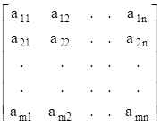

Üretim teknolojisini gösteren bu matrise *teknoloji matrisi* denir.
Gerçekten, bu matrisin elemanları olan aij’ler her üründen
bir birim üretmek için gerekli kaynak miktarını, başka bir deyişle
üretim teknolojisini ifade etmektedir. Matris, satır­ları bakı­mından
incelendiğinde, her bir satırın n çeşit ürünün her birinden birer birim
üretmek için gerekli olan belirli bir kaynak gereksini­mine karşılık
geldiği görülebilir. Örnek olması bakımından matrisin birinci satırını
inceleyelim.

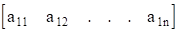

Yukarıdaki satır vektörün elemanlarından a11, birinci maldan
bir birim üretmek için birinci kaynaktan kullanılan miktarı,
a12 ikinci maldan bir birim üretmek için yine birinci
kaynaktan kullanılan miktarı ve nihayet a1n n’inci maldan bir
birim üretmek için aynı kaynaktan kullanı­lan miktarı gösterir. n çeşit
malın her birinden birer birim ürete­bilmek için gerekli birinci kaynak
miktarı yukarıdaki satır vektörün elemanları toplamına eşit olur.

Matrisin sütunları da belirli bir üründen bir birim üretmek için gerekli
olan kaynak gereksinimini gösterir. **A** matrisinin ilk sütunu satır
vektör olarak şöyledir:

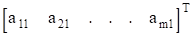

Burada, a11 birinci maldan bir birim üretmek için gerekli
birinci kaynak miktarını, a21 yine birinci maldan bir birim
üretmek için gerekli ikinci kaynak miktarını ve nihayet am1
aynı maldan bir birim üretmek için gerekli m’inci kaynak miktarını
gösterir. Kısaca her sütun karşılık geldiği malın üretim
teknolo­jisinden başka bir şey değildir. Bu yüzden bu sütunlara
*faaliyet* denir.

Doğr­usal programl­amada **A** ile birlikte bulunan diğer matrisler
aşağıda gösterilmiştir.

*1*. Kaynakların sınırlarını açıklayan kaynak miktarı veya gereksinme
(sağ taraf değerleri) vektörü:

**b** =
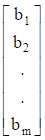

*2*. Amaç fonksiyonu katsayıları (birim kr, birim maliyet vb.) satır
vektörü:

**C** =
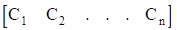

*3*. Karar değişkenleri matrisi: Karar değişkenleri matrisi, aslında n
satır 1 sütundan oluşan bir sütun vektör olmakla birlikte, yerden
tasarruf etmek amacıyla aşağıda olduğu gibi bir satır vektör olarak da
gösterilebilir.

**X** =
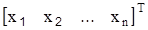

Yukarıda açıklanan **A**, **b**, **C** ve **X** matrislerinin
kullanılmasıyla doğrusal programlama problemi,

Amaç fonksiyonu:Zenb/enk =
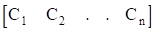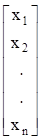
= **CX**

Kısıtlayıcı fonksiyonlar:

(≤, =, ≥)
=
**AX** (≤, =, ≥) **b**

Negatif olmama koşulu:**X** ≥ 0biçiminde yazılır.

## 2.4 DOĞRUSAL PROGRAMLAMANIN VARSAYIMLARI

Bir tanıma göre model, anlaşılması güç ve karmaşık sistemlerin veya
prob­lemlerin bir takım varsayım­larla basit­leştirilmiş soyut bir
temsilcisi veya taklididir. Bir modelin dayandığı varsa­yımların azlığı
ya da çokluğu o modelin uygulanabilirli­ği ve yararlılığı açısından
büyük bir önem taşır. Başka bir deyiş­le, mo­delin dayandığı varsayımlar
modelin olumsuz bir özel­liği sayı­la­bilir. Bu nedenle, herhangi bir
modelde­n gereği gibi yarar­lana­bil­mek için modelin dayandığı
varsayımları iyi bilmek, varsayımların sağlanıp sağlanmadığı konusunda
tarafsız olmak gerekir. Her model gibi doğrusal programlama modelleri de
bir takım varsayımlara dayanmaktadır. Bu varsayımlar aşağıdaki gibi
açıkla­nabilir.

*1*. ***Doğrusallık varsayımı***: Modeldeki fonksiyonların hepsi
doğrusaldır. Bu varsayımı açıklamak için bir adet tabak
(Xtabak = 1) üretme maliyetinin (Ctabak) 3 TL
olduğunu düşünelim. Bu durumda 15 adet tabak üretme maliyeti
Xtabak X Ctabak = 15 X 3 = 45 TL olacaktır. Tabak
üretim miktarının amaç fonksiyonuna katkısı diğer karar değişkenlerinin
değerinden bağımsızdır. İşletmenin hem tabak hem de bardak ürettiğini
düşünelim. Bardak üretim miktarı ne olursa olsun Xtabak adet
tabak üretmenin maliyete katkısı 3Xtabak olur.

Bu varsayımın kısıtlayıcı fonksiyonlardaki sonucu da aynı yaklaşımla
incelenebilir. Sözgelimi, bir bardak 2.5 dakikada üretiliyorsa, üç
bardağın üretilme süresi 7.5 dakika olacaktır.

Değişken değerlerindeki artışın veya azalışın fonksiyonlarda yol açtığı
artış veya azalış arasındaki bu ilişki *oransallık varsayımı* olarak da
bilinir.

*2*. ***Toplanabilirlik varsayımı***: Oransallık varsayımı amaç
fonksiyonu ile kısıtlayıcı fonksiyonların doğrusallığını garanti etmek
için yeterli değildir. Doğrusallığın sağlanabilmesi için değişkenler
birbirlerinden bağımsız olmalıdır. Değişken­lerin bağımsızlığı
varsayımına *toplanabilirlik varsayımı* da denir. Sözgelimi, tabak için
3 birim, bardak için 2 birim cam gerekliyse, bir adet tabak ve bir adet
bardak üretimi 5 birim cam gerektirir. Bu varsayım, Z =
C1X1 + C2X2 + ... +
CnXn şeklinde tanımlanan amaç fonksiyonunun, her
biri modeldeki değişkenlerden yalnızca birinin fonksiyonu olan n
fonk­siyonun toplamı olarak (Z = Z1(X1) +
Z2(X2) + ... + Zn(Xn))
yazı­la­bileceği­ni ifade etmektedi­r.

*3*. ***Kesinlik varsayımı***: Modeldeki tüm parametrelerin
(Cj, aij, bi) bilindiği ve öngörü- len
dönem içinde değişmediği kabul edilir. Gerçek problemlerde bu varsayım
seyrek olarak sağlanır. Girdi değerlerinin belirsizlik arz etmesi
durumunda değişkenlerin beklenen değerleri kullanılabilir. Modelin
parametre­lerdeki değişimlere olan duyarlılığı *duyarlılık çözümlemesi*
ile incelenebilir.

*4*. ***Negatif olmama varsayımı***: Doğrusal programlamada negatif
faaliyet düzeyine izin verilmediğinden, değişkenlerin değerleri ya sıfır
ya da pozitiftir.

*5*. ***Bölünebilirlik (süreklilik) varsayımı***: Değişken­ler ≥ 0 olmak
üzere kesirli değerler alabilirler. Bu varsayım doğrusal programlamanın
karar değişkenleri süreklidir şek­linde de açıklanabilir. Ancak,
fiziksel gereksinmelerde ve bazı özel durumlarda karar değişkenlerinden
bir ya da birkaçının veya hepsinin tamsayı değerler alması istene­bilir.
Değişkenle­rin tamsayı değerler alması istendiğinde, *tamsayı
programlama* söz konusu olur.

Bazı durumlarda, karar değişkenlerinin en iyi değerlerini etkilemeden
amaç fonksiyonu, bu varsayımların kullanılma­sıyla basitleştirilebilir.
Sözgelimi, amaç fonksiyo­nunun orijina­linde eklenmiş veya çıkartıl­mış
bir sabit terim varsa problem çözülürken bu sabit terim dikkate
alınmay­abilir. Yapılacak olan problemi sabit terimsiz çözmek, en iyi
çözümü elde ettikten sonra dikkate alınmayan sabiti amaç fonksi­yonunun
en iyi olan değerine eklemek veya çıkartmaktır.

Sözgelimi amaç fonksiyonu Zenb = 6X1 +
5X2 + 250 olsun. Çözüm için Zenb = 6X1
+ 5X2 olarak kabul edilebilir. Problem çözüldükten sonra amaç
fonksiyonu için bulunan değere 250 eklenmesiyle işlem tamamlanmış,
orijinal amaç fonksiyonunun en iyi değeri elde edilmiş olur. Amaç
fonksiyo­n­unun bir sabitle çarpılm­ası veya bölünmesi de karar
değişkenl­eri­ değerlerini değiş­tir­mez. Bu duruma örnek olması
bakımından amaç fonksiyonu­nun Zenb = 10X1 +
100X2 olarak formüllendiğini düşünelim. Çözüme geçmeden önce
amaç fonksiyonu 10 ile bölünerek Zenb = X1 +
10X2 şeklinde daha basit bir amaç fonksiyonu elde edilebilir.
Yapılacak tek şey problemi orijina­linden daha basit olan bu amaç
fonksi­yon­unu kullanarak çözmek, çözüm tamamlandığında amaç
fonksiyonunun en iyi değeri olarak bulunan sonucu 10 ile çarpmaktan
ibarettir.

## 2.5 DOĞRUSAL PROGRAMLAMANIN MODELLENMESİ

Doğrusal programlama modellerinin kurulması ile ilgili örnek problemlere
geçmeden önce herhangi bir problemin doğrusal program­lama olarak
formüle edilmesinde izlenmesi gereken adımları açıklayalım.

*1*. Karar değişkenlerinin tanım­lanması ve bunların uygun sembollerle
gösteril­mesi.

*2*. Amacın belirlenerek karar değişkenlerinin doğrusal fonk­siyonu
olarak yazılması.

3\. Tüm kısıtlamaların karar değişkenlerinin doğru­sal fonksiyonları
olarak eşitlik veya eşitsizlik biçiminde ifade edilmesi.

İlk olarak askeri alanda uygulanan doğrusal programlama günümüzde başta
endüstri alanında olmak üzere çeşitli ekonomik, sosyal, politik ve
toplumsal sorunların çözümünde kullanılmaktadır. Doğrusal programlama
ile ilgili uygulamalar aşağıdaki başlıklar altında toplanabilir.

*1.* Ulaştırma veya dağıtım problemleri

*2*. Karıştırma-Beslenme problemleri

*3*. Üretimin planlanması

*4*. Yatırım planlaması

*5*. Görev dağıtımının organizasyonu

*6*. Arazi kullanımının planlanması

*7*. Kesme kaybı problemleri

*8*. Kuruluş yeri seçimi

*9*. Oyun problemleri

Yukarıda sözü edilen problemlerin bir doğrusal programlama problemi
olarak nasıl formüle edileceğini göstermek amacıyla çeşitli örnek
problemleri ele alalım.

*1. **Ulaştırma Problemleri***: Karar vericinin karşılaştığı en önemli
sorunlardan bir tanesi de birkaç sunum merkezinden (fabrika, depo vb.)
birkaç istem merkezine (depo, şehir, tüketim merkezi vb.) mal ve hizmet
dağıtımının en küçük harcamayla sağlanmasıdır. Uygulamada sıkça
karşılaşılan bu problemler doğrusal programlama problemlerinin özel bir
türü olup her biri bir ulaştırma problemidir. Ulaştırma problemlerinin
doğrusal program­lama olarak formüle edilebilmesi için doğrusal
programlama için benimsenen varsa­yımlara ek olarak gerçekleşmesi
gereken başka varsa­yımlar ve belirli koşullar vardır. Bu konu, yedinci
bölümde ayrıntılı olarak incelene­ceğinden burada çok basit bir
ulaştır­ma proble­minin şimdiye kadar anla­tılanların ışığı altında
formüle edilmesiyle yetinil­ecek­tir.

***Örnek 2.1***: Üç ayrı fabri­ka­da beyaz eşya üreten bir işletme
satışlarını değişik bölge­lerdeki üç depo aracılığıyla yapmakta­dır.
İş­letme yönetimi­nin temel sorunu beyaz eşyanın fabrikalar­dan satış
depolarına ulaştırılmasında karşılaş­tığı yüksek ulaştırma giderleridir.
Fabrikalardan depolara birim ulaştırma maliyetleri aşağıda verilmiştir.

|         |      |     |     |
|---------|------|-----|-----|
|         | Depo |     |     |
| Fabrika | A    | B   | C   |
| 1       | 30   | 25  | 15  |
| 2       | 16   | 45  | 29  |
| 3       | 25   | 10  | 16  |

Üretim miktarları sırasıyla 150, 200 ve 400 adettir. Depoların aylık
istemleri A için 220, B için 150, C için 380 adettir. Depoların
gereksinimini tam olarak sağlamak isteyen işletme, tüm üretimini toplam
ulaştırma maliyetini en küçük yapacak şekilde dağıtmak istemektedir.
Problemin doğrusal programlama modelini kurunuz.

***Çözüm 2.1***: İlk olarak karar değişkenlerini, i’inci fabrikadan
j’inci depoya taşınan beyaz eşya miktarı­ (adet olarak) olmak üzere
Xij (i = 1, 2, 3; j = A, B, C) şeklinde tanımlaya­lım. Buna
göre, karar değişkenleri aşağıdaki gibi olur.

X1A = 1 nolu fabrikadan A deposuna gönderilen beyaz eşya
sayısıX1B = 1 nolu fabrikadan B deposuna gönderilen beyaz
eşya sayısı ....................X3C = 3 nolu fabrikadan C
deposuna gönderilen beyaz eşya sayısı

İşletmenin amacı aylık taşıma maliyetleri toplamını en küçük­leyen
değişken değerlerini belirlemek olduğuna göre, amaç fonksiyo­nu
aşağıdaki gibi yazılır.

Zenk = 30X1A + 25X1B + 15X1C
+ 16X2A + 45X2B + 29X2C +
25X3A + 10X3B + 16X3C

Problemin kısıtlayıcıları, fabrikaların üretim miktarları ile depoların
gereksinim miktarlarıdır.

Herhangi bir fabrikadan üretiminden fazla taşıma yapılamayacağından ve
üretimin tamamı dağıtılmak istendiğinden,

X1A + X1B + X1C = 150

X2A + X2B + X2C = 200

X3A + X3B + X3C = 400

olur.

Bunlar üretim miktarı ile ilgili kısıtlayıcı fonksiyonlardır.Depoların
beyaz eşya gereksiniminin eksiksiz karşılanması koşulu aşağıdaki
eşitlikler sistemiyle açıklanabilir.

X1A + X2A + X3A = 220

X1B + X2B + X3B = 150

X1C + X2C + X3C = 380

Negatif taşıma olamayaca­ğına göre,

Xi,j ≥ 0 (i = 1, 2, 3; j = A, B, C)

negatif olmama koşulunun yazılmasıyla model kurulmuş olur.

Ulaştırma modellerinin uygulamaları sadece malların coğrafi bir yerden
başka bir coğrafi yere taşınmasıyla sınırlı değildir. Diğer ulaştırma
modelleri yedinci bölümde açıklanacaktır.

*2*. ***Beslenme (Diyet) Problemleri***: Beslenme problemleri doğrusal
programl­ama ile formüle edilen ilk ekonomik problem­lerdir. Bu
problemlerin, başlangıç­ta yal­nız­ca bir örnek olması üzere araştırılan
çözümleri, umul­madık bir şekilde önemli uygu­lamalara ışık tutmuştur.
Bilindiği gibi, beslenme sorununun hem kişilerin yaşamında hem de
ekonomi­lerde önemli bir yeri vardır. Bir kişinin sağlıklı yaşaması
değişik be­sin maddelerinden belirli besin elemanlarını yeterli
miktarlar­da almasına bağlıdır. Bu durum diğer canlılar için de
geçerlidir. Ayrıca, akışkanların ya da katı maddelerin belirli
karışımlarının hazırlanmasın­da beslenme prob­lemlerine benzer
sorunlarla kar­şıla­şılabilir. Bu tür problem­lerde amaç, karışımı
belirli ölçütleri sağlayacak biçimde oluşturarak maliyeti en
küçük­lemektir.

***Örnek 2.2***: Bir çiftçi çiftliğindeki tavukla­rı­n günlük
karbon­hidrat, protein ve vitamin gereksinimini en küçük maliyetle
karşılamak amacıyla en uygun besin maddelerini ve bunların miktarlarını
belirlemek istemektedir. Alternatif besin maddeleri­nin birim
maliyetleri, içerdikleri karbonhidrat, protein ve vitamin miktarları ile
bunlara olan günlük gereksinim aşağıda­ki tabloda özetlenmiştir.

Bu verilere göre, tavuk­ların günlük besin gereksinimini tam olarak
karşılayan en küçük maliyetli besin karışımının belirlenme­sinde
kullanılacak doğrusal programlama modelini kurunuz.

|                   |                 |              |      |            |
|-------------------|-----------------|--------------|------|------------|
| Besin             | Besin Türü (kg) | En Az Günlük |      |            |
| Elemanı           | Suni Yem        | Buğday       | Arpa | Gereksinim |
| Karbonhidrat (gr) | 9               | 2            | 4    | 20         |
| Protein (gr)      | 3               | 8            | 6    | 18         |
| Vitamin (mgr)     | 1               | 2            | 6    | 15         |
| Birim Fiyat (TL)  | 7               | 6            | 5    | \-         |

***Çözüm 2.2***: Karışım suni yem, buğday ve arpadan oluştuğundan, karar
değişkenleri aşağıdaki gibi tanımlanabilir.

X1: Suni yem tüketim miktarı (kg/gün) X2: Buğday
tüketim miktarı (kg/gün)X3: Arpa tüketim miktarı (kg/gün)

Toplam maliyet tüketilen her bir besin türünün birim maliyeti ile o
besinden tüketilen miktarın çarpımlarının toplamına eşittir. Buna göre
toplam maliyet,

Z = 7X1 + 6X2 + 5X3

biçiminde yazılır.

Amaç bu toplamı en küçüklemek olduğundan, amaç fonksiyonu amaca uygun
olarak aşağıdaki gibi ifade edilir.

Zenk = 7X1 + 6X2 + 5X3

Problemin kısıtlayıcı fonksiyonları günlük besin elemanlarına aittir.
Kısıtlayıcı koşulların ise sırasıyla karbonhidrat, protein ve vitamin
gereksinimlerinin göz önünde bulundurulmasıyla aşağıdaki gibi
yazılacakları açıktır.

9X1 + 2X2 + 4X3 ≥ 20 (Karbonhidrat
kısıtı)3X1 + 8X2 + 6X3 ≥ 18 (Protein
kısıtı)1X1 + 2X2 + 6X3 ≥ 15 (Vitamin
kısıtı)≥ işareti alınması gereken besin elemanlarının belirtilen
miktarların altına düşmeye­ceğini, fakat bu miktarlardan fazla
olabileceğini belitmek­tedir.

Negatif tüketim olamayacağından,

X1 ≥ 0, X2 ≥ 0, X3 ≥ 0

yazılmasıyla modelleme işlemi tamamlanmış olur.

*3*. ***Üretim Planlaması***: İşletmelerin karşılaştığı problem­lerin
çoğu para, işgücü, ham-madde, araç-gereç, alan, zaman gibi kısıtlı
kaynakların belirli amaçlar doğrultusunda çeşitli üretim faaliyetler
arasında en uygun biçimde dağıtılması ve kullanıl­ması yoluyla kârın en
büyüklenmesi veya maliyetin en küçüklen­mesidir.

***Örnek 2.3***: Bereket AŞ düşük ve yüksek fosfatlı olmak üzere iki
çeşit gübre üretmektedir. Gübreler üç farklı hammaddenin (A, B, C)
karışımından oluşmakta­dır. 1 ton yüksek fosfat­lı gübre üreti­minde 2
ton A, 1’er ton B ve C; 1 ton düşük fosfatlı gübre üretiminde ise A ve
B’den 1’er ton kullanılmaktadır. İşletmenin aylık hammadde kapasitesi
150 ton A, 120 ton B, 50 ton C’dir. Düşük fosfatlı gübre isteminin en
çok 20 ton/ay olduğu bilinmektedir. Yüksek fosfatlı gübrenin satış
fiyatı 150 TL/ton, düşük fosfatlı gübrenin satış fiyatı ise 100 TL/ton
dur. İşletme, toplam satış gelirini en büyükle­mek için her ay her bir
üründen kaç birim üretmelidir? Problemi doğru­sal program­lama olarak
modelleyiniz.

***Çözüm 2.3***: Düşük ve yüksek fosfatlı gübre miktarlarının
belirlen­mesi gerekmektedir. Dolayısıyla, model değişkenleri aşağıdaki
gibi tanımlan­malıdır.

X1: Yüksek fosfatlı gübre üretim miktarı
(ton/ay)X2: Düşük fosfatlı gübre üretim miktarı (ton/ay)

Amaç toplam aylık satış gelirini en büyüklemek olduğuna göre, amaç
fonksiyonu aşağıdaki gibi olur.

Zenb = 150X1 + 100X2

Problemin kısıtlayıcı elemanları her iki gübre için gerekli ve sınırlı
olan hammadde miktarları ile düşük fosfatlı gübreye olan istem
miktarıdır. Buna göre, kısıtla­yıcı fonksiyonlar aşağıdaki gibi olur.

2X1 + 1X2 ≤ 150 (A hammaddesi kısıtı)

1X1 + 1X2 ≤ 120 (B hammaddesi kısıtı)

1X1 + 0X2 ≤ 50 (C hammaddesi kısıtı)

1X1 ≤ 20 (Düşük fosfatlı gübre istem miktarı kısıtı)

Son olarak, üretim miktarı negatif olamayacağından, X1 ≥ 0,
X2 ≥ 0 yazılmasıyla model tamamlanmış olur.

***Örnek 2.4***: Biri alüminyum diğeri ahşap çerçeveli olmak üzere iki
tip pencere üretimi planlanmaktadır. Üretim atölyelerinin günlük çalışma
kapasiteleri ve her üründen bir adet üretmek için gerekli zaman (saat
olarak) aşağı­daki gibidir. Ahşap çerçeveli pencerenin kâra katkısı 300
TL, alüminyum çerçevelininki ise 500 TL’dir. İşletme, günlük krını en
büyüklemek için her üründen kaç birim ürete­ceğini belirle­mek
istediğine göre, proble­mi doğrusal program­lama modeli olarak formüle
ediniz.

|               |           |                    |            |
|---------------|-----------|--------------------|------------|
|               | Pencere   | Çalışma Kapasitesi |            |
| Atölye        | Alüminyum | Ahşap              | (gün/saat) |
| Alüminyum     | 1         | 0                  | 4          |
| Ahşap         | 0         | 2                  | 12         |
| Cam Üretim    | 3         | 2                  | 18         |
| Birim Kr (TL) | 300       | 500                | \-         |

***Çözüm 2.4***: Problemin karar değişkenleri aşağıdaki gibi
tanımlanabilir.

X1: Ahşap çerçeveli pencere üretim miktarı (adet/gün)

X2: Alüminyum çerçeveli pencere üretim miktarı (adet/gün)

Amaç, günlük toplam krı en büyükleyecek X1, X2
değerlerini belirlemek olduğuna göre, amaç fonksiyonu aşağıdaki gibi
yazılır.

Zenb = 300X1 + 500X2

İşletmenin her iki ürünün üretimi için gerekli ve sınırlı olan
kaynakları atölyelerinin günlük çalışma kapasiteleridir.

Buna göre kısıtlayıcı fonksiyonlar aşağıdaki gibi olur.

X1 + 0X2 ≤ 4 (Alüminyum kaplama atölyesi çalışma
zamanı kısıtı)

0X1 + 2X2 ≤ 12 (Ahşap kaplama atölyesi çalışma
zamanı kısıtı)

3X1 + 2X2 ≤ 18 (Cam üretme atölyesi çalışma zamanı
kısıtı)

Negatif üretim olamayacağına göre, X1 ≥ 0, X2 ≥ 0
yazılmasıyla model tamamlanır.

***Örnek 2.5***: Hazır gıda AŞ kg’ı 0.85 TL’den 120000 kg domates alarak
domates suyu ve domates salçası üretmektedir. Konserve edilen ürünler 12
kutuluk koliler halinde paketlenmektedir. Bir kutu domates suyu için
0.75 kg, 1 kutu salça için 1 kg domates kullanılmaktadır. Şirketin pazar
payı 2500 koli domates suyu, 7500 koli domates salçası olarak
belirlenmiştir. Bir koli domates suyunun satış fiyatı 36 TL, bir koli
salçanın satış fiyatı 18 TL dir. Toplam satış gelirinin en büyük
olmasını isteyen işletmenin üretim planını belirleyiniz.

***Çözüm 2.5***: Üretim domates suyu ve salçadan oluştuğundan, modelin
değişkenleri şöyle tanımlanır.

X1: Domates suyu kolisi miktarı (adet)

X2: Domates salçası kolisi miktarı (adet)

Toplam satış gelirinin en büyük olması amaçlandığından, amaç fonksiyonu
aşağıdaki gibi olur.

Zenb = 36X1 + 18X2

Üretimin planlanmasında, satın alınan domates miktarı ile ürünlerin
pazar payları göz önünde bulundurulması gerektiğinden, kısıtlayıcı
fonksiyonlar şöyle olur.

9X1 + 12X2 ≤ 120000 (Domates miktarı kısıtı)

X1 ≤ 2500 (Domates suyu pazar payı kısıtı)

X2 ≤ 7500 (Salça pazar payı kısıtı)

X1, X2 ≥ 0 (Negatif olmama koşulu)

*4*. ***Yatırım Planlaması***: Doğrusal programlamanın çözüm bulduğu
başka bir sorun da yatırım planlamasıdır. Bir çok kuruluş ya da kişiler
zaman zaman çeşitli yatırım seçenekleri arasından bir ya da birkaçına
yatırım yapmak isterler. Söz konusu yatırım seçenekleri çok sayıda
değişik faktörler açısından birbirlerine oranla farklılık­lar
gösterirler. Doğrusal programlama, bu farklı seçeneklerden hangisine ne
miktarda yatırım yapılırsa yatırımların getirisi en büyük olur veya risk
en küçük olur sorusuna yanıt arar.

***Örnek 2.6***: Cihan Bey 60 milyon TL tutarındaki emekli ikra­miye­si
ile yıllık gelirini en büyük yapacak yatırımlara girmeyi
plan­lamakta­dır. Cihan Bey için uygun yatırım seçenekleri ile bu
yatırım­ların yıllık getiri oranları aşağıda verilmiş­tir. Cihan Bey’in
amacı, yıllık getirisi en büyük olan yatırım planını belirlemektir.
Cihan Bey karşılaşa­bileceği risklere karşın aşağıdaki prensip
kararlarını almıştır.

***a***. Banka mevduatı, devlet tahvili ile altına yatırımların
toplamına eşit olmalıdır.

***b***. Altına yatırım, nakit olarak saklanan paranın %30’undan fazla
olmamalıdır.

***c***. Hisse senedi yatırımı 15 milyon TL’yi geçmemelidir.

***d***. Devlet tahvili yatırımı en fazla 10 milyon TL olmalıdır.

<table>
<tbody>
<tr class="odd">
<td>Yatırım Seçeneği (Milyon TL)</td>
<td><blockquote>

Getiri Oranı (%)

</blockquote></td>
</tr>
<tr class="even">
<td>Banka Mevduatı</td>
<td><blockquote>

52

</blockquote></td>
</tr>
<tr class="odd">
<td>Hisse Senedi</td>
<td><blockquote>

40

</blockquote></td>
</tr>
<tr class="even">
<td>Devlet Tahvili</td>
<td><blockquote>

32

</blockquote></td>
</tr>
<tr class="odd">
<td>Altın</td>
<td><blockquote>

16

</blockquote></td>
</tr>
<tr class="even">
<td>Nakit</td>
<td><blockquote>

-5

</blockquote></td>
</tr>
</tbody>
</table>

***Çözüm 2.6***: Modelin değişkenleri j yatırım seçeneğine ayrılan para
miktarı (milyon TL) olarak aşağıdaki gibi tanımlanır.

X1: Banka mevduatı yatırım miktarı

X2: Hisse senedi yatırım miktarı

X3: Devlet tahvili yatırım miktarı

X4: Altına yatırım miktarı

X5: Nakit olarak ayrılan para miktarı

Cihan Bey’in amacı yıllık getirisini en büyük yapacak yatırım
miktarlarını belirlemek olduğuna göre, problemin amaç fonksiyonu şöyle
olacaktır.

Zenb = 0.52X1 + 0.40X2 +
0.32X3 + 0.16X4 – 0.05X5

Karar değişkenlerinin değerleri milyon TL olarak ifade edildi­ğin­den,
amaç fonksiyo­nunun değeri de milyon TL olacaktır.

Modelin kısıtlayıcı fonksiyonları, Cihan Bey’in prensip kararları
doğrultusunda, aşağıdaki gibi belirlenecektir.

***a***. Banka mevduatı (X1), devlet tahvili (X3)
ile altına (X4) yatırımların toplamına eşit olmalıdır. Buna
göre,

X1 = X3 + X4

yazılabilir. Doğrusal programlamadaki kısıtlayıcı fonksiyonların sağ
taraflarında bir sabit olması gerektiği bilinmektedir. Bu koşulu
sağlamak için, eşitliğin sağ tarafı sol taraftan çıkartılır. Bu yolla
söz konusu kısıt doğru formda aşağıdaki gibi olur.

X1 - (X3 + X4) = 0 veya X1 -
X3 - X4 = 0

***b***. Nakit olarak ayrılan paranın X5 olduğu düşünülürse,
altına yapılan yatırıma ilişkin kısıtlayıcı aşağıdaki gibi formüllenir.

X4 ≤ 0.30X5 veya X4 – 0.30X5
≤ 0

***c***. X2 ≤ 15 (Hisse senedi yatırımı)

***d***. X3 ≤ 10 (Devlet tahvili yatırımı)

X1 + X2 + X3 + X4 +
X5 = 60 (Paranın tamamının değerlendirilmesi kısıtı)

X1 ≥ 0, X2 ≥ 0, X3 ≥ 0, X4 ≥
0, X5 ≥ 0 yazılmasıyla model kurulmuş olur.

***Örnek 2.7***: B-Bank müşterilerine verdiği krediler toplamının en çok
360 milyon TL olduğu bir politikayı hayata geçirmek istemektedir. Farklı
kredilere ait veriler aşağıda verilmiştir.

<table>
<tbody>
<tr class="odd">
<td>Kredi Tipi</td>
<td>Faiz Oranı</td>
<td>
Kredinin Ödenmeme

Olasılığı
</td>
</tr>
<tr class="even">
<td>Kişisel</td>
<td>0.150</td>
<td>0.13</td>
</tr>
<tr class="odd">
<td>Araba</td>
<td>0.140</td>
<td>0.10</td>
</tr>
<tr class="even">
<td>Ev</td>
<td>0.130</td>
<td>0.06</td>
</tr>
<tr class="odd">
<td>Tarım</td>
<td>0.135</td>
<td>0.08</td>
</tr>
<tr class="even">
<td>Ticari</td>
<td>0.110</td>
<td>0.05</td>
</tr>
</tbody>
</table>

Kredi verilirken göz önünde bulundurulması gereken hususlar şöyledir:
***a***. Kredilerin en az %45’i tarım ve ticari kredilere ayrılmalıdır.
***b***. Ev kredileri; kişisel, araba ve ev kredileri toplamının
%50’sinden az olmamalıdır. ***c***. Ödenmemiş kredilerin, krediler
toplamına oranı %5’i aşmamalıdır. Bankanın amacı faiz gelirleri ile
şüpheli alacaklar arasındaki farkı (net kâr) en büyüklemektir. Bu amaçla
kullanılabilecek modeli formülleyiniz.

***Çözüm 2.7***: Modelin değişkenleri kredi seçeneklerine ayrılacak
kredi miktarlarıdır. Buna göre modelin değişkenleri (milyon TL olarak)
şöyle olur.

X1: Kişisel kredi miktarı

X2: Araba kredisi miktarı

X3: Ev kredisi miktarı

X4: Tarım kredisi miktarı

X5: Ticari kredi miktarı

Bankanın amacı toplam faiz geliri ile geri dönmesi mümkün olmayan
şüpheli alacaklar arasındaki fark olarak tanımlanan net kârı en
büyüklemektir. Amaç fonksiyonunu oluşturmak için sırasıyla toplam faiz
geliri ile şüpheli alacaklar toplamını tanımlayalım.

Bankanın toplam faiz geliri, kredi miktarlarının (Xi i = 1,
2, 3, 4, 5) kendilerine karşılık gelen faiz oranları ve ödenme
olasılıklarının çarpımlarının toplamı olarak aşağıdaki gibi elde
edillir.

Gelir = 0.15(0.87X1) + 0.14(0.90X2) +
0.13(0.94X3) + 0.135(0.92X4) +
0.11(0.95X5)

= 0.1305X1 + 0.1260X2 + 0.1222X3 +
0.1242X4 + 0.1045X5

Şüpheli alacaklar toplamı, kredi miktarlarının kendilerine karşılık
gelen ödenmeme olasılıkların çarpımlarının toplamı olarak aşağıdaki gibi
hesaplanır.

Şüpheli alacaklar = 0.13X1 + 0.10X2 +
0.06X3 + 0.08X4 + 0.05X5

Buna göre faiz geliri ile şüpheli alacaklar arasındaki fark, yani amaç
fonksiyonu aşağıdaki gibi olur.

Zenb = 0.0005X1 + 0.0260X2 +
0.0622X3 + 0.0442X4 + 0.0545X5

Problemin kısıtlayıcı fonksiyonları kredi verirken göz önünde
bulundurulan hususlardır. Buna göre kısıtlayıcı fonksiyonlar aşağıdaki
gibi olur.

***a***. X4 + X5 ≥ 0.45 X 360 veya X4 +
X5 ≥ 162 (Tarım ve ticari krediler)

***b***. X3 ≥ 0.5(X1 + X2 +
X3) veya -0.5X1 – 0.5X2 +
0.5X3 ≥ 0 (Ev kredileri)

***c***.
≤
0.05 veya

0.08X1 + 0.05X2 + 0.01X3 +
0.03X4 ≤ 0 (Şüpheli alacaklar)

***d***. X1 + X2 + X3 + X4 +
X5 ≤ 360 (Krediler toplamı)

X1, X2, X3, X4,
X5 ≥ 0 Negatif olmama koşulu

*5*. ***Kitle İletişim Araçları Seçimi***: Kaynak ayırma problemlerinin
değişik bir türü de reklam kampanyalarının organizasyonunda ortaya
çıkmaktadır. Bir reklam kampan- yasındaki genel amaç eldeki olanaklar
(para, zaman, iş gücü vb.) çerçevesinde en fazla sayıda kişinin
etkilenmesini sağlayacak kampanyayı gerçekleştirmektir. Bu tür
problemler *reklam bütçelemesi* veya *kitle iletişim araçları seçimi*
problemleri olarak bilinir.

Doğrusal programlamanın reklam kampanyası organizasyonunda kullanımına
örnek olarak aşağıdaki problemi ele alalım.

***Örnek 2.8***: Doğa reklam ajansı yeni bir makarnanın tüketiciye
tanıtımı için on günlük bir reklam kampanyası hazırlamaktadır. Kampanya
sırasında iletişim araçlarında (günlük gazete, TV, radyo) dört tür
reklam yapılması düşünülmektedir. Ajans, kampanyada 10 milyon TL’den
daha fazla harcama yapmak istememektedir. Kullanılacak iletişim araçları
ile yapılması düşünülen reklamlar ve bunların bazı özellikleri aşağıdaki
tabloda sunulmuştur.

|                                |        |       |       |        |
|--------------------------------|--------|-------|-------|--------|
|                                | TV     |       |       |        |
|                                | Gündüz | Akşam | Radyo | Gazete |
| Rbb\* Maliyet (TL)  | 600    | 800   | 300   | 160    |
| Rbb Ulaşılanların Sayısı       | 1100   | 5750  | 890   | 350    |
| Rbb Ulaşılan Kadınların Sayısı | 700    | 3600  | 450   | 210    |

Rbb\*: Reklam birimi başına

Kampanya düzenlenirken göz önünde bulundurulması gereken koşullar
şöyledir.

***a***. Kampanya ile ulaşılan kadın müşteri sayısı en az 35000
olmalıdır.

***b***. Televizyondaki reklamların maliyeti 5 milyon TL’yi
geçmemelidir.

***c***. Radyo reklamlarının mali­yeti televizyon reklamlarının
ma­liyetinden az olmalıdır.

***d***. TV’de en az 5 reklam birimi gündüz, en az 8 reklam birimi gece
yayınlanmalıdır.

***e***. Radyo ve günlük gazetedeki reklamların sayıları en fazla 6’şar
birim olmalıdır.

Kampanyanın amacı en fazla sayıdaki müşteriye ulaşmak olduğuna göre,
problemi doğrusal program­lama olarak modelleyiniz.

***Çözüm 2.8***: Problemin karar değişkenleri aşağıda tanımlandıkları
gibidir.

X1: Televizyonda gündüz saatlerinde yayınlanan reklam
birimlerinin sayısı

X2: Televizyonda gece saatlerinde yayınlanan reklam
birimlerinin sayısı

X3: Radyodaki reklam birimlerinin sayısı

X4: Gazetedeki reklam birimlerinin sayısı

Bu değişkenler kullanılarak problem aşağıdaki gibi formüle edilir.

Zenb = 1100X1 + 5750X2 +
890X3 + 350X4

600X1 + 800X2 + 300X3 +
160X4 ≤ 10000000 (Bütçe kısıtı)

***a***. 700X1 + 3,600X2 + 450X3 +
210X4 ≥ 35000 (Kadın müşteri sayısı)

***b***. 600X1 + 800X2 ≤ 5,000,000 (Televizyondaki
reklamların maliyeti)

***c***. 300X3 ≤ 600X1 + 800X2 veya
-600X1 - 800X2 + 300X3 ≤ 0 (Radyo
reklamlarının maliyeti)

***d***. X1 ≥ 5 (Televizyondaki gündüz reklamlarının sayısı)

X2 ≥ 8 (Televizyondaki gece reklamlarının sayısı)

***e***. X3 ≤ 6 (Radyodaki reklamların sayısı)

X4 ≤ 6 (Gazetedeki reklamların sayısı)

X1, X2, X3, X4 ≥ 0 (Negatif
olmama koşulu)

*6*. ***Arazi Kullanımı***: Kaynak ayırma problemlerinin değişik bir
türü de arazi kulla- nımının planlanmasında ortaya çıkmaktadır. Arazi
kullanımının planlanmasındaki amaç genellikle eldeki olanaklar (para,
arazi, yasal zorunluluklar vb.) doğrultusunda proje maliyetini en
küçükleyecek veya projeden sağlanacak getiriyi en büyükleyecek
planlamayı gerçekleştirmektir. Bu duruma uygun bir problem aşağıda
örneklenmiştir.

***Örnek 2.9***: Yeşil Vadi AŞ 1800 dönümlük bir arazi üzerine müstakil,
dubleks ve tripleks evlerden oluşacak bir site kurmayı düşünmektedir.
Toplam arazinin %15’i cadde, yol ve diğer kullanım alanları için
ayrılacaktır. Farklı tip evlerin getirileri farklıdır. Ev tipine göre
net getiriler şöyledir.

|            |          |         |          |
|------------|----------|---------|----------|
| Ev Tipi    | Müstakil | Dubleks | Tripleks |
| Net Getiri | 20000    | 22000   | 25000    |

Araştırmalar sonucunda; müstakil evlerin, toplamın %50’sini
oluşturmasına, ayrıca müstakil evlerin en az 3 dönüm, dubleks evlerin en
az 4 dönüm, tripleks evlerin de en az 5 dönümlük arazi parçası üzerine
kurulmalarına karar verilmiştir. Her biri 1.5 dönüm olan
eğlence-dinlenme alanları 150 aile başına 1 adet olarak belirlenmiştir.
Siteye su getirme maliyeti yapılacak ev sayısıyla orantılıdır. Su
projesinin ekonomik olabilmesi için en az 225000 TL’lik bir bağlantı
olması zorunludur. Ayrıca, su harcaması gün başına en çok 200000 kg ile
sınırlandırılmıştır. Bir ailenin ortalama su tüketimine ait varsayımlar
ve su getirme maliyetleri aşağıdaki tabloda verilmiştir.

|                     |          |         |          |                  |
|---------------------|----------|---------|----------|------------------|
| Ev Tipi Başına      | Müstakil | Dubleks | Tripleks | Eğl.-Dinl. Alanı |
| Su getirme maliyeti | 1500     | 1700    | 1900     | 1000             |
| Su tüketimi         | 500      | 800     | 950      | 560              |

Şirket, yönetimin koyduğu kurallara uyacak şekilde eğlence-dinlenme
alanlarının sayısıyla birlikte, inşa edilecek her bir tip ev sayısına
karar vermek durumundadır.

***Çözüm 2.9***: Müstakil, dubleks ve tripleks ev sayılarıyla birlikte
eğlence-dinlenme alanlarının sayısına karar verileceğinden, karar
değişkenleri aşağıdaki gibi tanımlanabilir.

X1: Müstakil ev sayısı

X2: Dubleks ev sayısı

X3: Tripleks ev sayısı

X4: Eğlence-dinlenme alanı sayısı

Şirketin amacı toplam getiriyi en büyüklemektir. Dolayısıyla,

Zenb = 20000X1 + 22000X2+
25000X3

yazılacaktır.

Problemin kısıtlayıcıları ve bunların matematiksel ifadeleri aşağıdaki
gibidir.

***1***. Kullanılabilir arazi büyüklüğü kısıtı

3X1 + 4X2 + 5X3 + 1.5X4 ≤
1530 (= 0.85 X 1800)

***2***. Müstakil ev sayısının toplam ev sayısına oranıyla ilgili kısıt

veya 0.5X1 – 0.5X2 – 0.5X3 ≥ 0

***3***. Eğlence ve dinlenme alanlarıyla ilgili kısıt

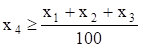
veya 100X4 – X1 – X2 –X3 ≥ 0

***4***. Su getirme maliyeti ile ilgili bütçe kısıtı

1500X1 + 1700X2 + 1900X3 +
1000X4 ≥ 200000

***5***. Günlük su tüketimi ile ilgili kısıt

500X1 + 800X2 + 950X3 +
560X4 ≤ 200000

Negatif olmama koşulu

X1, X2, X3, X4 ≥ 0

*7*. ***Kesim Kaybı ya da Stok Kesim Problemleri***: Standart boyutlara
sahip ürünlerin (kağıt, kumaş, kereste, boru vb.) satandart dışı
boyutlarda kesilmesiyle oluşan kesim kayıpları önemli sorun
olabilmektedir. Doğrusal programlama bu sorunun çözülmesinde kullanılan
etkin tekniklerden biridir.

***Örnek 2.10***: Park Parke AŞ 17 m uzunluğunda standart kereste
üretmektedir. Farklı boylardaki siparişler standart keresteler kesilerek
karşılanmaktadır. Siparişler genellikle 25 adet 3 m, 20 adet 5 m ve 15
adet 9 m uzunluğunda olmaktadır. Standart boydaki keresteler bu
siparişlere göre kesilmektedir. Bu sipariş için kesim sonucu oluşacak
toplam kaybın en küçük olmasını sağlayacak kesim planı nasıl olmalıdır?

***Çözüm 2.10***: Burada amaç siparişi (kısıtlayıcılar) en az kesim
kaybıyla karşıla­maktır. İşletme, 17 m uzunluğundaki standart
keresteleri nasıl keseceğine karar vermek durumundadır. Bu konuda karar
verebilmek için bir standart kerestenin uy­gun kesim biçimlerinin
kararlaştırılması gerekir. Sözgelimi 17 m uzunluğundaki standart kereste
üç adet 5 metreye bölünebilir. Bu durumda kesme kaybı 2 m olur. Kesim 2
adet 3 m, 2 adet de 5 m şeklinde de gerçekleştirilebilir. Bu durumda
kayıp 1 m olur. Standart kereste 4 adet 2 m, 1 adet de 9 metrelik
parçalar halinde de ke­silebilir. Bu durumda kayıp söz konusu olmaz.
Olası kesim biçimlerinin tümünün dikkate alınmasına gerek yoktur. Söz
gelimi standart kerestenin 9 m ve 5 m olarak kesilmesi hiç akıllıca
olmaz, çünkü bu durumda kayıp 3 metre olur. Genel olarak kesme kaybının
3 veya daha fazla olmasına yol açan kesme alternatiflerinin dikkate
alınmasına gerek yoktur. Bu durum göz önünde bulundurularak belirlenen
alternatif kesim biçimleri aşağıdaki tabloda listelenmiştir.

<table>
<tbody>
<tr class="odd">
<td>Kombinasyon No</td>
<td>
3 m’lik

Parça Sayısı
</td>
<td>
5 m’lik

Parça Sayısı
</td>
<td>
9 m’lik

Parça Sayısı
</td>
<td>
Kayıp

(m)
</td>
</tr>
<tr class="even">
<td>1</td>
<td>5</td>
<td>0</td>
<td>0</td>
<td>2</td>
</tr>
<tr class="odd">
<td>2</td>
<td>4</td>
<td>1</td>
<td>0</td>
<td>0</td>
</tr>
<tr class="even">
<td>3</td>
<td>2</td>
<td>2</td>
<td>0</td>
<td>1</td>
</tr>
<tr class="odd">
<td>4</td>
<td>2</td>
<td>0</td>
<td>1</td>
<td>2</td>
</tr>
<tr class="even">
<td>5</td>
<td>1</td>
<td>1</td>
<td>1</td>
<td>0</td>
</tr>
<tr class="odd">
<td>6</td>
<td>0</td>
<td>3</td>
<td>0</td>
<td>2</td>
</tr>
</tbody>
</table>

Modeli matematiksel olarak açıklayabilmek için öncelikle karar
değişkenleri tanımlanmalıdır. Karar değişkenleri i (i = 1, 2, 3, 4, 5,
6) kombinasyonuna göre kesilecek standart kereste sayısı olarak
tanımlanabilir. Buna göre,

Xi = i kombinasyonuna göre kesilen standart kereste sayısı

olsun.

Amaç fonksiyonunu oluşturmak için toplam kesim kaybının belirlenmesi
gerekir. Toplam kesim kaybı uzunluğu, kesilen standart kereste uzunluğu
ile siparişin toplam uzunluğu arasındaki farka eşittir. Söz konusu
büyüklükler aşağıda hesaplandıkları gibidir.

Siparişin toplam uzunluğu = 25(3) + 20(5) + 15(9) = 310 m

Kullanılan standart kereste uzunluğu = 17(X1 + X2
+ X3 + X4 + X5 + X6)

Buna göre, toplam kesim kaybı aşağıdaki gibi olur.

Toplam kesim kaybı (m) = 17X1 + 17X2 +
17X3 + 17X4 + 17X5 + 17X6 –
310

Amaç bu toplamı en küçüklemek olduğundan Z aşağıdaki gibi formüle
edilir.

Zenk = 17X1 + 17X2 + 17X3 +
17X4 + 17X5 + 17X6 – 310

Amaç fonksiyonunda bulunan sabitin göz ardı edilmesi problemin en iyi
çözümünü etkilemeyeceğinden, amaç fonksiyonu 17X1 +
17X2 + 17X3 + 17X4 + 17X5 +
17X6 olarak kabul edilebilir. Ayrıca fonksiyonun tüm
değerlerinin aynı sayıya bölünmesi (burada 17) de değişkenlerin çözüm
değerlerini etkilemez. Buna göre problemin orijinal amaç fonksiyonu
yerine, daha basit olan X1 + X2 + X3 +
X4 + X5 + X6 toplamı alınabilir. Buna
göre amaç fonksiyonu,

Zenk = X1 + X2 + X3 +
X4 + X5 + X6

olur.

Bu toplamın ortaya koyduğu gibi, toplam kesim kaybının en küçük olması
için kesilen standart kereste sayısı en küçük olmalıdır.

Siparişin incelenmesinin ortaya koyduğu gibi problemin kısıtlayıcıları
aşağıdaki gibi açıklanır.

Kısıt 1: En az 25 adet 3 m’lik parça

Kısıt 2: En az 20 adet 5 m’lik parça

Kısıt 3: En az 15 adet 9 m’lik parça

3 metrelik parçaların toplam sayısı 5X1 + 4X2 +
2X3 + 2X4 + 1X5 olduğundan ilk
kısıtlayıcı aşağıda gösterildiği gibidir.

5X1 + 4X2 + 2X3 + 2X4 +
1X5 ≥ 25

Benzer şekilde ikinci ve üçüncü kısıtlayıcı fonksiyonlar şöyledir:

X2 + 2X3 + X5 + 3X6 ≥ 20

X4 + X5 ≥ 15

Negatif olmaması yanında Xi’nin tamsayı değer alması
gerektiği açıktır.

Böylece problemin modeli,

Zenk = X1 + X2 + X3 +
X4 + X5 + X6

5X1 + 4X2 + 2X3 + 2X4 +
1X5 ≥ 25 (3 m kısıtı)

X2 + 2X3 + X5 + 3X6 ≥ 20 (5
m kısıtı)

X4 + X5 ≥ 15 (9 m kısıtı)

X1, X2, X3, X4,
X5, X6 ≥ 0

olarak formüllenir.

*8*. ***Nöbet Çizelgeleme***: Doğrusal programlama nöbet çizelgelerinin
oluşturulmasında, ders programlarının hazırlanmasında, postacıların
çalışma günlerinin düzenlen- mesinde, taşıt çizelgelenmesinde de
kullanılmaktadır. Nöbet çizelgeleme durumu, aşağıdaki problemle
örneklenebilir.

***Örnek 2.11***: Bir işyerinde haftanın günlerine göre tam-gün
çalışması gerekenlerin sayısı aşağıdaki tabloda gösterilmiştir. Yasa
gereği çalışanlar beş gün arka arkaya çalışmakta, arka arkaya 2 gün de
tatil yapmaktadırlar. Sözgelimi, Pazartesi-Cuma çalışan biri
Cumartesi-Pazar, Perşembe-Pazartesi çalışan biri Salı-Çarşamba izin
yapmaktadır.

Günlük işgücü gereksinimini eksiksiz karşılayacak ve çalışan sayısının
en az olmasını sağlayacak modeli kurunuz.

|           |            |
|-----------|------------|
| Gün       | Gereksinim |
| Pazartesi | 27         |
| Salı      | 23         |
| Çarşamba  | 18         |
| Perşembe  | 19         |
| Cuma      | 11         |
| Cumartesi | 14         |
| Pazar     | 10         |

***Çözüm 2.11***: Burada amaç çalışan sayısını, günlük gereksinimi
eksiksiz karşılamak koşuluyla en az yapmaktır. Görüldüğü gibi,
değişkenlerin tanımları çok belirgin değildir. Değişken tanımıyla ilgili
bu belirsizlik değişkenlerin “Xi i (i = 1, 2, ..., 7) gününün
gerektirdiği çalışan sayısı” olarak tanımlanmasına yol açar. Bu tanıma
göre “çalışanların sayısı = Pazar çalışanlar + Pazartesi çalışanlar +
... + Cumartesi çalışanlar” olur. Dolayısıyla amaç fonksiyonu aşağıdaki
gibi belirtilir.

Zenk = X1 + X2 + X3 +
X4 + X5 + X6 + X7

Kısıtlayıcılar da günlük gereksinimin eksiksiz karşılanmasını sağlamak
üzere aşağıdaki gibi tanımlanır.

X1 ≥ 17 (Pazartesi çalışması gerekenlerin sayısı)

X2 ≥ 13 (Salı çalışması gerekenlerin sayısı)

X3 ≥ 15 (Çarşamba çalışması gerekenlerin sayısı)

X4 ≥ 19 (Perşembe çalışması gerekenlerin sayısı)

X5 ≥ 14 (Cuma çalışması gerekenlerin sayısı)

X6 ≥ 16 (Cumartesi çalışması gerekenlerin sayısı)

X7 ≥ 11 (Pazar çalışması gerekenlerin sayısı)

Dikkatli bir incelemeyle bu formülasyonun kusurlu olduğu görülebilir.
Kusurlardan birisi amaç fonksiyonunun çalışan sayısını göstermemesi, her
bir çalışanı beş kez saymasıdır. Mesela ilk iş günü Pazartesi olan biri
Pazartesi-Cuma çalışmaktadır. Bu da X1, X2,
X3, X4, X5’in kapsanması demektir.
Diğer kusur ise formülasyonun değişkenler arasındaki ilişkiyi
yansıtmamasıdır. Sözgelimi Pazartesi çalışanlar (X1) Salı da
çalışıyor (X2) olacağından, X1 ile X2
ilişkilidir. Oysa kısıtlar bu ilişkiyi yansıtmamaktadır.

Aşağıdaki şeklin de ortaya koyduğu gibi problemin doğru formülasyonu
için (değişkenler günlere göre çalışanların sayısı olarak değil,
herhangi bir günün başında çalışmaya başlayanların sayısı olarak
tanımlanmalıdır.

***Şekil 2.1***

# Örnek 2.11’in Değişkenleri

Buna göre modeldeki değişkenler aşağıdaki gibi tanımlanır.

Xi = i günü başında işe başlayanların sayısı

Buna göre, X1 Pazartesi işe başlayanların (bunlar cumaya
kadar çalışırlar) sayısı olur. Uygun ve doğru biçimde tanımlanmış bu
değişkenlerin kullanılmasıyla amaç fonksiyonu ile kısıtlayıcı
fonksiyonlar aşağıdaki gibi formüle edilir. Amaç fonksiyonunu formüle
etmek için,

Tam gün çalışanların sayısı = (Pazartesi çalışmaya başlayanların sayısı)
+ (Salı çalışmaya başlayanların sayısı) + ... + (Pazar çalışmaya
başlayanların sayısı)

olduğunu gözönünde bulunduralım.

Her bir çalışan tam olarak haftanın bir gününün başlangıcında işe
başlayacağından, bu açıklama çalışanları sadece bir kez sayar. Buna
göre, amaç fonksiyonu,

Zenk = X1 + X2 + X3 +
X4 + X5 + X6 + X7

olur.

İşveren her günün gerektirdiği sayıda işçinin çalışmasını sağlamak
durumundadır. Söz gelimi Pazartesi günü en az 17 kişi çalışmalıdır.
Pazartesi çalışanlar kimlerdir? Salı veya Çarşamba günü başında işe
başlayanların dışındakilerdir. Zira Salı günü başlayanlar Pazar,
Pazartesi; Çarşamba işe başlayanlar Pazartesi, Salı izin yapmaktadırlar.
Bu demektir ki, Pazartesi çalışanların sayısı X1 +
X4 + X5 + X6 + X7 toplamına
eşittir. Bu toplamın en az 17 ye eşit olması gerektiğinden,

X1 + X4 + X5 + X6 +
X7 ≥ 17

yazılır.

Bu eşitsizlik Pazartesi günü çalışanların sayısı ile ilgili
kısıtlayıcıdır. Benzer kısıtlayıcıların haftanın diğer günleri için
yazılması ve negatif olmama koşulunun eklenmesiyle problemin doğru
modeli aşağıdaki gibi formüllenmiş olur.

Zenk = X1 + X2 + X3 +
X4 + X5 + X6 + X7

X1 + X4 + X5 + X6 +
X7 ≥ 27 (Pazartesi çalışanların sayısı)

X1 + X2 + X5 + X6 +
X7 ≥ 23 (Salı çalışanların sayısı)

X1 + X2 + X3 + X6 +
X7 ≥ 18 (Çarşamba çalışanların sayısı)

X1 + X2 + X3 + X4 +
X7 ≥ 19 (Perşembe çalışanların sayısı)

X1 + X2 + X3 + X4 +
X5 ≥ 11 (Cuma çalışanların sayısı)

X2 + X3 + X4 + X5 +
X6 ≥ 14 (Cumartesi çalışanların sayısı)

X3 + X4 + X5 + X6 +
X7 ≥ 10 (Pazar çalışanların sayısı)

X1, X2, X3, X4,
X5, X6, X7 ≥ 0

Doğrusal programlamanın uygulama alanlarından olan kuruluş yeri seçimi,
proje yönetimi, stok planlanması ve oyun problemleri­ özel bilgi
gerektirdiğinden bu tür problemlerin modellenmesi üzerinde
durulmayacaktır.

## 

## 

## 

## PROBLEMLER

***1***. Gülüm AŞ kuru ciltlerin bakımı için KUR, yağlı ciltle­rin
bakımı için YAĞ ve normal ciltlerin bakımı için NOR marka krem üretmeyi
planlamaktadır. Ürünlerin satışa hazır duruma gelmesi için dört ayrı
işlem biriminde işlem görmesi gerekmektedir. İşletme­nin işlem
birimlerinin haftalık çalışma kapasit­eleri (sa­at/hafta olarak) ve her
ürünün 10 adetinin gerektird­iği işlem süreleri aşağıdaki gibidir.

|          |              |     |     |     |
|----------|--------------|-----|-----|-----|
|          | İşlem Birimi |     |     |     |
| Krem     | I            | II  | III | IV  |
| KUR      | 3            | 2   | 1   | \-  |
| YAĞ      | 4            | 2   | 3   | 1   |
| NOR      | 6            | 8   | 1   | 3   |
| Kapasite | 80           | 40  | 25  | 35  |

İşletmenin elinde üç ürünün her birinden 300’er şişe üretecek hammaddesi
bulun­masına karşın elindeki şişe adeti toplamı 850’dir. Diğer taraftan,
yapılan pazar araştırmaları KUR marka kremin haftalık üretim miktarının
en fazla 250 şişe, NOR marka kremin ise en az 250 şişe olması
gerektiğini ortaya çıkarmışt­ır. KUR marka kremin şişesinden 75 TL, YAĞ
marka kremin şişesinden 90 TL, NOR marka kremin şişesinden 60 TL kr elde
edilmektedir. İşletmenin krını en büyükleye­cek üretim planının
belirlenmesinde kullanılacak doğrusal programlama modelini kurunuz.

***2***. Bebek maması üreten bir işletme piyasaya özel ambalajlı
paketler halinde yeni bir tip bebek maması sürmeyi planlamaktadır.
Üretim A, B ve C hammaddelerinin karışımıyla gerçekleştirilmektedir.
A’nın birim maliyeti 40 TL, B’nin birim maliyeti 60 TL, C’nin ise 75
TL’dir. A, B ve C hammaddelerinde bulunan karbonhidrat, protein ve yağ
miktarları aşağıdaki tab­loda gösterilmiştir.

|              |               |     |     |
|--------------|---------------|-----|-----|
| Besin        | Hammadde (kg) |     |     |
| Elemanı      | A             | B   | C   |
| Karbonhidrat | 6             | 3   | 2   |
| Protein      | 2             | 8   | 9   |
| Yağ          | 5             | 9   | 1   |

Yeni tip mamanın her bir paketinde bulunması gereken en düşük
karbonhidrat miktarı 20 birim, en düşük protein miktarı 25 birim, en
düşük yağ miktarı 10 birimdir. Bu bilgilerin ışığı al­tında en küçük
maliyetle üretime olanak sağlayacak doğrusal prog­ramlama­ modelini
kurunuz.

***3***. 20 ton taşıma kapasitesi olan bir taşımacılık şirketi tüm
kapa­sitesini taşınabilir üç değişik mal için kullanmayı
planla­maktadır. Taşınabilecek mallarla ilgili bilgiler aşağıdaki
tabloda verilmiştir.

|     |                     |                    |
|-----|---------------------|--------------------|
| Mal | Birim Ağırlık (ton) | Ton Başına Kr (TL) |
| A   | 2                   | 300                |
| B   | 4                   | 250                |
| C   | 3                   | 450                |

İşletme, toplam taşıma kapasitesinin en fazla %10’luk kısmını A için
kullanmak istemektedir. Ayrıca, B’den taşıyacağı miktarın C’den
taşıyacağı miktardan az olmamasını da garanti etmek istemektedir.
İşletmenin taşıyacağı yükten elde edeceği kârı en büyükleyecek taşıma
planının programlanmasında kullanılacak doğrusal programlama modelini
kurunuz.

***4***. Pil üreticisi bir işletmenin, pillerinin kalite kontro­lünü
gerçekleştirdiği biri klasik diğeri modern olmak üzere iki aygıtı
vardır. İşletme 8 saatlik bir iş gününde en az 6500 adet pilin kontrol
edilmesini istemektedir. Modern aygıt bir saat içinde 25 pili %98
doğrulukla kontrol ederken, klasik aygıt aynı süre içinde 14 pili %95
doğrulukla kontrol etmektedir. Modern aygıtta çalışan denetmenlerin
ücreti saat başına 75 TL, klasik ay­gıtta çalışanların ücreti ise saat
başına 60 TL’dir. Her bir hatalı kontrolün işletmeye maliyeti 8 TL’dir.
Modern aygıtta 10, klasik aygıtta 8 denetmen çalışmaktadır. İşletme
kalite kontrolünü en düşük maliyetle gerçekleştirmek amacıyla her bir
aygıtta çalışacak denetmen sayısını belirlemek istemektedir. Buna göre,
problemin doğrusal programlama modelini kurunuz.

***5***. Bir reklam ajansı, yeni bir deterjanın tüketiciye tanıtımı için
bir reklam kampanyası hazırlamaktadır. Kampanya sırasında iletişim
araçlarında beş tür reklam yapılması düşünülmektedir. Kullanılacak
iletişim araçları ile yapılması düşünülen reklamlar ve bunların bazı
özellikleri aşağıdaki tabloda sunulmuştur.

|                          |          |             |        |       |        |
|--------------------------|----------|-------------|--------|-------|--------|
|                          | Yerel TV | Yerel Radyo | Günlük |       |        |
|                          | Gündüz   | Akşam       | Gündüz | Akşam | Gazete |
| Rbb\* Maliyet | 600      | 800         | 150    | 300   | 160    |
| İzleyici Kitle Büyüklüğü | 1000     | 1750        | 290    | 490   | 120    |
| Etkilenen Kişi Sayısı    | 600      | 1200        | 240    | 360   | 90     |

Rbb\*: Reklam birimi başına

Şirket, kampanyada 50 milyon TL’den daha fazla harcama yapmak
istememektedir. Ayrıca, diğer istenenler aşağıda açıklan­mıştır.

***a***. Günlük gazetedeki reklamlar için en fazla 25 milyon TL
harcanabilir.

***b***. Televizyondaki reklamların sayısı en az 36 olmalıdır.

***c***. Radyodaki reklamların mali­yeti televizyondaki reklamların
ma­liyetini aşmamalıdır.

***d***. Reklamları izleyecek kişi sayısı en az 3000 olmalıdır.

Kampanyadan etkilenen kişi sayısının en büyük olmasını sağlayan doğrusal
programlama modelini kurunuz.

***6***. Güzel Koku AŞ biri kadınlar diğeri erkekler için iki çeşit
kolonya üretmeyi planlamaktadır. Her iki ürünün üreti­minde tek bir
hammadde kullanılmak­tadır. 1 gram hammaddenin iş­letmeye maliyeti 60
TL’dir. 10 gram hammaddenin işlenmesi sonu­cunda 3 gram kadın kolonyası
veya 4 gram erkek kolonyası elde edilmektedir. İşletme, gram başına
kadın kolonyasından 20 TL, erkek kolonyasından 15 TL kr beklemektedir.
İşletmenin kolonya­lar­ üzerinde işlem yapıp parfüm üretme şansı da
vardır. 10 gram kadın kolonyasından 1 gram kadın parfümü elde edebilmek
için 1,5 saat laboratuar zamanı gerekmekte bu ise, işletmeye 5 TL’ye
malolmaktadır. 10 gr erkek kolonyasından 1 gr erkek parfümü elde
edebilmek için 1 saat laboratuar zamanı gerekmekte bunun işletmeye
maliyeti 3 TL olmaktadır. İşletme gram başına kadın parfümünden 35 TL,
erkek parfümünden 25 TL kr beklemek­tedir. İşletmenin yıllık çalışma
kapasitesi 6000 saattir ve yıllık hammadde alışı en fazla 40 kg’dır.
İşletmenin amacı, en yüksek krı elde edebilmek için her bir üründen
kaçar gram üretmesi gerektiğini ve satın alması gereken hammadde
miktarını belirlemek olduğuna göre problemi doğrusal programlama modeli
olarak formüle ediniz.

***7***. Bir çiftçinin mısır, buğday ve arpa ürünlerinin ekiminde
kul­lanabileceği 800 dönümlük toprağı ve haftada 40 saat işgücü vardır.
Dönüm başına ürün verimlilikleri mısır için 4 ton, buğday için 3 ton ve
arpa için 2 tondur. Dönüm başına olmak üzere mısır tarımı için haftada 4
saat, buğday tarımı için haftada 10 saat, arpa tarımı için ise haftada 3
saat işgücü gerekmektedir. 1 ton mısırın satış fiyatı 200 TL, 1 ton
buğdayın satış fiyatı 400 TL, 1 ton arpanın satış fiyatı ise 100 TL’dir.
Yasal düzen­lemeler yıllık buğday üretim miktarının en az 40 ton
olmasını öngörmekte­dir. Çiftçinin amacı toplam satış gelirini en
büyükle­mek olduğuna gore, hangi ürüne ne kadarlık ekim alanı ayrılması
gerektiğini bulunuz.

***8***. Bir yatırımcının elindeki 2.5 milyar TL’sini 5 yıl boyunca
yatırabileceği X, Y, Z, W gibi dört ayrı yatırım seçeneği vardır. Y’nin
ikinci, W’nin ise dördüncü yılın başından önce değerlendirilmesi söz
konusu değildir. X’e yatırılan 1 TL iki yıl sonra 1.70 TL, Y’ye
yatırılan 1 TL üç yıl sonra 1.90 TL, Z’ye yatırılan 1 TL dört yıl sonra
2.4 TL, W’ye yatırılan 1 TL 1 yıl sonra 1.30 TL olarak geri
alınmaktadır. Altıncı yılın başında yatırımcının toplam parasının en
büyük olmasını sağlayacak yatırım planını bir doğrusal programlama
problemi olarak formüle ediniz.

***9***. Bir yatırımcının 5 milyar TL’sini değerlendirebileceği 4 ayrı
yatırım seçeneği vardır. Her bir yatırım seçeneğine yatırılabilecek para
miktarı sınırlıdır. Yatırım seçenekleri ve bunlarla ilgili bazı bilgiler
aşağıdaki tabloda verilmiştir.

<table>
<tbody>
<tr class="odd">
<td>
Yatırım

Seçeneği
</td>
<td>
Getiri

Oranı (%)
</td>
<td>
Risk

Katsayısı
</td>
<td>
Yatırım İçin

Üst Sınır
</td>
</tr>
<tr class="even">
<td>A</td>
<td>37</td>
<td>3</td>
<td>1.5 milyar</td>
</tr>
<tr class="odd">
<td>B</td>
<td>28</td>
<td>1</td>
<td>2.0 milyar</td>
</tr>
<tr class="even">
<td>C</td>
<td>40</td>
<td>4</td>
<td>1.0 milyar</td>
</tr>
<tr class="odd">
<td>D</td>
<td>38</td>
<td>3</td>
<td>3.5 milyar</td>
</tr>
</tbody>
</table>

Yatırımcının amacı aşağıdaki kısıtlayıcıları sağlayacak ve portföyün
getirisini en büyük yapacak çözümü araştırmaktadır. Problemi
modelleyiniz.

***a***. Elde bulunan paranın tümü değerlendirilmelidir.

***b***. A için ayrılan para B için ayrılan paradan fazla olmamalıdır.

***c***. C için ayrılan para oranı A ve B için ayrılandan fazla
olmamalıdır.

***d***. Portföyün ortalama riski 6’yı geçmemelidir.

***10***. Bir hastane yöneticisi hemşirelerin nöbet çizelgesini
oluşturmaya çalışmaktadır. Bu amaçla bir gün her biri dört saatlik 6
periyoda ayrılmıştır. Periyotlar ve her periyotta gerek duyulan en az
hemşire sayıları aşağıdaki tabloda verilmiştir.

|               |                |
|---------------|----------------|
| Periyot       | Hemşire Sayısı |
| 08:00 – 12:00 | 40             |
| 12:00 – 16:00 | 20             |
| 16:00 – 20:00 | 60             |
| 20:00 – 24:00 | 18             |
| 24:00 – 04:00 | 10             |
| 04:00 – 08:00 | 12             |

Hemşireler ard arda 2 periyotta çalışıp diğer periyotlarda
dinlenmektedir. Hastanenin günlük hemşire gereksinimini karşılayan ve
hemşire sayısını en küçükleyen doğrusal programlama modelini kurunuz.

***11***. Kalite Kağıt Sanayii 30 cm uzunluğunda standart kağıt bobin
üretmektedir. Farklı uzunlukta bobin sipariş edilmesi durumunda
siparişler standart bobinler kesilerek karşılanmaktadır. Kalite Kağıt
Sanayii, aşağıdaki siparişi kesme kaybını en küçük yapacak şekilde
karşılamak istemektedir. İşletmenin problemini doğrusal programlama
olarak modelleyiniz.

|                 |              |
|-----------------|--------------|
| İstenen Uzunluk | Bobin Sayısı |
| 3               | 200          |
| 5               | 250          |

### *Bölüm 3*

### *GRAFİKLE ÇÖZÜM YÖNTEMİ*

##   3.1 GİRİŞ 

Doğrusal prog­raml­ama problemleri­nin çözümü için çeşitli yöntem­ler
geliş­tirilmiştir. Bu bölümde, grafikle çözüm yöntemi örnek problemler
çerçevesinde açık­lanacakt­ır. Doğrusal programlama problemlerinin
grafik çözümleri oldukça açık ve kolay anlaşılır bir özelliğe sahiptir.
Ancak, yöntemin uygulanabilmesi için problemin iki ya da en fazla üç
değişkenli olması gerekir. Bilindiği gibi, iki değişkenli prob­lemlerin
çözümü düzlemde, üç değişkenli problemlerin çözümü üç boyutlu uzayda
gerçekleştirilir. Çok sayıda (3 veya daha fazla) değişken varsa grafikle
çözüm çok zor hatta olanaksızdır. Özetle, grafikle çözümün uygulama
alanı değişken sayısı ile sınırlan­dı­rılmıştır. Grafik­lerde basitlik,
anlatımda sadelik sağlamak bakımın­dan bu bölümde yalnızca iki
değişkenli doğrusal programlama problem­leri ele alınacaktır.

##  3.2 GRAFİKLE ÇÖZÜM YÖNTEMİ

Grafikle çözüm yöntemine geçmeden önce iki değişkenli doğrusal eşitlik
ve eşitsizlik­lerin koordinat siste­minde görüntülenmeleri üzerinde
duralım. Genel olarak, A veya B’den en az biri sıfırdan farklı olmak
üzere A, B ve C sabit sayılar olarak alındığında,

AX + By + C = 0

denklemi bir doğru belirler. Bu doğru denkleminin kartezyen düzlemde (Xy
koordinat sistemin­de) bir doğru ile temsil edildiği ve bir doğrunun iki
noktasıyla belirlendiği dikkate alınırsa istenilen grafik kolayca
çizilir. Aranan doğrunun herhangi iki noktası değiş­kenlerden birine (X
veya y) herhangi iki değer verip denklemden karşılık gelen diğer
değişken (y veya X) değerlerinin bulunmasıyla belirlenir. Doğrunun
herhangi iki noktası yerine eksenleri kestiği noktaları bulmak
hesaplama­larda büyük kolaylık sağlar. Bunun için denklemde X = 0
koyarak karşı­lı­ğın­daki y değerini, y = 0 koyarak karşılığındaki X
değerini hesaplamak yeterli olur. Bunlar doğrunun sırasıyla, y ve X
eksenle­rini kestiği noktaların koordinatlarıdır. O halde, AX + By + C =
0 doğrusu (0, -C/B) ve (-C/A, 0) noktalarından geçer.

***Örnek 3.1***: Örnek olmak üzere 2X + 3y - 6 = 0 doğrusu­nu
görüntüleyelim.

***Çözüm 3.1***: X = 0 için, 2(0) + 3y - 6 = 0 çözülürse, y = 2 ⇒ (X, y)
= (0, 2)

y = 0 için, 2X + 3(0) - 6 = 0 çözülürse, X = 3 ⇒ (X, y) = (3, 0)

bulunur. Buna göre, denklemi 2X + 3y - 6 = 0 olan doğru (0, 2) ve (3, 0)
noktaların­dan geçer. Bu doğrunun grafiği Şekil 3.1’de gösterilmiş­tir.

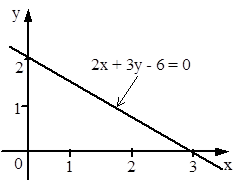

***Şekil 3.1***

***2X + 3y - 6 = 0 Doğrusunun Gösterimi***

Kısıtlayıcı fonksiyonla­rın genellikle eşitsizlik biçiminde belirdikleri
düşünü­lürse, bu formdaki denklemlerin grafikle göste­riminin önemi
ortaya çıkar. Bilindiği gibi, bir doğru denkle­mi A, B ve C sabit
sayılar ve A ile B birlikte sıfır olmamak üzere aşağıdaki gibi ifade
edilmektedir.

AX + By + C = 0

Böyle bir doğru düzlemi üç bölgeye ayırır. Bu bölgeler aşağıdaki
denklemlerle tanımlanırlar.

AX + By + C = 0

AX + By + C ≥ 0

AX + By + C ≤ 0

Eşit işaretli birinci denklem bir doğru, diğer ikisi ise bu doğrunun
altında veya üstünde (bazı durumlarda sağında veya solunda) kalan birer
alan tanımlarlar. Doğrusal eşitsizliklerin koordinat sisteminde nasıl
görüntüleneceği ile ilgili bütün problemler bu iki alanın
ayırdedilme­sini gerekti­rir. Herhangi bir eşit­sizliğin belirlediği
alanı görüntülemek için öncelikle eşitsizlik biçimindeki denklemin
eşitlik şeklinde düşünülmesi ve = işaretli denklemin belirledi­ği
doğrunun çizilmesi gerekir. Doğrunun çizilmesinden sonra doğru üzerinde
bulunma­mak koşuluyla keyfi olarak seçilen bir noktanın koordinatları
eşitsizlikte yerine konur. Eşitsizli­ğin sağlanması durumunda, aranan
bölgenin keyfi olarak seçilen noktanın bulunduğu tarafta olduğu
kararlaştırılır. Aksi halde, aranan bölgenin diğer tarafta bulunduğu
kararlaştırılır. İşlemlerde basitlik sağlamak için keyfi olarak seçilen
nokta (doğrunun orijinden geçmem­esi koşuluyla) genelli­kle orijin olur.
Eşitsizlik biçimindeki bir fonksiyonun düzlemde nasıl görüntüleneceğini
aşağıdaki örnek üzerinde açıklayalım.

***Örnek 3.2***: 3X + 5y - 15 ≥ 0 eşitsizliği­ni görüntüleyiniz.

***Çözüm 3.2***: İlk olarak verilen eşitsizl­iği eşitlik biçiminde (3X +
5y - 15 = 0) düşüne- rek doğrunun geçtiği iki noktayı belirle­yelim.

X = 0 için 3(0) + 5y - 15 = 0 çözülürse, y = 3 ⇒ (X, y) = (0, 3)

y = 0 için 3X + 5(0) - 15 = 0 çözülürse, X = 5 ⇒ (X, y) = (5, 0)

bulunur. Demek ki, bu doğru X eksenini (5, 0), y eksenini de (0, 3)
noktasında kes­mektedir. Bu iki noktayı birleştiren doğrunun
çizilmesinden sonra eşit­sizlikte X = 0, y = 0 konulduğunda, 3(0) + 5(0)
-15 = -15 bulunur. Orijin eşitsizliği gerçeklemedi­ğinden (-15 0 )
aranan bölgenin orijinin bulunmadığı ta­rafta, yani doğrunun
yukarı­sında kaldığı kararlaştırılır. Bu bölgeyi taramadan önce
eşitsizliğin (≥ veya ≤) ya da (≥, ≤) şeklinde olup olmadığı­na dikkat
edilmesi gerekir. Eşitsizlik (≥) veya (≤) ise, çözüm böl­gesi doğru
üzerindeki noktaları da kapsar. Bu durumda doğru genellikle dolu
çiz­giyle görüntülenir. Eşitsizli­k (≥) veya (≤) şeklinde ise, çözüm
alanı doğru üze­rindeki noktaları kapsamaz. Bu durumda doğru, kesikli
çizgi ile gösterilir. Örne­kteki eşitsiz­lik doğru üzerindeki noktaları
kapsa­madığından, Şekil 3.­2’de kesikli çizgi ile gösterilmiştir.

***Şekil 3.2***

***3X + 5y ≥ 15 Bölgesinin Gösterimi***

Bir doğrusal programlama probleminde genellikle birden çok kısıtlayıcı
vardır. Bu nedenle iki ya da daha fazla sayıdaki doğrusal eşitsizliğin
belirlediği alanın araştırıl­ması önemlidir. İki ya da daha fazla
eşitsizliğin belirlediği bölgenin araştırılması işlemleri ile tek
eşitsizliğin tanımladığı bölgenin araştırılması işlemleri birbirlerinden
çok farklı değildir. Ancak, eşitsizlik sayısı arttıkça işlem sayısı da
artar. İki ya da daha fazla sayıda eşitsizliğin oluşturduğu bir sistemin
çözümü eşitsizliklerin tümünü sağlayan noktaların oluşturduğu kümeden
başka bir şey değildir.

İki eşitsizliğin aynı grafikte görüntülenmesini aşağıdaki örnek üzerinde
açıkla­yalım.

***Örnek 3.3***: X + 2y - 4 ≤ 0 ve X - y + 1 ≤ 0 eşitsizlik çifti
tarafından belirlenen çözüm bölgesini bulunuz.

***Çözüm 3.3***: Her iki eşitsizliği sağlayan alanlar önceki örnekler­de
olduğu gibi ayrı ayrı bulunur ve farklı yönlerde taranırsa Şekil
3.3’deki taralı alan elde edilir. Bu alana dahil noktalar iki
eşitsizliği aynı anda sağladı­ğı­ndan aranan çözüm bölgesini
oluştururlar. Taralı alanın belir­lenmesi için önce birinci eşitsizliği
ele alalım.

X + 2y = 4 eşitliğinde, X = 0 için y = 2, y = 0 için X = 4 elde edilir.

İkinci olarak X - y = -1 eşitliğinde, X = 0 için y = 1, y = 0 için X =
-1 bulunur.

Bu belirlemelerden sonra doğruların çizilmesi ve eşitsizlik­lerin
yönlerinin dikkate alınmasıyla elde edilen grafik Şekil 3.­3’de
gösterilmiştir.

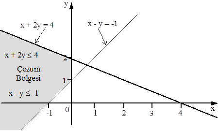

***Şekil 3.3***

***Örnek 3.3’ün Gösterimi***

***Örnek 3.4***: Aşağıdaki eşitsizlikler sisteminin çözümünü grafik
yöntemiyle bulunuz.

X + 2y - 4 ≤ 0, X + 2y - 6 ≥ 0

***Çözüm 3.4***: Eşitsizlik­le­rin belirlediği doğruların
görüntülenmeleri için doğruların X ve y eksenlerini kestiği nok­taları
ayrı ayrı belirleyelim.

Söz konusu noktaların koor­dinatları aşağıda verilmiştir.

X + 2y = 4 eşitliğinde X = 0 için y = 2, y = 0 için X = 4

X + 2y = 6 eşitliğinde X = 0 için y = 3, y = 0 için, X = 6

Doğruların çizilmesinden sonra eşitsizlikleri sağlayan alanlar önceki
örneklerde olduğu gibi ayrı ayrı bulunur ve taranırsa, Şekil 3.4’deki
taralı alanlar elde edilir. Eşitsiz­lik­leri ayrı ayrı sağlayan iki
bölgenin ortak herhangi bir noktası ol­madığı ko­layca görülebilir. Bu
durum sistemin çözümünün olmadığının kanıtıdır.

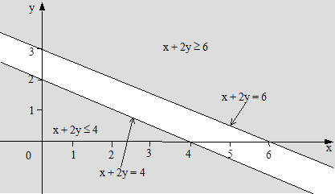

***Şekil 3.4***

##### Örnek 3.4’ün Grafikle Gösterimi

Daha önce belirtildiği gibi, grafikle çözüm en fazla üç değişkenli
problemle­rde her­hangi bir karışıklığa neden olmadan kullanılab­ilir.
Gerçek doğrusal programlama problemlerinin genellikle çok sayıda
değiş­ken ve kısıtlayıcı içerdiği düşünülürse, grafikle çözüm üzerinde
durmanın gereksiz olduğu düşünülebilir. Uygulama alanı değişken sayısı
ile sınırlı da olsa grafikle çözüm doğrusal program lamanın biçimsel
bakımdan açıklan­masında olduğu kadar, dördüncü bölümde açıklanan
simp­leks yöntemin kurallarına açıklık getirmesi bakımından son derece
yararlıdır. Hangi yöntem kullanılırsa kullanılsın doğrusal program­lama
problemleri­nin çözümüne ulaşmak için çözümün anlamı ve özelliklerinin
anlaşılması gerekir.

***Çözüm***: Bir doğrusal programlama probleminin kısıtlayıcı
fonksiyonlarının hepsini birden sağlayan karar değişkenlerinin
(X1, X2, ..., Xn) oluşturduğu kümeye
*çözüm* denir.

***Uygun çözüm***: Negatif olmama koşulunu sağlayan çözüme *uygun çözüm*
denir.

***En iyi çözüm***: Amaç fonksiyonuna en iyi değeri (en küçük veya en
büyük) sağlayan uy­gun çözüme *en iyi çözüm* denir.

Bir doğrusal programlama probleminin grafik çözümünde aşağıdaki adımlar
izlenir:

*1*. Değişkenlerin koordinat sisteminin yatay ve dikey eksenlerine
yer­leştirilmesi,

*2*. Kısıtlayıcı fonksiyonların grafiğinin çizilmesi,

*3*. Uygun çözüm bölgesinin belirlenmesi,

*4*. En iyi çözümün araştırılması.

Bu adımları aşağıdaki örnek problem üzerinde açıklayalım.

***Örnek 3.5***: Amaç fonksiyonu:

Zenb = 6X1 + 8X2

Kısıtlayıcı fonksiyonları:

7X1 + 3X2 ≤ 21 (1)

6X1 + 7X2 ≤ 42 (2)

X1 ≤ 3 (3)

X2 ≤ 4 (4)

Negatif olmama koşulu:

X1, X2 ≥ 0

olarak verilen doğrusal programlama problemini grafik yöntemiyle
çözünüz.

***Çözüm 3.5***: X1 değişkenini yatay, X2
değişkenini dikey eksen üzerinde göstere­lim. Negatif olmama
(X1 ≥ 0, X2 ≥ 0) koşulundan dolayı uygun çözümler
X1X2 düzleminin birinci bölgesinde bulunacaktır.
Kısıtla­yıcı fonksiyonların oluşturduğu sınır, bu böl­geyi
(X1 ≥ 0, X2 ≥ 0) iki kısma ayırır. Bölgelerden
biri negatitif olmama koşulu dahil tüm kısıtlayıcıları sağlarken, diğeri
yalnızca negatif olmama koşulunu sağlayan nok­talardan oluşur.

Çözüm bölgesini belirlemek için kısıtlayıcı fonksiyonları sırasıyla ele
alalım ve kendilerine karşılık gelen doğruların X ve y eksenlerini
kestikleri noktaların koordi­natlarını belirleyelim.

Koordinat belirleme ilgili tüm işlemler aşağıda verilmiştir.

1.  7X1 + 3X2 = 21 eşitliğinde,

X1 = 0 için X2 = 7, X2 = 0 için
X1 = 3

olur.

2.  6X1 + 7X2 = 42 eşitliğinde,

X1 = 0 için X2 = 6, X2 = 0 için
X1 = 8

olur.

\(3\) X1 = 3 eşitliği, yatay ekseni (3, 0) noktasında kesen
ve dikey eksene paralel olan bir doğru tanımlar.

\(4\) X2 = 4 eşitliği, dikey ekseni (0, 4) noktasında kesen
ve yatay eksene paralel doğru denklemidir.

Bu belirlemelerden sonra kısıtlayıcı fonksiyonlarla ilgili doğruları
çizebiliriz.

Sayıları dört olan kısıtlayıcı fonksiyonların her biri için bir doğru
çizilmesi ve eşit­sizliklerin yönlerinin dikkate alınmasıyla uygun çözüm
bölgesi Şekil 3.5’deki taralı alan olarak belirir.

***Şekil 3.5***

***Örnek 3.5’in Gösterimi***

Şekil 3.5’deki taralı alanın içindeki (koyu renk çizilmiş sınırları
dahil) tüm noktalar kısıtlayıcıları aynı anda sağladığından, OABC
dörtgeni uygun çözüm bölgesi­dir. Bu alan içindeki sınırsız sayıdaki
noktaların her biri uygun çözüm olarak nitelendiri­lir.

Şekilden görüldüğü gibi 6X1 + 7X2 ≤ 42 kısıtı olsa
da olmasa da uygun çözüm bölgesi OABC alanı olacaktır. Çözüm bölgesini
etkilemek­sizin modelden çıkartı­labilen bu tür kısıtlayıcılara
*gereksiz* (*fazlalık*) *kısıtlayıcılar* denir. X1 ≤ 3
kısıtının da gereksiz olduğu görülebilir.

Taralı alanın içinde ve sınırları üzerindeki tüm noktalar bütün
kısıtlayıcı fonk­siyon­ları (negatif olmama koşulu dahil) sağladığından
uygun çözüm bölgesi bir kon­veks (dış bükey) alan olarak ortaya çıkar.
Geometrik olarak *konveks alan* kenarlarında çu­kurlaş­ma­lar olmayan ve
içinde delikler bulunmayan bir alandır. Bu alanın A, B gibi herhangi iki
noktası göz önüne alındığında AB doğru parçası­nın tamamı alan içinde
kalır.

Aşağıda, konveks ve konveks olmayan alanlarla ilgili birer örnek
gösterilmektedir.

***Örnek 3.6***: Aşağıdaki kısıtlayıcıları görüntüleyerek uygun çözüm
bölgesinin konveks olup olmadı­ğını gerek­çesiyle belirtiniz.

X1 + 2X2 ≥ 6

X2 ≤ 4

X1 ≤  6

X1, X2 ≥ 0

***Çözüm 3.6***: Kısıtlayıcıların oluşturduğu uygun çözüm bölgesi Şekil
3.6’da gösteril­miştir.

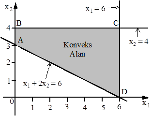

***Şekil 3.6***

***Örnek 3.6’nın Uygun Çözüm Bölgesi***

Şekilden görüldüğü gibi ABCD dörtgeninin (sınırlar dahil) herhangi iki
noktasını birleştiren doğru parçası tümüyle alan içinde kalacağından
ABCD konveks alandır.

***Örnek 3.7***: Aşağıdaki eşitlikler sisteminin çözümünü bularak elde
ettiğiniz çözüm bölgesinin konveks olup olmadığını gerekçesiyle
belirtiniz.

X² + y² = 9, X = 0, y = 0

***Çözüm 3.7***: Yukarıdaki eşitliklerle tanımlanan ve Şekil 3.7’de
gösterilen alan kon­veks değildir. Çünkü bu alanın sınırı üzerinde
bulunan A, B gibi herhangi iki noktayı birleştiren AB doğru parçasının
yal­nızca A ve B ile isimlendirilen iki noktası alan içinde (sı­nırların
üzerinde) kalırken diğerleri bu alana ait değildir.

***Şekil 3.7***

***Örnek 3.7’nin Gösterimi***

Buraya kadar uygun çözüm bölgesinin belirlenmesi üzerinde durduk, amaç
fonksi­yonunun en iyilenmesi konusuna değin­medik. Şimdi amaç fonksiyonu
için en iyi de­ğeri sağlayan çözümün belirlenmesine geçelim. Bir
doğrusal programlama proble­minde amaç fonksiyonuna en iyi değerini
kazandıran bir nokta varsa, bu nokta uygun çözüm bölgesinin köşe
noktalarından biridir. Bu köşe noktalarına uç noktalar da denir. Amaç
fonksiyonunun değe­rini en iyileyen çözü­m noktasının belirlenmesinde
uygun çözüm bölgesindeki sonsuz sayıdaki noktanın değil, bu bölge­nin
sonlu sayı­daki uç noktasının denetlenmesi yeterli olur. Eğer amaç
fonksiyonu en büyük ya da en küçük değeri­ne birden fazla uç nokta­sında
ulaşı­yorsa amaç fonksiyonu bu noktala­rın her birinde aynı değeri alır.
Bu özel durum yeri geldiğinde açıkla­na­c­aktır.

En iyi çözümün ortaya çıktığı uç noktanın belirle­nmesinde
izlene­bil­ecek iki yol vardır.

Birincisi amaç fonksi­yonuna rasgele bir değer verip belirle­diği
doğruyu çiz­mek­tir. Bu doğru üzerindeki bütün noktalarda Z sabit
olduğundan *Z doğrularına* en büyükleme problemlerinde *eş kazanç* (*eş
kâr*), en küçükleme problemlerinde *eş kayıp* (*eş maliyet*) doğruları
da denilmektedir. Bulu­nan doğruyu uygun çözüm alanında, duruma göre
aşağı veya yukarıya doğru, kay­dırarak yine duruma göre en son veya en
önce değdiği uç noktas­ını belirle­mekt­ir. Bu nokta amaç fonksiyo­nunun
değerini en iyileyen noktadır ve bu noktanın koordi­natları karar
değişken­lerinin en iyi değerlerini verir.

En iyi çö­zümü belirlemenin ikinci yolu uygun çözüm alanının her uç
nok­tasının koordinat değerlerini amaç fonk­siyonunda yerine koymak ve
fonksiyonun bunlara karşılık gelen değerlerini hesaplamaktır. Problemin
niteliğine göre en büyük ya da en küçük değeri sağlayan uç nokta en iyi
çözümü sağlayan noktadır.

Zenb = 6X1 + 8X2

7X1 + 3X2 ≤ 21 (1)

6X1 + 7X2 ≤ 42 (2)

X1 ≤ 6 (3)

X2 ≤ 4 (4)

X1, X2 ≥ 0

olarak verilen örnek problemimize dönelim ve amaç fonksiyo­nu değerini
en iyileyen (en büyükleyen) uç noktayı belirleye­lim. Söz konusu
belirleme işleminde ilk olarak yukarıda açıklanan birinci yolu
kullanalım. Bu amaçla amaç fonksiyonuna rasgele bir değer vererek
belirlediği doğruyu çizelim. Z için seçtiğimiz rasgele değer 24 olsun.
Bu durumda, Z = 6X1 + 8X2 = 24 olur.

X1 = 0 için 6(0) + 8X2 = 24 çözülürse
X2 = 3

X2 = 0 için 6X1 + 8(0) = 24 çözülürse
X1 = 4

elde edilir.

Z = 24 için çizilen doğru (Şekil 3.8’de kesik çizgiyle gösteril­miştir)
incelendiğinde uygun çözüm bölgesinin içinde, bu doğrunun yukarısında A
ve B ile isimlendirilmiş iki uç noktanın bulunduğu görülebilir. Bu
durum, orijinden uzaklaştıkça amaç fonk­siyonu değerinin ar­ta­cağına
işaret eder.

O halde, biz de amaç fonksiyonunun değe­rini arttıra­lım ve
araştır­mamızı Z = 36 seçimiyle sürdüre­lim.

Z = 6X1 + 8X2 = 36 olsun.

X1 = 0 için 6(0) + 8X2 = 36 çözülürse
X2 = 4.5

X2 = 0 için 6X1 + 8(0) = 36 çözülürse
X1 = 6

elde edilir.

Z = 36 için çizilen doğru incelendiğ­inde, bu doğrunun Z = 24 için
çizilen doğruya paralel (eğimleri aynı olduğundan) olduğu ve yukarısında
tek bir uç nokta­nın (B) kaldığı görülebilir. Böylece, amaç
fonksi­yo­nunu en iyileyen uç noktanın B olduğu kararlaştırılır.

***Şekil 3.8***

##### Örnek 3.5’in Uygun Çözüm Bölgesi ve Eş Kazanç Doğruları

ZB’nin, yani Zenb’nin hesaplanabilmesi için B
noktası­nın koordinat­lar­ının bulunması gerekir. Bu nokta X2
= 4 ve 7X1 + 3X2 = 21 doğrularının kesiştiği nokta
olduğundan, bu noktanın koordinatları bulunmalıdır. Ke­sim noktası her
iki eşitliği de sağla­ya­cağın­dan denklemlerin bu noktada eşitlenip
çözülmesiyle; X2 = 4 ve 7X1 + 3(4) = 21
eşitliğinin çözümünden, X1 = 9/7 bulunur.

Bu değerlerin amaç fonksiyonunda yerine konulmasıyla, Zenb =
ZB = 6(9/7) + 8(4) = 278/7 = 39.7 olarak hesaplanır. Özetle,
en iyi çözüm Zenb = 39.7, X1 = 9/7 = 1.3,
X2 = 4 olarak belirlenmiştir.

Aynı sonuca ikinci yolu izleyerek, yani uygun çözüm bölgesinin uç
noktaları olan O, A, B ve C noktalarının koordinat değerlerinin amaç
fonksi­yonuna yerleştiril­mesi ve fonksiyonun bu noktalarda aldığı
değerlerin karşılaştırıl­masıyla da ulaşılabilir­di. Bu yöntemin
uygulanmasıy­la ilgili aritmetik işlemler aşağıda topluca verilmiştir.

Amaç fonksiyonunun uç noktalardaki değerlerini hesaplayabil­mek için
herşeyden önce bu uç noktaların koordinatları hesap­lan­malıdır.

A’nın koordinatları X1 = 0, X2 = 4’dür. Buna göre,
ZA = Z(0, 4) = 6(0) + 8(4) = 32 olarak bulunur.

O orijin olup koordinatları X1 = 0, X2 = 0’dır.
Buna göre, ZO = Z(0, 0) = 6(0) + 8(0) = 0 olarak
hesaplanır.

B’nin koordinatları yukarıda hesaplandığından işlemlerin tekrarlanması
gerekmez. ZB’nin 39.7 olarak hesaplandığının hatırlanması
yeterlidir.

C’nin koordinatları X1 = 3, X2 = 0 olduğundan,
ZC = Z(3, 0) = 6(3) + 8(0) = 18 olur.

Amaç fonksiyonunun en büyük değeri B’de hesaplandığından, bu noktanın
koordi­natları en iyi çözümü verir.

Birinci yolla da amaç fonksiyo­nunun en iyi değerinin 39.7 olarak
belirlen­diği hatırlana­bilir.

***Örnek 3.8***: Aşağıdaki doğrusal programlama problemini grafik
yöntemiyle çözünüz.

Zenb = X1 + 3X2

X1 + X2 ≤ 8

X1 + 2X2 ≥ 8

X2 ≥ 3

X1, X2 ≥ 0

***Çözüm 3.8***: Önceki problemlerde olduğu gibi eşit­siz­lik
biçimindeki kısıtlayıcı fonk­siyonların eşitlik biçi­minde
düşünülmesiyle kısıtlayıcı doğruların çizilme­sinden sonra,
eşitsiz­liklerin yönlerinin dikkate alınmasıyla uygun çözüm bölgesi
şekildeki taralı alan olarak belirlenecektir.

Doğrula­rın çizilme­siyle ilgili aritmetik işlemler aşağıda topluca
gösteril­miştir.

X1 + X2 = 8 eşitliğinde X1 = 0 için
X2 = 8, X2 = 0 için X1 = 8 bulunur.

X1 + 2X2 = 8 eşitliğinde X1 = 0 için
X2 = 4, X2 = 0 için X1 = 8 bulunur.

Şekilden görüldüğü gibi, uygun çözüm bölgesi ABCD konveks kümesidir.

Bu böl­genin uç noktalarından en az bir tanesi amaç fonksi­yonu değerini
en büyük­leye­cektir.

Z = 6, Z = 12 ve Z = 18 eş kr doğruları Şekil 3.9’da kesikli çizgi ile
göste­rilmişlerdir. Z = 18 için çizilen eş kr doğrusu incelen­diğinde,
bu doğrunun yu­karı­sında tek bir uç nokta­nın (B) bulunduğu
görülebilir. Bu durumda problemin en iyi çözümünün bu noktada ortaya
çıkacağını söylemek kehanet olmaz.

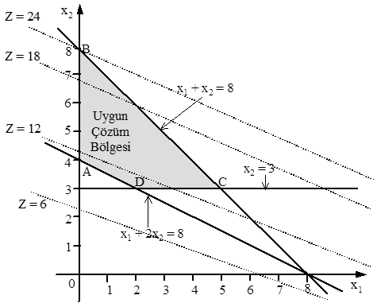

***Şekil 3.9***

***Örnek 3.8’in Uygun Çözüm Bölgesi ve Eş Kr Doğruları***

Görüldüğü gibi, B amaç fonksiyonuna en büyük değeri sağlamaktadır. B’nin
koor­di­natla­rının X1 = 0, X2 = 8 olduğu göz
önünde bulunduruldu­ğun­da ZB(Zenb) aşağıdaki gibi
hesaplanır.

ZB = Zenb = 0 + 3(8) = 24

Özetle, karar değişkenlerinin en iyi değerleri X1 = 0,
X2 = 8 ve amaç fonksiyonunun en büyük değeri 24 olarak
belirlenmiş­tir.

Uç noktaların koordinatlarının ayrı ayrı hesaplanıp amaç fonksi­yonuna
yerleştirilme­siyle hesaplanan Z değerleri aşağıda verilmiştir.

Bu hesaplamalar da amaç fonksi­yonunun en büyük değerine B(0, 8)
noktasında ulaştığını göstermektedir.

ZA = Z(0, 4) = 1(0) + 3(4) = 12

ZB = Z(0, 8) = 1(0) + 3(8) = 24

ZC = Z(5, 3) = 1(5) + 3(3) = 14

ZD = Z(2, 3) = 1(2) + 3(3) = 11

Buraya kadar, en büyükleme amaçlı problemlerin çözümü üzerinde durduk.
Şimdi de, en küçükleme amaçlı problemle­rin grafikle çözümü üzerinde
duralım.

En küçükleme problemlerinin grafik çözümü ile en büyükleme
problemlerinin grafik çözümleri arasında temelde hiçbir fark yoktur.
Birinde amaç fonksiyonunun değerini en büyük kılan uç nokta
belirlenirken, diğerinde amaç fonksiyonunun en küçük de­ğerini sağlayan
uç noktanın belirlenmesine çalışılmaktadır.

***Örnek 3.9***: Aşağıdaki doğrusal programlama problemini grafik
yöntemiy­le çözünüz.

Zenk = 3X1 + 5X2

3X1 + X2 ≥ 9

X1 + 2X2 ≥ 8

X1 + 5X2 ≥ 10

X1, X2 ≥ 0

***Çözüm 3.9***: En büyükleme problemlerinde olduğu gibi öncelikle
eşitsizlik biçimindeki kısıtlayıcı fonksiyonların eşitlik biçiminde
düşünülmesiyle kısıtlayıcı doğrula­r çizilmelidir. Doğruların
çizilmesinden sonra, eşitsizliklerin yönleri­nin dik­kate alınmasıyla
uygun çözüm bölgesi Şekil 3.10’daki taralı alan olarak ortaya çıkar.

Doğrula­rın çizilme­siyle ilgili aritme­tik işlemler aşağıda topluca
gösteril­miştir.

3X1 + X2 = 9 eşitliğinde X1 = 0 için
X2 = 9, X2 = 0 için X1 = 3,

X1 + 2X2 = 8 eşitliğinde X1 = 0 için
X2 = 4, X2 = 0 için X1 = 8,

X1 + 5X2 = 10 eşitliğinde X1 = 0 için
X2 = 2, X2 = 0 için X1 = 10.

***Şekil 3.10***

***Örnek 3.9’un Uygun Çözüm Bölgesi ve Eş Maliyet Doğruları***

Şekil 3.10’da sınırı dolu çizgi ile gösterilen uygun çözüm bölgesinin
bükülü sınır çizgisi üzerindeki uç nokta­lardan biri amaç fonksiyonuna
en küçük değeri kazandırır. Daha önceki işlemleri göz önüne alarak en
iyi çözümün hangi uç noktada ortaya çık­tığını araştıralım.

Z = 15, Z = 30 eş maliyet doğru­ları kesikli çizgi ile gösterilmiştir.
Bu iki doğru, orijinden uzaklaş­tıkça amaç fonksiyonu­nun değerinin
arttığını ortaya koy­maktadır. Amacımız Z’yi en küçükle­yen uç noktasını
belirlemek olduğuna göre, orijinden uzaklaş­mak yerine ona yaklaşmalı ve
ona en yakın uç noktasını belirleme­li­yiz. Daha önceki açıklamalara
göre B noktası amaç fonksiyonuna en küçük değeri kazandıran nokta­dır.

B noktası 3X1 + X2 = 9 ve X1 +
2X2 = 8 doğrularının kesim noktası olduğundan bu noktanın
koordinatları, 3X1 + X2 = 9 ve X1 +
2X2 = 8 eşitlikler sisteminin çözümüyle bulunur.
X1 = 2, X2 = 3 olarak belirlenmiştir. Bulu­nan
değerlerin amaç fonksiyonuna yerleştirilmesiyle, ZB =
Zenk = 3(2) + 5(3) = 21 olarak hesaplanacaktır.

Uç noktaların koordinatlarının ayrı ayrı hesaplanıp amaç fonksi­yonunda
yerine konul­masıyla elde edilen değerler de (aşağıda topluca
verilmiştir) B noktasının en iyi çözümü sağlayan nokta olduğunu
göstermekte­dir.

ZA = Z(0, 9) = 3(0) + 5(9) = 45

ZB = Z(2, 3) = 3(2) + 5(3) = 21

ZC = Z(20/3, 2/3) = 3(20/3) + 5(2/3) = 23.3

ZD = Z(10, 0) = 3(10) + 5(0) = 30

***Örnek 3.10***: Aşağıdaki doğrusal programlama problemini grafik
yöntemiy­le çözünüz.

Zenk = 2X1 + 3X2

3X1 + 2X2 ≥ 6

X1 - 2X2 ≤ 4

X1 ≤ 5

X2 ≤ 3

X1, X2 ≥ 0

***Çözüm 3.10***: Kısıtlayıcı fonksiyonların oluşturduğu çözüm bölgesi
Şekil 3.11’deki ABCDE konveks kümedir.

Z = 2X1 + 3X2 = 12 olduğunu düşünelim. Z = 12 için
çizilen doğru incelendiğinde, uygun çözüm bölgesinin uç nokta­larından
olan A, C, D ve E’nin bu doğrunun altında kaldıkları görü­lebilir. Amaç,
Z’yi en küçükle­yen uç noktasını belirlemek olduğuna göre, orijinden
uzaklaş­mak yerine ona yaklaşmalı ve ona en yakın uç noktası
belir­lenmelidir. O halde Z’ye daha küçük bir değer verelim ve Z =
2X1 + 3X2 = 6 olduğunu düşünelim. Şekil 3.11’den
görüldüğü gibi, Z = 6 doğrusunun altında tek bir uç nokta (E)
bulunmaktadır. Daha önceki açıkla­mal­ar doğrultusun­da E’nin amaç
fonksi­yonuna en küçük değer­i sağlayan nokta olduğu karar­laştırılır. E
noktasının koordinat­ları (2, 0) olduğundan, ZE =
Zenk = 2(2) + 3(0) = 4 olarak hesaplanır.

***Şekil 3.11***

***Örnek 3.10’un Uygun Çözüm Bölgesi***

Uç noktaların koordinatlarının ayrı ayrı hesaplanıp amaç fonksi­yonunda
yerine konulmasıyla ulaşılan değerler de (aşağıda topluca verilmiştir) E
noktasının en iyi çözümü sağlayan nokta olduğunu göstermekte­dir.

ZA = Z(0, 3) = 2(0) + 3(3) = 9

ZB = Z(5, 3) = 2(5) + 3(3) = 19

ZC = Z(5, 0,5) = 2(5) + 3(0.5) = 11.5

ZD = Z(4, 0) = 2(4) + 3(0) = 8

ZE = Z(2, 0) = 2(2) + 3(0) = 4

##  3.3 GRAFİK ÇÖZÜMDE KARŞILAŞILAN ÖZEL DURUMLAR

Buraya kadar ele alınan tüm örneklerin uygun çözüm bölgeleri konveks
alanlar olarak ortaya çıkmış ve en iyi çözüme bu bölgelerin bir uç
nokta­sın­­da ulaşılmıştır. Zaman zaman, uygun çözüm bölgesi­nin
bulunmadığı veya uygun çözüm bölgesi olsa da en iyi çözümü veren bir uç
noktanın belirlenemediği ya da en iyi çözüme birden fazla uç noktada
ulaşıldığı doğrusal programlama problemleriyle de
karşılaşılabilmektedir. İzleyen ke­simde, çoğunlukla modelin
kurulmasında veya çözümde yapılan yanlışlar sonucu ortaya çıkan özel
durumlar açıklanacaktır.

###  *3.3.1 Eşitsizliklerin Tutarsız Olması* 

Doğrusal programlama problemlerinin çözümünde her zaman uygun bir çözüm
bölgesi bulunmayabilir. Bazı durumlar­da uygun çözüm bölgesi oluşsa da
negatif olmama koşulu sağlanmayabilir.

Kısıt­layıcıların tutarsız olmaları sonucu gerçekleşen bu iki özel
durumu birer örnekle açıklayalım.

***Örnek 3.11***: Aşağıdaki doğrusal programlama problemini grafik
yöntemiyle çözünüz.

Zenb = 6X1 + 3X2

X1 + 2X2 ≤ 2

2X1 + X2 ≥ 6

X1, X2 ≥ 0

***Çözüm 3.11***: Önceki örneklerde olduğu gibi önce eşitsizlikleri
eşitlik biçiminde ele alarak uygun çözüm bölgesini belirleyelim.

Şekil 3.12’den görüldüğü gibi kısıtlayıcı fonksiyonları sağlayan farklı
yönlerde taranmış alanların ortak herhangi bir noktası bulunmadı­ğından,
uygun çözüm bölgesi boştur. Bu nedenle de prob­lemin çözümü yoktur. Bu
gibi durumlarda problemin yeniden ele alınması uygun olur.

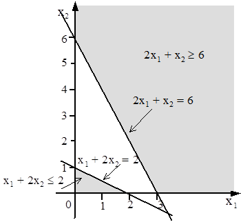

***Şekil 3.12***

***Örnek 3.11’in Gösterimi***

***Örnek 3.12***: Aşağıdaki doğrusal programlama problemi­ni grafik
yönte­miyle çözünüz.

Zenb = 6X1 + 3X2

X1 + 2X2 ≤ 2

4X1 + 3X2 ≥ 12

X1, X2 ≥ 0

***Çözüm 3.12***: Problemin uygun çözüm bölgesi Şekil 3.13’de verildiği
gibidir. Şe­kil’den görüldüğü gibi kısıtlayıcıları sağlayan çözüm
bölgesi X1 ≥ 0 koşulunu sağlarken, X2 ≥ 0
koşu­lunu gerçeklemediğinden, bir en iyi çözümden söz edilemez.

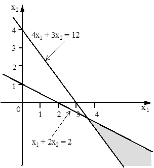

***Şekil 3.13***

***Örnek 3.12’nin Çözüm Bölgesi***

###  *3.3.2 Sınırsız Çözüm*

Doğrusal programlama problemlerinin çözümünde karşılaşılan diğer bir
du­rum da uygun çözüm bölgesinin sınırsız olmasıdır. Uygum çözüm bölgesi
sınırsız olduğunda, amaç fonk­si­yonu giderek artan değerler alır ve bir
türlü en iyi olan sonuca ulaşılamaz. Uygun çözüm bölgesinin sınırsız
olması, hiçbir zaman en iyi çözümün elde edilmeyeceği anlamına gelmez.
Sınırsız çözüm durumunda, amaç fonksiyonunu en büyükleyen uç noktanın
belirlenmesi yerine amaç fonksiyonunun değerini en küçük­leyen uç nokta
araştırılabilir. Sınırsız çözümün nedeni problemin yanlış
modellenmesidir.

Aşağıda sınırsız çözüm durumuyla ilgili bir örnek verilmiş­tir.

***Örnek 3.13***: Aşağıdaki doğrusal programlama problem­ini grafik
yön­temiyle çözünüz.

Zenb = 2X1 + X2

-2X1 + X2 ≤ 4

X1 - X2 ≤ 1

X1, X2 ≥ 0

***Çözüm 3.13***: Problemin uygun çözüm bölgesi Şekil 3.14’de
gösterilmiştir. Şeklin ortaya koyduğu gibi uygun çözüm bölgesi kapalı
değildir. Amaç fonksiyonunda X1 ve X2’nin
katsayılarının pozitif ve problem en büyükleme amaçlı olduğundan sınırlı
bir çözüm bulunamaz. Bu durumda problemin sınırsız çözümü vardır. Ancak
problem en küçükleme amaçlı olsa idi orijin (nötr faaliyetler durumu) en
iyi çözümün ortaya çıktığı nokta olurdu.

***Şekil 3.14***

***Örnek 3.13’ün Uygun Çözüm Bölgesi***

###  *3.3.3 Uygun Çözüm Bölgesinin Bir Nokta Olması*

Kimi zaman uygun çözüm bölgesi tek bir nokta şeklinde ortaya çıkar. Bu
gibi durumlarda amaç ne olursa olsun en iyi çözüme söz konusu noktada
ulaşılır.

***Örnek 3.14***: Aşağıdaki doğrusal programlama problemini grafik
yöntemiyle çözünüz.

Zenb = 6X1 + 3X2

X1 + X2 ≤ 6

3X1 + 5X2 ≥ 24

X2 = 3

X1, X2 ≥ 0

***Çözüm 3.14***: Problemin uygun çözüm bölgesi Şekil 3.15’deki A
noktasıdır. Buna gore değişkenlerin en iyi değerleri söz konusu noktanın
koordinatları olarak ortaya çıkar. Bu notanın koordinatları yukarıdaki
kısıtlayıcı fonksiyonlardan herhangi ikisi­nin birlikte çözülmesiyle
bulunabilir.

Üç doğrunun kesiştiği noktanın koordinatlarının belirlenmesi amacıyla
bunlardan rasgele seçilen ikisi, 3X1 + 5X2 = 24 ve
X2 = 3 olsun. Bu iki denklemin çözümünden X1 = 3,
X2 = 3 elde edilir. Buradan amaç fonksiyonunun en büyük
değeri,

Z’de X1 = 3, X2 = 3 yerleştirilmesiyle,

Zenb = 6(3) + 3(3) = 27

olarak hesaplanır.

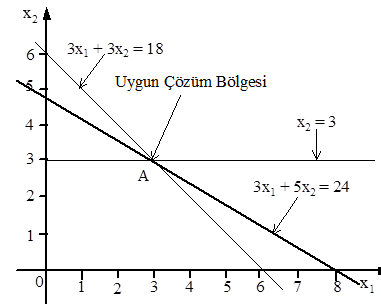

***Şekil 3.15***

***Örnek 3.14’ün Uygun Çözüm Bölgesi***

###  *3.3.4 Alternatif En İyi Çözümler*

Amaç fonksiyo­nunun en iyi değerine birden çok sayıda uç noktası­nda
ulaş­ması durumunda alternatif, yani birden fazla en iyi çözümden söz
edilir. Bu gibi du­rumlarda amaç fonksi­yo­nunun en iyi değeri, ilgili
her uç noktasında eşittir. Farklı olan yalnızca, karar değiş­kenlerinin
en iyi değerleridir.

***Örnek 3.15***: Aşağıdaki doğrusal programlama problemini grafik
yöntemiyle çözünüz.

Zenb = 8X1 + 8X2

2X1 + 3X2 ≥ 12

3X1 + 2X2 ≥ 12

X1 + X2 ≤ 6

X1, X2 ≥ 0

***Çözüm 3.15***: Problemin uygun çözüm bölgesi Şekil 3.16’daki ABC
üçgen alanıdır. Amaç fonksiyonunun ABC üçgeninin uç noktalarındaki
değerleri aşağıda verilmiştir.

ZA = Z(0, 6) = 8(0) + 8(6) = 48

ZB = Z(6, 0) = 8(6) + 8(0) = 48

ZC = Z(12/5, 12/5) = 8(12/5) + 8(12/5) = 192/5

Amaç fonksi­yonu en büyük değerine A(0, 6) ve B(6, 0) noktalarında
ulaşmıştır. Dolayısıyla A ve B noktalarındaki çözümler birbirlerine
alternatif olan en iyi çözümlerdir. Z = 48 doğrusu çizildiğinde bu
doğrunun uygun çözüm bölgesinin AB üst sınırıyla çakıştığı görülebilir.
Bu nedenle AB üzerindeki sınırsız sayıdaki nok­tanın her biri bu
problemin en iyi çözümüdür.

***Şekil 3.16***

***Örnek 3.15’in Uygun Çözüm Bölgesi***

Örnek problemlerin ortaya koyduğu gibi, herhangi bir doğrusal
prog­ramlama prob­leminin en iyi çözümü varsa, uygun çözüm bölgesinin en
azından bir köşe noktası bu çözümü verecektir.

## PROBLEMLER

***1***. Aşağıdaki problemleri grafik yöntemiyle çözerek, sonuçları
yorumlayınız.

***a***. Zenb = 3X1 + 6X2

X1 + X2 ≥ 3

X1 + X2 ≤ 6

X1 ≥ 4

X1, X2 ≥ 0

***b***. Zenb = 3X1 + 6X2

X1 + X2 ≤ 4

X1 + X2 ≤ 1

X1 - X2 ≤ -1

X1, X2 ≥ 0

***c***. Zenb = 4X1 + 2X2

X1 + X2 ≥ 2

-X1 + X2 ≤ 1

4X1 - 2X2 ≥ 2

X1, X2 ≥ 0

***d***. Zenb = 4X1 + 2X2

-X1 + 2X2 ≤ 4

X1 - X2 ≥ 1

X1, X2 ≥ 0

***e***. Zenk = 2X1 + 4X2

X1 + 2X2 ≤ 10

X2 ≤ 4

X1 + X2 ≤  1

X1, X2 ≥ 0

***f***. Zenk = X1 + 5X2

2X1 + X2 ≤ 6

5X1 + 4X2 ≥ 20

X1, X2 ≥ 0

***g***. Zenb = 3X1 + X2

2X1 + X2 ≤ 6

X1 + 3X2 ≤ 9

X1, X2 ≥ 0

***h***. Zenb = X1 + X2

X1 + 2X2 ≤ 10

X1 + X2 ≥ 1

X2 ≤ 4

X1, X2 ≥ 0

***i***. Zenb = 5X1 + X2

X1 + X2 ≤ 12

4X1 + 3X2 ≤ 20

X1, X2 ≥ 0

***j***. Zenk = 3X1 - X2

2X1 + 3X2 ≥ 10

3X1 + X2 ≥ 8

X2 ≤ 4

X1, X2 ≥ 0

***k***. Zenk = 0.3X1 + 0.9X2

X1 + X2 ≥ 200

0.21X1 – 0.30X2 ≤ 0

0.03X1 – 0.01X2 ≥ 0

X1, X2 ≥ 0

***l***. Zenk = 5X1 + 4X2

3X1 + 2X2 ≤ 12

0.5X1 + X2 ≤ 3

-X1 + X2 ≤ 1

X2 ≤ 2

X1, X2 ≥ 0

### *Bölüm 4*

### *SİMPLEKS YÖNTEMİ*

## 4.1 GİRİŞ

Doğrusal programlama prob­lem­lerinin çözümünü kavrayabilmek bakımın­dan
önemli olan grafik yöntemi, çok değişkenli doğrusal programlama
prob­lemle­ri­nin çözümünde son derece ye­tersiz kalmak­ta­dır. Grafikle
çözümün uygulana­madığı çok değişkenli doğrusal programlama
problemlerinin çözümünde yaygın biçimde kul­lanılan yöntem *simpleks
yöntemidir*. George B. Dantzig tarafından geliştirilen bu yöntem
tekrarlı bir yöntem olduğundan *simpleks algoritma* olarak da
adlandırıl-maktadır. Simpleks adı uygun çözüm bölgesinin şek­linden
türetilmiştir. n boyutlu uzayda (n + 1) uç noktaya sahip konveks çoklu
düzleme *simp­leks* denir. Örneğin, iki boyutlu uzayda simpleks bir
üçgen, üç boyutlu uzayda bir dörtgendir. Simpleks yöntemin tekrarla­rı
simpleksin bir uç noktasından daha büyük (en büyükleme problemlerinde)
veya daha küçük (en küçükleme problemlerinde) bir Z değeri sağlayacak
komşu uç noktalarına yapılan hareketlerden oluşur. Sonlu sayıda uç
noktası olan simpleks üzerinde belirli sayıda tekrardan sonra en iyi
çözüme ulaşılır. Yöntemin en belirgin özelli­ği çok sayıda değiş­ken
içeren doğrusal program­lama problem­lerine kolayca
uygulanabilm­esi­dir. Yöntemle ilgili açıklamalara geçmeden önce
yöntemin kuramsal açıklamaları üzerinde durmayaca­ğımızı, simpleks
yöntemini matematiksel olmayan bir yaklaşımla açıklayacağımızı
belirtmeliyiz.

##  4.2 KANONİK VE STANDART BİÇİMLER

Daha önce açıklandığı gibi problemin belirlenmesinden sonra yapılması
gerekli en önemli iş, problemi en iyi biçimde temsil eden ve çözümü
kolay olan bir modelin kurulmasıdır. Bilindiği gibi, doğrusal
programlama problemleri farklı biçimlerde gösterilmektedir. Amaç
fonksiyonu Zenb veya Zenk, kısıtlayıcı
fonksi­yonları eşitsizlik (≥ veya ≤) ya da eşitlik biçiminde
tanımla­nabi­lir. Bu kesimde, doğrusal programlamanın kanonik ve
standart biçimleri üzerinde durulacaktır.

***1**. **<u>Kanonik Biçim</u>***

Zenb = C1X1 +
C2X2 + ... + CnXn

a11X1 + a12X2 + ... +
a1nXn ≤ b1

a21X1 + a22X2 + ... +
a2nXn ≤ b2

. . ... . .

am1X1 + am2X2 + ... +
amnXn ≤ bm

X1 ≥ 0, X2 ≥ 0, ..., Xn ≥ 0

olarak formüle edilen doğrusal programlama aşağıdaki özellik­lere
sahipse, *kanonik* biçimde olduğu söylenir.

*1*. Tüm karar değişkenleri negatif değildir.

*2*. Amaç fonksiyonu en büyükleme tipindedir.

*3*. Tüm kısıtlayıcı fonksiyonlar (≤) işaretlidir.

***2**. **<u>Standart Biçim</u>***

Zenk/enb = C1X1 +
C2X2 + ... + CnXn

a11X1 + a12X2 + ... +
a1nXn = b1

a21X1 + a22X2 + ... +
a2nXn = b2

. . ... . .

am1X1 + am2X2 + ... +
amnXn = bm

X1 ≥ 0, X2 ≥ 0, ..., Xn ≥ 0

olarak formüle edilen doğrusal programlama modeli aşağıdaki özelliklere
sahipse, *standart* biçimde olduğu söylenir.

*1*. Tüm karar değişkenleri negatif değildir.

*2*. Amaç fonksiyonu en büyükleme veya en küçükleme tipinde­dir.

*3*. Tüm kısıtlayıcı fonksiyonlar (negatif olmama koşulu dışında) =
işaretlidir.

*4*. Kısıtlayıcı fonksiyonların sağ taraf sabitleri negatif değildir.

Herhangi bir doğrusal programlama modeli bazı basit dönüş­türme
işlemleriyle her iki biçimde de yazılabilir. Dönüştürme işlemlerinin
yaygın biçimde kullanılanları aşağıda açıklanmıştır.

***1**.**En iyilemenin anlamını değiştirme***: Bilindiği gibi, bir
fonksiyonun en büyük değeri ile ters işaretlisi­nin en küçük değeri
birbirine eşittir. Bu neden­le, en bü­yükleme amaçlı bir doğrusal
programlama prob­lemi en küçükl­eme problemi olarak çözülebilir. Bunun
tersi de doğrudur. Her iki durumda da amaç fonksi­yonunun (-1) ile
çarpılması yeterlidir. Örne­ğin,

Zenb = C1X1 +
C2X2 + ... + CnXn

olarak tanımlanmışken,

= (-Zenb ) = -C1X1 -
C2X2 - ... - CnXn

veya

Zenk = C1X1 +
C2X2 + ... + CnXn

olarak verilmişken,

= (-Zenk) = -C1X1 -
C2X2 - ... - CnXn

yazılabilir.

Bu dönüşümü mümkün kılan, her iki amacın aynı uygun çözüm bölgesinde en
iyilenmesidir.

Örnek olması bakımından amaç fonksi­yonunun aşağıdaki gibi formüle
edildiğini düşünelim.

Zenk = 3X1 - 4X2 + 2X3 -
5X4

Amaç fonksiyonundaki tüm terimlerin işaretlerinin değiştirilmesiyle amaç
fonksi- yonu aşağıdaki gibi yazılabilir.

= (-Zenk) = -3X1 + 4X2 - 2X3
+ 5X4

Dönüştürme işlemi, karar değişkenlerinin en iyi değerle­rini
değiş­tirmez. Problemi çözdükten sonra amaç fonk­si­yonunun en iyi
değeri (-1) ile çarpılırsa orijinal problemin Zenk
(­Zenb) değeri bulunur.

***2**.**Eşitsizliklerin yönünü değiştirme***: Herhangi bir eşitsizliğin
her iki tarafı (-1) ile çarpıldı­ğın­da eşitsizlik yön değiştirir.
Sözgelimi, a1X1 + a2X2 ≥ b
ile her iki tarafının (-1) ile çarpıl­masıyla elde edilen
-a1X1 - a2X2 ≤ -b
birbirlerine eşittir. Benzer biçimde, a1X1 +
a2X2 ≤ b yerine -a1X1 -
a2X2 ≥ -b yazılabilir.

***3**.**Eşitliği eşitsizliğe dönüştürme***: Eşitlik biçimindeki bir
kısıtlayıcı fonksi­yon iki eşitsizlikle açıkla­nabilir. Örneğin,
a1X1 + a2X2 = b biçimindeki
bir fonksiyon yerine, a1X1 +
a2X2 ≥ b ve a1X1 +
a2X2 ≤ b veya a1X1 +
a2X2 ≤ b ve -a1X1 -
a2X2 ≤ -b yazılabilir.

***4**.**İşareti sınırlandırılmamış değişkenler***: İşareti
sınırlandırılmamış bir değişken (pozitif, negatif veya sıfır) negatif
olmayan iki değişken arasındaki fark olarak açıklanabilir. Sözgelimi, X
işareti sınırlandırılma­mış bir değiş­ken ise, X yerine kullanılabilir.
Burada, ≥ 0 ve ≥ 0’dır. Negatif olmayan ve değişkenlerinden en fazla
biri en iyi çözümde pozitif değerli olur.

***5**.**Eşitsizlik biçimindeki kısıtlayıcı fonksiyonların eşitlik
biçimine dönüştürülmesi***:

Simp­leks yöntem bir eşitlikler sistemine, standart işlemlerin tekrar
tekrar uygulanmasıyla çözüm arayan bir süreçtir. Bu nedenle yöntemin en
önemli adımı kısıtlayıcı fonksiyonların eşitlik biçiminde yazılmasıdır.
Eşitsizlik biçimindeki bir kısıtlayıcının eşitsizliğin yönü bakımın­dan
iki türlü olduğu bilinmektedir. Eşitsiz­likler ≤ bi veya ≥
bi biçimindedir.

(≤) işaretli eşitsizlikleri eşitlik biçimine dönüştürmek için bunların
sol ta­raflarına negatif olmayan birer değişken eklenir. *Aylak
değişken* adı verilen bu değişkenler Xn+1, Xn+2,
..., Xn+m ile gösterilir. (≥) işaretli eşitsizlikler ise, sol
ta­raflarından negatif olmayan birer değişken çıkartılmasıyla eşitlik
biçimine dönüştürülür. Eşitsizliğin iki tarafı arasındaki farkı gösteren
bu değişken­e *artık değişken* denir. Bu değişkenler de aylak
de­ğişkenler gibi Xn+1, Xn+2 ­, .­..,
Xn+m sembolleriyle gösteri­lir­l­er. Yukarıda açıklandığı
gibi, negatif olmama koşulu karar değiş­kenlerinin yanı sıra aylak ve
artık değişkenlere de uygulanmaktadır. Bunun nedeni, kısıtlayıcı
fonksi­yonlardaki (≥) ve (≤) şartlarının gerçekleşmesini sağlamaktır.

***6**. **Mutlak değerli kısıtlayıcı fonksi­yonların eşitsizlik
biçiminde yazılması***: Çok sık olmasa da mutlak değer içeren
kısıtlayıcı fonksiyonlara rastlanabi­lir. Hangi yöntem uygulanırsa
uygulansın bu tür kısıtlayıcılarla çözüme ulaşılamaz. Bu yüzden mutlak
değerden kurtulmak gerekir. Örnek olması bakımından, kısıtlayıcı
fonksiyonun ≤ b şeklinde formüllendiğini düşünelim. Bu durumda yapılması
gereken ≤ b yerine a1X1 +
a2X2 ≥ -b ve a1X1 +
a2X2 ≤ b ikilisini yerleştirmektir. Kısıtlayıcı ≥
b ise ≥ b yerine geçecek eşitsizlikler a1X1 +
a2X2 ≥ b ve a1X1 +
a2X2 ≤ -b biçimindedir.

Herhangi bir doğrusal programlama modelinin standart veya kanonik
biçimde yazıl­masını bir örnek üzerinde açıklaya­lım.

***Örnek 4.1***: Aşağıdaki gibi verilmiş olan doğrusal programlama
problemini, ***a***. Kanonik biçimde, ***b***. Standart biçimde yazınız.

Zenk = -6X1 + 7X2 + 7X3 -
X4

X1 + 2X2 - 4X3 ≥ 30

2X1 + 9X2 + 6X3 + X4 ≤ 60

6X1 + X3 + X4 = 15

\|3X1 + 4X2\| ≤ 80

X1, X2, X4 ≥ 0, X3
sınırlandırılmamış

***Çözüm 4.1***: ***a***. Kanonik biçimde amaç fonksiyonunun
Zenb olması gerektiğinden Zenk olarak verilen amaç
fonksiyonu her iki tarafının (-1) ile çarpılmasıyla Zenb
biçimine dönüştürülür. X3’ün işareti bakımından
sınırlandırılma­mış olduğu göz önünde bulundurul­duğun­da amaç
fonksiyonu aşağıdaki gibi elde edilir.

= 6X1 - 7X2 - 7() + X4

Kanonik biçimin kısıtlayıcı fonksiyonlarının (≤) işaretli olması
gerektiğinden, bu özelliği taşımayan kısıtlayıcıların uygun dönüştürme
işlemleriy­le (≤) biçiminde yazılması zorunludur. Bu amaçla, kısıtlayıcı
fonksi­yonları sırasıyla ele alalım. İlk kısıtlayıcı (≥) işaretli
olduğundan, her iki yanı (-1) ile çarpılır. X3’ün işareti
sınırlandırıl­ma­mış olduğundan, X3 yerine () yazılmasıyla
birinci kısıtlayıcı fonksiyon aşağıdaki gibi düzenlenir.

-X1 - 2X2 + 4() ≤ -30

İkinci kısıtlayıcı fonksiyonun yönü doğrudur. X3 yerine ()
yazılmasıyla fonksiyon aşağıdaki gibi düzeltilmiş olur.

2X1 + 9X2 + 6() + X4 ≤ 60

Üçüncü kısıtlayıcı eşitlik biçiminde olduğundan aşağıdaki eşitsizlikler
çiftiyle açıklanmalıdır.

6X1 + X3 + X4 ≤ 15

6X1 + X3 + X4 ≥ 15

Bu eşitsizlik çiftine X3 = yerleştirilmesi ve (≥) işaretli
kısıtlayıcının her iki tarafının (-1) ile çarpılması sonucunda bu
kısıtlayıcı fonksiyon,

6X1 + () + X4 ≤ 15

-6X1 - () - X4 ≤ -15

olarak kanonik biçime uygun hale dönüştürülmüş olur.

Dördüncü kısıtlayıcı fonksiyonun sol tarafındaki mutlak değer bu
kısıtlayıcının,

3X1 + 4X2 ≤ 80

3X1 + 4X2 ≥ -80

biçiminde yazılmasını gerektirir. (≥) işaretli kısıtlayıcının her iki
tarafının (-1) ile çarpılmasıyla mutlak değerli kısıtlayıcının yerine
kullanılacak fonksiyonlar: 3X1 + 4X2 ≤ 80 ve
-3X1 - 4X2 ≤ 80 olarak elde edilmiş olur. Kanonik
biçim tümüyle aşağıdaki gibi yazılabilir.

= 6X1 - 7X2 - 7() + X4

-X1 - 2X2 + 4() ≤ -30

2X1 + 9X2 + 6() + X4 ≤ 60

6X1 + () + X4 ≤ 15

-6X1 - () - X4 ≤ -15

3X1 + 4X2 ≤ 80

-3X1 - 4X2 ≤ 80

X1, X2, , , X4 ≥ 0

***b***. *S*tandart modelin amaç fonksiyonu Zenb veya
Zenk türünde olabilir. Bu yüzden orijinal amaç fonksiyonu
standart biçim için de geçerli olur. Burada, dikkat edilmesi gereken en
önemli nokta, X3’ün işaretçe sınırlandı­rılmamış olduğudur. O
halde, standart biçimin amaç fonk­siyonu aşağıdaki gibi olur.

Zenk = -6X1 + 7X2 + 7() - X4

Standart biçimde tüm kısıtlayıcı fonksiyonların eşitlik biçiminde olması
gerektiğinden, bu biçime uymayan kısıtlayıcılar eşitlik biçiminde
düzenlenmelidir. Kısıtlayıcı fonksiyonları sırasıyla ele alalım.

Birinci kısıtlayıcının yönü (≥) olduğundan, eşit­sizliğin sol tarafından
negatif olmayan bir değişkenin (X5) çıka­rtılması gerekir.
X3’ün sınırlandırılma­mış olduğunun dikkate alınmasıyla,
standart biçimin ilk kısıt­layıcı fonksiyonu aşağıdaki gibi elde edilir.

X1 + 2X2 - 4() - X5 = 30

İkinci kısıtlayıcıya bir aylak değişken (X6) eklenmesi ve
X3 = yazılmasıyla kısıtlayıcı fonksiyon aşağıdaki gibi olur.

2X1 + 9X2 + 6() + X4 + X6 =
60

Üçüncü kısıtlayıcı eşitlik biçiminde oldu­ğundan de­ğişmez.
X3 yerine () yazılmasıyla elde edilen kısıtlayıcı kısıtlayıcı
fonksiyon şöyledir:

6X1 + () + X4 = 15

Modelin son kısıtlayıcı fonksiyonu yerine -3X1 -
4X2 ≤ 80 ve 3X1 + 4X2 ≤ 80 yazılması
bunlara sırasıyla X7 ve X8 aylak değişkenlerinin
eklenmesiyle,

-3X1 - 4X2 + X7 = 80

3X1 + 4X2 + X8 = 80

elde edilir.

Tüm kısıtlayıcı fonksiyonlar uygun biçimde düzenlendiğinden, negatif
olmama koşulunun yazılmasıyla standart biçim,

Zenk = -6X1 + 7X2 + 7() - X4

X1 + 2X2 - 4() - X5 = 30

2X1 + 9X2 + 6() + X4 + X6 =
60

6X1 + () + X4 = 15

-3X1 - 4X2 + X7 = 80

3X1 + 4X2 + X8 = 80

X1, X2, , X4, , , X5,
X6, X7, X8 ≥ 0

olarak düzenlenmiş olur.

##  4.3 SİMPLEKS YÖNTEMİN AÇIKLANMASI

Yukarıda belirtildiği gibi, simpleks yöntem herhangi bir doğrusal
programlama problemine, eğer varsa, sınırlı sayıda tekrar sonucunda bir
en iyi çözüm bulan veya sınırsız çözüm olduğunu belirten bir tekrarlar
sürecidir. Yani, en iyi çözüm standart işlemlerin sınırlı tekrarı ile
elde edilir. Her bir tekrarda uygun çözümlerden bir tanesi incelen­ir.
Ardışık çözümlerin her biri kendisinden önceki çözümden daha gelişmiş,
başka bir deyişle en iyi çözüme biraz daha yakın (en kötü ihtimalle
önceki çözüme eşit) bir çözümd­ür. Ardışık tekrarların sayısı
değişebilir. Deneyimler m kısıtlayıcı, n karar değişkeninden oluşan bir
doğrusal programlama probleminin en iyi çözümüne ulaşılıncaya kadarki
tekrar sayısının m ile 3m arasında değiştiğini, orta­lama 2m olduğunu,
göstermiştir.

Yöntemi açıklamak için problemin aşağıdaki gibi formüllendiğini
düşünelim.

Zenb = C1X1 +
C2X2 + ... + CnXn

a11X1 + a12X2 + ... +
a1nXn ≤ b1

a21X1 + a22X2 + ... +
a2nXn ≤ b2

. . ... . .

am1X1 + am2X2 + ... +
amnXn ≤ bm

X1 ≥ 0, X2 ≥ 0, ..., Xn ≥ 0

Simpleks yöntemin ilk adımı tüm eşitsizliklerin (negatif olmama koşulu
hariç) eşitlik biçimine dönüştü­rülmesidir. Kesim 4.2’de açıklandığı
gibi (≤) işaretli bir eşitsizliği eşitliğe dönüştürmek için eşitsizliğin
sol tarafına negatif ol­mayan bir aylak değişken eklenir. Her bir
eşitsizlik için bir aylak değişken kullanılmasıyla yukarıdaki
kısıtlayıcı fonksiyon­lar aşağıdaki gibi olur.

a11X1 + a12X2 + ... +
a1nXn + 1Xn+1 + 0Xn+2 + ...
+ 0Xn+m = b1

a21X1 + a22X2 + ... +
a2nXn + 0Xn+1 + 1Xn+2 + ...
+ 0Xn+m = b2

. . ... . . . ... . .

am1X1 + am2X2 + ... +
amnXn + 0Xn+1 + 0Xn+2 + ...
+ 1Xn+m = bm

Aylak değişkenlerin eklendikleri kısıtlayıcı fonksiyonlar­daki
katsayılarının +1, diğer­lerinde sıfıra eşit olduğu görülebi­lir.

Karar değişkenleri ile aylak değişkenler negatif olmadığın­dan, standart
biçimin negatif olmama koşulu aşağıdaki gibi olur.

X1, X2, ..., Xn, Xn+1,
Xn+2, ..., Xn+m ≥ 0

Aylak değişkenlerin amaç fonksiyonu katsayıları, bir başka deyişle bu
değişkenlerin amaç fonksiyonuna birim katkıları (birim kârları)
sıfırdır([4]).

Bu durumda amaç fonksiyonu aşağıdaki gibi olur.

Zenb = C1X1 +
C2X2 + ... + CnXn +
0Xn+1 + 0Xn+2 + ... + 0Xn+m

Standart biçimdeki doğrusal programlama modeli­nin kısıtlayıcı
fonksi­yonları matris­lerle şöyle gösterilir.

Kısıtlayıcıların eşitlik biçimine dönüştürülme­siyle, modelin
yürürlükteki n karar değişkenine m değişken eklenmiş, yani bilinmeyen
sayısı n’den (n + m)’ye çıkar- tılmıştır. (n + m) bilin­meyene karşılık
denklem sayısı m olduğundan, herhangi n bilinme­yen sıfıra eşitlenip
diğer m bilinmeyen eşitlikler sisteminin birlikte çözülmesiyle elde
edilir. Bu yolla ulaşılan çözüme *temel çözüm*, temel çözümde değerleri
sıfırdan farklı olan değiş­kenlere ise *temel değişken* denir. Çözüm
değerleri sıfır olan değişkenler *temel olmayan değişkenlerdir*.

Temel çözüm sayısı sonlu bir sayıdır ve herhangi m sayıdaki değişkeni
göz ö­nünde tutarak elde edilir. m kısıtlayıcı, n değişkenin bulunduğu
standart biçimdeki problemin temel çözümlerinin sayısının hesaplama
formülü şöyledir.

=

İçeriğindeki değişkenlerin tümü pozitif (≥ 0) olan temel çözüme *temel
uygun çözüm* denir. Temel değişkenlerden bir ya da bir kaçının sıfıra
eşit olması durumundaki çözüme bozuk (dejenere) çözüm denir. Temel
uy­gun çözümlerin sayısı da yukarıdaki bağıntıyla hesaplanan sayı ile
sınırlıdır. Standart biçimin oluştu­rulmasın­dan sonra en iyi çözümün
araştırılması işlemine geçile­bi­lir. Simpleks yöntemin ardışık
tekrarları *başlangıç çözüm tablosu* adı verilen bir tablonun
düzenlen­mesinden sonra başlar. Başlangıç çözüm tablosu, aşağı­daki
tablo esasına göre düzenlenir. Özü, daha doğrusu kapsadıkları bilgi aynı
olmakla birlik­te bazı kaynaklarda simpleks çözüm tablolarının değişik
düzenleme­lerine rastlanabilir.

***Tablo 4.1***

##### Simpleks Başlangıç Çözüm Tablosu

|                               |                |                 |     |                |                 |                 |     |                 |               |
|-------------------------------|----------------|-----------------|-----|----------------|-----------------|-----------------|-----|-----------------|---------------|
| TDV                           | X1  | X2   | …   | Xn  | Xn+1 | Xn+2 | …   | Xn+m | ÇV            |
| 0 Xn+1             | A11 | a12  | …   | a1n | 1               | 0               | …   | 0               | b1 |
| 0 Xn+2             | A21 | a22  | …   | a2n | 0               | 1               | …   | 0               | b2 |
| .                             | .              | .               | …   | .              | .               | .               | …   | .               | .             |
| .                             | .              | .               | …   | .              | .               | .               | …   | .               | .             |
| 0 Xn+m             | am1 | am2. | …   | amn | 0               | 0               | …   | 1               | bm |
| Zj                 | 0              | 0               | …   |                | 0               | 0               | …   | 0               | 0             |
| Zj - Cj | -C1 | -C2  | …   | -Cn | 0               | 0               | …   | 0               | \-            |

Tablo 4.1 kapsamındaki bölümler aşağıda açıklanmıştır.

***1**. **Değişkenler satırı**:* Tablonun ilk satırıdır. Standart
biçimin tüm değişkenleri önce karar değişkenleri, sonra diğer
değişkenler olmak üzere bu satırda gösterilir.

***2***. ***Temel değişkenler sütunu***: Tablonun ilk sütunudur.
Tablodaki çözüme karşılık gelen temel çözümün değişkenleri ile bu
değişkenlerin amaç fonksiyonu katsayılarını gösterir. Başlangıçta sadece
aylak değişkenler temelde bulunduklarından, Cj’ler sıfıra
eşittir. Bu sütunun önemli özelliği başlangıç çözümünün sıfır olduğunu
gösterme­sidir. Yani, başlangıç simpleks tablosunda aylak değişkenler
temel değişken­ler, karar değişkenleri ise temel olmayan değişkenlerdir.
Yukarıda açıklandığı gibi, temelde bu­lunmayan değişkenlerin çözüm
değerleri sıfırdır. Temel olmayan değişkenler için sıfır konulmasıyla
temel değişkenler ve değerleri,

X1, X2, ... , Xn = 0 ve Xn+1
= b1, Xn+2 = b2, ... , Xn+m
= bm

olur.

Matematik olarak mümkün olan ve *başlangıç* *temel uygun çözüm* olarak
isimlendirilen bu çözümün pratik bir anlamı olmamakla birlikte, uygun
çözümlerin ve giderek en iyi çözümün bulunmasında bir başlan­gıç olması
bakımın­dan önemlidir. Bu çözüm koordinat sisteminin orijin noktasına
karşılık gelir.

***3***. ***Gövde***: Problemin orijinal karar değişkenlerinin
kısıtlayıcı fonksiyonlardaki katsa- yılarından (aij, i = 1,
2, ..., m; j = 1, 2, ..., n) oluşan m X n matris­tir.

***4**. **Birim matris***: Aylak değişkenlerin kısıtlayıcı fonksiyon
katsayılarının oluştur­duğu m X m birim matristir.

***5**. **Çözüm vektörü***: Temeldeki değişkenlerin çözüm değerlerini
gösteren m X 1 sütun vektördür. Başlangıçta, kısıtlayıcı fonksiyonla­rın
sağ taraf sabitlerinden oluşur.

***6***. ***Zj satırı***: Yürülükteki temelde bulunan
değişkenlerin amaç fonksiyonu katsayıları ile Xj sütunundaki
katsayıların karşılıklı çar­pımlarının toplamından oluşur. Buna göre
örneğin, Z1 = 0(a11) + 0(a21) + ... +
0(am1) = 0 olur.

Başlangıçtaki temelde yalnızca aylak değişkenlerin bulunmasının doğal
sonucu olarak tüm Zj değerleri sıfıra eşittir. İzleyen
tablolarda Zj’lerin sıfırdan farklı olabilecekleri
unutulmamalı­dır.

Temel değişkenlerde ortaya çıkan değişiklikler nedeniyle, amaç
fonksi­yonu değerinin değişimi Zj sembolünde toplanır.
Ayrıca, bu satırın son elemanı amaç fonksiyonunun o simpleks tablo için
aldığı değe­ri gösterir. Başlangıç tablosunda bu değer genellikle sıfıra
(­0(X­n+1) + 0(Xn+2) + ... + 0(Xn+m) =
0) eşittir.

***7***. ***Zj - Cj satırı***: Tablonun son
satırıdır. Elemanları, Zj ile o sütunla ilgili değişke­nin
amaç fonksiyonu katsayısı arasındaki farka eşittir. Zj -
Cj farkları Xj değişkeninin temele alınmasının
amaç fonksiyonunda yol açacağı değişikliği ters işaretle gösterir.

Başlangıç çözümünün bulunmasından sonra sıra amaç fonksiyo­nunun
değerini artıracak diğer temel değişkenlerin araştırılması­na gelir.
Bunun için, temelde bulunan değişkenlerden bir tane­sinin temelden
çıkartılması, yerine bu adımda temelde bulunmayan değişkenlerden bir
tanesinin alınması gerekir.

Çıkan ve giren değişkenle­rin seçimi nasıl yapılacaktır? Çıkan ve giren
değişkenlerin seçiminde hangi ölçüt esas alınmalı­dır? Kuşkusuz, amaç
fonksiyonu­na marjinal katkısı en büyük olan değişken çözüme giren ilk
değişken olacakt­ır. Marji­nal katkının büyük­lüğü değişkenlerin amaç
fonksiyonund­aki katsa­yılarının ince­lenme­siyle belir­lenir.

O halde, simpleks çözüm tablosu göz önüne alın­dığında giren değişkeni
belirleyen ölçüt şudur: Zj - Cj satırındaki
negatif değerler arasında mutlak değerce en büyük Zj -
Cj değerli değişken çözüme girmeli­dir. Bu kural en büyükleme
problemleri için geçerlidir.

En küçük­leme problemlerinde kullanılan kural, yeri geldiğinde
açıklanacak­tır.

Giren değişkenin seçiminde kullanılan bu kurala *Dantzig kuralı* denir.
Mutlak değerce aynı en büyük negatif değerli birden fazla Zj
- Cj varsa, temele giren değişkenler arasında bağ vardır
denir. Bu du­rumda izlenmesi gereken yöntem 4.4. kesimde
açıkla­nacak­tır.

Yeni bir değişken temele girdiğine göre, yürürlükteki temelde bulunan
değişkenlerden bir tanesinin temeli terket­mesi gerekir. Bu yolla
temeldeki değişken sayısının aynı kalması sağlanır.

Temeli terkedecek değişken ölçütü, çözüm vektörü elemanlarının çözüme
girmesine karar verilen değiş­kene ait sütunun karşılıklı elemanlarının
oranına dayanır.

Bu oranlar arasından (ne­gatif ve sıfır olanlar
dışında([5])) en küçük olana sahip değişken
temelden ayrılır([6]).

Simpleks yön­temle çözümde, temele giren değişkenin bulunduğu sütuna
*anahtar sütun*, te­meli terke­den değişkenin bulun­duğu satıra *anahtar
satır* denir.

Temele giren ve temelden çıkan değişkenlerin belirlenmesinden sonra yeni
çözüm tablosu hazırlanır. Yeni çözüm tablosunun temel değişkenler
sütunu, çıkan değişken yerine giren değişkenin yazılmasıyla
oluşturulacaktır.

Temele girmesine karar verilen değişkenin temele girmesi ancak ve ancak
bu anahtar sütunun çözümü terkedecek değişkenle ilgili sütun vek­töre
benzemesiy­le, yani bir birim vektör olmasıyla olanaklı­dır. Anahtar
sütun, birim sütun vektöre dönüştü- rülmek istendi­ğinde bu sütunun
hangi elemanı 1 olmalıdır? *Anahtar sayı*, anahtar sütunla anahtar
satırın kesiştiği gözedeki sayıya eşittir.

Bu sayının belirlenmesinden sonra anahtar sütun birim sütun vektö­re
dönüştürülebilir. Bunu sağlamak için *Gauss- Jordan* *eleme*
yöntemindeki eleme işlemine denk olan anahtar işlemlerden yararlanılır.
Bu yönteme göre yapılacak ilk iş anahtar satır elemanlarını anahtar
sayıya bölerek anahtar satırın yeni elemanlarının hesaplanmasıdır. Bu
yolla anahtar sayının bulunduğu gözedeki sayı 1 yapılır.

Diğer bütün satır elemanlarının (Zj ve Zj -
Cj satırları dışında) yeni değerleri aşağıdaki for­mülle
bulunur.

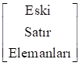-X

Yöntemin uygulanışını aşağıdaki örnek problem üzerinde gösterelim.

***Örnek 4.2***: Bir sanayii işletmesi bakır, alüminyum ve çinko
metallerinin farklı alaşımlarını kullanarak A ve B gibi iki çeşit ürün
üretmektedir. İşletmenin elinde 20 ton bakır, 30 ton alümin­yum ve 40
ton çinko vardır. Bir birim A ve bir birim B’nin üreti­minde kullanılan
bakır, alüminyum ve çinko miktarları (­ton) ile A ve B’nin bir
biriminden elde edilen krlar (TL) aşa­ğıda­ki tabloda gösterilmiştir.

Bu bilgileri ve tablodaki verileri kullanarak problemin doğ­rusal­
programlama mod­e­lini kurunuz ve işletmenin krını en büyük­leyen üretim
miktarlarını simpleks yöntemle bulunuz.

|      |          |           |       |     |
|------|----------|-----------|-------|-----|
|      | Hammadde |           |       |     |
| Ürün | Bakır    | Alüminyum | Çinko | Kr  |
| A    | 6        | 3         | 1     | 2   |
| B    | 4        | 1         | 1     | 3   |

***Çözüm 4.2***: Problemin doğrusal programlama modeli aşağıda
gösterilmiştir.

Zenb = 2X1 + 3X2

6X1 + 4X2 ≤ 20 (Bakır kısıtı)

3X1 + X2 ≤ 30 (Alüminyum kısıtı)

X1 + X2 ≤ 40 (Çinko kısıtı)

X1, X2 ≥ 0

Simpleks yöntemle çözüm için öncelikle problem standart biçimde
yazılmalıdır. Eşit­sizliklerin tümü (≤) işaretli olduğun­dan, her bir
eşitsizliğin sol tarafına bir aylak değişken eklen­mesiyle standart
biçim aşağıd­aki gibi olur.

Zenb = 2X1 + 3X2 + 0X3 +
0X4 + 0X5

6X1 + 4X2 + X3 + 0X4 +
0X5 = 20

3X1 + X2 + 0X3 + X4 +
0X5 = 30

X1 + X2 + 0X3 + 0X4 +
X5 = 40

X1, X2, X3, X4,
X5 ≥ 0

Görüldüğü gibi, başlangıç tablosunun gerektirdiği bütün bilgiler elde
edilmiştir. Standart biçim kapsamındaki tüm bilgilerin simpleks
tablosuna yerleş­tirilmesiyle başlangıç tablosu aşağıdaki gibi
oluşurulur.

***Tablo 4.2***

***Simpleks Başlangıç Çözüm Tablosu***

|                               |               |               |               |               |               |     |             |
|-------------------------------|---------------|---------------|---------------|---------------|---------------|-----|-------------|
| TDV                           | X1 | X2 | X3 | X4 | X5 | ÇV  | <u>Oran</u> |
| 0 X3               | 6             | **4**         | 1             | 0             | 0             | 20  | 20/4        |
| 0 X4               | 3             | 1             | 0             | 1             | 0             | 30  | 30/1        |
| 0 X5               | 1             | 1             | 0             | 0             | 1             | 40  | 40/1        |
| Zj                 | 0             | 0             | 0             | 0             | 0             | 0   |             |
| Zj - Cj | -2            | -3            | 0             | 0             | 0             | \-  |             |

Zj satır elemanları, bulundukları sütundaki katsayılar­la
temel değişkenlerin amaç fonksiyonu katsayılarının karşı­lıklı
çarpımlarının toplamı olarak aşağıdaki gibi hesaplan­mıştır.

Z1 = 0(6) + 0(3) + 0(1) = 0

Z2 = 0(4) + 0(1) + 0(1) = 0

Z3 = 0(1) + 0(0) + 0(0) = 0

Z4 = 0(0) + 0(1) + 0(0) = 0

Z5 = 0(0) + 0(0) + 0(1) = 0

Z6 = 0(20) + 0(30) + 0(40) = 0

Yukarıdaki Zj değerlerinin kullanılmasıyla Zj -
Cj değerleri aşağıdaki gibi bulunur.

Z1 - C1 = 0 - 2 = -2

Z2 - C2 = 0 - 3 = -3

Z3 - C3 = 0 - 0 = 0

Z4 - C4 = 0 - 0 = 0

Z5 - C5 = 0 - 0 = 0

Başlangıç tablosunun düzenlenmesinden sonra Zj -
Cj satı­rının gözden geçirilmeli, tüm Zj -
Cj ≥ 0 ise (problem en büyükleme amaçlı olduğund­an),
tablodaki çözümün en iyi olduğu kararlaştırılmalıdır. Tablo 4.2’den
görüldüğü gibi, Z1 - C1, Z2 -
C2 negatif olduğundan, başlangıçtaki temel uygun çözüm en iyi
değil­dir. Temele giren değişken ölçütüne göre enb(,) = Z2 -
C2 olduğundan, anahtar sütun X2 değişken
sütunudur. X2 yeni çözüm tablosunda temel değişken olarak
kar­şımıza çıkacaktır.

Anahtar satırı belirlemek için çözüm vektörü sütun elemanlarını bire bir
olmak koşuluy­la anahtar sütun elemanlarına bölelim. Bölme işlemi ile
bulu­nan değerler, başlangıç tablosunun hemen sağında oran başlığı
altında gösterilmiştir. En küçük oran X3’e ait olduğundan,
X3’ün te­melden ayrılması gerektiğine karar verilir. Buna
göre, yeni simp­leks tablosundaki temel değişkenler sırasıy­la
X2 (X3’ün yerine), X4 ve X5
olacaktır.

X3 değişken satırı anahtar satır, X2 değişken
sütunu anahtar sütun olduğuna göre anahtar sayı 4
olur([7]).

Anahtar sayının belir­len­mesinden sonra anahtar satır eleman­ları
anahtar sayıya bölün­meli ve anahtar satırın yeni elemanları
hesaplanmalıdır. ­Bu işlemler aşağıda topluca verilmiştir.

Anahtar satırın eski elemanları,

olduğuna göre anahtar satırın yeni elemanları,

veya gerekli aritmetik işlemlerin yapılmasıyla aşağıdaki gibi olur.

Bu değerlerin yeni çözüm tablosuna yerleştirilmesinden sonra tablonun
diğer elemanları hesaplanabilir.

X4 değişken satırından başlayarak diğer satır elemanlarını
hesaplayalım. X4 değişken satırının eski elemanları aşağıda
gösterildiği gibidir.

Bu satırla anahtar sütunun kesiştiği yerdeki sayı 1 ve anahtar satırın
yeni elemanları,

olduğuna göre, X4 değişken satırının yeni elemanları,

\[3 1 0 1 0 30\]

(-1)

\[3/2 0 -1/4 1 0 25\]

olarak hesaplanır.

Aynı yaklaşımla X5 değişken satırının yeni elemanlarının,

|           |     |     |     |     |      |
|-----------|-----|-----|-----|-----|------|
| \[1       | 1   | 0   | 0   | 1   | 40\] |
| (-1)\[3/2 | 1   | 1/4 | 0   | 0   | 5\]  |

\[-1/2 0 -1/4 0 1 35\]

olarak hesaplanacakları bellidir.

Zj satır elemanları aşağıdaki gibi hesaplanmıştır.

Z1 = 3(3/2) + 0(3/2) + 0(-1/2) = 9/2

Z2 = 3(1) + 0(0) + 0(0) = 3

Z3 = 3(1/4) + 0(-1/4) + 0(-1/4) = 3/4

Z4 = 3(0) + 0(1) + 0(0) = 0

Z5 = 3(0) + 0(0) + 0(1) = 0

Z6 = 3(5) + 0(25) + 0(35) = 15

Zj - Cj satır elemanları Zj
değerlerinden ilgili Cj değerleri­nin çıkartılmasıyla,

Z1 - C1 = (9/2) - 2 = 5/2

Z2 - C2 = 3 - 3 = 0

Z3 - C3 = (3/4) - 0 = 3/4

Z4 - C4 = 0 - 0 = 0

Z5 - C5 = 0 - 0 = 0

olarak hesaplanmıştır.

Elde edilen bu değerlerin simpleks çözüm tablosuna yerleş­tirilmesiyle
birinci simp­leks çözüm tablosu aşağıdaki gibi düzenlenir.

***Tablo 4.3***

***Simpleks Birinci (En İyi) Çözüm Tablosu***

|                               |               |               |               |               |               |     |
|-------------------------------|---------------|---------------|---------------|---------------|---------------|-----|
| TDV                           | X1 | X2 | X3 | X4 | X5 | ÇV  |
| 3 X2               | 3/2           | 1             | 1/4           | 0             | 0             | 5   |
| 0 X4               | 3/2           | 0             | -1/4          | 1             | 0             | 25  |
| 0 X5               | -1/2          | 0             | -1/4          | 0             | 1             | 35  |
| Zj                 | 9/2           | 3             | 3/4           | 0             | 0             | 15  |
| Zj - Cj | 5/2           | 0             | 3/4           | 0             | 0             | \-  |

Tablo 4.3’den görüldüğü gibi tüm Zj - Cj ≥ 0
olduğundan, yürürlükteki çözüm en iyidir. Temelde bulunmayan
değişke­nlerin amaç fonksiyonuna katkıları nega­tif olduğundan, temelde
gerçekleştirilecek bir değişik­lik Z’nin azalmasına yol açacaktır. Bu
durumda Z = 15, amaç fonk­siyonu için bulunabilecek en ­büyük değer­dir.
Bu çözümde X1 = 0, X2 = 5, X3 = 0,
X4 = 25, X5 = 35’dir. Bu durumda, işletme B’den 5
birim üretirken A’dan hiç üretmeyecek­, böylece en yüksek kârı 15 TL
olacaktır.

Aylak değişkenlerin en iyi çözümdeki değerleri X3 = 0,
X4 = 25, X5 = 35’dir.

Bilindiği gibi, eşitsizliklerin sağ tarafl­arı kullanılabil­ir kaynak
miktarlarını gösterirken, sol tarafla­rı kullanılan kaynak miktarları­nı
göstermektedir. Bu durumda, bu ikisi arasındaki fark kullanılm­ayan
kaynak miktarına karşılık gelir.

Buna göre, bakırın tamamının kullanıldığı anlaşılır. Nitekim,
X1 ve X2’nin en iyi çözümdeki değerleri bakır
kısıtına yerleştirildiğinde 6X1 + 4X2 = 6(0) +
4(5) = 20 olarak elde edilecektir.

Öte yandan, alüminyum ve çinkonun tamamının kullanılmasının gerekmediği,
üretim işleminin 25 ton alüminyum ve 35 ton çinkonun kullanılm­asına
gerek kalmadan tamamlandığı görülebilir. Aylak değişkenlerin
Zj - Cj değerleri incelendiğinde, 1 ton bakırın
kullanımından vazgeçilmesi durumunda krdaki azalma­nın (Z3 -
C3) 3/4 TL, 1 ton alüminyum ve 1 ton çinkonun
kulla­nımlarından vazgeçilmesi ­durumunda krdaki azalmaların sırasıyla,
Z4 - C4 = 0 ve Z5 - C5 = 0
olacağı görülebilir.

Amaç fonksiyonunun Zenb ve tüm kısıtla­yıcıl­arı­n (≤)
biçiminde formüllendiği doğrusal programla­ma problem­lerinin simpleks
yönte­mle çözülmes­ine son bir örnek olmak üzere aşağıdaki prob­lemi ele
alalım.

***Örnek 4.3***: Aşağıdaki doğrusal programlama problemini simp­leks
yöntemle çözünüz.

Zenb = 10X1 + 22X2 + 18X3

X1 + 4X2 + 3X3 ≤ 24

2X1 + 2X2 + 4X3 ≤ 46

3X1 + 5X2 + 6X3 ≤   60

4X1 + 8X2 + 3X3 ≤ 120

X1, X2, X3 ≥ 0

***Çözüm 4.3***: Problemin standart biçimi aşağıda gösterilmiştir.

Zenb = 10X1 + 22X2 + 18X3 +
0X4 + 0X5 + 0X6 + 0X7

X1 + 4X2 + 3X3 + X4 +
0X5 + 0X6 + 0X7 = 24

2X1 + 2X2 + 4X3 + 0X4 +
X5 + 0X6 + 0X7 = 46

3X1 + 5X2 + 6X3 + 0X4 +
0X5 + X6 + 0X7 = 60

4X1 + 8X2 + 3X3 + 0X4 +
0X5 + 0X6 + X7 = 120

X1, X2, X3, X4,
X5, X6, X7 ≥ 0

Problemin simpleks başlangıç çözüm tablosu şöyledir.

***Tablo 4.4***

***Simpleks Başlangıç Çözüm Tablosu***

|                               |               |               |               |               |               |               |               |     |             |
|-------------------------------|---------------|---------------|---------------|---------------|---------------|---------------|---------------|-----|-------------|
| TDV                           | X1 | X2 | X3 | X4 | X5 | X6 | X7 | ÇV  | <u>Oran</u> |
| 0 X4               | 1             | **4**         | 3             | 1             | 0             | 0             | 0             | 24  | 24/4 = 6    |
| 0 X5               | 2             | 2             | 4             | 0             | 1             | 0             | 0             | 46  | 46/2 = 23   |
| 0 X6               | 3             | 5             | 6             | 0             | 0             | 1             | 0             | 60  | 60/5 = 12   |
| 0 X7               | 4             | 8             | 3             | 0             | 0             | 0             | 1             | 120 | 120/8 = 15  |
| Zj                 | 0             | 0             | 0             | 0             | 0             | 0             | 0             | 0   |             |
| Zj - Cj | -10           | -22           | -18           | 0             | 0             | 0             | 0             | \-  |             |

Tablo 4.4’den görüldüğü gibi tüm Zj - Cj ≥ 0
olmadığından başlangıçtaki temel uygun çözüm en iyi değildir.

Enb () = 22 olduğundan X2’nin bulunduğu sütun anahtar
sütundur. Anahtar satırı belirlemek için çözüm vektörü­ elemanlarını
anahtar sütunun karşılıklı eleman­ları­na oranlayarak en küçük oranı
bulalım. Başlangıç çözüm tablo­sunun sağ tarafında gösterilen oranlar
incelendiğinde, en küçük oranın 6 olduğu ve X4’ün bulunduğu
satır için hesaplandığı görülebilir. Buna göre, anahtar satır
X4 değişken satırı, anahtar sayı 4 olacaktır. Anahtar sayının
belir­lenmesinden sonra anahtar satır eleman­ları­nın anahtar sayıya
bölünmesi ve anahtar satırın yeni eleman­ları­nın hesaplanması gerekir.
Bu işlem aşağıda gösterilmiş­tir.­ ­

Anahtar satır:

|     |     |     |     |     |     |     |      |
|-----|-----|-----|-----|-----|-----|-----|------|
| \[1 | 4   | 3   | 1   | 0   | 0   | 0   | 24\] |

olduğuna göre, anahtar satırın yeni elemanları,

|       |     |     |     |     |     |     |        |
|-------|-----|-----|-----|-----|-----|-----|--------|
| \[1/4 | 4/4 | 3/4 | 1/4 | 0/4 | 0/4 | 0/4 | 24/4\] |

veya gerekli aritmetik işlemlerin yapılmasıyla aşağıdaki gibi bulunur.

|       |     |     |     |     |     |     |     |
|-------|-----|-----|-----|-----|-----|-----|-----|
| \[1/4 | 1   | 3/4 | 1/4 | 0   | 0   | 0   | 6\] |

Bu değerlerin yeni çözüm tablo­suna yerleştirilmesinden sonra bu
tablonun diğer elemanları hesaplanabilir.

X5 değişken satırından başlaya­rak diğer satır elemanlarını
hesaplayalım. Söz konusu değerler aşağıdaki gibi bulunur.

X5 değişken satırının yeni elemanlarının hesaplanması:

|           |     |     |     |     |     |     |      |
|-----------|-----|-----|-----|-----|-----|-----|------|
| \[2       | 2   | 4   | 0   | 1   | 0   | 0   | 46\] |
| (-2)\[1/4 | 1   | 3/4 | 1/4 | 0   | 0   | 0   | 6\]  |

\[3/2 0 5/2 -1/2 1 0 0 34\]

X6 değişken satırının yeni elemanlarının hesaplanması:

|           |     |     |     |     |     |     |      |
|-----------|-----|-----|-----|-----|-----|-----|------|
| \[3       | 5   | 6   | 0   | 0   | 1   | 0   | 60\] |
| (-5)\[1/4 | 1   | 3/4 | 1/4 | 0   | 0   | 0   | 6\]  |

\[7/4 0 9/4 -5/4 0 1 0 30 \]

X7 değişken satırının yeni elemanlarının hesaplanması:

|           |     |     |     |     |     |     |       |
|-----------|-----|-----|-----|-----|-----|-----|-------|
| \[4       | 8   | 3   | 0   | 0   | 0   | 1   | 120\] |
| (-8)\[1/4 | 1   | 3/4 | 1/4 | 0   | 0   | 0   | 6\]   |

\[2 0 -3 -2 0 0 1 72 \]

Zj değerleri,

Z1 = 22(1/4) + 0(3/2) + 0(7/4) + 0(2) = 11/2

Z2 = 22(1) + 0(0) + 0(0) + 0(0) = 22

Z3 = 22(3/4) + 0(5/2) + 0(9/4) + 0(-3) = 33/2

Z4 = 22(1/4) + 0(-1/2) + 0(-5/4) + 0(-2) = 11/2

Z5 = 22(0) + 0(1) + 0(0) + 0(0) = 0

Z6 = 22(0) + 0(0) + 0(1) + 0(0) = 0

Z7 = 22(0) + 0(0) + 0(0) + 0(1) = 0

Z8 = 22(6) + 0(34) + 0(30) + 0(72) = 132

olarak hesaplanmışlardır.

Zj - Cj değerlerinin hesaplanmasıyla ilgili tüm
işlemler aşağıda topluca gösterilmiştir.

Z1 - C1 = 11/2 - 10 = -9/2

Z2 - C2 = 22 - 22 = 0

Z3 - C3 = 33/2 - 18 = -3/2

Z4 - C4 = 11/2 - 0 = 11/2

Z5 - C5 = Z6 - C6 =
Z7 - C7 = 0 - 0 = 0

Zj ve Zj – Cj için hesaplanan yeni
değerlerle oluşturulan simpleks çözüm tablosu aşağıd­a gösterilmiştir.

***Tablo 4.5***

***Simpleks Birinci Çözüm Tablosu***

|                               |               |               |               |               |               |               |               |     |                  |
|-------------------------------|---------------|---------------|---------------|---------------|---------------|---------------|---------------|-----|------------------|
| TDV                           | X1 | X2 | X3 | X4 | X5 | X6 | X7 | ÇV  | <u>Oran</u>      |
| 22 X2              | 1/4           | 1             | 3/4           | 1/4           | 0             | 0             | 0             | 6   | 6/(1/4) = 24.00  |
| 0 X5               | 3/2           | 0             | 5/2           | -1/2          | 1             | 0             | 0             | 34  | 34/(3/2) = 22.33 |
| 0 X6               | **7/4**       | 0             | 9/4           | -5/4          | 0             | 1             | 0             | 30  | 30/(7/4) = 17.11 |
| 0 X7               | 2             | 0             | -3            | -2            | 0             | 0             | 1             | 72  |                  |
| Zj                 | 11/2          | 22            | 33/2          | 11/2          | 0             | 0             | 0             | 132 |                  |
| Zj - Cj | -9/2          | 0             | -3/2          | 11/2          | 0             | 0             | 0             | \-  | \-               |

Z1 - C1 = -9/2, Z3 - C3 =
-3/2 ≤ 0 olduğundan çözüm en iyi değildir. Birinci tablo­nun
hazırlanmasında yapılan işlemlerin tekrarlanması ve yeni bir tablonun
hazır­lanması gerekmektedir. 9/2 ≥ 3/2 olduğundan X1 temele
alınarak, en küçük oranlı X6 temel olmayan değişken konumuna
getirilir. Anahtar sütun X1 değişken sütunu, anahtar satır
X6 değişken satırı olduğundan anahtar sayı 7/4 olur. Anahtar
işlemlerin uygulanmasıyla oluşturulan yeni çözüm tablosu aşağıda
gösterilmiştir.

***Tablo 4.6***

***Simpleks İkinci (En iyi) Çözüm Tablosu***

|                               |               |               |               |               |               |               |               |        |
|-------------------------------|---------------|---------------|---------------|---------------|---------------|---------------|---------------|--------|
| TDV                           | X1 | X2 | X3 | X4 | X5 | X6 | X7 | ÇV     |
| 22 X2              | 0             | 1             | 3/7           | 3/7           | 0             | -1/7          | 0             | 12/7   |
| 0 X5               | 0             | 0             | 4/7           | 4/7           | 1             | -6/7          | 0             | 58/7   |
| 10 X1              | 1             | 0             | 9/7           | -5/7          | 0             | 4/7           | 0             | 120/7  |
| 0 X7               | 0             | 0             | -39/7         | -4/7          | 0             | -8/7          | 1             | 264/7  |
| Zj                 | 10            | 22            | 156/7         | 16/7          | 0             | 18/7          | 0             | 1464/7 |
| Zj - Cj | 0             | 0             | 30/7          | 16/7          | 0             | 18/7          | 0             | \-     |

Tablodan görüldüğü gibi tüm Zj - Cj ≥ 0
olduğundan, tablodaki temel uygun çözüm en iyidir. En iyi olduğu
belirlenen bu çözümde; X1 = 120/7, X2 = 12/7,
X3 = 0, X4 = 0, X5 = 58/7,
X6 = 0 ve X7 = 264/7’dir. Birinci tekrarda 132
olarak hesapla­nan Z değeri, bu tekrarda 1464/7 (= 209.42) olarak
hesaplan­mış olup 209.42, Z için bulunabilecek en büyük değerdir.

Buraya kadar, simpleks yöntemin tüm kısıtlayıcı fonksiyonla­rı (≤)
biçiminde olan en büyükleme problemlerine uygulanışı üzerinde durduk.
Kısıtlayıcı fonksiyonların (≥) veya (=) biçiminde olması durumunda
simpleks yöntem nasıl uygula­na­cak­tır?

Tüm kısıtlayıcıların (≥) işaretli oldu­ğunu ve problemin aşağıdaki gibi
modellendiğini düşünelim.

Zenb = C1X1 +
C2X2 + ... + CnXn

a11X1 + a12X2 + ... +
a1nXn ≥ b1

a21X1 + a22X2 + … +
a2nXn ≥ b2

. . ... . .

am1X1 + am2X2 + ... +
amnXn ≥ bm

X1 ≥ 0, X2 ≥ 0, ..., Xn ≥ 0

Bilindiği gibi (≥) biçimindeki bir fonksiyon sol tarafından negatif
olmayan bir artık değişken çıkartılmasıyla eşitlik biçimine
dönüştürülür. Artık değişkenlerin mo­dele sokulmasıyla kısıtla­yıcı
fonksiyon­lar aşağıdaki gibi olur.

a11X1 + a12X2 + ... +
a1nXn - Xn+1 + 0Xn+2 + ... +
0Xn+m = b1

a21X1 + a22X2 + ... +
a2nXn + 0Xn+1 - Xn+2 + ... +
0Xn+m = b2

. . ... . . . ... . .

am1X1 + am2X2 + ... +
amnXn + 0Xn+1 + 0Xn+2 + ...
- Xn+m = bm

Artık değişkenler negatif olmadığın­dan, bu modelin negatif olmama
koşulu,

X1, X2, ..., Xn, Xn+1,
Xn+2, ..., Xn+m ≥ 0

olarak düzenlenir.

Standart biçimin kısıtlayıcı fonksi­yonları matrislerle şöyle
gösterilir.

Kısıtlayıcı fonksiyonların değişken katsayıların­dan oluşan m X (n + m)
matrisin son m sütununun negatif birim matris oluşturduğu kolayca
görülebilir. Böylece eşitlik sistemi­nin X1 = X2 =
...= Xn = 0 uç noktasındaki başlangıç temel çözümü,
Xn+1 = -b1, Xn+2 = -b2, …,
Xn+m = -bm olarak belirlenir. Negatif olmayan
artık değişkenler için negatif değerle­r bulunması, bu temel çözümün
uygun olmadığına işaret eder. Bu nedenle, negatif olmama koşu­lunu
gerçekleyen diğer bir başlangıç çözümünün araştırılması zo­run­ludur.
Başlangıç çözümünü araştırma­nın yolu, önceden olduğu gibi katsayılar
matrisi yanında bir birim matris oluşturmaktır. Birim matris oluşturmak
için ar­tık değişkenlerle eşitlik biçimine dönüştürülen kısıtlayıcı
fonk­siyon­lara negatif olmayan birer *yapay değişken* ekle­nir. Yapay
değişkenlerin hiçbir fiziki yorumu yoktur, bunlar yalnızca bir başlangıç
uygun çözüme ulaşmak amacıyla, (≥) işaretli kısıtlayıcılara eklenen
değiş­kenlerdir. Bu değiş­kenler Ai (i = 1, 2, ..., m) ile
gösterildiğinde, kısıtla­yıcılar aşağıdaki gibi elde edilir
([8]).

a11X1 + a12X2 + ... +
a1nXn - Xn+1 + A1 =
b1

a21X1 + a22X2 + ... +
a2nXn - Xn+2 + A2 =
b2

. . ... . . . . … . .

am1X1 + am2X2 + ... +
amnXn . . . . … - Xn+m + Am
= bm

Tüm değişkenler negatif olmadığından, negatif olmama koşulu şöyle olur.

X1, X2, ..., Xn, Xn+1,
Xn+2, ..., Xn+m, A1, A2,
..., Am ≥ 0

Yapay değişkenlerin eklenmesiyle kısıtlayıcı fonksiyonlara ilişkin
kat­sayılar matrisi şöyle gösteri­lir.

Kısıtlayıcı fonksiyon katsayıların­dan oluşan matrisin son m sütununun
bir birim matris oluşturdu­ğu görüle­bilir.

X1 = 0, X2 = 0, ..., Xn = 0,
Xn+1 = 0, Xn+2 = 0, ..., Xn+m = 0

olduğun­da, söz konusu kısıtlayı­cılar aşağıdaki başlangıç temel çözümü
verir.

A1 = b1, A2 = b2, …,
Am = bm

Bilindiği gibi aylak ve artık değişkenlerin amaç fonksiyonundaki
katsayı­ları sıfırdır. Yapay değişkenler için du­rum farklıdır. Yukarıda
belirtildiği gibi, ilk temel uygun çözümün bulunmasına yardımcı
olmalarına karşın hiçbir fiziki ve ekonomik anlamı olmayan bu yapay
değişken­lerin en iyi çözüme girmeleri engellenmelidir. Bunu sağlamak
için yapay değişkenlerin amaç fonksiyonundaki katsayılarının çok büyük
olduğu düşünülür.

Büyük değerli katsayılar genellikle M ile gösterildiğinden, uygulanacak
simpleks yöntemi *büyük M* *yön­temi* olarak adlandırılır. Bu yönteme
*Charnes’in M yöntemi* de denilmektedir. Büyük M yöntemi, yalnızca en
büyük­leme problemlerine değil en küçükleme prob­lemlerine de uygulanır.
En büyükleme prob­lem­lerinde M mutlak değerce çok büyük bir negatif
sayı olarak alınır. Böylece, temelde pozitif değerli bir yapay değişken
kaldığında, amaç fonksiyonu değerinin arttırılması mümkün olmaz. Bu
yolla yapay değişkenlerin çözüme girmeleri engellenir. Problem en
küçükleme problemi olduğun­da, yapay değişkenlerin amaç fonksiyonundaki
katsayıları çok büyük pozitif sayılar olarak alınır. Böylece, en
büyükleme durumunda olduğu gibi yapay değiş­kenlerin en iyi çözümün
temeline girmeleri engellenir([9]).

Kısıtlayıcı fonksiyonlarının tümü (≥) işaretli olan bir doğrusal
programlama probleminin büyük M yöntemiyle çözümü aşağıdaki örnek
problemde açıklanmıştır.

***Örnek 4.4***: Aşağıdaki doğrusal programlama problemini simpleks
yöntemle çözünüz.

Zenb = -2X1 - 3X2 - X3

X1 + 4X2 + 2X3 ≥ 8

3X1 + 2X2 + X3 ≥ 6

X1, X2, X3 ≥ 0

***Çözüm 4.4***: Simpleks yöntemle çözüm yapabilmek için önce
eşitsizlikleri eşitlik biçiminde yaza­lım. Her bir kısıtlayıcı
fonksiyona bi­rer yapay değişken eklenir, aynı kısıtlayıcılardan birer
artık değişken çıkartılırsa örnek problemin modeli simpleks yöntem için
uygun biçime dönüştürülmüş olur([10]).

Zenb = -2X1 - 3X2 - X3 +
0X4 + 0X5 - MA1 - MA2

X1 + 4X2 + 2X3 - X4 +
A1 = 8

3X1 + 2X2 + X3 - X5 +
A2 = 6

X1, X2, X3, X4,
X5, A1, A2 ≥ 0

Standart biçimdeki bilgilerin kullanılmasıyla oluşturulan tablo aşağıda
gösterilmiştir.

***Tablo 4.7***

***Simpleks Başlangıç Çözüm Tablosu***

|                               |               |               |               |               |               |               |               |      |             |
|-------------------------------|---------------|---------------|---------------|---------------|---------------|---------------|---------------|------|-------------|
| TDV                           | X1 | X2 | X3 | X4 | X5 | A1 | A2 | ÇV   | <u>Oran</u> |
| -M A1              | 1             | **4**         | 2             | -1            | 0             | 1             | 0             | 8    | 8/4 = 2     |
| -M A2              | 3             | 2             | 1             | 0             | -1            | 0             | 1             | 6    | 6/2 = 3     |
| Zj                 | -4M           | -6M           | -3M           | M             | M             | M             | M             | -14M |             |
| Zj - Cj | -4M+2         | -6M+3         | -3M+1         | M             | M             | 0             | 0             | \-   |             |

Bu kez başlangıç tablosundaki Zj değerlerinin, önceki iki
örnek problemin başlangıç tablolarındaki Zj değerlerinden
farklı olarak sıfır olmadığına dikkat edilmelidir. Bunun nedeni
başlangıçtaki temel değişken­lerinin amaç fonksiyonu katsayılarının
sıfırdan farklı olmasıdır. Buna göre Zj değerleri aşağıdaki
gibi hesaplanır.

Z1 = (-M)(1) + (-M)(3) = -4M

Z2 = (-M)(4) + (-M)(2) = -6M

Z3 = (-M)(2) + (-M)(1) = -3M

Z4 = (-M)(-1) + (-M)(0) = M

Z5 = (-M)(0) + (-M)(-1) = M

Z6 = (-M)(1) + (-M)(0) = -M

Z7 = (-M)(0) + (-M)(1) = -M

Z8 = (-M)(8) + (-M)(6) = -14M

Zj değerlerinden o sütunlarla il­gili değişkenlerin amaç
fonksiyonun­daki katsayılarının çıkartılmasıyla,

Z1 - C1 = (-4M) - (-2) = -4M + 2

Z2 - C2 = (-6M) - (-3) = -6M + 3

Z3 - C3 = (-3M) - (-1) = -3M + 1

Z4 - C4 = M - (0) = M

Z5 - C5 = M - (0) = M

Z6 - C6 = (-M) - (-M) = 0

Z7 - C7 = (-M) - (-M) = 0

olarak hesaplanmıştır.

Yukarıdaki işlemlerin tamamlanıp başlangıç tablosunun düzenlenmesinden
sonra, çözümden çıkacak ve çözüme girecek değiş­kenler belirlenir.

M çok büyük bir sayı olarak tanım­landığından, Zj -
Cj satırındaki mutlak değerce en büyük nega­tif sayı
(-6M+3)’dür. O halde, X2 değişken sütunu anahtar sütun
olacak, yani X2 bir sonraki tabloda temel değişken olarak
işlem görecektir.

Çözümden çıkacak değişken, önceden olduğu gibi, oranların
hesaplanmasıy­la belir­lenir. Başlangıç tablosunun sağ tarafındaki
oranlar incelendiğinde, en küçük olanın A1 değişken satırı
için hesaplandığı görülebilir. O halde, A1 çözümden çıkacak
yerine X2 girecektir.

Anahtar sayının 4 olduğunun be­lirlenmesinden sonra gerçekleştirilen
anahtar işlemlerle yeni çözüm tablosu aşağıdaki gibi olur.

Tablo 4.8’den görüldüğü gibi, Tablo 4.7’deki başlangıç çözümünde
(-14M)’e eşit olan Z değeri bu çözümde (-2M-6)’ya yükselmiş­tir. Birinci
çözümün verildiği Tablo 4.8’in son satırı incelendiğinde, bu değerin
daha da artacağı görülebilir. Zira, en iyi çözüme ulaşılıp
ulaşılmadığının araştırılmasında kullanılan son satırda hala negatif
değerler var­dır.

***Tablo 4.8***

***Simpleks Birinci Çözüm Tablosu***

|                               |               |               |               |               |               |               |               |       |
|-------------------------------|---------------|---------------|---------------|---------------|---------------|---------------|---------------|-------|
| TDV                           | X1 | X2 | X3 | X4 | X5 | A1 | A2 | ÇV    |
| -3 X2              | 1/4           | 1             | 1/2           | -1/4          | 0             | 1/4           | 0             | 2     |
| -M A2              | **5/2**       | 0             | 0             | 1/2           | -1            | -1/2          | 1             | 2     |
| Zj                 |               | -3            | -3/2          |               | M             |               | -M            | -2M-6 |
| Zj - Cj |               | 0             | -1/2          |               | M             |               | 0             | \-    |

Mutlak değerce en büyük negatif değer \[(5 - 10M)/4\] olduğun­dan,
X1 ikinci simpleks tabloda temel değişken olarak işlem
görecek­tir. Oranlar birinci satır için 8, ikinci satır için (4/5)
olarak hesaplandığından, A2 temeli terkeden değişken olur.
Anahtar sayının (5/2) olduğunun belirlenmesinden sonra simpleks yöntemin
standart işlemleriyle yeni çözüm tablosu aşağıdaki gibi olur.

##### Tablo 4.9

##### Simpleks İkinci Çözüm Tablosu

|                               |               |               |               |               |               |               |               |     |
|-------------------------------|---------------|---------------|---------------|---------------|---------------|---------------|---------------|-----|
| TDV                           | X1 | X2 | X3 | X4 | X5 | A1 | A2 | ÇV  |
| -3 X2              | 0             | 1             | **1/2**       | -3/10         | 1/10          | 3/10          | -1/10         | 9/5 |
| -2 X1              | 1             | 0             | 0             | 1/5           | -2/5          | -1/5          | 2/5           | 4/5 |
| Zj                 | -2            | -3            | -3/2          | 1/2           | 1/2           | -1/2          | -1/2          | -7  |
| Zj - Cj | 0             | 0             | -1/2          | 1/2           | 1/2           |               |               | \-  |

Z3 - C3 ≤ 0 olduğundan, tablodaki çözüm en iyi
değildir. X3 temele alınarak en küçük oranlı X2
temelden çıkartılır. Anahtar sayının 1/2 olduğunun belirlen­mesinden
sonra standart işlemler uygulanır. Elementer satır işlemlerinin
gerçekleştirilmesiyle ulaşılan yeni çözüm tablosu aşağıda verilmiştir.

##### Tablo 4.10

***Simpleks Üçüncü (En iyi) Çözüm Tablosu***

|                               |               |               |               |               |               |               |               |       |
|-------------------------------|---------------|---------------|---------------|---------------|---------------|---------------|---------------|-------|
| TDV                           | X1 | X2 | X3 | X4 | X5 | A1 | A2 | ÇV    |
| -1 X3              | 0             | 2             | 1             | -3/5          | 1/5           | 3/5           | -1/5          | 18/5  |
| -2 X1              | 1             | 0             | 0             | 1/5           | -2/5          | -1/5          | 2/5           | 4/5   |
| Zj                 | -2            | -2            | -1            | 1/5           | 3/5           | -1/5          | -3/5          | -26/5 |
| Zj - Cj | 0             | 1             | 0             | 1/5           | 3/5           |               |               | \-    |

Tablo 4.10’daki temel uygun çözümde tüm Zj - Cj ≥
0 olduğundan çözüm en iyidir. Bu çözümde, X1 = 4/5,
X2 = 0, X3 = 18/5, X4 = 0,
X5 = 0, A1 = 0, A2 = 0 olarak
belirlenmiştir. Amaç fonksiyonunun en büyük değeri Zenb =
-26/5’dir.

Buraya kadar kısıtlayıcı fonksiyonlarının tamamı ya (≤) veya (≥)
işaretli olan problemler üzerinde durulmuştur. Oysa kısıtlayıcı
fonksiyonlardan bir ya da bir kaçı veya hepsi (=) biçiminde olabilir.
Kısıtlayıcılar (=) biçiminde olduğundan, aylak değişken eklenmesi
gerekmeyecek dolayısıyla, modelin dönüştürülmüş biçimi aynı kalacaktır.
Kısıtlayıcılar aylak değişkene sahip olmadığı için de başlangıç temel
uygun çözüme ulaşılamayacaktır. Bu sorunu ortadan kaldır­mak, yani birim
matris oluşturmak amacıyla eşitlik biçimindeki kısıtlayıcı
fonksiyonla­rın sol tarafla­rına (+1) katsayılı yapay değişkenler
eklenir. Ya­pay değiş­kenle­rin amaç fonksiyonun­daki katsayıları
önceden açıklandı­ğı gibi, en büyükleme problemle­rinde çok büyük bir
negatif sayı (-M), en küçükleme problemlerinde çok büyük bir pozitif
sayıdır (M). Bu yolla, yapay değişkenlerin en iyi çözümün temeline
girmeleri engellenmiş olur.

İleride açıklanacağı gibi, en iyi çözümde yapay değişkenin bulunması
durumunda çözüm uygun değildir veya kısıtlayıcı fonksiyonlar çelişiktir
denir.

***Örnek 4.5***: Aşağıdaki doğrusal programlama problemini simpleks
yöntemle çözünüz.

Zenb = 21X1 + X2 + X3

2X1 + X2 + 4X3 = 20

X1 + 3X2 + 4X3 = 30

X1, X2, X3 ≥ 0

***Çözüm 4.5***: Kısıtlayıcılar eşitlik biçiminde olduğundan, her birine
(+1) katsayılı yapay değişken eklenmesi gerekir. Bu yolla elde edilen
model aşağıda gösterilm­iştir.

Zenb = 21X1 + X2 + X3 -
MA1 - MA2

2X1 + X2 + 4X3 + A1 = 20

X1 + 3X2 + 4X3 + A2 = 30

X1, X2, X3, A1,
A2 ≥ 0

Simpleks yöntemle çözüm yapabilmek için başlangıç tablo­sunu
düzenleyelim. Bu amaçla düzenlenen simpleks başlangıç çözüm tablosu
aşağıda gösterilmiştir.

***Tablo 4.11***

***Simpleks Başlangıç Çözüm Tablosu***

|                               |               |               |               |               |               |      |
|-------------------------------|---------------|---------------|---------------|---------------|---------------|------|
| TDV                           | X1 | X2 | X3 | A1 | A2 | ÇV   |
| -M A1              | 2             | 1             | **4**         | 1             | 0             | 20   |
| -M A2              | 1             | 3             | 4             | 0             | 1             | 30   |
| Zj                 | -3M           | -4M           | -8M           | -M            | -M            | -50M |
| Zj - Cj | -3M-21        | -4M-1         | -8M-1         | 0             | 0             | \-   |

Başlangıç tablosundaki Zj ve Zj - Cj
değerleri aşağıdaki gibi bulunur.

Z1 = (-M)(2) + (-M)(1) = -3M, Z1 - C1 =
-3M - 21

Z2 = (-M)(1) + (-M)(3) = -4M, Z2 - C2 =
-4M - 1

Z3 = (-M)(4) + (-M)(4) = -8M, Z3 - C3 =
-8M - 1

Z4 = (-M)(1) + (-M)(0) = -M, Z4 - C4 =
-M - (-M) = 0

Z5 = (-M)(0) + (-M)(1) = -M, Z5 - C5 =
-M - (-M) = 0

Z6 = (-M)(20) + (-M)(30) = -50M

Z1 - C1, Z2 - C2,
Z3 - C3 ≤ 0 olduğundan, başlangıçtaki temel uygun
çözüm en iyi değildir. M çok büyük bir sayı olarak tanımlandığından,
mutlak değerce en büyük negatif Zj - Cj =
Z3 - C3 = (-8M-1)’dir. Bu durumda X3’ün
bulunduğu sütun anahtar sütundur. En küçük değerli oran A1’e
ait olduğundan A1’in temeli terketmesi kararlaştırılır.
Anahtar sayının 4 olduğunun belirlenmesinden sonra elementer işlemlerle
elde edilen bigilerle oluşturulan yeni çözüm tablosu aşağıda
gösterilmiştir.

***Tablo 4.12***

***Simpleks Birinci Çözüm Tablosu***

|                               |               |               |               |               |               |        |
|-------------------------------|---------------|---------------|---------------|---------------|---------------|--------|
| TDV                           | X1 | X2 | X3 | A1 | A2 | ÇV     |
| 1 X3               | 1/2           | 1/4           | 1             | 1/4           | 0             | 5      |
| -M A2              | -1            | **2**         | 0             | -1            | 1             | 10     |
| Zj                 |               |               | 1             |               | -M            | -10M+5 |
| Zj - Cj |               |               | 0             |               | 0             | \-     |

Z2 - C2 ≤ 0 olduğundan Tablo 4.12’deki çözüm en
iyi değildir ve X2’nin temele alınması gerekir. Oranlar
incelendiğinde, çözümü terkedecek değişkenin A2 olduğu
görülür. Anahtar sayı 2’dir. Simpleks yöntemin standart işlemlerinin
uygulanmasıyla bulunan değerlerle oluşturulan yeni çözüm tablosu aşağıda
gösterilmiştir.

***Tablo 4.13***

***Simpleks İkinci Çözüm Tablosu***

|                               |               |               |               |               |               |      |
|-------------------------------|---------------|---------------|---------------|---------------|---------------|------|
| TDV                           | X1 | X2 | X3 | A1 | A2 | ÇV   |
| 1 X3               | **5/8**       | 0             | 1             | 3/8           | -1/8          | 15/4 |
| 1 X2               | -1/2          | 1             | 0             | -1/2          | 1/2           | 5    |
| Zj                 | 1/8           | 1             | 1             | -1/8          | 3/8           | 35/4 |
| Zj - Cj | -167/8        | 0             | 0             |               |               | \-   |

Z1 - C1 ≤ 0 olduğundan en iyi çözüme henüz
ulaşılamamıştır. X1 değişken sütununun anahtar sütun,
X3 değişken satırının anahtar satır, anahtar sayının 5/8
olduğunun belir­lenmesinden sonra belirlenen üçüncü çözüm tablosu
aşağıda gösterilmiştir.

***Tablo 4.14***

***Simpleks Üçüncü (En İyi) Çözüm Tablosu***

|                               |               |               |               |               |               |     |
|-------------------------------|---------------|---------------|---------------|---------------|---------------|-----|
| TDV                           | X1 | X2 | X3 | A1 | A2 | ÇV  |
| 21 X1              | 1             | 0             | 8/5           | 3/5           | -1/5          | 6   |
| 1 X2               | 0             | 1             | 4/5           | -1/5          | 2/5           | 8   |
| Zj                 | 21            | 1             | 172/5         | 62/5          | -19/5         | 134 |
| Zj - Cj | 0             | 0             | 167/2         |               |               | \-  |

Son satırın tüm elemanları ≥ 0 olduğundan, en iyi çözüm elde edilmiştir.
Bu en iyi çözümde, X1 = 6, X2 = 8, X3 =
X4 = X5 = 0 ve Zenb = 134’dür.

Şimdiye kadar simpleks yöntemi kısıtlayıcı fonksiyonları (≥), (≤) veya
(=) biçiminde olan en büyükleme problem­lerine uygula­dık ve açıkladık.
Oysa yöntem sadece en büyükleme problemlerine değil, en küçükleme
problemlerine de uygulanır.

Problem en küçükleme türünde olduğunda simpleks yöntem nasıl
uygulana­caktır? 4.2. kesimde açıklandığı gibi, herhangi bir en
büyükleme problemi en küçükleme problemine veya en küçükleme problemi en
büyükleme problemine dönüştürülebilir. Bu dönüştürme sonucunda
orijinalinde en küçükleme amaçlı olan doğrusal programlama problemi, en
büyükleme problemlerinin çözümün­de kullanılan ardışık işlemlerle
çözülebilir.

En küçükleme problemleri en iyilemenin anlamını değiştirmeksizin de
çözülebilir. Simpleks yöntemin en küçük­leme problemlerine uygula­nışı
ile en büyükleme problemlerine uygulanışı arasında çok büyük fark olduğu
söylenemez. Aralarındaki en önemli fark anahtar ­sütunun seçiminde
kullanılan ölçüttür. En küçükleme problemlerin­de, en büyük­leme
problemlerdekinin tersine en büyük pozitif Zj -
Cj’ye sahip değiş­ken temele girer. Problemin niteliği gereği
bütün Zj - Cj değerleri ≤ 0 olduğunda en iyi
çözüme ulaşılmış olur.

En küçükleme probleminin simpleks yöntem ile çözümü Örnek 4.6 üzerinde
açıklanacaktır.

***Örnek 4.6***: Aşağıdaki doğrusal programlama problemini simpleks
yöntemle çözünüz.

Zenk = 3X1 + 2X2 + X3

2X1 + 3X2 + X3 ≥ 21

X1 + X2 + X3 ≥ 12

X1, X2, X3 ≥ 0

***Çözüm 4.6***: Önceden olduğu gibi öncelikle problemin standart
biçimde yazılması gerekmektedir. Yukarıda yapılan açıklamalar
doğrultusunda eklenen ve çıkartılan değişkenlerle problemin standart
biçimi aşağıdaki gibi elde edilir.

Zenk = 3X1 + 2X2 + X3 +
0X4 + 0X5 + MA1 + MA2

2X1 + 3X2 + X3 - X4 +
A1 = 21

X1 + X2 + X3 - X5 +
A2 = 12

X1, X2, X3, X4,
X5, A1, A2 ≥ 0

Problemin standart biçimindeki bilgilerin kullanılmasıyla düzenlenen
başlangıç çözüm tablosu aşağıda gösterilmiştir.

***Tablo 4.15***

***Simpleks Başlangıç Çözüm Tablosu***

|                               |               |               |               |               |               |               |               |     |
|-------------------------------|---------------|---------------|---------------|---------------|---------------|---------------|---------------|-----|
| TDV                           | X1 | X2 | X3 | X4 | X5 | A1 | A2 | ÇV  |
| M A1               | 2             | **3**         | 1             | -1            | 0             | 1             | 0             | 21  |
| M A2               | 1             | 1             | 1             | 0             | -1            | 0             | 1             | 12  |
| Zj                 | 3M            | 4M            | 2M            | -M            | -M            | M             | M             | 33M |
| Zj - Cj | 3M-3          | 4M-2          | 2M-1          | -M            | -M            | 0             | 0             | \-  |

Tablo 4.15’in son satırından görüldüğü gibi Z1 -
C1, Z2 - C2, Z3 -
C3 ≥ 0 olduğundan, en küçükleme amaçlı problem için
belirlenen başlangıç temel uygun çözüm en iyi değildir. Enb(3M-3, 4M-2,
2M-1) = 4M-2 olduğundan, X2 temele alınır. En küçük oran (7)
A1 değişken satırı için hesaplandığından, A1’in
bir sonraki tabloda temelde bulunmaması kararlaştırılır.

Anahtar sayının 3 oldu­ğunun belirlenmesinden sonra öncekinden daha
gelişmiş çözümü içeren Tablo 4.16’yı oluşturacak değerler hesaplanır.
Yeni değerlerle oluşturulan birinci çözüm tablosu aşağıda
gösterilmiştir.

***Tablo 4.16***

***Simpleks Birinci Çözüm Tablosu***

|                               |               |               |               |               |               |               |               |       |
|-------------------------------|---------------|---------------|---------------|---------------|---------------|---------------|---------------|-------|
| TDV                           | X1 | X2 | X3 | X4 | X5 | A1 | A2 | ÇV    |
| 2 X2               | 2/3           | 1             | 1/3           | -1/3          | 0             | 1/3           | 0             | 7     |
| M A2               | 1/3           | 0             | **2/3**       | 1/3           | -1            | -1/3          | 1             | 5     |
| Zj                 |               | 2             |               |               | -M            |               | M             | 5M+14 |
| Zj - Cj |               | 0             |               |               | -M            |               | 0             | \-    |

Birinci çözümün yer aldığı Tablodan görüldüğü gibi Z1 -
C1, Z3 - C3, Z4 -
C4 ≥ 0’dır. O halde, en iyi çözüme henüz ulaşıla­mamıştır ve
çözüm daha geliştirilebilir. En büyük pozitif Zj -
Cj, X3’e ait olduğundan, X3 bir sonraki
çözümün temelinde bulunacaktır.

Anahtar satırın A2 değişken satırı, anahtar sayının (2/3)
olduğunun belir­lenmesin­den sonra gerekli işlemlerin tamamlanmasıyla
düzenlenen tablo aşağıda gösteril­miştir.

***Tablo 4.17***

***Simpleks İkinci (En İyi) Çözüm Tablosu***

|                               |               |               |               |               |               |               |               |      |
|-------------------------------|---------------|---------------|---------------|---------------|---------------|---------------|---------------|------|
| TDV                           | X1 | X2 | X3 | X4 | X5 | A1 | A2 | ÇV   |
| 2 X2               | 1/2           | 1             | 0             | -1/2          | 1/2           | 1/2           | -1/2          | 9/2  |
| 1 X3               | 1/2           | 0             | 1             | 1/2           | -3/2          | -1/2          | 3/2           | 15/2 |
| Zj                 | 3/2           | 2             | 1             | -1/2          | -1/2          | 1/2           | 1/2           | 33/2 |
| Zj - Cj | -3/2          | 0             | 0             | -1/2          | -1/2          |               |               | \-   |

Tüm Zj - Cj ≤ 0 olduğundan, en iyi çözüme
ulaşılmış ve X1 = 0, X2 = 9/2, X3 =
15/2, X4 = 0, X5 = 0, A1 = 0,
A2 = 0 ve Zenk = 33/2 olarak belirlenmiştir.

## 4.4 SİMPLEKS YÖNTEM UYGULAMASINDA

##  KARŞILAŞILAN ÖZEL DURUMLAR

Grafikle çözümde olduğu gibi, simpleks yöntemin uygulanm­ası sırasında
da ele alınan problemin niteliğine göre bazı özel durumlar ve bunlarla
ilgili sorunlar ortaya çıkabilir. Bu kesimde, ortaya çıkabilecek önemli
sorunlar, bunların simpleks çözüme ne şekilde yansı­dıkları ve nasıl
gide­rildikleri konuları üzerinde durulacaktır.

### *4.4.1 Temele Girecek Değişken Katsayılarının Eşit Olması*

Bilindiği gibi, doğrusal programlama problemlerinde amaç fonksiyon­unun
değeri temel olmayan değiş­kenlerden birinin temele alınmasıyla
ge­liştirilmektedir. En büyükleme problemlerinde Z’nin değerini en hızlı
biçimde büyütebilmek için mutlak değerce en büyük negatif Zj
- Cj’ye sahip değişken temele alınır. En küçükleme
problem­lerinde ise temele girecek değişken (Zj -
Cj)’nin en büyük pozitif değe­rine sahiptir.

Bazı durumlarda iki ya da daha fazla sayıdaki de­ğiş­ken aynı en büyük
(veya en küçük) Zj - Cj’ye sa­hip ola­bilir. Bu
durum hangi değişkenin temele alınması gerektiği konu­sunda kararsızlığa
yol açar. Bu gibi durumlarda kararsızlık yara­tan değiş­ken­ler­den
rasgele seçilen herhangi biri temele alınabilir. An­cak, bu yöntem en
iyi çözüme ulaşmayı uzatabilece­ğinden fazla tatmin­kar değildir. En iyi
çözüme ulaşma­da daha az tekrarı garanti etme­mekle birlikte, en küçük
sayının bulundu­ğu sütun değişkeninin temele alınması önerilebi­lir.
Böyle bir durumda kullanıla­bi­lecek diğer bir yaklaşım ise, çözüm
vektörü­nün elemanlarının anahtar sütun olmaya aday sütun­la­rın
elemanla­rı­na bölünmesiyle elde edi­len oranlar arasından en küçük
pozitif değerin bulunduğu sütunun anahtar sütun olarak seçilmesi­dir.
Aynı en küçük pozitif değerli oran­ların birden fazla olması da özel bir
durum­dur. Bu konu izleyen ke­simde ayrıntılı bir biçimde
açıklana­caktı­r.

Anahtar sütun seçiminde kararsızlığın yaşandığı bir örnek aşağıda
verilmiş­tir.

***Örnek 4.7***: Aşağıdaki doğrusal programlama problemini simpleks
yöntemle çözünüz.

Zenb = 8X1 + 8X2 + 6X3

2X1 + 3X2 + 4X3 ≤ 12

X1 + 2X2 + X3 ≤ 4

3X1 + 5X2 ≤ 10

X1, X2, X3 ≥ 0

***Çözüm 4.7***: Problemin standart biçimi aşağıda verilmiştir.

Zenb = 8X1 + 8X2 + 6X3 +
0X4 + 0X5 + 0X6

2X1 + 3X2 + 4X3 + X4 = 12

X1 + 2X2 + X3 + X5 = 4

3X1 + 5X2 + X6 = 10

X1, X2, X3, X4,
X5, X6 ≥ 0

Standart biçimden hareketle düzenlenen başlangıç çözüm tablosu aşağıda
gösterilmiş­tir.

***Tablo 4.18***

***Simpleks Başlangıç Çözüm Tablosu***

|                               |               |               |               |               |               |               |     |
|-------------------------------|---------------|---------------|---------------|---------------|---------------|---------------|-----|
| TDV                           | X1 | X2 | X3 | X4 | X5 | X6 | ÇV  |
| 0 X4               | 2             | 3             | 4             | 1             | 0             | 0             | 12  |
| 0 X5               | 1             | 2             | 1             | 0             | 1             | 0             | 4   |
| 0 X6               | **3**         | 5             | 0             | 0             | 0             | 1             | 10  |
| Zj                 | 0             | 0             | 0             | 0             | 0             | 0             | 0   |
| Zj - Cj | -8            | -8            | -6            | 0             | 0             | 0             | \-  |

Tablo 4.18’den görüldüğü gibi tüm Zj - Cj ≤
olduğundan, tablodaki çözüm en iyi değildir. Aynı en büyük negatif
değerli birden fazla Zj - Cj (Z1 –
C1 ve Z2 – C2) olduğundan anahtar sütun
seçiminde kararsızlığa düşülmüştür. Bu sorunu ortadan kaldırmak için en
küçük sayının bulunduğu sütu­nu
belirle­ye­lim([11]).

Her iki sütunun elemanlarının en küçüğü olan 1, X1 değişken
sütununda bulunduğundan, X1’in temele alınması uygun olur.

En küçük oran X6 değişkeni için hesapland­ığından, anah­tar
satır X6 değiş­ken satırıdır. Bu durumda anahtar sayı 3 olur.
Simpleks yöntemin standart işlemleriyle oluşturulan yeni çözüm tablosu
aşağıda verilmiştir.

***Tablo 4.19***

***Simpleks Birinci Çözüm Tablosu***

|                               |               |               |               |               |               |               |      |
|-------------------------------|---------------|---------------|---------------|---------------|---------------|---------------|------|
| TDV                           | X1 | X2 | X3 | X4 | X5 | X6 | ÇV   |
| 0 X4               | 0             | -1/3          | 4             | 1             | 0             | -2/3          | 16/3 |
| 0 X5               | 0             | 1/3           | **1**         | 0             | 1             | -1/3          | 2/3  |
| 8 X1               | 1             | 5/3           | 0             | 0             | 0             | 1/3           | 10/3 |
| Zj                 | 8             | 40/3          | 0             | 0             | 0             | 8/3           | 80/3 |
| Zj - Cj | 0             | 16/3          | -6            | 0             | 0             | 8/3           | \-   |

Tablo 4.19’dan görüldüğü gibi Z3 - C3 ≤ 0
ol­duğun­dan, tablodaki çözüm en iyi değildir. Daha gelişmiş bir çözüm
için X3 temele alınmalıdır. En küçük oran X5’e ait
olduğundan X5 temelden çıkartılır. Buna göre anahtar sayı 1
olur. Simpleks yöntemin standart işlemleriyle yeni çözüm tablosu
aşağıdaki gibi olur.

***Tablo 4.20***

##### Simpleks İkinci (En İyi) Çözüm Tablosu

|                               |               |               |               |               |               |               |      |
|-------------------------------|---------------|---------------|---------------|---------------|---------------|---------------|------|
| TDV                           | X1 | X2 | X3 | X4 | X5 | X6 | ÇV   |
| 0 X4               | 0             | -5/3          | 0             | 1             | -4            | 2/3           | 8/3  |
| 6 X3               | 0             | 1/3           | 1             | 0             | 1             | -1/3          | 2/3  |
| 8 X1               | 1             | 5/3           | 0             | 0             | 0             | 1/3           | 10/3 |
| Zj                 | 8             | 46/3          | 6             | 0             | 6             | 2/3           | 92/3 |
| Zj - Cj | 0             | 22/3          | 0             | 0             | 6             | 2/3           | \-   |

Görüldüğü gibi ikinci denemede elde edilen Zj - Cj
satır elemanları­nın hepsi ≥ 0 olduğundan, en iyi çözüme ulaşılmıştır.
Bu en iyi çözümde X1 = 10/3, X2 = 0, X3
= 2/3, X4 = 8/3, X5 = 0, X6 = 0,
Zenb = 92/3’dür.

###  *4.4.2 Bozulma Durumu*

Doğrusal programlama problemlerinin çözümünde karşılaşılan diğer bir
sorun da bozulma (dejenarasyon) durumudur. Bozulma durumu anahtar satır
seçiminde kendisini gösterir. Anahtar satırın belirlenmesi amacıyla
hesaplanan oranlar arasında aynı en küçük değere sahip olanların sayısı
birden fazla ise bo­zulma var demektir. Bozulma durumuna baş­langıç
çözümünde veya ara çözümlerden herhangi birinde rastlana­bilir.
Bozulmanın giderilebilme­si için çeşitli yöntem­lere başvurulabilir.
Eşit orana sahip değişkenlerden rasgele seçilen bir tanesi temelden
çıkartılarak işlemler sürdürülebilir. Ancak böyle bir yaklaşım, birtakım
karışıklıklara neden olabilir. Rasgele seçim sonucunda tekrar tekrar
aynı çözüm tablo­sunu veren bir kısır döngüye girilmesi kaçınılmaz
olabilir. Seçimin uygun olması du­rumun­da bozulma hızlı bir şekilde
giderilebi­lecektir. Anahtar satır seçiminde kullanı­lan diğer bir
yaklaşım ise ­yaygın bir kullanım alanı bulmuş olan *Charnes­’in
karıştırma yöntemidir*. Yöntem aşağıdaki işlemle­rin sırasıyla
izlenmesiyle uygulanır.

1.  Bozulmanın ortaya çıktığı tabloda anahtar satır olmaya aday
    satırların başlangıçtaki temel değiş­kenlerin bulunduğu yerdeki
    matrisin([12]) ilk sütununa rastlayan
    eleman­ları, bire bir olmak koşuluyla anahtar sütun elemanlarına
    bölünür.

2.  Birinci adımda hesaplanan oranlardan en küçük değerlisi­nin
    bulunduğu satır anahtar satır olarak seçilir.

İlk bölme işleminde bulunan en küçük oranların değerleri bir­birlerine
eşit olursa tekrar birinci adıma geçilir. Aynı işlemler yukarıda sözü
edilen matrisin ikinci sütununa uy­gulanır. Eşitlik yine bozulmazsa,
aynı işlemler eşit olmayan iki orana rastlanın­caya kadar sürdürülür. Bu
matrisin sütunlarıyla ilgili işlemler tamamlandığı halde eşitlik
bozulmamışsa, işlemler gövdeyi oluşturan matrisin birinci sütunundan
başlamak üzere uygulanır.

Bu durumu aşağıdaki problem üzerinde inceleyelim.

***Örnek 4.8***: Aşağıdaki doğrusal programlama problemini simpleks
yönte­mle çözünüz.

Zenb = 8X1 + 6X2 + 5X3

3X1 + 4X2 + 5X3 ≤ 12

2X1 + 5X3 ≤  8

X1 + 4X2 + 2X3 ≤  4

X1, X2, X3 ≥ 0

***Çözüm 4.8***: Problemin standart biçimi aşağıda gösterilmiştir.

Zenb = 8X1 + 6X2 + 5X3 +
0X4 + 0X5 + 0X6

3X1 + 4X2 + 5X3 + X4 = 12

2X1 + 5X3 + X5 = 8

X1 + 4X2 + 2X3 + X6 = 4

X1, X2, X3, X4,
X5, X6 ≥ 0

Problem için hazırlanan simpleks başlangıç çözüm tablosu aşağıda
gösterilmiştir.

***Tablo 4.21***

***Simpleks Başlangıç Çözüm Tablosu***

|                               |               |               |               |               |               |               |      |             |
|-------------------------------|---------------|---------------|---------------|---------------|---------------|---------------|------|-------------|
| TDV                           | X1 | X2 | X3 | X4 | X5 | X6 | ÇV   | <u>Oran</u> |
| 0 X4               | 3             | 4             | 5             | 1             | 0             | 0             | 16/3 | 12/3 = 4    |
| 0 X5               | 2             | 0             | 5             | 0             | 1             | 0             | 2/3  | 8/2 = 4     |
| 0 X6               | 1             | 4             | 2             | 0             | 0             | 1             | 10/3 | 4/1 = 4     |
| Zj                 | 0             | 0             | 0             | 0             | 0             | 0             | 80/3 |             |
| Zj - Cj | -8            | -6            | -5            | 0             | 0             | 0             | \-   |             |

Başlangıç temel uygun çözümün bulunduğu Tablo 4.21’den görüldüğü gibi
çözüm en iyi değildir ve enb= Z1 - C1 = 8
olduğundan X1 temele alınmalıdır. Temelden çıkacak değişkenin
belirlenmesi amacıyla hesaplanan oranlar tablonun sağ tara­fında oranlar
başlığı altında gösterilmiştir. Anahtar satır seçiminde kullanılacak
olan bu oranlar incelendiğinde (bkz. Tablo 4.21) üçünün birden en küçük
değerde olduğu görülecektir. Sonuç olarak, anahtar satırın seçiminde bir
kararsız­lık söz konusudur. Bu kararsızlıktan kurtulmak için Charnes’in
yöntemini kullanalım. Önce, eşit oranlı satırlard­aki her bir elemanı
bulunduğu satırın anahtar sütun üzerindeki sa­yısına bölelim. Bu
uygulamayla elde edilen oran­lar aşağıda göste­rilmiş­tir.

|               |               |               |               |               |               |               |
|---------------|---------------|---------------|---------------|---------------|---------------|---------------|
| TDV           | X1 | X2 | X3 | X4 | X5 | X6 |
| X4 | 3/3           | 4/3           | 5/3           | 1/3           | 0/3           | 0/3           |
| X5 | 2/2           | 0/2           | 5/2           | 0/2           | 1/2           | 0/2           |
| X6 | 1/1           | 4/1           | 2/1           | 0/1           | 0/1           | 1/1           |

İlk önce birim matristen başlayarak eşit olmayan oranlara rastlayıncaya
kadar oran­ları karşılaştıralım. Görüldüğü gibi, birim matrisin her
sütununda en küçük değerli oran olan sıfıra her seferinde iki satırda
rastlanmakta­dır. O halde, göv­deye geçmek gerekmektedir. Gövdeye
geçildiğinde X2’ye ait sütun­da üç farklı oran olduğu
görülür. Bu oranlar arasından en küçük değerli olan X5
değişken satırı için hesaplan­dığından anahtar satır X5
değişken satırıdır.

Anahtar sütun ve satırın belirlenme­si ve bilinen işlemlerin
tekrarlanmasıy­la aşağıdaki tabloya ulaşılır.

***Tablo 4.22***

***Simpleks Birinci Çözüm Tablosu***

|                               |               |               |               |               |               |               |     |
|-------------------------------|---------------|---------------|---------------|---------------|---------------|---------------|-----|
| TDV                           | X1 | X2 | X3 | X4 | X5 | X6 | ÇV  |
| 0 X4               | 0             | 4             | -5/2          | 1             | -3/2          | 0             | 0   |
| 8 X1               | 1             | 0             | 5/2           | 0             | 1/2           | 0             | 4   |
| 0 X6               | 0             | **4**         | -1/2          | 0             | -1/2          | 1             | 0   |
| Zj                 | 8             | 0             | 20            | 0             | 4             | 0             | 32  |
| Zj - Cj | 0             | -6            | 15            | 0             | 0             | 0             | \-  |

Tablo 4.22’den görüldüğü gibi bir önceki adımda sorun yaratan
değişkenlerden X4 ve X6’nın temel çözümdeki
değerleri sıfırdır. X4 ve X6 temel değişkenlerinin
pozitif olması beklenen çözüm değerlerinin sıfır olarak elde edilmesinin
nedeni bu değişkenler arasında bağ olmasıdır. Z2 -
C2 = 6 ≤ 0 olduğundan çözüm en iyi değildir. X2
temele alınmalıdır.

X2 değişken sütununun anahtar sütun olarak seçilmesi
sonucunda anahtar satır olmaya aday iki satır bulunduğu görülür. Anahtar
satır olmaya aday iki satırdan hangisinin anahtar satır olmaya uygun
olduğunu Charnes’in yaklaşımıyla belirleyelim.

Yukarıda açıklandığı gibi hesaplanan oranlar, X6 değişken
satırı­nın anahtar satır olarak seçilmesinin uygun olduğunu
göstermiştir. Bu durumda anahtar sayı 4 olacaktır.

Bu belirlemelerin ardından simpleks yöntemin klasik anahtar işlemleriyle
elde edilen yeni çözüm tablosu aşağıda gösterilmiştir.

***Tablo 4.23***

##### Simpleks İkinci (En iyi) Çözüm Tablosu

|                               |               |               |               |               |               |               |     |
|-------------------------------|---------------|---------------|---------------|---------------|---------------|---------------|-----|
| TDV                           | X1 | X2 | X3 | X4 | X5 | X6 | ÇV  |
| 0 X4               | 0             | 0             | -2            | 1             | -1            | -1            | 0   |
| 8 X1               | 1             | 0             | 5/2           | 0             | 1/2           | 0             | 4   |
| 6 X2               | 0             | 1             | -1/8          | 0             | -1/8          | 1/4           | 0   |
| Zj                 | 8             | 6             | 77/4          | 0             | 13/4          | 3/2           | 32  |
| Zj - Cj | 0             | 0             | 57/4          | 0             | 13/4          | 3/2           | \-  |

Tablo 4.23’ün tüm Zj - Cj değerleri ≥ 0 olduğundan
en iyi çözüme ulaşılmıştır. En iyi olan bu çözüm incelen­diğin­de yine
iki değişkenin (X4 ve X2) temelde bulunmalarına
rağmen çözüm değerl­erinin sıfır olduğu görülebilir. Burada olduğu gibi,
temel değişkenlerden bir ya da birkaçının en iyi çözüm değerinin sıfır
olduğu bu tür temel uygun çözümlere *bozuk en iyi çözüm* denir.

### *4.4.3 Sınırsız Çözüm* 

Simpleks yöntemle çözüm yaparken gerçekleşmesi muhtemel bir özel du­rum
da sınırsız çözüm durumudur. Sınırsız çözüm, uygun çözüm bölgesinin
belli bir sınırının olmaması durumun­da ortaya çıkar ve amaç
fonksiyonunun her tekrarda gittikçe artan değerler alması durumunu
gösterir. Böyle bir durumda, çözüme girecek değişkenin değeri, buna
bağlı olarak amaç fonksiyonunun değeri sınırsız artar ve bir türlü en
iyi olan çözüme ulaşılamaz.

Bazı durumlarda uygun çözüm bölgesinin belli bir sınırı olmasa da en iyi
çözüme ulaşılabilir. Bu, *sınırsız çözüm bölgesi*-*sınırlı en iyi
çözümü* ifade eder. Herhangi bir doğrusal programlama probleminin
sınırsız çözüme sahip olup olmadığı anahtar sütun elemanlarının
incelenme­siyle anlaşılır. Problemin türü ne olursa olsun, çözümün
herhangi bir aşamasında anahtar sütun olarak belirlenen sütunun tüm
elemanları negatif değerli olursa çözüm sınırsızdır. Aşağıda sınırsız
çözüm durumunu yansıtan bir örnek problem verilmiştir.

***Örnek 4.9***: Aşağıdaki doğrusal programlama problemini simpleks
yön­temle çözünüz.

Zenb = 2X1 + 5X2 + 9X3

X1 + X2 + 4X3 ≥ 12

X1 + X2 + X3 ≥ 4

X1, X2, X3 ≥ 0

***Çözüm 4.9***: Problemin standart biçimi aşağıda verilmiştir.

Zenb = 2X1 + 5X2 + 9X3 +
0X4 + 0X5 - MA1 - MA2

X1 + X2 + 4X3 - X4 +
A1 = 12

X1 + X2 + X3 - X5 +
A2 = 4

X1, X2, X3, X4,
X5, A1, A2 ≥ 0

Simpleks yöntemle çözüm için hazırlanan başlan­gıç tablosu aşağıda
gösterilmiştir.

***Tablo 4.24***

***Simpleks Başlangıç Çözüm Tablosu***

|                               |               |               |               |               |               |               |               |      |
|-------------------------------|---------------|---------------|---------------|---------------|---------------|---------------|---------------|------|
| TDV                           | X1 | X2 | X3 | X4 | X5 | A1 | A2 | ÇV   |
| -M A1              | 1             | 1             | **4**         | -1            | 0             | 1             | 1             | 12   |
| -M A2              | 1             | 1             | 1             | 0             | -1            | 0             | 0             | 4    |
| Zj                 | -2M           | -2M           | -5M           | M             | M             | -M            | -M            | -16M |
| Zj - Cj | -2M-2         | -2M-5         | -5M-9         | M             | M             | 0             | 0             | \-   |

M çok büyük bir sayı olarak tanımlandığından, Zj -
Cj satırında mutlak değerce en büyük negatif sayı
(-5M-9)’dur. O halde, X3 çözüme giren değişken olacaktır.
Oranlar hesaplandı­ğında çözümü terkedecek değişkenin A1
olduğu görülür. Anahtar sayı 4’dür. Yeni çözüm tablosu aşağıda
verilmiştir.

***Tablo 4.25***

##### Simpleks Birinci Çözüm Tablosu 

|                               |               |               |               |               |               |               |               |      |
|-------------------------------|---------------|---------------|---------------|---------------|---------------|---------------|---------------|------|
| TDV                           | X1 | X2 | X3 | X4 | X5 | A1 | A2 | ÇV   |
| 9 X3               | 1/4           | 1/4           | 1             | -1/4          | 0             | 1/4           | 0             | 3    |
| -M A2              | 3/4           | **3/4**       | 0             | 1/4           | -1            | -1/4          | 1             | 1    |
| Zj                 |               |               | 9             |               | M             |               | -M            | 27-M |
| Zj - Cj |               |               | 0             |               | M             |               | 0             | \-   |

Tablo 4.25’den görüldüğü gibi Z1 - C1,
Z2 - C2, Z4 - C4 ≤ 0
olduğundan, çözüm en iyi değil­dir. Ayrıca, enb(,,) = = \[(-3M-11)/4\]
olduğun­dan X2 değişken sütunu anahtar sütundur. Oranlar,
X3 değişken satırı için 12, A2 değişken satırı
için (4/3) olarak hesaplandığından, A2 değişken satırı
anahtar satırdır. Anahtar sayı (3/4) dür. Simpleks yöntemin standart
işlemlerinin uygulanmasıyla elde edilen yeni çözüm tablosu aşağıda
gösterilmiştir.

***Tablo 4.26***

***Simpleks İkinci Çözüm Tablosu***

|                               |               |               |               |               |               |               |               |      |
|-------------------------------|---------------|---------------|---------------|---------------|---------------|---------------|---------------|------|
| TDV                           | X1 | X2 | X3 | X4 | X5 | A1 | A2 | ÇV   |
| 9 X3               | 0             | 0             | 1             | -1/3          | **1/3**       | 1/3           | -1/3          | 8/3  |
| 5 X2               | 1             | 1             | 0             | 1/3           | -4/3          | -1/3          | 4/3           | 4/3  |
| Zj                 | 5             | 5             | 9             | -4/3          | -11/3         | 4/3           | 11/3          | 92/3 |
| Zj - Cj | 3             | 0             | 0             | -4/3          | -11/3         |               |               | \-   |

Z4 - C4 = -4/3, Z5 - C5 =
-11/3 ≤ 0 olduğundan çözüm en iyi değildir. Tablodan görüldüğü gibi,
X5 çözüme girecek X3 temelden çıkacaktır. Bilinen
işlem­ler­den sonra elde edilen üçüncü çözüm tablosu aşağıda
göste­rilmi­ştir.

***Tablo 4.27***

***Simpleks Üçüncü Çözüm Tablosu***

|                               |               |               |               |               |               |               |               |     |
|-------------------------------|---------------|---------------|---------------|---------------|---------------|---------------|---------------|-----|
| TDV                           | X1 | X2 | X3 | X4 | X5 | A1 | A2 | ÇV  |
| 0 X5               | 0             | 0             | 3             | -1            | 1             | 1             | -1            | 8/3 |
| 5 X2               | 1             | 1             | 4             | -1            | 0             | 1             | 0             | 12  |
| Zj                 | 5             | 5             | 20            | -5            | 0             | 5             | 0             | 60  |
| Zj - Cj | 3             | 0             | 11            | -5            | 0             | M+5           | M             | \-  |

Z4 - C4 = -5 ≤ 0 olduğundan, kural gereği bu
sayıyla ilgili değişken­in, yani X4’ün te­mele girmek üzere
seçilmesi gerekir. Ancak bu durumda bütün satırlar için negatif değerli
oranlar hesaplanacağından anahtar satır seçilemez. Bu durum, temel çözüm
için öngörülen X4 değişke­ninin büyümesi yoluyla eldeki temel
değişkenlerden hiçbiri­nin daha da küçüleme­yeceği ve dolayısıyla sıfır
olamayacakları anlamına gelmektedir. Bu da çözümün bir sınırının
olmadığını, amaç fonksiyonu değerini­nin sınırsız artabileceği sonucunu
vermektedir.

### *4.4.4 Alternatif En iyi Çözümler*

Bazı doğrusal programlama problemlerinde, amaç fonksiyonu en iyi
değerine birden fazla uç noktasında ulaşabilir. Bu durumda amaç
fonksiyonunun en iyi değeri her uç noktası için aynıdır. Farklı olan
yalnızca temel değişkenler ve onların çözüm değer­leridir.

Herhangi bir doğrusal programlama problemini çözerken en iyi çözü­mün
birden fazla olduğunu söyleyebilmek için en iyi çözümün elde edildiği
çözüm tablo­sunda temel olmayan herhan­gi bir değiş­ke­ne ait
Zj - Cj değeri sıfır olmalıdır. Özetle, en iyi
çözümün temelinde bulunmayan herhangi bir değişkenin Zj -
Cj = 0 ise yürürlükteki en iyi çözüm tek değildir. Bu
durumda, alternatif çözümü elde etmek üzere söz konusu değişken temele
alınır. Yeni en iyi çözüm bulunduğunda işlemler tamam­lanmış olur.

Bu özel durumun ortaya çıktığı bir örnek problem aşağıda verilmiştir.

***Örnek 4.10***: Aşağıdaki problemi simp­leks yöntemle çözerek
problemin en iyi çözümünü bulunuz.

Zenb = 2X1 + 4X2 + 6X3

4X1 + 8X2 + 12X3 ≤ 36

X1 + X2 + 3X3 ≤ 12

2X1 + 2X2 + X3 ≤ 20

X1, X2, X3 ≥ 0

***Çözüm 4.10***: Aylak değişkenlerin modele sokulmasıyla elde edilen
standart biçim aşağıda gösterilmiştir.

Zenb = 2X1 + 4X2 + 6X3 +
0X4 + 0X5 + 0X6

4X1 + 8X2 + 12X3 + X4 = 36

X1 + X2 + 3X3 + X5 = 12

2X1 + 2X2 + X3 + X6 = 20

X1, X2, X3, X4,
X5, X6 ≥ 0

Buna göre başlangıç çözüm tablosu aşağıdaki gibi olur.

***Tablo 4.28***

***Simpleks Başlangıç Çözüm Tablosu***

|                               |               |               |               |               |               |               |     |
|-------------------------------|---------------|---------------|---------------|---------------|---------------|---------------|-----|
| TDV                           | X1 | X2 | X3 | X4 | X5 | X6 | ÇV  |
| 0 X4               | 4             | 8             | **12**        | 1             | 0             | 0             | 36  |
| 0 X5               | 1             | 1             | 3             | 0             | 1             | 0             | 12  |
| 0 X6               | 2             | 2             | 1             | 0             | 0             | 1             | 20  |
| Zj                 | 0             | 0             | 0             | 0             | 0             | 0             | 0   |
| Zj - Cj | -2            | -4            | -6            | 0             | 0             | 0             | \-  |

Tüm Zj - Cj ≥ 0 olmadığından başlangıç temel uygun
çözüm en iyi değildir. ≥ , olduğundan, X3 temele alınıp
X4 temelden çıkartılarak anahtar işlemler uygulandığında yeni
çözüm Tablo 4.29’da gösterildiği gibi elde edilir.

##### Tablo 4.29

***Simpleks Birinci Çözüm Tablosu***

|                               |               |               |               |               |               |               |     |
|-------------------------------|---------------|---------------|---------------|---------------|---------------|---------------|-----|
| TDV                           | X1 | X2 | X3 | X4 | X5 | X6 | ÇV  |
| 6 X3               | **1/3**       | 2/3           | 1             | 1/12          | 0             | 0             | 3   |
| 0 X5               | 0             | -1            | 0             | -1/4          | 1             | 0             | 3   |
| 0 X6               | 5/3           | 4/3           | 0             | -1/12         | 0             | 1             | 17  |
| Zj                 | 2             | 4             | 6             | 1/2           | 0             | 0             | 18  |
| Zj - Cj | 0             | 0             | 0             | 1/2           | 0             | 0             | \-  |

Tüm Zj - Cj ≥ 0 olduğundan, tablodaki çözüm en
iyidir. Bu en iyi çözümde X1 = 0, X2 = 0,
X3 = 3, X4 = 0, X5 = 3, X6 =
17, Zenb = 18’dir. X1, X2,
X4 temel olmayan değişkenler olmakla birlikte Z1 -
C1 = 0 ve Z2 - C2 = 0 olması alternatif
en iyi çözümün göstergesi­dir. Yukarıdaki açıklamalar X1 ve
X2’nin temele gireceğine işaret etmektedir. O halde, ilk
olarak X1’i temele alalım. X1 değişken sütunu
anahtar sütun olarak belir­lendiğinden, anahtar satır X3
değişken satırı, anahtar sayı da (1/3) olur. Yeni çözüm tablosu
aşağıdaki gibi elde edilmiştir.

***Tablo 4.30***

***Simpleks İkinci En İyi Çözüm Tablosu***

|                               |               |               |               |               |               |               |     |
|-------------------------------|---------------|---------------|---------------|---------------|---------------|---------------|-----|
| TDV                           | X1 | X2 | X3 | X4 | X5 | X6 | ÇV  |
| 2 X1               | 1             | 2             | 3             | 1/4           | 0             | 0             | 9   |
| 0 X5               | 0             | -1            | 0             | -1/4          | 1             | 0             | 3   |
| 0 X6               | 0             | -2            | -5            | -1/2          | 0             | 1             | 2   |
| Zj                 | 2             | 4             | 6             | 1/2           | 0             | 0             | 18  |
| Zj - Cj | 0             | 0             | 0             | 1/2           | 0             | 0             | \-  |

Tüm Zj - Cj ≥ 0 olduğundan tablodaki çözüm en
iyidir. Bu en iyi çözümde: X1 = 9, X2 = 0,
X3 = 0, X4 = 0, X5 = 3, X6 =
2, Zenb = 18’dir. Görüldüğü gibi, amaç fonksiyonunun en iyi
değeri olan 18’e farklı bir temel değişkenler kümesiyle yeniden
ulaşılmıştır. Ayrıca, tablodan görüldüğu gibi temel olmayan
X2 değişkenine ait Z2 - C2’nin sıfıra
eşit olması problemin üçüncü bir en iyi çözümünün daha bu­lunduğuna
işaret etmektedir. X2’nin temele alınması, X1’in
temel­den çıkarılmasıyla belirlenen alternatif çözüm şöyledir:
X1 = 0, X2 = 9/2, X3 = X4 =
0, X5 = 15/2, X6 = 112, Zenb = 18

### *4.4.5 Uygun Olmayan Çözüm* 

Doğrusal programlama problemlerinin çözümünde karşılaşılan diğer bir
sorun da uygun bir çözümün bulunamamasıdır. Bu sorun, kısıtlayıcıları
aynı anda sağlayan ortak bir noktanın bulunma­ması sonucu ortaya çıkar.
Nedeni de eşitsiz­liklerin tutarsız olmasıdır. Böyle bir durumda problem
modelinin gözden geçirilmesi ve gerekli düzenlemelerin yapılması uygun
olur.

***Örnek 4.11***: Aşağıdaki problemi simp­leks yöntemle çözünüz.

Zenk = 2X1 + 2X2

-X1 + X2 ≤ 4

X1 + 2X2 ≥ 5

3X1 + 4X2 ≤ 6

X1, X2 ≥ 0

***Çözüm 4.11***: Uygun değişkenlerin eklenip çıkartılmasıyla belirlenen
standart biçim aşağıda verildiği gibidir.

Zenk = 2X1 + 2X2 + 0X3 +
0X4 + 0X5 + MA1

-X1 + X2 + X3 = 4

X1 + 2X2 - X4 + A1 = 5

3X1 + 4X2 + X5 = 6

X1, X2, X3, X4,
A1 ≥ 0

Standart biçimdeki bilgilerle düzenlenen simpleks başlangıç çözüm
tablosu şöyledir.

***Tablo 4.31***

***Simpleks Başlangıç Çözüm Tablosu***

|                               |               |               |               |               |               |               |     |
|-------------------------------|---------------|---------------|---------------|---------------|---------------|---------------|-----|
| TDV                           | X1 | X2 | X4 | X3 | X5 | A1 | ÇV  |
| 0 X3               | -1            | 1             | 0             | 1             | 0             | 0             | 4   |
| M A1               | 1             | 2             | -1            | 0             | 0             | 1             | 5   |
| 0 X5               | 3             | **4**         | 0             | 0             | 1             | 0             | 6   |
| Zj                 | M             | 2M            | -M            | 0             | 0             | M             | 5M  |
| Zj - Cj | M-2           | 2M-2          | -M            | 0             | 0             | 0             | \-  |

Z2 - C2 = 2M-2 ≥ Z1 - C1 =
M-2 olduğundan X2 temele alınıp, en küçük orana (3/2) sahip
X5 temelden çıkartılarak simpleks yöntemin klasik işlemleri
uygulandığında yeni çözüm tablosu aşağıdaki gibi elde edilmiş olur.

##### Tablo 4.32

***Simpleks Birinci Çözüm Tablosu***

|                               |               |               |               |               |               |               |      |
|-------------------------------|---------------|---------------|---------------|---------------|---------------|---------------|------|
| TDV                           | X1 | X2 | X4 | X3 | X5 | A1 | ÇV   |
| 0 X3               | -7/4          | 0             | 0             | 1             | -1/4          | 0             | 5/2  |
| M A1               | -1/2          | 0             | -1            | 0             | -1/2          | 1             | 2    |
| 2 X2               | 3/4           | 1             | 0             | 0             | 1/4           | 0             | 3/2  |
| Zj                 |               | 2             | -M            | 0             |               | M             | 2M+3 |
| Zj - Cj |               | 0             | -M            | 0             |               | 0             | \-   |

Tüm Zj - Cj ≤ 0 olduğundan, en iyi olma koşulu
sağlanmış ve çözüm X1 = 0, X2 = 3/2, X3
= 5/2, X4 = 0, X5 = 0, A1 = 2,
Zenb = 2M+3 olarak belirlenmiştir. Ancak simpleks yöntemde
mutlaka sıfır düzeyinde bulunması gereken yapay değişken A1 =
2 olduğundan çözüm uygun değildir.

###  *4.4.6 Sınırlandırılmamış Değişkenlerle Çözüm* 

Bilindiği gibi doğrusal programlamanın simpleks algoritması ile
çözümünde temeli terkedecek değişkenin belirlenmesinde oranlar
incelenmekte ve yalnızca pozitif oranlar dikkate alınmaktadır. Bu yolla
çözümün uygun olması, yani tüm değişkenlerin negatif olmayan değerler
alması sağlanmaktadır. Bazı değişkenlerin işaretleri üzerine herhangi
bir sınırlama getirilmemesi durumunda oran testi uygulanamayacağından,
simpleks yöntem uygulaması şansı ortadan kalkar. Bu durumda yapılacak
tek şey, problemin simpleks yöntemle çözümüne imkan verecek
değişiklikleri gerçekleştirmektir.

İşaretçe sınırlandırılmamış değişkenlerin bulunduğu bir doğrusal
programlama probleminin simpleks yöntemle çözülebilmesi için önce
problemin klasik doğrusal programlamaya dönüştürülmesi, yani negatif
olmama koşulunun oluşturulması gerekir. Bu amaçla işaretçe
sınırlandırılmamış her bir Xi değişkeni için iki yeni
değişken tanımlanır. Yeni değişkenler ve olsun. Xi = - olarak
tanım­lanır ve amaç fonksiyonu ile kısıtlayıcı fonksiyonlardaki tüm
Xi ler (-) ile değiş­tirilir. Modelin negatif olmama
koşulunda ise ≥ 0, ≥ 0 düzeltmesi yapılır. Böylece işaretçe
sınırlandırılmamış her bir değişken negatif olmayan iki değişkenin farkı
olarak açıklanmış ve orijinal problem klasik doğrusal program­lama
problemine dönüştürülmüş, böylece simpleks yöntem uygulanmasına olanak
sağlanmış olur.İleride görüleceği gibi herhangi bir temel uygun çözümde
ve değişkenlerinin her ikisi birden sıfırdan büyük olamaz. Bu herhangi
bir temel uy­gun çözümde işaretçe sınırlandırılmamış her bir
Xi’nin aşağıda açıklanan üç du­rumdan birine düşeceği
anlamına gelmektedir.

**Durum 1**: ≥ 0 ve = 0.

Bu durum temel uygun çözümde işareti sınırlandırılmamış
Xi’nin ≥ 0 olacağına işaret eder. Bu durumda Xi =
- = olur. Buradan Xi = elde edilir. Örneğin, eğer temel uygun
çözümde = 3 ise = 3, = 0 olur.

**Durum 2**: = 0 ve ≥ 0.

Bu durum temel uygun çözümde Xi ≤ 0 olması demektir.
Xi = - olduğundan, Xi = - elde edilir. Örneğin,
eğer temel uygun çözümde = 3 ise tanım gereği - = 0 - 3 = -3 dolayısıyla
Xi = -3 elde edilir.

**Durum 3**: = 0 ve = 0.

Bu durumda Xi = - = 0 - 0 = 0 elde edilir.

Açıklamaların ortaya koyduğu gibi aynı simpleks tabloda ve ’den en fazla
bir tanesi temelde bulunabilir. Bunun nedeni şu şekilde açıklanabilir.
’nin temel­de bulunduğunu düşünelim. Bu durumda sütununun sadece ’nin
bulun­duğu satırında 1 diğer satırlarında 0 bulunacaktır. sütun
değerleri sütun de­ğerlerinin ters işaretlisine eşit olduğundan, sütun
elemanlarından sadece bir tanesi -1’e diğerleri sıfıra eşit olacaktır.
Bu durumda temelde bulunamaz. Aynı gerekçeden dolayı ve aynı anda
temelde bulunamazlar. Bu herhangi bir simpleks tabloda , veya her
ikisinin birden sıfıra eşit olması demektir. Sınırlandırılmamış değişken
içeren bir problemin simpleks yöntemle çözümü aşağıdaki örnek problem
üzerinde açıklanacaktır.

***Örnek 4.12***: Aşağıdaki problemi simpleks yöntemle çözünüz.

Zenb = 2X1 + X2

3X1 + X2 ≤ 6

X1 + X2 ≤ 4

X1 ≥ 0, X2 işareti sınırlandırılmamış

***Çözüm 4.12***: Simpleks yöntem için önce işareti sınırlandırılmamış
X2 değişkeni yerine, X2 = - yazalım. Bu durumda
yukarıda verilen doğrusal programlama problemi aşağıdaki gibi olur.

Zenb = 2X1 + (-)

3X1 + (-) ≤ 6

X1 + (-) ≤ 4

X1, , ≥ 0

Artık çözülecek problem, içeriğinde X2 yerine (-)’yi
bulunduran problemdir. Problemin simpleks yöntemin gerektirdiği forma
dönüştürülmesinin ardından uygulamaya geçilebilir.

Düzenlenmiş problemin simpleks yöntemin gerektirdiği standart formu ve
çözüm tabloları aşağıda arka arkaya verilmiştir.

Zenb = 2X1 + (-)

3X1 + (-) + X 3 = 6

X1 + (-) + X4 = 4

X1, ,, X3, X4 ≥ 0

***Tablo 4.33***

***Simpleks Başlangıç Çözüm Tablosu***

|                               |               |     |     |               |               |     |
|-------------------------------|---------------|-----|-----|---------------|---------------|-----|
| TDV                           | X1 |     |     | X3 | X4 | ÇV  |
| X3                 | **3**         | 1   | 2   | -1            | 0             | 6   |
| X4                 | 1             | 1   | 1   | 0             | -1            | 4   |
| Zj                 | 0             | 0   | 0   | 0             | 0             | 0   |
| Zj - Cj | -2            | -1  | 1   | 0             | 0             | \-  |

##### Tablo 4.34

***Simpleks Birinci Çözüm Tablosu***

|                               |               |     |     |               |               |     |
|-------------------------------|---------------|-----|-----|---------------|---------------|-----|
| TDV                           | X1 |     |     | X3 | X4 | ÇV  |
| X3                 | **3**         | 1   | -1  | 1             | 0             | 6   |
| X4                 | 1             | 1   | -1  | 0             | 1             | 4   |
| Zj                 | 0             | 0   | 0   | 0             | 0             | 0   |
| Zj - Cj | -2            | -1  | 1   | 0             | 0             | \-  |

***Tablo 4.35***

***Simpleks İkinci Çözüm Tablosu***

|                               |               |      |      |               |               |     |
|-------------------------------|---------------|------|------|---------------|---------------|-----|
| TDV                           | X1 |      |      | X3 | X4 | ÇV  |
| X1                 | 1             | 1/3  | -1/3 | 1/3           | 0             | 2   |
| X4                 | 0             | 2/3  | -2/3 | -1/3          | 1             | 2   |
| Zj                 | 2             | 2/3  | -2/3 | 2/3           | 0             | 4   |
| Zj - Cj | 0             | -1/3 | 1/3  | 2/3           | 0             | \-  |

##### Tablo 4.36

##### Simpleks Üçüncü (En iyi) Çözüm Tablosu

|                               |               |     |     |               |               |     |
|-------------------------------|---------------|-----|-----|---------------|---------------|-----|
| TDV                           | X1 |     |     | X3 | X4 | ÇV  |
| X1                 | 1             | 0   | 0   | 1/2           | -1/2          | 1   |
|                               | 0             | 1   | -1  | -1/2          | 3/2           | 3   |
| Zj                 | 2             | 1   | -1  | 1/2           | 1/2           | 5   |
| Zj - Cj | 0             | 0   | 0   | 1/2           | 1/2           | \-  |

Tablo 4.36’daki temel uygun çözümde tüm Zj - Cj ≥
0 olduğundan çözüm en iyidir. Bu çözümde, X1 = 1, = 3, = 0,
X3 = 0, X4 = 0 olarak belirlenmiştir. Amaç
fonksiyonunun en büyük değeri Zenb = 5’dir. X2 = -
olduğu göz önünde bulundurulduğunda X2 = 3 olarak belirlenir.
Diğer taraftan en iyi çözümün temelde bulunmayan değişkenlerinden ’ye
ait Zj – Cj değerinin sıfıra eşit olduğu,
dolayısıyla bir alternatif çözüm bulunduğu görülebilir.

##  

## 

## 

## PROBLEMLER

1.  Aşağıdaki doğrusal programlama

> problemlerini simpleks yönte­mle çözünüz.

***a**.* Zenb = 16X1 + 32X2

2X1 + 3X2 ≤ 18

X1 + 3X2 ≤ 9

3X1 + 8X2 ≤ 40

X1, X2 ≥ 0

***c**.* Zenb = 7X1 + 8X2 +
8X3

2X1 + 3X2 + X3 ≤ 18

4X1 + 6X2 ≤ 32

3X1 + 8X2 + 4X3 ≤ 40

X1, X2, X3 ≥ 0

***e**.* Zenb = 17X1 + 22X2 +
19X3

2X1 + 4X2 ≤ 10

X1 + X2 + X3 ≥ 16

2X1 + 3X2 + 4X3 = 18

X1, X2, X3 ≥ 0

***g**.* Zenk = 2X1 + X2 -
2X3 - 3X4

X1 - X2 + 3X3 + 4X4 = 4

2X1 + X2 + X3 + X4 = 5

X1 + X2 + X3 = 6

X1, X2, X3, X4 ≥ 0

3.  Aşağıdaki doğrusal programlama problemlerini simpleks yönte­mle
    çözünüz.

***a**.* Zenb = 16X1 + 32X2

2X1 + 3X2 ≤ 18

X1 + 3X2 ≤ 9

3X1 + 8X2 ≤ 40

X1, X2 sınırlandırılmamış

***b**.* Zenk = 2X1 + 3X2 +
2X3 + X4

3X1 - 3X2 + 4X3 + 2X4 ≤ 2

X1 + X2 + X3 + 3X4 ≤ 5

2X1 + X2 + 3X3 + 3X4 ≤ 25

X1, X2, X3, X4 ≥ 0

***d**.* Zenb = 3X1 + 4X2 +
6X3

2X1 + 2X2 + 3X3 ≤ 12

X1 + 2X2 + 3X3 ≤ 9

3X1 + 6X2 + 9X3 ≤ 27

X1, X2, X3 ≥ 0

***f**.* Zenk = 15X1 + 13X2

3X1 + 4X2 ≥ 12

4X1 + 8X2 ≥ 20

X1 + X2 = 4

X1, X2 ≥ 0

***h**.* Zenb = 20X1 + 30X2 +
10X3

2X1 + 4X2 + 6X3 ≤ 10

X1 + 3X2 + 5X3 ≤ 15

2X1 + 3X2 + 4X3 = 18

X1, X2, X3, ≥ 0

***b**.* Zenk = X1 + 3X2 +
2X3 + X4

3X1 - 3X2 + 4X3 ≤ 2

X1 + X2 + X3 ≤ 5

2X1 + X2 + 3X3 ≤ 25

X1, X2, X3 sınırlandırılmamış

#  

# 

###  *DUAL PROGRAMLAMA ve DUYARLILIK ÇÖZÜMLEMESİ*

# 

## 

## 

## 

##  5.1 GİRİŞ

Dual programlama ve duyarlılık çözümlemesi doğrusal prog­ram­lamanın son
derece önemli ve ilgi çekici iki konusudur. İlk olarak J. Von Neuman
tarafından orta­ya atılan dual programlama, pek çok araştırmacının
il­gisini çekmiş, özellikle Tucker (1960) ve A. C. Williams’ın (1970)
konuya önemli katkıları olmuştur. Dual prog­ramlamayı önemli ve ilgi
çekici yapan dualite kuramının dayandığı ana fikirdir. Şöyle ki, her
doğrusal program­lama problemine karşılık gelen başka bir doğrusal
program­lama problemi vardır. Bu problemlerden birisi *primal problem*
diğeri *dual problem* olarak isim­lendiril­ir.

Primal ve dual problem­ler arasın­da öylesine sıkı ilişkiler vardır ki,
birinin en iyi çözü­mün­den diğerinin en iyi çözümüne kolayca ulaşılır.
Ayrıca, pri­mal ve dual problemlerin değişkenleri arasında özellik­le
ekonomik yorum bakımından ilginç ve yararlı ilişkiler vardır. Bu konu
izleyen kesimde açıklanacaktır.

Bilindiği gibi, amaç fonksiyonu ile kısıtlayıcı fonksiyon katsayıları
herhangi bir doğrusal programlama problemi için veri, karşılık gelen
model için birer parametredir. Konuyla ilgili açıklamaların or­taya
koy­duğu gibi en iyi çözüm, parametre değerlerine bağlıdır. Bu yüzden en
iyi çözümün elde edildiği veri kümesindeki değişiklikler doğru­dan
doğruya orijinal modelin değişmesine neden olur. Parametrelerdeki
değişmeler yalnız­ca modelin formülasyonunu değil, en iyi çözümü de
etkiler. Kuşkusuz ilk akla gelen, problemin gerçekleşen değişiklik­leri
dikkate alarak yeniden çözülme­sidir. Bu yaklaşım küçük boyutlu
problemler için sorun yaratma­makla birlikte yüzlerce değiş­ken ve
kısıtlayıcıya sahip problemlerin yeni baştan çözülme­si sorun
olabilmektedir. Bu nedenle, problemi yeniden çözmek yerine model
parametrelerin­deki değişiklikle­rin yürürlükteki en iyi çözümü nasıl
etkile­diğinin incelenmesi uygun olur. En iyi çözümün parametrelerdeki
değişmelere ne denli duyarlı olduğunun belirlen­mesine ilişkin
işlem­lerin tümü *duyarlılık çözümle­mesi* başlığı altında incele­nir.

##  5.2 DUAL PROBLEMİN TANIMI

Genel olarak dual doğrusal programlama problemini modellemek son derece
basit ve mekanik bir işlemdir. Ancak, dual problemin *dual değişken*
denilen karar değiş­kenlerinin önemli bir iktisadi anlamı vardır. Bu
anlama açıklık kazandırmak için öncelikle kanonik ve standart biçimdeki
doğrusal programlama modelleri­nin dualleri üzerinde duralım.

###  *5.2.1 Kanonik Doğrusal Programlamanın Duali*

Bilindiği gibi, kanonik biçimdeki bir doğrusal program­lama modeli
şöyledir:

Zenb = C1X1 +
C2X2 + ... + CnXn

a11X1 + a12X2 + ... +
a1nXn ≤ b1

a21X1 + a22X2 + ... +
a2nXn ≤ b2

. . ... . .

am1X1 + am2X2 + ... +
amnXn ≤ bm

X1, X2, ..., Xn ≥ 0

Bu model primal kabul edildiğinde, duali aşağıdaki gibi olur.

= b1Y1 + b2Y2 + ... + bmym

a11Y1 + a21Y2 + ... + am1ym
≥ C1

a12Y1 + a22Y2 + ... + am2ym
≥ C2

. . ... . .

a1nY1 + a2nY2 + ... + amnym
≥ Cn

Y1, Y2, ..., ym ≥ 0

Burada Y1, Y2, ..., ym dual değişkenlerdir.

Görüldüğü gibi, primaldeki n değişken (Xj, j = 1, 2, ...,n),
m kısıtla­yıcı fonksi­yona karşı­lık dual modelde m değişken
(yi, i = 1, 2, ...,m), n kısıtla­yıcı vardır. Primal ve dual
modellerin değişken ve kısıtla­yıcı sayılarının bir­birinden farklı
olması birinin diğerin­den daha kolay çözülmesini sağlar. Buna göre
primal veya dual problemlerden hangisi daha kolay çözülüyorsa onu çözmek
uygun olur. Diğer taraftan, primal model en büyükleme amaçlı iken dual
problemin en küçükleme amaçlı olduğu görülebilir. Bunun tersi de
doğrudur, yani primalde hedef amaç fonksiyonunun en küçük değerini
belirle­mek olduğunda, dual problemde hedef en büyük değere ulaşmaktır.
Primal model ile dual model arasında dikkat çeken bir başka ilişki,
primaldeki kısıtlayıcıların sağ taraf sabitlerinin (bi) dual
problemin amaç fonksiyonu katsayıları olmasıdır. Eşitsiz­liklerin yön
değiştirmiş olması, primal ve dual mo­del­ler arasındaki bir başka
önemli ilişkidir. Primal problemin teknoloji matrisi **A**’nın
devriğinin (**A**T) dual modelin katsayılar matrisi olması
primal-dual ilişkilerinin diğer bir özelliğidir. Primal ve dual
problemlerin ayrılmış bir biçimde gösterilme­si bir tablo ile yapılır.
Primal-dual ilişkilerini net biçimde açıklayan bu tablo ilk kez Tucker
tarafından hazırlandığından, *Tucker Tablosu* olarak anılır ve aşağıdaki
gibi düzenlenir.

###### Tablo 5.1

###### Tucker Tablosu

<table>
<tbody>
<tr class="odd">
<td></td>
<td><h5 id="p-r-i-m-a-l">P R İ M A L</h5></td>
<td></td>
<td></td>
<td></td>
</tr>
<tr class="even">
<td></td>
<td>Değişken</td>
<td>X1 ≥ 0 X2 ≥ 0 … Xn ≥ 0</td>
<td>İlişki</td>
<td>Sabit</td>
</tr>
<tr class="odd">
<td></td>
<td>Y1 ≥ 0</td>
<td>a11 a12 … a1n</td>
<td>≥</td>
<td>b1</td>
</tr>
<tr class="even">
<td></td>
<td>Y2 ≥ 0</td>
<td>a21 a22 … a2n</td>
<td>≥</td>
<td>b2</td>
</tr>
<tr class="odd">
<td></td>
<td></td>
<td></td>
<td></td>
<td></td>
</tr>
<tr class="even">
<td></td>
<td>.</td>
<td>. . … .</td>
<td></td>
<td>.</td>
</tr>
<tr class="odd">
<td></td>
<td>.</td>
<td>. . … .</td>
<td></td>
<td>.</td>
</tr>
<tr class="even">
<td></td>
<td>ym ≥ 0</td>
<td>am1 am2 … amn</td>
<td>≥</td>
<td>bm</td>
</tr>
<tr class="odd">
<td></td>
<td>İlişki</td>
<td>≤ ≤ … ≤</td>
<td></td>
<td>Zenb</td>
</tr>
<tr class="even">
<td></td>
<td>Sabit</td>
<td>C1 C2 … Cn</td>
<td>Zenk</td>
<td></td>
</tr>
</tbody>
</table>

Görüldüğü gibi, tablonun sütunları primal prob­lemi­n faaliyetlerini,
satırları ise dual problemin faali­yetlerini göstermek­ted­ir. Öte
yandan, (b1 b2 ... bm)T
sütununun primal modelin kısıt­layıcı­ları­nın sağ tarafında,
(C1 C2 ... Cn) satırının ise dual model
kısıt­layıcılarının sağ tarafında bulunduğu görülebi­lir. Tablonun
ortaya koyduğu gibi, primal modelin amaç fonksi­yonu katsayıları
(C1 C2 ... Cn), dual modelin amaç
fonksiyonu katsayıları (b1 b2 ... bm)
olmaktadır. Tablo ayrıca, primal problem en büyükleme amaçlı olduğunda,
dual problemin en küçükleme amaçlı olduğunu, primal kısıtlayıcılar ile
dual kısıtlayıcıların farklı yöndeki eşitsiz­liklerle tanımlandıklarını
göstermektedir.

Kanonik doğrusal prog­raml­ama problemlerinin duallerinin modellenmesini
iki örnek problem üzerinde gösterelim.

***Örnek** **5.1***: Aşağıdaki doğrusal programlama probleminin dualini
yazınız.

Zenb = X1 + 4X2 + 5X3

X1 + 2X2 + 3X3 ≤ 2

3X1 + X2 + X3 ≤ 2

2X1 + 3X2 + X3 ≤ 4

X1, X2, X3 ≥0

***Çözüm 5.1***: Problem kanonik biçimdedir. Primalin amaç fonksiyonu en
büyükleme türünde olduğundan, dualin amaç fonksiyonu en küçükleme
türünde olacaktır. Primal problem üç kısıtlayıcılı olduğundan, dual
proble­mde üç değişken bulunacaktır. Y1’in birinci, Y2’nin ikinci, Y3’ün
üçüncü primal kısıtlayıcıya karşılık gelen dual değişkenler olduğu
düşünüldü­ğünde dual problem aşağıdaki gibi yazılacaktır.

= 2Y1 + 2Y2 + 4Y3

Y1 + 3Y2 + 2Y3 ≥ 1

2Y1 + Y2 + 3Y3 ≥ 4

3Y1 + Y2 + Y3 ≥ 5

Y1, Y2, Y3 ≥ 0

Verilen primal problem ile modellenen dual problemin boyutları aynı
(değişken ve kısıtlayıcı fonksiyon sayıları aynı) olmakla birlikte,
simpleks yöntem uy­gulamasında daha az sayıda işlem gerektireceği
düşünülen primal problemin çözümü daha kolay olacaktır. Çözümü daha
kolay olan problemin (örneğimizde pri­mal) en iyi çözümünden de
diğerinin (ör­neğimizde dual) en iyi çözümü kolayca bu­lunabi­lir. Bu
özellik yeri geldiğinde açıklanacaktır.

***Örnek** **5.2***: Aşağıdaki doğrusal programlama probleminin dualini
modelleyiniz.

Zenb = 25X1 + 30X2 + 12X3

5X1 + 5X2 + X3 ≤ 12

X1 ≤ 3

X1, X2, X3 ≥ 0

***Çözüm 5.2***: Problem kanonik biçimdedir. Primal problem en büyükleme
amaçlı olduğundan, dual problem en küçükleme amaçlı olur. Primalde iki
kısıtlayıcı fonksiyon olduğundan dual model, Y1 birinci, Y2 ikinci
primal kısıtlayıcıya karşılık gelmek üzere iki değişkenli olur. Dual
problemin amaç fonksiyonu katsayıları sırasıyla 12 ve 3’dür. Primal
modelin **A** matrisinin devriğinin alınmasıyla dual model aşağıdaki
gibi yazılacaktır.

= 12Y1 + 3Y2

5Y1 + Y2 ≥ 25

5Y1 ≥ 30

Y1 ≥ 12

Y1, Y2 ≥ 0

###  *5.2.2 Standart Doğrusal Programlamanın Duali* 

Bilindiği gibi, standart biçimdeki bir doğrusal programla­ma modeli
şöyledir:

Zenb/enk = C1X1 +
C2X2 + ... + CnXn

a11X1 + a12X2 + ... +
a1nXn = b1

a21X1 + a22X2 + ... +
a2nXn = b2

. . ... . .

am1X1 + am2X2 + ... +
amnXn = bm

X1, X2, ..., Xn ≥ 0

İlk olarak, amaç fonksiyonunun Zenb biçiminde olduğunu
düşünelim. Bu durumda du­al problem aşağıdaki gibi düzenlenecektir.

= b1Y1 + b2Y2 + ... + bmym

a11Y1 + a21Y2 + ... + am1ym
≥ C1

a12Y1 + a22Y2 + ... + am2ym
≥ C2

. . ... . .

a1nY1 + a2nY2 + ... + amnym
≥ Cn

Y1, Y2,..., ym işaretleri sınırlandırılmamış değişkenlerdir.

Primal modelin amaç fonksiyonu Zenk biçiminde olduğunda, dual
modelin amaç fonksiyonu,

= b1Y1 + b2Y2 + ... + bmym

olur.

Dual modelin kısıtlayıcı fonksiyonları,

a11Y1 + a21Y2 + ... + am1ym
≤ C1

a12Y1 + a22Y2 + ... + am2ym
≤ C2

. . ... . .

a1nY1 + a2nY2 + ... + amnym
≤ Cn

olarak düzenlenecektir.

Burada Y1, Y2,..., ym işaretleri sınırlandırılmamış
değişkenlerdir.

Son iki dual modelin negatif olmama koşulları incelendiğinde, dual
değişkenlerin işaretçe sınırlandırılmamış oldukları görülebilir.
Buradan, primal prob­lemin eşitlik biçimindeki kısıtlayıcılarına
işaretçe sınırlan­dırılmamış dual değişkenlerin karşılık geldiği
söylenebi­lir. Bunun tersi de doğrudur. Yani, primalin işaretçe
sınırlandırılmamış değişkenlerine karşılık ge­len dual kısıtlayıcılar
eşitlik biçimindedir.

Standart biçimdeki primal modelin dualinin oluşturulmasıyla ilgili
olarak söyledik­lerimizi örnek problemler üzerinde uygulayalım.

***Örnek** **5.3***: Aşağıdaki problemin dualini yazınız.

Zenb = 12X1 + 5X2 + 6X3 +
4X4

X1 + X2 + X3 + X4 = 21

X1 + 2X2 = 10

2X3 + 3X4 = 5, X1, X2,
X3, X4 ≥ 0

***Çözüm 5.3***: Standart biçimdeki primal problem üç kısıtlayıcılı
olduğundan, dual problem üç değişkenli olur. Y1, Y2, Y3 dual
değişkenlerinin sırasıyla birinci, ikinci, üçüncü primal kısıtlayıcılara
karşılık geldikleri düşünüldüğünde, dual problemin en amaç (en
küçükleme) fonksiyonu katsayıları, sırasıyla 21, 10, 5 olur. Dual
değişkenler eşitlik biçimindeki kısıtlayıcılara karşılık geldiğinden,
sınırlandırılma­mışlardır. Dual kısıtlayıcılar (≥) işaretli olacaktır.
Dualin katsayılar matrisi primalin katsayılar matrisinin devriğidir.
Buna göre dual problem aşağıdaki gibi elde edilir.

= 21Y1 + 10Y2 + 5Y3

Y1 + Y2 ≥ 12

Y1 + 2Y2 ≥ 5

Y1 + 2Y3 ≥ 6

Y1 + 3Y3 ≥ 4

Y1, Y2, Y3 işaretleri sınırlandırılmamış değişkenlerdir.

***Örnek** **5.4***: Aşağıdaki doğrusal programlama modelinin dualini
yazınız.

Zenk = 3X1 + 4X2 + 6X3 +
X4 + 5X5

X1 + X2 + X4 = 10

X2 + X3 = 7

X3 + X4 = 8

X1 + X5 = 6

X1, X2, X3, X4,
X5 ≥ 0

***Çözüm 5.4***: Primal problem standart biçimde olduğundan duali
aşağıdaki gibi olur.

= 10Y1 + 7Y2 + 8Y3 + 6Y4

Y1 + Y4 ≤ 3

Y1 + Y2 ≤ 4

Y2 + Y3 ≤ 6

Y1 + Y3 ≤ 1

Y4 ≤ 5

Y1, Y2, Y3, Y4 işaretleri sınırlandırılmamış değişken­lerdir.

Dual problemin modellenmesi için primal modelin mutlaka kanoni­k veya
standart biçimde olması gerek­mez. Kısıtlayıcı fonksiyonları eşitlikler
ve/veya her iki yönlü eşit­siz­likler­den oluşan herhangi bir doğrusal
programlamanın da duali yazılabilir. Ayrıca, primal modelde işaretçe
sınır­landı­rılmamış değişkenlerin bulunması da dual modelin
oluşturulmasını engellemez.

Bu ve benzeri durum­lara örnek olması bakımından primal problemin
aşağıdaki gibi modellendiğini düşünelim.

Zenb = C1X1 +
C2X2 + ... + CnXn

a11X1 + a12X2 + ... +
a1nXn ≤ b1

a21X1 + a22X2 + ... +
a2nXn ≤ b2

. . ... . .

am1X1 + am2X2 + ... +
amnXn ≤ bm

X1, X2, ..., Xn işaretçe
sınırlandı­rılmamış değişkenlerdir.

Bu durumda, dual problem aşağıdaki gibi olur.

= b1Y1 + b2Y2 + ... + bmym

a11Y1 + a21Y2 + ... + am1ym
= C1

a12Y1 + a22Y2 + ... + am2ym
= C2

. . ... . .

a1nY1 + a2nY2 + ... + amnym
= Cn

Y1 ≥ 0, Y2 ≥ 0, ... , ym ≥ 0

Dual modelin standart biçimde olduğu gözden kaçırılmaması gereken önemli
bir noktadır.

Bu durumu aşağıdaki örnek problem üzerinde açıklayalım.

***Örnek** **5.5***: Aşağıda verilen primal problemi­n dualini yazınız.

Zenb = 6X1 + 16X2 + 26X3 +
36X4

2X1 + 3X2 + X4 ≤ 16

2X1 + X2 + X3 + X4 ≤ 8

X1, X2, X3, X4 işaretçe
sınırlandırılmamış değişkenlerdir.

***Çözüm 5.5***: X1, X2, X3 ve
X4 değişkenleri işaretçe sınırlandırılmamış olduklarından,
bun­lara karşılık gelen dual kısıtlayıcılar eşitlik biçimindedir. Y1
birinci, Y2 ikinci primal kısıtlayıcıya karşılık gelen dual değişke­nler
olarak tanımlandıklarında, dual modelin en küçükleme odaklı amaç
fonksiyonu katsayıları sırasıyla 16 ve 8 olur. İşaretçe
sınırlandırılmamış değişkenlere karşılık gelen dual kısıtlayıcıların
eşitlik biçiminde olacaklarının göz önünde bulundurulmasıyla dört
kısıtlayıcı içeren dual problem aşağıdaki gibi düzenlenir.

= 16Y1 + 8Y2

2Y1 + 2Y2 = 6

3Y1 + Y2 = 16

Y2 = 26

Y1 + Y2 = 36

Y1, Y2 ≥ 0

Primal modelin dual modele dönüştürülmesiyle ilgili son bir örnek olmak
üzere, aşağıdaki problemi ele alalım.

***Örnek** **5.6***: Aşağıdaki problemin ***a***. Kanonik, ***b***.
Standart şeklinin dualini yazınız.

Zenk = 6X1 + 7X2 + 3X3

2X1 + X2 + 3X3 ≤ 5

X1 + X2 + 6X3 = 12

3X1 + 3X2 + 4X3 ≥ 15

X1, X2, X3 ≥ 0

***Çözüm 5.6***: ***a***. İlk olarak problem kanonik biçime
dönüştürülmelidir. Bunun için amaç fonksiyonu ile (≥) işaretli
kısıtlayıcı fonksiyon (-1) ile çarpılmalıdır. Eşitlik biçimindeki
kısıtlayıcının yerine, X1 + X2 + 6X3 ≤
12 ve X1 + X2 + 6X3 ≥ 12 yazılması,
ayrıca X1 + X2 + 6X3 ≥ 12
eşitsizliğinin (-1) ile çarpılmasıyla primal problemin kanonik şekli
şöyle olur.

= -6X1 - 7X2 - 3X3

2X1 + X3 + 3X3 ≤ 5

X1 + X2 + 6X3 ≤ 12

-X1 - X2 - 6X3 ≤ -12

-3X1 - 3X2 - 4X3 ≤ -15

X1, X2, X3 ≥ 0

Y1, , , Y3 kanonik biçimin kısıtlayıcılarına karşılık gelen dual
değişken­ler olsun. Buna göre, Y1, , , Y3 ≥ 0 koşulu altında dual model
aşağıdaki gibi olur.

= 5Y1 + 12(- ) - 15Y3

2Y1 + (-) - 3Y3 ≥ -6

Y1 + (-) - 3Y3 ≥ -7

3Y1 + 6(-) - 4Y3 ≥ -3

, ≥ 0 olmak üzere - = Y2 olarak tanımlandığında elde edilen dual model
aşağıda gösterilmiştir.

= 5Y1 + 12Y2 - 15Y3

2Y1 + Y2 - 3Y3 ≥ -6

Y1 + Y2 - 3Y3 ≥ -7

3Y1 + 6Y2 - 4Y3 ≥ -3

Y1, Y3 ≥ 0, Y2 işareti sınırlandırılmamış

***b***. Problemin standart biçiminin duali istendiğinden öncelikle
stan­dart biçim oluşturul­malıdır. Problemin standart biçimi aşağıda
gösterilmiştir([13]).

Zenb = -6X1 - 7X2 - 3X3 +
0X4 + 0X5 - MA6

2X1 + X2 + 3X3 + X4 = 5

X1 + X2 + 6X3 = 12

3X1 + 3X2 + 4X3 - X5 +
A6 = 15

X1, X2, X3, X4,
X5, A6 ≥ 0

Standart biçimin oluşturulmasından sonra dual model aşağıdaki gibi
yazılabilir.

= 5Y1 + 12Y2 + 15Y3

2Y1 + Y2 + 3Y3 ≥ -6

Y1 + Y2 + 3Y3 ≥ -7

3Y1 + 6Y2 + 4Y3 ≥ -3

Y1 ≥ 0

Y3 ≥  0

Y3 ≥ -M

Y1, Y3 ≥ 0, Y2 işareti sınırlandırılmamış

***5.3 DUALİTE KURAMI***

Dualite hem uygulama hem de kuram bakımından doğru­sal prog­ramlamanın
en önemli kavramlarından biridir. Herhangi bir primal problem ile onun
duali ara­sında öylesine yakın ilişkiler vardır ki, herhangi bir primal
problem dualiyle eşdeğer kabul edilir. Primal-dual arasındaki ilişkiler
öylesine sıkıdır ki, primal veya dual problemlerden herhangi birinin en
iyi çözümü diğeri­nin de en iyi çözümüdür.

Primal ve dual arasındaki ilişkilerin belli başlıca­ları aşağıda
açıklan­mıştır.

*1*. Dual problemin duali primal problemi verir.

*2*. Eğer primal ve dual problemlerin çözümleri varsa, primal proble­min
(en küçük­leme) amaç fonksiyonunun herhangi bir uygun çözümdeki değeri
dual problemin (en büyükle­me) amaç fonksiyonunun bir uygun çözümdeki
değerine eşit veya ondan daha büyüktür. Bunun tersi de doğru­dur. Bu
önermeye *zayıf dualite önerme­si* denir.

*3*. Primal veya dual problemlerden herhangi birinin en iyi çözümü
varsa, diğerinin de en iyi çözümü vardır ve primal ile dual
problem­lerinin amaç fonksiyonlarının en iyi değerleri birbi­rine
eşittir. Bu önermeye *temel dualite önermesi* denir.

*4*. Primal problem sınırsız çözüme sahipse, dual problemin uygun çözümü
yoktur.

*5*. Primal problemin uygun bir çözümü yoksa, dual problem sınırsız
çözüme sahiptir.

## 5.4 DUAL PROBLEMİN SİMPLEKS YÖNTEMLE ÇÖZÜMÜ

Dual problemlerin simpleks çözüm süreci ile primal problemlerin simpleks
çözü­m süreci arasında hiçbir fark yoktur. Bununla birlikte,
problemlerden birinin en iyi çözümünden öteki problemin en iyi çözümüne
ulaşmak için problemleri çözerken bazı noktal­ara dikkat etmek gerekir.

Eğer problem en küçük­le­me odaklı ise, tüm kısıtlayıcı fonksiyon­ların
(≥) biçiminde yazılma­ları, bu duruma uy­mayan kısıtlayıcı
fonk­si­yonların bu biçime dönüştürülme­leri uygun olur. Problem en
büyükle­me amaçlı ise tüm kısıtlayıcılar (≤) biçiminde olmalıdır. Bu
duruma uymayan kısıtlayıcı fonksiyonların bu forma dönüştürülmeleri
gerekir. Böylece problemlerden birinin (primal ya da dual) çözümünden
öteki problemin çözümü kolayca elde edilir. Aşağıdaki örnek problem bu
du­rumu açık­lıkla ortaya koymaktadır.

***Örnek** **5.7***: Bir anne hasta çocuğu için bir beslenme programını
bilimsel olarak planlamak istemektedir. Çocuğun sağlığına kavuşabilmesi
için günde en az 9 birim karbonhidrat, 19 birim A vitamini, 21 birim
protein alması gerekmektedir. Anılan beslenme ele­manlarını içeren altı
çeşit yiyecek vardır. Bu yiyeceklerin içerdikleri vi­tamin, karbonhidrat
ve protein miktarları (birim olarak) ile fiyatları aşağıda veril­diği
gibidir. Bu bilgileri ve tablodaki verileri kulla­narak aşağıdaki
soruları yanıtlayınız.

<table>
<tbody>
<tr class="odd">
<td></td>
<td>Yiyecek</td>
<td></td>
<td></td>
<td></td>
<td></td>
<td></td>
</tr>
<tr class="even">
<td>
Beslenme

Elemanı
</td>
<td>
Et

(kg)
</td>
<td>
Süt

(lt)
</td>
<td>
Yağ

(kg)
</td>
<td>
Peynir

(kg)
</td>
<td>
Bal

(kg)
</td>
<td>
Sebze

(kg)
</td>
</tr>
<tr class="odd">
<td>Karbonhidrat</td>
<td>1</td>
<td>0</td>
<td>2</td>
<td>2</td>
<td>1</td>
<td>2</td>
</tr>
<tr class="even">
<td>A Vitamini</td>
<td>0</td>
<td>1</td>
<td>3</td>
<td>1</td>
<td>3</td>
<td>2</td>
</tr>
<tr class="odd">
<td>Protein</td>
<td>1</td>
<td>2</td>
<td>2</td>
<td>3</td>
<td>1</td>
<td>1</td>
</tr>
<tr class="even">
<td>Birim Fiyat</td>
<td>35</td>
<td>30</td>
<td>60</td>
<td>50</td>
<td>27</td>
<td>22</td>
</tr>
</tbody>
</table>

***a***. Problemi formüle ederek en düşük maliyetli beslenme programını
belirleyiniz.

***b***. Dual problemin en iyi çözümünü bulunuz.

***c***. Primal problemin en iyi çözüm tablosuyla dual problemin en iyi
çözüm tablosunu karşılaşt­ıra­rak primal ve dual değişken­ler arasındaki
ilişkileri inceleyiniz.

***d***. Dual problemin çözümünü yorumlayınız.

***Çözüm 5.7***: ***a***. İlk olarak primal problemin karar
değişkenlerini tanımla­yalım. Karar değişkenleri aşağıdaki gibi
tanımlanabilir.

X1: Günlük et tüketim miktarı (kg)

X2: Günlük süt tüketim miktarı (lt)

X3: Günlük yağ tüketim miktarı (kg)

X4: Günlük peynir tüketim miktarı (kg)

X5: Günlük bal tüketim miktarı (kg)

X6: Günlük sebze tüketim miktarı (kg)

Buna göre, annenin günlük harcaması,

Z = 35X1 + 30X2 + 60X3 +
50X4 + 27X5 + 22X6

olarak açıklanır.

Amaç günlük harcamayı en küçüklemek olduğundan amaç fonksiyonu,

Zenk = 35X1 + 30X2 + 60X3 +
50X4 + 27X5 + 22X6

biçimindedir.

Kısıtlayıcı fonksiyonlar öneriler doğrultusunda,

X1 + 0X2 + 2X3 + 2X4 +
1X5 + 2X6 ≥ 9 (Karbonhidrat kısıtı)

0X1 + 1X2 + 3X3 + 1X4 +
3X5 + 2X6 ≥ 19 (A Vitamini kısıtı)

X1 + 2X2 + 2X3 + 3X4 +
1X5 + 1X6 ≥ 21 (Protein kısıtı)

olarak yazılabilir.

Negatif tüketim söz konusu olamayacağından,

X1, X2, X3, X4,
X5, X6 ≥ 0

yazılmalıdır.

Problemin simpleks yöntemin gerektirdiği standart biçimi aşağıda
gösterilmiştir.

Zenk = 35X1 + 30X2 + 60X3 +
50X4 + 27X5 + 22X6 + 0X7 +
0X8 + 0X9 + MA1 + MA2 +
MA3

X1 + 0X2 + 2X3 + 2X4 +
1X5 + 2X6 - X7 + A1 = 9

0X1 + 1X2 + 3X3 + 1X4 +
3X5 + 2X6 - X8 + A2 = 19

X1 + 2X2 + 2X3 + 3X4 +
1X5 + 1X6 - X9 + A3 = 21

X1, X2, X3, X4,
X5, X6, X7, X8,
X9, A1, A2, A3 ≥ 0

Problemin simpleks başlangıç çözüm tablosu aşağıda verilmiştir.

###### Tablo 5.2

###### Primal Problem Simpleks Başlangıç Çözüm Tablosu

|                               |               |               |               |               |               |               |               |               |               |               |               |               |     |
|-------------------------------|---------------|---------------|---------------|---------------|---------------|---------------|---------------|---------------|---------------|---------------|---------------|---------------|-----|
| TDV                           | X1 | X2 | X3 | X4 | X5 | X6 | X7 | X8 | X9 | A1 | A2 | A3 | ÇV  |
| M A1               | 1             | 0             | 2             | 2             | 1             | 2             | -1            | 0             | 0             | 1             | 0             | 0             | 9   |
| M A2               | 0             | 1             | 3             | 1             | 3             | 2             | 0             | -1            | 0             | 0             | 1             | 0             | 19  |
| M A3               | 1             | 2             | 2             | 3             | 1             | 1             | 0             | 0             | -1            | 0             | 0             | 1             | 21  |
| Zj                 | 2M            | 3M            | 7M            | 6M            | 5M            | 5M            | -M            | -M            | -M            | M             | M             | M             | 49M |
| Zj - Cj | 2M-35         | 3M-30         | 7M-60         | 6M-50         | 5M-27         | 5M-22         | -M            | -M            | -M            | 0             | 0             | 0             | \-  |

Problemin en iyi çözümüne altıncı tabloda ulaşılmış olup aşağıda
gösterilmiştir([14]).

###### Tablo 5.3

###### Primal Problemin En İyi Çözüm Tablosu

|                               |               |               |               |               |               |               |               |               |               |               |               |               |        |
|-------------------------------|---------------|---------------|---------------|---------------|---------------|---------------|---------------|---------------|---------------|---------------|---------------|---------------|--------|
| TDV                           | X1 | X2 | X3 | X4 | X5 | X6 | X7 | X8 | X9 | A1 | A2 | A3 | ÇV     |
| X7                 | -5/3          | 0             | 2/3           | -8/3          | 7/3           | 0             | 1             | -4/3          | 2/3           | -1            | 4/3           | -2/3          | 7/3    |
| X2                 | 2/3           | 1             | 1/3           | 5/3           | -1/3          | 0             | 0             | 1/3           | -2/3          | 0             | -1/3          | 2/3           | 23/3   |
| X6                 | -1/3          | 0             | 4/3           | -1/3          | 5/3           | 0             | 0             | -2/3          | 1/3           | 0             | 2/3           | -1/3          | 17/3   |
| Zj                 | 38/3          | 30            | 118/3         | 128/3         | 80/3          | 1             | 0             | -14/3         | -38/3         | 0             | 14/3          | 38/3          | 1064/3 |
| Zj - Cj | -67/3         | 0             | -62/3         | -22/3         | -1/3          | 0             | 0             | -14/3         | -38/3         | -M            |               |               | \-     |

En iyi çözüm tablo­sundan görüldüğü gibi günlük harcamanın en az olması
için bir günde 23/3 lt süt, 17/3 kg sebze alması gerekir. Buna göre
Zenk = 1064/3 olur.

***b***. Kanonik biçimdeki primal problemde üç kısıtlayıcılı olduğundan,
dual problem üç değişkenli (Y1, Y2, Y3) olur. Dual problemin en
büyükleme amaçlı amaç fonksiyonu katsayıları sırasıyla 9, 19, 21 olur.
Dual kısıtlayıcılar (≤) işaretli olacaktır.

= 9Y1 + 19Y2 + 21Y3

Y1 + Y3 ≤ 35

Y2 + 2Y3 ≤ 30

2Y1 + 3Y2 + 2Y3 ≤ 60

2Y1 + Y2 + 3Y3 ≤ 50

Y1 + 3Y2 + Y3 ≤ 27

2Y1 + 2Y2 + Y3 ≤ 22

Y1, Y2, Y3 ≥ 0

Dual problemin standart biçimi, başlangıç ve en iyi çözüm
tabloları([15]) aşağıdadır.

= 9Y1 + 19Y2 + 21Y3 + 0Y4 + 0Y5 + 0Y6 + 0Y7 + 0Y8 + 0Y9

Y1 + Y3 + Y4 = 35

Y2 + 2Y3 + Y5 = 30

2Y1 + 3Y2 + 2Y3 + Y6 = 60

2Y1 + Y2 + 3Y3 + Y7 = 50

Y1 + 3Y2 + Y3 + Y8 = 27

2Y1 + 2Y2 + Y3 + Y9 = 22

Y1, Y2, Y3, Y4, Y5, Y6, Y7, Y8, Y9 ≥ 0

###### Tablo 5.4

######  Dual Problemin Simpleks Başlangıç Çözüm Tablosu

|                               |     |     |     |     |     |     |     |     |     |     |
|-------------------------------|-----|-----|-----|-----|-----|-----|-----|-----|-----|-----|
| TDV                           | Y1  | Y2  | Y3  | Y4  | Y5  | Y6  | Y7  | Y8  | Y9  | ÇV  |
| 0 Y4                          | 1   | 0   | 1   | 1   | 0   | 0   | 0   | 0   | 0   | 35  |
| 0 Y5                          | 0   | 1   | 2   | 0   | 1   | 0   | 0   | 0   | 0   | 30  |
| 0 Y6                          | 2   | 3   | 2   | 0   | 0   | 1   | 0   | 0   | 0   | 60  |
| 0 Y7                          | 2   | 1   | 3   | 0   | 0   | 0   | 1   | 0   | 0   | 50  |
| 0 Y8                          | 1   | 3   | 1   | 0   | 0   | 0   | 0   | 1   | 0   | 27  |
| 0 Y9                          | 2   | 2   | 1   | 0   | 0   | 0   | 0   | 0   | 1   | 22  |
| Zj                 | 0   | 0   | 0   | 0   | 0   | 0   | 0   | 0   | 0   | 0   |
| Zj - Cj | -9  | -19 | -21 | 0   | 0   | 0   | 0   | 0   | 0   | \-  |

###### Tablo 5.5

###### Dual Problemin En İyi Çözüm Tablosu

|                               |      |     |     |     |      |     |     |     |      |        |
|-------------------------------|------|-----|-----|-----|------|-----|-----|-----|------|--------|
| TDV                           | Y1   | Y2  | Y3  | Y4  | Y5   | Y6  | Y7  | Y8  | Y9   | ÇV     |
| 0 Y4                          | 5/3  | 0   | 0   | 1   | -2/3 | 0   | 0   | 0   | 1/3  | 67/3   |
| 21 Y3                         | -2/3 | 0   | 1   | 0   | 2/3  | 0   | 0   | 0   | -1/3 | 38/3   |
| 0 Y6                          | -2/3 | 0   | 0   | 0   | -1/3 | 1   | 0   | 0   | -4/3 | 62/3   |
| 0 Y7                          | 8/3  | 0   | 0   | 0   | -5/3 | 0   | 1   | 0   | 1/3  | 22/3   |
| 0 Y8                          | -7/3 | 0   | 0   | 0   | 1/3  | 0   | 0   | 1   | -5/3 | 1/3    |
| 19 Y2                         | 4/3  | 1   | 0   | 0   | -1/3 | 0   | 0   | 0   | 2/3  | 14/3   |
| Zj                 | 34/3 | 19  | 21  | 0   | 23/3 | 0   | 0   | 0   | 17/3 | 1064/3 |
| Zj - Cj | 7/3  | 0   | 0   | 0   | 23/3 | 0   | 0   | 0   | 17/3 | \-     |

Tablodan da görüleceği üzere gibi dual problemin en iyi çözümü şöyledir.

Y1 = 0, Y2 = 14/3, Y3 = 38/3, Y4 = 67/3, Y5 = 0, Y6 = 62/3, Y7 = 22/3,
Y8 = 1/3, Y9 = 0, Zenk = 1064/3

***c***. Primal ve dual değişke­nler arasındaki ilişki­leri incele­meden
önce primal ve dual problemlerin amaç fonksiyon­larının en iyi
değerler­ini karşılaştıralım. Tablo 5.3 ve Tablo 5­.5’in ortaya koyduğu
gibi, primal ve dual problemlerin amaç fonksiyon­ları­nın en iyi
değerle­ri birbirine eşittir (Zenb = = 1064/3).

Artık, primal ve dual değişkenlerin en iyi çözüm değerlerini
karşılaştırabiliriz. İlk olarak primal problemin başlangıç çözümünde
temelde bulunan de­ğiş­kenler ile bu değişkenlerin en iyi çözüm
tablo­sundaki Zj - Cj değerlerini inceleyelim.

|                                        |               |               |               |
|----------------------------------------|---------------|---------------|---------------|
| Pirimalin Başlangıç Temel Değişkenleri | A1 | A2 | A2 |
| Zj - Cj          | -M            | (14/3) - M    | (38/3) - M    |
| Karşılık Gelen Dual Değişken           | Y1            | Y2            | Y3            |

Y1, Y2 ve Y3 dual değişkenleri sırasıyla A1, A2,
A3 değişkenlerinin bulunduğu kısıtlara karşılık geldiğinden,
(Zj - Cj)’lerdeki M’lerin göz ardı edilmesiyle (M
= 0) Y1 = 0, Y2 = 14/3, Y3 = 38/3 olarak belirle­nir. Y1 = 0, Y2 = 14/3
ve Y3 = 38/3 olduğu dual prob­lemin en iyi çözüm tablosundan (Tablo 5.5)
da görülebilir.

Benzer inceleme dual problemin en iyi çözüm tablosunun esas alınmasıyla
da yapılabilir. İlk olarak dual problemin başlangıç çözümün­ün temelinde
bulunan değişkenler ile bunların en iyi çözüm tablo­sun­daki
Zj - Cj değerlerini belir­leye­lim.

|                                    |               |               |               |               |               |               |
|------------------------------------|---------------|---------------|---------------|---------------|---------------|---------------|
| Dualin Başlangıç Temel Değişkenler | Y4            | Y5            | Y6            | Y7            | Y8            | Y9            |
| Zj - Cj      | 0             | 23/3          | 0             | 0             | 0             | 17/3          |
| Karşılık Gelen Primal Değişken     | X1 | X2 | X3 | X4 | X5 | X6 |

Primal ve dual problemlerin en iyi çözüm tabloları karşılaştırıldığında
ortaya çıkan önemli sonuçlar şöyle özetle­nebilir.

***Kural 1***: Dual değişken aylak değişken içeren primal kısıtlayıcı
fonksiyona karşılık geliyorsa, dual değişkenin en iyi değeri kendisine
karşılık gelen aylak değişkenin en iyi çözüm tablo­sundaki Zj
- Cj katsayısına eşittir.

***Kural 2***: Dual değişken yapay değişkenli kısıtla­yıcı fonksiyona
karşılık geliyorsa, dual değişkenin en iyi değeri kendisine karşılık
gelen yapay değişkenin en iyi çözüm tablo­sundaki Zj -
Cj satır elemanına eşittir (M = 0 kabulüyle).

***d***. Daha önce değindiğimiz gibi, dual değişkenler özellikle
iktisadi bakımdan önemli değişkenlerdir. Dual problemi yorumlayabilmek
için p­rimal probleme dönelim. Bilindiği gibi primal problemdeki annenin
amacı, yiyeceğe yaptığı günlük harcamanın en küçük olmasını sağlayacak
yiyecek miktar­larını belirleyebilmektir. Diğer taraftan du­al modelin
amaç fonksiyonu, problemin kısıtla­yı­cı koşulları altında 9Y1 + 19Y2 +
21Y3 topla­mının en büyüklenmesi şek­linde formüle edilmiştir. Dual
modelin amaç fonksiyonun­daki sabit sayılar, hasta çocuğun sağlığına
kavuşması için bir günde al­ması gereken beslenme elemanlarının
(karbonhidrat, A vitamini, protein) en düşük düzeyini göster­diğine
göre, dual değişkenler (yi) bir birim beslenme elemanının TL
cinsinden piyasa fiyatlarını göste­rir. Buradaki fiyat gerçek piyasa
fiyatı değildir. Fiyat değişkenleri olarak tanımlanan yi
değer­leri, aslında bes­lenme elemanlarının *alternatif maliyetle­ri*
veya *gölge fiyatla­rıdır*.

Şimdi de dual kısıtlayıcı fonksiyonların anlamları üzerinde duralım. İlk
olarak birinci kısıtlayıcı fonksi­yonu ele alalım. Bilindiği gibi
birinci kısıtlayıcı fonksi­yon şöyledir.

Y1 + 0Y2 + Y3 ≤ 35

Eşitsizliğin sağ tarafındaki sabit (35) bir kg etin piyasa fiyatını
göstermektedir. Eşit­sizliğin sol tarafında ise, bir kg etin içerdiği
karbonhidrat, A vi­tamini ve protein mik­tarları ile bu beslenme
elemanlarının fiyatları (Y1, Y2, Y3) vardır. Bir kg et tüketiminin
sonucu olarak karbonhidrat tüketiminin yol açtığı maliyet Y1 (1Y1), yine
aynı miktarda et tüketimin sonucu olarak A vitamini tüketiminin yol
açtığı maliyet 0 (0Y2), protein tüketiminin yol açtığı maliyet Y3 (1Y3)
olacaktır. Bu üç maliyetin toplam değeri, söz konusu beslenme elemanları
için bir kg etin toplam maliyetini verir. Eşitsizli­ğin (≤) biçiminde
olması, bir kg etin içerdiği beslenme eleman­larına karşılık gelen
toplam değerin en fazla etin piyasa fiya­tına eşit olması gerektiğini
gösterir. Etteki beslenme elemanla­rının toplam maliyeti etin piyasa
fiyatından az ise, parasını akıllıca harca­mamış ola­cağından et satın
alınma­ması gerekir. Bu durumda en iyi çözüm, beslenme elemanlarına
karşılık gelen mali­yetler toplamının etin fiyatına eşit olduğu zaman
satın alınması­nı gerektirecektir.

Benzer yorumlama diğer kısıtlayıcı fonksiyonlar için de yapılabilir. Bir
örnek daha olması bakımından sonuncu kısıtla­yıcı fonksiyonu ele alalım.
Bu kısıtlayıcının sebze fiyatı ve sebzedeki beslenme elemanlarının
fiyatlarıyla ilgili olduğu görü­lebilir. Eşitsizliğin sol tarafındaki
toplam (= 2Y1 + 2Y2 + Y3) üç değişik beslenme ele­manı bakımından bir kg
sebzenin toplam maliyetini vere­cektir. Bu değer, sebzenin beslenme
elemanlarının gölge fiyatı cinsinden toplam maliyeti olup bir kg sebze
tüketi­minin yol açtığı maliyetten az ise sebze satın alın­mayacak,
har­cama diğer gıda maddelerine
yapılacaktır([16]).

Primal ve dual problemler arasındaki ilişkileri açıklamak amacıyla
ikinci bir örnek problemi ele alalım.

***Örnek** **5.8***: Net Görüntü AŞ üç tip (I, II, III) ampul
üret­mekte­dir. Ampuller işletmenin parça kontrol, montaj, kalite
kontrol birimlerinde işlem gördükten sonra satışa sunulmaktadır. Her üç
ürünün satışa hazır hale gelebilmesi için, üretim birimlerinde
geçirdikleri süreler aşağıdaki tabloda s­aat olarak verilmiştir. Üretim
birim­lerinin günlük çalışma kapasite­leri sırasıyla 12, 8 ve 10
saat­tir. I. tip ampulden 50 TL, II. tip ampulden 60 TL, III. tip
ampulden 40 TL satış geliri sağlanmakta­dır.

|                |            |            |     |                    |
|----------------|------------|------------|-----|--------------------|
| Üretim         | Ampul Tipi | Birimlerin |     |                    |
| Birimi         | I          | II         | III | Çalışma Kapasitesi |
| Parça Kontrol  | 3          | 2          | 3   | 12                 |
| Montaj         | 1          | 3          | 2   | 8                  |
| Kalite Kontrol | 1          | 2          | 1   | 10                 |
| Satış Fiyatı   | 50         | 60         | 40  |                    |

Yukarıdaki bilgileri ve tablodaki verileri kullanarak,

***a***. Toplam satış gelirinin en büyük olmasını sağla­ya­cak üretim
planını belir­ley­iniz.

***b***. Dual problemi yazınız ve ­en iyi çözümünü bulunuz.

***c***. Primal problemin en iyi çözüm tablosu ile dual proble­min en
iyi çözüm tablosunu karşılaştırarak değişkenler arasın­daki ­ilişkileri
inceleyiniz.

***d***. Dual problemin çözümünü yorumlayınız.

***Çözüm 5.8***: ***a***. İlk olarak primal problemin karar
değişkenlerini tanım­layalım.

X1 = I. tip ampul üretim miktarı (adet)

X2 = II. tip ampul üretim miktarı (adet)

X3 = III. tip ampul üretim miktarı (adet)

Üretim birimlerinin çalışma kapasiteleri günlük olarak ve­rildiğinden
üretimin günlük planlanması söz konusudur. I. tip ampulden 50 TL, II.
tip ampulden 60 TL, III. tip ampulden 40 TL satış geliri elde edildiğine
göre, birimlerin çalışma kapasitele­rini aşmamak koşuluyla, en büyük
satış geliri sağlayacak üretim planı belirlenecek, yani üç tip ampulden
kaçar adet üretilme­si gerektiği kararlaştırılacaktır. Bu açıkla­malar
doğrultusunda, primal modelin amaç fonksiyonu ile kısıtlayıcı
fonksiyonları aşağıdaki gibi formüle edilecek­tir.

Zenb = 50X1 + 60X2 + 40X3

3X1 + 2X2 + 3X3 ≤ 12

X1 + 3X2 + 2X3 ≤ 8

X1 + 2X2 + X3 ≤ 10

X1, X2, X3 ≥ 0

Problemin standart biçimi aşağıda verilmiştir.

Zenb = 50X1 + 60X2 + 40X3 +
0X4 + 0X5 + 0X6

3X1 + 2X2 + 3X3 + X4 = 12

X1 + 3X2 + 2X3 + X5 = 8

X1 + 2X2 + X3 + X6 = 10

X1, X2, X3, X4,
X5, X6 ≥ 0

Başlangıç çözüm tablosu aşağıda verildiği gibidir.

###### Tablo 5.6

######  Primal Problemin Simpleks Başlangıç Çözüm Tablosu

|                               |               |               |               |               |               |               |     |
|-------------------------------|---------------|---------------|---------------|---------------|---------------|---------------|-----|
| TDV                           | X1 | X2 | X3 | X4 | X5 | X6 | ÇV  |
| 0 X4               | 3             | 2             | 3             | 1             | 0             | 0             | 12  |
| 0 X5               | 1             | 3             | 2             | 0             | 1             | 0             | 8   |
| 0 X6               | 1             | 2             | 1             | 0             | 0             | 1             | 10  |
| Zj                 | 0             | 0             | 0             | 0             | 0             | 0             | 0   |
| Zj - Cj | -50           | -60           | -40           | 0             | 0             | 0             | \-  |

Dördüncü tekrarda ulaşılan çözüm tablosu aşağıda gösterilmiştir.

###### Tablo 5.7

######  Primal Problemin En İyi Çözüm Tablosu

|                               |               |               |               |               |               |               |        |
|-------------------------------|---------------|---------------|---------------|---------------|---------------|---------------|--------|
| TDV                           | X1 | X2 | X3 | X4 | X5 | X6 | ÇV     |
| 50 X1              | 1             | 0             | 5/7           | 3/7           | -2/7          | 0             | 20/7   |
| 60 X2              | 0             | 1             | 3/7           | -1/7          | 3/7           | 0             | 12/7   |
| 0 X6               | 0             | 0             | -4/7          | -1/7          | -4/7          | 1             | 26/7   |
| Zj                 | 50            | 60            | 430/7         | 90/7          | 80/7          | 0             | 1720/7 |
| Zj - Cj | 0             | 0             | 150/7         | 90/7          | 80/7          | 0             | \-     |

Tüm Zj - Cj ≥ 0 olduğundan en iyi çözüme
ulaşılmıştır([17]). En iyi çözümde X1 =
20/7, X2 = 12/7, X3 = 0, X4 = 0,
X5 = 0, X6 = 26/7 ve Zenb = 1720/7
olarak belir­lenmiştir. Buna göre, işletmenin toplam satış gelirini en
büyüklemesi için, I. tip am­pulden 20/7 adet, II. tip ampul­den 12/7
adet üretme­si, III. tip ampulden ise üretme­mesi gerekmektedir.

2.  Dual problem aşağı­da gösterilmiştir.

= 12Y1 + 8Y2 + 10Y3

3Y1 + Y2 + Y3 ≥ 50

2Y1 + 3Y2 + 2Y3 ≥ 60

3Y1 + 2Y2 + Y3 ≥ 40

Y1, Y2, Y3 ≥ 0

Dual kısıtlayıcıların her birinden bir artık değişken çıkartılması ve
her birine bir yapay değişken eklenmesiyle dual problemin stan­dart
biçimi aşağıdaki gibi olur.

Amaç fonksiyonu:

Zenk = 12Y1 + 8Y2 + 10Y3 + 0Y4 + 0Y5 + 0Y6 + MA1 +
MA2 + MA3

Kısıtlayıcı fonksiyonlar:

3Y1 + Y2 + Y3 - Y4 + A1 = 50

2Y1 + 3Y2 + 2Y3 - Y5 + A2 = 60

3Y1 + 2Y2 + Y3 - Y6 + A3 = 40

Y1, Y2, Y3, Y4, Y5, Y6, A1, A2, A3 ≥ 0

Standart biçimdeki bilgilerin kullanılmasıyla düzenlenen dual problemin
simpleks çözüm başlangıç tablosu aşağıdadır.

###### Tablo 5.8

######  Dual Problemin Simpleks Başlangıç Çözüm Tablosu

|                               |       |      |       |     |     |     |               |               |               |      |
|-------------------------------|-------|------|-------|-----|-----|-----|---------------|---------------|---------------|------|
| TDV                           | Y1    | Y2   | Y3    | Y4  | Y5  | Y6  | A1 | A2 | A3 | ÇV   |
| M A1               | 3     | 1    | 1     | -1  | 0   | 0   | 1             | 0             | 0             | 50   |
| M A2               | 2     | 3    | 2     | 0   | -1  | 0   | 0             | 1             | 0             | 60   |
| M A3               | 1     | 2    | 1     | 0   | 0   | -1  | 0             | 0             | 1             | 40   |
| Zj                 | 8M    | 6M   | 4M    | -M  | -M  | -M  | M             | M             | M             | 150M |
| Zj - Cj | 8M-12 | 6M-8 | 4M-10 | -M  | -M  | -M  | 0             | 0             | 0             | \-   |

Tablo 5.8’deki başlangıç çözümünden hareketle en iyi çözüm yedinci
tekrarda Tablo 5.9’daki gibi elde edilmiştir.

###### Tablo 5.9

######  Dual Problemin En İyi Çözüm Tablosu

|                               |     |     |       |       |       |     |               |               |               |        |
|-------------------------------|-----|-----|-------|-------|-------|-----|---------------|---------------|---------------|--------|
| TDV                           | Y1  | Y2  | Y3    | Y4    | Y5    | Y6  | A1 | A2 | A3 | ÇV     |
| 0 Y6                          | 0   | 0   | 4/7   | -5/7  | -3/7  | 1   | 5/7           | 3/7           | -1            | 150/7  |
| 8 Y2                          | 1   | 0   | 4/7   | 2/7   | -3/7  | 0   | -2/7          | 3/7           | 0             | 80/7   |
| 12 Y1                         | 0   | 1   | 1/7   | -3/7  | 1/7   | 0   | 3/7           | -1/7          | 0             | 90/7   |
| Zj                 | 12  | 8   | 44/7  | -20/7 | -12/7 | 0   | 20/7          | 12/7          | 0             | 1720/7 |
| Zj - Cj | 0   | 0   | -26/7 | -20/7 | -12/7 | 0   |               |               | -M            | \-     |

Sonuç olarak, Y1 = 90/7, Y2 = 80/7, Y3 = 0, Y4 = 0, Y5 = 0, Y6 = 150/7,
A1 = 0, A2 = 0, A3 = 0 ve
Zenk = 1720/7 olarak elde edilmiştir.

3.  Primal ve dual değişke­nler arasındaki ilişki­leri incele­meden önce
    primal ve dual amaç fonksiyon­larının en iyi değerler­ini
    karşılaştıralım.

Tablo 5.7 ve Tablo 5­.9’un ortaya koyduğu gibi, primal ve dual
problemlerin amaç fonksiyon­ları­nın en iyi değer­le­ri birbirine
eşittir (Zenb = = 1720/7).

Şimdi de değişkenler arasındaki ilişkileri inceleyelim. Bunun için önce
primal proble­min başlangıç çözümü temel değiş­kenleri ile bunların en
iyi çözüm tablosundaki Zj - Cj değerle­rini
belirle­yelim.

|                                                       |               |               |               |
|-------------------------------------------------------|---------------|---------------|---------------|
| Pirimal Problemin Başlangıç Çözümü Temel Değişkenleri | X4 | X5 | X6 |
| Zj - Cj                         | 90/7          | 80/7          | 0             |
| Karşılık Gelen Dual Değişken                          | Y1            | Y2            | Y3            |

Y1, Y2 ve Y3 dual değişkenleri sırasıyla X4, X5,
X6 aylak değiş­kenleri­nin bulunduğu pri­mal problemin
kısıtlayıcı fonksiyonlarına karşılık gel­diğine göre, primal
Zj - Cj değerlerinden, Y1 = 90/7, Y2 = 80/7, Y3 =
0 olarak belirlenir.

Dual prob­lemin en iyi çözümünün yer aldığı tablodan (Tablo 5.9) da; Y1
= 90/7, Y2 = 80/7 ve Y3 = 0 olduğu kontrol edilebilir.

Benzer inceleme, dual problemin en iyi çözüm tablosunun esas alınmasıyla
da gerçekleştirilebilir. İlk olarak dual problemin başlangıç çözümünün
temel değişken­leri ile bu değişken­lerin en iyi çözüm tablosundaki
Zj - Cj değerlerini belirleyelim.

|                                                    |               |               |               |
|----------------------------------------------------|---------------|---------------|---------------|
| Dual Problemin Başlangıç Çözümü Temel Değişkenleri | A1 | A2 | A3 |
| Zj - Cj                      | 20/7 -M       | 12/7 - M      | -M            |
| Karşılık Gelen Primal Değişken                     | X1 | X2 | X3 |

X1, X2 ve X3 primal karar değişkenleri
sırasıyla A1, A2, A3 yapay
değişken­leri­nin bu­lunduğu dual kısıtlayıcı fonksiyonlara karşılık
geldiğine göre (dual en iyi çözümün yukarıda verilen (Zj -
Cj)’lerdeki M’lerin göz ardı edilmesiyle) X1 =
20/7, X2 = 12/7, X3 = 0 olarak belirle­nir. Primal
prob­lemin en iyi çözüm tablosundan da aynı değerlerin elde edildiği
unutulmamalıdır.

***d***. Primal he­def, satışlardan elde edilecek toplam geliri en
büyük­leyen üretim miktar­larının belir­lenmesidir. Dual proble­mde ise
amaç, üretim kaynakları ve her malın birim satış fiyatı belli iken
toplam üretim maliyetini en küçükle­yen yi değerlerinin
be­lir­lenmesidir. İlk olarak dual problemin amaç fonksiyonunu ele
alalım. Bu fonksiyonun katsayıları üretim faktörlerinin (birimlerin
günlük çalışma kapasiteleri) miktarlarını gösterdiğine göre, dual
değişken değerleri bu faktörlerin gölge fiyatlarından başka bir şey
değildir. Özetle, Y1 parça kontrol, Y2 montaj, Y3 kalite kont­rol üretim
birimleri bakımından saat başına üretim maliyetlerini göstermektedir. Bu
nedenle, dual problemde amaç üretim maliyetinin en küçüklenmesidir. Bu
amacın gerçekleşme­si aynı zamanda kârın en yüksek düzeye çıkması
demektir. Şimdi de, dual kısıtlayıcıların anlamını açıklamaya çalışalım.
Bunun için kısıtlayıcı fonksiyonları sırasıyla ele alalım. Bilindiği
gibi dual problemin ilk kısıtlayıcı fonksiyonu aşağıda gösterildiği
gibidir.

3Y1 + Y2 + Y3 ≥ 50

Eşitsizliğin sol tarafında üç üretim faktörüne ilişkin bilinmeyen üç
fiyat değişkeni ile I. tip ampul üretim faaliyetinin girdi katsayıları
bulunmaktadır. Buna göre, I. tip am­pulden bir birim üretebilmek için
gerekli parça kontrol süresi 3 saat ve Y1 bu kontrol biriminde harcanan
sürenin birim maliyeti olmak üzere 3Y1, I. tip ampulün yapımında parça
kontrol biriminin yol açtığı maliyeti gösterir. Aynı şekilde I. tip
ampulden bir birim üretmek için gerekli montaj süresi (1 saat) ve Y2
montaj biriminde geçirilen sürenin birim maliyeti olmak üzere Y2 (=
1Y2), I. tip am­pulün montaj maliyetini gösterir. Y3’ün ise, aynı ürünün
bir biriminin kalite kontrol maliyetini göstereceği bel­lidir. Bu üç
maliyet toplan­dığında, I. tip ampulden bir birim üretmenin faktör
fiyat­larıyla ifade edilen toplam maliyetine ulaşılmış olur.
Eşitsizliğin sağ tarafın­da, bu malın satış fiyatının bulunduğu
düşünülürse, bu malın bir birim üretiminde kullanılan kaynakların toplam
maliye­tinin en az bu malın satış fiyatına eşit olması gerekir. Eğer bu
toplam 50’den büyükse işletme I. tip ampul üretiminden vazgeçecek­tir.
Bu ürün ancak ve ancak toplam mali­yet 50’ye eşit olduğunda
üretile­cektir.

Benzer yorumlama diğer iki kısıtlayıcı fonksiyon için de yapılabilir.
Buna göre, ikinci kısıtlayıcı fonksiyonun sol tarafını oluşturan 2Y1 +
3Y2 + 2Y2 toplamı, II. tip ampulden bir birim üretmenin toplam
maliyetini verecektir. Bu değer, II. tip am­pulun satış fiyatı olan 60
TL’den büyükse, II. tip ampul üretil­meyecek kaynaklar bir başka amaç
için kullanıla­caktır. Birimlerin saat cinsinden kapasiteleri ürünlerin
satış fiyatları cinsinden açıklanabildiğinden kısıtlayıcı
fonksiyonla­rın yönü ≤ olamaz. Çünkü sözgelimi, 2Y1 + 3Y2 + 2Y3 ≤ 60
olarak tanımlanmış olsa, işletmenin II. tip ampulün üretimini toplam
maliyeti 60 TL oluncaya kadar arttırması gerekecektir. Bu nedenle
eşitsizliklerin yönü ≤ olamaz.

Üçüncü kısıtlay­ıcı fonksiyo­nu ele alalım. Eşitsizliğin sol tarafındaki
3Y1 + 2Y2 + Y3 toplamı, III. tip ampulden bir birim üretmek için
katlanılması gereken maliyeti gösterir. Bu maliyetin değeri, III. tip
ampulün satış fiyatından fazlaysa iş­let­me bu malı üret­meyecektir.
III. tip ampul üretimi ancak ve ancak üretim maliyeti 40 TL olursa
gerçek­leşti­ri­lecektir.

## 5.5 DUYARLILIK ÇÖZÜMLEMESİ ve PRİMAL DUAL

##  İLİŞKİLERİNİN BAZI ÖNEMLİ SONUÇLARI 

Giriş bölümünde açıklandığı gibi, herhangi bir doğrusal programlama
prob­leminin en iyi çözümü model pa­rametreleri sabit kaldığı sürece
geçerlidir. Oysa, sabit oldukları varsayılan Cj,
aij ve bi paramet­releri­nden bir ya da birkaçının
veya hepsinin zaman içinde değişmesi kaçınılmaz­dır. Üstelik yalnızca
parametre değerleri değil problemin formü­lasyonu da değişebilir. Bu
değişiklikler, orijinal problem için en iyi olduğu saptanan çözümü
olumsuz yönde ve büyük ölçüde etkileyeb­ilir. En iyi çözümün bu
değişikliklerden hiç veya çok az et­kilenmesi de mümkündür.
Değişikliklerin en iyi çözüm üzerindeki etkisini görebilmek için
problemin yeniden çözülmesi gerektiği düşünülebilir. Ancak hemen
belirtelim ki, problemin yeni baştan çözülmesi yerine değişikliklerin en
iyi çözüm üzerindeki etkile­ri­nin incelenmesi daha akılcı olur.
Duyarlılık çözümlemesi bu noktada devreye girer ve modelin bir veya
birkaç paramet­resinde­ki herhan­gi bir değişik­liğin en iyi çözümde yol
açabileceği değiş­mele­rin belirle­nme­sinde yardımcı olur. Duyarlılık
çözüm­leme­siy­le farklı koşul­larda en iyi çözümün nasıl olacağı da
belir­le­nebil­mektedir.

Bir doğrusal programlama probleminde ortaya çıkabilecek değişiklikler
şunlardır:

*1*. Kısıtlayıcı fonksiyonların sağ taraf sabit­lerinin değişmesi.

*2*. Amaç fonksiyonu katsayılarının değişmesi.

*3*. Kısıtlayıcı fonksiyonların sol taraf katsa­yı­larının değişmesi.

*4*. Probleme yeni bir değişken eklenmesi.

*5*. Probleme yeni bir kısıtlayıcı fonksiyon eklenmesi.

Bu değişiklikler sonucunda ortaya çıkabilecek durumlar aşağıda
açıklanmıştır.

*1*. En iyi çözüm hiç değişmez. Yani, temel de­ğiş­­kenler ve en iyi
değerleri aynı kalır.

*2*. Temel değişkenler aynı kalır fakat değerleri değişebilir.

*3*. En iyi çözüm tamamen değişir.

Bu durumlardan hangisinin ortaya çıktığının belirlenmesi konusuna
geçmeden önce, primal-dual ilişkilerinin duyarlılık çözümlemesini
açıklamak bakımından gerekli olan bazı önemli sonuçları üzerinde
durulalım.

###  *5.5.1 Primal-Dual İlişkilerinin Önemli Sonuçları*

Bu kesimde duyarlılık çözümlemesi için gerekli olan primal-dual
ilişkilerinin bazı önemli sonuçları açıklanacaktır. Açıklama­larda
kullanılacak primal ve dual problemler ile bunların en iyi çözümleri
aşağıda gösterilmiştir.

***Örnek** **5.9***: Önce aşağıdaki primal problemi daha sonra karşılık
gelen dual problemi simpleks yöntemle çözerek problemlerin çözüm
sonuçlarını karşılaştırınız.

Zenb = 3X1 + 4X2 + 5X3

X1 + 2X2 + 3X3 ≤ 12

2X1 + 4X2 + 6X3 ≤ 10

X1 ≤ 2

X1, X2, X3 ≥ 0

***Çözüm 5.9***: Primal problemin standart biçimi aşağıda
gösterilmiştir.

Zenb = 3X1 + 4X2 + 5X3

X1 + 2X2 + 3X3 + X4 = 12

2X1 + 4X2 + 6X3 + X5 = 10

X1 + X6 = 2

X1, X2, X3, X4,
X5, X6 ≥ 0

Standart biçimi yukarıda verilen primal problemin simpleks çözüm
tabloları aşağıda arka arkaya verilmiştir.

***Tablo 5.10***

######  Primal Problemin Simpleks Başlangıç Çözüm Tablosu

|                               |               |               |               |               |               |               |     |
|-------------------------------|---------------|---------------|---------------|---------------|---------------|---------------|-----|
| TDV                           | X1 | X2 | X3 | X4 | X5 | X6 | ÇV  |
| 0 X4               | 1             | 2             | 3             | 1             | 0             | 0             | 12  |
| 0 X5               | 2             | 4             | 6             | 0             | 1             | 0             | 10  |
| 0 X6               | 1             | 0             | 0             | 0             | 0             | 1             | 2   |
| Zj                 | 0             | 0             | 0             | 0             | 0             | 0             | 0   |
| Zj - Cj | -3            | -4            | -5            | 0             | 0             | 0             | \-  |

***Tablo 5.11***

######  Primal Problem Simpleks Birinci Çözüm Tablosu

|                               |               |               |               |               |               |               |      |
|-------------------------------|---------------|---------------|---------------|---------------|---------------|---------------|------|
| TDV                           | X1 | X2 | X3 | X4 | X5 | X6 | ÇV   |
| 0 X4               | 0             | 0             | 0             | 1             | -1/2          | 0             | 7    |
| 5 X3               | 1/3           | 2/3           | 1             | 0             | 1/6           | 0             | 5/3  |
| 0 X6               | 1             | 0             | 0             | 0             | 0             | 1             | 2    |
| Zj                 | 5/3           | 10/3          | 5             | 0             | 5/6           | 0             | 25/3 |
| Zj - Cj | -4/3          | -2/3          | 0             | 0             | 5/6           | 0             | \-   |

***Tablo 5.12***

######  Primal Problem Simpleks İkinci Çözüm Tablosu

|                               |               |               |               |               |               |               |     |
|-------------------------------|---------------|---------------|---------------|---------------|---------------|---------------|-----|
| TDV                           | X1 | X2 | X3 | X4 | X5 | X6 | ÇV  |
| 0 X4               | 0             | 0             | 0             | 1             | -1/2          | 0             | 7   |
| 5 X3               | 0             | 2/3           | 1             | 0             | 1/6           | -1/3          | 3/2 |
| 3 X1               | 1             | 0             | 0             | 0             | 0             | 1             | 2   |
| Zj                 | 3             | 10/3          | 5             | 0             | 5/6           | 4/3           | 11  |
| Zj - Cj | 0             | -2/3          | 0             | 0             | 5/6           | 4/3           | \-  |

###### Tablo 5.13

######  Primal Problem En İyi Çözüm Tablosu

|                               |               |               |               |               |               |               |     |
|-------------------------------|---------------|---------------|---------------|---------------|---------------|---------------|-----|
| TDV                           | X1 | X2 | X3 | X4 | X5 | X6 | ÇV  |
| 0 X4               | 0             | 0             | 0             | 1             | -1/2          | 0             | 7   |
| 4 X2               | 0             | 1             | 3/2           | 0             | 1/4           | -1/2          | 3/2 |
| 3 X1               | 1             | 0             | 0             | 0             | 0             | 1             | 2   |
| Zj                 | 3             | 4             | 6             | 0             | 1             | 1             | 12  |
| Zj - Cj | 0             | 0             | 1             | 0             | 1             | 1             | \-  |

Tablo5.13’de tüm Zj - Cj ≥ 0 olduğundan, üçüncü
tekrarda elde edilen çözüm en iyidir.

Primal problemin en iyi çözümü şöyledir:

X1 = 2, X2 = 3/2, X4 = 7, X3
= 0, X5 = 0, X6 = 0, Zenb = 12

Problemin duali aşağıda verilmiştir.

= 12Y1 + 10Y2 + 2Y3

Y1 + 2Y2 + Y3 ≥ 3

2Y1 + 4Y2 ≥ 4

3Y1 + 6Y2 ≥ 5

Y1, Y2, Y3 ≥ 0

Dual problemin standart biçimi aşağıda düzenlendiği gibidir.

= 12Y1 + 10Y2 + 2Y3 + 0Y4 + 0Y5 + 0Y6 + MA1 + MA2
+ MA3

Y1 + 2Y2 + Y3 - Y4 + A1 = 3

2Y1 + 4Y2 - Y5 + A2 = 4

3Y1 + 6Y2 - Y6 + A3 = 5

Y1, Y2, Y3, Y4, Y5, Y6, A1, A2, A3 ≥ 0

Dual problemin simpleks çözüm tabloları aşağıda arka arkaya verilmiştir.

###### Tablo 5.14

######  Dual Problemin Simpleks Başlangıç Çözüm Tablosu

|                               |       |        |     |     |     |     |               |               |               |     |
|-------------------------------|-------|--------|-----|-----|-----|-----|---------------|---------------|---------------|-----|
| TDV                           | Y1    | Y2     | Y3  | Y4  | Y5  | Y6  | A1 | A2 | A3 | ÇV  |
| M A1               | 1     | 2      | 1   | -1  | 0   | 0   | 1             | 0             | 0             | 3   |
| M A2               | 2     | 4      | 0   | 0   | -1  | 0   | 0             | 1             | 0             | 4   |
| M A3               | 3     | 6      | 0   | 0   | 0   | -1  | 0             | 0             | 1             | 5   |
| Zj                 | 6M    | 12M    | M   | -M  | -M  | -M  | M             | M             | M             | 12M |
| Zj - Cj | 6M-12 | 12M-10 | M-2 | -M  | -M  | -M  | 0             | 0             | 0             | \-  |

***Tablo 5.15***

######  Dual Problemin Birinci Çözüm Tablosu

|                               |     |     |     |     |     |      |               |               |               |     |
|-------------------------------|-----|-----|-----|-----|-----|------|---------------|---------------|---------------|-----|
| TDV                           | Y1  | Y2  | Y3  | Y4  | Y5  | Y6   | A1 | A2 | A3 | ÇV  |
| M A1               | 0   | 0   | 1   | -1  | 0   | 1/3  | 1             | 0             | -1/3          | 4/3 |
| M A2               | 0   | 0   | 0   | 0   | -1  | 2/3  | 0             | 1             | -2/3          | 2/3 |
| 10 Y2                         | 1/2 | 1   | 0   | 0   | 0   | -1/6 | 0             | 0             | 1/6           | 5/6 |
| Zj                 | 5   | 10  | M   | -M  | -M  |      | M             | M             |               |     |
| Zj - Cj | -7  | 0   | M-2 | -M  | -M  |      | 0             | 0             |               | \-  |

***Tablo 5.16***

######  Dual Problemin İkinci Simpleks Çözüm Tablosu

|                               |     |     |     |     |      |     |               |               |               |      |
|-------------------------------|-----|-----|-----|-----|------|-----|---------------|---------------|---------------|------|
| TDV                           | Y1  | Y2  | Y3  | Y4  | Y5   | Y6  | A1 | A2 | A3 | ÇV   |
| M A1               | 0   | 0   | 1   | -1  | 1/2  | 0   | 1             | -1/2          | 0             | 1    |
| 0 Y6                          | 0   | 0   | 0   | 0   | -3/2 | 1   | 0             | 3/2           | -1            | 1    |
| 10 Y2                         | 1/2 | 1   | 0   | 0   | -1/4 | 0   | 0             | 1/4           | 0             | 1    |
| Zj                 | 5   | 10  | M   | -M  |      | 0   | M             |               | 0             | M+10 |
| Zj - Cj | -7  | 0   | M-2 | -M  |      | 0   | 0             |               | -M            | \-   |

***Tablo 5.17***

######  Dual Problemin En İyi Çözüm Tablosu

|                               |     |     |     |     |      |     |               |               |               |     |
|-------------------------------|-----|-----|-----|-----|------|-----|---------------|---------------|---------------|-----|
| TDV                           | Y1  | Y2  | Y3  | Y4  | Y5   | Y6  | A1 | A2 | A3 | ÇV  |
| 2 Y3                          | 0   | 0   | 1   | -1  | 1/2  | 0   | 1             | -1/2          | 0             | 1   |
| 0 Y6                          | 0   | 0   | 0   | 0   | -3/2 | 1   | 0             | 3/2           | -1            | 1   |
| 10 Y2                         | 1/2 | 1   | 0   | 0   | -1/4 | 0   | 0             | 1/4           | 0             | 1   |
| Zj                 | 5   | 10  | 2   | -2  | -3/2 | 0   | 2             | 3/2           | 0             | 12  |
| Zj - Cj | -7  | 0   | 0   | -2  | -3/2 | 0   | 2-M           |               | -M            | \-  |

Örnek problemin primal ve dualinin en iyi çözümlerinin belirlenmesinden
sonra primal-dual ilişkilerinin duyarlılık çözümlemesi için gerekli
olanlarını açıklayabiliriz.

***1. Özellik***: Simpleks yöntemle çözümün herhangi bir tek­rarında,
başlangıç çözümü temel değişken sütunla­rının oluşturduğu matris
(**B**)([18]), baş­lan­gıç çözümünde temelde
bulunan değişkenlerin Zj değerlerinin hesaplanmasında
kullanılabi­lir. Söz konusu elemanl­arın hesapla­nabilmesi için
aşağı­daki adımların izlenmesi gerekir.

*Adım 1*: İlk olarak simpleks çözümün araştırıldığı aşamada temelde
bulunan değiş­kenlerin amaç fonksiyonu katsayıları belirlenir. Bu temel
değişkenlerle, simpleks tablodaki sıraları esas olmak üzere bir satır
vektör oluşturulur.

Söz konusu satır vektörü belirleyebilmek için primal proble­min birinci
çözüm tablo­sunu (Tablo 5.11) ele alalım. Bu tablonun temel değişkenleri
tablodaki sıralarına göre X4, X3 ve
X6’dır. Bu değişkenle­rin amaç fonksi­yo­nu katsayılarının
sırasıyla 0, 5, 0 olduğu göz önünde bulundurul­duğunda, anılan satır
vektörü (0 5 0) olarak belirle­ne­cektir. Bu belirlemenin ardından
aşağıdaki adıma geçilir.

*Adım 2*: Birinci adımda belirlenen satır vektörü **B** matrisiyle
çarpılır. Böylece, her­hangi bir simpleks çözüm tablosunun başlangıç
çözümü temel değişkenlerine karşılık gelen Zj değerleri
hesaplanmış olur.

Bu adımda yapılan işlemi sayısal olarak gösterebilmek için tekrar
birinci simp­leks çözüm tablosuna dönelim. Örnek problemin başlangıç
çözümü temel değişken­lerinin X4, X5,
X6 olduğu göz önünde bulundurulduğunda, **B** matrisi
aşağıdaki gibi olur.

Bu matrisle birinci adımda oluşturulan satır vektör çarpıldığında,

elde edilir. Hesaplanan bu değerler primal problemin birinci simpleks
çözüm tablo­sundaki Z4, Z5 ve Z6
değerleri­dir. Bu değerlere *simpleks çarpanla­rı* denir.

Şimdi de dual problem çözümünün herhangi bir aşamasındaki simpleks
çarpanları hesaplayalım. Bunun için dual problemin en iyi çözümü­nün
elde edildiği tabloyu dikkate alalım. Dual problemin en iyi çözümünde
temelde bulunan değiş­ken­ler (simpleks tablodaki sıraları bakımından)
Y3, Y6 ve Y2’dir. Bu değişkenle­rin amaç fonksi­yonu katsayıla­rının 2,
0, ve 10 olduğu göz önünde bulundurulduğunda, Z7,
Z8 ve Z9 değerleri doğrudan hesapla­nabilir. Bu
işlem aşağıda gösterilmiş­tir.

Buna göre Z7 = 2, Z8 = 3/2 , Z9 = 0
olur.

Bu işlem primal (dual) problemin son tablosundaki değerler­le
gerçek­leştirildiğinde dual (primal) problemin en iyi çö­zümü doğru­dan
doğruya elde edilir. Nitekim, dual problemin en iyi çözüm tab­lo­sundaki
değerlerin dikkate alınmasıyla yapılan hesap­la­malar sonucunda elde
edilen \[2 3/2 0\] satır vektörü X1 = 2, X2 = 3/2,
X3 = 0 olduğunu ortaya çıkarmıştır.

*3. Adım*: İkinci adımda elde edilen satır vektörünün eleman­ların­dan
başlangıç temel değişkenlerinin amaç fonksiyonu katsayı­ları
çıkartıldığında, başlangıç çözümü temel değişkenlerine karşı­lık gelen
Zj - Cj değerleri elde edilmiş olur.

Sözgelimi, örnek problemin birinci simpleks tablosu göz önünde
bulundurul­duğunda, X4, X5 ve X6
değişkenlerinin Zj - Cj de­ğerleri aşağıdaki gibi
hesapla­nacaktır.

Z4 - C4 = X4’ün katsayısı = 0 - 0 = 0

Z5 - C5 = X5’in katsayısı = 5/6 - 0 =
5/6

Z6 - C6 = X6’nın katsayısı = 0 - 0 = 0

Benzer şekilde, dual problemin en iyi çözümü için A1,
A2 ve A3 değişkenlerine karşılık gelen
Zj - Cj değerleri aşağıdaki gibi elde edilir.

Z7 - C7 = A1’in katsayısı = 2 - M = 2 -
M

Z8 - C8 = A2’nin katsayısı = (3/2) - M
= (3 - 2M)/2

Z9 - C9 = A3’ün katsayısı = 0 - M = -M

***2. Özellik***: Simpleks çözümün herhangi bir tekrarında, dual modelin
kısıtlayıcı fonk­siyonlarındaki dual değişke­nler ye­rine ilgili
simpleks çarpanları konulduğunda, kısıtlayıcı fonksiyonla­rın iki tarafı
arasındaki farklar primal problem­deki ilgili Zj -
Cj değerlerini verir. Aynı işlem primal mo­delin kısıtlayıcı
fonksiyon­larına uygulandığında dual problemin Zj -
Cj değerleri bulunur. Bu özelliği açıklamak için, önceden
olduğu gibi, primal prob­lemin birinci simpleks tablosu­nu ele alalım.
Bilindiği gibi, bu adımın simpleks çarpanlarının değeri şöyledir: \[0
5/6 0\]

X1, X2, X3 primal değişkenlerine
karşılık gelen dual kısıtlayı­cı fonksiyonların sırasıyla,

Y1 + 2Y2 + Y3 ≥ 3

2Y1 + 4Y2 ≥ 4

3Y1 + 6Y2 ≥ 5

olduğu göz önünde bulundurulduğunda,

Z1 - C1 = \[1(0) + 2(5/6) + 1(0)\] - 3 = -4/3

Z2 - C2 = \[2(0) + 4(5/6) + 0(0)\] - 4 = -2/3

Z3 - C3 = \[3(0) + 6(5/6) + 0(0)\] - 5 = 0

olur. Birinci çözüm tablosunun ilgili Zj - Cj
değerleri incelendiğinde, yukarıdaki kat­sayı değerlerinin bu satırda
aynen yer aldığı görülebilir.

Aynı işlemi bir de dual prob­lemin ikinci simpleks tablosu­nda
uygulayalım. Y1, Y2, Y3 dual değişkenlerine karşılık gelen primal
kısıtlayı­cı fonksiyonların sırasıyla,

X1 + 2X2 + 3X3 ≤ 12

2X1 + 4X2 + 6X3 ≤ 10

X1 ≤ 2

olduğu, ayrıca simpleks çarpanların sırasıyla A1 için M,
A2 için \[(5-M)/2\] ve A3 için 0 olduğu göz önünde
bulunduruld­uğun­da,

Z1 - C1 = \[1(M) + 2\[(5-M)/2\] + 3(0)\] - 12 = -7

Z2 - C2 = \[2(M) + 4\[(5-M)/2\] + 6(0)\] - 10 = 0

Z3 - C3 = \[1(M) + 0\[(5-M)/2\] + 0(0)\] - 2 = M -
2

olur. Dual problemin ikinci çözüm tab­losunun ilgili Zj -
Cj değerleri incelendiğinde, hesap­lanan değerlerin
Zj - Cj satırında aynen bulunduğu görüleb­ilir.

Bu özellik, primal-dual ilişkilerinin incelenmesi bakımından son derece
önemli bir sonuç ortaya çıkarır. Özellikle 6.2. ke­simde açıklana­cak
olan *dual simpleks yöntem* için önemli olan bu sonuç şu şekilde
açıklanabilir. Bilindiği gibi, en büyükleme amaçlı bir doğrusal
programlama probleminin simpleks yöntemle çözümünde Zj -
Cj satırın­daki negatif değerli bir katsayı yürürlükteki
çözümün en iyi olmadığına işaret eder. Bu katsayı kendisi­ne karşılık
gelen dual kısıtla­yıcı fonksiyonun iki tarafı ara­sınd­aki farka eşit
olduğundan, eşitsizliğin yönü dikkate alındığında, ilgili dual
kısıt­layıcı fonksi­yonun sağlan­ma­dığı ortaya çıkar. Bu durumda,
primal çözüm en iyi değilse, buna karşı­lık gelen dual çözümün uygun
olmadığı kararlaştı­rılır. Bunun tersi de doğrudur. Bu sonuç, primal
problemin uygun ve en iyi olmayan bir başlangıç çözümünden hareketle, en
iyi çözüme ulaşıncaya değin uygun olma özelliğini korur­ken, dual
prob­lemin uygun nitelikte olmayan bir en iyi çözümden yola çıkarak en
iyi çözüme ulaşın­caya kadar uygun olmama özelliğini koru­duğunu
açıklamakta­dır. Özetle­mek gere­kirse, primal problem en iyi çözümü
araştı­rır­ken dual problem oto­matik olarak uygun bir çözümü
araştı­rır. Bu sonuç doğrusal programlama problem­lerinin simpleks
yön­temle çözümünde başlangıç çözümünün uygun olmasını zorunlu kılmayan
bir yön­temin bulunabi­leceği­ni ortaya koyar. Bu sonuca dayanan ve dual
simpleks yöntem ola­rak bilinen yöntem 6. bölümde açıklanacaktır.

***3. Özellik***: Simpleks çözümünün herhangi bir aşamasında temelde
bulunan değişken­lerin çözüm değerleri, **B** matrisi ile kısıtlayıcı
fonksiyon­ların sağ taraflarındaki sabit­lerin oluşturduğu sütun
vektörün (**b**) çarpımına eşittir.

Sözgelimi, primal problemin en iyi çözüm tablosundaki temel
değişkenlerin (X4, X2, X1) çözüm
değerlerini belirleyelim.

Kısıtlayıcı fonksiyonların sağ taraf sabitlerinin oluşturduğu sütun
vektör aşağıda gösterilmiştir.

**b**

**B** = olduğu dikkate alındığında, primal problemin en iyi çözümünde
temelde bulunan değişkenlerinin değerle­ri aşağıdaki gibi
hesaplanacaktır.

Bir de, dual problemin en iyi çözümünde temelde bulunan Y3, Y6, Y2
değişkenlerinin çözüm değerlerini belirleyelim.

Dual kısıtlayıcı fonksiyonların sağ taraf sabitlerinin oluşturduğu sütun
vektör aşağıda gösterilmiştir.

**C**

**B** = olduğu göz önünde bulundurulduğunda dual problemin en iyi
çözümünde temelde olan değişkenle­rinin değerle­ri aşağıdaki gibi
hesaplanır.

***4. Özellik***: Simpleks çözümün herhangi bir tek­rarında, herhangi
bir değişkenin tablo­daki katsa­yılarından oluşan sütun vektör, o
aşamadaki **B** matrisi ile dikkate alınan değişkenin başlangıç
tablosundaki katsayılar­ından oluşan sütun vektörün çarpımına eşittir.

Bu özelliği kullanarak primal problemin değişkenlerinden bazılarının
birin­ci çözüm tablosundaki sütun elemanları­nı hesaplayalım.

Tüm değişkenlerin kısıtlayıcı fonksi­yon­lardaki orijinal katsayı­ları
aşağıda gösteril­miştir.

X1 X2 X3 X4 X5
X6

Bu durumda, sözgelimi X1 değişken sütununun birinci simpleks
tablosun­daki kat­sayıları aşağıdaki gibi hesaplanacaktır.

X2 değişken sütunun aynı tablodaki katsayılarının aşağı­daki
gibi hesaplanacakları açıktır.

X3 değişkeni için yapılan hesaplamalar aşağıda
gösterilmiş­tir.

X4, X5, X6 değişkenlerinin, aynı çözüm
tablosundaki anılan değerlerinin hesaplanması öğrenciye bırakılmıştır.

Yukarıdaki açıklamaların ortaya koyduğu gibi, orijinal model ve **B**
matrisi veri olmak koşuluyla simpleks çözüm tablola­rının tüm değerleri
hesaplanabilmektedir. Bu ayrıca, işlemle­rin doğrulu­ğunu kontrol etmek
bakımından da son derecede önemlid­ir. Ancak belirttiğimiz gibi
yukarıdaki işlemlerin gerçekleştirilebilmesi için **B** matrisinin
bilin­mesi zorunludur. Oysa biz, birbirini izleyen her tabloda bazı
değerleri değişen **B** matrisi­nin belirlen­mesi konusuna, geçerli
nedenlerden ötürü, hiç değin­medik. Bu konu 6. bölümde ele alınacaktır.

###  *5.5.2 Duyarlılık Çözümlemesi* 

Yukarıda açıklandığı gibi, problem­lerinin en iyi olduğu belirlenen
çözümleri model parametrelerin­de veya modelin formülasyonun­da ortaya
çıkan değişmeler sonucunda en iyi olma özelliğini yitirebilir.
Parametrelerin veya model formülas­yonunun değişmesi durumunda en iyi
çözümde nasıl bir farklılık doğacağının incelenmesi *duyarlılık
çözümlemesinin* konusudur. Yürürlükteki en iyi çözüm, parametrelerin
hangi değişim aralıklarında en iyi olarak kalabilmektedir? Model,
do­layısıyla en iyi çözüm değişikliklere ne derece duyarlıdır? Bu ve
buna benzer soruların karşılık­larını duyarlılık çözümlemesi
vermektedir.

Bu kesimde, en iyi çözümü bulunmuş herhangi bir doğrusal programlama
proble­minde ortaya çıkabilecek değişmelerin en iyi çözüme etkileri,
örnek problem 5.9 çerçevesinde açıklanacaktır.

####  5.5.2.1 Kısıtlayıcıların Sağ Taraf Sabitlerinin Değişmesi

Kısıtlayıcı fonksiyonların sağ taraf sabitlerinden bir ya da birkaçının
veya hep­sinin değişmesi temel değişken­lerin en iyi değerle­rinin
değişmesine yol açar. Bunun sonucunda iki durum söz konusu olur. Ya
çözüm vek­törünün yeni eleman­larının hepsi sıfır veya pozitif olur,
yani eldeki en iyi çözüm en iyi olarak kalır ki, bu durumda değişen
yalnızca temel değişkenlerin çözüm değerleri ile amaç fonksi­yonu­nun en
iyi değeridir. Veya temel değişken­ler­den bir ya da birkaçı negatif
değerli ola­bilir ki, bu durumda yürürlükteki çözüm en iyi olmak bir
yana uygun bile değil­dir. Bu du­rum­da, en iyi olan yeni çözüme
ulaşmanın tek yolu negatif değerli değişkeni temelden uzaklaştırarak en
iyi çözüme ulaşmaya çalışmak­tır.

Yukarıdaki primal problemin gereksinme vektörünün aşağıdaki gibi
değiştiğini düşünelim.

**b**

Bu değişiklik, X4 = 7, X2 = 3/2, X1 = 2
ve Zenb = 12 olarak belirlenen en iyi çözümü ne yönde
etkileyecektir? Yukarıda açık­landığı gibi böyle bir değişiklik çözüm
vektörü elemanları­nın en iyi değerle­rini dolayısıyla yürürlükteki
çözümün uygun olma özel­liğini et­kiler. Bu değişiklik altında temel
değiş­kenle­rin yeni değerle­ri (3. özelliğe göre) aşağı­daki gibi olur.

Yeni gereksinme vektörü, temel değişkenlerin ≥ 0 olma özelliğini
etkilemediğinden eldeki en iyi çözüm uygundur. Bu değişiklik altında
amaç fonksiyonunun değeri aşağıdaki gibi hesaplanacaktır.

Z = 3 X 4 + 4 X 1 + 5 X 0 + 0 X 4 = 16

Şimdi de, gereksinme vektörünün aşağıdaki gibi değiştiğini düşünelim.

Bu durumda, aynı özelliğe göre, temel değişken­lerin yeni değerle­ri
aşağıdaki gibi hesaplanacak­tır.

X4 ≤ 0 olduğundan yürürlükteki en iyi çözüm uygun olma
özelliğini yitirmiştir. Uygun en iyi çözüme ulaşmak için
X4’ün temelden çıkartılması gerekir. Temele girecek
değişke­nin belirlenmesinde kullanılan kural, 6. bölümde dual simpleks
yöntem başlığı altında açıklanacaktır.

####  5.5.2.2 Amaç Fonksiyonu Katsayılarındaki Değişmeler

Amaç fonksiyonu katsayılarındaki değişmeler doğrudan doğruya
Zj - Cj satırını, dolayısıyla yürürlükteki çözümün
en iyi olma özel­liğini etkiler. Bu tür değişmelerle ilgili duyarlılık
çözüm­lemesi yapılmak istendiğinde, öncelikle değişikliğin temel
değiş­ken katsayıların­da mı yoksa temel olmayan değişken
katsayı­la­rında mı or­taya çıktığının belirlenme­si gerekir. Çünkü
temel değişken katsayı­larının değişmesi durumunda simpleks çarpan­lar
(­dual değiş­kenlerin değerleri) değişecektir. Bu yüzden çözümün en
iyili­ğini kontrol etmeden önce simpleks çarpanların yeniden
hesaplan­ması gerekir. Yürürlükteki en iyi çözümün en iyi olarak
kalabilmesi için simpleks çarpan­ların yeni değerlerinin en iyi olma
koşulunu sağlayan yeni bir amaç denklemi yani, Zj -
Cj satırı oluşturması gerekir.

Temel olmayan değişken katsayılarının değişmesi simpleks çarpanları
etkilemeye­ceğinden yeni hesaplamalar gerekmeyecek, çözümün doğrudan
doğruya yeni sabit değerl­erle kontrol edil­mesi yeterli olacaktır.

Hem temel değişken katsayılarının hem de temel olmayan değişken
katsayılarının değişmesi durumuna da rastlana­bilir. Bu durum ayrıca
incelenecektir.

***Durum 1. Temel değişken katsayılarındaki değişmeler***

1\. özelliğin ortaya koyduğu gibi, simpleks çarpanlarının değerleri
temel değişkenlerin amaç fonksiyonundaki katsayılarına bağlı olduğundan,
temel değişken katsayılarının değişmesi duru­mun­da simpleks çarpanları
yeniden hesaplanmalıdır. Yürürlükteki çözümün en iyi olma özelliğini
koruduğunu söyleye­bilmek için simpleks çarpan­ların yeni değerleriyle
hesaplanan Zj - Cj değerleri de en iyi olma
koşulunu sağlamalıdır.

Bilindiği gibi, primal problemin en iyi çözümünün temel değişkenleri
X1, X2 ve X4’dür. X1’in amaç
fonksiyonundaki katsayısının 3 yerine 8, X2’nin amaç
fonksi­yonundaki kat­sayısının 4 yerine 10 olduğunu düşünelim. 1.
Özelliğe göre simp­leks çarpanla­rın yeni değerleri,

olur.

Bu değişiklik altında, X4, X5 ve X6’ya
karşılık gelen Zj - Cj değerleri aşağıdaki gibi
hesaplanır.

Z4 - C4 = X4’ün katsayısı = 0 - 0 = 0

Z5 - C5 = X5’in katsayısı = (5/2) - 0 =
5/2

Z6 - C6 = X6’nın katsayısı = 3 - 0 = 3

Hesaplanan bu üç değerin ≥ 0 olduğuna bakıp çözümün en iyi olma
özel­liğini koruduğuna karar vermeden önce, X1, X2
ve X3 değişkenlerinin Zj - Cj değerleri
hesaplanmalıdır.

X1, X2, X3 primal karar değişkenlerine
karşı­lık gelen dual kısıtlayıcı fonksiyonlarının sağ taraf
sabitleri­nin yeni değerlerinin dikkate alınmasıyla söz konusu değerler
aşağıdaki gibi hesaplanır.

X1’in katsayısı : \[1(0) + 2(5/2) + 1(3)\] - 8 = 0

X2’nin katsayısı : \[2(0) + 4(5/2) + 0(3)\] - 10 = 0

X3’ün katsayısı : \[3(0) + 6(5/2) + 0(3)\] - 5 = 10

Buna göre tüm Zj - Cj ≥ 0 olduğundan, yürürlükteki
çözümün en iyi olma özelliğini koruduğu kararlaştırılacaktır.

Bazı Zj - Cj ≤ 0 olması durumunda, çözümün en iyi
olma özelliğini yitirdi­ği kararlaştırılarak simp­leks yöntemin bilinen
işlemle­riyle yeni bir en iyi çözümün elde edilmesine çalışılır.

***Durum 2. Temel olmayan değişken katsayılarındaki değişme­ler***

Temel olmayan değişken katsayılarındaki değişmeler simpleks çarpanlarını
etkilemez. Bu nedenle, yürürlükteki simpleks çarpanları eldeki çözümün
en iyiliğinin kontrol edilme­sin­de, bir başka deyişle Zj -
Cj satırının yeni eleman­la­rının hesaplanmasında
k­ullanılabilir.

Sözgelimi, temel olmayan değişken X3’ün katsayısı 8 olarak
değişmiş olsun. Bu du­rumda, X3’e karşılık gelen dual
kısıtlay­ıcı fonksiyon, 3Y1 + 6Y2 ≥ 5 değil 3Y1 + 6Y2 ≥ 8 olacaktır.
Simpleks çarpanların Y1 = 0, Y2 = 1, Y3 = 1 olduğu dikkate alındığında
dual kısıtlayıcı fonksiyonun sağlanmadığı (6 8) görülecektir. Bu durumda
X3 değişkenine karşılık gelen Z3 - C3
değeri,

3 X 0 + (6 X 1) - 8 = -2

olur. Bu, en iyi çözümün Zj - Cj satırında
gerçekleşen tek değişikliktir ve X3’ün temele alınmasıyla en
iyi çözüme ulaşıla­bi­lir.

***Durum 3. Temel olan ve temel olmayan değişken katsayılarının birlikte
değiş­mesi***

Hem temel hem de temel olmayan değişkenlerin amaç fonksiyo­nu
katsayılarındaki değişmelerin en iyi çözüm üzerindeki etkisi yukarıda
açıklanan iki yaklaşımın kul­lanılmasıyla incele­nebilir. Bunun için ilk
önce simpleks çarpanlarının yeni değerle­rinin hesaplanması ve
hesaplanan bu yeni değerlerle başlangıç çözümü temel değişkenlerine
karşılık gelen Zj - Cj değerleri­nin belirlenmesi
gerekir. Bu işlemin tamamlanmasın­dan sonra, dual kısıtlayıcı
fonksiyonların sağlanıp sağlanmadığı kontrol edilir. Bu yeni du­ruma
örnek olması bakımından yukarıda ayrı ayrı ele alınarak incelenen
değişiklik­lerin aynı anda ortaya çıktığını düşünelim. Bu durumda amaç
fonkiyonu aşağıdaki gibi olacaktır.

Zenb = 8X1 + 10X2 + 8X3 +
0X4 + 0X5 + 0X6

Buna göre, simpleks çarpanlarının yeni değerleri aşağıdaki gibi
hesaplanacaktır.

Simpleks çarpanların hesaplanan bu yeni değerleriyle hesaplanan
Zj - Cj değerleri aşağıda gösterilmiştir.

X1’in katsayısı : 1(0) + 2(5/2) + 1(3) - 8 = 0

X2’nin katsayısı : 2(0) + 4(5/2) + 0(3) - 10 = 0

X3’ün katsayısı : 3(0) + 6(5/2) + 0(3) - 8 = 7

X4’ün katsayısı : 0 - 0 = 0

X5’in katsayısı : (5/2) - 0 = 5/2

X6’nın katsayısı : 3 - 0 = 3

X3 değişkenine karşılık gelen (Z3 - C3)
değerinin öncekinden farklı olarak 10 değil 7 olarak hesaplandığına
dikkat edilmeli­dir. Buna göre, hem temel hem de temel olmayan değişken
katsayı­larının birlikte değişmesinin en iyi çözüme etkisi yalnızca
temel veya yalnızca temel olmayan değişken katsayıları­nın değişmesinin
yol açtığı etkiden farklı olmaktadır.

####  5.5.2.3 Teknoloji Matrisindeki Değişmeler

Yukarıda açıklanan 2. özelliğin ortaya koyduğu gibi, başlan­gıç
katsayılar matrisindeki değişmelerden esas olarak dual kısıtlayıcı
fonksiyonların sol tarafları, dolayısıyla dual çözümün uygunluğu
etkilenir. Bu, primal çözümün en iyi­liğinin et­kilenmesi anlamına
gelir. Bu konuda üzerinde önemle durulması gereken husus, temel değişken
katsayılarının mı yoksa temel olmayan değişken katsayılarının mı
değiştiğidir. Çünkü temel değişken katsayılarındaki değişmelerin en iyi
çözüme etkisi ile temel olmayan değişken katsayılarındaki değişmelerin
en iyi çözüme etkileri farklıdır. Bu iki durumu ayrı ayrı inceleyelim ve
ilk olarak temel olmayan değişken­lerin kısıtlayıcı fonksiyon­lardaki
katsayılarının değiştiği durumu ele alalım.

***Durum 1. Temel olmayan değişken katsayılarının değişmesi***

Temel olmayan değişken katsayılarının değişmesi simpleks çarpanları
etkilemez. Simpleks çarpanların yürürlükteki değerleri çözümün en
iyiliğinin kontrol edılmesinde kullanılır. Değişen yalnızca katsayıları
değişen değişkenin Zj - Cj değeri­dir. Bu duruma
örnek olması bakımından primal problemin en iyi çözümünde temelde
ol­madığı belirlenen X3 değişkenini ele alalım. X3
değişkeninin kısıtlayıcı fonksiy­onlar­daki katsayıları­nın,

olarak değil de,

şeklinde değiştiğini düşünelim. Bu durumda X3’e karşılık
gelen dual kısıtla­yı­cı,

7Y1 - 3Y2 + 2Y3 ≥ 5

olur. Bu değişiklik simpleks çarpanlarını etkileme­ye­ce­ğinden,
(Z3 - C3)’ün yeni değeri aşağıdaki gibi
hesapl­ana­caktır.

\[7(0) - 3(1) + 2(1)\] - 5 = -1 - 5 = -6

Z3 - C3 ≤ 0 olması çözü­mün en iyi olma özelliğini
yitirdiğine, X3’ün temele alınması gerektiğine işaret eder.
Bunun için X3’ün yeni katsayılarının hesaplanması gerekir. 4.
özelliğin dikkate alınma­sıyla X3’ün en iyi çözüm
tablosundaki yeni değerleri aşağıdaki gibi olur.

Bundan sonra en iyi çözüme simpleks yöntemin bilinen kuralları
doğrultusunda ulaşılır.

***Durum 2. Temel değişken katsayılarının değişmesi***

Temel değişkenlere ait teknoloji katsayılarının değişmesi doğrudan **B**
matrisini etkiler ve onun değişmesine neden olur. Bu durum eldeki
çözümün nasıl değiştiği konusunda dikkate değer soruna neden olabilir.
Böyle bir değişiklik sonu­cunda eldeki en iyi çözüm uygun olmaktan çıkar
veya en iyi olma özelliğini yitirebilir. **B** matrisinin değişmesi
simpleks çözüm tablosundaki bütün değerlerin değişmesine yol açar. Bu
gibi durumlarda problemi yeniden çözmek daha uygun olabilir.

####  5.5.2.4 Probleme Yeni Bir Değişken Eklenmesi

Probleme yeni bir değişken eklenmesi, temel olmayan bir değişkenin hem
amaç fonksiyonundaki hem de teknoloji matrisindeki kat­sayılarının aynı
anda değişme­siyle eş anlamdadır. Gerçekten bu durum, başlangıçtaki
değeri sıfıra eşit olan temel olmayan bir değişkenin tüm katsayılarının
değişmesi de­mektir. Bunun doğal sonucu olarak yeni değişkenin modele
girmesi, doğrudan doğruya çözümün en iyi olma özelliği ile ilgili
olacaktır. Yeni değişkenin temele gire­bilmesi için çözüme katkısının
olumlu olması gerekir. Aksi halde bu değişkenin çözüme girmesi mümkün
olmaz ve yeni değişken temel olmayan bir değişken olur.

Bu duruma örnek olması bakımından örnek problemin primal modeline amaç
fonksi­yonundaki katsayısı 2, kısıtlayıcı fonksiyon­lardaki katsayıları
sırasıyla birinci kısıtlayıcı için 4, ikinci fonksiyon için 2, üçüncü
kısıtlayıcı için 1 olan yeni bir değişken (X4) ekleye­lim. Bu
durumda X4’e karşılık gelen dual kısıtlayıcı fonksiyon,

4Y1 + 2Y2 + Y3 ≥ 2

olur.

Y1 = 0, Y2 = 1, Y3 = 1 olduğunu hatırlayalım. Bu değerler yukarıdaki
dual kısıtlayıcı fonksi­yonda yerine konulduğunda,

4(0) + 2(1) + 1(1) = 3 ≥ 2

elde edilir. Bu durumda, X4 değişkeninin çözüme olumlu
katkıda bulunmadığı, yürür­lükteki çözümün en iyi olma özelliğini
koruduğu kararlaştırılacaktır.

Primal modele giren yeni değişke­nin amaç fonksiyonundaki ­katsayısının
2 değil 6 olduğunu düşüne­lim. X4’ün teknoloji matri­sindeki
katsayı­ları aynı kalmak koşuluyla X4’e karşılık gelen dual
kısıtlayıcı fonksiyon aşağı­daki gibi olur.

4Y1 + 2Y2 + Y3 ≥ 6

Bu durumda dual değişkenlerin en iyi değerlerinin kullanıl­ma­sıyla,

4 X 0 + 2 X 1 + 1 X 1 = 3 6

elde edilir. Eşitliğin sağlanmaması ilgili dual kısıtla­yıcı fonksiyonun
sağlan­ma­dığına, X4 değişkenin çözüme katkısının olumlu
olduğuna işaret eder. Sonuç olarak, X4’ün te­mel çözüme
alınması gerektiği ortaya çıkar. Yeni değişken X4’ün primal
proble­min en iyi çözüm tablosunda yol açtığı değişiklikler aşağıda
gösterilmiştir. Önce (Z4 - C4) değerini
hesaplayalım.

Z4 - C4 = \[4(0) + 2(1) + 1(1)\] - 6 = -3

Çözüm vektörünün yeni elemanları ise aşağıdaki gibi hesapla­nacaktır.

X4 sütununun anahtar sütun olduğunun belirlenmesin­den sonra
çözümden çıkacak olan değişken belirlenir ve bilinen işlemlerle en iyi
çözüme ulaşılır.

####  5.5.2.5 Probleme Yeni Bir Kısıtlayıcı Eklenmesi

Probleme yeni bir kısıtlayıcı fonksiyonun eklenmesi doğrudan doğruya
varo­lan en iyi çözümün uygunluğunu etkileye­cektir. Böyle bir durumda
yapılması gereken ilk iş yeni kısıtla­yıcı fonksiyonun söz konusu en iyi
çözüm için sağlanıp sağlan­ma­dı­ğının belirlenmesi­dir. Eğer modelin
yeni kısıtlayıcı fonksiyo­nu, varolan en iyi çözüm tarafından
sağlanıyorsa eldeki çözüm en iyi olarak kalır ve yeni kısıtlayıcı
fonksi­yonun modele eklenmesi gerekmez. Bu tür kısıtlayıcı
fonksi­yonlara *fazlalık kısıtı* denildiği hatırlana­bilir. Diğer
taraftan, eldeki en iyi çözümün yeni kısıtlayıcı fonksi­yonu sağlamıyor
ol­ması, yeni kısıtlayıcı fonksiyonun sisteme dahil edilmesi
gerek­tiğine işaret eder. Prob­leme yeni bir kısıtlayıcı fonksiyonun
dahil edilmesinin en iyi çözüm üzerin­deki etkisini görmek bakımından,
primal proble­min üç kısıtla­yıcı fonksi­yonuna, 2X1 +
3X2 + 7X3 ≤ 15 biçiminde yeni bir kısıtlayıcı
eklendiğini düşünelim.

En iyi çözümde X1 = 2, X2 = 3/2, X3 = 0
olarak belirlenen değerler yeni kısıtlayıcı fonksiyona
yerleşti­rildiğinde, 17/2 ≤ 15 elde edilecektir. Yu­karıda açıklan­dığı
gibi, bu durumda yeni kısıtlayıcının fazlalık olduğuna, yürürlükteki en
iyi çözümün bu değişiklikten etkilenmeyece­ğine karar verilerek işlemler
sona erdirilir.

Modele eklenen kısıtlayıcı fonksiyonun 2X1 + 3X2 +
7X3 ≤ 6 olduğunu düşünelim. Bu durumda, eldeki çözüm yeni
kısıt­layıcı fonk­siyonu sağlayamayacağından uygun bir çözüm
olamayacaktır. O halde, diğer kısıtla­yıcı fonksi­yon­larla birlik­te,
yeni eklenen kısıtla­yıcı fonksiyonu da sağlayan yeni bir çözümün
araştırılması zorunludur. Bunun için, yeni kısıtlayı­cı fonksiyonun
primal problemin en iyi çözümü­nün elde edildiği simpleks çözüm
tablosuna yerleştirilmesi gerekir. Bu yolla, primal problemin
değiştiril­miş en iyi simpleks çözüm tablosu oluşturulur. Örnek
problemimiz için düzenlenen değişti­rilmiş simpleks çözüm tablosu
aşağıda gösterilmiştir.

###### Tablo 5.18

***Primal Problemin Değiştirilmiş En İyi Simpleks Çözüm Tablosu***

|                               |               |               |               |               |               |               |               |     |
|-------------------------------|---------------|---------------|---------------|---------------|---------------|---------------|---------------|-----|
| TDV                           | X1 | X2 | X3 | X4 | X5 | X6 | X7 | ÇV  |
| 0 X4               | 0             | 0             | 0             | 1             | -1/2          | 0             | 0             | 7   |
| 4 X2               | 0             | 1             | 3/2           | 0             | 1/4           | -1/2          | 0             | 3/2 |
| 3 X1               | 1             | 0             | 0             | 0             | 0             | 1             | 0             | 2   |
| X7                 | 2             | 3             | 7             | 0             | 0             | 0             | 1             | 6   |
| Zj                 | 3             | 4             | 6             | 0             | 1             | 1             | 0             | 12  |
| Zj - Cj | 0             | 0             | 1             | 0             | 1             | 1             | 0             | \-  |

X1, X2 ve X4 temelde bulunduklarından,
bu değişkenle­rin yeni kısıtlayıcı fonksi­yonda karşılık bulunan
elemanları­nın sıfıra eşit olması gerekir. Dikkat edilirse,
X4’e karşılık gelen değeri sıfır olmakla birlikte
X1 ve X2’ye karşılık gelen değerler sırasıyla 2 ve
3’dür. Bu iki değerin uygun satır işlemleriyle sıfıra dönüştürülmesi
gerekmektedir. Bunun için, sırasıyla X1 değişkeni satır
elemanlarının (-2), X2 değişkeni satır elemanla­rının (-3)
ile çarpılması ve X7 değişken satır elemanlarına eklenmesi
yeterli olacaktır. Bu işlemin ardından elde edilen tablo aşağıda
gösterilmiş­tir.

###### Tablo 5.19

***Primal Problemin Değiştirilmiş En İyi Çözüm Tablosu***

|                               |               |               |               |               |               |               |               |      |
|-------------------------------|---------------|---------------|---------------|---------------|---------------|---------------|---------------|------|
| TDV                           | X1 | X2 | X3 | X4 | X5 | X6 | X7 | ÇV   |
| 0 X4               | 0             | 0             | 0             | 1             | -1/2          | 0             | 0             | 7    |
| 4 X2               | 0             | 1             | 3/2           | 0             | 1/4           | -1/2          | 0             | 3/2  |
| 3 X1               | 1             | 0             | 0             | 0             | 0             | 1             | 0             | 2    |
| 0 X7               | 0             | 0             | 5/2           | 0             | -3/2          | -1/2          | 1             | -5/2 |
| Zj                 | 3             | 4             | 6             | 0             | 1             | 1             | 0             | 12   |
| Zj - Cj | 0             | 0             | 1             | 0             | 1             | 1             | 0             | \-   |

Yukarıdaki tablodan görüldüğü gibi, çözüm en iyi olmakla birlikte
temelde bulunan X7 değişkeninin negatif değerli oluşu çözümün
uygun olmadığına işaret etmektedir. Bunun için X7 temelden
çıkartılmalıdır. Dual problem dikkate alındı­ğında, X5 ve
X6’nın çözüme girmeye aday değişkenler olduğu anlaşılır.
Kural gereği (bkz. dual simpleks yöntem) X5’in temele girmesi
kararlaştırılacak ve simpleks yöntemin bilinen işlemle­riyle yeni en iyi
çözüm elde edilecektir.

## 

## PROBLEMLER

***1***. Bir marangoz işletmesinde sıra, masa ve sandalye
üretil­mekte­dir. İşletme bir haftada 830 metre kereste
doğrayabilmekte­dir. Doğranan keresteler işletmenin, yontma, ekleme ve
boyama atölye­lerinde işlenmektedir. Her bir atölyede bir usta
çalışmaktadır. Yontma atöl­yesindeki usta haftada 20 saat, ekleme
atölye­sindeki usta haftada 35 saat, boyama atölyesindeki usta haftada
25 saat çalışmaktadır. Bir sıranın yapımında 5 metre, bir masanın
yapımında 7 metre, bir sandalyenin yapımında ise 3 metre kereste
kullanılmaktadır. Ayrıca, bir sıra­nın yapımın­da 1.5 saat yontma, 1
saat ekleme ve 0.5 saat boyama zamanına, bir masanın yapımında 1 saat
yontma, 1 saat ekleme, 0.5 saat boyama zamanına, bir sandalyenin
yapımında ise 0.5 saat yontma, 0.5 saat ekleme ve 0.5 saat boyama
zamanına gerek vardır. Ürünle­rin satış fiyatları sıra, masa ve sandalye
için sırasıyla 80, 50, 35 TL’dir. İşletme haftalık toplam satış gelirini
en büyükleyebilmek için her bir üründen kaç birim üretmesi gerektiğini
bilmek istemektedir.

***a***. Yukarıdaki primal problemin en iyi çözümünü bulunuz.

***b***. Dual modeli kurarak dual değişkenleri yorumlayınız.

***2***. Dördüncü bölümdeki primal problemlerin dual­lerini yazınız.

***3***. ***2***’de kurduğunuz dual problemleri simpleks yönte­mle
çözünüz.

***4***. Problem ***2*** ve problem ***3***’de elde ettiğiniz çözümleri
karşı­laş­tırı­nız.

***5***. Zenb = 6X1 + 5X2 +
8X3 - 2X4

2X1 + X2 + 3X3 - X4 ≤ 10

X1 + X2 + X3 - X4 ≤  5

X1 + 2X2 - 2X3 + 4X4 ≤ 16

X1, X2, X3, X4 ≥ 0

olarak verilen problemin en iyi çözümünün elde edil­diği simpleks çözüm
tablosunun bazı değerleri aşağıdaki tabloda gösterilmiştir.

|                               |               |               |               |               |               |               |               |     |
|-------------------------------|---------------|---------------|---------------|---------------|---------------|---------------|---------------|-----|
| TDV                           | X1 | X2 | X3 | X4 | X5 | X6 | X7 | ÇV  |
| X3                 |               |               |               |               | 1/2           | -1/2          | 0             |     |
| X2                 |               |               |               |               | -1/6          | 5/6           | 1/6           |     |
| X4                 |               |               |               |               | 1/3           | -2/3          | 1/6           |     |
| Zj                 |               |               |               |               |               |               |               |     |
| Zj - Cj |               |               |               |               |               |               |               |     |

***a***. Primal-dual ilişkilerinin sonuçlarını kullanarak tabloda­ki boş
gözeleri doldurunuz.

***b***. Amaç fonksiyonunun Zenb = 6X1 +
8X2 + 10X3 olarak değiş­mesinin en iyi çözüm
üzerindeki etkisini inceleyiniz.

**c**. X1’in teknoloji matrisindeki katsayılarının sırasıyla
3, 2, 5 olmasının en iyi çözüm üzerindeki etkilerini inceleyiniz.

***d***. Problemin gereksinme vektörü elemanlarının sırasıyla 12, 8 ve
10 olarak değişmesi en iyi çözümü nasıl ve hangi yönde etki­ler
açıklayınız.

***e***. Modele amaç fonksiyonundaki katsayısı 10, kısıtlayıcı
fonksiyon­lardaki katsayıları sırasıyla 2, 2, 2 olan yeni bir değişkenin
eklenmesi en iyi çözümü nasıl ve ne yönde et­kiler? Açıkla­yınız.

### *Bölüm 6*

### *SİMPLEKS YÖNTEM VARYASYONLARI*

##  6.1 GİRİŞ

Simpleks çözüm yöntemi, her çeşit doğrusal programlama prob­lemine
uygulanabilir bir yaklaşım olmakla birlikte, diğer çözüm yöntemleri de
araştırmacılar tarafından incelenmiş­tir. Değişik çözüm yöntemlerinin
araştırılmasındaki başlıca amaç hesap etkinliğini arttırmak, yani
aritmetik işlem ve zamandan tasarruf sağlamaktır. Bu bölümde, bu amaçla
geliştirilen çözüm yöntemlerinden belli başlıcalarına yer verilecektir.

##  6.2 DUAL SİMPLEKS YÖNTEM

Simpleks yöntemin tekrarlı bir hesaplama yöntemi olduğun­dan ve
hesaplama işlemlerini başlatabilmek için bir *başlangıç* *temel uygun
çözümün* belirlenmesinin zorunlu­luğundan daha önce söz etmiştik. Sözü
edilen çözümün belirle­nme­sinden sonra sıra, amaç fonksiyonu değerini
en iyileye­cek temel uygun çözümün araştırıl­masına gelir.
Açıkla­maların ortaya koyduğu gibi, problemin temel uygun en iyi çözümü
dışındaki uygun çözümlerine karşılık gelen dual çözümlerin hiçbirisi
uygun değildir. Buna göre, simpleks yöntemin primal çözümlerin uygun
olması özelliğini koruyarak dual çözümlerin uygun olmama özelliğini yok
etmeye yönelik bir yöntem olduğu söylenebilir. Klasik simpleks yöntem,
primal çözümlerin uygun olması esası­na dayan­dığından *primal simpleks
yöntem* olarak da isimlendirilir.

İlk kez 1954 yılında Lemke tarafından önerilen *dual simpleks yöntem*,
yukarıda açıklanan işlemle­rin tam tersinin uygulanması esasına dayanır.
Söz konusu yöntem primal problem için uygun olmamakla birlikte, dual
problem için uygun olan bir başlangıç çözümünden hareketle primal
probleme, buna bağlı olarak dual prob­leme en iyi çözümü arama
tekniği­dir. Başka bir deyişle, dual simpleks yöntem dual çözümle­rin
uygun olma özelliğini koruyarak primal probleme çözüm arar. Yönteme,
dual simpleks yöntem denilmesinin nedeni de budur.

Açıklamaların ortaya koyduğu gibi dual simpleks yöntem, en iyi olmakla
birlikte uygun olmayan başlangıç çözümünün söz konusu olduğu doğrusal
program­lama problemlerine uygulanır. Bu tür çözümlere *süper en iyi
çözüm* denir. Başlan­gıçtaki temel çözümün uygun olup olmadığının
incelenmesi için öncelikle (≤) biçiminde olmayan kısıtlayıcı
fonksiyonların (≤) biçimine dönüştürülmesi gerekir. Problem en büyükleme
veya en küçük­leme türünde olabilir.

Dual simpleks yöntem uygulamasının ilk adımı, klasik simp­leks yöntemde
olduğu gibi, eşitsizlikler sistemini uygun değişken­lerle eşitlikler
sistemine dönüştürmek ve başlangıç çözüm tablosunu oluşturmaktır. Bu
işlemin tamamlan­masından sonra yöntem, aşağıdaki adımla­rın
izlenmesiyle uygulanır.

*1*. *Başlangıç çözümünün en iyi olup olmadığının incelenmesi*:
Başlangıç çözümü en iyi ise buna karşılık gelen dual çözüm uygun
olduğundan, ikinci adıma geçilir. Aksi halde işlemlere son verilir.

*2*. *Çözüm vektörü elemanlarının incelenmesi*: Çözüm vektörü
­eleman­larının tümü ≥ 0 ise, yürürlükteki en iyi çözüm aynı zamanda
uygun olduğundan, işlemlere son veri­lir. Çözüm vektörü elemanlarının
bir ya da birkaçı negatif ise çözümün uygun olmaması koşulu
sağlan­dığından üçüncü adıma geçilir.

*3*. *Temeli terkedecek değişkenin belirlenmesi*: Temeli terke­de­cek
değişkenin belir­lenmesinde kullanılan ölçüt temeldeki değişkenlerin
çözüm değerlerine dayanır. Temeli terke­de­cek değişken en yüksek
negatif (mutlak değerce en büyük negatif sayı) çözüm değerine sahip olan
değişkendir. Bu değişke­nin bulunduğu satır anahtar satırdır.

*4*. *Temele girecek değişkenin belirlenmesi*: Temele girecek değişken,
önceden olduğu gibi, temel olmayan değiş­ken­ler arasın­dan seçilir.
Seçim işlemi için temel olmayan değiş­ken­lere karşı­lık gelen
Zj - Cj değerleri, anahtar satırın kendi­le­rine
karşı­lık gelen elemanlarına bölünerek oranlar hesaplanır. Sıfır veya
pozitif paydaya sahip oranlar dikkate alınmazlar. En küçükleme
problemle­rinde en küçük, en büyükleme problemlerinde ise mutlak değerce
en küçük oranın bulunduğu sütun anah­tar sütundur. Bu yolla anahtar
sayının negatif, dolayısıyla temele giren değişkenin çözüm değeri­nin
pozitif olması sağlanır. Tüm oranların sıfır veya pozitif paydalara
sahip olması durumunda işlemlere son verilir. Böyle bir durumda çözüm
vektörünün ilgili elemanı tekrar negatif değerli bulunacağından uygun
çözüme ulaşılamaz.

*5*. *Gelişmiş çözümün aranması*: Temele giren ve temeli terke­den
değişkenlerin be­lirlenmesinden sonra simpleks yöntemin bili­nen
işlemleriyle daha gelişmiş bir çözüm elde edilerek tekrar ikinci adıma
dönülür. Bu yolla uygun bir en iyi çözüm varsa sonlu sayıda işlemle bu
çözüme ulaşılır.

Yukarıda açıklandığı gibi, primal simpleks yöntemde önce anahtar sütun
sonra anahtar satır belirlenirken, dual simpleks yöntemde önce anahtar
satır sonra anahtar sütun belir­lenmektedir.

Dual simpleks yöntem uygulamasına örnek olması ve büyük M yöntemiyle
dual simpleks yöntemi arasındaki farkın daha iyi anlaşılması için daha
önce büyük M yöntemiyle çözülen Örnek 4.­6’yı ele alalım. Söz konusu
örnek problem aşağıda tekrarlanmıştır.

***Örnek 6.1***: Aşağıdaki doğrusal programlama problemini dual simpleks
yöntemle çözünüz.

Zenk = 3X1 + 2X2 + X3

2X1 + 3X2 + X3 ≥ 21

X1 + X2 + X3 ≥ 12

X1, X2, X3 ≥ 0

***Çözüm 6.1***: Problemi dual simpleks yöntemin uygulanacağı biçime
dönüştürmek için önce (≥) işaretli kısıtlayıcı fonksiyonların her iki
tarafını (-1) ile çarparak (≤) biçimine dönüştürürelim. Bu işlemin
tamamlanmasıyla problem aşağıdaki gibi olur.

Zenk = 3X1 + 2X2 + X3

-2X1 - 3X2 - X3 ≤ -21

-X1 - X2 - X3 ≤ -12

X1, X2, X3 ≥ 0

Kısıtlayıcı fonksiyonlara sırasıyla X4 ve X5 aylak
değişkenlerini ekleyerek onları eşitlik biçiminde yazalım. Buna göre
problemin standart biçimi aşağıdaki gibi elde edilir.

Zenk = 3X1 + 2X2 + X3 +
0X4 + 0X5

-2X1 - 3X2 - X3 + X4 = -21

-X1 - X2 - X3 + X5 = -12

X1, X2, X3, X4,
X5 ≥ 0

Bu düzenlemeyle oluşturulan başlangıç çözüm tablosu aşağıda
gösterilmiştir.

***Tablo 6.1***

***Dual Simpleks Başlangıç Çözüm Tablosu***

|                               |               |               |               |               |               |     |
|-------------------------------|---------------|---------------|---------------|---------------|---------------|-----|
| TDV                           | X1 | X2 | X3 | X4 | X5 | ÇV  |
| 0 X4               | -2            | **-3**        | -1            | 1             | 0             | -21 |
| 0 X5               | -1            | -1            | -1            | 0             | 1             | -12 |
| Zj                 | 0             | 0             | 0             | 0             | 0             | 0   |
| Zj - Cj | -3            | -2            | -1            | 0             | 0             | \-  |

Tüm Zj - Cj ≤ 0 olduğundan, başlangıç
tablo­sun­daki çözüm en iyidir. Ancak, temel değişkenle­r negatif
değerli olduklarından anılan çözüm primal uygun değildir.

Dual problemin başlangıç çözüm tablosu aşağıda gösteril­miştir. Söz
konusu tablonun ortaya koyduğu gibi tablodaki çözüm uygundur
([19]).

***Tablo 6.2***

***Dual Problemin Başlangıç Çözüm Tablosu***

|                               |     |     |     |     |     |     |
|-------------------------------|-----|-----|-----|-----|-----|-----|
| TDV                           | Y1  | Y2  | Y3  | Y4  | Y5  | ÇV  |
| 0 Y3                          | 2   | 1   | 1   | 0   | 0   | 3   |
| 0 Y4                          | 3   | 2   | 0   | 1   | 0   | 2   |
| 0 Y5                          | 1   | 1   | 0   | 0   | 1   | 1   |
| Zj                 | 0   | 0   | 0   | 0   | 0   | 0   |
| Zj - Cj | -21 | -12 | 0   | 0   | 0   | \-  |

Tekrar primal problemin başlangıç çözüm tablosuna (Tablo 6.1) dönelim.
Başlangıç çözümünün tüm temel değiş­kenleri negatif değerli olduğundan,
çözüme anahtar satır seçimiyle başlanacaktır. Çözüm vek­törü
elemanlarından en küçüğü (-21) X4’e ait olduğundan,
X4 temelden çıkartılacaktır. Buna göre X4 değişken
satırı anahtar satır olur. X4 yerine temele girecek
değiş­keni belirlemek için temel olmayan değişkenlere ait Zj
- Cj de­ğerle­rinin bire bir olmak koşuluyla anahtar satır
elemanl­arına bölünmesi gerekir. Oranla­rın hesaplan­ması işlemi aşağıda
göste­rilmiştir.

X1’e karşılık gelen oran = -3/-2 = 3/2

X2’ye karşılık gelen oran = -2/-3 = 2/3

X3’e karşılık gelen oran = -1/-1 = 1

En küçük oran (2/3) X2’ye ait ol­duğundan, X2
temele girecektir. X4 değişken satırı anahtar satır,
X2 değişken sütunu anahtar sütun olduğundan, anahtar sayı
(-3) olur. Simpleks yöntemin bilinen işlemlerinin uygulanmasıyla, yeni
çözüm tablosu aşağıdaki gibi elde edilir.

***Tablo 6.3***

***Dual Simpleks Birinci Çözüm Tablosu***

|                               |               |               |               |               |               |     |
|-------------------------------|---------------|---------------|---------------|---------------|---------------|-----|
| TDV                           | X1 | X2 | X3 | X4 | X5 | ÇV  |
| 2 X2               | 2/3           | 1             | 1/3           | -1/3          | 0             | 7   |
| 0 X5               | -1/3          | 0             | **-2/3**      | -1/3          | 1             | -5  |
| Zj                 | 4/3           | 0             | 2/3           | -2/3          | 0             | 14  |
| Zj - Cj | -5/3          | 0             | -1/3          | -2/3          | 0             | \-  |

Bütün Zj - Cj ≤ 0 olduğun­dan, primal çözüm hal
süper en iyi çözümdür. Yukarıdaki açıklamalar doğrultu­sunda
X5’in temeli terketmesi, X3’ün temel girmesi
kararlaştırı­lır. Anahtar sayının -2/3 olduğunun belirlenmesi ve gerekli
işlemle­rin tamamlanma­sıyla elde edilen ikinci çözüm tablosu aşağıda
gösterilmiştir.

***Tablo 6.4***

***Dual Simpleks İkinci (En İyi) Çözüm Tablosu***

|                               |               |               |               |               |               |      |
|-------------------------------|---------------|---------------|---------------|---------------|---------------|------|
| TDV                           | X1 | X2 | X3 | X4 | X5 | ÇV   |
| 2 X2               | 1/2           | 1             | 0             | -1/2          | 1/2           | 9/2  |
| 1 X3               | 1/2           | 0             | 1             | 1/2           | -3/2          | 15/2 |
| Zj                 | 3/2           | 2             | 1             | -1/2          | -1/2          | 33/2 |
| Zj - Cj | -3/2          | 0             | 0             | -1/2          | -1/2          | \-   |

İkinci tekrarda elde edilen tablo, çözümün en iyi olma özelliğini
koruduğunu göstermektedir. Ayrıca, çözüm vektörü elemanlarının tümü ≥ 0
olduğundan, en iyi çözüm aynı zamanda uygundur. Buna göre primalin en
iyi çözümü, X1 = 0, X2 = 9/2, X3 =
15/2, X4 = 0, X5 = 0 ve Zenk = 33/2
olarak belirlenmiş olur. Dual problemin en iyi çözümünde Y1 = 1/2, Y2 =
1/2, Y3 = 3/2, Y4 = 0, Y5 = 0 olur.

***Örnek 6.2***: Aşağıdaki problemi dual simpleks yöntemle çözünüz.

Zenk = 2X1 + 2X2

-X1 + X2 ≤ 4

X1 + 2X2 ≥ 5

3X1 + 4X2 ≤ 6

X1, X2 ≥ 0

***Çözüm 6.2***: ≥ işaretli kısıtlayıcının her iki tarafının (-1) ile
çarpılmasıyla problemin dual simpleks yöntem uygulamasına imkan verecek
şekli aşağı­daki gibi elde edilir.

Zenk = 2X1 + 2X2

-X1 + X2 ≤ 4

-X1 - 2X2 ≤ -5

3X1 + 4X2 ≤ 6

X1, X2 ≥ 0

Problemin standart biçimi aşağıda gösterilmiştir.

Zenk = 2X1 + 2X2 + 0X3 +
0X4 + 0X5

-X1 + X2 + X3 = 4

-X1 - 2X2 + X4 = -5

3X1 + 4X2 + X5 = 6

X1, X2, X3, X4,
X5 ≥ 0

Buna göre simpleks başlan­gıç çözüm tablos­u aşağı­daki gibi elde
edilir.

***Tablo 6.5***

***Dual Simpleks Yöntem Başlangıç Çözüm Tablosu***

|                               |               |               |               |               |               |     |
|-------------------------------|---------------|---------------|---------------|---------------|---------------|-----|
| TDV                           | X1 | X2 | X3 | X4 | X5 | ÇV  |
| 0 X3               | -1            | 1             | 1             | 0             | 0             | 4   |
| 0 X4               | -1            | **-2**        | 0             | 1             | 0             | -5  |
| 0 X5               | 3             | 4             | 0             | 0             | 1             | 6   |
| Zj                 | 0             | 0             | 0             | 0             | 0             | 0   |
| Zj - Cj | -2            | -2            | 0             | 0             | 0             | \-  |

Yukarıdaki tablodan görüldüğü gibi tüm Zj - Cj ≤ 0
olduğundan, başlangıçtaki çözüm en iyi olmakla birlikte X4 =
-5 olduğundan, uygun değildir. Uygun olmayan bu çözüme karşılık gelen
dual çözümün \[Y1 = 0, Y2 = 0, Y3 = 0, Y4 = 2, Y5 = 2\] uygun olduğu
görüleb­ilir. Dolayısıyla problem dual simpleks yöntemle çözülebilir.

Temelden ayrılan değişken ölçütünün kullanılmasıyla X4
değişkeni temelden çıkartılır. Temele girecek değişkeni belirle­mek için
temel olmayan değişkenlere ait Zj - Cj değerle­ri
anahtar satır üzerindeki elemanlara, bire bir olmak koşuluyla,
bölünmelidir. Bu yolla hesaplanan oranlar aşağıda gösteril­miştir.

X1’e karşılık gelen oran = -2/-1 = 2

X2’ye karşılık gelen oran = -2/-2 = 1

Oranlardan en küçüğü (= 1) X2’ye ait oldu­ğundan, bu
değişkenin temele girmesi kararlaştırılır. X4 değiş­ken
satırı anahtar satır, X2 değişken sütunu anahtar sütun
oldu­ğundan, anahtar sayı (-2) olur. Bu belirlemelerin ardından simpleks
yöntem uygulanma­sıyla yeni çözüm tablosu aşağıdaki gibi oluşturulur.

***Tablo 6.6***

***Dual Simpleks Birinci Çözüm Tablosu***

|                               |               |               |               |               |               |     |
|-------------------------------|---------------|---------------|---------------|---------------|---------------|-----|
| TDV                           | X1 | X2 | X3 | X4 | X5 | ÇV  |
| 0 X3               | -3/2          | 0             | 1             | 1/2           | 0             | 3/2 |
| 2 X2               | 1/2           | 1             | 0             | -1/2          | 0             | 5/2 |
| 0 X5               | 1             | 0             | 0             | 2             | 1             | -4  |
| Zj                 | 1             | 2             | 0             | -1            | 0             | 5   |
| Zj - Cj | -1            | 0             | 0             | -1            | 0             | \-  |

Tablo 6.6’dan görüldüğü gibi bütün Zj - Cj ≤ 0
olduğundan, çözümün en iyi olması koşulu bozulmamıştır. Temelde bulunan
X5’in çözüm değeri negatif olduğundan, yürürlükteki çözüm
süper en iyidir. Yukarıd­aki açıklamalar doğrultusunda, X5’in
temelden çıkmasına karar verilir. Tablodan görüldüğü gibi, anahtar
satırın tüm elemanları sıfır veya pozitif olduğundan, X5
yerine temele girecek değişkenin pozitif olmasının sağlanması çabaları
sonuçsuz kalacağından, işlemlere son verilmiş en iyi çözümün bulunmadığı
kararlaştırılmıştır.

Dual simpleks yöntemle ilgili açıklamalarımıza son verme­den önce
yöntemin yarar ve sakıncaları üzerinde duralım. Açıklamaların ortaya
koyduğu gibi, dual simpleks yöntemle ulaşılan en iyi çözümün dışındaki
çö­zümle­rin hiçbirisi primal problem için uygun değildir. Bu nedenle,
herhangi bir sebepten ötürü dual simpleks yöntemden vazgeçilmesi
durumunda o ana kadar harcanan emek ve zaman boşa gitmiş olur. Çünkü,
böyle bir durumda en iyi olmak bir yana uygun bir çözüm bile yoktur. Bu,
dual simpleks yöntemin önemli bir sakıncası sayılmak­tadır. Oysa, primal
simpleks yöntem uygulamasında elde edilen çözümler, en azından uygun
çözümlerdir. Çözümün herhangi bir aşamasında işlemlere son vermek
gerektiğin­de, hiç olmazsa o ana kadar elde edilmiş olan uygun
çözümlerin en iyisi elde edilmiş olacağından, herhangi bir problemin hem
pri­mal hem de dual uygun temelleri varsa primal simpleks yöntemin
tercih edilmesi gerekir. Bununla birlikte, dual simpleks yöntem
duyarlılık çözümleme­lerinde son derecede yararlıdır. Duyarlılık
çözümlemesi konu­sundan bilindiği gibi, kısıtlay­ıcı fonksiyo­nların sağ
taraf sabitlerinin değişmesi sonucunda primal proble­min en iyi çözümü
uygun olma özelliğ­ini yitirebi­lir. Bunun yanında, problemin orijinal
kısıtlay­ıcılarına yeni kısıtlayıcıların eklenmesi yürürlükteki çözümün
uygun olma koşulunun sağlanmamasına yol açabilir. Bu durumda, dual
simpleks yöntem proble­min en iyi çözü­münün elde edildiği aşamadan
başlaya­rak yeni bir çözümün elde edilmesinde kullanılabilir. Bütün
bunlardan başka dual simpleks yöntem yapay değişken kullanmayı
gerektirmediğinden, hesaplamalarda kolaylık sağlamaktadır.

##  6.3 İKİ AŞAMALI SİMPLEKS YÖNTEMİ

Yapay değişken gerektiren doğrusal prog­ramla­ma problemlerinin büyük M
yöntemiyle çözümünde hesaplamanın etkinliği sorunu vardır. Bu sorunun
nedeni, yapay değişkenlere bağlı olarak ortaya çıkan M katsayılarıdır.
M’lerle işlem yapmak küçük boyutlu problem­lerde bile bıktırıcı ve zor
olabil­me­ktedir. Aritmetik işlemlerin hesap makinesiyle
gerçekleştirilmesi duru­munda, M yerine büyük sayıların kullanıl­ması
gerekmekte bu ise diğer bir soruna yol açmaktadır. Bu sorunu, büyük M
yöntemiyle çözülen örnek 4.6’nın başlan­gıç çözüm tablos­u (Tablo 4.15)
üzerinde açıklayalım. M = 10000 olarak belir­lendi­ğin­de,
X1, X2 ve X3 de­ğişkenle­rine karşılık
gelen (Zj - Cj) değerle­ri sırasıy­la, (30000 -
3), (40000 - 2) ve (20000 - 1) olarak belirlenirler. Bu değiş­kenleri­n
orijinal katsa­yıla­rı, M yerine 10000 kullanılma­sıyla belirlenen bu
değerler­le karşı­laş­t­ırıldı­ğında son derece küçük kalır­lar.
Ay­rıca, sayıları yu­varla­madan doğacak hatalar yüzünden çözüm, karar
değişke­nleri katsayılarının göreli değerlerine karşı fazla duyarlı
olmaz. Bunun sonucunda değişken­lerin amaç fonksiyo­nu katsa­yıları­nın
eşitmiş gibi değerlen­dirilmesi tehlikesi doğar. M’le­rin ne kadar büyük
olması gerektiğinin belirlenmesi diğer bir sorundur. M yeteri kadar
büyük seçilmezse uygun çözümü olan bir problem için uygun çözümü yoktur
sonucuna varılabilmektedir.

Büyük M yöntemi, yapay değişkenlerin kullanıldığı problemle­rin
çözümünde en çok kullanılan yöntem olmakla birlikte, diğer çözüm
yöntemleri de araştırmacılar tarafından ele alınmış­tır. Değişik çözüm
tekniklerinden birisi de *iki aşamalı simpleks yöntemidir*. Büyük M
yönteminin sakıncalarını gidermek ve hesaplamanın etkinliğini arttırmak
amacıyla gelişti­rilen iki aşamalı yöntem hesaplamada iki aşama
gerektirdiğinden bu isimle anılmaktadır. Bu aşamalar aşağıda
açıklanmıştır.

***Birinci aşama***: Başlangıç temel uygun çözümün araştırılması
amacıyla problemin kısıtlayıcı fonksi­yonları uygun değişkenlerle
standart biçim kısıtlayıcı fonksi­yonlarına dönüştürülür. Bu işlemden
sonra problemin ori­jinal amaç fonksiyonu yerine kullanılacak yeni bir
amaç fonksiyo­nu tanımla­nır ve problem klasik simpleks yöntemin bilinen
kural ve işlemleriyle aynı süreç izlenerek çözülür. Gerçek amaç
fonksi­yonu yerine geçirilen değiştiril­miş amaç fonk­siyonunda, yapay
de­ğişkenler dışında kalan tüm değişken­lerin kat­sayıları sıfır, yapay
değişkenlerin katsayı­ları ise en büyükleme problemle­rinde (-1), en
küçükleme problemle­rinde (+1) kabul edilir. Buna göre, en büyükleme
problemlerinin değiştiril­miş amaç fonksiyonu,

= -A1 - A2 - ... - Ar

en küçükleme problemlerinin değiştirilmiş amaç fonksiyonu,

= A1 + A2 + ... + Ar

olur.

Negatif olmama koşulu yapay değişkenler için de geçerli olduğundan,
daima negatif, daima pozitif olacaktır. Orijinal problemin uygun
çözümünün bulun­ması durumunda, değiştirilmiş amaç fonksiyonunun en
büyük değeri (en büyükleme problemlerinde) ancak ve ancak sıfır olur. =
0 durumu yapay değişken­lerin çözüm değerlerinin sıfıra eşit olması
koşulu altında gerçekleşir. Benzer şekilde, oriji­nal problemin uygun
bir çözümünün bulunması durumunda, en küçükleme problem­lerinin
değiş­tirilmiş amaç fonksiyonunun en küçük değeri sıfır olur. Bu durumun
or­taya çıkabilmesi için yapay değişkenler sıfır olmalıdır. Özetle,
problem ister en büyükleme ister en küçükleme amaçlı olsun orijinal
problemin uygun bir çözümü varsa değiştirilmiş amaç fonksiyonunun en iyi
değeri sıfıra eşittir. Bunun tersi de doğrudur.

Birinci aşama sonunda üç farklı durum ortaya çıkabilir. Bunlar aşağıda
açıklanmıştır.

*1*. ≤ 0 (≥ 0): Bu durumda temelde pozitif değerli en az bir yapay
değişken vardır. En az bir yapay değişkenin temelde bulunması durumunda
proble­min uygun çözümü bulunamayacağ­ından, işlemlere son verilir. Bu
durum, değişkenlerin işaretlerine konan sınırlarla, kısıtla­yıcı
fonksiyonların uyuşmaması halinde ortaya çıkar. Sözgeli­mi,
X1 ≥ 0, X2 ≥ 0 olarak tanımlanmışken, kısıtla­yıcı
fonksiyon­lardan birinin X1 + X2 ≤ -1 olması
durumunda, değiştiril­miş amaç fonksiyonunun en iyi değerinin sıfırdan
farklı olması bekle­nir.

*2*. = 0 (= 0): Bu durumda temelde yapay değişken kalmamıştır. Böylece
tüm yapay değişkenlerin sıfıra eşitli­ğini gösteren birinci aşamanın
çözümü, orijinal problem için bir başlangıç temel uygun çözüm
oluştur­ur. Diğer bir deyişle, birinci aşama sonunda orijinal probleme
simpleks yönte­m uygulamayı mümkün kılan bir başlangıç temel uygun çözüm
elde edilmiş olur.

*3*. = 0 (= 0): Bir ya da birden fazla yapay değişken sıfır değerli
olarak temelde kalmış olabilir. Çözüm değeri sıfır olan yapay
değişkenlerin temelde bulunması orijinal problemin çözümüne ulaşmayı
engellememekle birlikte, kısıtlayıcı fonksiyon­lar­da faz­lalık
bulunması söz konusu olabilir.

Birinci aşama, 2 veya 3’deki durumlardan birisiyle sonuçla­nırsa ikinci
aşamaya geçilir ve orijinal amaç fonksiyonlu proble­min en iyi çözümü
bulununcaya değin simpleks yöntemin klasik işlemleri sürdürülür. İkinci
aşama aşağıda açıklanmıştır.

***İkinci aşama***: Birinci aşamada belirlenen çözüm, orijinal problemin
çözümü için temel oluşturur. İlk olarak birinci aşamanın 2’de açıklanan
durumla sonuçlandığını düşünelim. Bu durumda temelde hiçbir yapay
değişken bulunmayacağından birinci aşamanın çözüm tablosundaki yapay
değişken sütunla­rı devre dışı bırakılır. Bu, çözüm tablosunda
gerçekleştirilmesi gereken ilk değişikliktir. Diğer bir değişiklik,
Zj ve Zj - Cj değerle­rinde ortaya
çıkar. Değişkenlerin orijinal amaç fonksiyonu katsayıları kullanılarak
Zj ve Zj - Cj’nin yeni değerleri
hesapla­nır ve ikinci aşamanın başlangıç tablosu oluşturulur. Bun­dan
sonra simpleks yöntemin bilinen işlemleriyle proble­min en iyi çözümü
elde edilir.

Birinci aşamanın 3’deki durumla son bulması halinde ikinci aşamanın
başlangıç tablosunun Zj ve Zj - Cj
değerlerinin hesap­lanabilmesi için sıfır değerli yapay değişkenlerin
amaç fonksiyo­nundaki katsayı­ları sıfır, diğer değişkenlerin ise
orijinal amaç fonksiy­onundaki katsayıları esas alınır. Yapay değişken
katsa­yılarının sıfır olarak alınmasının nedeni bu değişkenlerin temelde
pozitif değerli olarak bulunmalarını engelleye­bilmektir. Ancak bu
yöntem, yapay değişkenlerin bir kez sıfır değerini aldıktan sonra
pozitif değerli olarak tekrar çözüme girmelerini engellemede yeterli
değildir. İkinci aşamanın başlangıç tablosunun en az bir satırında sıfır
değerli yapay değişken bulunması durumunda, aşağıda açıklanan
yaklaşımlardan duruma uygun olanının izlenmesi gerekir.

Xk temele girmek üzere seçilen değişken, yani Xk
değişken sütunu anahtar sütun olsun. Yapay değişkenlerin anahtar sütun
üzerindeki elemanları sıfır ise yapay değişkenlerden hiçbiri temeli
terketmeyecek, önceden olduğu gibi yapay değişkenler temelde sıfır
düzeyinde bulunacaklardır. Bu yüzden böylesi yapay değiş­kenlere ait
satırlar yeri geldikçe tablodan çıkarılırlar. Yapay değişkenlerin
anahtar sütundaki elemanla­rından en az bir tanesi negatif değerli ise,
Xk’nın değeri art­tıkça bu değerin işaret ettiği yapay
değişkenin değeri de artar ve pozitif olur. Bu ise çözümün uygun olma
özelliğini yitirmesine yol açar. Bu durumun giderilmesi gerektiği
açıktır. Bu amaçla, temelden çıkacak değişkenin belirlenmesinde en küçük
oran ölçütü yerine anahtar satır üzerindeki elemanının değeri negatif
olan yapay değişkenlerden birisinin temelden çıkarılması gerekir.
Anahtar sütunun yapay değişkenlere karşılık gelen satırdaki
elemanlarının pozitif olması durumunda, çözümden çıkacak yapay değişken
en küçük oran ölçütü ile belirlen­ir. Bu değişimle temele giren
Xk değişkeninin çözüm değeri de sıfır olur.

Yukarıdaki açıklamaları kullanarak aşağıdaki problem­leri iki aşamalı
simpleks yöntemle çözelim.

***Örnek 6.3***: Aşağıdaki doğrusal programlama probleminin iki aşamalı
simpleks yöntemle çözünüz.

Zenk = 2X1 + 3X2 + X3

X1 + 4X2 + 2X3 ≥ 8

3X1 + 2X2 + X3 ≥ 6

X1 + X2 ≥ 3

X1, X2, X3 ≥ 0

***Çözüm 6.3***: *Aşama 1*: Başlangıç temel uygun çözüme ulaşmak için
eşitsizlikler sistemi uygun değişke­nlerle eşitlikler sistemine
dönüştürülür. (≥) işaretli kısıtlayıcı fonksiyon­ları­n sol
tarafları­ndan birer artık değişke­n çıkartılması, aynı fonksiyonlara
birer yapay değişken eklenme­siyle kısıtlayı­cı fonksiyonlar,

X1 + 4X2 + 2X3 - X4 +
A1 = 8

3X1 + 2X2 + X3 - X5 +
A2 = 6

X1 + X2 - X6 + A3 = 3

negatif olmama koşulu,

X1, X2, X3, X4,
X5, X6, A1, A2,
A3 ≥ 0

şeklinde formüllenir.

Problemin en küçükleme amaçlı olduğu ve kısıtlayıcılara sırasıyla
A1, A2, A3 yapay değişkenlerin
eklendiği göz önünde bulundurulduğunda, birinci aşamanın değişti­rilmiş
amaç fonksiyo­nu aşağıdaki gibi düzenlenir.

= A1 + A2 + A3

Bu düzenlemeden sonra birinci aşama baş­langıç çözüm tablosu (Tablo 6.7)
aşağıdaki gibi oluşturulur. Söz konusu tablodan görüldüğü gibi,
kısıtla­yıcı fonksiyonlar aynı kalmış yalnızca amaç fonksi­yonu
(­Z\*) Ai’ler cinsinden ifade edilmiştir. Simpleks
Birinci aşamanın çözüm tabloları aşağıda arka arkaya gösterilmiştir.

# Tablo 6.7

***İki Aşamalı Simpleks Birinci Aşama Başlangıç Çözüm Tablosu***

|                 |               |               |               |               |               |               |               |               |               |     |
|-----------------|---------------|---------------|---------------|---------------|---------------|---------------|---------------|---------------|---------------|-----|
| TDV             | X1 | X2 | X3 | X4 | X5 | X6 | A1 | A2 | A3 | ÇV  |
| 1 A1 | 1             | **4**         | 2             | -1            | 0             | 0             | 1             | 0             | 0             | 8   |
| 1 A2 | 3             | 2             | 1             | 0             | -1            | 0             | 0             | 1             | 0             | 6   |
| 1 A3 | 1             | 1             | 0             | 0             | 0             | -1            | 0             | 0             | 1             | 3   |
|                 | 5             | 7             | 3             | -1            | -1            | -1            | 1             | 1             | 1             | 17  |
| \-              | 5             | 7             | 3             | -1            | -1            | -1            | 0             | 0             | 0             | \-  |

Tablo 6.8

# İki Aşamalı Simpleks Birinci Aşama Birinci Çözüm Tablosu

|                 |               |               |               |               |               |               |               |               |               |     |
|-----------------|---------------|---------------|---------------|---------------|---------------|---------------|---------------|---------------|---------------|-----|
| TDV             | X1 | X2 | X3 | X4 | X5 | X6 | A1 | A2 | A3 | ÇV  |
| 0 X2 | 1/4           | 1             | 1/2           | -1/4          | 0             | 0             | 1/4           | 0             | 0             | 2   |
| 1 A2 | **5/2**       | 0             | 0             | 1/2           | -1            | 0             | -1/2          | 1             | 0             | 2   |
| 1 A3 | 3/4           | 0             | -1/2          | 1/4           | 0             | -1            | -1/4          | 0             | 1             | 1   |
|                 | 13/4          | 0             | -1/2          | 3/4           | -1            | -1            | -3/4          | 1             | 1             | 3   |
| \-              | 13/4          | 0             | -1/2          | 3/4           | -1            | -1            | -7/4          | 0             | 0             | \-  |

Tablo 6.9

***İki Aşamalı Simpleks Birinci Aşama İkinci Çözüm Tablosu***

|                 |               |               |               |               |               |               |               |               |               |     |
|-----------------|---------------|---------------|---------------|---------------|---------------|---------------|---------------|---------------|---------------|-----|
| TDV             | X1 | X2 | X3 | X4 | X5 | X6 | A1 | A2 | A3 | ÇV  |
| 0 X2 | 0             | 1             | 1/2           | -3/10         | 1/10          | 0             | 3/10          | -1/10         | 0             | 9/5 |
| 0 X1 | 1             | 0             | 0             | 1/5           | -2/5          | 0             | -1/5          | 2/5           | 0             | 4/5 |
| 1 A3 | 0             | 0             | -1/2          | 1/10          | **3/10**      | -1            | -1/10         | -3/10         | 1             | 2/5 |
|                 | 0             | 0             | -1/2          | 1/10          | 3/10          | -1            | -1/10         | -3/10         | 1             | 2/5 |
| \-              | 0             | 0             | -1/2          | 1/10          | 3/10          | -1            | -11/10        | -13/10        | 0             | \-  |

Tablo 6.10

# İki Aşamalı Simpleks Birinci Aşama Üçüncü (En İyi) Çözüm Tablosu

|                 |               |               |               |               |               |               |               |               |               |     |
|-----------------|---------------|---------------|---------------|---------------|---------------|---------------|---------------|---------------|---------------|-----|
| TDV             | X1 | X2 | X3 | X4 | X5 | X6 | A1 | A2 | A3 | ÇV  |
| 0 X2 | 0             | 1             | 2/3           | -1/3          | 0             | 1/3           | 1/3           | 0             | -1/3          | 5/3 |
| 0 X1 | 1             | 0             | -2/3          | 1/3           | 0             | -4/3          | -1/3          | 0             | 4/3           | 4/3 |
| 0 X5 | 0             | 0             | -5/3          | 1/3           | 1             | -10/3         | -1/3          | -1            | 10/3          | 4/3 |
|                 | 0             | 0             | 0             | 0             | 0             | 0             | 0             | 0             | 0             | 0   |
| \-              | 0             | 0             | 0             | 0             | 0             | 0             | -1            | -1            | -1            | \-  |

Tüm - ≤ 0 olduğundan, Tablo 6.10’daki çözüm en iyidir. = 0 olduğundan,
1. Aşama tamamlanmıştır. Artık 2. Aşamaya geçilebilir.

*Aşama 2*: Yapay değişkenlerden hiçbiri temelde bulunmadığından, ikinci
aşamada işlem dışı bırakılmış­lardır. Yapay değişkenler dışındaki
değişkenlerin orijinal amaç fonksiyonu katsayıla­rıyla hesaplanan
Zj ve Zj - Cj değerle­rinin birinci
aşamanın son tablosuna yerleştirilmesiyle elde edilen ikinci aşama
başlangıç tablosu aşağıda gösterilmiştir.

***Tablo 6.11***

***İki Aşamalı Simpleks İkinci Aşama***

***Başlangıç (En İyi) Çözüm Tablosu***

|                               |               |               |               |               |               |               |      |
|-------------------------------|---------------|---------------|---------------|---------------|---------------|---------------|------|
| TDV                           | X1 | X2 | X3 | X4 | X5 | X6 | ÇV   |
| 3 X2               | 0             | 1             | 2/3           | -1/3          | 0             | 1/3           | 5/3  |
| 2 X1               | 1             | 0             | -2/3          | 1/3           | 0             | -4/3          | 4/3  |
| 0 X5               | 0             | 0             | -5/3          | 1/3           | 1             | -10/3         | 4/3  |
| Zj                 | 2             | 3             | 2/3           | -1/3          | 0             | -5/3          | 23/3 |
| Zj - Cj | 0             | 0             | -1/3          | -1/3          | 0             | -5/3          | \-   |

Tablodan görüldüğü gibi bütün Zj - Cj ≤ 0
olduğundan, çözüm en iyidir ve X1 = 4/3, X2 = 5/3,
X3 = 0, X4 = 0, X5 = 4/3, X6
= 0, A1 = 0 A2 = 0, A3 = 0,
Zenk = 23/3 olarak belirlenmiştir.

***Örnek 6.4***: Aşağıdaki problemi iki aşamalı simpleks yöntemle
çözünüz.

Zenb = 5X1 + X2

X1 - X2 ≥ 3

-X1 + 4X2 ≥ 1

X1 + 2X2 ≤ 8

X1, X2 ≥ 0

***Çözüm 6.4***: *Birinci aşama*: Birinci aşamanın gerektirdiği
düzenlemelerden sonra değiştirilmiş amaç fonksiyonu, eşitlik biçimine
dönüştürülmüş kısıtlayıcı fonksiyon­lar ile negatif olmama koşulu
aşağıdaki gibi elde edilecek­tir.

Z\*enb = -A1 - A2

X1 - X2 - X3 + A1 = 3

-X1 + 4X2 - X4 + A2 = 1

X1 + 2X2 + X5 = 8

X1, X2, X3, X4,
X5, A1, A2 ≥ 0

Yukarıda oluşturulan standart biçimin kullanılmasıyla düzenlenen birinci
aşama başlan­gıç çözüm tablosu aşağıda gösterilmiştir.

***Tablo 6.12***

***İki Aşamalı Simpleks Birinci Aşama Başlangıç Tablosu***

|                  |               |               |               |               |               |               |               |     |
|------------------|---------------|---------------|---------------|---------------|---------------|---------------|---------------|-----|
| TDV              | X1 | X2 | X3 | X4 | A1 | A2 | X5 | ÇV  |
| -1 A1 | 1             | -1            | -1            | 0             | 1             | 0             | 0             | 3   |
| -1 A2 | -1            | **4**         | 0             | -1            | 0             | 1             | 0             | 1   |
| 0 X5  | 1             | 2             | 0             | 0             | 0             | 0             | 1             | 8   |
|                  | 0             | -3            | 1             | 1             | -1            | -1            | 0             | -4  |
| \-               | 0             | -3            | 1             | 1             | 0             | 0             | 0             | \-  |

Anahtar işlemle­rle elde edilen birin­ci aşama ilk çözüm tablosu aşağıda
gösterilmiştir.

##### Tablo 6.13

***İki Aşamalı Simpleks Birinci Aşama Birinci Çözüm Tablosu***

|                  |               |               |               |               |               |               |               |       |
|------------------|---------------|---------------|---------------|---------------|---------------|---------------|---------------|-------|
| TDV              | X1 | X2 | X3 | X4 | A1 | A2 | X5 | ÇV    |
| -1 A1 | **3/4**       | 0             | -1            | -1/4          | 1             | 1/4           | 0             | 13/4  |
| 0 X2  | -1/4          | 1             | 0             | -1/4          | 0             | 1/4           | 0             | 1/4   |
| 0 X5  | 3/2           | 0             | 0             | 1/2           | 0             | -1/2          | 1             | 15/2  |
|                  | -3/4          | 0             | 1             | 1/4           | -1            | -1/4          | 0             | -13/4 |
| \-               | -3/4          | 0             | 1             | 1/4           | 0             | 3/4           | 0             | \-    |

\- ≤ 0 olduğundan çözüm en iyi değildir. Daha gelişmiş çözüm için
işlemler sürdürülmelidir. Simpleks yöntemin basit satır işlemleriyle
elde edilen ikinci deneme çözüm tablosu aşağıda gösterilmiştir.

***Tablo 6.14***

***İki Aşamalı Simpleks Birinci Aşama İkinci (En İyi) Çözüm Tablosu***

|                 |               |               |               |               |               |               |               |      |
|-----------------|---------------|---------------|---------------|---------------|---------------|---------------|---------------|------|
| TDV             | X1 | X2 | X3 | X4 | A1 | A2 | X5 | ÇV   |
| 0 X1 | 1             | 0             | -4/3          | -1/3          | 4/3           | 1/3           | 0             | 13/3 |
| 0 X2 | 0             | 1             | -1/3          | -1/3          | 1/3           | 1/3           | 0             | 4/3  |
| 0 X5 | 0             | 0             | 2             | 1             | -2            | -1            | 1             | 1    |
|                 | 0             | 0             | 0             | 0             | 0             | 0             | 0             | 0    |
| \-              | 0             | 0             | 0             | 0             | 1             | 1             | 0             | \-   |

Birinci aşamanın ikinci çözümünde tüm - ≥ 0 olduğundan, değiştiri­lmiş
amaç fonksiyon­lu problemin en iyi çözümüne ulaşılmış, böylece birinci
aşama tamamlanmıştır. Yapay değişkenlerin hiçbirisi temelde
bulunmadığından (= 0), ikinci aşamaya geçilebilir.

*İkinci Aşama*: Yapay değişkenlere ilişkin sütunların tablodan
çıkartılması ve karar değişkenlerinin orijinal katsayılarının
kullanılmasıyla düzenlenen ikinci aşama baş­langıç tablosu aşağıda
gösterilmiştir.

***Tablo 6.15***

***İki Aşamalı Simpleks İkinci Aşama Başlangıç Çözüm Tablosu***

|                               |               |               |               |               |               |      |
|-------------------------------|---------------|---------------|---------------|---------------|---------------|------|
| TDV                           | X1 | X2 | X3 | X4 | X5 | ÇV   |
| 5 X1               | 1             | 0             | -4/3          | -1/3          | 0             | 13/3 |
| 1 X2               | 0             | 1             | -1/3          | -1/3          | 0             | 4/3  |
| 0 X5               | 0             | 0             | **2**         | 1             | 1             | 1    |
| Zj                 | 5             | 1             | -7            | -2            | 0             | 23   |
| Zj - Cj | 0             | 0             | -7            | -2            | 0             | \-   |

Klasik satır işlemlerinin uygulanmasıyla elde edilen tablo aşağıda
gösterilmiştir.

***Tablo 6.16***

***İki Aşamalı Simpleks İkinci Aşama***

***Birinci (En İyi) Çözüm Tablosu***

|                               |               |               |               |               |               |      |
|-------------------------------|---------------|---------------|---------------|---------------|---------------|------|
| TDV                           | X1 | X2 | X3 | X4 | X5 | ÇV   |
| 5 X1               | 1             | 1             | 0             | 1/3           | 2/3           | 5    |
| 1 X2               | 0             | 1             | 0             | -1/6          | 1/6           | 3/2  |
| 0 X3               | 0             | 0             | 1             | 1/2           | 1/2           | 1/2  |
| Zj                 | 5             | 1             | 0             | 3/2           | 7/2           | 53/2 |
| Zj - Cj | 0             | 0             | 0             | 3/2           | 7/2           | \-   |

Tüm Zj - Cj ≥ 0 olduğundan, en iyi çözüme
ulaşılmış olup en iyi çözüm, X1 = 5, X2 = 3/2,
X3 = 1/2, X4 = 0 X5 = 0, A1
= A2 = 0 ve Zenb = 53/2 olarak belirlenmiştir.

***Örnek 6.5***: Aşağıdaki problemi iki aşamalı simpleks yöntemle
çözünüz.

Zenb = 10X1 + 15X2 + 12X3

5X1 + 3X2 + X3 ≤ 9

-5X1 + 6X2 + 15X3 ≤ 15

2X1 + X2 + X3 ≥ 5

X1, X2, X3 ≥ 0

***Çözüm 6.5***: *Birinci aşama*: Gerekli düzenlemelerden sonra
problemin iki aşamalı yöntemle çözümü için yapay amaç fonksiyonlu
standart modeli şöyledir:

Z\*enb = -A1

5X1 +3X2 + X3 + X4 = 9

-5X1 + 6X2 + 15X3 + X5 = 15

2X1 + X2 + X3 - X6 +
A1 = 5

X1, X2, X3, X4,
X5, X6, A1 ≥ 0

Bu düzenlemenin ardından oluşturulan birinci aşama başlangıç çözüm
tablosu aşağıda gösterilmiştir.

***Tablo 6.17***

***İki Aşamalı Simpleks Birinci Aşama Başlangıç Çözüm Tablosu***

|                  |               |               |               |               |               |               |     |
|------------------|---------------|---------------|---------------|---------------|---------------|---------------|-----|
| TDV              | X1 | X2 | X3 | X4 | X5 | A1 | ÇV  |
| 0 X4  | **5**         | 3             | 1             | 1             | 0             | 0             | 9   |
| 0 X5  | -5            | 6             | 15            | 0             | 1             | 0             | 15  |
| -1 A1 | 2             | 1             | 1             | 0             | 0             | 1             | 5   |
|                  | -2            | -1            | -1            | 0             | 0             | -1            | -5  |
| \-               | -2            | -1            | -1            | 0             | 0             | 0             | \-  |

Birinci aşama başlangıç çözüm tablosundan, X4 = 9,
X5 = 15, A1 = 5 ve Z\* = -5 olduğu
görülebilir.

Bu belirlemenin ardından, simpleks yöntemin bilinen işlem­le­riyle
düzenlenen simp­leks çözüm tablola­rı aşağıda sırasıyla gösterilmiştir.

***Tablo 6.18***

***İki Aşamalı Simpleks Birinci Aşama Birinci Çözüm Tablosu***

|                  |               |               |               |               |               |               |               |      |
|------------------|---------------|---------------|---------------|---------------|---------------|---------------|---------------|------|
| TDV              | X1 | X2 | X3 | X6 | X4 | X5 | A1 | ÇV   |
| 0 X1  | 1             | 3/5           | 1/5           | 0             | 1/5           | 0             | 0             | 9/5  |
| 0 X5  | 0             | 9             | **16**        | 0             | 1             | 1             | 0             | 24   |
| -1 A1 | 0             | -1/5          | 3/5           | -1            | -2/5          | 0             | 1             | 7/5  |
|                  | 0             | 1/5           | -3/5          | 1             | 2/5           | 0             | -1            | -7/5 |
| \-               | 0             | 1/5           | -3/5          | 1             | 2/5           | 0             | 0             | \-   |

***Tablo 6.19***

***İki Aşamalı Simpleks Birinci Aşama İkinci Çözüm Tablosu***

|                  |               |               |               |               |               |               |               |      |
|------------------|---------------|---------------|---------------|---------------|---------------|---------------|---------------|------|
| TDV              | X1 | X2 | X3 | X6 | X4 | X5 | A1 | ÇV   |
| 0 X1  | 1             | 39/80         | 0             | 0             | 3/16          | -1/80         | 0             | 3/2  |
| 0 X3  | 0             | 9/16          | 1             | 0             | 1/16          | 1/16          | 0             | 3/2  |
| -1 A1 | 0             | -43/80        | 0             | -1            | -7/16         | -3/80         | 1             | 1/2  |
|                  | 0             | 43/80         | 0             | 1             | 7/16          | 3/80          | -1            | -1/2 |
| \-               | 0             | 43/80         | 0             | 1             | 7/16          | 3/80          | 0             | \-   |

Tüm - ≥ 0 olduğundan çözüm en iyidir. Z\* = -1/2 ≤ 0
olduğun­dan, problemin uygun çözümünün olmadığı kararlaştırılır ve
işlemlere son verilir.

***Örnek 6.6***: Aşağıdaki problemi iki aşamalı simpleks yöntemle
çözünüz.

Zenk = 8X1 + 3X2 + 4X3

3X1 + 4X2 + X3 ≥ 6

X1 + 3X2 + X3 ≥ 2

2X1 + X2 ≥ 4

X1, X2, X3 ≥ 0

***Çözüm 6.6***: *Birinci aşama*: Gerekli düzenlemelerden sonra
belirlenen yapay amaç fonksiyonlu model aşağıda gösterilmiştir.

Z\*enk = A1 + A2 +
A3

3X1 + 4X2 + X3 - X4 +
A1 = 6

X1 + 3X2 + X3 - X5 +
A2 = 2

2X1 + X2 - X6 + A3 = 4

X1, X2, X3, X4,
X5, X6, A1, A2,
A3 ≥ 0

Yukarıdaki düzenlemeyle elde edilen modeldeki bilgilerinin
kullanılmasıyla düzenlenen birinci aşama başlangıç tablosu aşağıda
gösterilmiştir.

***Tablo 6.20***

***İki Aşamalı Simpleks Birinci Aşama Başlangıç Tablosu***

|                 |               |               |               |               |               |               |               |               |               |     |
|-----------------|---------------|---------------|---------------|---------------|---------------|---------------|---------------|---------------|---------------|-----|
| TDV             | X1 | X2 | X3 | X4 | X5 | X6 | A1 | A1 | A1 | ÇV  |
| 1 A1 | 3             | 4             | 1             | -1            | 0             | 0             | 1             | 0             | 0             | 6   |
| 1 A2 | 1             | **3**         | 1             | 0             | -1            | 0             | 0             | 1             | 0             | 2   |
| 1 A3 | 2             | 1             | 0             | 0             | 0             | -1            | 0             | 0             | 1             | 4   |
|                 | 6             | 8             | 2             | -1            | -1            | -1            | 1             | 1             | 1             | 12  |
| \-              | 6             | 8             | 2             | -1            | -1            | -1            | 0             | 0             | 0             | \-  |

Başlangıç tablosunun düzenlenmesinin ardından bilinen satır işlemleriyle
ulaşılan birinci çözüm tablosu aşağıda gösterilmiştir.

##### Tablo 6.21

***İki Aşamalı Simpleks Birinci Aşama Birinci Çözüm Tablosu***

|                 |               |               |               |               |               |               |               |               |               |      |
|-----------------|---------------|---------------|---------------|---------------|---------------|---------------|---------------|---------------|---------------|------|
| TDV             | X1 | X2 | X3 | X4 | X5 | X6 | A1 | A2 | A3 | ÇV   |
| 1 A1 | **5/3**       | 0             | -1/3          | -1            | 4/3           | 0             | 1             | -4/3          | 0             | 10/3 |
| 0 X2 | 1/3           | 1             | 1/3           | 0             | -1/3          | 0             | 0             | 1/3           | 0             | 2/3  |
| 1 A3 | 5/3           | 0             | -1/3          | 0             | 1/3           | -1            | 0             | -1/3          | 1             | 10/3 |
|                 | 10/3          | 0             | -2/3          | -1            | 5/3           | -1            | 1             | -5/3          | 1             | 20/3 |
| \-              | 10/3          | 0             | -2/3          | -1            | 5/3           | -1            | 0             | -8/3          | 0             | \-   |

İkinci çözüm aşağıdaki tabloda gösterilmiştir.

***Tablo 6.22***

***İki Aşamalı Simpleks Birinci Aşama İkinci Çözüm Tablosu***

|                 |               |               |               |               |               |               |               |               |               |     |
|-----------------|---------------|---------------|---------------|---------------|---------------|---------------|---------------|---------------|---------------|-----|
| TDV             | X1 | X2 | X3 | X4 | X5 | X6 | A1 | A2 | A3 | ÇV  |
| 0 X1 | 1             | 0             | -1/5          | -3/5          | 4/5           | 0             | 3/5           | -4/5          | 0             | 2   |
| 0 X2 | 0             | 1             | 2/5           | 1/5           | -3/5          | 0             | -1/5          | 3/5           | 0             | 0   |
| 1 A3 | 0             | 0             | 0             | 1             | -1            | -1            | -1            | 1             | 1             | 0   |
|                 | 0             | 0             | 0             | 1             | -1            | -1            | -1            | 1             | 1             | 0   |
| \-              | 0             | 0             | 0             | 1             | -1            | -1            | -2            | 0             | 0             | \-  |

*İkinci aşama*: Z\* = 0 olduğundan 2. aşamaya geçilir.
A3 temelde sıfır değerli olarak bulunmakta­dır. Temelde
bulunmayan A1 ve A2’nin temel çözümden
çıkartılmaları, A3 dışındaki değişken­le­rin gerçek
Cj değerlerinin, A3 için ise sıfır değerinin
kullanıl­masıyla oluşturulan ikinci aşama başlangıç çözüm tablosu
aşağıdadır.

***Tablo 6.23***

***İki Aşamalı Simpleks İkinci Aşama Başlangıç Tablosu***

|                               |               |               |               |               |               |               |               |     |
|-------------------------------|---------------|---------------|---------------|---------------|---------------|---------------|---------------|-----|
| TDV                           | X1 | X2 | X3 | X4 | X5 | X6 | A3 | ÇV  |
| 8 X1               | 1             | 0             | -1/5          | -3/5          | 4/5           | 0             | 0             | 2   |
| 3 X2               | 0             | 1             | 2/5           | 1/5           | -3/5          | 0             | 0             | 0   |
| 0 A3               | 0             | 0             | 0             | 1             | **-1**        | -1            | 1             | 0   |
| Zj                 | 8             | 3             | -2/5          | -21/5         | 23/5          | 0             | 0             | 16  |
| Zj - Cj | 0             | 0             | -22/5         | -21/5         | 23/5          | 0             | 0             | \-  |

Başlangıç tablosuna göre X5’in temele alınması,
X1’in çıkartılması gerekmektedir. Bu işlemin
gerçekleştirilmesi durumunda A3’ün bir sonraki çözüm değeri
5/2, yani pozitif olur. Bu nedenle, temeli terkede­cek değişken olarak
X1 yerine yapay değişken seçilmelidir. A3 temeli
terkeden değişken olarak seçildiğinde, anahtar sayı -1 olur.
A3 temelde bulunmadığından çözüm aşağıdaki gibi elde edilir.

##### Tablo 6.24

***İki Aşamalı Simpleks İkinci Aşama Birinci Çözüm Tablosu***

|                               |               |               |               |               |               |               |               |     |
|-------------------------------|---------------|---------------|---------------|---------------|---------------|---------------|---------------|-----|
| TDV                           | X1 | X2 | X3 | X4 | X5 | X6 | A3 | ÇV  |
| 8 X1               | 1             | 0             | -1/5          | **1/5**       | 0             | -4/5          | 4/5           | 2   |
| 3 X2               | 0             | 1             | 2/5           | -2/5          | 0             | 3/5           | -3/5          | 0   |
| 0 X5               | 0             | 0             | 0             | -1            | 1             | 1             | -1            | 0   |
| Zj                 | 8             | 3             | -2/5          | 2/5           | 0             | -23/5         | 23/5          | 16  |
| Zj - Cj | 0             | 0             | -22/5         | 2/5           | 0             | -23/5         | 23/5          | \-  |

Tabloki, en iyi olmayan bu çözüm için X4 değişken sütunu
anahtar sütun, X1 değişken satırı anahtar satırdır. Anahtar
sayının 1/5 olduğunun belirlenmesinin ardından simpleks işlemlerinin
yapılmasıyla Tablo 6.25’deki en iyi çözüm elde edilir.

##### Tablo 6.25

***İki Aşamalı Simpleks İkinci Aşama İkinci (En İyi) Çözüm Tablosu***

|                               |               |               |               |               |               |               |     |
|-------------------------------|---------------|---------------|---------------|---------------|---------------|---------------|-----|
| TDV                           | X1 | X2 | X3 | X4 | X5 | X6 | ÇV  |
| 0 X4               | 5             | 0             | -1            | 1             | 0             | -4            | 10  |
| 3 X2               | 2             | 1             | 0             | 0             | 0             | -1            | 4   |
| 0 X5               | 5             | 0             | -1            | 0             | 1             | -3            | 10  |
| Zj                 | 6             | 3             | 0             | 0             | 0             | -3            | 12  |
| Zj - Cj | -2            | 0             | -4            | 0             | 0             | -3            | \-  |

Tüm Zj - Cj ≤ 0 olduğundan, tablodaki çözüm en
iyidir. Bu en iyi çözümde, X1 = 0, X2 = 4,
X3 = 0, X4 = 10, X5 = 10, X6
= 0, A1 = A2 = A3 = 0 ve
Zenk = 12’dir.

##  

##  6.5 SINIRLI DEĞİŞKENLERLE SİMPLEKS YÖNTEMİ

Doğrusal programlama problemlerinde çok sık olarak değişkenlerin
değerleri için alt ve/veya üst sınırlar tanımlanır. Söz gelimi, bir
diyet probleminde bir kişinin bir günde tüketebileceği et miktarına 3 kg
üst sınırı konulabilir. Aynı problemde günlük et tüketim miktarının en
az 0.25 kg olması gerektiği göz önünde bulundurularak bu değişken için
0.25 kg alt sınırı konulabilir. Bir üretim probleminde bir ürünün
miktarı, üretim hattının kapasitesi veya ürüne olan istem miktarı ile
sınırlandırılabilir ki, bu üretim miktarı için bir üst sınır tanımlamak
anlamına gelir. Bu ve benzeri örnekler çoğaltılabilir. Değişken
değerlerine sınır konulması, yalnızca doğrusal programlama için değil,
doğrusal programlamanın özel bir hali olan tamsayı programlamanın çözüm
yöntemi olan dal-sınır algoritması için de çok önemlidir. Sonuç olarak,
dördüncü bölümde açıklandığı gibi doğrusal programlama problemlerindeki
değişkenler sınırlandırılmamış olabilecekleri gibi alttan ve/veya üstten
sınırlandırılmış olabilirler. Daha basit olduğundan önce değişken(ler)in
alttan sınırlandırılmış (alt sınır) olması durumunu ele alalım. Bu tür
değişkenlere *alttan sınırlandırılmış* veya kısaca *alt sınırlı
değişkenler* diyeceğiz.

Xi ≥ li eşitsizliği Xi için alt sınır
(li) tanımladığından bu tür kısıtlayıcılara alt sınır
kısıtlayıcıları denir. Xi ≥ li doğrusal
programlamanın kurallarına uygun olduğundan problemin, klasik simpleks
yöntemle çözülmesine engel bir durum yoktur. Yani alt sınır
kısıtlayıcıları diğer kısıtlayıcılarla birlikte ele alınıp problem
simpleks yöntemle çözülebilir. Bununla birlikte aşağıda açıklanan yöntem
bu tür kısıtlayıcıları kapsayan problemlerin çözümü için daha etkindir.

Xi ≥ li olsun. Bu durumda, ≥ 0 olmak üzere
Xi - = li veya Xi = li +
yazılabilir. Xi = li + olduğu dikkate alınarak
modeldeki tüm Xi’ler (li +) ile değiştirilir. Bu
işleme alt sınır ikamesi denir. İkame işlemiyle Xi ≥
li ilişkisi modele sokulmuş, dolayısıyla Xi ≥
li kısıtlayıcısına gerek kalmamış olur. Bu yolla hem
kısıtlayıcı sayısının azalması sağlanmış, hem de daha az sayıda
değişkenle çalışma olanağı yaratılmış olur. İkame işleminin
tamamlanmasından sonra çözüme geçilebilir. Çözüm tamamlandığında için
belirlenen değer (li +) bağıntısında yerine konularak
orijinal değişken Xi’nin değeri belirlenir.

***Örnek 6.12***: Aşağıdaki doğrusal programlama problemini çözünüz.

Zenb = 50X1 + 60X2

2X1 + 3X2 ≤ 180

3X1 + 2X2 ≤ 150

X1 ≥ 40 (Alt sınır kısıtı)

X1, X2 ≥ 0

***Çözüm 6.12***: Alt sınır ikamesinin etkinliğini görmek için problemi
önce orijinal haliyle, yani alt sınır ikamesi yapmaksızın çözelim. Alt
sınır ikamesiz problemin simpleks yöntemin gerektirdiği biçimi aşağıda
verilmiştir.

Zenb = 50X1 + 60X2 + 0X3 +
0X4 + 0X5 - MA1

2X1 + 3X2 + X3 = 180

3X1 + 2X2 + X4 = 150

X1 - X5 + A1 = 40

X1, X2, X3, X4,
X5, A1 ≥ 0

Standart biçimdeki bilgilerin kullanılmasıyla düzenlenen başlangıç
tablosu ile diğer çözüm tabloları aşağıda arka arkaya verilmiştir.

# Tablo 6.27

### Simpleks Başlangıç Çözüm Tablosu

|                               |               |               |               |               |               |               |      |
|-------------------------------|---------------|---------------|---------------|---------------|---------------|---------------|------|
| TDV                           | X1 | X2 | X5 | X3 | X4 | A1 | ÇV   |
| 0 X3               | 2             | 3             | 0             | 1             | 0             | 0             | 180  |
| 0 X4               | 3             | 2             | 0             | 0             | 1             | 0             | 150  |
| -M A1              | 1             | 0             | -1            | 0             | 0             | 1             | 40   |
| Zj                 | -M            | 0             | M             | 0             | 0             | -M            | -40M |
| Zj - Cj | -M-50         | -60           | M             | 0             | 0             | 0             | \-   |

### Tablo 6.28

### Simpleks Üçüncü (En İyi) Çözüm Tablosu

|                               |               |               |               |               |               |               |      |
|-------------------------------|---------------|---------------|---------------|---------------|---------------|---------------|------|
| TDV                           | X1 | X2 | X5 | X3 | X4 | A1 | ÇV   |
| 0 X3               | 0             | 0             | -5/2          | 1             | -3/2          | 5/2           | 55   |
| 60 X2              | 0             | 1             | 3/2           | 0             | 1/2           | -3/2          | 15   |
| 50 X1              | 1             | 0             | -1            | 0             | 0             | 1             | 40   |
| Zj                 | 50            | 60            | 40            | 0             | 30            | -40           | 2900 |
| Zj - Cj | 0             | 0             | 40            | 0             | 30            | M - 40        | \-   |

Tüm Zj – Cj ≥ 0 olduğundan, Tablo 6.28’deki çözüm
en iyidir. Z, en büyük değeri olan 2900’a; X1 = 40,
X2 = 15, X3 = 55, X4 = 0, X5
= 0, A1 = 0 ile ulaşmıştır.

Şimdi aynı problemi alt sınır ikamesi ile çözelim. X1 ≥ 40
alt sınır kısıtı X1 - = 40 olarak yazılabilir. Buradan,
X1 = + 40 elde edilir. Modeldeki X1’lerin (+ 40)
ile değiştirilmesiyle ikame işlemi tamamlanmış, böylece X1 ≥
40 kısıtlayıcısına gerek kalmamış olur. Alt sınır ikamesi tamamlanmış
problem aşağıda gösterilmiştir.

Zenb = 50( + 40) + 60X2

2( + 40) + 3X2 ≤ 180

3( + 40) + 2X2 ≤ 150

, X2 ≥ 0

Bilindiği gibi, doğrusal programlamanın kısıtlayıcı fonksiyonları sadece
sağ taraflarında sabit olacak şekilde yazılmalıdır. Bu durum göz önünde
bulundurularak, alt sınır ikameli problem üzerinde uygun aritmetik
işlemlerin gerçekleştirilmesiyle problem aşağıdaki gibi elde edilmiş
olur.

Zenb = 50 + 60X2 + 2000

2 + 3X2 ≤ 100

3 + 2X2 ≤ 30

, X2 ≥ 0

Amaç fonksiyonundaki sabitin (2000) göz ardı edilmesiyle alt sınır
ikameli problemin simpleks yöntemin gerektirdiği biçimi,

Zenb = 50 + 60X2 + 0X3 + 0X4

2 + 3X2 + X3 = 100

3 + 2X2 + X4 = 30

, X2, X3, X4 ≥ 0

olarak düzenlenir.

Problemin başlangıç ve en iyi çözüm tabloları aşağıda arka arkaya
verilmiştir[20].

### Tablo 6.29

### Simpleks Başlangıç Çözüm Tablosu

|                               |     |               |               |               |     |
|-------------------------------|-----|---------------|---------------|---------------|-----|
| TDV                           |     | X2 | X3 | X4 | ÇV  |
| 0 X3               | 2   | 3             | 1             | 0             | 100 |
| 0 X4               | 3   | **2**         | 0             | 1             | 30  |
| Zj                 | 0   | 0             | 0             | 0             | 0   |
| Zj - Cj | -50 | -60           | 0             | 0             | \-  |

### Tablo 6.30

### Simpleks İkinci (En iyi) Çözüm Tablosu

|                               |      |               |               |               |     |
|-------------------------------|------|---------------|---------------|---------------|-----|
| TDV                           |      | X2 | X3 | X4 | ÇV  |
| 0 X3               | -5/2 | 0             | 1             | -3/2          | 55  |
| 60 X2              | 3/2  | 1             | 0             | 1/2           | 15  |
| Zj                 | 90   | 60            | 0             | 30            | 900 |
| Zj - Cj | 40   | 0             | 0             | 30            | \-  |

Tüm Zj - Cj ≥ 0 olduğundan tablodaki çözüm en
iyidir. Buna göre, alt sınır ikameli problemin en iyi çözümü,
X2 = 15, X3 = 55, = 0, X4 = 0,
Zenb = 900 olarak elde edilmiştir. Bu çözüme amaç
fonksiyonundaki sabit değer 2000’nin göz ardı edilmesiyle ulaşıldığı
dikkate alındığında, Zenb = 900 + 2000 = 2900 elde edilir.
Ayrıca, = 0 olarak hesaplandığı göz önünde bulundurulduğunda
X1 = + 40 bağıntısından X1 = 40 olarak hesaplanır.
Özetle problemin en iyi çözümü: X1 = 40, X2 = 15,
X3 = 15, Zenb = 2900 olarak belirlenmiştir.
Görüldüğü gibi alt sınır ikameli problemin çözümü orijinal problemin
çözümünden çok daha hızlı gerçekleşmiştir. Bunun nedeni alt sınır
ikameli problemin boyutunun diğerinden çok daha küçük olması ve büyük M
yöntemine gereksinimin ortadan kalkmasıdır.

Şimdi de üstten sınırlı değişkenlerin bulunduğu problemlerin çözümü
üzerinde duralım. Yukarıda da değinildiği gibi üstten sınırlı
değişkenlerin bulunması durumunda çözüm, alttan sınırlı değişkenlerin
bulunduğu durumdaki çözümden daha zordur.

Xi ≤ ui eşitsizliği Xi için üst sınır
tanımladığından bu tür kısıtlayıcılara üst sınır kısıtlayıcıları denir.
Xi ≤ ui eşitsizliği doğrusal programlamanın
kurallarına aykırı olmadığından istenirse problem orijinal haliyle
çözülebilir. Bununla birlikte aşağıda açıklanan yöntem üst sınır
kısıtlayıcılarını kapsayan problemlerin çözümü için daha etkindir.
Xi ≤ ui verildiğinde akla ilk gelen, ≥ 0 olmak
üzere Xi ≤ ui yerine Xi + =
ui, yani Xi = ui - yazmak ve
Xi değişkeni yerine, (ui -) yerleştirmektir. Ancak
bu yerleştirme, Xi’nin negatif olmamasını garanti
etmeyeceğinden doğru değildir. Bu tür kısıtları kapsayan problemleri
etkin biçimde çözmek için Xi = 0 veya Xi =
ui olduğunda Xi’nin temelde bulunmamasının
sağlanması gerekir. Bunun için aşağıda açıklanan adımlara ve kurallara
uygun davranılması gerekir.

Üst sınırı olan her Xi için Xi + = ui
veya Xi = ui - ilişkisini gerçekleyen yeni bir
değişken tanımlanır. Xi = 0 olduğunda = ui,
Xi = ui olduğunda = 0 olduğu görülebilir. Çözümün
herhangi bir aşamasında Xi = ui olması
istendiğinde Xi yerine (ui - ) kullanılması üst
sınır ikamesi olarak bilinir.

Üst sınırlı değişkenler için simpleks yöntemi aşağıdaki gibi çalışır.
Uygulamanın ilk adımı üst sınır kısıtlayıcılarını ihmal ederek başlangıç
çözüm tablosunun oluşturulmasıdır. Bu noktada, temel başlangıç çözümün
bulunduğunu ve problemin en büyükleme amaçlı olduğunu düşünelim. Her
tekrarda Z’ye katkısı en büyük olan değişkenin temele alınacağı
bilinmektedir.

Temele girecek değişkenin değerindeki artış miktarının belirlenmesi
aşamasında üç durumla karşılaşılabilir. Bu durumlara dar boğaz denir.
Hangi durumda hangi dar boğazın ortaya çıktığı ile ilgili açıklamalar
aşağıda verilmiştir.

<u>Dar boğaz 1</u> (DB1) Xi üst sınırı olan
ui’den büyük olmamalıdır.

<u>Dar boğaz 2</u> (DB2) Xi yürürlükteki temel
değişkenlerden bir tanesinin negatif olmasına yol açacak biçimde
artabilir. Xi’nin yürürlükteki temel değişkenlerden bir
tanesinin negatif olmasına yol açacak en küçük değeri, her bir temel
değişkenin Xi cinsinden açıklanmasıyla bulunabilir.

<u>Dar boğaz 3</u> (DB3) Xi’nin değeri
yürürlükteki temel değişkenlerden birinin üst sınır değerini aşmasına
yol açacak biçimde artabilir. DB2’de olduğu gibi
Xi’nin buna yol açan en küçük değeri, her bir temel
değişkenin Xi cinsinden açıklanmasıyla elde edilebilir.

DBk(k = 1, 2, 3), Xi’nin dar boğaz k’nın ortaya
çıktığı durumdaki değeri olsun. Bu durumda Xi’nin en büyük
değeri enk{DB1, DB2, DB3}’ya eşit olur.

DB1, DB2, DB3’ün en küçüğüne *kazanan
dar boğaz* denir.

Hangi dar boğazın kazandığına bağlı olarak gerekli işlemler yapılır.
Kazanan dar boğaz DB1 olduğunda, üst sınır ikamesi
gerçekleştirilir, yani Xi yerine (ui - ) yazılır.

DB2 gerçekleştiğinde, Xi DB2’yi ortaya
çıkaran değişkenin yerine temele alınır.

Kazanan DB3 olduğunda, Xj için üst sınır ikamesi
(Xj yerine uj - yazılır) gerçekleştirilir. Bu
durumda, Xi halihazırda temelde bulunan Xj yerine
geçirilir.

***Örnek 6.13***: Aşağıdaki problemi üst sınır ikamesiyle çözünüz.

Zenb = 4X1 + 9X2

3X1 + 5X2 ≤ 6

5X1 + 6X2 ≤ 10

2X1 - 3X2 ≤ 4

X1 ≤ 2

X2 ≤ 1

X1, X2 ≥ 0

Alttan sınırlı değişkenlerin bulunduğu doğrusal programlama
problemlerinin çözümünde olduğu gibi, üst sınır ikamesiyle çözümün
etkinliğini görmek bakımından problemi önce orijinal haline
dokunmaksızın simpleks yöntemle çözelim.

Orijinal problemin standart formu aşağıda gösterilmiştir.

Zenb = 4X1 + 9X2 + 0X3 +
0X4 + 0X5 + 0X6 + 0X7

3X1 + 5X2 + X3 = 6

5X1 + 6X2 + X4 = 10

2X1 - 3X2 + X5 = 4

X1 + X6 = 2

X2 + X7 = 1

X1, X2, X3, X4,
X5, X6, X7 ≥ 0

### *Standart biçimi yukarıda verilen problemin en iyi çözümü üçüncü denemede elde edilmiştir.*

### *En iyi çözümün elde edildiği tablo aşağıda gösterilmiştir.*

### Tablo 6.31

### Simpleks Üçüncü (En iyi) Çözüm Tablosu

|                             |               |               |               |               |               |               |               |      |
|-----------------------------|---------------|---------------|---------------|---------------|---------------|---------------|---------------|------|
| TDV                         | X1 | X2 | X3 | X4 | X5 | X6 | X7 | ÇV   |
| 4 X1             | 1             | 0             | 1/3           | 0             | 0             | 0             | -5/3          | 1/3  |
| 0 X4             | 0             | 0             | -5/3          | 1             | 0             | 0             | 7/3           | 7/3  |
| 0 X5             | 0             | 0             | 2/3           | 0             | 1             | 0             | 13/3          | 13/3 |
| 0 X6             | 0             | 0             | -1/3          | 0             | 0             | 1             | 5/3           | 5/3  |
| 9 X2             | 0             | 1             | 0             | 0             | 0             | 0             | 1             | 1    |
| Zj               | 4             | 9             | 4/3           | 0             | 0             | 0             | 7/3           | 31/3 |
| Zj-Cj | 0             | 0             | 4/3           | 0             | 0             | 0             | 7/3           | \-   |

Tüm Zj – Cj ≥ 0 olduğundan tablodaki çözüm en
iyidir. Bu çözümde Zenb = 31/3 olup, bu değeri sağlayan
değişkenler kümesi, X1 = 1/3, X2 = 1,
X3 = 0, X4 = 7/3, X5 = 13/3,
X6 = 5/3, X7 = 0 olarak belirlenmiştir.

Şimdi de problemi üst sınır ikamesi yaklaşımıyla çözelim. Üst sınır
kısıtlarının göz ardı edilmesiyle belirlenen problemin standart formu ve
başlangıç çözüm tablosu aşağıda gösterilmiştir.

Zenb = 4X1 + 9X2 + 0X3 +
0X4 + 0X5

3X1 + 5X2 + X3 = 6

5X1 + 6X2 + X4 = 10

2X1 - 3X2 + X5 = 4

X1, X2, X3, X4,
X5 ≥ 0

Problemin başlangıç çözümü aşağıdaki tabloda verilmiştir.

### Tablo 6.32

### Simpleks Başlangıç Çözüm Tablosu

|                               |               |               |               |               |               |     |
|-------------------------------|---------------|---------------|---------------|---------------|---------------|-----|
| TDV                           | X1 | X2 | X3 | X4 | X5 | ÇV  |
| 0 X3               | 3             | 5             | 1             | 0             | 0             | 6   |
| 0 X4               | 5             | 6             | 0             | 1             | 0             | 10  |
| 0 X5               | 2             | -3            | 0             | 0             | 1             | 4   |
| Zj                 | 0             | 0             | 0             | 0             | 0             | 0   |
| Zj - Cj | -4            | -9            | 0             | 0             | 0             | \-  |

Tablodan görüldüğü gibi tüm Zj - Cj ≥ 0
olmadığından yürürlükteki çözüm en iyi değildir. Enb (,) = 9 olduğundan
X2’nin değeri mümkün olduğunca arttırılmalıdır. X2
giren değişkeninin değerini belirlemede kullanılacak dar boğazlar
aşağıda hesaplandıkları gibidir.

X2 üst sınırı olan 1’den büyük olamaz. Buna göre
DB1 = 1 olur. DB2’nin belirlenebilmesi için
temelde bulunan değişkenlerin X2 cinsinden açıklanmaları ve
elde edilen denklemler kümesinin çözülmesi gerekir. Söz konusu
denklemler aşağıda gösterilmiştir.

X3 = 6 - 5X2 (X3 ≥ 0 ancak ve ancak
X2 ≤ 6/5 ise)

X4 = 10 - 6X2 (X4 ≥ 0 ancak ve ancak
X2 ≤ 10/6 ise)

X5 = 4 + 3X2 (X5 ≥ 0 ancak ve ancak
X2 ≥ -4/3 ise)

Buna göre temeldeki değişkenlerin negatif olmama özelliklerini
koruyabilmeleri için X2 ≤ 6/5 olması gerekir. Dolayısıyla
DB2 = 6/5 olur.

Yürürlükteki temel değişkenler için bir üst sınır söz konusu
olmadığından, DB3 için bir değer belirlenemez. Bu durumda
enk{1, 6/5, -} = 1, dolayısıyla kazanan dar boğaz DB1 olur.
DB1 gerçekleştiğinden X2 yerine üst sınır ikamesi
gerçekleştirilmeli, yani X2 yerine 1 - geçirilmelidir. Yerine
koyma işlemi sonucunda simpleks çözüm tablosu aşağıdaki gibi elde
edilir.

### Tablo 6.33

### Simpleks Çözüm Tablosu

|                               |               |     |               |               |               |     |
|-------------------------------|---------------|-----|---------------|---------------|---------------|-----|
| TDV                           | X1 |     | X3 | X4 | X5 | ÇV  |
| 0 X3               | 3             | -5  | 1             | 0             | 0             | 1   |
| 0 X4               | 5             | -6  | 0             | 1             | 0             | 4   |
| 0 X5               | 2             | 3   | 0             | 0             | 1             | 7   |
| Zj                 | 0             | 0   | 0             | 0             | 0             | 9   |
| Zj - Cj | -4            | 9   | 0             | 0             | 0             | \-  |

Zj – Cj satırının tek negatif değeri
X1’e ait olduğundan X1’in mümkün olan en büyük
değerine ulaşması sağlanmalıdır. Bu amaçla X1’e ait dar
boğazların hesaplanması ve kazanan dar boğazın belirlenmesi
gerekmektedir.

X1 üst sınırı olan 2’den büyük olamaz. Buna göre
DB1 = 2 olur. DB2’nin belirlenebilmesi için
temelde bulunan değişkenlerin X1 cinsinden açıklanmaları ve
elde edilen denklemler kümesinin çözülmesi gerekir. Söz konusu
denklemler aşağıda gösterilmiştir.

X3 = 1 - 3X1 (X3 ≥ 0 ancak ve ancak
X1 ≤ 1/3 ise)

X4 = 4 - 5X1 (X4 ≥ 0 ancak ve ancak
X1 ≤ 4/5 ise)

X5 = 7 - 2X2 (X5 ≥ 0 ancak ve ancak
X1 ≤ 7/2 ise)

Temeldeki değişkenlerin negatif olmama özelliklerini koruyabilmeleri
için X1 ≤ 1/3 olması gerektiği açıktır. Dolayısıyla
DB2 = 1/3 olur. Yürürlükteki temel değişkenler için üst sınır
söz konusu olmadığından DB3 için bir değer belirlenemez. Bu
durumda enk{2, 1/3, -} = 1/3, dolayısıyla kazanan dar boğaz
DB2 olur. DB2’nin gerçekleşmesine yol açan
değişken X3 olduğundan, X1( X3’ün
yerine) temele alınmalıdır. X3’ün temelden çıkartılması,
X1’in temele alınması ve anahtar satır işlemlerinin
uygulanmasıyla yeni çözüm tablosu aşağıdaki gibi elde edilir.

### Tablo 6.33

### Simpleks Çözüm Tablosu

|                               |               |       |               |               |               |      |
|-------------------------------|---------------|-------|---------------|---------------|---------------|------|
| TDV                           | X1 |       | X3 | X4 | X5 | ÇV   |
| 4 X1               | 1             | -5/3  | 1/3           | 0             | 0             | 1/3  |
| 0 X4               | 0             | 7/3   | -7/6          | 1             | 0             | 7/3  |
| 0 X5               | 0             | 19/3  | -1/6          | 0             | 1             | 19/3 |
| Zj                 | 4             | -20/3 | 4/3           | 0             | 0             | 31/3 |
| Zj - Cj | 0             | 7/3   | 0             | 0             | 0             | \-   |

Tüm Zj – Cj ≥ 0 olduğundan, tablodaki çözüm en
iyidir. Z en büyük değeri olan 31/3’e X1 = 1/3, X2
= 1, X3 = 0, X4 = 7/3, X5 = 13/3,
X6 = 5/3 ile ulaşmıştır.

***Örnek 6.14***: Aşağıdaki problemi üst sınır ikamesiyle çözünüz.

Zenb = 4X1 + 3X2 + 5X3

2X1 + 2X2 + X3 ≤ 9

4X1 - X2 - X3 ≤ 6

2X2 + X3 ≤ 5

X1 ≤ 2

X2 ≤ 3

X3 ≤ 4, X1, X2, X3 ≥ 0

Problemin en iyi çözüm tablosu([21]) aşağıda
gösterilmiştir.

### Tablo 6.31

### Simpleks Dördüncü (En iyi) Çözüm Tablosu

|                               |               |               |               |               |               |               |               |               |               |      |
|-------------------------------|---------------|---------------|---------------|---------------|---------------|---------------|---------------|---------------|---------------|------|
| TDV                           | X1 | X2 | X3 | X4 | X5 | X6 | X7 | X8 | X9 | ÇV   |
| 3 X2               | 0             | 1             | 0             | 1/2           | 0             | 0             | -1            | 0             | -1/2          | 1/2  |
| 0 X5               | 0             | 0             | 0             | 1/2           | 1             | 0             | -5            | 0             | 1/2           | 5/2  |
| 0 X6               | 0             | 0             | 0             | -1            | 0             | 1             | 2             | 0             | 0             | 0    |
| 4 X1               | 1             | 0             | 0             | 0             | 0             | 0             | 1             | 0             | 0             | 2    |
| 0 X8               | 0             | 0             | 0             | -1/2          | 0             | 0             | 1             | 1             | 1/2           | 5/2  |
| 5 X3               | 0             | 0             | 1             | 0             | 0             | 0             | 0             | 0             | 1             | 4    |
| Zj                 | 4             | 3             | 5             | 3/2           | 0             | 0             | 1             | 0             | 7/2           | 59/2 |
| Zj - Cj | 0             | 0             | 0             | 3/2           | 0             | 0             | 1             | 0             | 7/2           | \-   |

Tüm Zj – Cj ≥ 0 olduğundan tablodaki çözüm en
iyidir. Bu çözümde Zenb = 59/2 olup bu değeri sağlayan
değişkenler kümesi X1 = 2, X2 = 1/2, X3
= 4, X4 = 0, X5 = 5/2, X6 = 0,
X7 = 0, X8 = 5/2, X9 = 0 olarak
belirlenmiştir.

Şimdi de problemi üst sınır ikamesi yaklaşımıyla çözelim. Üst sınır
kısıtlarının göz ardı edilmesiyle belirlenen problemin standart formu ve
başlangıç çözüm tablosu aşağıda gösterilmiştir.

Zenb = 4X1 + 3X2 + 5X3 +
0X4 + 0X5 + 0X6

2X1 + 2X2 + X3 + X4 = 9

4X1 - X2 - X3 + X5 = 6

2X2 + X3 + X6 = 5

X1, X2, X3, X4,
X5, X6 ≥ 0

Problemin başlangıç çözümü aşağıdaki tabloda verilmiştir.

### Tablo 6.32

### Simpleks Başlangıç Çözüm Tablosu

|                               |               |               |               |               |               |               |     |
|-------------------------------|---------------|---------------|---------------|---------------|---------------|---------------|-----|
| TDV                           | X1 | X2 | X3 | X4 | X5 | X5 | ÇV  |
| 0 X4               | 2             | 2             | 1             | 1             | 0             | 0             | 9   |
| 0 X5               | 4             | -1            | -1            | 0             | 1             | 0             | 6   |
| 0 X6               | 0             | 2             | 1             | 0             | 0             | 1             | 5   |
| Zj                 | 0             | 0             | 0             | 0             | 0             | 0             | 0   |
| Zj - Cj | -4            | -3            | -5            | 0             | 0             | 0             | \-  |

Tablodan görüldüğü gibi, tüm Zj - Cj ≥ 0
olmadığından yürürlükteki çözüm en iyi değildir. Enb(,,) = 5 olduğundan,
X3’ün değeri mümkün olduğunca arttırılmalıdır.
X3’e ait dar boğazlar aşağıda hesaplandıkları gibidir.

X3 üst sınırı olan 4’den büyük olamaz. Buna göre
DB1 = 4 olur.

DB2’nin belirlenebilmesi için temelde bulunan değişkenlerin
X3 cinsinden açıklanmaları ve elde edilen denklemler
kümesinin çözülmesi gerekir. Söz konusu denklemler aşağıda
gösterilmiştir.

X4 = 9 – X3 (X4 ≥ 0 ancak ve ancak
X3 ≤ 9 ise)

X5 = 6 + X3 (X5 ≥ 0 ancak ve ancak
X3 ≥ -6 ise)

X6 = 5 – X3 (X6 ≥ 0 ancak ve ancak
X3 ≤ 5 ise)

Temeldeki değişkenlerin negatif olmamaları için X3 ≤ 5 olması
gerektiği açıktır. Dolayısıyla DB2 = 5 olur. Yürürlükteki
temel değişkenler için bir üst sınır söz konusu olmadığından,
DB3 için değer belirlenemez. Bu durumda enk{4, 5, -} = 4,
dolayısıyla kazanan dar boğaz DB1 olur. DB1
gerçekleştiğinden X3 yerine üst sınır ikamesi
gerçekleştirilmeli, yani X3 yerine 4 - geçirilmelidir.

Yerine koyma işlemi sonucunda simpleks çözüm tablosu aşağıdaki gibi elde
edilir.

### Tablo 6.33

### Simpleks Çözüm Tablosu

|                               |               |               |     |               |               |               |     |
|-------------------------------|---------------|---------------|-----|---------------|---------------|---------------|-----|
| TDV                           | X1 | X2 |     | X4 | X5 | X6 | ÇV  |
| 0 X4               | 2             | 2             | -1  | 1             | 0             | 0             | 5   |
| 0 X5               | 4             | -1            | 1   | 0             | 1             | 0             | 10  |
| 0 X6               | 0             | 2             | -1  | 0             | 0             | 1             | 1   |
| Zj                 | 0             | 0             | 0   | 0             | 0             | 0             | 20  |
| Zj - Cj | -4            | -3            | 5   | 0             | 0             | 0             | \-  |

Tablodan görüldüğü gibi tüm Zj - Cj ≥ 0
olmadığından yürürlükteki çözüm en iyi değildir. Enb(,) = 4 olduğundan
X1’in değeri mümkün olduğunca arttırılmalıdır.

X1’e ait dar boğazlar aşağıda hesaplandıkları gibidir.

X1 üst sınırı olan 2’den büyük olamaz. Buna göre
DB1 = 2 olur.

DB2’nin belirlenebilmesi için temelde bulunan değişkenlerin
X1 cinsinden açıklanmaları ve elde edilen denklemler
kümesinin çözülmesi gerekir. Söz konusu denklemler aşağıda
gösterilmiştir.

X4 = 5 - 2X1 (X4 ≥ 0 ancak ve ancak
X1 ≤ 5/2 ise)

X5 = 10 - 4X1 (X5 ≥ 0 ancak ve ancak
X1 ≤ 10/4 ise)

X6 = 1 (X1’in değeri ne olursa olsun X6
≥ 0)

Temeldeki değişkenlerin negatif olmama özelliklerini koruyabilmeleri
için X1 ≤ 5/2 olması gerektiği açıktır. Dolayısıyla
DB2 = 5/2 olur. Yürürlükteki temel değişkenler için bir üst
sınır söz konusu olmadığından DB3 için bir değer
belirlenemez. Bu durumda enk{2, 5/2, -} = 2, dolayısıyla kazanan dar
boğaz DB1 olur.Bu durumda X1’in değeri üst
sınırına kadar arttırılmalı, yani X1 yerine 2 - ikamesi
gerçekleştirilmelidir. İkame işleminin tamamlanmasıyla elde edilen çözüm
aşağıdaki tabloda gösterildiği gibidir.

### Tablo 6.33

### Simpleks Çözüm Tablosu

|                               |     |               |     |               |               |               |     |
|-------------------------------|-----|---------------|-----|---------------|---------------|---------------|-----|
| TDV                           |     | X2 |     | X4 | X5 | X6 | ÇV  |
| 0 X4               | -2  | 2             | -1  | 1             | 0             | 0             | 1   |
| 0 X5               | -4  | -1            | 1   | 0             | 1             | 0             | 2   |
| 0 X6               | 0   | 2             | -1  | 0             | 0             | 1             | 1   |
| Zj                 | 0   | 0             | 0   | 0             | 0             | 0             | 28  |
| Zj - Cj | 4   | -3            | 5   | 0             | 0             | 0             | \-  |

Z2 – C2 ≤ 0 olduğundan, henüz en iyi çözüme
ulaşılamamıştır. X2’nin temele alınması gerektiği açıktır.
X2 giren değişkeninin değerinin belirlenmesinde kullanılacak
dar boğaz hesaplamaları aşağıda gösterilmiştir.

X2 üst sınırı olan 3’den büyük olamaz. Buna göre
DB1 = 3 olur. DB2’nin belirlenebilmesi için
temelde bulunan değişkenlerin X2 cinsinden açıklanmaları ve
elde edilen denklemler kümesinin çözülmesi gerekir. Söz konusu
denklemler aşağıda gösterilmiştir.

X4 = 1 - 2X2 (X4 ≥ 0 ancak ve ancak
X1 ≤ 1/2 ise)

X5 = 2 + X1 (X5 ≥ 0 ancak ve ancak
X1 ≥ -2 ise)

X6 = 1 – 2X2 (X6 ≥ 0 ancak ve ancak
X1 ≤ 1/2 ise)

Temeldeki değişkenlerin negatif olmama özelliklerini koruyabilmeleri
için X1 ≤ 1/2 olması gerektiği açıktır. Dolayısıyla
DB2 = 5/2 olur. Yürürlükteki temel değişkenler için bir üst
sınır söz konusu olmadığından, DB3 için bir değer
belirlenemez. Bu durumda enk{3, 1/2, -} = 1/2, dolayısıyla kazanan dar
boğaz DB2 olur. Bu durumda X1 temele alınacaktır.
Temeli terkedecek değişkenin X4 (veya X6) olduğu
görülebilir. X4’ün temeli terkeden değişken olarak seçilmesi
ve uygun işlemlerin tamamlanmasıyla elde edilen yeni çözüm tablosu
aşağıda gösterilmiştir.

### Tablo 6.34

### Simpleks Çözüm Tablosu

|                               |     |               |      |               |               |               |      |
|-------------------------------|-----|---------------|------|---------------|---------------|---------------|------|
| TDV                           |     | X2 |      | X4 | X5 | X6 | ÇV   |
| 3 X2               | -1  | 1             | -1/2 | 1/2           | 0             | 0             | 1/2  |
| 0 X5               | -5  | 0             | 1/2  | 1/2           | 1             | 0             | 5/2  |
| 0 X6               | 2   | 0             | 0    | -1            | 0             | 1             | 0    |
| Zj                 | -3  | 3             | -3/2 | 0             | 0             | 0             | 59/2 |
| Zj - Cj | 1   | 0             | 7/2  | 3/2           | 0             | 0             | \-   |

Üst sınır ikamesiyle çözümde de Z’nin en büyük değeri olan 59/2’ye
X1 = 2, X2 = 1/2, X3 = 0, X4
= 0, X5 = 5/2 ile ulaştığı görülebilir.

Her tekrarda kazanan dar boğazın belirlenmesi amacıyla yapılan
hesaplamalar göz önünde bulundurularak, üst sınır ikamesiyle çözümün
klasik çözüme oranla çok da etkin olmadığı düşünülebilir. Konuya açıklık
getirmek içni her biri üst sınıra sahip 100 değişken ile ≤ işaretli beş
kısıtlayıcı fonksiyona sahip bir en büyükleme problemi (bu problemi
DP1) ile yüz yüze olduğumuzu düşünelim. DP1 klasik
simpleks yöntemle çözülmek istendiğinde, simpleks tabloların boyutu 105
X 205, düzeltilmiş simpleks yöntem uygulanmak istendiğinde ise
**B**-1 matrisinin boyutu 105 X 105 olur. Oysa üst sınır
ikamesiyle bu boyutlar sırasıyla klasik simpleks yöntem için 5 X 105,
düzeltilmiş simpleks için 5 X 5 olur. Bu açıklamalar alt-üst ikamesiyle
çözümün etkinliğini ortaya koymaktadır.

## 

## PROBLEMLER

**1**. Aşağıdaki doğrusal programlama problemlerini önce klasik simpleks
yöntemiyle daha sonra dual simpleks yöntemle çözerek yöntemlerin
hesaplama etkinliklerini karşılaştırınız.

**a**. Zenb = -4X1 - 6X2 -
3X3

X1 + 3X2 + 2X3 ≥ 12

6X1 + 2X2 ≤ 4

X1, X2, X3 ≥ 0

**c**. Zenk = 4X1 + 6X2 +
4X3 + 8X4

X1 + X2 + 3X3 + 6X4 ≥ 22

3X1 + 3X2 ≥ 10

2X1 + 2X3 +2X4 ≤ 8

X1, X2, X3, X4 ≥ 0

**b**. Zenk = 8X1 + 6X2 + X3

2X1 + 2X2 + X3 ≥ 8

X1 + X2 + X3 ≥ 4

X1, X2, X3 ≥ 0

**d**. Zenb = 4X1 + 6X2 +
4X3 + 8X4

3X1 + 2X2 + X3 + 7X4 ≤ 45

3X1 + 3X2 ≥ 10

X1 + X2 + 2X4 ≤ 8

X1, X2, X3, X4 ≥ 0

**2**. Aşağıdaki doğrusal programlama problemlerini önce klasik simpleks
yöntemiyle sonar iki aşamalı simpleks yöntemle çözerek yöntemlerin
hesaplama etkinliklerini karşılaştırınız.

**a**. Zenb = 2X1 + 3X2 +
3X3

4X1 + 6X2 + X3 ≤ 32

X1 + X2 + X3 ≤ 8

6X1 + 2X2 ≤ 4

X1, X2, X3 ≥ 0

**b**. Zenk = 8X1 + 6X2 + X3

2X1 + 2X2 + X3 ≥ 8

X1 + X2 + X3 ≥ 4

X1, X2, X3 ≥ 0

**c**. Zenb = 3X1 + 6X2 +
4X3 + 2X4

2X1 + 4X2 + X3 + 3X4 ≥ 12

3X1 + 3X2 + 2X3 + X4 ≥ 10

2X1 + 2X3 + 2X4 ≤ 8

X1, X2, X3, X4 ≥ 0

X1, X2, X3, X4 ≥ 0

X1, X2, X3 ≥ 0

# 

### *Bölüm 7*

### *ULAŞTIRMA ve ATAMA MODELLERİ*

##  7.1 GİRİŞ

Doğrusal programlama probleminin özel bir biçimi olan ulaştırma problemi
ve çözümü ilk olarak 1941 yılında Frank L. Hitchcock tarafından
önerilmiş, Tjall­ing C. Koop­mans (1­947) tarafından geliştirilmiştir.
Konu ile ilgili asıl gelişme simpleks yöntemin ulaştırma problemlerine
uygulanmasın­dan sonra olmuştur. Ulaştırma proble­minin doğrusal
programlama problemi biçiminde modellenmesi ve simpleks yöntemle
çözülmesi ilk olarak Dantzig tarafından gerçekleştirilmiştir.­ İkinci
Dünya Savaşı sırasında Amerika Birleşik Devletleri’nin askeri
faaliyetlerini planlamak amacıyla uygulanan ulaştırma modeli, savaştan
sonra da endüstr­ide ulaşım, mal ve hizmet dağıtımının planlanması,
işletmelerin kuruluş yeri seçimi, persone­lin işe yerleştirilmesi gibi
hem iktisadi hem de sosyal problem­lerin çözümün­de yaygın biçimde
kullanılmaya başlanmıştır.

Sunum merkezlerindeki (fabrika, depo vb.) malların istem merkezlerine
dağıtımının planlanması *ulaştırma problemi* olarak adlandırılır.
Ulaştırma problemlerinin çözümüyle, sunum merkezlerinden istem
merkezlerine doğru gerçekleştirilen taşımalar sonucu ortaya çıkan toplam
maliyetin en küçük olmasını sağlayacak taşıma planının belirlenmesi
amaçlanmaktadır. Bu bölümde belli başlı ulaştırma problemleri ile özel
bir ulaştırma problemi olan atama problemleri ayrıntılı olarak ele
alınıp çözüm yöntemleri açıklanacaktır.

##  7.2 ULAŞTIRMA MODELİNİN VARSAYIMLARI

Bir tür doğrusal programlama modeli olması ne­de­niyle doğrusal
program­lama için benim­senen varsayımların (doğrusallık,
toplanabi­lir­lik, kesinlik vb.) çoğu ulaştırma modelle­ri için de
geçerlidir. Ayrıca, her­han­gi bir sorunun ulaştırma problemi olarak
değerlendirilmesi için bu varsayım­lara ek olarak yerine getirilmesi
gereken daha başka koşullar ve varsayım­lar vardır.

Bu koşul ve varsayımlar dört ana başlık altında toplanabilir.

*1*. Probleme konu olan mal ve hizmetlerin aynı birimle açıklanmaları,
yani homojen olmaları gerekir. Bu koşula *homo­jenlik koşulu* denir.
Bilindiği gibi doğrusal programlamada karar değişkenle­rinin farklı ölçü
birimleriyle ifade edilen farklı ürünlere karşılık gelmesi son derece
olağandır. Doğrusal programlamada geçerli olmayan homo­jenlik koşulu,
ulaştırma problemlerinin en önemli koşulu sayılır.

*2*. Belirli sayıdaki sunum merkezinde dağıtılmak üzere bekleyen mal
mik­tarları ile belirli sayıdaki istem merkezlerinin bu mala olan istem
miktarlarının kesin olarak bilinmesi gerekir.

Ayrıca sunum miktarları toplamı ile istem miktarları toplamı eşit olmalı
veya bu eşitlik kuramsal olarak sağlanmalıdır. Toplam istem ile toplam
sunumun eşitliğini ileri süren bu koşula *tutarlılık koşulu* denir.
Tutarlılık koşulunun sağlandığı ulaştırma problemlerinin *dengeli* veya
*standart* oldukları kabul edilir.

Gerçek uygulamalı problemlerde bu duruma pek seyrek olarak rastlanır.
Sunum-istem eşitliğinin sağlanmaması, ulaştırma modelinde değişiklik
yapılmasını gerektiren özel bir durumdur. Uygulamada sıkça karşılaşılan
bu özel durum kesim 7.6’da ayrın­tı­lı biçimde açıklanacaktır.

*3.* Sunum merkezleri ile istem merkezleri arasında aktarma yapılması
söz konusu değildir. Bu, malların sunum merkezlerinden istem
merkezle­ri­ne doğrudan taşınması demektir.

Bazı durumlarda malın, bulunduğu kaynak noktalarından aktarılacağı esas
noktalara doğrudan taşınması ekonomik olmayabilir. Dağıtım işleminde,
malların önce bazı transfer noktalarına daha sonra esas istem
merkezlerine nakledilmesi daha ekonomik olabilir. Bu tip ulaştırma
problemlerine *aktarmalı* veya *konaklamalı ulaştırma problemi* denir.
Ulaştırma problemlerinin daha genel biçimi olan bu tip problemler kesim
7.8.2’de ele alınacaktır.

*4*. Herhangi bir sunum merkezinden herhangi bir istem ­mer­kezine bir
birim mal taşımanın yol açtığı maliyetin sabit olması gere­kir.
Kısacası, taşıma maliyetleri doğrusal nitelik­li amaç fonksiyonunun
özelliklerine uymaktadır.

Yukarıdaki varsayımların geçerli olması veya geçerliliklerinin
sağlanması durumunda, herhangi bir problem ulaştır­ma modeli olarak
formüle edilebilmektedir.

##  7.3 ULAŞTIRMA MODELİNİN YAPISAL GÖRÜNÜMÜ

Bir tür doğrusal programlama problemi olması nede­niyle bir ulaştırma
probleminin modeli de; *1*. Amaç fonksiyonu, *2*. Kısıtlayıcı
fonksiyonlar, *3*. Negatif olmama koşulu olmak üzere üç temel unsurdan
oluşur.

Bir ulaştırma probleminin matematiksel modelini düzenleyebilmek için,
model kurmanın gereği olarak, öncelikle modeldeki sembol­le­ri
açıklayalım.

m = Sunum merkezi sayısı (i = 1, 2, ..., m)

n = İstem merkezi sayısı (j = 1, 2, ..., n)

Cij = i sunum merkezinden j istem merkezine bir birim malın
taşınması maliyeti

Xij = i sunum merkezinden j istem merkezine taşınan mal
miktarı

ai = i sunum merkezinin sunum miktarı

bj = j istem merkezinin istem miktarı

olmak üzere modelin genel gösterimi aşağıdaki gibidir.

*1*. ***Amaç Fonksiyonu***

Tüm doğrusal programlama modellerinde olduğu gibi, ulaştı­rma
modellerinde de hedeflenen amaç ve bu amacı etkileyen faktörlerin
matematiksel bir biçimde ifade edildiği doğrusal bir amaç fonksiyonu
vardır. Taşıma maliyetleri ve taşınan miktarlar göz önünde
bulundurulduğunda toplam ulaştırma maliyeti,

Z = C11X11 + C12X12 + … +
C1nX1n + C21X21 +
C22X22 + … + C2nX2n + … +
Cm1Xm1

\+ Cm2Xm2 + … + CmnXmn

veya ∑ sembolünün kullanılmasıyla,

Z =

olarak yazılır.

Amaç, bu maliyetin en küçük olmasını sağlayan ulaştırma planının
programlanması olduğuna göre amaç fonksiyonu,

Zenk = 7.1

olacaktır.

*2*. ***Kısıtlayıcı Fonksiyonlar***

Doğrusal programlama problemlerinde olduğu gibi, ulaştırma
problemlerinde de alternatif stratejiler­den amaca en uygun olanının
seçimi bazı sınırlayıcı koşullar altında gerçekleştirilir.

Ulaştırma prob­leminin karar vericiyi kısıtlayan koşulları iki başlık
altında incelenir.

1\. Herhangi bir sunum merkezinden istem merkezlerine gönderilen mal
miktarları top­lamı, bu sunum merkezinin sunumuna eşit olmalıdır.
Herhangi bir sunum merkezinden istem merkezlerine gönderilen mal miktarı
bu sunum merkezinin sunumundan az ise, diğer sunum merkezlerinden
gönderilecek mal miktarlarının bu merkezlerin sunum­larından fazla
olması gerekir. Bu durumun yaratacağı tutarsızlıklar “bir sunum
merkezinden gönderilen mal miktarı bu sunum merkezinin sunumuna eşit
olmalıdır” varsayımı ile önlenebilir.

Bu koşul matematiksel olarak,

X11 + X12 + ... + X1n = a1

X21 + X22 + ... + X2n = a2

Xm1 + Xm2 + ... + Xmn = am

bçiminde açıklanır.

Bu kısıtlayıcılar sunum miktarları ile ilgili olduklarından bunlara
*sunum miktarı kısıtlayıcı fonksiyonları* veya kısaca *sunum
kısıtlayıcıları* denir. Sunum kısıtlayıcıları ∑ sembo­lüyle,

i = 1, 2, ..., m ve ai ≥ 0 7.2

olarak açıklanır.

2\. Bir istem merkezine, belirli sunum merkezlerinden gönderilen mal
miktarları toplamı o istem merkezinin istemine eşit olmalıdır. Aksi
halde denge durumuna ulaşmak mümkün olmaz.

Bu koşul matematiksel olarak,

X11 + X21 + Xm1 = b1

X12 + X22 + Xm2 = b2

X1n + X2n + Xmn = bn

olarak yazılabilir.

İstem miktarlarıyla ilgili olan bu fonksiyonlara *istem miktarı
kısıtlayıcı fonksiyonları* veya kısaca *istem kısıtlayıcıları* denir.

İstem kısıtlayıcıları ∑ sembo­lüyle,

j = 1, 2, ..., n ve bj ≥ 0 7.3

şeklindedir.

Görüldüğü gibi, m sunum merkezi ile n istem merkezi­nin söz konusu
olduğu bir ulaştırma modelinin kısıtlayıcı fonksiyon sayısı (m + n)’ye
eşittir.

Bir Xij değişkeninin biri sunum, diğeri istem kısıtlayıcısı
olmak üzere sadece iki kısıtlayıcı fonksiyonda bulunduğuna dikkat
edilmelidir.

*3*. ***Negatif Olmama Koşulu***

Negatif taşıma söz konusu olmadığından, taşınan miktarlara karşılık
gelen Xij değişkenlerinin negatif değerler almasının bir
anlamı yoktur([22]).

Negatif olmama koşulu matematiksel olarak,

Xij ≥ 0 i = 1, 2, ..., m; j = 1, 2, ..., n 7.4

biçiminde açıklanır.

Negatif olmama koşulunun yazılmasıyla ulaştırma probleminin formülasyonu
tamam­lanmış olur.

7.2 ile 7.3’ün uygun olabilmeleri için,

olması gerektiği açıktır.

Yukarıda belirtildiği gibi bu eşitliğin geçerli olmadığı ulaştırma
problemleriyle karşılaşmak çok daha olağandır. Toplam sunumun toplam
isteme eşit olmadığı durumdaki ulaştırma modeline *dengeli olmayan*
ulaştırma problemi denir. Ulaştırma problemlerinin çözümü için önerilen
özel yöntemlerin uygulanabilmeleri bu eşitliğin sağlanmasına bağlıdır.
Eşitliğin sağlanmaması istenmeyen bir durum olup, bu durumdan
kurtulmanın yolları ileride ele alınacaktır.

Doğrusal programlama ilkelerine göre formüle edilen bir ulaş­tırma
problemi, çok sık olarak, hatta her zaman, bir tablo biçiminde sunulur.
*Ulaş­tırma modeli tablosu* veya kısaca *ulaştırma tablosu* adı verilen
tablo (bkz. Tablo 7.1) problemle ilgili tüm bilgileri ve malların sunum
merkezlerin­den istem merkez­lerine nasıl taşındığını açıkça
göstermektedir.

Tablodan görül­eceği gibi, bir birim malın sunum merkezlerin­den (i = 1,
2, …, m) istem merkez­lerine (j = 1, 2, …n) gönderilmesi işleminde,
Cij tutarında bir ulaş­tırma giderine katlanmak
gerekmektedir. Bu maliyetler genellik­le
gözelerin([23]) sağ veya sol üst köşelerinde
gösterilir. Biz sağ üst köşeyi seçtik.

Sunum merkezlerinin sunum kapasiteleri ile ilgili kısıtla­yıcı koşullar
tablonun son sütununda *sunum* *miktarı* başlığı altın­da, istem
merkezlerinin istem kapasiteleri ile ilgili olan kısıtlayı­cı koşullar
ise, tablonun son satırında *istem miktarı* başlığı altında verilmiştir.

##### Tablo 7.1

***Ulaştırma Modeli Tablosu***

Ulaştırma probleminin modellenmesi ve ulaştırma tablosunun kurulması
konusunda söylediklerimizi, basit bir örnek problem üzerinde
uygulayalım.

***Örnek 7.1***: Güven AŞ değişik yerlerdeki dört fabrikasında deterjan
üretmektedir. Satışlarını değişik bölgelerde bulunan dört ana depo ile
sağlayan iş­letme yönetiminin temel sorunu, deterja­nın fabrikalardan
satış depolarına ulaşımını sağlarken karşılaştığı yüksek tutar­lardaki
taşıma giderleridir.

Malların fab­rikalardan satış depolarına gönderilirken katlanılması
gereken birim ulaştırma maliyetleri aşağıdaki gibi belirlenmiş­tir. Öte
yandan, fabrika 1, 2, 3 ve 4’ün aylık üretim kapasiteleri sırasıyla, 50,
200, 150 ve 300 ton’dur. Depoların istemleri, depo 1, 2, 3 ve 4 için
sırasıyla 150, 75, 175 ve 300 ton olarak belirlen­miş­tir. Buna göre,

***a***. Problemin dengeli olup olmadığını belirtiniz.

***b***. Ulaştırma tablosunu düzenleyiniz.

***c***. Problemin matematiksel modelini kurunuz.

|               |               |               |               |               |
|---------------|---------------|---------------|---------------|---------------|
|               | Depo          |               |               |               |
| Fabrika       | D1 | D2 | D3 | D4 |
| F1 | 3             | 5             | 7             | 10            |
| F2 | 6             | 8             | 13            | 5             |
| F3 | 4             | 2             | 6             | 7             |
| F4 | 12            | 9             | 4             | 10            |

***Çözüm 7.1***: ***a***. Problemin dengeli olup olmadığını belirlemek
için, tutarlılık koşulunun sağlanıp sağlanmadığının kontrol edil­mesi
gerekir. Bunun için öncelikle, fabrikaların üretim miktarları toplamı
(toplam sunum) ile depoların ihtiyaç duydukları ürün miktarları
toplamını (toplam istem) hesaplayalım.

Toplam sunum = 50 + 200 + 150 + 300 = 700 ton

Toplam istem = 150 + 75 + 175 + 300 = 700 ton

İstem-sunum eşitliğinin sağlanması problemin dengeli olduğunu
göstermektedir.

***b***. Düzenlenen ulaştırma modeli tablosu aşağıda göste­rilmiştir.

***Tablo 7.2***

##### Problem 7.1’in Ulaştırma Modeli Tablosu

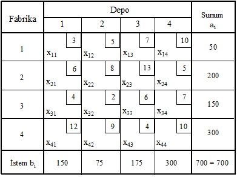

***c***. Amaç, en küçük toplam ulaştırma maliyeti­ni belirlemek olduğuna
göre,

X11: Fabrika 1’den depo 1’e taşınan deterjan miktarı

X12: Fabrika 1’den depo 2’ye taşınan deterjan miktarı

X33: Fabrika 3’den depo 3’e taşınan deterjan miktarı

. ...

X43: Fabrika 4’den depo 3’e taşınan deterjan miktarı

X44: Fabrika 4’den depo 4’e taşınan deterjan miktarı

olarak tanımlandığında, modelin amaç fonksi­yonu aşağıdaki gibi yazılır.

Zenk = 3X11 + 5X12 + 7X13 +
10X14 + 6X21 + 8X22 + 13X23
+ 5X24 + 4X31 + 2X32 + 6X33

\+ 7X34 + 12X41 + 9X42 +
4X43 + 10X44

Her bir fabrikadan gönderilecek deterjan miktarı o fabrika­nın üretim
miktarına eşit olacağına göre,

X11 + X12 + X13 + X14 = 50

X21 + X22 + X23 + X24 = 200

X31 + X32 + X33 + X34 = 150

X41 + X42 + X43 + X44 = 300

yazılabilir.

Diğer taraftan, her satış deposunun ürün gereksiniminin tam olarak
karşılanması istendiğinden,

X11 + X21 + X31 + X41 = 150

X12 + X22 + X32 + X42 = 75

X13 + X23 + X33 + X43 = 175

X14 + X24 + X34 + X44 = 300

yazılmasıyla, kısıtlayıcı fonksiyonların tanımlanması işlemi
tamam­lanmış olur.

Son olarak negatif taşıma olmayacağına göre,

Xij ≥ 0 (i = 1, 2, 3, 4; j = 1, 2, 3, 4)

yazılacak, böylece problem ulaştırma modeli olarak formüllenmiş
olacaktır.

##  7.4 ULAŞTIRMA PROBLEMLERİ ÇÖZÜM YÖNTEMLERİ

Esas olarak, bir tür doğrusal programlama problemi olması nedeniyle,
herhangi bir ulaştırma problemi doğrusal programlama­nın genel çözüm
yöntemi olan simpleks yöntemle çözülebilir. Ulaştırma problemine
simpleks yöntem uygulanması kararlaştırıldığında, uygun bir başlangıç
çözümüne ulaşmak amacıyla modelin yürürlükteki (m X n) karar değişkenine
(m + n) yapay değişken eklenmesi gerekir. Bunun sonucunda, simpleks
çözüm tabloları (m + n) satır ve \[(m X n) + (m + n)\] sütundan oluşur.
İşlemleri bu boyuttaki simpleks tablolarla sürdürmenin zaman alıcı ve
yorucu olacağı açıktır. Üstelik, gerçek uygulama problemlerinde sunum ve
istem merkezleri sayılarının binli rakamlarla açıklandıkları
düşünüldüğünde, simpleks yöntemin ulaştırma problemlerinin çözümü için
etkin bir hesap­lama tekniği olmadığını söylemek yanlış olmaz.
Sözgelimi, 7.1 nolu örnek problem simpleks yöntemle çözülmek istenirse
yürürlükteki on altı karar değişkenine sekiz yapay değişken eklenmesi
gerekir. Böylece, simpleks çözümün tekrarları toplam yirmi dört
değişkenle sürdürülür ki, bu da uzun aritmetik işlemlerin yapılması
demektir.

Ulaştırma problemlerinin çözümü için ulaştırma modelinin içerdiği
basitleştirici unsurlar (aij’le­rin sıfır ya da bire eşit
olması, kısıtlayıcı fonksiyonların eşitliklerle ifade edilmesi ve temel
uygun çözümlerin üçgen matris oluşturması gibi) göz önünde
bulundurularak simpleks yöntemden çok daha etkin yöntemler
gelişti­rilmişt­ir.

Ulaştırma problemlerinin çözümü için geliştirilen özel çözüm
yöntemlerine geçmeden önce, ulaştırma problemlerinin çözümüyle ilgili
bazı tanımları vermek uygun olur. Bu tanımlarla, 3.4. kesimde doğrusal
programlama problemle­rinin çözümü için verilen tanımların
benzerliklerine dikkat edil­meli­dir.

*Çözüm*: Bir ulaştırma probleminde tüm kısıtlayıcı fonksiyonları
sağ­layan herhangi bir X = (X11, X12, ...,
Xij, ..., Xmn) vektörüne *çözüm* denir.

*Uygun çözüm*: Herhangi bir çözüm sunum ve istem kısıtlayıcılarıyla
birlikte negatif olmama koşulunu da sağlıyor ise *uygun bir çözümdür*.

*Temel uygun çözüm*: Uygun bir çözüm­deki temel değişkenlerin sayısı (m
+ n - 1)’e eşitse, bu uygun çözüm aynı zamanda temel bir çözümdür. Bu
özellik­lere sahip olan çözüme *temel uygun çözüm* denir.

7.2 ve 7.3 nolu eşitlik­ler sistemi kısıtla­yıcı fonksi­yon­lar
oldu­ğuna göre, genel doğrusal program­lama problemle­rinde olduğu gibi
herhangi bir ulaştırma probleminin temel uygun çözümü,
Xij’lerin \[(m X n) - (m + n)\] tanesinin sıfıra
­eşitle­nme­siyle elde edile­bilir. Toplam sunumun toplam isteme
eşitliği kabul edildiğin­den, (m + n - 1) eşitli­ğin değeri
bilindiğinde, (m + n)’inci eşitli­ğin değeri de bilini­yor demektir. Bu
durumda, iki gruptaki kısıtla­yıcı fonksiyonlar­dan biri gereksiz
olduğundan, temel uygun çözüme (m + n - 1) pozitif taşıma ile
ulaşıla­bi­lir.

En iyi çözümün, amaç fonksiyonunun en iyi değerde olmasını sağlayan
temel uygun çözüm olduğu, ayrıca bir uygun çözümde pozitif değerli
değişken­l­ere temel değişken denildiğinin hatırla­tılması­yla ulaştırma
mo­dellerinin çözümü için önerilen özel çözüm yöntemlerine geçebiliriz.
İzlenen ve önerilen yaklaşımların tümü genel olarak aşağı­daki dört
temel aşamayı gerektirir.

*1*. Çözümlenmesi istenen soruna ilişkin verilerin matris for­mu
biçimindeki *ulaştırma modeli başlangıç
tablosunda*([24]) göste­ril­mesi.

*2*. Satır ve sütun gereklerine uyularak *başlangıç* *temel uygun
çözümün* elde edilmesi için uygun dağıtımın yapılması.

*3*. Bir önceki adımda belirlenen çözümün en iyi olup olmadı­ğının
kontrol edilmesi.

*4*. Çözüm en iyi değilse, en iyi çözüme ulaşıncaya kadar işlemlere
devam edilmesi.

Ulaştırma problemlerinin çözüm yöntemlerinde de simpleks yöntemdeki gibi
bir başlangıç çözümünün elde edilmesi zorunludur. Ulaştırma probleminin
başlangıç çözümü­nün bulunmasında başlangıç tablosunun boyutu göz önünde
bu­lundu­rularak değişik yöntemler uygulanabilir. Aşağıda belli
baş­lıca­ları açıklanacak yöntemlerin esas amacı, en iyi çözüme en yakın
bir başlangıç temel uygun çözüme ulaşmaktır. Yöntemleri açıklamadan önce
ele alacağımız yöntem­lerle ulaşacağımız başlangıç çözümlerinin hepsinin
temel olacağını söylemenin doğru olmayacağını belirtme­liyiz. Doğrusal
programlamaya ilişkin yapıtlar incelendiğinde, sözü edilen başlangıç
çözümünün belirlenmesinde kullanılan yöntemlerin belli başlıcalarının,

*1*. Kuzey-batı köşesi yöntemi

*2*. En düşük maliyetli gözeler yöntemi

*3*. VAM yöntemi

*4*. RAM yöntemi

olduğu görülebilir. Bu dört yöntem, genel olarak doğrusal programlama
konusunda çalışanlar tarafından en fazla tutulan ve kullanılan
yöntemler­dir. Bu yöntemleri sırasıyla açıklayalım.

###  *7.4.1 Kuzey-Batı Köşesi Yöntemi*

Dantzig tarafından önerilen ve A. Charnes ve W. W. Cooper tarafından
isimlendirilen bu yöntem başlangıç tablosu­nun kuzey-batı (sol-üst)
köşesindeki gözeden başlayarak gerekli miktarların nasıl dağıtılacağını
gösterir. Dağıtım işleminde, satır ve sütunlara ilişkin kısıtlayıcı
koşullar göz­ önünde bulun­durularak en uygun miktarlar gözelere
yerleştiril­mektedir. Yön­tem, aşağıdaki basamakların dizgesel bir
biçimde izlenmesi ile uygulanmaktadır.

*1*. Başlangıç tablosunun sol-üst köşesindeki gözenin saptan­ması.

*2*. Birinci adımda saptanan gözeye, satır ve sütun gerekleri­ne uygun
olarak en yüksek miktarda dağıtım için belirli bir raka­mın
yerleştirilmesi.

*3*. İkinci adımda gerçekleştirilen dağıtım sonucunda, ilgili sunum
merkezinin sunumu tümüyle kullanılmış, fakat bu gözenin ait olduğu
sütundaki istem merkezinin istemi tam olarak karşılanmamış
(a1 ≤ b1) ise aşağıya doğru kayıldığında rastlanan
ilk gözeye satır ve sütun koşullarına uygun olarak yine en yüksek
miktarda dağıtımın yapılması. Aşağı doğru kayma işlemi, ilgili sütunun
istemi karşılanıncaya kadar sürdürülür. Gerçekleştirilen dağıtımla
deponun istemi tam olarak karşılanmış, fakat sunum merkezinin sunumu
tamamiyle dağıtılma­mış (a1 ≥ b1) ise sağa doğru
kayıldı­ğında rastlanan gözeye en yüksek miktarda dağıtım yapılır. Bu
işlem, ilgili sunum merkezinin sunumunun tamamı dağıtılınca­ya kadar
sürdürülür. Diğer taraftan, sol-üst köşedeki gözeye dağıtım yapıldıktan
sonra, hem satır hem de sütun gereği yerine getiril­miş ise bu gözenin
sağ altındaki gözeye kayı­larak işlemler sürdürülür.

Kuzey-batı köşesi yöntemini aşağıdaki örnek probleme uygulayalım.
Yöntemleri açıklarken, pek çok yazarın yaptığı gibi, aynı kuramsal örnek
kullanılacak böy­lece, yöntemler arasında karşılaştırma yapma olanağı
yaratıl­mış olacaktır.

***Örnek 7.2***: Bulaşık makinesi üreticisi Alet AŞ’nin değişik yerlerde
dört fabrikası vardır. İşletme, satışla­rını değişik yerlerdeki dört
deposu ile yapmakta­dır. İşletme yönetiminin temel sorunu, makineleri
depolara en küçük maliyetle taşımaktır. Fabrikaların üretim
kapasiteleri, depoların istem miktarları ve birim ulaştırma maliyetleri
aşağıdaki ulaştırma tablosunda gösterilmiştir. Başlangıç çözümünü ve bu
çözüme ilişkin toplam ulaştırma maliye­tini bulunuz.

***Tablo 7.3***

***Problem 7.2’nin Başlangıç Tablosu***

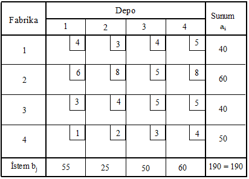

***Çözüm 7.2***: Ulaştırma problemlerinin modellenmesine ilişkin bir
örnek daha olması bakımından önce problemin matematiksel modelini
kuralım.

Xij, i (i = 1, 2, 3, 4) fabrikasından j (j = 1, 2, 3, 4)
satış deposuna gönderilen makine sayısını göster­sin. Buna göre, amaç
fonksiyonu aşağıdaki gibi yazılacaktır.

Zenk = 4X11 + 3X12 + 4X13 +
5X14 + 6X21 + 8X22 + 5X23 +
8X24 + 3X31 + 4X32 + 5X33 +
5X34 + 1X41 + 2X42 + 3X43 +
4X44

Kısıtlayıcı fonksiyonlar,

X11 + X12 + X13 + X14 = 40

X21 + X22 + X23 + X24 = 60

X31 + X32 + X33 + X34 = 40

X41 + X42 + X43 + X44 = 50

X11 + X21 + X31 + X41 = 55

X12 + X22 + X32 + X42 = 25

X13 + X23 + X33 + X43 = 50

X14 + X24 + X34 + X44 = 60

olarak formüle edilir.

Negatif taşıma söz konusu olmadığına göre,

Xij ≥ 0 i = 1, 2, 3, 4; j = 1, 2, 3, 4

yazılmasıyla model kurulmuş olur.

Modelin düzenlenmesinin ardından yönte­min uygulanmasına geçebiliriz.

Başlangıç tablosunun sol üst köşesindeki göze F1D1
olduğundan, ilk taşıma bu gözeye yapılacak, böylece ilk olarak
X11 değişkeninin değeri belirlenecektir. b1 ≥
a1 (55 ≥ 40) olduğundan, F1D1 gözesine
en fazla 40 adet makine gönderilebilir. Bu dağıtımla birinci
fa­brika­nın sunumunun tamamı kullanıldığından, bundan sonraki
dağıtımlarda bu fabrika dikkate alınmaz. Birinci deponun istemi tam
olarak karşılanmadığından, aşağıya doğru kayılır ve rastlanan ilk gözeye
(F2D1) en yüksek miktarda dağıtım yapılır. Bu
gözeye en fazla birinci deponun isteminin karşılana­mayan kısmı
(b1 - a1) kadar, yani 15 makine gönderilebilir.

Bu dağıtımla sütun gereği sağlanmış olmakla birlikte satır gereği henüz
yerine getirilme­miş oldu­ğundan, hemen sağa doğru kayıldı­ğında
rastlanan gözeye (F2­D2) taşınacak miktar
belirle­nir. İkinci fab­rikanın sunumu­nun kullanılmayan kısmı 45 (60 -
15) birim, ikinci depo­nun istemi ise 25 birim olduğundan, bu gözeye en
fazla 25 birim taşınabileceği kararlaştırılır. Böylece, ikinci deponun
istemi bütünüyle karşılanmış olur. İkinci fabrikanın sunumuyla ilgili
satır gereği henüz karşılanma­dığından, aynı satır üzerinde sağa doğru
kayılması gerek­mektedir. Sağa doğru kayıldığında rastlanan gözeye
(F2D3) en fazla 20 birim taşınabilir. Bu
dağıtımla, üçüncü deponun 50 birim olan isteminin 20 birimlik kısmı
karşılanmış, ikinci fabrikanın sunumunun tamamı dağıtılm­ış olur.
F2D3 gözesine yapılan dağıtım­dan sonra ikinci
fabrikanın sunumuyla ilgili satır gereği yerine getirilmiş olur.

Üçüncü deponun istemiyle ilgili sütun gereği henüz karşılanmadığı için
aşağı kayılması gerekir. Aşağı doğru kayıldığında rastlanan gözeye
(F3D3) taşınabile­cek en yüksek miktar, üçüncü
deponun isteminin henüz karşılanamayan kısmı kadar, yani 30 (= 50 - 20)
birimdir. Bu dağıtımla üçüncü deponun istemi tam olarak karşılanmış
olur. Üçüncü fabrikanın sunumundan geriye kalan 10 makinenin dördüncü
depoya gönderilmesiyle bu fabrikanın sunumuyla ilgili satır gereği
yerine getirilmiş olduğundan aşağı doğru kayılır. Ulaşılan
F4D4 gözesi dağıtım yapılacak son gözedir. Bu
gözeye taşınabilecek en yüksek miktar bu deponun toplam 60 birim olan
isteminin karşılanmayan kısmı kadar, yani 50 (= 60 - 10) birimdir.

Bu dağıtımlarla problemin kuzey-betı köşesi yöntemiyle ulaşılan çözümü
Tablo 7.4’deki gibi belirlenmiş olur.

Tablo7.4’den görüldüğü gibi, toplam yedi gözeye taşı­ma yapılmıştır. Bu
gözelere karşılık gelen karar de­ğişkenleri ve bunların yürürlükteki
değerleri şöyledir:

X11 = 40, X21 = 15, X22 = 25,
X23 = 20, X33 = 30, X34 = 10 ve
X44 = 50.

Dağıtım yapılan göze sa­yı­sı 7 (m + n - 1) olduğundan, yürürlükteki
çözüm temel bir çözüm­dür.

Ayrı­ca satır ve sütun gerekleri tam olarak karşılandı­ğından, bu temel
çözüm aynı zamanda uygun bir çözümdür.

***Tablo 7.4***

***7.2. Problemin Kuzey-Batı Köşesi Yöntemiyle***

***Belirlenen Başlangıç Çözümü***

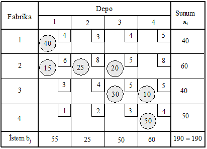

Çözüme ilişkin toplam maliyetin bulunması için, temel değişken
değerlerinin ait oldukları gözelere ilişkin birim taşıma maliyetleriyle
çarpımla­rının toplanması gerekir. Buna göre top­lam maliyet aşağıdaki
gibi hesaplanacaktır([25]).

|                |               |                      |                     |
|----------------|---------------|----------------------|---------------------|
| <u>Fabrika</u> | <u>Depo</u>   | <u>Miktar (Adet)</u> | <u>Maliyet (TL)</u> |
| F1  | D1 | 40                   | 40 X 4 = 160        |
| F2  | D1 | 15                   | 15 X 6 = 90         |
| F2  | D2 | 25                   | 25 X 8 = 200        |
| F2  | D3 | 20                   | 20 X 5 = 100        |
| F3  | D3 | 30                   | 30 X 5 = 150        |
| F3  | D4 | 10                   | 10 X 5 = 50         |
| F4  | D4 | 50                   | 50 X 4 = 200        |
| <u>TOPLAM</u>  | 950           |                      |                     |

Kuzey-batı köşesi yöntemi uygulaması son derece kolay bir yöntem
olma­sına karşın, dağıtım işlemlerinde maliyetler dikka­te
alınmadığından, genellikle en iyi çözümden oldukça uzak bir çözüm
vermekte, bunun doğal sonucu olarak da en iyi çözüme ulaşmada gerekli
işlem sayısı artmaktadır. Bununla bir­likte, yöntemin her zaman fazla
işlem gerekti­receği düşünülmemelidir. Bu, daha çok düşük maliyet­li
gözelerin yerine bağlıdır.

###  *7.4.2 En Düşük Maliyetli Gözeler Yöntemi*

Genellikle küçük boyutlu problemlerin çözümünde kullanılan bir
yöntemdir. Bu yöntemin uygulanmasında 1. Satır yaklaşımı, 2. Sütun
yaklaşımı, 3. Genel yaklaşım olmak üzere üç farklı yaklaşım söz
konusudur.

***1. Satır Yaklaşımı***

En düşük maliyetli gözeler yönteminin satır yaklaşımında dağıtım işlemi
satır ve sütunların kısıtlayıcı koşulları göz önünde bulundurularak, her
satırın en düşük maliyetli gözele­rine yapılması esasına dayanır. En
düşük maliyetli gözenin araş­tırıldığı satırda birden fazla sayıda en
düşük maliyetli göze olduğunda, sütun sayısı (j değeri) küçük olan
gözenin seçil­mesi önerilir. Bu yaklaşıma göre, ilk olarak birinci
satırdaki en düşük maliyetli gözeye satır ve sütun şartlarına bağlı
kalarak en yüksek miktar­daki dağıtım yapılır. Bu dağıtımla birinci
satır şartı yerine getirilmiş ise ikinci satıra geçilir. Aksi halde
dağıtım bu satırın ikinci, üçüncü, ... en düşük maliyetli gözele­ri ile
sürdürü­lür. Bu işlem, her seferinde ya bir satır ya bir sütun veya her
ikisi birden devre dışı bırakılarak, tüm satır ve sütun gerekleri yerine
getirilinceye, yani bir başlangıç çözümü elde edilinceye değin
tekrarlanır.

Yukarıda kuzey-batı köşesi yöntemiyle çözülen örnek problemi bu
yaklaşımla çözelim.

***Tablo 7.5***

***7.2. Problemin Başlangıç Tablosu***

Tablodan görüldüğü gibi, birinci satırın en düşük (3) maliyeti
F1D2’ye ait olduğundan, dağıtıma bu göze ile
başlanacak, yani ilk olarak X12 değişkeninin değeri
belirlene­cektir. Bu gözenin işaret ettiği deponun istemi 25 birim, bu
istemi karşılamak durumunda olan birinci fab­rika­nın sunumu 40 birim
olduğundan, bu gözeye en fazla 25 makine gönderilebilir. Bu dağıtım­la
birinci fabrikanın sunumu tamamiyle dağıtılmadığından, aynı satı­rın
ikinci en düşük maliyetli gözesine geçilir. Birinci satırda birden fazla
ikinci en düşük maliyetli göze olduğundan, dağıtım sütun sayısı daha
küçük olan F1D1 gözesine yapıla­caktır. Bu gözeye
en fazla, birinci fabri­kanın sunumunun kullanıl­mayan kısmı kadar, yani
15 (= 40 - 25) makine gönderilebilir. Bu dağıtımla birinci fabrikanın 40
birim olan sunumunun tamamı ilk iki depo için kulla­nılmış olur. Birinci
fabrikanın sunumuyla ilgili satır gereği yerine getiril­miş olduğun­dan
ikinci satıra geçilir.

İkinci satırdaki en düşük (5) maliyet F2D3’e
aittir. İkinci fabrika­nın henüz el değmemiş olan sunumunun 50 birimlik
kısmının birinci depoya taşınmasıyla bu deponun istemi karşılan­mış ve
bu depo devre dışı kalmış olur. Bu dağıtımda satır gereği tam olarak
karşılanm­adığı­ndan, aynı satırın ikinci en düşük mali­yetli gözesi­ne
geçilir. Bu satı­rın ikinci en düşük (6) mali­yet­li gözesi
F2D1’dir. İkinci fabrikanın elinde ka­lan 10
makinenin ikinci depoya gönderilmesiyle satır gereği kar­şılan­mış
oldu­ğundan, bir sonraki dağıtım için üçüncü satıra geçilir.

Üçüncü satı­rdaki en düşük (3) maliyet F3D1’e
aittir. Bu gözenin bulundu­ğu sütundaki deponun toplam 55 birim olan
isteminin 25 birimlik kısmı önceki dağıtım­larda karşılanmış olduğundan,
isteminin karşılanmayan kısmı kadar bir taşımanın üçüncü fabrika­dan
gerçek­leştirilmesiyle, ilgili deponun istemi tamamiyle karşılanmış
olur. Üçüncü fabrikanın sunumuyla ilgili satır gereği henüz
sağlanmadığından, bu satırın ikinci en düşük maliyetli gözesi­ne
geçilir. Depo 2 ve depo 3 önceki dağıtım­larla devre dışı
kaldıkların­dan, bu satırda dağıtım yapılacak tek bir göze
(F3D4) vardır. Bu gözeye taşına­bilecek en yüksek
miktar, ­üçüncü fabrika­nın sunumunun kullanılma­yan kısmı kadar, yani
10 birim­dir.

Dördün­cü satırın devre dışı kalmamış tek gözesi olan
F4D4’e en fazla dördüncü deponun isteminin
karşılanmamış kısmı kadar, yani 50 makine gönderilebilir. Bu taşımayla
dağıtım işlemi tamamlanmış ve çözüm Tablo 7.6’daki gibi belirlenmiş
olur.

***Tablo 7.6***

***7.2. Problemin Satır Yaklaşımıyla Elde Edilen Başlangıç Çözümü***

Tablo 7.6 incelendiğinde, gerçekleştirilen dağıtımlarla depo
istemle­rinin tam olarak karşılandığı ve fabrikaların sunumunun eksiksiz
dağıtıldığı görülebilir. Bu nedenle, tablodaki çözüm uygun bir çözümdür.

Toplam 7 gözeye dağıtım yapıldığından, ulaşılan başlangıç çözümü temel
çözümdür. Taşıma yapılan (dolu) gözelere karşılık gelen karar
değişkenleri ve değerleri şöyledir:

X11 = 15, X12 = 25, X21 = 10,
X23 = 50, X31 = 30, X34 = 10,
X44 = 50

Bu başlangıç temel uygun çözüme ait maliyetin bulunması için, temel
değişken değerlerinin ait olduk­ları gözelere ilişkin birim taşıma
maliyet­leriyle çarpımla­rının toplanması gerekir.

Bu açıklamalar doğrul­tu­sunda, çözümün toplam maliyeti aşağıdaki gibi
hesaplana­caktır([26]).

|                |               |                      |                     |
|----------------|---------------|----------------------|---------------------|
| <u>Fabrika</u> | <u>Depo</u>   | <u>Miktar (Adet)</u> | <u>Maliyet (TL)</u> |
| F1  | D1 | 15                   | 15 X 4 = 60         |
| F1  | D2 | 25                   | 25 X 3 = 75         |
| F2  | D1 | 10                   | 10 X 6 = 60         |
| F2  | D3 | 50                   | 50 X 5 = 250        |
| F3  | D1 | 30                   | 30 X 3 = 90         |
| F3  | D4 | 10                   | 10 X 5 = 50         |
| F4  | D4 | 50                   | 50 X 4 = 200        |
| <u>TOPLAM</u>  | 785           |                      |                     |

***2.** **Sütun Yaklaşımı***

En düşük maliyetli gözeler yönteminin sütun yaklaşımında da, en düşük
maliyetli gözeler yönteminin satır yaklaşımındaki gibi hareket edilir.
İki yaklaşım arasındaki tek fark, birinde satırların, diğerinde
sütunla­rın en düşük mali­yetli gözelerinin dikkate alınmasıdır. Birden
fazla en düşük maliyetli göze ile karşılaşıldığında, satır sayısı (i
değeri) küçük olan gözenin seçilmesi önerilmekted­ir.

En düşük maliyetli gözeler yönteminin sütun yaklaşımını aynı örnek
probleme uygulayalım. Örnek problemin başlangıç tablosu aşağıda
tekrarlanmıştır. Problemin başlangıç tablosundan görüldüğü gibi, birinci
sütunun en düşük maliyeti F4D1’e ait olduğundan,
dağıtıma bu gözeden başlanacak, yani ilk olarak X41
değişkeninin değeri belirlenecektir. Bu gözenin işaret ettiği deponun
istemi 55 birim, bu istemi karşılamak durumunda olan birinci fabrikanın
sunumu 40 birim olduğundan bu gözeye en fazla 40 makine gönderilebilir.

***Tablo 7.7***

***7.2. Örnek Problemin Başlangıç Tablosu***

Bu göndermeyle birinci deponun tüm gereksinimi karşılanamadığından, aynı
sütunun ikinci en düşük (3) maliyetli gözesi olan
F3D1’e geçilir. Bu gözeye en fazla
D1’in isteminin karşılanmayan kısmı kadar, yani 5 (= 55 - 50)
makine gönderilebilir. Bu göndermeyle birinci deponun istemiyle ilgili
sütun gereği yerine getirilmiş olduğundan, ikinci sütuna geçilir. İkinci
sütunun en düşük maliyetli (3 TL) gözesi (F4D2 bir
önceki dağıtımla devre dışı kaldığından) F1D2’dir.
Bu gözeye en fazla bu gözenin işaret ettiği deponun istemi kadar, yani
25 makine gönderilebilir. Bu göndermeyle ikinci depoyla ilgili sütun
gereği sağlandığından yeni dağıtım için üçüncü sütuna geçilir.

Üçüncü sütunun en düşük maliyet­li (4 TL) gözesi
F1D3’dür. Bu gözeye en fazla birinci fabrika­nın
sunumunun da­ğıtılmayan kısmı kadar, yani 15 (= 40 - 25) makine
gönderilebilir. Üçüncü deponun istemi tam olarak karşılana­madığın­dan
aynı sütunun ikinci en düşük maliyetli gözesine geçilir. Bu sütunda en
düşük maliyet­li (5 TL) iki göze (F2D3,
F3D3) vardır. İlk dağı­tımı satır sayısı küçük
olan F2D3 gözesine yapalım. Satır ve sütunla­rın
kısıtlayıcı koşulları göz önünde bulundurulduğunda, bu gözeye en fazla
35 birim gönderilir. Bu dağıtımla sütun gereği yerine getirilmiş
olduğun­dan, dördüncü sütuna geçilir.

Dağıtımın F3D4’e yapılma­sı gerekti­ği bellidir.
Bu gözeye gönderilebilecek en yüksek miktar, üçüncü fabrikanın
kullanıl­mayan sunumu kadar, yani 35 birimdir. Bu sütunda dağıtım
yapılması gereken tek bir göze (F2D4) kalmış­tır.
Bu gözenin maliyet katsayı­sı büyük olmakla birlikte kural gereği bu
gözenin doldurulması gerekmektedir. Dördüncü deponun isteminin
karşılanmayan kısmı olan 25 birimin, ikinci fabrikanın sunumunun henüz
kulla­nılmamış olan kısmıyla karşılan­masıyla dağıtım işlemi tamamlanmış
olur.

Yapılan dağıtımlarla ulaşılan çözüm Tablo 7.8’de gösterilmiştir.
Tablodan görüldüğü gibi, temel değişkenler ve bunların başlangıç
çözümündeki değerleri şöyledir:

X12 = 25, X13 = 15, X23 = 35,
X24 = 25, X31 = 5, X34 = 35,
X41 = 50.

***Tablo 7.8***

***7.2. Problemin Sütun Yaklaşımıyla Bulunan Başlangıç Çözümü***

Tablo 7.8’den görüldüğü gibi ulaşılan çözüm temel (temel değişken sayısı
= 7 olduğun­dan) uygun bir çözümdür. Çözüme ilişkin toplam maliyet
aşağıdaki gibi hesaplanmıştır.

|                |               |                      |                     |
|----------------|---------------|----------------------|---------------------|
| <u>Fabrika</u> | <u>Depo</u>   | <u>Miktar (Adet)</u> | <u>Maliyet (TL)</u> |
| F1  | D2 | 25                   | 25 X 3 = 75         |
| F1  | D3 | 15                   | 15 X 4 = 60         |
| F2  | D3 | 35                   | 35 X 5 = 175        |
| F2  | D4 | 25                   | 25 X 8 = 200        |
| F3  | D1 | 5                    | 5 X 3 = 15          |
| F3  | D4 | 35                   | 35 X 5 = 175        |
| F4  | D1 | 50                   | 50 X 1 = 50         |
| <u>TOPLAM</u>  | 750           |                      |                     |

***3. Genel Yaklaşım***

Bu yaklaşım da, önceki yaklaşımlar gibi, daha çok küçük boyut­lu
problemlerin çözümünde uygulanır. En düşük maliyetli gözeler yönteminin
genel yaklaşımında, önceki iki yaklaşımdan farklı olarak, satır ve sütun
farkına bakılmaksı­zın başlangıç tablosu­nun bütünü dikkate alınır.
Dağıtım yapılacak ilk göze, tablonun en düşük maliyetli gözesidir. Bu
gözeye satır ve sütunun kısıtlayıcı koşullarına bağlı kalarak en yüksek
miktarda dağı­tım yapılır. Böylece bir satır veya bir sütun veya her
ikisi bir­den

Bir sonraki dağıtımda devre dışı bırakılır. Eğer birden fazla en düşük
maliyetli göze varsa seçim rasgele yapılır.

Kesin bir kural olmamakla birlikte, en düşük maliyetli gözeler
yönteminin genel yaklaşımıyla belirlenen toplam maliyet, genellikle
diğer iki yaklaşımla belirlenen toplam maliyetlerden küçük olmaktadır.

En düşük maliyetli gözeler yönteminin genel yaklaşımını aynı örnek
probleme uygulayalım.

Ulaştırma tablosunun en düşük (1) maliyetli gözesi
F4D1’dir. Bu nedenle ilk dağıtım bu gözeye
yapılacak­tır. Bu gözeye en fazla 50 birim taşınabilir. Bu dağı­tımla
bi­rinci deponun 55 birimlik isteminin 50 birimlik kısmı dördüncü
fabrika­dan karşı­lanmış olur. Dördüncü fabrikanın tüm sunumu
kullanıl­dığından, ikinci dağıtımda bu fabrikanın bulun­duğu satır
dikkate alınmaz. Kalan üç satır ve dört sütundan olu­şan tabloda aynı en
düşük maliyete sahip iki göze (­F1D2 ve
F3D1) vardır.

İkinci dağıtımı, ras­gele seçtiğimiz F1D2 gözesine
yapalım. Bu gözeye en fazla ikinci deponun istemi kadar, yani 25 birim
gönderilebilir. Bu dağıtımla ikinci deponun istemi eksiksiz
karşılandığından, bir sonraki dağıtım işleminde bu deponun bulunduğu
sütun devre dışı bırakı­lır. Kalan üç satır ve üç sütun­dan oluşan
tablonun en düşük (3) maliyetli gözesi F3D1’dir.
F3D1’e en fazla birinci deponun isteminin
karşılanama­yan kısmı kadar, yani 5 birim aktarılabilir. Bu dağıtımla
birinci deponun istemi tamamen karşılanmış olduğundan, yeni dağıtımda
birinci depo sütunu dikkate alınmaz.

Bu aşamaya gelindiğinde üç satır ve iki sütundan oluşan bir tabloyla
yüzyüze geliriz. Daha küçük boyuttaki bu tablonun en düşük (4)
maliyet­li gözesi F1D3 ve bu gözeye taşınacak en
yüksek miktar 15(40 - 25) birim­dir.

Bu dağıtımla birinci fabrika­nın sunumuyla ilgili satır gereği yerine
getirilmiş olduğundan, bu satır devre dışı kalır. Kalan dört gözeden üçü
aynı en düşük (5 TL) maliyete sahiptir.

Dağıtım işlemini F2D3 ile sürdürelim. Bu gözeye
dağıtılacak en yüksek miktar 35 birimdir. Bu dağıtımla üçüncü deponun
istemi tam olarak karşılan­dığından, bir sonraki dağıtımda üçüncü sütun
dikkate alınmaz.

Dağıtım yapılması gereken iki göze (F2D4 ve
F3D4) daha vardır. İkinci ve üçüncü fabrikaların
sunumlarının henüz kullanılmayan kısımları­nın bu gözelere taşınmasıyla
dağıtım işlemi tamamlanmış ve Tablo 7.9’daki başlangıç çözümüne
ulaşılmış olur.

Genel yaklaşımla belirlenen çözümün yer aldığı tablodan görüldüğü gibi,
başlangıç çözümünün temel değişkenleri ve bunların değerleri şöyledir:

X12 = 25, X13 = 15, X23 = 35,
X24 = 25, X31 = 5, X34 = 35,
X41 = 50

Pozitif değerli temel değişken sayısı 7 (= m + n - 1)’ye eşit
olduğundan, bu çözüm de önceki başlangıç çözümleri gibi temel çözüm­dür.

# Tablo 7.9

***7.2. Problemin Genel Yaklaşımla Bulunan Başlangıç Çözümü***

Kolayca kontrol edilebileceği gibi, aynı zamanda uygun olan bu çözüme
ilişkin toplam maliyet, önceden olduğu gibi temel değişken değerlerinin
kendilerine karşılık gelen birim ulaştırma maliyetl­erinin karşılık­lı
çarpımlar­ının toplanması­yla aşağıdaki gibi hesaplanacaktır.

|                |               |                      |                     |
|----------------|---------------|----------------------|---------------------|
| <u>Fabrika</u> | <u>Depo</u>   | <u>Miktar (Adet)</u> | <u>Maliyet (TL)</u> |
| F1  | D2 | 25                   | 25 X 3 = 75         |
| F1  | D3 | 15                   | 15 X 4 = 60         |
| F2  | D3 | 35                   | 35 X 5 = 175        |
| F2  | D4 | 25                   | 25 X 8 = 200        |
| F3  | D1 | 5                    | 5 X 3 = 15          |
| F3  | D4 | 35                   | 35 X 5 = 175        |
| F4  | D1 | 50                   | 50 X 1 = 50         |
| <u>TOPLAM</u>  | 750           |                      |                     |

###  *7.4.3 VAM Yöntemi*

Türkçedeki adını, İngilizce ***Vogel’s ApproXimation Method***
kelimelerinin ilk harflerinden alan bu yöntem, William R. Vogel
tarafından 1958’de ileri sürülmüştür. Yöntemin en önemli özelliği,
genellikle en iyi çözüme en yakın hatta en iyi çözümü başlangıçta
vermesi­dir.

Yöntem aşağıda açıklanan aşa­maların adım adım izlenmesi ile uygulanır.

*1*. Birim ulaştırma maliyetlerinin oluş­turduğu matrisin her bir satır
ve her bir sütunundaki en düşük maliyetli iki Cij maliyet
katsayısı saptanır.

*2*. Birinci adımda belirlenen Cij’ler arasındaki fark­lar
hesaplanır. Satır Cij’leri için hesaplanan fark değerleri
tabloya eklenen bir ek satıra, sütun Cij’leri için hesaplanan
fark değerleri tabloya eklenen bir ek sütuna yazılır. Bu farklar en
düşük maliyetli gözenin kullanılma­ması durumunda katlanılacak fazla
harcamayı, yani bir çeşit cezayı ifade ettiklerinden bunlara birim ceza
(penaltı) değerleri de denir. Bu nedenle VAM yöntemi *birim penaltı
yöntemi* olarak da bilinir.

*3*. İkinci adımda hesaplanan (m + n) fark değerlerinden en büyük olanı
saptanır.

*4*. En büyük değerli farkın ortaya çıktığı satır veya sütunun en düşük
ma­liyetli gözesi belirle­nir. Bu gözeye satır ve sütun koşullarına
uygun olarak en yüksek miktardaki dağıtım yapılır. Yapılan bu dağıtım
miktarı, ilgili satır ve sütun toplamlarından çıkartılır. Dağıtım
yapılan gözenin işaret ettiği istem merkezinin istemi tam olarak
karşılanmış ya da sunum merkezinin sunumu bütünüyle dağıtılmış ise, o
sunum merkezi veya istem merkezi (duruma göre her ikisi birden) bir
sonraki dağıtım işleminde devre dışı bırakılır.

*5*. Dağıtım yapılan satır veya sütunun (veya her ikisinin birden) devre
dışı bırakıl­ması ve sunum ile istem merkezlerinin sunum-istem
miktarlarının yeniden ayarlan­masıyla yeni bir tablo düzenlenir.

*6*. Düzenlenen bu yeni tabloda satır veya sütun sayısı bire ininceye
değin 1-5 nolu işlemler sırasıyla izlenerek yinelenir.

En büyük fark değerleri birbirine eşit olabilir. Bu durumda, dağıtım
işlemi bunlardan herhangi birinin rasgele seçilmesiyle sürdürü­lebi­lir.
Ancak, bu durumda en iyi çözüme ulaşmak için gerekli işlem sayısı
artabilir.

Aşağıdaki kurallara uyulması durumunda bu tehlike ortadan kalkar.

\- En büyük fark iki ya da daha fazla satırda (ya da sütunda) ortaya
çıkarsa, en büyük ai (ya da bj) değerli satırdaki
(ya da sütundaki) en düşük maliyetli göze seçilir.

\- En büyük fark bir satır ve bir sütunda aynı anda ortaya çıkarsa ve
söz konusu satır ile sütunun kesiştiği yerdeki gözenin maliyeti en düşük
ise dağıtım için bu göze seçilir.

Söz ko­nusu gözeye ilişkin maliyet en düşük değilse, ilgili satır ya da
sütunun en düşük maliyetli gözesi seçilir.

VAM yöntemini, şimdiye kadar açıklanan yöntemlerin uygulandığı aynı
örnek probleme, uygulayalım. Yöntemin ilk tekrarında edilen, henüz tamam
olmayan çözüm Tablo 7.10’da sunulmuştur.

Satırlar itibariyle hesaplanan farkların yer aldığı ek sütun ile
sütunlar itibariyle hesaplanan farkların yer aldığı ek satır
incelendiğinde en büyük farkın 2 olduğu ve birinci sütun için
hesaplandığı görülebilir. Yukarıda açıklanan kural ge­reği dağıtım için
bu sütunun en düşük maliyetli gözesi bulunacak ve ilk dağıtım bu gözeye
gerçekleştirilecektir.

#  Tablo 7.10

***7.2. Problemin VAM (Birinci Deneme) Çözümü***

Söz konusu sütunun en düşük (1) maliyetli gözesi
F4D1’dir. a4 ≤ b1 (50 ≤ 55)
olduğundan, bu gözeye en fazla 50 birim taşınabilir. Böylece, dördüncü
fabrikanın sunumu tam olarak kulla­nıl­dı­ğından, bu fabrika bir sonraki
dağıtım işleminde dikkate alınmaz. Yeni tab­loda birinci deponun
gereksiniminin 5 (= 55 - 50) birim olacağı unutul­mama­lıdır. Dördüncü
satırın devre dışı bırakıl­ması ve birinci deponun isteminin 5 birime
düşürülmesiyle, yeni dağıtım için hazırlanan tablo aşağıda
gösterilmiştir. Tablodan görüldüğü gibi, en büyük fark (1) üç satır ve
üç sütunda aynı anda ortaya çıkmıştır. En düşük (3) maliyete birinci
satırla ikinci sütunun, ayrıca üçüncü satırla birinci sütunun kesiş­tiği
yerlerdeki gözelerin (F1D2 ve
F3D1) sahip oldukları dikkate alındığında,
dağıtımın bu göze­lerden birine yapıl­ması gerektiği anlaşılır.

####  Tablo 7.11

***7.2. Problemin VAM (İkinci Deneme) Çözümü***

Yukarıdaki açıklamalar doğrultusunda ilk olarak,
F1D2 gözesini ele alalım. Bu gözeye en fazla
ikinci deponun istemi kadar, yani 25 birim transfer edilebilir. Bu
taşımayla birinci fabrika­nın toplam 40 birim olan sunumunun 25 birimlik
kısmı kullanılmış olur. Bu dağı­tımla ikinci deponun istemi tam olarak
karşılandığın­dan, bu depo bir sonraki dağıtım işleminde dikkate
alınmaz.

Bu arada, yeni düzenlenecek tabloda birinci fabrikanın dağı­tıla­bilir
sunum miktarı­nın 15(40 - 25) birim olması gerektiği unutul­mamalı­dır.
İkinci deponun işlem dışı bırakılması ve birinci fabrikanın sunumunun
kullanıl­mayan kısmının 15 birim olduğu­nun belirlenme­sinden sonra yeni
dağıtımda kullanılmak üzere hazırla­nan tablo aşağıda gösterilmiştir.

Tablo 7.12’den görüldüğu gibi, en büyük farkın (2) ortaya çıktığı üçüncü
satırın en düşük maliyetli (3 TL) gözesi F3D1’dir.
Satır ve sütunun kısıtla­yıcı koşulları göz önünde bulundurulduğunda, bu
gözeye en fazla 5 birim mal transfer edileceği görülür.

***Tablo 7.12***

***7.2. Problemin VAM (Üçüncü Deneme)Çözümü***

Bu taşıma ile birinci deponun istemi tam olarak karşılan­mış, üçüncü
fabrikanın sunum miktarı 35(40 - 5) birime düşmüş olur.

Birinci deponun devre dışı bırakılması ve üçüncü fabrikanın sunum
kapasitesinin duruma uygun şekilde düzeltilme­siyle elde edilen tablo
(Tablo 7.13) aşağıda gösteril­miştir.

Dördüncü deneme sonrası düzenlenen tablodan görüld­üğü gibi bu kez en
büyük fark ikinci satırda ortaya çıkmış­tır. İkinci satırın en düşük
maliyetli gözesi F2D3 gözesi olduğundan dağıtım bu
gözeye yapılacaktır. Bu gözeye gönderile­cek en yüksek miktar 50
birimd­ir. Bu dağıtımla depo 3’ün istemi tam olarak karşı­lan­mış
olacağından bir sonraki dağıtımda bu depo dikkate alınmayacaktır.

***Tablo 7.13***

***7.2. Problemin VAM (Dördüncü Deneme) Çözümü***

İkinci fabrika­nın 60 birim olan toplam sunumunun 50 birimlik kısmı
kullanıldığın­dan yeni hazırlanacak tabloda bu fabrikanın sunumunun 10
birim olduğu düşünülür.

Yukarıdaki açıklamalar doğrul­tusunda hazırlanan beşinci deneme çözüm
tab­losu aşağıda gösterilmiştir.

***Tablo 7.14***

***7.2. Problemin VAM (Beşinci Deneme) Çözümü***

Tablo 7.14’den görüldüğü gibi geriye bir sütun kaldığın­dan, fark
hesaplanamaz. Bu durumda dördüncü deponun toplam 60 birim olan istemi üç
fabrikanın, daha önceki dağıtımlar sonrası ellerinde kalan
kullanılabilir sunumlarıyla karşılanarak dağıtım işlemi Tablo 7.15’deki
gibi planlanmış olur.

***Tablo 7.15***

***7.2. Problemin VAM Yöntemiyle Bulunan Başlangıç Çözümü***

Uygun dağıtımlarla hem satır hem de sütun gerekleri karşılandığın­dan,
tablodaki çözüm uygundur. Bu uygun çözümde bulunan temel değişkenler ve
bu değişkenlerin değerleri: X12 = 25, X14 = 15,
X23 = 50, X24 = 10, X31 = 5,
X34 = 35 ve X41 = 50 olarak belirlenmiştir. Temel
değişken sayısı 7 olduğundan bu çözüm de, önceki çözümler gibi temel
çözüm olup toplam maliyet 720 TL olarak hesaplanmıştır.

|                |               |                      |                     |
|----------------|---------------|----------------------|---------------------|
| <u>Fabrika</u> | <u>Depo</u>   | <u>Miktar (Adet)</u> | <u>Maliyet (TL)</u> |
| F1  | D2 | 25                   | 25 X 3 = 75         |
| F1  | D4 | 15                   | 15 X 5 = 75         |
| F2  | D3 | 50                   | 50 X 5 = 250        |
| F2  | D4 | 10                   | 10 X 8 = 80         |
| F3  | D1 | 5                    | 5 X 3 = 15          |
| F3  | D4 | 35                   | 35 X 5 = 175        |
| F4  | D1 | 50                   | 50 X 1 = 50         |
| <u>TOPLAM</u>  | 720           |                      |                     |

### *7.4.4 RAM Yöntemi* 

Adını, İngilizce ***Russel’s ApproXimation Method*** kelimeleri­nin ilk
harflerinden alan yöntemin en önemli özelliği, tıpkı VAM gibi, en iyi
çözüme oldukça yakın hatta en iyi çözümü başlangıçta vermesi­dir. Yöntem
içeriğindeki adımlar aşağıda açıklanmıştır.

### *1*. Başlangıç tablosunun her satır ve her sütunundaki en yüksek Cij maliyet katsayısı saptanır. Satır en büyükleriyle bir sütun, sütun en büyükleriyle bir satır oluşturulur.

### 

### 

### 

### 

### 

### 

### 

### 

### 

### 

### 

### 

### 

### 

### 

### 

### 

### 

### 

### 

### 

### 

### 

### 

### 

### 

### 

### 

Oluşturulan sütun tablonun en sağına, satır ise tablonun en altına
eklenir. RAM yöntemiyle ilgili bu ilk adım aşağıdaki tabloda
gösterilmiştir.

##  Tablo 7.16

***7.2. Problemin Başlangıç Tablosu***

*2*. Yeni maliyet katsayılarının yazılması için boş bir tablo
hazırlanır. İlk gözeden başlanarak yeni maliyet katsayıları hesaplanır.

Yeni maliyetler, dikkate alınan gözenin bulunduğu satır ve sütunun en
büyük maliyet katsayıları toplamı ile o gözenin orijinal maliyet
katsayısı arasındaki farka eşittir. Sözgelimi, C11’in yeni
değeri birinci satırdaki en büyük değer (5) ile, birinci sütundaki en
yüksek değer (6)’nın toplamından F1D1 gözesinin
orijinal maliyet değerinin (4) çıkartılmasıyla 7 olarak hesaplanır.

*3*. İkinci adımda hesaplanan maliyetlerden en büyük olan saptanır. Bu
gözeye satır ve sütun koşullarına uygun olarak en yüksek miktardaki
dağıtım yapılır. Yapılan bu dağıtım miktarı, ilgili satır ve sütun
toplamlarından düşülür. Dağıtım yapılan gözeye ilişkin istem merkezinin
istemi tam olarak karşılanmışsa ilgili sütun, sunum merkezi­nin sunumu
tamamen kullanılmışsa karşılık gelen satır bir sonraki dağıtım­da işlem
dışı bırakılarak, yeni bir tablo hazırlamak üzere başlan­gıç tablosuna
dönülür. Düzenlenen tablolarda satır veya sütun sayısı bire inin­ceye
kadar 1-3 nolu işlemler tekrarl­anır.

Yukarıdaki açıklamalar doğrultusunda hazırlanan tablo aşağıda
gösterilmiştir. Yeni maliyetlerin yer aldığı tablo incelendiğin­de, en
yüksek değerli (10) iki göze bulunduğu görülebilir. Dağı­tım için bu iki
gözeden herhangi biri seçilebi­lir. İlk olarak,
F1D2’e satır ve sütun gereklerine uygun olarak en
yüksek miktardaki dağıtımı gerçekleştire­lim.

##  Tablo 7.17

***7.2. Problemin RAM (Birinci Deneme) Çözümü***

F1D2 gözesine en fazla 25 birim transfer
edilebilir. Bu dağıtımla ikinci deponun istemi tam olarak
karşılandığından, bir sonraki dağıtım işleminde ikinci sütun dikkate
alınmaz. Ayrıca, birinci fabrikanın sunum miktarının 15 (= 40 - 25)
birim olarak düzeltilmesi gerekir. Yeni deneme çözüm tablosu aşağıda
gösterilmiştir.

***Tablo 7.18***

***7.2. Problemin RAM (İkinci Deneme) Çözümü***

Tablo 7.18’in en yüksek maliyetli gözesi F4D1’dir.
Bu gözeye en fazla 50 birim aktarılabilir. Bu taşıma­yla birinci deponun
55 birim olan isteminin 50 birimlik kısmı karşı­lanmış, dördüncü
fabrikanın sunumu tüketilmiş olur.

Dördüncü fabrikanın işlem dışı bırakılmasıyla bir sonraki dağıtım için
maliyetler aşağıdaki gibi hesaplana­caktır.

#  Tablo 7.19

***7.2. Problemin RAM (Üçüncü Deneme) Çözümü***

Tablo 7.19’un altı gözesi birden aynı yüksek (8) maliyete sahip
olduğundan, dağıtım işlemi bunlardan herhangi birinin rasgele
seçilmesiy­le sürdürülebilir. Bu gözeleri F1D4’den
başlaya­rak sırayla ele alıp uygun dağıtım miktarlarını belirleye­lim.
F1D4’e en fazla 15 birim­ transfer edilir. Bu
dağıtımla birinci fabrikanın sunumunun tamamı kullanıl­mış, dör­düncü
deponun 60 birim olan toplam isteminin 15 birimlik kısmı karşılanmış
olur.

F2D1’e geçelim. F2D1’e en
fazla birinci deponun isteminin önceki dağıtımlarda karşılanamayan kısmı
kadar, yani 5 birim gönderilir. Bu dağı­tımla birinci deponun bulunduğu
sütun gereği yerine getiril­miş olduğundan, birinci sütun devre dışı
bırakılır. F2D3 gözesine yapılabilecek en yüksek
dağıtım 50 birimdir. Bu dağıtım­la üçüncü deponun tüm istemi karşılanmış
olduğundan bu depo işlem dışı bırakılır. İkinci fabrikanın sunumundan
geriye kalan yal­nızca 5 birimdir. Bu mik­tarın
F2D4 gözesine taşınmasıyla dağıtım yapılacak tek
bir göze (F3D4) kalmış olur. Dördüncü deponun
isteminin önceki dağıtımlarda karşılanamayan kısmının üçüncü fabrika­dan
karşılan­masıyla dağıtım işlemi tamamlanmış olur.

7.17-7.19 nolu tablolarda yer alan dağıtımlar aşağıdaki tabloda topluca
göste­ril­miştir. Dağıtım yapılan göze, yani temel değişken sayısı (m +
n - 1)’e eşittir. Dolayısıyla, RAM’la ulaşılan bu çözüm de önceki
çözümler gibi temel bir çözümdür.

# Tablo 7.20

***7.2. Problemin RAM Yöntemiyle Elde Edilen Başlangıç Çözümü***

Aynı zamanda uygun olan bu temel çözüme ilişkin toplam maliyet aşağıdaki
gibi hesaplanmıştır.

|                |               |                      |                     |
|----------------|---------------|----------------------|---------------------|
| <u>Fabrika</u> | <u>Depo</u>   | <u>Miktar (Adet)</u> | <u>Maliyet (TL)</u> |
| F1  | D2 | 25                   | 25 X 3 = 75         |
| F1  | D4 | 15                   | 15 X 5 = 75         |
| F2  | D1 | 5                    | 5 X 6 = 30          |
| F2  | D3 | 50                   | 50 X 5 = 250        |
| F2  | D4 | 5                    | 5 X 8 = 40          |
| F3  | D4 | 40                   | 40 X 5 = 200        |
| F4  | D1 | 50                   | 50 X 1 = 50         |
| <u>TOPLAM</u>  | 720           |                      |                     |

Aynı problemi, değişik yöntemlele çözerek farklı maliyetler hesaplamış
bulunuyoruz. Altı farklı yöntemle elde edilen maliyetler aşağıda topluca
gösterilmiştir.

|                      |                     |
|----------------------|---------------------|
| <u>Çözüm Yöntemi</u> | <u>Maliyet (TL)</u> |
| Kuzey-batı köşesi    | 950                 |
| Satır yaklaşımı      | 785                 |
| Sütun yaklaşımı      | 750                 |
| Genel yaklaşım       | 750                 |
| VAM                  | 720                 |
| RAM                  | 720                 |

Toplam maliyetin en yüksek değerinin kuzey-batı köşesi yön­temiyle, en
düşük maliyetin ise VAM ve RAM yöntemleriyle elde edildiği görülebilir.
Bu değerler, bu kesimde yaptığımız açıkla­maları destekler niteliktedir.

##  7.5 EN İYİ ÇÖZÜMÜN ELDE EDİLMESİ

Yukarıda açıklanan yöntemlerden hangisiyle olursa olsun, bir başlangıç
temel uygun çözüme ulaşıldığında, eldeki çözümün en iyi olup olmadığı
araştırılmalıdır. Bunun için, yürürlükteki çözümün temel olmayan
değiş­kenlerinin teker teker çözüme alınmaları sonucunda toplam
mali­yette ortaya çıkan değişikliğin incelenmesi yeterli olur. Temel
olmayan bir değişken temele alındığında toplam maliyet azalıyorsa en iyi
çözüme biraz daha yaklaşılmış olur. Yeni değişiklik­lerle daha küçük
değerde bir maliyete ulaşılamıyorsa eldeki çözümün en iyi olduğu
kararlaştırılır. Çözü­mün en iyi olup olmadığının belirlenmesinde, buna
bağlı olarak en iyi çözümün elde edilmesinde kullanılmak üzere değişik
yöntem­ler geliştiril­miştir. Bu yöntemlerden genel bir uygulama alanı
bulmuş olanlar *göze değiştirme yöntemi* ile *modi yöntemidir*.

###  *7.5.1 Göze Değiştirme Yöntemi*

A. Charnes ve W. W. Cooper (1954) tarafından geliştirilen bu yöntem boş
bir gözeye bir birim mal transfer edildiğinde, başka bir deyişle temelde
olmayan bir değiş­ken temele alındığında, toplam mali­yetin ne kadar ve
hangi yönde değişeceğinin belirlen­mesi esasına dayanır. Herhangi bir
boş gözeye taşıma yapıldığında satır ve sütun­lardaki dengenin
bozulacağı, ayrıca çözümün temel olma özelliğini
yitireceği([27]) açıktır. Bu sorunun ortadan
kaldırılması gerekir.

Temel olmayan bir değişkenin çözüme girebilmesi için bir (bazı
durumlar­da birden fazla) temel değişkenin temeli terketmesi (simpleks
çözümdeki gibi), diğer temel değişkenlerden bazıla­rının değerlerinin de
yeni duruma göre değiştirilmesi gerekir. Temel olmayan hangi değişken
veya değişkenlerin temele alınacağına karar verebil­mek için dağıtım
yapılmamış göze­lere bir birim mal transferinin toplam maliyette yol
açtığı değişik­liği göste­ren maliyetlerin hesaplanması gerekir.
Hesaplanan bu maliyetlere *gizli maliyet* veya *net masraf değişimi*
denir. Herhangi bir boş gözenin gizli maliyetini hesaplayabilmek için şu
işlemle­rin adım adım izlenmesi gerekir.

*1*. Gizli maliyeti hesaplanacak boş gözenin saptanması.

*2*. Belirlenen boş gözeden başlayarak, yalnız yatay ve düşey
doğrultularda ilerleyip, 90 derecelik dönüşlerle sadece dolu gözelerden
geçip tekrar boş gözeye dönülmesi. Bu işlemle, kimi yazarların *ilmek*
ismini verdiği kapalı bir *çevrim* oluşturu­lur. Çevrimin yönü yalnızca
dolu gözede değişebilir.

Kapalı çevrim oluşturulması işlemini çizgisel olarak aşağı­daki gibi
gösterebiliriz.

Yukarıdaki çevrimde iki satır, iki sütun ve dört gözeden
yararlanılmıştır. Bazı durumlarda, ikiden çok satır ve sütun ile çok
sayıda göze kullanılması gerekebilir. Sözgelimi, aşağıda yine çizgisel
olarak gösterilen çevrim­leri oluşturabilmek için üç satır, üç sütun ve
altı göze kulla­nıl­mış­tır.

*3*. Seçilen boş gözeye (+), çevrimdeki her bir dolu gözeye sıra ile
(+), (-), (+) işaretlerinin konulması. Yukarıdaki çevrimler
incelendiğinde, işaret koyma işleminin nasıl gerçekleş­tirildiği
görülecektir.

*4*. Çevrime giren gözelerin taşıma maliyetlerinin gözelere konulan
işaretlerin dikkate alınarak toplanması. Toplama sonucunda elde edilen
maliyete *boş gözenin gizli mali­yeti* denir. dij ile
gösterilen gizli maliyetler simpleks yöntemdeki Zj -
Cj katsayılarına benzerler. Gizli maliyet için,

dij = 0

dij ≥ 0

dij ≤ 0

olmak üzere üç durum söz konusudur.

dij ≥ 0 ise, bu gözenin doldurulması toplam maliyeti
artıracağından, söz konusu gözenin boş bırakılmasına karar verilir.

dij ≤ 0 ise, bu gözenin doldurulması toplam maliyeti
azaltacağından, hali hazırda boş olan gözenin doldurulmasına karar
verilir.

dij = 0 ise, bu gözenin doldurulmasıyla ulaşılacak toplam
maliyet bir önceki toplam maliyete eşit olacağından, alternatif
çö­zümlerden söz edilir. Bu özel durum, kesim 7.6’da açıklanacaktır.

Eldeki çözümünün en iyi olup olmadığının belirle­nebilmesi bakımından
tek bir boş göze için açıklanan bu işlemin, tüm boş gözele­r için
gerçekleştirilmesi gerekir.

Gizli maliyetlerin hepsi sıfır ya da sıfırdan büyükse ulaşılan çözüm en
iyidir. Bir ya da birkaç gizli maliyetin sıfırdan küçük olması
durumunda, çözümün en iyi olmadığı negatif gizli maliyete sahip boş
gözelerin dolu göze durumuna getirilme­si kararlaştı­rılır.

Bu işlemler tüm gizli maliyet­ler sıfır ya da pozitif oluncaya kadar
tekrarlanır.

Göze değiştirme yöntemini, problem 7.2’nin VAM’la belirlenen başlangıç
çözümüne uygulayalım. Söz konusu çözüm Tablo 7.21’de bir kez daha
gösteril­miştir([28]).

Tablodan görüldüğü gibi, F1D2,
F1D4, F2D3,
F2D4, F3D1,
F3D4, F4D1 dolu gözelerdir.
Bu gözeler dışında kalan boş gözeler için uygun kapalı çevrimler
oluşturulmalı ve gizli maliyetler hesaplanmalıdır.

7.21 nolu tablodan görüldüğü gibi, boş gözelerin sayısı dokuz
olduğundan, bu sayıda gizli maliye­t hesaplanması gerekir.

Boş gözeler ve bunlara karşılık gelen gizli maliyetler aşağıda topluca
gösterilmiştir.

***Tablo 7.21***

2.  ***Problemin VAM Yöntemiyle Elde Edilen Başlangıç Çözümü***

<u>Boş gözelerin gizli maliyetleri</u>:

F1D1 : d11 = C11 -
C14 + C34 - C31 = 4 - 5 + 5 - 3 = 1

F1D3 : d13 = C13 -
C14 + C24 - C23 = 4 - 5 + 8 - 5 = 2

F2D1 : d21 = C21 -
C24 + C34 - C31 = 6 - 8 + 5 - 3 = 0

F2D2 : d22 = C22 -
C24 + C14 - C12 = 8 - 8 + 5 - 3 = 2

F3D2 : d32 = C32 -
C34 + C14 - C12 = 4 - 5 + 5 - 3 = 1

F3D3 : d33 = C33 -
C34 + C24 - C23 = 5 - 5 + 8 - 5 = 3

F4D2 : d42 = C42 -
C41 + C31 - C34 + C14 -
C12 = 2 - 1 + 3 - 5 + 5 - 3 = 1

F4D3 : d43 = C43 -
C41 + C31 - C34 + C24 -
C23 = 3 - 1 + 3 - 5 + 8 - 5 = 3

F4D4 : d44 = C44 -
C34 + C31 - C41 = 4 - 5 + 3 - 1 = 1

Tüm gizli maliyetlerin sıfır ya da pozitif oldukları görüle­bi­lir. Bu,
en iyi olup olmadığı araştırılan çözümün en iyi olduğunun kanıtıd­ır.
F2D1 gözesi dışındaki herhangi bir gözeye
yapılacak dağıtım toplam maliyeti
artıracaktır([29]).

###  *7.5.2 Modi Yöntemi*

En iyi çözümün araştırıl­masında kullanılan başka bir yaklaşım da göze
değiştirme yöntemi­nin geliştirilmiş bir biçimi sayılan *modi
yöntemidir*. İki yöntem arasındaki en önemli fark, boş gözelerin
değer­lendirilmesinde kullandıkları yak­laşımdır. Bilindiği gibi, göze
değiştirme yönteminde temele girecek değişke­nin belirlenmesi için bütün
boş gözelerin gizli maliyetleri­nin hesaplan­ması gerekmektedir. Bunun
için boş göze sayısı kadar çevrim oluşturmak gerekmekte bu ise küçük
boyutlu problemler de bile çok zaman alıcı ve yorucu olabilmektedir.
Esas olarak göze değiştirme yönteminin yukarıda açıklanan sakıncasını
gidermek amacıyla geliştirilen bu yöntemde, gizli maliyetler çevrim
yapılmaksızın hesaplana­bil­mekte, çevrim ancak çözüm en iyi değilse tek
bir boş göze için yapıl­maktadır. Bu yolla, en iyi olan çözüme ulaşmada,
göze değiştirme yöntemindekinden çok daha az işlem yeterli olmaktadır.

Modi yöntemi, doğrusal programlamadaki dual problemin çözümünden hareket
eden ve ulaştırma problemleri için kullanılan bir yöntemdir. Bu nedenle,
yöntemi açıkla­madan önce ulaştırma modelinin duali üzerinde duralım.
Bilindiği gibi, her doğrusal programlama modeline karşılık gelen başka
bir doğrusal program­lama modeli vardır. Bunlardan birisi primal diğeri
dual olarak isimlendirilir. Özel bir tür doğrusal programlama problemi
olması nedeniyle, ulaştırma modelinin de duali vardır. Doğrusal
ulaştırma modelinin 7.3. kesimde verdi­ğimiz matematiksel modeli­ni,
primal kabul eder­sek, dualini aşağı­daki gibi yazabiliriz. Ancak, daha
önce primal kabul edilen modeli hatırlayalım.

Zenk =

= bj j = 1, 2, ..., n

= ai i = 1, 2, ..., m

Xij ≥ 0 i = 1, 2, ..., m; j = 1, 2, ..., n

Yukarıdaki primal modelin amaç fonksi­yonu en küçükleme tipinde olduğuna
­göre, dual modelin amaç fonksiyonu en büyük­leme tipinde olacak­tır.
Primal problemde (m + n) kısıtlayıcı fonksiyon olduğun­dan, dual modelde
(m + n) dual değişken bulunacaktır. Pri­mal problemin sunum
kısıtlayıcılarına karşı­lık gelen dual değişkenler Ui (i = 1,
2, ..., m), istem kısıtlayıcılarına karşılık gelen değişke­nler
Vj (j = 1, 2, .., n) ile gösterildiğinde, dual modelin amaç
fonksiyo­nu aşağıdaki gibi yazılabilecektir.

Zenb = +

Primal modelde (m X n) değişken olduğundan, dual mo­delde (m X n)
kısıtlayıcı fonksiyon bulunur. Dual modelin kısıtlayıcı fonksiyonları
aşağıdaki gibi gösterilir.

Ui + Vj ≤ Cij i = 1, 2, ..., m j = 1,
2, ..., n

Primal modelin kısıtlayıcı fonksiyonları eşitlik biçiminde olduğundan,
bunlara karşılık gelen dual değişkenler pozitif veya negatif istenilen
değeri alabilir. Bir başka deyişle, dual değiş­kenler işaretçe
sınırlandırılmamışlardır.

Modi yönteminde yapılması gereken ilk işlem, Ui ve
Vj olarak gösterilen dual değişken değerlerinin
hesaplanmasıdır. Ui ve Vj değerlerinin
hesaplanmasında, dolu gözelerden yararlanılır. (Ui +
Vj) toplamının dolu gözelerdeki Cij katsayı­sına
eşit olması gerekir. Ui ve Vj olarak (m + n)
bilinme­yene karşılık (m + n - 1) temel değiş­ken, dolayı­sıy­la (m + n
- 1) denklem vardır. Bilinmeyen sayısı, denklem sayı­sın­dan bir fazla
olduğu için Ui veya Vj’lerden keyfi olarak seçilen
bir tanesine rasgele bir değer (genellikle sıfır) verip kalanlar
hesaplanabilir. Ui veya Vj’lerden hangisine sıfır
değeri verileceği konusun­da kesin kurallar olmamakla birlikte, çok
sayıda dolu gözenin bulunduğu satır ya da sütuna karşılık gelen
Ui veya Vj’ye sıfır değerini verip diğerlerini
hesaplamak büyük kolaylık sağlar. Bu amaçla kullanılan diğer bir
yaklaşım ise, durum ne olursa olsun U1’e sıfır değeri
vermektir. Hangi dual değişkene sıfır değeri verilmiş olursa olsun,
(Ui + Vj) toplamlarının değişmeye­ce­ği
unutulmamalıdır.

Ui ve Vj değerlerinin belirlenmesinden sonra boş
gözelerin gizli maliyetlerinin hesaplanması gerekir. Gizli maliyetler,

dij = Cij - (Ui + Vj)

bağıntısından hesaplanır.

Gizli maliyetlerin hepsi sıfır ya da pozitifse, yani bütün
dij = Cij - (Ui + Vj) ≥ 0
ise ulaşılan çözüm en iyidir.

Gizli maliyetlerden bir ya da birkaçı negatif değerli ise eldeki çözümün
en iyi olmadığı kararlaştırılır.

İlk önce hangi negatif değerli boş gözeye dağıtım yapılması gerekti­ğine
karar verirken, mutlak değerce en büyük negatif gizli maliyetin
hesaplandığı boş gözeden başlamak doğru olur. Boş göze seçiminin
tamamlanmasından sonra göze değiştirme yönteminde olduğu gibi, boş göze
başlangıç noktası olmak üzere, ­uygun dolu gözeler kullanılarak kapalı
bir çevrim oluşturulur ve gözeler arasında mal aktarmaları yapılarak
yeni bir taşıma programı belirlenir.

Aktarmalardan sonra elde edilen yeni çözümün temel olup olmadığının
belirlenme­sinden sonra, Ui ve Vj değerleri
yeniden hesaplanır. Yukarıdaki işlemler en iyi çözüme ulaşılınca­ya
değin tekrarlanır.

7.2. problemin VAM yöntemiyle belirlenen başlan­gıç çözümünün en iyi
olup olmadığını bir kez de modi yöntemiyle kont­rol edelim. Böylece, hem
işlemlerin doğruluğunu kontrol etmiş hem de farklı iki yöntem arasındaki
farkı incelemiş oluruz. Söz konusu çözümün verildiği 7.22 nolu tablodan
görüldüğü gibi, F1D2, F1D4,
F2D3, F2D4,
F3D1, F3D4,
F4D1 dolu gözelerdir. Bu nedenle, bu gözelerden
hareketle dual değişkenlerin (Ui ve Vj)
değerlerinin hesaplanması gerekecek­t­ir([30]).

***Tablo 7.22***

***7.2. Problemin** **VAM Yöntemiyle Belirlenen Başlangıç Çözümü***

Tablo 7.22’de depo ve fabrika numaralarının altında gösterilen
Ui ve Vj değerleri ile gizli maliyetlerin
hesapla­nmasına ilişkin aritmetik işlemler aşağıda topluca
gösterilmiştir.

*<u>Dolu Gözeler</u>*

*1*. F1D2: U1 + V2 =
C12, U1 + V2 = 3

*2*. F1D4: U1 + V4 =
C14, U1 + V4 = 5

*3*. F2D3: U2 + V3 =
C23, U2 + V3 = 5

*4*. F2D4: U2 + V4 =
C24, U2 + V4 = 8

*5*. F3D1: U3 + V1 =
C31, U3 + V1 = 3

*6*. F3D4: U3 + V4 =
C34, U3 + V4 = 5

*7*. F4D1: U4 + V1 =
C41, U4 + V1 = 1

U1’e sıfır değerini verelim. Buna göre,

*1*. U1 = 0, 0 + V2 = 3 ⇒ V2 = 3 olur.

*2*. U1 = 0, 0 + V4 = 5 ⇒ V4 = 5 olur.

*4*. V4 = 5, U2 + 5 = 8 ⇒ U2 = 3 olur.

*3*. U2 = 3, 3 + V3 = 5 ⇒ V3 = 2 olur.

*6*. V4 = 5, U3 + 5 = 5 ⇒ U3 = 0 olur.

*5*. U3 = 0, 0 + V1 = 3 ⇒ V1 = 3 olur.

*7*. V1 = 3, U4 + 3 = 1 ⇒ U4 = -2 olur.

Şimdi de gizli maliyetleri hesaplayalım.

*<u>Boş Gözelerin Gizli Maliyetleri</u>*:

F1D1: d11 = C11 -
(U1 + V1) = 4 - (0 + 3) = 1

F1D3: d13 = C13 -
(U1 + V3) = 4 - (0 + 2) = 2

F2D1: d21 = C21 -
(U2 + V1) = 6 - (3 + 3) = 0

F2D2: d22 = C22 -
(U2 + V2) = 8 - (3 + 3) = 2

F3D2: d32 = C32 -
(U3 + V2) = 4 - (0 + 3) = 1

F3D3: d33 = C33 -
(U3 + V3) = 5 - (0 + 2) = 3

F4D2: d42 = C42 -
(U4 + V2) = 2 - (-2 + 3) = 1

F4D3: d43 = C43 -
(U4 + V3) = 3 - (-2 + 2) = 3

F4D4: d44 = C44 -
(U4 + V4) = 4 - (-2 + 5) = 1

Kolayca kontrol edilebileceği gibi tüm gizli maliyetler ≥ 0 olduğun­dan,
VAM’la ulaşılan başlangıç çözümü problemin en iyi çözümüdür. Modi
yöntemine göre hesaplanan gizli maliyetler ile göze değiştirme yöntemine
göre hesaplanan gizli maliyetler arasında fark olmadığı kontrol
edilebilir.

VAM yöntemi ile belirlenen çözüm ile RAM yöntemiyle belirle­nen
çözümlerin temel değişkenleri ve değerleri farklı olmakla birlikte, her
iki çözümün sağladıkları toplam maliyetlerin eşit oldukları görülebilir.
VAM ile elde edilen çözüm en iyi olduğuna göre, RAM yöntemiyle ulaşılan
çözüm de en iyidir. Dolayısıyla bunlar alternatif en iyi çözümlerdir.

##  7.6 ULAŞTIRMA PROBLEMLERİNİN ÇÖZÜMÜNDE

##  KARŞILAŞILAN ÖZEL DURUMLAR

Herhangi bir doğrusal programlama probleminin çözümünde olduğu gibi,
ulaştırma problemlerinin çözümünde de problemin niteliğine göre
istenmeyen bazı özel durumlar ve bun­larla ilgili sorunlar ortaya
çıkabilmektedir. Bu kesimde, ulaş­tırma problemlerinin çözümünde ortaya
çıkabilecek önemli sorunlar ve bunların giderilebil­mesi konuları
üzerinde durulacak, ayrıca en büyükleme tipli ulaştırma modeli
incelenecek­tir.

###  *7.6.1 Bozulma Durumu*

Bilindiği gibi, ulaştırma problemlerinin herhangi bir yön­temle ulaşılan
uygun çözümünde temel değişken sayı­sı­ (k), satır ve sütun sayıları
toplamının bir eksiğine eşitse, başka bir deyişle k = m + n - 1
bağıntısı geçerliyse ulaşılan çözüm temel, yani bozuk olmayan bir
çözümdür. Diğer taraftan, bir ulaştırma probleminin başlangıç çözümün­de
veya en iyi çözüme ulaşma çabalarının herhangi bir adımında temel
değişken sayısı (m + n - 1)’den farklıysa *bozulma durumu* ortaya çıkmış
demektir. Bu duruma iki şekilde rastlanır.

1\. Temel değişken sayısı (k), (m + n - 1)’den büyüktür.

2\. Temel değişken sayısı (k), (m + n - 1)’den küçüktür.

Birinci duruma (k ≥ m + n - 1) yalnızca başlangıç çözümünde seyrek
olarak rastlanır. Bu durumun ortaya çıkmasının nedeni, dağıtımın yanlış
yapılması veya problemin yanlış formüle edilmesidir. Bu sorunun
üstesinden gelebil­mek için modelin ve çözümün kontrol edilmesi gerekir.

İkinci duruma (k ≤ m + n - 1), başlangıç çözümünde veya en iyi çözüme
ulaşma sürecinin herhangi bir tekrarında rastlanabi­lir. Kuşku­suz, her
iki durum da bozulma durumudur ve giderilmesi gere­kir. Bozulmayı
gidermek için çok basit bir teknik kullanı­lır. Bu tekniği açıklamadan
önce bozulmanın neden gideril­mesi gerektiği konusu üzerinde duralım.

Bilindiği gibi, k = (m + n - 1) olması durumunda tablodaki her boş göze
için bir çevrim çizilerek bütün gizli maliyetler hesaplanabilmekte,
böylece çözümün en iyi olup olmadığı kontrol edilebilmektedir. Ayrıca,
bütün Ui ve Vj değerleri buna bağlı olarak da
bütün boş gözelerin gizli maliyet­leri de kolayca hesaplanabilmektedir.
Bu hesaplamalara bağlı olarak da çözümün en iyiliği test
edilebilmektedir.

k ≤ (m + n - 1) durumunda ise, dolu göze sayısı yeterli olmadı­ğından,
ne boş gözelerin hepsi için çevrim oluşturmak ne de Ui ve
Vj değerlerini, dolayısıyla gizli maliyetle­ri hesapla­mak
mümkün olmaktadır. Bu nedenle, bazı değişiklik­ler yapmad­an, bozuk bir
çözümden en iyi olan çözüme ulaşmak mümkün değildir.

Bozulmanın giderilebilmesi için gereken özel işlemle­ri açıklayabiliriz.

İlk olarak temel değişken sayısının, (m + n - 1) değerinin bir eksiğine
eşit olduğu durumu (k = m + n - 2) ele alalım. Bozul­mayı gidermek, yani
dolu göze sayısını (m + n - 1)’e çıkarmak için boş gözelerden yalnızca
birine ε miktarında bir taşıma ya­pıl­ması yeterli olur. ε, sıfıra son
derece yakın pozitif bir sayıdır. Öyle ki, ekle­nen bu sayı ne satır ne
de sütun toplamla­rı­nı etkilemez. ε’nun eklenmesi ve dolu göze
sayısının (m + n -1)’e eşitlenmesiyle önceden temel olmayan çözüm, temel
çözüm haline getirilmiş olur. Artık bu temel çözüm üzerinde bilinen
işlemleri uygulaya­rak en iyi çözüme ulaşmak zor olmaz.

k = m + n - 2 durumu için verilen açıklamalar, k ≤ (m + n - 2) için de
geçerlidir. Bu durumun öncekinden farkı, birden çok sayıda (m + n - k -
1 kadar) ε’na gerek olmasıdır. ε’nun hangi boş gözeye (veya gözelere)
yerleştirilmesi gerektiğine ilişkin kesin bir kural olmamakla birlikte
bu konuda, en düşük maliyetli göze veya gözelerin seçilmesi biçiminde
yaygın bir uygulama vardır. Bu konuda izlenebilecek bir başka yaklaşım
ise, dual değişkenleri hesaplamaya çalışmak, nerede dual değiş­­kenler
hesaplanamıyorsa ε’nu o gözeye yerleştir­mektir. ε hangi boş göze(ler)ye
yerleştirilirse yerleştiril­sin, dikkat edilmesi gereken en önemli
nokta, ε’nun yerleştiril­diği boş göze(ler)nin, dolu gözelerle çevrimler
oluşturabilme­sidir. Yeterli sayıda ε’nun eklenmesinden sonra temel
olması sağlanan uygun çözümün en iyi olup olmadığı bilinen yöntemlerle
test edilebilir. Bozulma ve gideril­mesine ilişkin kurall­arı bir
ör­nek­le açıklayalım.

***Örnek 7.3***: Kuzey-batı köşesi yöntemiyle belirlenen ve aşağıdaki
tabloda gösterilen başlangıç çözümünün en iyi olup olmadığını göze
değişti­rme ve modi yöntemine göre ayrı ayrı belirleyiniz. Çözüm en iyi
değilse en iyi çözümü bulunuz.

***Tablo 7.23***

***Kuzey-Batı Köşesi Yöntemiyle Belirlenen Başlangıç Çözümü***

***Çözüm 7.3***: Herhangi bir çözümün en iyi olup olmadığı hakkında
karar verebilmek için her şeyden önce çözümün temel ve uygun olup
olmadığının incelenmesi gerekir. Bu nedenle, önce çözümün uygun olup
olmadığını kontrol edelim. Tablo 7.23’ün de ortaya koyduğu gibi, bu
çözümle tüm satır ve tüm sütun gerekleri yerine getiril­miş olduğundan,
tablodaki çözüm uygundur. Bu uygun çözümün temel çözüm olması için
temelde bulunan değişken sayısı (m + n - 1 = 5)’e eşit olmalıdır. Oysa,
çözümdeki temel değişkenle­rin sayısı, X11 = 30,
X22 = 60, X32 = 20, X33 = 80 olmak
üzere dört­tür. O halde, problemin kuzey-batı köşesi yönte­miyle
belirlenen başlangıç çözümü bozuktur([31]).

Bozul­mayı gidermek, yani temel değişken sayısını beşe çıkarmak için
tablodaki boş gözeler­den yalnızca birine ε miktarında bir taşıma
yapılması yeterlidir. Göze değiştirme yöntemine göre en kolay çevrim
sağlaya­cak göze F1D2 olduğundan, ε’nun bu gözeye
yerleşti­rilmesi uygun olur. Bu değişiklikle temel değişken sayısının (m
+ n - 1)’e eşit olması sağlandığından, çözümün en iyi olup olmadığı test
edilebi­lir.

İlk olarak, göze değiştirme yönte­mini uygulaya­lım. Başlangıç çözümü
tablosundan görüldüğü gibi, F1D1,
F1D2 (ε’nun yerleştirildiği göze),
F2D2, F3D2 ve
F3D3 dolu gözeler­dir. Bu gözeler dışında kalan
boş gözeler için uygun kapalı çevrimler oluşturulması ve boş gözele­rin
gizli maliyetle­rinin hesaplanması gerekir. Boş gözelerin gizli
maliyetleri aşağıdaki gibi hesaplanmıştır.

*<u>Boş Gözelerin Gizli Maliyetleri</u>*:

F1D3: d13 = C13 -
C12 + C32 - C33 = 5 - 3 + 6 - 8 = 0

F2D1: d21 = C21 -
C11 + C12 - C22 = 3 - 5 + 3 - 2 = -1

F2D3: d23 = C23 -
C22 + C32 - C33 = 7 - 5 + 6 - 8 = 0

F3D1: d31 = C31 -
C11 + C12 - C31 = 3 - 2 + 3 - 6 = -2

F2D1 ve F3D1 gözelerinin
gizli maliyetleri sıfırdan küçük olduğundan tablodaki çözüm en yi
değildir. En yüksek negatif değerli gizli maliyet
F3D1 gözesi için hesaplanmış olduğundan, dağıtımın
bu gözeye yapıl­ması uygun olur. F3D1 gözesinin
gizli maliyetinin (d31) hesaplan­ması için oluşturu­lan
çevrim Tablo 7.24’de gösterilmiştir. Anılan tablo incelendi­ğinde,
çevrimde yer alan temel değişken­ler arasında en küçük değerlisinin
X23 olduğu görülebilir. Bu durumda,
F3D1 gözesine taşınab­ile­cek en yüksek
miktar­daki dağıtı­m 20 birimdir.

# Tablo 7.24

# Gözeler Arası Aktarma

***Aktarmadan Önce Aktarmadan Sonra***

|               |               |               |     |               |               |               |
|---------------|---------------|---------------|-----|---------------|---------------|---------------|
|               | D1 | D2 |     |               | D1 | D2 |
| F1 | **30**        | **ε**         |     | F1 | **10**        | **20**        |
| F3 |               | **20**        |     | F3 | **20**        |               |

Aktarma­lardan sonra belirlenen çözüm aşağıda gösterilmiştir.

***Tablo 7.25***

***Aktarmalardan Sonra Ulaşılan Gelişmiş Çözüm***

Temel değişken sayısı 5 olduğundan, bozulma sorunu giderilmiştir.

İlk denemeden sonra ulaşılan bu çözüme ilişkin toplam maliyet, aşağıdaki
gibi hesaplanmıştır.

|                |               |                      |                     |
|----------------|---------------|----------------------|---------------------|
| <u>Fabrika</u> | <u>Depo</u>   | <u>Miktar (Adet)</u> | <u>Maliyet (TL)</u> |
| F1  | D1 | 10                   | 10 X 2 = 20         |
| F1  | D2 | 20                   | 20 X 3 = 60         |
| F2  | D2 | 60                   | 60 X 5 = 300        |
| F3  | D1 | 20                   | 20 X 3 = 60         |
| F3  | D3 | 80                   | 80 X 8 = 640        |
| <u>TOPLAM</u>  | 1080          |                      |                     |

1080 TL tutarında bir maliyet gerektiren bu çözümün en iyi olup
olmadığının belirlenmesi amacıyla gizli maliyet­ler,

*<u>Boş Gözelerin Gizli Maliyetleri</u>*:

F1D3: d13 = C13 -
C11 + C31 - C33 = 5 - 2 + 3 - 8 = -2

F2D1: d21 = C21 -
C22 + C12 - C11 = 3 - 5 + 3 - 2 = -1

F3D2: d32 = C32 -
C31 + C11 - C12 = 6 - 3 + 2 - 3 = 2

F2D3: d23 = C23 -
C33 + C31 - C11 + C12 -
C22 = 7 - 8 + 3 - 2 + 3 - 5 = -2

olarak hesaplanmıştır.

Gizli maliyetlerin biri dışında diğerleri negatif olduğun­dan, ulaşılan
yeni çözüm de en iyi değil­dir ve işlemlerin sürdü­rül­mesi gerekir.

F1D3 ve F2D3 gözelerinin
negatif işaretli gizli maliyet­leri en küçük ve eşit olduğundan bu iki
gözeden herhangi birinin seçilme­siyle yeni dağıtım planı
belirle­nebilir. F1D3 gözesini seçmiş olalım.

F1D3 gözesiyle çevrim oluşturan dolu gözeler ve bu
gözeler arasında yapılan aktarmalar Tablo 7.26’da gösterilmiştir.

# Tablo 7.26

***Gözeler Arası Aktarma***

***Aktarmadan Önce Aktarmadan Sonra***

|               |               |               |     |               |               |               |
|---------------|---------------|---------------|-----|---------------|---------------|---------------|
|               | D1 | D3 |     |               | D1 | D3 |
| F1 | **10**        |               |     | F1 |               | **10**        |
| F3 | **20**        | **80**        |     | F3 | **20**        | **70**        |

Tablo 7.26’daki aktarmalarla belirlenen yeni çözüm, aşağıdaki tabloda
gösterilmiştir.

***Tablo 7.27***

***7.3. Problemin En İyi Çözümü***

İkinci denemede ulaşılan bu çözümün en iyi olup olmadığını belirlemek
amacıyla hesaplanan gizli maliyetl­er aşağıdadır.

*<u>Boş Gözelerin Gizli Maliyetleri</u>*:

F1D1: d11 = C11 -
C13 + C33 - C31 = 2 - 5 + 8 - 3 = 2

F2D3: d23 = C23 -
C13 + C12 - C22 = 7 - 5 + 3 - 5 = 0

F3D2: d32 = C32 -
C12 + C13 - C33 = 6 - 3 + 5 - 8 = 0

F2D1: d21 = C21 -
C22 + C12 - C13 + C33 -
C31 = 3 - 5 + 3 - 5 + 8 - 3 = 1

Tüm gizli maliyetler ≥ 0 olduğundan, Tablo 7.27’deki çözüm en iyi
çözümdür.

Buna göre, en düşük toplam maliyeti sağlayan dağıtım planı aşağıdaki
gibi belirlenmiş olur.

|                |               |                      |                     |
|----------------|---------------|----------------------|---------------------|
| <u>Fabrika</u> | <u>Depo</u>   | <u>Miktar (Adet)</u> | <u>Maliyet (TL)</u> |
| F1  | D2 | 20                   | 20 X 3 = 60         |
| F1  | D3 | 10                   | 10 X 5 = 50         |
| F2  | D2 | 60                   | 60 X 5 = 300        |
| F3  | D1 | 30                   | 30 X 3 = 90         |
| F3  | D3 | 70                   | 70 X 8 = 560        |
| <u>TOPLAM</u>  | 1060          |                      |                     |

Bir önceki aşamada 1080 TL olarak hesaplanan toplam maliye­tin bu kez,
gizli maliyeti 2 TL olan gözeye 10 birim mal ta­şınmasıyla, 20 (= 2 X
10) TL azaldığı görülebilir.

Çözümün en iyi olup olmadığını bir kez de modi yöntemiyle araştıralım.
Önce dolu gözelerden hareketle Ui ve Vj
değerleri­ni hesapla­yalım.

*<u>Dolu Gözeler</u>*

*1*. F1D2: U1 + V2 =
C12, U1 + V2 = 3

*2*. F1D3: U1 + V3 =
C13, U1 + V3 = 5

*3*. F2D2: U2 + V2 =
C22, U2 + V2 = 5

*4*. F3D1: U3 + V1 =
C31, U3 + V1 = 3

*5*. F3D3: U3 + V3 =
C33, U3 + V3 = 8

U1’e sıfır değerini verelim. Buna göre,

1\. U1 = 0, 0 + V2 = 3 ⇒ V2 = 3 olur.

2\. U1 = 0, 0 + V3 = 5 ⇒ V3 = 5 olur.

3\. V2 = 3, U2 + 3 = 5 ⇒ U2 = 2 olur.

5\. V3 = 5, U3 + 5 = 8 ⇒ U3 = 3 olur.

5\. U3 = 3, 3 + V1 = 3 ⇒ V1 = 0 olur.

Ui ve Vj değerlerinin belirlenmesinden sonra gizli
maliyetler hesapla­nabilir.

*<u>Boş Gözelerin Gizli Maliyetleri</u>*:

F1D1: d11 = C11 -
(U1 + V1) = 2 - (0 + 0) = 2

F2D1: d21 = C21 -
(U2 + V1) = 3 - (2 + 0) = 1

F2D3: d23 = C23 -
(U2 + V3) = 7 - (2 + 5) = 0

F3D2: d32 = C32 -
(U3 + V2) = 6 - (3 + 3) = 0

Modi yöntemiyle hesaplanan tüm gizli maliyetler ≥ 0 olduğundan ulaşılan
çözüm en iyidir.

Ulaşılan çözümün en iyi olduğu, modi yönte­miy­le de onaylanmıştır.

***7.6.2 Toplam İstem ve Toplam Sunumun Eşit Olmaması Durumu***

Bir ulaştırma probleminin çözüle­bilmesi için toplam sunumun toplam
isteme eşit olması gerektiği bilinmektedir. Daha önce açıklandığı gibi
uygulamada bu durum ender olarak gerçekleşir. Daha sık rastlanan, toplam
sunumun toplam isteme eşit olmaması durumudur. Bu gibi durumlarda
*denge­siz* veya *standart olmayan* ulaştırma problemi söz konusu olur.
Dengede olmayan problem­lerin çözülebil­mesi için problemin
denge­lenmesi (sunum-istem eşitliğinin sağlanma­sı) gerekir.

Problemin dengelenebilmesi için öncelikle sunum-istem eşit­sizl­iğinin
hangi yönde olduğu belirle­nmelidir. İstem-sunum eşitsiz­liği iki yönde
ortaya çıkar.

*1*. Toplam sunumun toplam istemden büyük olması

*2*. Toplam istemin toplam sunumdan büyük olması

Bu iki durumu ayrı ayrı ele alalım.

***Durum 1. Toplam Sunumun Toplam İstemden Büyük Olması***

Toplam sunumun toplam istemden büyük olması durumunda, sunum
merkezlerinin tüm sunumunun dağıtılması zorunluluğu yok­tur. Bu durumda,
ulaştırma modelinin sunum kapasitesi ile ilgili kısıtlayıcı
fonksiyonları aşağıdaki gibi yazılır.

i = 1, 2, ..., m ve ai ≥ 0

Yukarıdaki eşitsizliği eşitliğe dönüştürmek için sunum fazlası kadar mal
istediği var­sayılan *hayali* (*kukla*) bir istem merkezine ihtiyaç
vardır. Başka bir deyişle,

i = 1, 2, ..., m ve ai ≥ 0

biçimindeki kısıtlayıcı fonksiyonların her birine Xi,n+1
aylak değişkenlerini ekleyerek,

= ai i = 1, 2, ..., m ve ai ≥ 0

bağıntısının sağlanması zorunludur.

Bu düzenlemeyle dengelenen ulaştırma problemi bilinen yöntemler
yardımıyla çözülebilir. Sunum merkezlerin­den aslında bulunmayan istem
merkezle­rine gerçek bir taşıma söz konusu olamayacağından, bu hayali
istem merkezinin bulunduğu sütundaki maliyetler genellikle sıfır veya
yürürlükteki maliyetlerden çok daha büyük([32])
olarak alınır.

Toplam sunumun toplam istemden büyük olduğu ulaş­tırma problemlerinin
çözümünü açıklamak için aşağıdaki problemi ele alalım.

***Örnek 7.4***: Aşağıda verilen ulaş­tırma probleminin en iyi çözümünü
belirleyiniz.

# Tablo 7.28

***7.4. Problemin Başlangıç Tablosu***

***Çözüm 7.4***: Toplam sunum (1200) ≥ toplam istem (1000) olduğundan,
sunum fazlası kadar (200) mal istediği varsa­yılan hayali bir depoya
gereksinim vardır. Hayali deponun eklenmesiyle problem aşağıdaki gibi
olur. Problemin kuzey-batı köşesi yöntemiyle belirle­nen başlangıç
çözümü de aynı tabloda gösterilmiştir.

# Tablo 7.29

***Kuzey-Batı Köşesi Yöntemiyle Bulunan Başlangıç Çözümü***

Tablodan görüdüğü gibi, satır ve sütun gerekleri karşılandı­ğından,
ayrıca temelde bulunan değişken sayısı 7 olduğundan, tablodaki çözüm
temel uygun bir çözümdür. Çözüme ilişkin toplam maliyet önce­den olduğu
gibi, temel değişken değerlerinin kendi­lerine karşılık gelen birim
ulaştırma maliyetl­erinin karşılık­lı çarpımla­rının toplanmasıyla 6040
TL olarak hesaplanmıştır. 6040 TL harcama gerektiren bu dağıtımın en
iyiliğini modiyle denetleyelim. Ui ve Vj değerleri
Tablo 7.­29’da, hesaplama işlem­leri aşağıda göste­rilmişt­ir.

*<u>Dolu Gözeler</u>*:

*1*. F1D1: U1 + V1 =
C11, U1 + V1 = 4

*2*. F1D2: U1 + V2 =
C12, U1 + V2 = 5

*3*. F1D3: U1 + V3 =
C13, U1 + V3 = 6

*4*. F2D3: U2 + V3 =
C23, U2 + V3 = 8

*5*. F2D4: U2 + V4 =
C24, U2 + V4 = 7

*6*. F3D4: U3 + V4 =
C36, U3 + V4 = 6

*7*. F3D5: U3 + V5 =
C35, U3 + V5 = 0

U1 = 0 olsun. Buna göre,

*1*. U1 = 0, 0 + V1 = 4 ⇒ V1 = 4 olur.

*2*. U1 = 0, 0 + V2 = 5 ⇒ V2 = 5 olur.

*3*. U1 = 0, 0 + V3 = 6 ⇒ V3 = 6 olur.

*4*. V3 = 6, U2 + 6 = 8 ⇒ U2 = 2 olur.

*5*. U2 = 2, 2 + V4 = 7 ⇒ V4 = 5 olur.

*6*. V4 = 5, U3 + 5 = 6 ⇒ U3 = 1 olur.

*7*. U3 = 1, 1 + V5 = 0 ⇒ V5 = -1 olur.

Gizli maliyet­lerin hesaplanma­sıyla ilgili tüm işlemler aşağıda
gösterilmiştir.

*<u>Boş Gözelerin Gizli Maliyetleri</u>*:

F1D4: d12 = C14 -
(U1 + V4) = 7 - (0 + 5) = 2

F1D5: d15 = C15 -
(U1 + V5) = 0 - (0 - 1) = 1

F2D1: d21 = C21 -
(U2 + V1) = 10 - (2 + 4) = 4

F2D2: d22 = C22 -
(U2 + V2) = 9 - (2 + 5) = 2

F2D5: d25 = C25 -
(U2 + V5) = 0 - (2 - 1) = -1

F3D1: d31 = C31 -
(U3 + V1) = 11 - (1 + 4) = 6

F3D2: d32 = C32 -
(U3 + V2) = 7 - (1 + 5) = 1

F3D3: d33 = C33 -
(U3 + V3) = 9 - (1 + 6) = 2

d25 = -1 ≤ 0 olduğundan, X25 temele girmelidir.
F2D5’le çevrim oluşturu­la­bilecek gözeler
F2D4, F3D4 ve
F2D5’dir. Çevrim ve aktarmalar aşağıda
gösterilmiştir.

***Tablo 7.30***

***Gözeler Arası Aktarma***

***Aktarmadan Önce Aktarmadan Sonra***

Aktarmalardan sonra elde edilen yeni çözüm Tablo 7.31’de
gösteril­miştir. Aktarma işlemiyle aslında bulunmayan hayali depoya 200
birim mal aktarıldığı görüleb­ilir.

Tablo 7.31’deki çözümün toplam maliyeti 5840 TL’dir. Önceki çözümde,
toplam maliyet 6040 TL olduğundan, yeni çözüm maliyette 200 TL tutarında
bir tasarruf sağlamıştır.

Aktarmalar sonucu elde edilen ve 5840 TL’lık maliyet sağla­yan çözümün
en iyi olup olma­dığını modi yöntemi ile belirle­yelim.

Modi yönteminin gerektirdiği işlemler (Ui ve Vj
değerleri ile boş gözelerin gizli maliyetlerinin hesaplanması) aşağıda
verilmiştir.

***Tablo 7.31***

***Aktarmalar Sonucunda Ulaşılan Gelişmiş Çözüm***

*<u>Dolu Gözeler</u>*:

*1*. F1D1: U1 + V1 =
C11, U1 + V1 = 4

*2*. F1D2: U1 + V2 =
C12, U1 + V2 = 5

*3*. F1D3: U1 + V3 =
C13, U1 + V3 = 6

*4*. F2D3: U2 + V3 =
C23, U2 + V3 = 8

*5*. F2D4: U2 + V4 =
C24, U2 + V4 = 7

*6*. F2D5: U2 + V5 =
C25, U2 + V5 = 0

*7*. F3D4: U3 + V4 =
C34, U3 + V4 = 6

U1’e sıfır değerini verelim. Buna göre,

*1*. U1 = 0, 0 + V1 = 4 ⇒ V1 = 4 olur.

*2*. U1 = 0, 0 + V2 = 5 ⇒ V2 = 5 olur.

*3*. U1 = 0, 0 + V3 = 6 ⇒ V3 = 6 olur.

*4*. V3 = 6, U2 + 6 = 8 ⇒ U2 = 2 olur.

*5*. U2 = 2, 2 + V4 = 7 ⇒ V4 = 5 olur.

*6*. U3 = 2, 1 + V5 = 0 ⇒ V5 = -1 olur.

*7*. V4 = 5, U3 + 5 = 6 ⇒ U3 = 1 olur.

Ui ve Vj değerlerinden hareketle gizli maliyet­ler
aşağıdaki gibi hesaplanmıştır.

*<u>Boş Gözelerin Gizli Maliyetleri</u>*:

*1*. F1D4: d14 = C14 -
(U1 + V4) = 7 - (0 + 5) = 2

*2*. F1D5: d15 = C15 -
(U1 + V5) = 0 - (0 + 1) = 1

*3*. F2D1: d21 = C21 -
(U2 + V1) = 10 - (2 + 4) = 4

*4*. F2D2: d22 = C22 -
(U2 + V2) = 9 - (2 + 5) = 2

*5*. F2D5: d25 = C25 -
(U2 + V5) = 0 - (2 - 1) = -1

*6*. F3D1: d31 = C31 -
(U3 + V1) = 11 - (1 + 4) = 6

*7*. F3D2: d32 = C32 -
(U3 + V2) = 7 - (1 + 5) = 1

*8*. F3D3: d33 = C33 -
(U3 + V3) = 9 - (1 + 6) = 2

Gizli maliyetlerin hepsi ≥ 0 olduğun­dan, ulaşılan çözüm en iyidir.

En iyi olduğu belirlenen bu çözümün toplam maliyeti 5840 TL’dir.

***Durum 2. Toplam İstemin Toplam Sunumdan Büyük Olması***

Toplam istemin toplam sunumdan büyük olması durumunda, sunum miktarı
bazı is­tem merkezlerinin ihtiyacını karşılamakta yetersiz kalmaktadır.
Bu durumda, istem kısıtlayıcıları,

≤ bj j = 1, 2, ..., n ve bj ≥ 0

olur.

Formülasyondaki (≤) işaretli kısıtlayıcıları eşitlik biçimine
dönüştürmek için is­tem fazlası kadar mal sunduğu varsayılan hayali bir
sunum merkezine ihtiyaç vardır. Başka bir deyişle,

≤ bj j = 1, 2, ..., n ve bj ≥ 0

şeklinde tanımlanan eşitsizliklere Xm+1,j aylak
değişken­lerinin eklenmesiyle aşağıdaki eşitliğin sağlanması gerekir.

\+ Xm+1,j = bj j = 1, 2, ..., n

Aylak değişkenlerin eklenmesiyle dengelenen prob­lem bilinen
yöntem­lerle çözülebilir.

Aslında ol­ma­yan bir sunum merkezin­den istem merkezle­rine gerçek bir
taşıma söz konusu olamayaca­ğından, bu hayali sunum merkezinin
bulundu­ğu sütundaki birim maliyetler sıfır veya yürürlükteki
maliyet­lerden çok daha büyük olacak şekilde seçilir.

Toplam sunumun toplam istemden büyük olması durumundaki gibi, bu kez de
hayali fabrikadan depolara yapılan taşımaların birim maliyetlerini sıfır
kabul edeceğiz.

Toplam istemin toplam sunumdan büyük olması durumunda proble­min
dengelenmesi işlemini bir örnek üzerinde açıklaya­lım.

***Örnek 7.5***: Aşağıda verilen ulaştırma probleminin başlangıç
çözümünü VAM, en iyi çözümü modi yönte­miyle belirleyiniz.

***Tablo 7.32***

5.  ***Problemin Başlangıç Tablosu***

***Çözüm 7.5***: Tablo 7.32’den görüldüğü gibi, toplam istem ≥ toplam
sunum olduğundan modele istem fazlası kadar (150 birim) mal sunduğu
varsayılan hayali bir fabrikanın eklenmesi gere­kir. Hayali fabrikanın
eklenmesiyle düzenlenen başlangıç tablosu aşağıda gösterilmiştir. Aynı
tabloda, VAM yöntemiyle elde edilen başlangıç çözümü ile modi yöntemiyle
hesaplanan Ui ve Vj değerlerine yer verildiğine
dikkat ediniz([33]).

***Tablo 7.33***

***VAM Yöntemiyle Elde Edilen Başlangıç Çözümü***

Tablodan görüldüğü gibi, satır ve sütun gerekleri eksiksiz
karşılandığından ve temel değişken sayısı 7 olduğundan, ulaşılan
başlan­gıç çözümü te­mel uygun çözümdür. Çözüme ilişkin toplam maliyet
aşağıdaki gibi hesaplanmıştır.

Toplam Maliyet = (50 X 6) + (50 X 10) + (25 X 8) + (50 X 7) + (75 X 9) +
(150 X 0)

= 2025 TL

Temel değişken değerlerinin kullanılmasıyla Ui ve
Vj’ler aşağıdaki gibi bu­lunmuştur.

*<u>Dolu Gözeler</u>*:

*1*. F1D2: U1 + V2 =
C12, U1 + V2 = 6

*2*. F2D1: U2 + V1 =
C21, U2 + V1 = 10

*3*. F2D3: U2 + V3 =
C23, U2 + V3 = 8

*4*. F3D1: U3 + V1 =
C31, U3 + V1 = 7

*5*. F3D2: U3 + V2 =
C32, U3 + V2 = 9

*6*. F4D3: U4 + V3 =
C43, U4 + V3 = 0

Ui ve Vj’lerin hesaplanmasında değişiklik olması
bakımından bu kez U3 = 0 olsun.

4([34]). U3 = 0, 0 + V1 = 7
⇒ V1 = 7 olur.

5\. U3 = 0, 0 + V2 = 9 ⇒ V2 = 9 olur.

1\. V2 = 9, U1 + 9 = 6 ⇒ U1 = -3 olur.

2\. V1 = 7, U2 + 7 = 10 ⇒ U2 = 3 olur.

3\. U2 = 3, 3 + V3 = 8 ⇒ V3 = 5 olur.

6\. V3 = 5, U4 + 5 = 0 ⇒ U4 = -5 olur.

Gizli maliyet değerleri aşağıda gösterilmiştir.

*<u>Boş Gözelerin Gizli Maliyetleri</u>*:

F1D1: d11 = C11 -
(U1 + V1) = 5 - (-3 + 7) = 1

F1D3: d13 = C13 -
(U1 + V3) = 7 - (-3 + 5) = 5

F2D2: d22 = C22 -
(U2 + V2) = 12 - ( 3 + 9) = 0

F3D3: d33 = C33 -
(U3 + V3) = 10 - ( 0 + 5) = 5

F4D1: d41 = C41 -
(U4 + V1) = 0 - (-5 + 7) = -2

F4D2: d42 = C42 -
(U4 + V2) = 0 - (-5 + 9) = -4

d41 ≤ 0, d42 ≤ 0 olduğundan, tablodaki çözüm en
iyi değil­dir.

Negatif değerli gizli maliyet­lerden mutlak değerce en büyük olanı (-4)
F4D2’ye ait olduğundan, dağıtım işlemi­nin
F4D2 ile sürdürülmesi uygun olur.

F4D2 ile çevrim oluşturacak dolu gözeler
F4D3, F3D2,
F3D1, F2D1 ve
F2D3 gözeleridir. Oluşturulan çevrim ve gözeler
arasındaki aktarmalar Tablo 7.34’de gösterilmiştir.

***Tablo 7.34***

***Gözeler Arası Aktarma***

***Aktarmadan Önce Aktarmadan Sonra***

Aktarma işlemi sonucunda elde edilen yeni çözüm aşağıdaki tabloda
verilmiştir. Tablodan görüldüğü gibi, aktarmalarla ulaşılan yeni çözümde
X12 = 50, X23 = 75, X31 = 100,
X32 = 25, X42 = 50, X44 = 100’dür.
Çözüm, (m + n - 1 = 6) şartını sağladığından temel bir çözümdür. Toplam
taşıma maliyeti aşağıda verilmiştir.

TM = (50 X 6) + (75 X 8) + (100 X 7) + (25 X 9) + (50 X 0) + (100 X 0) =
1825 TL

Yeni çözümle, önceki toplam maliyete göre F4D2
gözesine taşınan her bir birim için 4 TL olmak üzere, 200 TL’lik bir
tasarruf sağlanmıştır. Dağıtımın en iyi olup olmadığ­ını bu kez göze
değiştirme yöntemiyle belirleyelim.

***Tablo 7.35***

***Gözeler Arası Aktarmalardan Sonra Ulaşılan Çözüm***

Tablo 7.35’den F1D2, F2D3,
F3D1, F3D2,
F4D2, F4D3 gözelerinin dolu
oldukları görülebilir. Boş gözeler için uygun kapalı çevrimler
oluşturulm­ası ve boş gözele­rin gizli maliyetler­inin hesaplanması
gerekir. Gizli maliyet değerleri aşağıda gösteril­miştir. Gizli
maliyetlerin hepsi ≥ 0 olduğundan ulaşılan çözüm en iyidir.

*<u>Boş Gözelerin Gizli Maliyetleri</u>*:

F1D1: d11 = C11 -
C12 + C32 - C31 = 5 - 6 + 9 - 7 = 1

F1D3: d13 = C13 -
C43 + C42 - C12 = 7 - 0 + 0 - 6 = 1

F2D1: d21 = C21 -
C23 + C43 - C42 + C32 -
C31 = 10 - 8 + 0 - 0 + 9 - 7 = 4

F2D2: d22 = C22 -
C23 + C43 - C42 = 12 - 8 + 0 - 0 = 4

F3D3: d33 = C33 -
C43 + C42 - C32 = 10 - 0 + 0 - 9 = 1

F4D1: d41 = C41 -
C42 + C32 - C31 = 0 - 0 + 9 - 7 = 2

###  *7.6.3 Alternatif En İyi Çözümlerin Bulunması*

Ulaştırma problemlerinde de amaç fonksiyonu en iyi değerine birden fazla
değişkenler kümesiyle ulaşabilir. Bu durumda, problem için aynı en iyi
sonucu sağlayan birden fazla çözümü­n bulundu­ğu söylenir. Bilindiği
gibi, bir doğrusal programla­ma problemi­nin alternatif en iyi çözümü
olup olmadığı en iyi çözümün temelinde bu­lunmayan değiş­kenlerin
Zj - Cj değerlerinin incelenmesiyle anlaşılır.
Ulaştırma problem­inin alternatif en iyi çözümlerinin bulunup
bulunmadığı ise, boş gözelerin gizli maliyetlerinin­
(dij)denetlenmesiyle anlaşı­lır. En iyi çözüm aşamasında
hesapla­nan gizli maliyetle­rin bir ya da birkaçı sıfır ise, problemin
aynı maliyeti veren birden fazla en iyi çözümü vardır. Bu durumu
aşağıdaki örnek problem üzerinde açıklayalım.

***Örnek 7.*6**: Tablo 7.36’da gösterilen çözümün en iyi olup olmadığını
kontrol ederek varsa diğer en iyi çözümleri bu­lunuz.

***Tablo 7.36***

***7.6. Problemin En İyi Çözüm Tablosu***

Dolu gözelerden hareketle dual değişkenl­erin değerleri aşağıdaki gibi
bulunmuştur.

*<u>Dolu Gözeler</u>*:

*1*. F1D1: U1 + V1 =
C11, U1 + V1 = 2

*2*. F1D4: U1 + V4 =
C14, U1 + V4 = 8

*3*. F2D4: U2 + V4 =
C24, U2 + V4 = 7

*4*. F3D1: U3 + V1 =
C31, U3 + V1 = 1

*5*. F3D2: U3 + V2 =
C32, U3 + V2 = 2

*6*. F3D3: U3 + V3 =
C33, U3 + V3 = 4

U1 = 0 olduğunu düşünürsek,

*1*. U1 = 0, 0 + V1 = 2 ⇒ V1 = 2

*2*. U1 = 0, 0 + V4 = 8 ⇒ V4 = 8

*3*. V4 = 8, U2 + 8 = 7 ⇒ U2 = -1

*4*. V1 = 2, U3 + 2 = 1 ⇒ U3 = -1

*5*. U3 = -1, -1 + V2 = 2 ⇒ V2 = 3

*6*. U3 = -1, -1 + V3 = 4 ⇒ V3 = 5
olur.

Buna göre temel olmayan gözelerin gizli maliyetleri aşağıdaki gibi
bulunur.

*<u>Boş Gözelerin Gizli Maliyetleri</u>*:

F1D2: d12 = C12 -
(U1 + V2) = 4 - ( 0 + 3) = 1

F1D3: d13 = C13 -
(U1 + V3) = 6 - ( 0 + 5) = 1

F2D1: d21 = C21 -
(U2 + V1) = 1 - (-1 + 2) = 0

F2D2: d22 = C22 -
(U2 + U2) = 3 - (-1 + 3) = 1

F2D3: d23 = C23 -
(U2 + V3) = 5 - (-1 + 5) = 1

F3D4: d34 = C34 -
(U3 + V4) = 8 - (-1 + 8) = 1

Gizli maliyet­lerin hepsi ≥ 0 olduğundan çözüm en iyidir. Bu çözümle
ilgili toplam maliyet,

Toplam Maliyet = (20 X 2) + (20 X 8) +(30 X 7) + (10 X 1) + (30 X 2) +
(10 X 4)

= 520 TL

olarak hesaplanmıştır.

Tekrar yukarıdaki gizli maliyetlere dönelim ve alternatif en iyi çözümün
bulunup bulunmadığını araştıralım.

d21 = 0 olması, aynı toplam maliyeti veren diğer bir en iyi
çözüm olduğuna işaret et­mektedir. İkinci en iyi çözüm için
F2D1 gözesine taşıma yapılması gerekir. Bu amaçla
F2D1 esas olmak üzere kapalı bir çevrim
oluşturalım. Oluşturulan çevrim ve gözeler arasındaki aktarmalar aşağıda
gösterilmiştir.

***Tablo 7.37***

***Gözeler Arası Aktarma***

***Aktarmadan Önce Aktarmadan Sonra***

Tablo 7.37’deki aktarmalardan sonra yeni dağıtım planı aşağıdaki gibi
olur.

***Tablo 7.38***

***7.6. Problemin Alternatif En İyi Çözüm Tablosu***

Tablo 7.36’daki çözüme alternatif olan bu çözümün toplam maliyeti,

Toplam Maliyet = (40 X 8) + (20 X 1) + (10 X 7) + (10 X 1) + (30 X 2) +
(10 X 4)

= 520 TL

olarak hesaplanacaktır.

Görüldüğü gibi, 7.36 ve 7.37 nolu tablolardaki çözümlerin top­lam
maliyetleri en küçük ve birbirlerine eşittir. Başka bir deyişle amaç
fonksiyonu için aynı en iyi değeri veren iki farklı dağıtım planı
vardır.

Çözümü uygula­ma durumunda olan kişi veya kişiler ulaştırma veya
taşımacılık prog­ramını iki farklı şekilde planlayabilir­ler.

###  *7.6.3. Alternatif En İyi Çözüm Bulunması*

Ulaştırma problemlerinde de amaç fonksiyonu en iyi değerine birden fazla
değişkenler kümesiyle ulaşabilir. Bu durumda, problem için aynı en iyi
sonucu sağlayan birden fazla çözümü­n bulundu­ğu söylenir. Bilindiği
gibi, bir doğrusal programla­ma problemi­nin alternatif en iyi çözümü
olup olmadığı en iyi çözümün temelinde bu­lunmayan değiş­kenlerin
Zj - Cj değerlerinin incelenmesiyle anlaşılır.
Ulaştırma problem­inin alternatif en iyi çözüme sahip olup olmadığı ise,
boş gözelerin gizli maliyetlerinin­ (dij)denetlenmesiyle
anlaşı­lır. En iyi çözüm aşamasında hesapla­nan gizli maliyetle­rin bir
ya da birkaçı sıfır ise, problemin aynı maliyeti veren birden fazla en
iyi çözümü vardır.

Bu durumu aşağıdaki örnek problem üzerinde açıklayalım.

***Örnek 7.*6**: Bir ulaştırma problemin en iyi çözümü aşağıda
gösterilmiştir. Çözümün en iyi olup olmadığını kontrol ederek varsa
diğer en iyi çözümleri bu­lunuz.

***Tablo 7.36***

***7.6. Problemin En İyi Çözüm Tablosu***

Dolu gözelerden hareketle dual değişkenl­erin değerleri aşağıdaki gibi
bulunmuştur.

*<u>Dolu Gözeler</u>*:

*1*. F1D1: U1 + V1 =
C11, U1 + V1 = 2

*2*. F1D4: U1 + V4 =
C14, U1 + V4 = 8

*3*. F2D4: U2 + V4 =
C24, U2 + V4 = 7

*4*. F3D1: U3 + V1 =
C31, U3 + V1 = 1

*5*. F3D2: U3 + V2 =
C32, U3 + V2 = 2

*6*. F3D3: U3 + V3 =
C33, U3 + V3 = 4

U1 = 0 olduğunu düşünürsek,

*1*. U1 = 0, 0 + V1 = 2 ⇒ V1 = 2

*2*. U1 = 0, 0 + V4 = 8 ⇒ V4 = 8

*3*. V4 = 8, U2 + 8 = 7 ⇒ U2 = -1

*4*. V1 = 2, U3 + 2 = 1 ⇒ U3 = -1

*5*. U3 = -1, -1 + V2 = 2 ⇒ V2 = 3

*6*. U3 = -1, -1 + V3 = 4 ⇒ V3 = 5
olur.

Buna göre temel olmayan gözelerin gizli maliyetleri aşağıdaki gibi
bulunur.

*<u>Boş Gözelerin Gizli Maliyetleri</u>*:

F1D2: d12 = C12 -
(U1 + V2) = 4 - ( 0 + 3) = 1

F1D3: d13 = C13 -
(U1 + V3) = 6 - ( 0 + 5) = 1

F2D1: d21 = C21 -
(U2 + V1) = 1 - (-1 + 2) = 0

F2D2: d22 = C22 -
(U2 + U2) = 3 - (-1 + 3) = 1

F2D3: d23 = C23 -
(U2 + V3) = 5 - (-1 + 5) = 1

F3D4: d34 = C34 -
(U3 + V4) = 8 - (-1 + 8) = 1

Gizli maliyet­lerin hepsi ≥ 0 olduğundan çözüm en iyidir. Bu çözümle
ilgili toplam maliyet aşağıdaki gibi hesaplanmıştır.

Toplam Maliyet = (20 X 2) + (20 X 8) +(30 X 7) + (10 X 1) + (30 X 2) +
(10 X 4)

= 520 TL

Tekrar yukarıdaki gizli maliyetlere dönelim ve alternatif en iyi çözümün
bulunup bulunmadığını araştıralım. d21 = 0 olması, aynı
toplam maliyeti veren diğer bir en iyi çözüm olduğuna işaret
et­mektedir. İkinci en iyi çözüm için F2D1
gözesine taşıma yapılması gerekir. Bu amaçla F2D1
esas olmak üzere kapalı bir çevrim oluşturalım. Oluşturulan çevrim ve
gözeler arasındaki aktarmalar aşağıda gösterilmiştir.

***Tablo 7.37***

***Gözeler Arası Aktarma***

***Aktarmadan Önce Aktarmadan Sonra***

Tablo 7.37’deki aktarmalardan sonra yeni dağıtım planı aşağıdaki gibi
olur.

***Tablo 7.38***

***7.6. Problemin Alternatif En İyi Çözüm Tablosu***

Tablo 7.36’daki çözüme alternatif olan bu çözümün toplam maliyeti
aşağıdaki gibi hesaplanacaktır.

Toplam Maliyet = (40 X 8) + (20 X 1) + (10 X 7) + (10 X 1) + (30 X 2) +
(10 X 4)

= 520 TL

Görüldüğü gibi, 7.36 ve 7.37 nolu tablolardaki çözümlerin top­lam
maliyetleri en küçük ve birbirlerine eşittir. Çözümü uygula­ma durumunda
olan kişi veya kişiler ulaştırma veya taşımacılık prog­ramını iki farklı
şekilde planlayabilir­ler.

###  *7.6.4 En Büyükleme Amaçlı Ulaştırma Problemleri*

Buraya kadar, en küçükleme amaçlı ulaştırma problemleri üzerinde
durul­muş ve açıklamalar bu konu üzerinde yoğunlaştırılmıştır.
Uygulamada en büyükleme amaçlı ulaştırma problemleriyle karşılaşmak son
derece olağan olduğundan, en büyükleme amaçlı ulaş­tır­ma modeli
üzerinde durmak konuyu tamamlamak bakımın­dan ya­rarlı olacaktır. En
büyükleme amaçlı bir ulaştırma probleminin çözümünde iki yaklaşım
izlenebilir. Bu yaklaşımlar aşağıda açıklanmıştır.

1.  Bilindiği gibi, en büyükleme amaçlı bir doğ­rusal programlama
    problemi en küçük­leme problemi olarak veya bunun karşıtı en
    küçükleme amaçlı bir doğrusal program­lama problemi en büyükleme
    problemi olarak çözülebilir. Bunun için, amaç fonksi­yonu
    katsayılarının işaretlerinin değiştirilmesi yeterli olur.

Esas olarak, bir tür doğrusal programlama problemi olması nedeniyle bu
açıklama ulaştırma problemleri için de geçer­li­dir. Bu nedenle, en
büyükleme amaçlı bir ulaştırma problemi en küçük­leme amaçlı bir
ulaştırma problemi şekline dönüştürüle­rek, en küçükleme amaçlı
ulaştırma problemlerinin çözümünde kullanılan yöntemler ve aynı süreç
izlenerek çözülebilir.

En iyi çözümün bulunmasından sonra amaç fonksiyonunun en iyi değerinin
(-1) ile çarpılması yeterlidir. Karar değişkenlerinin en iyi
değerleri­nin değişmeyeceği unutulmamalıdır.

*2*. En büyükleme amaçlı bir ulaştırma problemi en iyilemenin anlamını
değiştirmek­sizin de bilinen yöntemlerle ve aynı süreç izlenerek
çözülebilir. Bunun için öncelikle, kâr katsayı­larından oluşan başlangıç
tablosunun oluşturul­ması gerekir. Daha sonra, başlangıç çözümünün
belirlenmesinde kullanılan yöntemler­den herhangi biri­siyle uy­gulamaya
başlanır.

En büyükleme amaçlı ulaştırma problemlerinin çözümü ile en küçük­leme
amaçlı ulaştırma problemlerinin çözümü arasındaki en önemli fark dağıtım
yapılacak gözelerin belir­lenmesinde ortaya çıkar. En küçükleme
problemlerinde en düşük maliyetler esas alınırken, en büyükleme
problemlerinde en yüksek kâr katsayıları dikkate alınır. Sözgelimi, VAM
yöntemi uygulaması sırasında satır-sütun farkları en yüksek iki kâr
katsayısının dikkate alınmasıyla hesaplanır. Daha sonra, en yüksek
farkın bulunduğu satır ya da sütunun en yüksek kâr katsayılı gözesine
dağıtım yapılır. Bu işlem, en küçük­leme problemlerinde olduğu gibi tek
bir satır ya da tek bir sütun kalıncaya kadar sürdürü­lür.

Ulaşılan başlangıç çözümünün en iyiliğinin denetlenmesinde ve en iyi
çözümün elde edilme­sinde modi veya göze değiş­tirme yöntemi
kul­lanılabi­lir. Ancak, problem en büyükleme olduğundan, artık
hesaplananlar gizli mali­yetler değil *gizli kârlardır*. Bu nedenle, en
küçükleme proble­mindeki durumun tersine, gizli kârların hepsi sıfır ya
da negatif­se en iyi çözümün elde edildiği kararlaştırılır. Çözümün en
iyi olmadığının belirlenmesi durumunda, en küçükleme problemindeki
işlemler aynen tekrarlanır.

İlk olarak, en küçükleme şekline dönüştürüldükten sonra çözülecek bir en
büyükleme problemine örnek olmak üzere aşağıda­ki örnek problemi ele
alalım.

***Örnek 7.7***: Bir ayakkabı satış mağazası siyah (S), beyaz (B),
kahverengi (K) ve mor (M) renkli kadın ayakkabılarından sırasıyla 60,
50, 40 ve 20 çift satın almak iste­mektedir. Mağazanın alışve­riş
yapabileceği dört üretici firma vardır. Üretici firmaların sunum
kapasiteleri sırasıyla 30, 70, 50 ve 20 çifttir. Bir çift ayakka­bının
mağazaya sağladı­ğı birim kârlar aşağıdaki tabloda gösterilmiş­tir.

Mağaza yöneticisi, toplam kârını en büyük­le­mek için hangi firma­dan
kaç çift ayakkabı satın alması gerekti­ği­ni bilmek istemekte­dir. Buna
göre, işletmenin toplam kârını en büyükleyecek alışveriş planını
belirleyi­niz.

***Tablo 7.39***

***7.7. Problemin Birim Kâr Tablosu***

|                     |       |       |        |     |               |
|---------------------|-------|-------|--------|-----|---------------|
| Üretici             | Renk  | Sunum |        |     |               |
| Firma               | Siyah | Beyaz | Kahvr. | Mor | ai |
| 1                   | 16    | 10    | 8      | 12  | 40            |
| 2                   | 14    | 10    | 13     | 8   | 70            |
| 3                   | 15    | 17    | 13     | 12  | 50            |
| 4                   | 18    | 20    | 16     | 15  | 40            |
| İstem bj | 80    | 60    | 40     | 20  | 200           |

***Çözüm 7.7***: Problem en küçükleme problemi olarak çözülmek
istendiğinden, öncelikle kr katsayılarının (-1) ile çarpılması gerekir.
Bu işlemle bir anlamda negatif (kazançlar) kayıplar tablosuna
dönüştürülen ulaştırma tablosu aşağıda verilmiştir.

Problemin VAM’la bulunan başlangıç çözümü ve bu çözümün elde edilmesi
amacıyla hesaplanan satır ve sütunlara ilişkin farklar da aynı tabloda
gösterilmiş­tir([35]).

Tablodan görüdüğü gibi, satır ve sütun gerekleri karşılandı­ğından,
ayrıca temelde bulunan değişken sayısı 7 olduğundan, tablodaki çözüm
temel uygun bir çözümdür. Başlangıç olarak belirlenen bu çözüme ilişkin
toplam kr 3010 TL (= (-1) X -3010)) olarak hesaplanmıştır.

Çözümün en iyi olup olmadığının araştırılmasıyla hesaplanan
Ui ve Vj değerleri de aynı tabloda her zamanki
yerlerinde gösterilmiştir. Söz konusu Ui ve Vj
değerlerinin kullanılmasıyla hesaplanan gizli maliyetlerden
F1M gözesine ait olan –1 olarak hesaplanmıştır. Bu gözeye
yapılacak bir birimlik dağıtım toplamda 1 TL tutarında azalışa yol
açacağından, bu gözenin doldurulması gerekir. F1M ile çevrim
oluşturacak ve dolu gözeler ve bu gözelere konulan işaretler Tablo
7.40’da gösterilmiştir. Aktarmalardan sonra ulaşılan ve en iyi olduğu
belirlenen çözüm şöyledir:

X1S = 20, X1M = 20, X2S = 60,
X2K = 10, X3B = 20, X3K = 30,
X4B = 40

***Tablo 7.40***

***7.7. Problemin VAM’la Ulaşılan Başlangıç Çözümü***

En iyi olduğu belirlenen çözüme ilişkin toplam maliyet 3030 TL olarak
hesaplanmıştır.

***Örnek 7.8***: Örnek 7.7’deki problemin başlangıç çözümünü en
iyilemenin anlamını değiştirmeden VAM yöntemiyle belirleyiniz. Elde
ettiğiniz başlangıç çözümünün en iyi olup olmadığı­nı modi yöntemiyle
araştırınız.

***Çözüm 7.8***: Tablo 7.41’den görüldüğü gibi satırların en yüksek iki
kr kat­sayısına göre hesaplanan farklar satır sırasına göre 4 (= 16 -
12), 1(= 14 - 13), 2 (= 15 - 17) ve 2 (= 18 - 20)’dir. Her bir sütunun
en yüksek iki kr katsa­yısının dikkate alınmasıyla hesaplanan farklar
sütun sırasına göre 2 (= 18 - 16), 3 (= 20 - 17), 3 (= 16 - 13), 3 (= 15
-12)’dür. En yüksek farkın (4) birinci satır için hesaplandığı
görülebilir. Bu satırın en yüksek kr sağlayan gözesi F1S
olduğundan ilk olarak bu göze doldurulacaktır. Buna göre, birinci
üretici firmadan 40 çift siyah ayakkabı satın alacaktır.

Her aşama için satır ve sütunların en yüksek kr katsayıla­rının dikkate
alınmasıyla hesaplanan farklar Tablo 7.41’de topluca gösterilmiştir. Bu
tablodaki farklar ile Tablo 7.40’daki farkların bire bir olmak koşuluyla
aynı oldukları kontrol edilebilir. Bunun böyle olması da son derece
doğaldır. Ayrıca, yine beklendiği gibi, Tablo 7.41’deki Ui ve
Vj değerleri ile Tablo 7.40’daki Ui ve
Vj değerleri arasında fark olmadığı görülebilir.

***Tablo 7.41***

***7.8. Problemin VAM Yöntemiyle Bulunan Başlangıç Çözümü***

Çözümün en iyi olup olmadığının araştırılmasında kullanılan boş
gözelerin gizli kr değerlerinin hesaplanması işlemleri aşağıda topluca
gösterilmiştir.

*<u>Boş gözelerin gizli kârları</u>*:

F1B: d12 = C12 - (U1 +
V2) = 10 - ( 0 + 16) = -6

F1K: d13 = C13 - (U1 +
V3) = 8 - ( 0 + 12) = -4

F1M: d14 = C14 - (U1 +
V4) = 12 - ( 0 + 11) = 1

F2B: d22 = C22 - (U2 +
U2) = 13 - (-2 + 16) = -1

F2M: d24 = C24 - (U2 +
V4) = 8 - (-2 + 11) = -1

F3S: d31 = C31 - (U3 +
V1) = 15 - ( 1 + 16) = -2

F4B: d41 = C41 - (U4 +
V1) = 18 - ( 4 + 16) = -2

F4K: d43 = C43 - (U4 +
V3) = 16 - ( 4 + 12) = 0

F4M: d44 = C44 - (U4 +
V4) = 15 - ( 4 + 11) = 0

F1M gözesinin gizli krı (1) ≥ 0 olarak hesaplanmıştır. Bu
gözeye yapılacak bir birimlik dağıtım toplam krda 1 TL tutarında artışa
neden olacağından, F1M gözesi ile çevrim oluşturacak dolu
gözelerin belirlen­mesi gerekmektedir.

F1M’le çevrim oluşturulacak dolu gözeler ve gözelere konulan
işaretler Tablo 7.41’de gösterilmiştir. Aktarmalardan sonra ulaşılan ve
en iyi olduğu belirlenen çözüm Tablo 7.42’deki gibidir.

***Tablo 7.42***

***7.8. Problemin En İyi Çözümü***

## 

Bir önceki denemede 3010 TL olarak hesapla­nan toplam kr gizli krı (+1)
olan gözeye 20 çift ayakkabı yerleştirilmesiyle 20 TL artmış, böylece
toplam krın en büyük değeri 3030 TL (= 3010 + 20) veya

Toplam Kr = (20 X 16) + (20 X 12) +(60 X 14) + (10 X 10) + (20 X 17) +
(30 X 13)

\+ (20 X 40) = 3030 TL

olarak elde edilmiştir .

##  7.7 ULAŞTIRMA PROBLEMLERİNDE DUYARLILIK

##  ÇÖZÜMLEMESİ

Kesim 5.5’de açıklandığı gibi model parametrelerinin zaman içinde ve
koşullara göre değişmesi son derece olağandır. Problem parametrelerinin
değişmesinin en iyi çözümü nasıl etkileyeceği ya da bulunan çözümün bazı
değerlere göre ne ölçüde değişeceği karar vericiler açısından büyük önem
taşır. Diğer doğrusal programlama problemlerinde olduğu gibi, ulaştırma
problemlerinde de problem yeniden çözülmek­sizin duyarlılık çözümlemesi
yardımıyla çözümün gerçekleşen değişikliklere duyarlılığı
incelenebil­mektedir. Bir ulaştırma probleminde ortaya çıkabilecek belli
başlı değişiklikler aşağıdaki gibi açıklanabi­lir.

*1*. Amaç fonksiyonu katsayılarının değiş­mesi.

*2*. Kısıtlayıcı fonksiyonların sağ taraf sa­bitlerinin değiş­me­si.

Bu değişiklikler sonucunda eldeki en iyi çözüm en iyi olma özelli­ğini
koru­yabilir veya çözüm artık en iyi değildir ve en iyi çözümün
bulunması gerekir. Bu iki durumdan hangisinin ortaya çıktığı duyarlılık
çözümlemesi ile belirle­ne­bilmek­tedir.

Ulaştırma problemlerinde duyarlılık çözümlemesi en iyi çözüm tablosu
aşağıda verilen örnek yardımıyla açıklanacaktır.

***Örnek 7.9***: Duyarlılık çözümlemesinde kullanılacak problemin en iyi
çözümü([36]), Ui ve Vj
değerleri Tablo 7.43’de sunul­muştur.

***Tablo 7.43***

#  Duyarlılık Çözümlemesinde Kullanılacak

***En İyi Çözüm Tablosu***

Buna göre,

Zenk = (40 X 4) + (50 X 3) + (60 X 5) + (50 X 6) + (35 X 9) +
(15 X 7) = 1330 TL

veya Ui ve Vj değerlerinin,

Zenb = 40U1 + 50U2 + 60U3 +
100U4 + 100V1 + 75V2 + 75V3

bağıntısına yerleştirilmesiyle aşağıdaki gibi hesaplanır.

Zenb = 40 X 0 + 50 X 2 + 60 X 3 + 100 X 5 + 100 X 1 + 75 X 4
+75 X 2 = 1330 TL

Amaç fonksiyonunun en iyi değeri ile ilgili bu kısa açıkla­madan sonra
amaç fonksi­yonu katsayılarındaki değişme­lerin en iyi çözüme etkisini
inceleyelim.

###  *7.7.1 Amaç Fonksiyonu Katsayılarının Değişmesi*

En iyi çözümün ulaştırma maliyetlerindeki değişime duyarlılığı söz
konusu olduğunda, değişikliğin temel değişken katsayılarında mı yoksa
temel olma­yan değişken katsayılarında mı ortaya çıktığının belirlenmesi
gerekir. Çünkü, temel değişken katsayılarındaki değişmelerin en iyi
çözüm üzerin­deki etkileri ile temel olma­yan değişken katsayılarındaki
değiş­melerin en iyi çözüm üzerindeki etkileri farklıdır. Bu nedenle, bu
iki durum ayrı ayrı ele alınacaktır.

İlk olarak, temel olmayan değişken katsayıları ile ilgili duyarlılık
çözümlemesi üzerinde duralım.

***1. Temel Olmayan Değişken Katsayılarının Değişmesi***

Modi uygulamasından bilindiği gibi, dual değişkenle­rin değerleri dolu
gözelerdeki maliyet katsayılarına bağlıdır. Boş göze, yani temel olmayan
değişken katsayısının değeri ne olursa olsun, hangi yönde değişi­rse
değişsin temel değişkenlerin katsayıları değişme­diği sürece dual
değişkenlerin değerleri aynı kalır. Temel olmayan değişken
katsayılarındaki değişmeler yalnızca kendilerine ait gizli maliyetler
üzerinde etkili olurlar. Dual değişkenler yardı­mıyla gizli
maliyetlerin,

dij = Cij - (Ui + Vj)

formülüyle hesaplandığı bilinmektedir. Yine bilindiği gibi,
dij ≤ 0 (en küçüklemede) ise, çözümün en iyi olmadığı ve
Xij’nin temele alınması gerektiği kararlaştırılır. Bir başka
deyişle,

Cij ≤ (Ui + Vj)

ise Xij değişkeni temele girecektir. İşte, temel olmayan
değişken katsayılarındaki değişmelerin en iyi çözümü etkileyip
etkileme­dik­leri yukarıdaki eşitsizliğin sağlanıp sağlanmadığının
incelen­me­siyle kolayca anlaşılabilmektedir.

Sözgelimi, X11 değişkeninin amaç fonksiyonundaki
katsayısı­nın 1 olarak değiştiğini düşünelim. Bu durumda değişecek olan
yalnızca d11’in değeridir ve d11 yeniden
hesaplanmalıdır. En iyi çözümdeki değeri 1’e eşit olan d11’in
bu değişiklik altın­daki yeni değeri aşağıdaki gibi hesapl­anır.

d11 = C11 - (U1 + V1) = 1 -
(0 + 1) = 0

Gizli maliyetin sıfır olması yürürlükteki çözümün en iyi olma özelliğini
koruduğunu, ayrıca X11’in temelde bulunduğu ikinci bir en iyi
çözüme (alternatif çözüm) işaret etmekte­dir. Bu durumun incelenmesine
ilişkin ikinci bir örnek olması bakımından F3D2
gözesine bir birim mal aktarılması maliyetinin 12 değil 6 TL olduğunu
düşünelim. Bu durum­da F3D2’nin gizli maliyeti
aşağıdaki gibi hesaplanır.

d32 = C32 - (U3 + V2) = 6 -
(3 + 4) = -1

d32 = -1 ≤ 0 olması yürürlükteki çözümün en iyi olma
özelliğini yitirdi­ğine işaret eder. En iyi çözüme ulaşmak için işlemler
sürdürülmeli, yani X32 temele alınmalıdır.

Bazen en iyi sonucun değişkenin hangi değişim aralığında en iyi olarak
kalacağı bilinmek istenebilir. Yukarıdaki açıkla­maların ortaya koyduğu
gibi,

Cij ≤ Ui + Vj

olursa çözüm en iyi olma özelliğini kaybetmiş demektir. Örneğin,
Xij değişkeninin maliyet katsayısı kaç TL’ye düşerse çözüm en
iyi olma özelliğini kaybeder sorusuna yanıt arandığında yapılacak tek
şey, Ui ve Vj değerlerini kullanarak yukarıdaki
eşitsiz­liği yorumla­maktır.

Cij ≤ Ui + Vj

olursa iki durum söz konusu olur. Cij = Ui +
Vj olursa yürürlükteki çözüm halâ en iyi­dir, ancak aynı en
küçük maliyeti sağlayan farklı bir en iyi çözüm daha bulunabilir.
Cij ≤ Ui + Vj ise, yürülükteki çözüm
artık en iyi değildir. Benzer yorumlamalar bütün boş gözeler için
yapılabilir.

Tekrar örnek problemimize dönelim ve temel olmayan değişken­
katsayılarını tek tek çözümleyelim.

C11 ≤ (U1 + V1) = 0 + 1 = 1

C13 ≤ (U1 + V3) = 0 + 2 = 2

C22 ≤ (U2 + V2) = 2 + 4 = 6

C23 ≤ (U2 + V3) = 2 + 2 = 4

C31 ≤ (U3 + V1) = 3 + 1 = 4

C32 ≤ (U3 + V2) = 3 + 4 = 7

Yukarıdaki eşitsizliklerden ilkinin sonucunu yorum­layalım.
C11 ≤ 1 olursa, d11 negatif olur ve çözüm en iyi
olma özel­liğini yitirir. C11 ≥ 1 olursa, yürürlükteki en iyi
çözüm bu özelliğini korur. Diğer eşitsiz­liklerin sonuçları da benzer
şekilde yorum­lanabilir.

***2. Temel Değişken Katsayılarının Değişmesi***

Bilindiği gibi, dual değişkenleri­n değerleri temel değişken­lerin
Cij’lerine bağlıdır. Bu yüzden temel değişken
katsayıla­rındaki değişmeler doğrudan doğruya Ui ve
Vj de­ğerlerini, dolayısıyla gizli maliyetleri etkiler. Bu
nedenle temel değişken katsayıla­rı­nın değişmesi durumunda, ­dual
değişken değerleri ile boş gözele­rin gizli maliyet­lerinin yeniden
hesap­lanması gerekir.

Sözgelimi, X21’in katsayısı 4 yerine 10 olursa, en iyi çözüm
ne yönde değişir sorusuna yanıt aradığımızı düşüne­lim. C21 =
10 olduğunda, Ui ve Vj değerleri aşağıda­ki gibi
hesaplana­cak­tır.

*<u>Dolu Gözeler</u>*:

*1*. F1D2: U1 + V2 = 4

*2*. F2D1: U2 + V1 = 10

*3*. F3D3: U3 + V3 = 5

*4*. F4D1: U4 + V1 = 6

*5*. F4D2: U4 + V2 = 9

*6*. F4D3: U4 + V3 = 7

U1 = 0 olsun. Buna göre dual değişkenlerin değerleri,

*1*. U1 = 0, 0 + V2 = 4 ⇒ V2 = 4 olur.

*5*. V2 = 4, U4 + 4 = 9 ⇒ U4 = 5 olur.

*4*. U4 = 5, 5 + V1 = 6 ⇒ V1 = 1 olur.

*2*. V1 = 1, U2 + 1 = 10 ⇒ U2 = 9 olur.

*6*. U4 = 5, 5 + V3 = 7 ⇒ V3 = 2 olur.

*3*. V3 = 2, U3+ 2 = 5 ⇒ U3 = 3 olur.

Bulunan bu değerlerinin kullanılmasıyla gizli maliyet­ler aşağıdaki gibi
hesaplanır.

*<u>Boş Gözelerin Gizli Maliyetleri</u>*:

F1D1: d11 = C11 -
(U1 + V1) = 2 - (0 + 1) = 1

F1D3: d13 = C13 -
(U1 + V3) = 6 - (0 + 2) = 4

F2D2: d22 = C22 -
(U2 + V2) = 8 - (9 + 4) = -5

F2D3: d23 = C23 -
(U2 + V3) = 9 - (9 + 2) = -2

F3D1: d31 = C31 -
(U3 + V1) = 10 - (3 + 1) = 6

F3D2: d32 = C32 -
(U3 + V2) = 12 - (1 + 6) = 5

d22 ≤ 0, d23 ≤ 0 olduğundan, eldeki çözüm artık en
iyi değildir. Yeni en iyi çözümü bulmak için öncelikle
F2D2 gözesinin dağıtım planına alınması, yani bu
gözeye mal transfer edilmesi ve bilinen işlemlerin sürdürülmesi gerekir.

“Çözüm temel değişkenlerin hangi değişim aralığında en iyi kalmaktadır?”
sorusunun yanıt­lanmak istendiğini düşünelim. Temel değişken
X21’in maliyet katsayısının 3 değil y olduğunu düşünelim,
yani C21 = y olsun. Buna göre dual değişken­lerin yeni
değer­leri, aşağıdaki gibi hesaplanır.

*<u>Dolu Gözeler</u>*:

*1*. F12: U1 + V2 = 4

*2*. F21: U2 + V1 = y

*3*. F33: U3 + V3 = 5

*4*. F41: U4 + V1 = 6

*5*. F42: U4 + V2 = 9

*6*. F43: U4 + V3 = 7

U1 = 0 olsun. Buna göre dual değişkenlerin değerleri,

*1*. U1 = 0, 0 + V2 = 4 ⇒ V2 = 4 olur.

*5*. V2 = 4, U4 + 4 = 9 ⇒ U4 = 5 olur.

*4*. U4 = 5, 5 + V1 = 6 ⇒ V1 = 1 olur.

*2*. V1 = 1, U2 + 1 = y ⇒ U2 = y - 1
olur.

*6*. U4 = 5, 5 + V3 = 7 ⇒ V3 = 2 olur.

*3*. V3 = 2, U3 + 2 = 5 ⇒ U3 = 3 olur.

U1 = 0 seçimiyle hesaplanan bu değerlerin kullanılmasıyla,
boş gözelerin gizli maliyetleri aşağıdaki gibi hesaplanır.

*<u>Boş Gözelerin Gizli Maliyetleri</u>*:

F1D1: d11 = C11 -
(U1 + V1) = 2 - (0 + 1) = 1

F1D3: d13 = C13 -
(U1 + V3) = 6 - (0 + 2) = 4

F2D2: d22 = C22 -
(U2 + V2) = 8 - (y - 1 + 4) = 5 - y

F2D3: d23 = C23 -
(U2 + V3) = 9 - (y - 1 + 2) = 8 - y

F3D1: d31 = C31 -
(U3 + V1) = 10 - (3 + 1) = 6

F3D2: d32 = C32 -
(U3 + V2) = 12 - (3 + 4) = 5

Çözümün en iyi olabilmesi için 5 - y ≥ 0 ve 8 - y ≥ 0 olması gerekir. Bu
eşitsizlikler geçerli olduğu sürece çözüm en iyidir. Bir başka deyişle,
C21 ≤ 8 olduğu sürece çözüm en iyi olmaya devam eder.

Bu duruma bir örnek daha olması bakımından C43 = y olduğunu
düşünelim. Buna göre dual değişkenlerin değerleri aşağıdaki gibi
hesaplanacaktır.

*<u>Dolu Gözeler</u>*:

*1*. F1D2: U1 + V2 = 4

*2*. F2D1: U2 + V1 = 3

*3*. F3D3: U3 + V3 = 5

*4*. F4D1: U4 + V1 = 6

*5*. F4D2: U4 + V2 = 9

*6*. F4D3: U4 + V3 = y

U1 = 0 olsun. Buna göre dual değişkenlerin değerleri,

*1*. U1 = 0, 0 + V2 = 4 ⇒ V2 = 4 olur.

*5*. V2 = 4, U4 + 4 = 9 ⇒ U4 = 5 olur.

*4*. U4 = 5, 5 + V1 = 6 ⇒ V1 = 1 olur.

*2*. V1 = 1, U2 + 1 = 3 ⇒ U2 = 2 olur.

*6*. U4 = 5, 5 + V3 = y ⇒ V3 = y - 5
olur.

*3*. V3 = y - 5, U3 + (y - 5) = 5 ⇒ U3
= 10 - y olur.

Boş gözelerin gizli maliyetleri aşağıda gösterilmiştir.

*<u>Boş Gözelerin Gizli Maliyetleri</u>*:

F1D1: d11 = C11 -
(U1 + V1) = 2 - (0 + 1) = 1

F1D3: d13 = C13 -
(U1 + V3) = 6 - (0 + y - 5) = 11 - y

F2D2: d22 = C22 -
(U2 + V2) = 8 - (2 + 4) = 2

F2D3: d23 = C23 -
(U2 + V3) = 9 - (2 + y - 5) = 14 - y

F3D1: d31 = C31 -
(U3 + V1) = 10 - (10 - y + 1) = y - 1

F3D2: d32 = C32 -
(U3 + V2) = 12 - (10 - y + 4) = y - 2

Gizli maliyetlerden y kapsayanlarını dikkate alalım. Buna göre,

11 - y ≥ 0

14 - y ≥ 0

y - 1 ≥ 0

y - 2 ≥ 0

olduğu sürece çözüm en iyidir. Yukarıdaki dört eşitsizliği tek bir
eşitsizlikle açıklamak uygun olur. O halde, dört ayrı eşit­sizlik yerine
1 ≤ y ≤ 14 yazabilir­iz. Bu, 1 ≤ C43 ≤ 14 olduğu sürece
çözümün en iyi olacağına işaret eder.

###  *7.7.2 Kısıtlayıcıların Sağ Taraf Sabitlerinin Değişmesi*

Kısıtlayıcıları­n sağ taraf sabitlerinin değişmesi, dual değişken­lerin
amaç fonksiyonu katsayılarının değişmesi demektir. Buna göre,
kısıtlayıcı fonksiyonların sağ taraf sabitlerindeki değişiklikler
doğrudan doğruya en iyi çözümü, dolayısıyla toplam maliyeti etkiler.
Sunum kısıtlayıcıl­arının sağ taraf sabitlerinin değişmesi ile istem
kısıtla­yıcılarının sağ taraflar sabitle­rinin değişme­si­ ayrı ayrı ele
alınmalıdır. Çünkü, sunum kısıtlayı­cılarına karşılık gelen dual
değiş­kenler Ui, istem kısıtlayıcıla­rına karşılık gelen dual
değişkenler Vj’lerdir. Bu durumda, sunum miktarların­daki
değişikliğin toplam maliyet üzerindeki etkisi Ui’lerle
belirlenirken, istem miktarlarındaki değişikliğin etkisi
Vj’lerle belirlenecektir.

***Durum 1. Sunum Kısıtlayıcılarının Sağ Taraf Sabitlerindeki
Değişme­ler***

Sunum miktarlarının değişmesi sonucunda Ui’lerin amaç
fonksiyonu katsayıları değişir. Bu değişikliği açıklamak üzere örnek
7.9’daki problemi primal olarak ele alalım. Bu durumda dual problemin
amaç fonksiyonu aşağıdaki gibi yazılır.

Zenb = 40U1 + 50U2 + 60U3 +
100U4 + 100V1 + 75V2 + 75V3

Ui ve Vj değerleri belli olduğuna göre amaç
fonksiyonunun en iyi değeri,

Zenb = 40 X 0 + 50 X 2 + 60 X 3 + 100 X 5 + 100 X 1 + 75 X 4
+75 X 2

= 1330 TL

olarak hesaplanacaktır.

Şimdi, birinci fabrikanın sunum kapasitesinin 20 birim artarak 60 birim
olduğunu düşünelim. Bu durumda değişecek olan yalnızca U1’in
katsayısıdır. Bu değişiklik altında toplam maliyetin yeni değeri,

Zenb/yeni = 60 X 0 + 50 X 2 + 60 X 3 + 100 X 5 + 100 X 1 + 75
X 4 +75 X 2 = 1330 TL

veya değişiklik miktarı ∆ olmak üzere,

Zenb/yeni = Zenb/eski + ∆Ui

bağıntısının kullanılmasıyla aşağıdaki gibi hesaplanacaktır.

Zenb/yeni = 1330 + 20 X 0 = 1330 TL

Şimdi de, ikinci sunum merkezinin sunum kapasitesinin 20 birim azalarak
(∆ = 20) 20 birim olduğu durumu inceleyelim. Bu durumda
U2’nin katsayısı 50 değil 20 olacağından toplam maliyet
azalacak­tır. Bu değişiklik altında Zenb/yeni,

Zenb/yeni = 40 X 0 + 20 X 2 + 60 X 3 + 100 X 5 + 100 X 1 + 75
X 4 +75 X 2 = 1270 TL

veya,

Zenb/yeni = 1330 + (-20) X 2 = 1270 TL

olarak hesaplanacaktır.

Aynı anda birden fazla sunum merkezinin sunum miktarı değişebilir.
Örneğin, ikinci sunum merkezinin sunum miktarının 10 birim artarak 60
birim, üçüncü sunum merkezi­nin sunum miktarının 20 birim azalarak 40
birim olduğunu düşünelim. Bu durumda toplam maliyet aşağıdaki gibi olur.

Zenb/yeni = 1330 + 10 X 2 + (-20) X 3 = 1290 TL

***Durum 2. İstem Kısıtlayıcılarının Sağ Taraf Sabitlerindeki
Değişmeler***

İstem miktarlarının değişmesi, Vj’lerin amaç fonks­iyo­nu
katsayıl­arının değişmesi demektir.

Bu duruma örnek olması bakımından ikinci satış deposunun istem
kapasitesinin 20 birim artarak 95 birim olduğunu düşüne­lim. Bu durumda
değişecek olan yalnızca V2’nin amaç fonksiyonu katsayısıdır.
Bu değişiklik altında toplam maliyet,

Zenb = 40 X 0 + 50 X 2 + 60 X 3 + 100 X 5 + 100 X 1 + 95 X 4
+75 X 2 = 1410 TL

veya kısaca,

Zenb/yeni = Zenb/eski + ∆Vj

bağıntısından,

Zenb/yeni = 1330 + 20 X 4 = 1410 TL

olarak hesaplanır. Bu değişmenin toplam maliyette 80 TL’lik bir artışa
neden olduğu görülebilir.

Bir örnek daha olması bakımından, üçüncü istem merkezinin istem
kapasitesinin 100 birime yükseldiği durumu ele alalım. Bu durumda
V3’ün katsayısı 75 değil 100 olacağından toplam maliyet
artacak ve,

Zenb/yeni = 1330 + 25 X 2 = 1380 TL

olarak hesaplanacaktır.

Birden fazla sayıda istem merkezinin istem kapasitesi aynı anda
değişebilir. Bu durumda bütün değişmelerin aynı anda dikkate alınması
gerekec­eği açıktır. Sözgelimi, birinci deponun istemi 100 yerine 80,
ikinci deponun istemi 75 yerine 100, üçüncü deponun istemi 75 yerine 90
olsun. Bu durumda toplam maliyetin yeni değeri,

Zenb/yeni = 1330 + (-20) X 1 + 25 X 1 + 15 X 2 = 1440 TL

olarak hesaplanacaktır.

***Durum 3. Sunum ve İstem Kısıtlayıcılarının Sağ Taraf Sabitle­rinin
Birlikte ve Aynı Miktarlarda Değişmesi***

Dengeli bir ulaştırma probleminin bu özelliğini kaybetmemesi için sunum
miktarları ile istem mik­tarlarının birlikte ve aynı miktarlarda
değişmesi beklenir. Sunum ve istem miktarlarındaki değişiklikler temel
değiş­kenlerin değer­lerini etkiler. Başka bir deyişle sağ yan değerleri
vektöründeki değişim, yürürlükteki en iyi çözümün uygunluk koşulunu
etkilemektedir. Böyle bir değişik­lik altında temel değişkenlerin yeni
değerleri hesaplanab­ilir. Bunun için i sunum merkezinin sunum miktarı
ile j istem merkezinin istem miktarının aynı miktar­da (∆ birim)
arttığını düşünelim. Bu durumda değişkenlerin yeni değerleri aşağıdaki
gibi hesapla­nır.

1\. Xij temelde ise, yeni değeri eski değerinden ∆ kadar
fazla olur.

2\. Xij temel olmayan değişken ise, yürürlükteki en iyi
çözümün temel değişkenlerinin yeni değerlerinin hesaplanabilmesi için
öncelikle Xij’nin ait olduğu boş göze esas olmak üzere kapalı
bir çevrim oluşturulur. Oluşturulan çevrim üzerindeki gözeler göze
değiştirme yönteminde açıklandığı gibi (+), (-) olarak işaretlenir ve
çevri­min i’inci satırdaki çizgisi üzerindeki (-) işaretli göze
belir­lenir. FiDj gözesi hariç (+) işaretli
gözelerden ∆ kadar eksiltip, (-) işaretli gözelere ∆ kadar ekle­yerek
değişken­lerin yeni değerleri belirlenir.

Birinci duruma örnek olması bakımından, birinci fabrikanın sunum miktarı
ile ikinci deponun istem kapasitesinin 15’er birim arttığını düşünelim.
Bu durumda, X12 temel değişken olduğundan, değeri 15 birim
artar ve X12 = 55 (= 40 + 15) olur. Bu değişiklik altında
toplam maliyet 1390 TL olarak belirlenecektir. İkinci duruma örnek
olması bakımından, birinci fabrikanın sunum kapasitesi ile birinci
deponun isteminin 5’er birim arttığını düşünelim. X11 temel
olmayan değişken olduğundan, F1D1 başlama noktası
olmak üzere kapalı bir çevrim oluşturalım. Çevrim üzerindeki gözeler ve
bunlara konulan işaretler şöyledir: F1D1(+),
F1D2(-), F4D2(+),
F4D1(-)

Bu durumda, F1D2 ile F4D1
gözeleri­nin her birine beş birim yükleyip F4D2’ye
taşınan mal miktarı beş birim azaltılarak temel değişkenl­erin
değer­leri, X12 = 45, X41 = 55 ve X42 =
30 olarak belirlenir. Bu deği­şiklikle toplam maliyet 1350 TL olarak
olarak hesaplanacak­tır.

## 7.8 ÖZEL ULAŞTIRMA PROBLEMLERİ

Ulaştırma modelinden tutarlı sonuçların elde edilmesi ulaştırma
modelleri ile ilgili varsayımların geçerliliklerine bağlıdır. Bu
varsayımlardan bazılarının sağlan­maması veya değişmesi, ulaştırma
modelinin kısmen değiştirilmesi­ni gerektirebileceği gibi onu ulaştırma
modelinin özel bir şekline de dönüştürebilir. Kuşkusuz, ulaştırma
modelinden tamamen vazgeçilerek başka matematiksel modeller kurulması da
gerekebi­lir. Bu kesimde özel ulaştırma modellerinden olan *atama*
*modeli* ile *aktarmalı ulaştırma modeline* yer verilecektir.

###  *7.8.1 Atama Modeli*

Atama modeli, ulaştırma modelinin basit ve özel bir biçimi­dir.
Ulaştırma prob­lemlerinde olduğu gibi atama problemle­rinde de amaç,
belirli merkezler arasındak­i dağıtım işlemlerinin en uygun biçimde
gerçekleştirilmesidir. Ancak, atama problemi­nin mal taşınması ile
doğrudan bir ilişkisi genellikle yoktur. Atama modelle­rine daha çok
işlerin makinelere, işçilerin işlere, uçuş­ların uçuş hatlarına,
kişilerin kişilere vb. atanmalarının programlan­masında başvurulur.
Programlama, bir işçi bir işe veya bir makine bir işe atanacak şekilde,
yani bire bir eşleme ile gerçekleştiri­lir.

Her model gibi atama modeli de bazı varsayımlara dayanmak­ta­dır. Daha
önce açıklandığı gibi, ulaştırma probleminde (m ≥ n) veya (m ≤ n)
olabildiği halde atama probleminde (m = n) olması gerekir. Bunun
sonucunda, ulaştırma modeli katsayılar (Cij) matri­si kare
matris şeklinde ortaya çıkar ve *atama matrisi* (bkz. Tablo 7.44) adıyla
anılır. Atama matrisinin kare matris olması bire bir eşlemenin doğal bir
sonucudur ve atama modeli­nin çok önemli bir özelliği­dir.

Tablo 7.44’ün sütunlarını sayıları n olan işler, satırlarını m sayıdaki
makineler, ele­manlarını ise bire bir eş­lemelerin ortaya koyduğu
sonuçlar (Cij) oluşturur.

***Tablo 7.44***

***Atama Modeli Tablosu***

|               |                |                |     |                |     |                |       |
|---------------|----------------|----------------|-----|----------------|-----|----------------|-------|
|               | İş             |                |     |                |     |                |       |
| Makine        | İ1  | İ2  | …   | İj  | …   | İn  | Sunum |
| M1 | C11 | C12 | …   | C1j | …   | C1n | 1     |
| M2 | C21 | C22 | …   | C2j | …   | C2n | 1     |
| .             | .              | .              | .   | .              | .   | .              | 1     |
| Mi | Ci1 | Ci2 | …   | Cij | …   | Cin | 1     |
| .             | .              | .              | .   | .              | .   | .              | 1     |
| Mm | Cm1 | Cm2 | …   | Cmj | …   | Cmn | 1     |
| İstem         | 1              | 1              | 1   | 1              | 1   | 1              | m = n |

m = n ko­şulu­nun sağlanm­adığı atama modeli *stand­art olmayan* veya
*dengesiz* atama modelleri kapsam­ına girer. Standart olmayan bir atama
problemi­nin çözü­lebil­mesi için modelin standart biçime
dönüştürül­mesi, yani m = n olması­nın sağlanması gerekir. Bunun için,
dengesiz bir ulaştırma problemi­nin dengelenmesinde kullanılan yönteme
benzer bir yöntem kullanıl­ır. Sözgelimi, ma­kine sayısından daha fazla
sayıda işe sahip olduğu­muzu düşüne­lim. Bu durumda bazı işler
yapılamayacak­tır. Bunu engelle­mek için mo­dele fazla olan iş sayısı
kadar makine eklenmesi gerekir. Eklenen makinelere karşılık gelen
Cij’ler sıfır kabul edilir. Bunun tersi olarak, makine sayısı
fazla ise bu makine­lerin görevlen­­dirileceği sayıda işin modele
eklenmesi zorunludur. Bu da atama­ların bire bir olmak koşulunu
sağlayacak şekilde gerçekleştiril­mesinin doğal sonucudur. Eklenen
işlere karşılık gelen kat­sayılar da sıfır kabul edilir.

Öte yandan, bire bir eşleme söz konusu olduğundan tüm ai ve
bj değerleri bire eşittir. Buna göre, atama probleminin
matematiksel modeli aşağıdaki gibi yazılır.

Bilindiği gibi, Cij’lerin karşılık geldiği etkinlik ölçüsüne
bağlı olarak amaç fonksiyonu en büyükleme veya en küçükleme türünde
olur. Buna göre, atama modelinin amaç fonksiyonu,

Zenk/enb = i = 1, 2, …, n; j = 1, 2, …, n

olarak açıklanır.

İlk olarak, her bir işin yalnızca bir makineye veya her bir işçinin tek
bir işe atanacağı düşünülerek satırlarla ilgili kısıtlayıcı koşullar,

= 1 i = 1, 2, ..., n

olarak formüle edilir.

İkinci olarak, her bir işe yalnızca bir makine veya her bir işe tek bir
işçi atanacağına göre sütunlarla ilgili kısıtlayıcı koşullar,

= 1 j = 1, 2, ..., n

biçiminde açıklanır.

Kısıtlayıcı fonksiyonların sağ taraf sabitleri 1’e eşit olduğun­dan,
ayrıca Xij’lerin tam sayı değerler alması gerektiğinden
Xij değerleri sıfır ya da 1 olur. Kısaca modelin karar
değişkenleri ve buna bağlı olarak da negatif olmama koşulu aşağıdaki
gibi yazılır.

Xij = 0, i’inci kaynak j’inci faaliyete atanmamışsa

Xij = 1, i’inci kaynak j’inci faaliyete atanmışsa

Görüldüğü gibi yukarıdaki model, sonuç katsayılarının oluş­turduğu
matrisin kare matris olması, kısıtlayıcı fonksiyonla­rın sağ taraf
sabitlerinin bire eşit olması ve karar değişkenlerin 0-1 değerlerini
alması dışında ulaştırma mode­linin aynıdır.

Atama modelini kavramsal olarak tanımladıktan sonra modelin kurulmasını
sayısal bir örnekle açıklayalım.

***Örnek 7.10***: Bir işletmenin en kısa sürede tamamlamak iste­diği
dört işi ve bu işlerin yapımında kullandığı dört makinesi vardır.
Aşağıdaki tabloda, makinelerin işleri ta­mamlama süreleri saat olarak
verilmiştir. İşlerin en kısa toplam sürede tamamlanması istenmekte­dir.
Problemin matematiksel mode­lini kurunuz.­

|        |     |     |     |     |
|--------|-----|-----|-----|-----|
|        | İş  |     |     |     |
| Makine | 1   | 2   | 3   | 4   |
| 1      | 20  | 11  | 3   | 6   |
| 2      | 5   | 9   | 10  | 2   |
| 3      | 18  | 7   | 4   | 1   |
| 4      | 10  | 11  | 18  | 6   |

***Çözüm 7.10***: İşler en kısa sürede tamamlanmak istendiği­nden, amaç
fonksiyonu aşağıdaki gibi olur.

Zenk = 20X11 + 11X12 + 3X13
+ 6X14 + 5X21 + 9X22 + 10X23
+ 2X24 + 18X31 + 7X32 + 4X33

\+ 1X34 + 10X41 + 11X42 +
18X43 + 6X44

Her bir makine mutlaka bir işe atanacağından,

X11 + X12 + X13 + X14 = 1

X21 + X22 + X23 + X24 = 1

X31 + X32 + X33 + X34 = 1

X41 + X42 + X43 + X44 = 1

yazılabilir.

Öte yandan, her bir işin mutlaka tamamlanması gerektiğinden, iş
kısıtlayıcıları aşağıdaki gibi yazılabilecektir.

X11 + X21 + X31 + X41 = 1

X12 + X22 + X32 + X32 = 1

X13 + X23 + X33 + X43 = 1

X14 + X24 + X34 + X44 = 1

Son olarak negatif olmama koşulu, buna bağlı olarak modelin karar
değişkenleri için,

Xij = 1, i’inci (i = 1, 2, 3, 4) makine j’inci (j = 1, 2, 3,
4) iş için kullanılmışsa

Xij = 0, i’inci (i = 1, 2, 3, 4) makine j’inci (j = 1, 2, 3,
4) iş için kullanılmamışsa

yazılmasıyla model formüle edilmiş olur.

Herhangi bir atama problemi, olanaklı tüm atamaların (bire bir
eşlemelerin) liste­lenmesiyle çözülebilir. Bu yöntemin yalnızca küçük
boyutlu problemler için geçerli olacağı ortadadır. Proble­min boyutu
büyüdükçe olanaklı çözümlerin dökümünü yapmak çok zor, hatta
olanaksızdır. Sözgelimi, n = 3 olduğunda, mümkün atamaların sayısı 6 (=
3!) iken, n = 10 olduğunda 3628800 (= 10!) olur. Daha önce açıklandığı
gibi esas olarak bir tür ulaştırma problemi olması nedeniyle, herhangi
bir atama problemi ulaştırma problemlerinin klasik çözüm yöntemleriyle
ve aynı süreç izlenerek çözülebilir. Ancak, bilinen yöntemlerden hangisi
kullanılırsa kul­lanılsın hem başlangıç çözümü hem de bunu izleyen diğer
çözümler her zaman bozuk olacak­tır. Çünkü, ulaştırma problemle­rinde
temel bir çözüm için dağıtım yapılan göze sayısı­nın (m + n - 1 = 2n -
1) olması gerekir­ken, atama problemlerinde atama yapılan göze sayısı n
olmak zorundadır. Örnek problemin kuzey-batı köşesi yöntemiyle bulunan
ve aşağıdaki tabloda gösterilen başlangıç çözümü bu durumu gözler önüne
sermek­tedir.

***Tablo 7.45***

***7.10. Problemin Başlangıç Çözümü***

Tablodan görüldüğü gibi, çözüm uygun olmakla birlikte temel
değişkenlerin sayısı 4 (≠ 7) olduğundan, temel çözüm özelliği
taşımamaktadır. Bozulmayı giderme amacıyla 3 gözeye ε yerleştirilmeye
çalışılsa da, bire bir eşleme zorunlu olduğundan, çözüm bozuk olma
özelliğini sürdürücektir.

Atama problemlerini kendilerine özgü tekniklerle daha az zaman ve daha
az emek harcayarak çözme olanağı vardır. Burada atama problemlerinin
çözümü için geliştirilen yöntemlerden en yaygın biçimde kullanılan
*Macar yöntemi* açıklanacaktır.

Atama problemlerinin çözümünde kullanılan etkin bir yöntem olan Macar
yöntemi Macar matematikçi D. Konig tarafından formüle edilen sisteme
dayanmakta­dır. Bu system, elemanları kısmen sıfır kısmen de sıfırdan
farklı pozitif sayılar olan kuadratik her matris için bağlantı
doğrula­rının minimum sayısı bağımsız noktaların maksimum sayısına
eşittir, ifadesine dayanmaktadır. Macar yöntemi­nin atama problemlerinin
çözümüne uygulanabil­mesi için Cij’lerin negatif olmaması
gerekir. Yöntem, standart atama matrisinin her­hangi bir satır veya
sütununun tüm elemanla­rına sabit bir sayının eklenmesi veya
çıkartılmasının en iyi çözümü değiştirmediği esasına dayanır. Sözgelimi,
herhangi bir işi birinci makinede yapmanın ma­liyeti k kadar
azaltıldığında atama probleminin amaç fonksiyo­nu aşağıdaki gibi olur.

Z =

= - k

= 1 olduğu ve birinci makinenin yalnızca bir iş için kullanı­lacağı göz
önünde bulundurulduğunda amaç fonksiyonu,

Z = (Orijinal amaç fonksiyonu) - k

olarak yazılabilir.

2.4. kesimde açıklandığı gibi, amaç fonksiyo­nunda bulunan bir sabit,
problemin en iyi çözümünü daha doğru bir ifadeyle karar değişkenlerinin
en iyi değerlerini etkilemez. Bu yolla, negatif eleman kapsayan bir
maliyet matrisinin ilgili eleman veya elemanları negatif olmayan
değerlere dönüştürülebilir. Bu önemli hatırlatmadan sonra Macar
yöntemini açıklamaya geçebiliriz.

Macar yöntemi esas olarak üç işlemsel adımla uygulanır:

***1. Adım***: Maliyet matrisinin her bir satırının en küçük değeri
belirlenir. Bu değer bulunduğu satırdaki tüm elemanlardan çıkartılır. Bu
işlemle elde edilen matrise *satır indirgenmiş matris* denir. Satır
indirgenmiş matrisin her sütununun en küçük değeri bulunur ve sütun en
küçükleri bulun­dukları sütundaki tüm eleman­lardan çıkartılır. Elde
edilen matrise *satır-sütun indirgenmiş matris* veya kısaca
*indirgen­miş matris* denir. Bu işlem sonucunda özgün maliyetler matrisi
*toplam fayda-maliyet matrisine* dönüştürülmüş olur.

***2. Adım***: Birinci adımda elde edilen indirgenmiş mat­risin sıfır
değerli([37]) gözelerinden geçecek en az sayıdaki
çizgiler çizilir. Bütün sıfırların üzerinden geçecek bu en az sayı­daki
çizgiler el yordamıyla çizilebilir. Bu konuda kararsız­lığa düşmemek
için, çizme işlemine sıfırı en çok olan satır veya sütundan başlanması
önerilebilir.

Çizilen bu en az sayıdaki çizgilerin sayısı, matristeki satır (sü­tun)
sayısına eşit ise problemin en iyi çözümü elde edilmiş olur. Sıfır
değerli gözelere bire bir olmak koşuluyla yapıla­cak atamalar sonunda en
iyi çözüm(ler)e ulaşı­lır. Çizilen en az sayıdaki çizgilerin sayısı n’ye
eşit değilse üçüncü adıma geçilir.

***3. Adım***: Üzerinden çizgi geçmeyen elemanlardan en küçük değerli
olan belirlenir. Bu elemanın değeri üzerinden çizgi geçmeyen diğer bütün
eleman­lardan çıkartılır. Aynı değer, çizgilerin kesişme nokta­larındaki
sayılara eklenir. Üzerinden çizgi geçen diğer elemanlar değişmeden
kalır. Bu işlemlerden sonra ikinci adıma dönülür.

***Örnek 7.11***: Örnek 7.10’daki problemi Macar yöntemiy­le çözerek
işlerin en kısa sürede tamamlanmasını sağlayacak atama planını
belirleyiniz.

***Çözüm 7.11***: Birinci adım olarak her satırın en küçük değerli
ele­manları bulunacak ve bu elemanlar bulundukları satırlardaki tüm
elemanlardan çıkartılacaktır. Satır en küçükleri (satır sırasına göre)
3, 2, 1 ve 6 dır. Bu değerler bulundukları satırlardaki elemanlardan
çıkartıldığında satır indirgenmiş süre matrisi aşağıdaki gibi elde
edilir.

***Tablo 7.46***

####  Satır İndirgenmiş Süreler

|        |     |     |     |     |
|--------|-----|-----|-----|-----|
|        | İş  |     |     |     |
| Makine | 1   | 2   | 3   | 4   |
| 1      | 17  | 8   | 0   | 3   |
| 2      | 3   | 7   | 8   | 0   |
| 3      | 17  | 6   | 3   | 0   |
| 4      | 4   | 5   | 12  | 0   |

İkinci olarak, satır indirgenmiş matrisin her sütunundaki en küçük
değerli eleman belirlenecek ve bu en küçük değerler bulundukları sütunun
tüm elemanla­rından çıkartılacaktır. Sütun en küçük değerl­eri sütun
sırasına göre 3, 5, 0, 0’dır. Çıkarma işleminin tamamlanma­sıyla
satır-sütun indirgenmiş süre matrisi aşağıdaki gibi olur.

***Tablo 7.47***

***İndirgenmiş Süreler***

|        |     |     |     |     |
|--------|-----|-----|-----|-----|
|        | İş  |     |     |     |
| Makine | 1   | 2   | 3   | 4   |
| 1      | 14  | 3   | 0   | 3   |
| 2      | 0   | 2   | 8   | 0   |
| 3      | 14  | 1   | 3   | 0   |
| 4      | 1   | 0   | 12  | 0   |

Bundan sonra, en iyi atama planını araştırmak amacıyla indirgenmiş süre
tablosundaki bütün sıfır değerlerinden geçen en az sayıdaki çizgiler
çizilecektir. Bu amaçla çizilen çizgiler aşağıda gösterilmiştir.

#### Tablo 7.48

***Kapatma Çizgili İndirgenmiş Süreler***

|        |       |       |       |       |
|--------|-------|-------|-------|-------|
|        | İş    |       |       |       |
| Makine | 1     | 2     | 3     | 4     |
| 1      | 14    | 3     | **0** | 3     |
| 2      | **0** | 2     | 8     | 0     |
| 3      | 14    | 1     | 3     | **0** |
| 4      | 1     | **0** | 12    | 0     |

Çizilen çizgi sayısı satır ve sütun sayısına eşit olduğundan en iyi
atama planı elde edilmiştir. En iyi atama planı, tabloda koyu renk
basılmış sıfır değerli eleman­ların bulunduğu gözelere ayırım yapılarak
belirlenir. Buna göre,

Makine 1, 3’üncü işe, Makine 2, 1’inci işe,

Makine 3, 4’üncü işe, Makine 4, 2’inci işe

atanacaktır.

Bu atama planına göre işlerin tamamlanması için gereken en kısa süre,

Toplam Süre = 3 + 5 + 1 + 11 = 20 saat

olarak belirlenmiş olur.

Diğer hiçbir atama daha kısa toplam süre sağlayamaz.

En iyi atama planının böyle kolayca bulunması her zaman mümkün olmaz. Bu
yüzden yöntemin tüm adımlarının kullanılmasını gerektiren bir atama
probleminin ele alınması uygun olur.

***Örnek 7.12***: Bir işletme yöneticisi, işletmeye alınan beş yeni
satış elemanını beş satış bölgesine atamak istemektedir. Eleman­ların
bölgelere göre günlük ücretleri aşağıdaki tabloda verilmiştir. Günlük
ücret maliyetinin en küçük olmasını sağlayan atama planını bulunuz.

|        |       |     |     |     |     |
|--------|-------|-----|-----|-----|-----|
|        | Bölge |     |     |     |     |
| Eleman | 1     | 2   | 3   | 4   | 5   |
| 1      | 3     | 8   | 2   | 10  | 3   |
| 2      | 8     | 7   | 2   | 9   | 7   |
| 3      | 6     | 4   | 2   | 7   | 5   |
| 4      | 8     | 4   | 2   | 3   | 5   |
| 5      | 9     | 10  | 6   | 9   | 10  |

***Çözüm 7.12***: Macar yönteminin ilk adımı olarak her satırdaki en
küçük değerin, bulunduğu satır elemanlarından çıkartılmasıyla elde
edilen tablo aşağıda gösterilmiştir.

***Tablo 7.49***

***Satır İndirgenmiş Ücretler***

|        |       |     |     |     |     |
|--------|-------|-----|-----|-----|-----|
|        | Bölge |     |     |     |     |
| Eleman | 1     | 2   | 3   | 4   | 5   |
| 1      | 1     | 6   | 0   | 8   | 1   |
| 2      | 6     | 5   | 0   | 7   | 5   |
| 3      | 4     | 2   | 0   | 5   | 3   |
| 4      | 6     | 2   | 0   | 1   | 3   |
| 5      | 3     | 4   | 0   | 3   | 4   |

Tablo 7.49’daki matrisin her sütunundaki en küçük değerinin, bulunduğu
sütundaki elemanlardan çıkartılmasıyla elde edilen indirgenmiş matrisli
atama tablosu aşağıda verilmiştir.

Bütün sıfır değerler­inden geçen en az sayıdaki çizgiler de aynı tabloda
gösteril­miştir.

Çizgilerin dört tane olduğu görülebilir. Bu beş değil dört adet
eşlemenin yapılacağı anlamına gelir. Bu nedenle üçüncü adıma geçelim.

#### Tablo 7.50

***Kapatma Çizgili İndirgenmiş Maliyetler***

|        |       |     |     |     |     |
|--------|-------|-----|-----|-----|-----|
|        | Bölge |     |     |     |     |
| Eleman | 1     | 2   | 3   | 4   | 5   |
| 1      | 0     | 6   | 0   | 7   | 0   |
| 2      | 5     | 3   | 0   | 6   | 4   |
| 3      | 3     | 0   | 0   | 4   | 2   |
| 4      | 5     | 0   | 0   | 0   | 2   |
| 5      | 2     | 2   | 0   | 2   | 3   |

Üzerinden çizgi geçmeyen elemanlardan en küçüğünün 2’ye eşit olduğu
görülebilir. Bu değer, üze­rinden çizgi geçmeyen elemanlardan (5, 6, 4,
3, 4, 2, 2, 2, 3) çıkartılır, çizgilerin kesişim noktaların­daki
elemanlara (0, 0, 0) eklenirse (üzerinden tek çizgi geçen elemanlar
değişmeden kalır) aşağıdaki tabloya ulaşılır.

***Tablo 7.51***

***Kapatma Çizgili Düzenlenmiş Maliyetler***

|        |       |     |     |     |     |
|--------|-------|-----|-----|-----|-----|
|        | Bölge |     |     |     |     |
| Eleman | 1     | 2   | 3   | 4   | 5   |
| A      | 0     | 4   | 2   | 7   | 0   |
| B      | 3     | 1   | 0   | 4   | 2   |
| C      | 3     | 0   | 2   | 4   | 2   |
| D      | 5     | 0   | 2   | 0   | 2   |
| E      | 0     | 0   | 0   | 0   | 1   |

Bu aşamadan sonra yapılacak işlemler birinci adımdan başla­yarak
aynıdır. Yukarıdaki tablonun her satır ve her sütunun­da en az bir tane
sıfır değerli göze bulunduğundan matriste bir deği­şiklik olmaz. Bunun
için yeniden sıfırları kapatacak çizgile­rin çizilmesi işlemine geçilir.
Tablodan görüldü­ğü gibi bütün sıfırların üzerinden geçen en az sayıdaki
çizgilerin sayısı satır ve sütun sayısına eşit olduğundan, bu adımda
yapıla­cak atamalar sonunda ortaya çıkacak çözüm en iyidir. Koyu renkli
sıfırlara sahip gözelere yapılacak atamalar sonucunda aşağıdaki en iyi
atama planı elde edilmiş olur.

Eleman A, 5’inci bölgeye,

Eleman B, 3’üncü bölgeye,

Eleman C, 2’inci bölgeye,

Eleman D, 4’üncü bölgeye,

Eleman E, 1’inci bölgeye,

Bu atama planına göre toplam maliyetin en küçük değeri aşağıdaki
gibidir.

Toplam Maliyet = 3 + 2 + 4 + 3 + 9 = 21 TL

Buraya kadar amaç fonksiyonu Zenk olarak tanımlanan atama
problemleri üzerinde durduk. Oysa, en büyükleme amaçlı atama
problemleriyle karşılaşmak çok daha olağandır. Örneğin kârın, satış
hasılat­ının veya gelirin en büyük­len­mesi istenebilir. Bu gibi
durumlar­da öncelikle katsayıların o­luşturduğu katsayılar matrisinin
her bir elemanı (-1) ile çarpıla­rak en büyükleme problemi en küçükleme
problemine dönüştürülür. Bundan sonra Macar yöntemi uygulamasına
geçilebilir. Ancak anılan, yöntem matris elemanları­nın negatif
olmamasını gerektir­di­ğinden öncelikle matris elemanlarının pozitif
olmalar­ının sağlanması gerekir. Bunun için her satırın en küçük elemanı
belirlenerek bulunduğu satırın bütün elemanlarından çıkartılır. Bu
yolla, tüm elemanları pozitif olan bir matris oluşturulur. Tablo bu
şekilde düzenlendikten sonra yapılacak tek şey Macar yöntemini
uygulayarak en iyi dağıtım planını belirlemekdir.

En büyükleme amaçlı atama problemlerinin Macar yöntemiyle çözülmesine
örnek olmak üzere aşağıdaki problemi ele alalım.

***Örnek 7.13***: Bir pazarlama şirketinin piyasaya süreceği yeni ürünü
için 4 farklı bölgede görevlendireceği dört satış elemanı vardır.
Görevlendirilecek satış elemanına göre, bölgelerden beklenen satış
gelirleri aşağıdaki tabloda verilmiştir. Satışlardan elde edilecek
toplam geliri en büyükle­ye­cek dağıtım planını belirleyiniz.

|        |       |     |     |     |
|--------|-------|-----|-----|-----|
|        | Bölge |     |     |     |
| Eleman | 1     | 2   | 3   | 4   |
| 1      | 11    | 1   | 5   | 8   |
| 2      | 9     | 9   | 8   | 1   |
| 3      | 10    | 3   | 5   | 10  |
| 4      | 1     | 13  | 12  | 11  |

***Çözüm 7.13***: İlk olarak gelir katsayılarından oluşan matrisin tüm
elemanları (-1) ile çarpılarak aslında en büyükleme amaçlı olan problem
en küçükleme problemine dönüştürülür. Bu işlem sonucunda elde edilen
tablo aşağıda gösterilmiştir.

***Tablo 7.52***

***Negatif Satış Gelirleri***

|        |       |     |     |     |
|--------|-------|-----|-----|-----|
|        | Bölge |     |     |     |
| Eleman | 1     | 2   | 3   | 4   |
| 1      | -11   | -1  | -5  | -8  |
| 2      | -9    | -9  | -8  | -1  |
| 3      | -10   | -3  | -5  | -10 |
| 4      | -1    | -13 | -12 | -11 |

Macar yöntemi matris elemanlarının negatif olmamasını gerek­tirdiğinden
öncelikle matris elemanlarının ≥ 0 olması sağlanmalıdır. Bu amaçla
birinci satır elemanlarına 11, ikinci satır elemanlarına 9, üçüncü satır
elemanlarına 10, dördüncü satır elemanlarına 13 eklenebilir. Bu işlemle
elde edilen tablo aşağıda gösterilmiştir. Bu yolla satış elemanlarının
en fazla satış yapabilecekleri bölgelere gönderilmediklerinde doğacak
fırsat kayıpları belirlen­miş ve problem fırsat kayıpları toplamının en
küçük­lenmesi şekline dönüştürülmüş olur. Bu aşamadan sonraki işlemler
en küçükleme amaçlı atama problemlerinde gerçekleştirilen işlemlerin
aynıdır. Bu nedenle yapılan işlemleri açıklamadan tablolar üzerinde
göster­mekle yetineceğiz.

***Tablo 7.53***

***Fırsat Kayıpları***

|        |       |     |     |     |
|--------|-------|-----|-----|-----|
|        | Bölge |     |     |     |
| Eleman | 1     | 2   | 3   | 4   |
| 1      | 0     | 10  | 6   | 3   |
| 2      | 0     | 0   | 1   | 8   |
| 3      | 0     | 7   | 5   | 0   |
| 4      | 12    | 0   | 1   | 2   |

Fırsat kayıpları matrisinin her satırında en az bir sıfır bulunduğundan
satır indirgenmiş matris özgün fırsat kayıpları matrisinin aynıdır. Bu
yüzden bu işlem atlanarak sütun indirgeme işlemine geçilir. Sütun
indirgeme işleminin gerçekleştirilmesiyle elde edilen satır-sütun
indirgemeli matrisli atama tablosu aşağıda gösterilmiştir. Sıfırları
kapatma çizgileri aynı tabloda gösterilmiştir.

***Tablo 7.54***

***Kapatma Çizgili İndirgenmiş Fırsat Kayıpları***

|        |                    |                    |                |                    |
|--------|--------------------|--------------------|----------------|--------------------|
|        | Bölge              |                    |                |                    |
| Eleman | 1                  | 2                  | 3              | 4                  |
| 1      | **0\*** | 10                 | 5              | 3                  |
| 2      | 0                  | **0**\* | **0**          | 8                  |
| 3      | 0                  | 7                  | 4              | **0\*** |
| 4      | 12                 | **0**              | 0\* | 2                  |

Tablodan görüldüğü gibi bütün sıfırların üzerinden geçen en az sayıdaki
çizgilerin sayısı satır ve sütun sayısına eşit olduğundan, bu adımda
yapıla­cak atamalar sonunda ortaya çıkacak çözüm en iyidir. Koyu renk
basılmış sıfırlı gözelere yapılan bire bir eşlemeler sonucunda elde
edilen en iyi atama planı aşağıda verilmiştir.

1’inci eleman, 1’inci bölgeye,

2’inci eleman, 3’üncü bölgeye,

3’üncü eleman, 4’üncü bölgeye,

4’üncü eleman, 2’inci bölgeye,

Bu atama planına göre günlük satış gelirinin en büyük değeri aşağıdaki
gibi olur.

Toplam Satış geliri = 11 + 8 + 10 + 13 = 42 TL

Yıldızlı sıfırlara sahip gözelere yapılacak atamalar sonucunda da diğer
bir en iyi atama planı elde edilir. İkinci bir en iyi atama planı
şöyledir.

1’inci eleman, 1’inci bölgeye,

2’inci eleman, 2’inci bölgeye,

3’üncü eleman, 4’üncü bölgeye,

4’üncü eleman, 3’üncü bölgeye,

Bu atama planıyla da günlük satış gelirinin,

Toplam Satış geliri = 11 + 9 + 10 + 12 = 42 TL

olarak en büyük olduğu görülebilir.

###  *7.8.2 Aktarmalı Ulaştırma Modeli*

Aktarmalı ulaştırma modeli, ulaştırma modelinin genel biçimidir. Sunum
merkezlerinden istem merkezlerinin yanı sıra diğer sunum merkezlerine,
ayrıca istem merkezlerinden diğer istem merkezleri ile diğer bütün sunum
merkezlerine mal taşınmasının mümkün olduğu durumlarda ortaya çıkar. Ne
gerçek bir sunum merkezi ne de gerçek bir istem merkezi olmakla
birlikte, diğer merkezlere mal ulaştırmak amacıyla kendisine mal
aktarılan merkezlerin bulunması da mümkündür. Bu açıklama­nın ortaya
koyduğu gibi, ulaştırma modelinde yalnızca sunum merkezi konumunda olan
bir sunum merkezi, aktarmalı ulaştırma modelinde hem sunum hem de istem
merkezi konumundadır. Benzer durum, istem merkezleri için de
geçerli­dir. Yani her bir istem merkezi kendi istemini karşıla­mak için
mal isteyen bir merkez olmasının yanında, başka merkezlerin istemini
karşıla­mak üzere kendisine aktarılan malı sunan bir ara sunum merkezi
durumun­dadır. Kısaca açıklamak gerekirse, ulaştırma modelinde yalnızca
sunum merkezi veya yalnızca istem merkezi olma görevini üst­lenmiş
bulunan merkez­ler aktarmalı ulaştırma modelinde her iki görevi aynı
anda yerine getirirler. Bu yolla, m sunum, n istem merkezi içeren bir
ulaş­tırma modeli, (m + n) sunum merkezi, (m + n) istem merkezi bulunan
aktarmalı ulaştırma modeline dönüşmüş olur.

Diğer bütün doğrusal programlama problemleri gibi aktarmalı ulaştırma
problemleri de, 1. Amaç fonksiyonu, 2. Kısıtlayıcı fonksiyonlar, 3.
Negatif olmama koşulu olmak üzere üç temel unsurdan oluşur. İlk olarak
kısıtlayıcı fonksiyonları tanımlaya­lım.

Bir sunum merkezinin toplam sunum kapasitesi, kendi sunum miktarı
(ai) ile buraya diğer merkezlerin istem­lerini karşı­lamak
amacıyla gönderilen ürün miktarı toplamına eşittir. Buna göre, sunum
merkezlerinin sunumları ile ilgili olarak,

= ai + Ti i = 1, 2, ..., m

yazılabilir.

Burada, ai önceden olduğu gibi i nolu sunum merke­zinin sunum
kapasitesini, Ti ise aynı merkeze transfer edilen ürün
miktarını göstermektedir.

Diğer taraftan, bir istem merkezinin sunumu diğer merkezle­rin istemini
karşılamak üzere kendisine transfer edilen ürün miktarına eşit
olacakt­ır. Buna göre, istem merkezlerinin sunumları ile ilgili olarak,

= Ti i = m + 1, m + 2, ..., m + n

yazılabilir. Ti, i nolu istem merkezine fazladan transfer
edilen ürün miktarını göstermektedir.

Bir sunum merkezinin istemi bu merkezden diğer merkezlere aktarmalı
olarak transfer edilecek ürün miktarına eşit olacağı­na göre,

= Tj j = 1, 2, ..., m

yazılabilir.

Son olarak, bir istem merkezinin toplam ihtiyacı kendi istemi ile diğer
merkezlere göndereceği ürün miktarı toplamı­na eşit olaca­ğından,
aşağıdaki eşitlik sağlanmalıdır. = bj + Tj j = m
+1, m +2, ..., m + n

Bu yolla sunum merkezlerinin sunumları ile istem merkezlerinin istemleri
ile ilgili kısıtlayıcı fonksiyon­lar tanımlanmış olur. Aktarmalı
ulaştırma modelinin kısıtla­yıcıları incelendiğinde, ulaştırma modelinde
(m + n) olan kısıtlayıcı fonksiyon sayısının ak­tarmalı ulaştırma
modelinde (2m + 2n) olduğu görülebi­lir. Bu kısıtlayıcı fonksiyonlar ile
ulaştırma modelinin kısıtla­yıcı fonksiyonları arasındaki en önemli
fark, aktarmalı ulaştırma modelinin kısıtlayıcı fonksiyonla­rının sağ
taraflarındaki T’lerin bilinmiyor olmalarıdır. *Tampon stok* olarak da
isimlendirilen T’lerin bebelirlenmesi aktarmalı ulaştırma modelinin
düzenlenmesinin önemli bir aşamasıdır. T’lerin belir­lenmesinde izlenen
yol çok pra­tiktir. Şöyle ki, herhangi bir merkezden aktar­malı olarak
taşınabi­lecek ürün miktarı, o merkezin sunum kapasitesini ya da istem
miktarını aşamaya­cağından, T’lerin orijinal toplam sunuma
(­∑ai ­= ∑bj, i = 1, 2, ..., m) en azından eşit
olacak biçimde seçilmesi amacı gerçekleştire­cek­tir.

Aktarmalı taşımaların birim maliyetlerinin belirlenmesinden sonra amaç
fonksiyonu aşağıdaki gibi yazılabilir.

Zenk/enb = i = 1, 2, …, m + n; j = 1, 2, …, m + n

Modelin negatif olmama koşulu aşağıda gösterilmiştir.

Xij ≥ 0 (i = 1, 2, ..., m + n; j = 1, 2, ..., m + n)

Modelin kurulmasından sonra çözüm bulma işlemine geçilebi­lir.

Esas olarak bir tür ulaştırma problemi olması nedeniyle, aktarmalı
ulaştırma problemleri ulaştırma problemlerinin klasik çözüm
yöntemlerinden herhangi birisiyle ve aynı süreç izlenerek çözülebilir.

Aktarmaların mümkün olduğu bir ulaştırma problem­inin aktarmalı
ulaştırma problemine dönüştürülm­esi ve çözümünü bir örnekle
açıklayalım.

***Örnek 7.14***: Aşağıdaki ulaştırma problemini aktarmalı ulaştırma
problemi olarak çözünüz.

***Çözüm 7.14***: Aktarmalı ulaştırma tablosunu oluştur­madan önce
tampon stok miktarını belirleyebilmek için toplam sunum-toplam istem
eşitliğinin sağlanıp sağlanmadığını kontrol edelim.

Toplam Sunum = 35 + 50 + 40 = 125 birim

Toplam İstem = 45 + 60 + 20 = 125 birim

Toplam istem toplam sunuma eşit olduğundan problemi dengeleme­ye gerek
yoktur. Bu durumda aktarmalı ulaştırma modeli tablosunun
oluşturul­masının ilk adımı olarak aşağıdaki tablo düzenlenir.

Orijinal ulaştırma tablosunun, aktarmalı ulaştırma problemi için uygun
şekle dönüştürülmesiyle elde edilen aktarmalı ulaştırma tablo­sundan
görüleceği gibi, ulaştırma probleminin üç sunum merkezine karşılık
aktarma probleminde altı sunum merkezi vardır. Ayrıca, ulaştırma
probleminin üç istem merkezine karşılık aktarmalı ulaştırma probleminde
altı istem merkezi vardır.

Tabloda görüldüğü gibi, aktarma­lı mal taşıma maliyetleri belli
değildir. Bu maliyetler i = j için Cij = 0 olmak üzere basit
bir maliyet araştırma­sıyla belirlene­bilir. Maliyet­lerin
belirlenmesinden sonra hesaplanan tampon stok miktarının (125 birim)
tabloya yerleştirilmesi­yle aktarmalı ulaştırma tablosu tamamlanmış
olur. Bundan sonra yapılacak tek şey ulaştır­ma problemlerinin
çözümün­de kullanılan yöntemler­den herhangi birisiyle çözüme başlamak
ve giderek en iyi çözümü bulmaktır.

***Tablo 7.55***

***Eksik Verili Aktarmalı Ulaştırma Tablosu***

Yukarıdaki açıklamalar doğrul­tu­sunda hazırlanan genişletilmiş
ulaştırma tablosu aşağıda gösterilmiştir.

Altı denemeden sonra ulaşılan en iyi çözüm de aynı tabloda verilmiştir.

Tablodan görüldüğü gibi, temel değişkenler ve değerleri,

X11 = 125, X15 = 15, X16 = 20,
X22 = 125, X24 = 50, X33 = 125,
X35 = 40, X44 = 120, X46 = 5,
X55 = 125, X66 = 125

olarak belirlenmiştir.

Bu dağıtım planının uygulanması sonucunda maliyetin en iyi değeri,

Zenk = 1080

olacaktır.

En iyi dağıtım planının yer aldığı tablonun ortaya koyduğu gibi, ikinci
sunum merkezi toplam 50 birim olan sunumunun tamamını, mal gereksinimi
45 birim olan birin­ci depoya göndermiştir. Bu depo, kendi istemini
karşıla­dıktan sonra artan 5 birimi üçüncü depoya transfer etmiştir.

***Tablo 7.56** ­*

***Altı Deneme Sonucunda Elde Edilen En İyi Çözüm***

## PROBLEMLER

***1***. Bir ulaştırma probleminin başlangıç tablosu aşağıdaki gibidir.
Buna göre problemi,

***a***. Kuzey-batı köşesi yöntemiy­le,

***b***. En düşük maliyetli gözeler yönteminin genel yaklaşımıyla,

***c***. VAM yöntemiyle,

***d***. RAM yöntemiyle çözerek elde ettiğiniz başlangıç çözümlerinin
sağladığı toplam maliyetleri karşılaştırınız.

***e***. VAM yöntemiyle bulduğunuz başlangıç çözümünden hare­ketle en
iyi çözümü elde ediniz.

***3***. Ulaştırma modeli başlangıç tablosu aşağıdaki gibi olan
problemin,

***a***. Primal ulaştırma modelini kurunuz.

***b***. Dual ulaştırma modelini yazınız.

***c***. VAM yöntemiyle elde ettiğiniz çözümün en iyi olup olmadı­ğını
modi yöntemiyle kontrol ediniz.

***d***. Problemin birden fazla sayıda en iyi çözümünün bulunup
bulunma­dığını kontrol ederek varsa alternatif en iyi çözümleri bulunuz.

***e***. RAM yöntemiyle bulduğunuz çözümün en iyi olup olmadı­ğını göze
değiştirme yöntemiyle kontrol ediniz..

***f***. C14 = 2 olduğunda en iyi çözüm ne yönde değişir?
Açıkla­yınız.

***g***. C11 = 1 olduğunda en iyi çözüm değişir mi?
Açıklayınız.

***h***. Birinci sunum merkezinin sunum kapasitesi ile ikinci istem
merkezinin istem kapasitesinin 100’er birim artmasının en iyi çözüm
üzerindeki etkilerini inceleyiniz.

***3***. Ulaştırma tablosu aşağıda verilen problemin en iyi çözümünü
göze değiş­tirme ve modi yöntemi uygulamalarıyla belirleyiniz.

***4***. Ayşe Hanım’ın Haziran, Temmuz ve Ağustos aylarını kapsayan üç
aylık bir tatili vardır. Ayşe Hanım tatilinin her bir ayını farklı bir
tatil beldesinde geçirmek istemektedir. Aylara göre farklı beldelerde
tatil yapmanın maliyetleri aşağıdaki tabloda gösteril­miştir. En küçük
toplam maliyetli tatil planını belirleyiniz.

|         |        |      |        |
|---------|--------|------|--------|
|         | Alanya | Efes | Bodrum |
| Haziran | 30     | 40   | 20     |
| Temmuz  | 60     | 50   | 40     |
| Ağustos | 40     | 60   | 70     |

***5***. Cihan, Ali, Can ve Sinan adlı yüzücülerden oluşan takım, 400
metre uzunluğundaki mesafenin her yüz metresini farklı bir yüzücü farklı
bir stille yüzmek koşuluyla yarışacak­tır. Stil­lere göre yüzücülerin
100 metrelik mesafeyi yüzme süreleri aşağı­daki tabloda saniye olarak
gösterilmiştir. Takımın amacı yarışı en kısa sürede tamamlamaktır. Hangi
yüzücünün hangi stilde yüzmesi gerektiğini belirleyiniz.

|        |         |         |         |          |
|--------|---------|---------|---------|----------|
|        | Stil    |         |         |          |
| Yüzücü | Serbest | Kurbağa | Kelebek | Sırtüstü |
| Cihan  | 43      | 50      | 53      | 48       |
| Ali    | 56      | 54      | 52      | 50       |
| Tolga  | 57      | 53      | 50      | 55       |
| Burak  | 50      | 49      | 51      | 58       |

***6***. Otomobil üreticisi bir işletmenin İstanbul ve Ankara’da birer
fabrikası, Bursa’da bir deposu, Afyon ve Adana’da birer satış mağazası
vardır. İstanbul’daki fabrikanın yıllık sunum miktarı 3500, Ankara’daki
fabrikanın yıllık sunum miktarı 2500 otomobildir. Satış mağazalarının
yıllık otomobil istemleri Afyon için 2000, Adana için 3500’dir.
İllerarası taşıma maliyetleri aşağıdaki tabloda gösterilmiştir.

|          |          |        |       |       |       |
|----------|----------|--------|-------|-------|-------|
| İl       | İstanbul | Ankara | Bursa | Afyon | Adana |
| İstanbul | 0        | 15     | 5     | 23    | 30    |
| Ankara   | 17       | 0      | 10    | 18    | 13    |
| Bursa    | 6        | 12     | 0     | 16    | 20    |
| Afyon    | 25       | 22     | 18    | 0     | 22    |
| Adana    | 26       | 16     | 22    | 25    | 0     |

***a***. Ulaştırma problemi başlangıç tablosunu oluşturunuz.

***b***. Problemi aktarmalı ulaştırma problemi olarak ele alıp en iyi
çözümü belirleyiniz.

[1] Modellerin daha kapsamlı sınıflandırılması için bkz.: Öner Esen,
**İşletme Yönetiminde Sistem Yaklaşımı**, İstanbul: İşletme Fakültesi
Yayınları, No:174, 1984, ss. 19-24., İmdat Kara, **Yöneylem
Araştırmasının Yöntembilimi**, Eskişehir: İktisadi ve Ticari İlimler
Akademisi Yayınları, No: 215/139, 1979, ss. 85-100.

[2] İnsan-makine sistemleri, temel iki unsuru insan ve makine olan
amaçlı sistemlerdir. Sistemi oluşturan unsurların bir araya geliş
nedenine, başka bir deyişle sistemin varlık nedenine *amaç* denir.
Sistemin varlığını sürdürmesi amacına göre işleyi­şine bağlıdır.

[3] Çok sık olmasa da uygulamada bazı değişkenlerin işaretleri üzerine
herhangi bir sınırlama konulmamasının gerektiği durumlarla da
karşılaşılabilmektedir. Bu değişkenlere işaretçe sınırlandırılmamış
değişkenler denir. Bu tür değişkenlerin bulunduğu doğrusal programlama
problemleri ileride ayrıca incelenecektir.

[4] Eşitsizliğin sağ tarafı kullanılabilir, sol tarafı kullanılan kaynak
miktar­ını gösterdiğinden, bu ikisi arasındaki farka eşit olan aylak
değişken, kullanılmayan kaynak miktarını gösterir. Kullanılmayan
kaynağın amaç fonksiyonuna, yani kra katkısının sıfır olması doğaldır.

[5] Bölen olarak yal­nızca pozitif katsayıların dikkate alınmasının
nedeni açık­tır. Sıfır, amaç fonksiyonunun değerinde bir değişiklik
yaratma­makta, negatif sayılar ise uygun olmayan, yani negatif olmama
koşulunu sağlamayan bir çözüme yol açmaktadır.

[6] Bu kural, hem en büyükleme hem de en küçükleme problemle­ri için
geçerlidir.

[7] Anahtar sayılar koyu renk basılarak diğerlerinden ayırdedilmesi
sağlanmıştır.

[8] Bu kez kısıtlayıcı fonksiyonlarda sıfır katsayısına sahip
değişkenlerin gösterilmediğine dikkat edilmelidir. Bundan sonra da bu
yol izlenecek, sıfır katsayılı değişkenler kısıtlayıcılarda
gösterilmeyecektir.

[9] M yerine büyük sayıların kullanıldığı kaynakla­ra rastlanabilir.

[10] M yerine sabit bir sayı kullanılmak istenseydi, karar
değişkenlerinin amaç fonksiyonundaki katsayılardan daha büyük bir
sayının alınması yeterli olurdu. Örneğimizde, X1,
X2 ve X3 değişkenlerinin katsayıları sırasıyla
(-2), (-3) ve (-1) olduğundan, M = 50 veya M = 100 almak yeterlidir.

[11] Diğer yaklaşım, anahtar satır seçiminde zorluk çıkaracağından
tercih edilmemiştir.

[12] Bu matrisin başlangıç tablosunda bir birim matris olduğu
unutulmamalıdır.

[13] Standart yazılımda amaç fonksiyonunun Zenb olması
gerekmemekle birlikte, problemin a şıkkındaki yazılımla uygunluk
sağlamak için amaç fonksiyonu Zenb olarak ifade edilmiştir.

[14] Ara tabloların düzenlenmesi öğrenciye bırakılmıştır.

[15] Ara tabloların düzenlenmesi öğrenciye bırakılmıştır.

[16] Diğer kısıtlayıcı fonksiyonların yorumu öğrenciye bırakılmıştır.

[17] Ara işlemler, önceden olduğu gibi, öğrenciye bırakılmıştır.

[18] Bu matris Tablo 5.10-Tablo 5.17’de çift çizgi ile
sınırlandırılmıştır.

[19] Dual çözümün uygunluğu pri­mal çözüm tablosundan da
belirle­nebilir.

[20] Ara tabloların düzenlenmesi öğrenciye bırakılmıştır.

[21] Önceki tabloların düzenlenmesi öğrenciye bırakılmıştır.

[22] Negatif değer, taşımanın sunum merkezinden istem merkezlerine değil
istem merkezlerinden sunum merkezine yapıldığını ifade eder. Ulaştırma
problemlerinde taşımanın sunum merkezlerinden istem merkezlerine
yapıldığı varsayılmaktadır.

[23] Maliyet katsayıları ve değişkenle­rin gösterildiği kare ya da
dikdörtgenlere *göze* (hücre) denir.

[24] Karar değişkenlerinin (Xij) bulunmadığı ulaştırma
tablosuna *başlangıç tablosu* diyeceğiz.

[25] Şimdilik bu dağıtım planının en iyi olduğunu söylemek mümkün
değildir. Daha küçük değerde bir maliyete ulaşılıp ulaşılamayacağı ancak
çözümün en iyi olup olmadığının incelenmesinden sonra mümkün olur.

[26] Şimdilik bu toplam maliyetin en iyi olduğu söylenemez. Daha küçük
değerde bir maliyete ulaşılıp ulaşılamayacağı, çözümün en iyi olup
olmadığının test edilmesi­nden sonra mümkün olur. Bu açıklama, tüm
başlangıç çözümleri için geçerlidir.

[27] Boş bir gözenin doldurulması durumunda dolu göze sayısı (m + n -
1)’e değil (m + n)’ye eşit olacaktır.

[28] Bazı tabloların birkaç kez yazılmasının nedeni öğrenciye
açıklamaları daha kolay izleme şansı verilmek istenmesidir.

[29]   Önceden açıklandığı gibi sıfır değerli gizli maliyetler
karşılaşılabilecek özel bir durumdur ve ileride ele alınacaktır.

[30] Ui ve Vj değerleri, genellikle, en iyi olup
olmadığı incelenen çözümün bulunduğu tablonun ilgili satır ve
sütunlarına yazılır. Böylece, gizli maliyetlerin hesaplanma­sında
kolaylık sağlanmış olur.

[31] Aynı problemin başka bir yöntemle çözümünün temel olabile­ceği
unutulmamalıdır.

[32] Bu çok yüksek maliyetler büyük M yöntemindeki M’lere
benzetilebilir.

[33] Ara işlemler öğrenc­iye bırakılmıştır.

[34] Yukarıdaki sıra numarasına karşılık gelmektedir.

[35] Yöntemin her aşaması için ayrı bir tablo düzenlen­memiş, yeri
geldikçe hesaplanan satır ve sütun farkları topluca gösterilmiştir.

[36] Çözümün en iyiliğinin denetlenmesi öğrenciye bırakılmıştır.

[37] Fayda-maliyet matrisinin sıfırlı gözeleri bire bir eşlemelerin
göreli maliyetlerini gösterirler.
