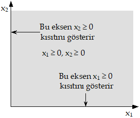
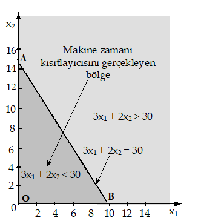
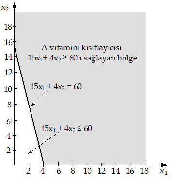
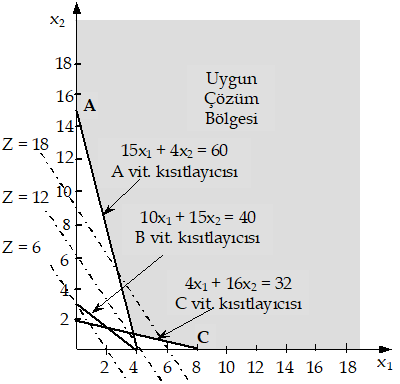

## İKİNCİ BÖLÜM

**DOĞRUSAL PROGRAMLAMA**

# 2.1. GİRİŞ

Günlük yaşantımızın hemen her anında, sahip olduğumuz kısıtlı kaynakların -para,
zaman, güç, yetenek vb.- sınırlayıcı koşulları altında davranmak zorunda
kalırız. Bu durum işletmeler için de geçerlidir. Sınırsız kaynaklara sahip bir
işletmeyle karşılaşmak imkansız gibidir. Bu yüzden, yönetim kararlarının çoğu
makine-techizat, para, emek, zaman, depolama kapasitesi, hammadde gibi
kaynakların ürün (makine-techizat, deterjan, gıda, giyecek, mobilya vb.)
üretiminde veya servis (taşıma ve üretim programlanması, reklam veya yatırım
planlanması vb.) hizmetlerinde etkin kullanımının sağlanmasıyla ilgilidir.
Doğrusal programlama kaynak kullanımıyla ilgili planlama ve karar almada karar
vericiye yol gösteren etkin bir matematiksel programlama tekniğidir. Gerçekte
kökeni çok eskilere, 1920’li yıllara kadar uzanmakla birlikte, doğrusal
programlama bugünkü anlamıyla ilk kez 1947 yılında ABD’nin askeri faaliyetlerini
planlamak amacıyla B. Dantzig tarafından geliştirilmiştir. Doğrusal
programlamanın gelişip önem kazanması "simpleks yöntem" olarak bilinen yöntemin
önerilmesinden sonra gerçekleşmiştir. Bilgisayar teknolojisinin hızlı gelişmesi
sonucunda doğrusal programlama endüstri, çevre, pazarlama, ulaştırma, enerji,
tarım ve sosyal problemlerin çözümünde yaygın olarak kullanılmaya başlanmıştır.

# 2.2. DOĞRUSAL PROGRAMLAMA PROBLEMİ

Herhangi bir problemin doğrusal programlama problemi olabilmesi için bazı
koşulları sağlaması gerekir. Bu koşullar aşağıda açıklanmıştır.

1.  Karar vericinin ulaşmak istediği bir amacı olmalıdır.

2.  İçlerinden en az bir tanesi amacı gerçekleştirecek olan alternatif
    stratejiler bulunmalıdır.

3.  Kaynakların sunumu sınırlı olmalıdır.

4.  Amaç, matematiksel olarak açıklanabilmeli ve kullanılan kaynakların
    sınırları eşitlik ve/veya eşitsizlikler biçiminde gösterilebilmelidir. Bu
    eşitlik veya eşitsizliklerin hepsi doğrusal olmalıdır.

Bu koşullar varsa problem, doğrusal programlama problemidir. Buradaki doğrusal
sözcüğü, iki veya daha fazla değişken arasındaki ilişkinin doğrusal olduğunu,
programlama sözcüğü ise çözüme belirli matematiksel teknikler kullanılarak
ulaşıldığını açıklamaktadır. Doğrusal ve programlama sözcükleri için yapılan
tanımların ve yukarıda açıklanan koşulların dikkate alınmasıyla doğrusal
programlama aşağıdaki gibi tanımlanabilir.

*Doğrusal Programlama*: Belirli doğrusal eşitliklerin veya eşitsizliklerin
kısıtlayıcı koşulları altında, doğrusal bir amaç fonksiyonunu en iyi (optimum)
kılan değişken değerlerinin belirlenmesi amacıyla gerçekleştirilen işlemler
kümesine doğrusal programlama denir.

En iyileme (optimizasyon) iki yolla gerçekleştirilir.

1\. Amaç fonksiyonu değerinin en büyüklenmesi (maksimizasyon)

2\. Amaç fonksiyonu değerinin en küçüklenmesi (minimizasyon)

Genellikle, olanaklar çerçevesinde toplam kârın en büyüklenmesi veya toplam
maliyetin en küçüklenmesi türündeki problemlerle karşılaşılmakla birlikte
değişik nitelikte amaçlar (en kısa süre, en kısa mesafe, en büyük gelir vb.) da
dikkate alınabilir.

# 2.3. DOĞRUSAL PROGRAMLAMA MODELLEMESİ

Bir tanıma göre model, anlaşılması güç ve karmaşık sistemlerin veya problemlerin
bir takım varsayımlarla basitleştirilmiş soyut bir temsilcisidir. Bir modelin
dayandığı varsayımların azlığı ya da çokluğu, o modelin uygulanabilirliği ve
yararlılığı açısından büyük bir önem taşır. Herhangi bir modelden gereği gibi
yararlanabilmek için modelin dayandığı varsayımların iyi bilinmesi gerekir.

### 2.3.1. Doğrusal Programlamanın Varsayımları

Her model gibi, doğrusal programlama modelleri de bir takım varsayımlara
dayanmaktadır. Bu varsayımlar aşağıdaki gibi açıklanabilir.

1.  Doğrusallık: Modeli oluşturan fonksiyonların hepsi doğrusal olmalıdır. Bu
    varsayıma açıklık kazandırmak için amaç fonksiyonunun Z = 3x1 + 8x2 olarak
    düzenlendiğini ve x1 = 10 olarak belirlendiğini düşünelim. Bu durumda amaç
    fonksiyonunun değeri Z = 3(10) + 8x2 olur. x1’in değeri 3 kat arttığında
    x1’in Z’ye katkısı da 3 kat artarak, Z = 3(30) + 8x2 olur. Bu artış x2’den
    bağımsızdır. Aynı durum x2 için de geçerlidir. Yani, x2’nin değeri sözgelimi
    20 kat arttığında x2’nin Z’ye katkısı da 20 kat artar. Bu artış x1’den
    bağımsızdır.

    Doğrusallık varsayımının kısıtlayıcı fonksiyonlardaki sonucu aynı yaklaşımla
    incelenebilir. Kısıtlayıcı fonksiyonun sol tarafı 1.5x1 + 3x2 olsun. x2 = 3
    iken sol taraf 1.5x1 + 3(3) olur. x2 = 30 olduğunda, yani değeri 10 kat
    arttığında kısıtlayıcının sol tarafına katkısı da aynı oranda (10 kat)
    artarak 1.5x1 + 3(30) olur. Bu artış x2’den bağımsızdır. Aynı durum diğer
    değişken için de geçerlidir.

    Değişken değerlerindeki artışın (azalışın) gerek amaç gerekse kısıtlayıcı
    fonksiyonlarda yol açtığı artış (azalış) arasındaki bu ilişki doğrusal
    programlamanın orantılı olma (oransallık) varsayımı olarak bilinir.

2.  Toplanabilirlik: Doğrusallık varsayımı değişkenlerin birbirlerini
    etkilemediğini de ortaya koymaktadır. Değişkenlerin bağımsızlığı doğrusal
    programlamanın toplanabilirlik varsayımı olarak bilinir. Bu varsayımla tüm
    faaliyetlerin tamamlanmasıyla ortaya çıkan değerin tek tek faaliyetlerin
    ortaya çıkardığı sonuç değerleri toplamına eşit olduğu anlatılmak
    istenmektedir. Bu varsayım doğrusal programlamanın doğrusal olmayan
    ilişkilerin bulunduğu problemlere uygulanmasını imkansız kılar.

3.  Deterministik olma (kesinlik-belirlilik): Doğrusal programlama modellerini
    oluşturan parametrelerin (Cj, aij, bi) bilindiği ve öngörülen dönem içinde
    değişmediği kabul edilir. Modelin bu parametrelerdeki değişimlere ne denli
    duyarlı olduğunun saptanmasına ilişkin işlemlerin tümü, duyarlılık
    çözümlemesi kapsamında yer alır. Bu konu ileride incelenecektir.

4.  Negatif olmama: Değişkenlerin negatif değer alamıyacağı, pozitif veya en
    azından sıfıra eşit olacağı düşüncesinin ürünü olan bir varsayımdır.

5.  Süreklilik: Değişkenlerin sürekli oldukları kabul edilir. Yani, karar
    değişkenleri negatif olmamak koşuluyla herhangi bir değer alabilir.
    Süreklilik varsayımına bölünebilirlik varsayımı da denir. Ancak, verilmiş
    durum nedeniyle, değişkenlerden bir ya da birkaçının veya hepsinin tamsayı
    olması uygulamada çok sık olarak ortaya çıkmaktadır. Değişkenlerin tamsayı
    olması istendiğinde, tamsayılı programlama söz konusu olur.

### 2.3.2. Doğrusal Programlama ile Modelleme

Doğrusal programlama modellerinin kurulması ile ilgili örnek problemlere
geçmeden önce, herhangi bir problemin doğrusal programlama modeli olarak ifade
edilmesinde izlenmesi gereken adımları açıklayalım.

1.  Değeri belirlenecek değişkenlerin tanımlanması ve değişkenlerin uygun
    matematik sembollerle gösterilmesi: Doğrusal programlama karar alma yöntemi
    olduğundan, bu değişkenlere "karar değişkenleri" denir.

2.  Amacın belirlenerek, karar değişkenlerinin doğrusal fonksiyonu olarak
    yazılması: Karar vericinin amacını yansıtan bu fonksiyona "amaç fonksiyonu"
    denir. Değeri çözümün elde edilmesinden sonra belirlenir.

3.  Kısıtlamaların, karar değişkenlerinin doğrusal fonksiyonları olarak eşitlik
    veya eşitsizlik biçiminde ifade edilmesi: Karar değişkenlerinin değerlerini
    sınırlandıran kısıtları yansıtan bu fonksiyonlara "kısıtlayıcı fonksiyonlar"
    veya kısaca "kısıtlayıcılar" denir. Sistemin tanımlanmasında kullanılan
    kısıtlayıcıların değerleri kesin ve önceden belirlenmiştir.

Bu açıklamaların ışığı altında çeşitli işletme problemlerinin doğrusal
programlama modeli olarak formüllenmesine geçebiliriz. Modellenecek problemlerin
doğrusal programlamanın uygulandığı alanlardan olmasına özen gösterdiğimizi
belirtmeliyiz.

Doğrusal programlamanın uygulama alanları sayılamıyacak kadar çok ve çeşitlidir.
Yaygın olarak kullanıldığı alanlar aşağıda açıklandığı gibidir:

1\. Ulaştırma veya dağıtım problemleri: Belirli merkezlerde gerçekleştirilen
üretim işlemi sonrasında ortaya çıkan mal ve hizmetlerin belirli merkezlerin
istemini karşılamak amacıyla dağıtılmasında katlanılacak ulaştırma maliyetleri
toplamını en küçükleyecek dağıtım planının programlanması ulaştırma problemleri
kapsamındadır. Doğrusal programlama problemlerinin özel bir biçimi olarak
nitelendirilen ulaştırma problemlerinin doğrusal programlama problemi olarak
çözülebilmesi için yukarıda benimsenen varsayımlara ek olarak, diğer bazı
varsayımların gerçekleşmesi ve belirli koşulların sağlanması gerekir. Bu konu,
üçüncü bölümde ulaştırma modeli başlığı altında ayrıntılı bir biçimde
inceleneceğinden burada ulaştırma probleminin kısaca açıklanmasıyla
yetinilecektir.

2\. Üretim planlaması: İşletmelerin karşılaştığı problemlerin çoğu para, işgücü,
hammadde, araç-gereç, alan, zaman gibi kısıtlı kaynakların belirli amaçlar
doğrultusunda çeşitli üretim faaliyetleri arasında en uygun biçimde dağıtılması
ve kullanılması yoluyla, kârın en büyüklenmesi veya maliyetlerin en
küçüklenmesidir. Doğrusal programlama bu türden problemlerin çözümlenmesinde
kullanılabilecek etkin bir araçtır.

**Örnek 2.1**: Bir ahşap işleme atölyesinde biri çekmeceli diğeri çekmecesiz iki
tip ahşap sıra üretilmektedir. Üretim ahşabın doğranması, doğranan parçaların
birleştirilmesi ve kalite kontrol aşamalarından oluşmaktadır. Doğrama makinesi
bir günde en fazla 30 m3 ahşap doğrayabilmektedir. Parçaların
birleştirilmesinden sorumlu iki işçinin günlük çalışma kapasitesi toplam 18
saattir. Kalite kontrol bölümü bir günde en fazla 14 saat çalışabilmektedir. Bir
adet çekmeceli sıranın üretiminde 3 m3, bir adet çekmecesiz sıranın üretiminde 2
m3 ahşap kullanılmaktadır. Bir çekmeceli sıra 2 saatte, bir çekmecesiz sıra 1
saatte birleştirilmektedir. Hangi tip olursa olsun bir sıranın kontrol işlemi 1
saat sürmektedir. Bir adet çekmeceli sıranın satışından 40 TL, bir adet
çekmecesiz sıranın satışından 30 TL kâr elde edilmektedir. Problemi, çözümü
firmanın kârının en büyük olmasını sağlayacak sıra sayılarını verecek doğrusal
programlama modeli olarak formülleyiniz.

**Çözüm 2.1**: Yukarıda açıklandığı gibi bir doğrusal programlama probleminin
modellenmesi için,

1.  Karar değişkenlerinin tanımlanması ve bunların uygun matematik sembollerle
    gösterilmesi,

2.  Amaç fonksiyonunun yazılması,

3.  Tüm kısıtlamaların (negatif olmama koşulu dahil), karar değişkenlerinin
    doğrusal fonksiyonları olarak eşitlik veya eşitsizlik biçiminde ifade
    edilmesi gerekmektedir.

Şimdi bu aşamaları izleyerek üretim planlaması probleminin doğrusal programlama
modelini kuralım.

Karar değişkenlerinin tanımlanması ve uygun matematik sembollerle gösterilmesi:
Problemin çözümü ile her bir üründen kaçar adet üretileceğine karar
verilecektir. Buna göre karar değişkenleri aşağıdaki gibi tanımlanabilir.

x1: Çekmeceli sıra üretim miktarı (adet)

x2: Çekmecesiz sıra üretim miktarı (adet)

Amaç fonksiyonunun yazılması: x1 ve x2’nin yukarıda verilen tanımları göz önünde
bulundurulduğunda günlük toplam kâr aşağıdaki gibi yazılır.

Toplam kâr = Z = 40x1 + 30x2

Amaç en büyük kârı sağlamak olduğuna göre amaç fonksiyonu aşağıdaki gibi
yazılacaktır.

Zenb = 40x1 + 30x2

Tüm kısıtlamaların, karar değişkenlerinin doğrusal fonksiyonları olarak eşitlik
veya eşitsizlik biçiminde yazılması: İşletme üretimini, doğrama makinesi ile
birleştirme ve kalite kontrol bölümlerinin günlük çalışma kapasitelerini göz
önünde bulundurarak gerçekleştirmek zorundadır. Bu nedenle bu üç üretim
faktörünün günlük çalışma kapasitelerinin dikkate alınmasıyla her bir üretim
faktörü için bir tane olmak üzere üç kısıtlayıcı yazılması gerekir.

Önce doğrama makinesinin günlük çalışma kapasitesini dikkate alalım. Problemde
verildiği gibi makine bir günde en fazla 30 m3 ahşap doğrayabilmektedir. 1 adet
çekmeceli sıra için 3 m3 ahşap doğranacağına göre, x1 adet çekmeceli sıra için
3x1 m3 ahşap doğranmalıdır. Benzer şekilde, 1 adet çekmecesiz sıra için 2 m3
ahşap doğranması gerektiğine göre, x2 adet çekmeceli sıra için 2x2 m3 ahşap
doğranmalıdır. İki ürün birlikte düşünüldüğünde doğranacak ahşap miktarı, 3x1 +
2x2 olur. En fazla 30 m3 ahşap doğranabildiğinden 3x1 + 2x2 30 yazılır. Böylece
makinenin doğrama kapasitesi formüllenerek ilk kısıtlayıcı fonksiyon yazılmış
olur.

Şimdi de parçaların birleştirilmesinden sorumlu işçilerin çalışma kapasitelerine
ilişkin kısıtlayıcıyı yazalım. 1 adet çekmeceli sıra 2 saatte birleştirildiğine
göre, x1 adet çekmeceli sıranın birleştirilmesi toplam 2x1 saatte tamamlanır.
Benzer şekilde, 1 adet çekmecesiz sıra 1 saatte birleştirildiğine göre, x2 adet
çekmeceli sıra toplam x2 saatte birleştirilir. İki ürün birlikte düşünüldüğünde
toplam birleştirme zamanı 2x1 + x2 olur. Birleştirme bölümü bir günde en fazla
18 saat çalışılabildiğinden 2x1 + x2 18 olmalıdır. Böylece birleştirme bölümünün
günlük çalışma zamanı kapasitesi formüllenerek ikinci kısıtlayıcı fonksiyon
yazılmış olur.

Son olarak kalite kontrol bölümünün günlük çalışma zamanı kapasitesinin sınırını
belirten kısıtlayıcı fonksiyonu yazalım. 1 adet çekmeceli sıra 1 saatte kontrol
edildiğine göre x1 adet çekmeceli sıra x1 saatte kontrol edilir. Benzer şekilde,
1 adet çekmecesiz sıra 1 saatte kontrol edildiğine gore, x2 adet çekmecesiz
sıranın kontrolü x2 saatte tamamlanır. İki ürün birlikte düşünüldüğünde, toplam
birleştirme zamanı, x1 + x2 olur. Kontrol bölümü bir günde en fazla 14 saat
çalışılabildiğinden x1 + x2 14 olması gerekir. Böylece kalite kontrol bölümünün
günlük çalışma zamanı kapasitesi formüllenerek son kısıtlayıcı belirlenmiş olur.

Üretim miktarları negatif olamayacağından, x1, x2 0 yazılmasıyla problem
aşağıdaki gibi modellenmiş olur.

Zenb = 40x1 + 30x2

3x1 + 2x2 30 Makine zamanı kısıtlayıcısı

2x1 + x2 18 Birleştirme zamanı kısıtlayıcısı

x1 + x2 14 Kalite kontrol zamanı kısıtlayıcısı

x1, x2 0

3\. Beslenme (diyet) veya yem karışım problemleri: Beslenme sorununun hem
kişilerin yaşamında hem de ekonomilerde önemli bir yeri vardır. Doğrusal
programlama hayvanların dengeli beslenmelerini sağlayacak en küçük maliyetli yem
karışımının araştırılmasında, düşük maliyetli yemek listesinin oluşturulmasında,
benzin veya bazı tekstil ürünleri ile ilgili karışımların belirli ölçütleri
sağlayacak biçimde hazırlanmasında yaygın biçimde kullanılmaktadır. Bu tür
problemlerde amaç genellikle, maliyetin en küçüklenmesidir.

**Örnek 2.2**: Dengeli beslenmek için bir günde en az 60 birim A, 40 birim B, 32
birim C vitamini alınması gerektiği bilinmektedir. Bu vitaminlerin bulunduğu iki
çeşit sebze (havuç ve ıspanak) vardır. 1 kg havuç 15 birim A, 10 birim B, 4
birim C; 1 kg ıspanak 4 birim A, 15 birim B, 16 birim C içermektedir. Havucun
fiyatı 3 TL, ıspanağın fiyatı 2 TL’dir. Günlük vitamin gereksinmesini en düşük
harcamayla karşılayacak sebze miktarlarını belirleyiniz.

**Çözüm 2.2**: Örnek 2.1’deki gibi önce karar değişkenlerini tanımlayalım.

Karar değişkenleri: Her bir sebzeden kaçar kg tüketileceğinin kararlaştırılacağı
bu problemde karar değişkenleri aşağıdaki gibi tanımlanabilir.

x1: Günlük havuç tüketim miktarı (kg)

x2: Günlük ıspanak tüketim miktarı (kg)

1 kg havuç 3 TL olduğuna göre x1 kg havucun maliyeti 3x1 TL, 1 kg ıspanak 2 TL
olduğuna göre x2 kg ıspanağın maliyeti 2x2 olur. Bu durumda x1 kg havuç, x2 kg
ıspanak satın almanın maliyeti,

Toplam maliyet = Z = 3x1 + 2x2

olur.

Amaç, bu toplamın en küçük olmasını sağlamak olduğuna göre, amaç fonksiyonu
aşağıdaki gibi yazılır.

Zenk = 3x1 + 2x2

Bir kg havuçta 15 birim A bulunduğuna göre, x1 kg havuçta 15x1 birim A bulunur.
Benzer şekilde 1 kg ıspanak 4 birim A içerdiğine göre, x2 kg ıspanak 4x2 birim A
içerir. Bu durumda x1 kg havuç, x2 kg ıspanak tüketildiğinde toplam 15x1 + 4x2
birim A alınmış olur. En az 60 birim A vitamini alınması gerektiğinden 15x1 +
4x2 60 olur. Bu eşitsizlik A vitamini kısıtlayıcısıdır. Benzer şekilde B
vitamini kısıtlayıcısı,

10x1 + 15x2 40

C vitamini kısıtlayıcısı,

4x1 + 16x2 32

olur.

Negatif tüketim söz konusu olamayacağına göre, x1, x2 0 yazılmasıyla model
tamamlanmış, problem aşağıdaki gibi formüle edilmiş olur.

Zenk = 3x1 + 2x2

15x1 + 4x2 60 A vitamini kısıtlayıcısı

10x1 + 15x2 40 B vitamini kısıtlayıcısı

4x1 + 16x2 32 C vitamini kısıtlayıcısı

x1, x2 0

Kısıtlayıcılardaki işareti alınması gereken vitamin miktarlarının belirtilen
değerlerin altına düşmeyeceğini fakat, bu miktarlardan fazla olabileceğini
belirtmektedir.

4\. Yatırım planlaması: Bilindiği gibi yatırım seçenekleri risk, büyüme oranı,
geri dönüş hızı gibi faktörler açısından birbirlerinden farklıdır. Yatırım
yapmak isteyen kişi veya kuruluşların bu faktörleri dikkate alması gerekir.
Doğrusal programlama hangi yatırım seçeneklerine hangi miktarlarda yatırım
yapılırsa yatırım planının riski en düşük veya getirisi en büyük olur gibi
soruların yanıtlanmasında yaygın biçimde kullanılır.

**Örnek 2.3**: Bir yatırımcının yatırım yapabileceği dört yatırım seçeneği ve
80000 TL birikimi vardır. Yatırım seçenekleri ve bunların getiri oranları
(yıllık yüzde olarak) Tablo 2.1’de verilmiştir. Yatırımlarla ilgili gelirlerin
gerçekleşmesi için gereken ortalama yatırım süreleri (yıl) aynı tablonun son
sütununda gösterilmiştir. Yatırımcı karşılaşabileceği risklere önlem olarak
yatırımların risk katsayılarını araştırmış ve bunları Tablo 2.1’deki gibi
belirlemiştir.

**Tablo 2.1**

| Yatırım Seçeneği | Getiri Oranı (%) | Risk Katsayısı | Yatırım Süresi  |
|------------------|------------------|----------------|-----------------|
| Hisse Senedi     | 80               | 8              | 3               |
| Banka Mevduatı   | 50               | 5              | 1               |
| Altın            | 30               | 2              | 5               |
| Tahvil           | 60               | 3              | 5               |

Yatırımcı aşağıdaki kısıtları sağlayacak en yüksek getirili yatırım planını
araştırmaktadır. Problemi doğrusal programlama olarak modelleyiniz.

1.  Hisse senedi yatırımı toplam yatırımın en az %20’si kadar olmalıdır.

2.  Altına yapılan yatırım, tahvile ayrılan paranın %10’undan fazla olmamalıdır.

3.  Yatırım planının ortalama riski 5’den fazla olmamalıdır.

4.  Toplam yatırım süresi en fazla 6 yıl olmalıdır.

**Çözüm 2.3**: Her bir yatırım seçeneğine yapılacak yatırım miktarı belirlenmek
istendiğine göre karar değişkenleri aşağıdaki gibi tanımlanabilir.

x1: Hisse senedine ayrılan para miktarı

x2: Banka mevduatı için ayrılan para miktarı

x3: Altına yapılan yatırım miktarı

x4: Tahvil için ayrılan para miktarı

Yatırımcının amacı toplam getirinin en büyük olmasını sağlamak olduğuna göre,
amaç fonksiyonu aşağıdaki gibi olur.

Zenb = 0.80x1 + 0.50x2 + 0.30x3 + 0.60x4

Çeşitli yatırım seçeneklerine ayrılan paralar toplamının eldeki para miktarına
eşit olması gerektiği aşağıdaki gibi formüllenir.

x1 + x2 + x3 + x4 = 80000

1.  Hisse senedi yatırım miktarının x1, toplam yatırım miktarının 80000 TL
    olduğu düşünüldüğünde, hisse senedi yatırım miktarına ilişkin kısıt
    aşağıdaki gibi formüllenir.

x1 0.20(80000) veya x1 16000

1.  Altına yapılan yatırımın tahvile ayrılan paranın %10’undan fazla olmaması
    istenmektedir. Buna göre altın için ayrılan paranın x3, tahvile ayrılan
    paranın x4 olduğu dikkate alındığında, x3 0.10x4 yazılır.

    Kısıtlayıcının sağ tarafında bir sabit olacak şekilde yazılması
    gerektiğinden,

x3 - 0.10x4 0

olur.

1.  Ortalama riskin 5’den fazla olmaması kısıtı aşağıda açıklanmıştır.

8x1 + 5x2 + 2x3 + 3x4 5

1.  Toplam yatırım süresi ile ilgili sınırlama aşağıdaki gibi formüle edilir.

3x1 + 1x2 + 5x3 + 5x4 6

Negatif yatırım söz konusu olamayacağına göre, x1, x2, x3, x4 0 yazılmasıyla
model tamamlanmış olur.

Doğrusal programlamanın uygulama alanlarından olan görev dağıtımının
planlanması, kuruluş yerinin seçimi, en kısa yolun veya en yüksek akışı
sağlayacak rotanın belirlenmesi ve oyun problemleri özel ön bilgi
gerektirdiklerinden şimdilik bu tür problemlerin doğrusal programlama
modellerinin kurulması üzerinde durulmayacaktır.

Yukarıdaki örnek problemlerin ve açıklamaların ortaya koyduğu gibi, doğrusal
programlama modellerinde doğrusal biçimde ifade edilen bir amaç fonksiyonu
vardır. Sayıları n olan karar değişkenleri x1, x2, ..., xn ile gösterilir. Bu
değişkenler arasında ilişki kuran katsayılar C1, C2, ..., Cn ile
gösterildiğinde, fonksiyon aşağıdaki gibi düzenlenir.

Z = C1x1 + C2x2 + . . . + Cnxn

Amaç Z’nin en büyük olmasını sağlayan değişkenler kümesinin belirlenmesi
olduğunda, Z (= Zenb) aşağıdaki gibi olur.

Zenb = C1x1 + C2x2 + . . . + Cnxn 2.1

Kısıtlayıcı fonksiyon sayısı m olmak üzere en büyükleme amaçlı bir doğrusal
programlama modelinin kısıtlayıcı fonksiyonları aşağıdaki gibi formüllenir.

Kısıtlayıcılar 2.2

x1, x2, ..., xn 0 Negatif olmama koşulu 2.3

Bu yazılışta Cj, aij, bi (i = 1, 2, ..., m; j = 1, 2, ..., n) problemin
değerleri bilinen sabitleridir ve aşağıdaki gibi tanımlanmışlardır.

Cj: xj karar değişkeninin amaç fonksiyonuna katkı katsayısı

aij: xj karar değişkeninin i’inci kısıtlayıcıya katkı katsayısı

bi: i’inci kısıtlayıcının sağ taraf sabiti

2.1-2.3 nolu bağıntılar kullanımıyla aşağıdaki gibi yazılır.

Zenb =

i = 1, 2, ..., m

xj 0 j = 1, 2, ..., n

Amaç, Z’nin en küçüklenmesi olduğunda, doğrusal programlama modeli kapalı
gösterimle aşağıdaki gibi yazılabilir.

Amaç fonksiyonu:

Zenk =

Kısıtlayıcı fonksiyonlar:

i = 1, 2, ..., m

Negatif olmama koşulu:

xj 0 j = 1, 2, ..., n

Genel olarak en büyükleme problemlerinin kısıtlayıcıları , en küçükleme
problemlerinin kısıtlayıcıları işaretli olurlar. Bununla birlikte,
kısıtlayıcılar , =, işaretli fonksiyonların herhangi bir karması da olabilir.

Bu açıklamaların ışığı altında doğrusal programlama problemi matris
gösterimiyle,

2.4

olarak yazılır. Burada,

**C**: 1 x n amaç fonksiyonu katsayılar vektörü

**A**: m x n kısıtlayıcıların katsayılar matrisi (teknoloji veya ağırlık
matrisi)

**x**: n x 1 karar değişkenleri vektörü

**b**: m x 1 kısıtlayıcıların sağ taraf sabitleri vektörü (gereksinme vektörü)

**0**: m x 1 sıfır vektörü

olarak tanımlanmıştır.

# 2.4. ÇÖZÜM YÖNTEMLERİ

Doğrusal programlama problemleri grafikle veya simpleks algoritması olarak
bilinen bir cebirsel yöntemle çözülebilir. Bu kesimde önce grafikle çözüm örnek
problemler çerçevesinde açıklanacak, daha sonra simpleks algoritması üzerinde
durulacaktır.

### 2.4.1. Grafikle Çözüm Yöntemi

Grafikle çözüm yöntemi oldukça açık ve kolay anlaşılır bir özelliğe sahip
olmakla birlikte en fazla üç değişken içeren doğrusal programlama problemlerinin
çözümünde herhangi bir karışıklığa neden olmadan kullanılabilir. Uygulamada
karşılaşılan problemlerin genellikle çok sayıda değişken içerdiği düşünülürse
grafikle çözüm üzerinde durmanın gereksiz olduğu düşünülebilir. Uygulama alanı
son derece sınırlı da olsa grafikle çözüm, doğrusal programlamanın biçimsel
bakımdan açıklanmasında olduğu

kadar, simpleks yöntemin kurallarına açıklık getirmesi bakımından son derece
yararlıdır. Grafiklerde basitlik, anlatımda sadelik sağlamak bakımından bu
bölümde iki değişkenli doğrusal programlama problemleri ele alınacaktır.

Genellikle bir probleme çeşitli işlemlerin uygulanmasıyla varılan sonucu
belirtmek amacıyla kullanılan "çözüm" teriminin doğrusal programlamadaki anlamı
oldukça farklıdır. Hangi yöntem kullanılırsa kullanılsın, doğrusal programlama
problemlerinin çözümüne ulaşmak ve sonucu değerlendirmek için çözümün doğrusal
programlamadaki anlamının ve taşıdığı özelliklerin bilinmesi gerekir. Doğrusal
programlama problemlerinde karar değişkenlerinin kısıtlayıcı fonksiyonları
sağlayan değerlerinin oluşturduğu kümeye "çözüm" denir. Çözüm, negatif olmama
koşulunu da sağlıyorsa "uygun (feasible) bir çözüm" dür. Amaç fonksiyonu için en
iyi değeri (en küçük veya en büyük) veren uygun çözüme "en iyi çözüm" denir.

Grafikle çözüm yönteminde aşağıdaki adımlar izlenir.

1.  Karar değişkenlerinin koordinat sisteminin yatay ve dikey eksenlerine
    yerleştirilmesi,

2.  Kısıtlayıcı fonksiyonların grafiğinin çizilmesi,

3.  Uygun çözüm bölgesinin belirlenmesi,

4.  En iyi çözümün araştırılması,

İlk olarak Örnek 2.1’deki problemi çözelim.

**Örnek 2.4**: Aşağıdaki doğrusal programlama problemini grafikle çözünüz.

Zenb = 40x1 + 30x2

3x1 + 2x2 30

2x1 + x2 18

x1 + x2 14

x1, x2 0

**Çözüm 2.4**: Grafikle çözüm yönteminin ilk adımı negatif olmama koşulunun
grafikle açıklanmasıdır. Problem iki değişkenli olduğundan yatay eksen x1’e,
dikey eksen x2’ye karşılık gelmek üzere çözümün araştırılacağı koordinat sistemi
belirlenir. x1 ekseni x1 = 0, x2 ekseni x2 = 0’a karşılık gelmektedir. x1 0,
x1’in sıfıra eşit veya sıfırdan büyük olduğunu gösterdiğinden, x1 ekseni ile bu
eksenin üst kısmı x1 0 koşulunu sağlar. x2 0, x2’nin sıfıra eşit veya sıfırdan
büyük olduğunu gösterdiğinden, x2 ekseni ile bu eksenin sağ tarafı x2 0 koşulunu
gerçekler. Böylece x1 0, x2 0 olmasını sağlayan bölge Şekil 2.1’deki gibi
görüntülenmiş olur. Şeklin ortaya koyduğu gibi çözüm, x1x2 düzleminin birinci
bölgesinde (kuadrantında) aranacaktır.

**Şekil 2.1**

Bu belirlemelerin ardından kısıtlayıcıların grafiği çizilir. Önce 3x1 + 2x2 30
kısıtlayıcısını ele alalım. Bu kısıtlayıcı fonksiyon, 3x1 + 2x2 = 30 doğrusunun
çizilmesiyle gösterilebilir. Bir doğrunun çizilmesi için iki noktanın yeterli
olduğu göz önüne alındığında çizim kolayca yapılabilir. Çizilmek istenen
doğrunun herhangi iki noktası değişkenlerden birine (x1 veya x2) herhangi iki
değer verip denklemden karşılığı olan diğer değişkenin (x2 veya x1) değerlerinin
hesaplanmasıyla belirlenebilir. Bu iki noktanın birleştirilmesiyle denklemi
temsil eden doğru çizilmiş olur. Doğrunun herhangi iki noktası yerine eksenleri
kestiği noktaları bulmak hesaplamada kolaylık sağlar. Bunun için denklemde önce
x1 = 0 koyarak karşılığındaki x2 değerini, sonra x2 = 0 koyarak karşılığındaki
x1 değerini hesaplamak yeterlidir. Bunlar sırasıyla doğrunun x2 ve x1
eksenlerini kestiği noktaların koordinatlarıdır.

Buna göre,

x1 = 0 için 3(0) + 2x2 = 30 x2 = 15 dolayısıyla doğrunun x2 eksenini kestiği
noktanın (Şekil 2.2’deki A) koordinatları x1 = 0, x2 = 15 olarak belirlenir.

x2 = 0 için 3x1 + 2(0) = 30 x1 = 10 dolayısıyla doğrunun x1 eksenini kestiği
noktanın (Şekil 2.2’deki B) koordinatları x1 = 10, x2 = 0 olarak belirlenmiş
olur.

(0, 15) ve (10, 0) noktalarının birleştirilmesiyle 3x1 + 2x2 = 30 doğrusunun
çizimi tamamlanmış olur. Doğru üzerindeki bütün noktalar için 3x1 + 2x2 = 30
gerçekleşir. Analitik geometriden hatırlanacağı gibi işaretli bir doğrusal
eşitsizlik bir doğru ile bu doğrunun altında kalan noktaları gösterir. Buna
göre, 3x1 + 2x2 30 eşitsizliğinin dikkate alınmasıyla uygun çözüm bölgesi Şekil
2.2’deki OAB bölgesi olarak belirlenmiş olur. Sınırları da dahil olmak üzere bu
bölgedeki her nokta 3x1 + 2x2 30 kısıtlayıcısını sağlar. Şekil 2.2’nin ortaya
koyduğu gibi x1 0, x2 0 kısıtlayıcısıyla belirlenen sonsuz çözüm bölgesi, 3x1 +
2x2 30’un dikkate alınmasıyla OAB alanına indirgenmiştir.

Şekil 2.2

Doğrama makinesinin çalışma kapasitesine ait kısıtlayıcı fonksiyon için
gerçekleştirilen işlemleri diğer iki kısıtlayıcı fonksiyon için tekrarlayalım.

2x1 + x2 = 18 eşitliğinde, x1 = 0 için x2 = 18; x2 = 0 için x1 = 9 olduğundan,
doğrunun x1 ekseninin kestiği noktanın koordinatları (9, 0), x2 eksenini kestiği
noktanın koordinatları (0, 18) olarak belirlenir. Söz konusu kısıtlayıcı
işaretli olduğundan, bu doğru ve altında kalan her nokta eşitsizliği sağlar.

x1 + x2 = 14 eşitliğinde, x1 = 0 için x2 = 14; x2 = 0 için, x1 = 14 olduğundan,
doğrunun x1 ekseninin kestiği noktanın koordinatları (14, 0); x2 eksenini
kestiği noktanın koordinatları (0, 14) olur. Bu kısıtlayıcı da diğer kısıtlayıcı
gibi işaretli olduğundan, bu doğru ve altında kalan her nokta eşitsizliği
sağlar.

Belirlenen noktaların birleştirilmesiyle, 2x1 + x2 = 18 ve x1 + x2 = 14
doğrularının çizimleri tamamlanmış olur. 3x1 + 2x2 30 kısıtlayıcısı da dahil
olmak üzere, tüm eşitsizliklerin yönünün dikkate alınmasıyla uygun çözüm bölgesi
Şekil 2.3’deki OABCD çok kenarlısı olarak belirlenmiş olur.

Bu bölgenin içinde ve sınırları üzerindeki tüm noktalar kısıtlayıcıları aynı
anda sağladığından, yukarıdaki tanıma uygun olarak, gri alan (sınırlar dahil)
problemin uygun çözüm bölgesidir. Bu alan içindeki (x1, x2) değerlerinin
oluşturduğu her bir nokta da uygun çözüm olarak nitelendirilir. Bu bölge dışında
kalan herhangi bir noktanın kısıtlardan bazılarını sağladığı bazılarını
sağlamadığı görülebilir.

**Şekil 2.3**

Doğrusal programlamanın en önemli özelliği uygun çözüm bölgesinin konveks
olmasıdır. Geometrik olarak, kenarlarında çukurlaşmalar olmayan ve içinde
delikler bulunmayan alan konvekstir. Bu alanın K ve L gibi herhangi iki noktası
göz önüne alındığında KL doğru parçasının tamamı alan içinde kalır.

Buraya kadar, kısıtlayıcı fonksiyonların ve negatif olmama koşulunun ortaya
koydukları çözüm bölgesi üzerinde durduk, amaç fonksiyonunun en iyilenmesi
konusuna değinmedik. Şimdi de amaç fonksiyonu için en iyi değeri (en küçük veya
en büyük) veren çözümün belirlenmesine geçelim.

En iyi çözümün araştırılması: Uygun çözüm bölgesi içindeki (sınırlar dahil)
sınırsız sayıdaki noktanın her biri bir karar seçeneği yani, uygun çözüm olmakla
birlikte bunların hepsi aynı derecede çekici değildir. Bazıları, genellikle de
bir tanesi, diğerlerinden daha çekicidir. Yani, karar vericiye daha fazla kâr
veya daha düşük maliyet sağlar. Sınırsız sayıdaki nokta arasından en iyi
olanının belirlenmesi gerekir. En iyi çözümün gerçekleştiği noktanın
belirlenmesi işlemi çok basittir. Çünkü bir doğrusal programlamanın en iyi
çözümü uygun çözüm bölgesinin uç noktalarından birinde (bazen birden fazla)
belirir. Bu nedenle çözüm bölgesini oluşturan sonsuz sayıda noktayı denetlemek
yerine, sınırlı sayıdaki uç noktanın incelenmesi yeterli olur. En iyi çözümün
ortaya çıktığı uç nokta sayısı birden fazla ise amaç fonksiyonu bu noktaların
her biri için aynı değeri alır. Bu özel durum yeri geldiğinde açıklanacaktır.
Uygun çözümün olmaması veya kısıtlayıcıların belirli bir çözüm bölgesi
tanımlamaması özel durumlar olup ileride açıklanacaktır.

En iyi çözümün ortaya çıktığı uç noktanın belirlenmesinde iki farklı yaklaşım
kullanılabilir. Birincisi amaç fonksiyonuna rasgele bir değer verip bu denklemin
belirlediği doğruyu çizmektir. Kâr amaçlı problemlerde eş-kâr veya sabit-kâr,
maliyet amaçlı problemlerde eş-maliyet veya sabit-maliyet çizgisi adı verilen bu
doğru uygun çözüm bölgesinin durumuna göre aşağı veya yukarıya doğru
kaydırılarak duruma göre en son veya en önce değdiği uç nokta belirlenir. Bu
nokta amaç fonksiyonunun değerini en iyiler ve bu noktanın koordinatları karar
değişkenlerinin en iyi değerini verir.

Probleme dönelim. Sözgelimi Z = 300 olsun. Z = 40x1 + 30x2 = 300 doğrusunun
çizimi (0, 10) ile (7.5, 0) noktalarının birleştirilmesiyle tamamlanır ve Şekil
2.3’de kesikli çizgi ile gösterilen EF doğrusu elde edilmiş olur. Birinci
kuadrantta olmak koşuluyla bu doğru üzerindeki bütün noktaların uygun çözüm
bölgesi içinde bulundukları ve sınırsız sayıdaki bu noktaların her biri için
kârın 300’e eşit olduğu görülebilir. Bu, en azından 300 TL kâr elde edileceği
anlamına gelir. 300 TL’den daha fazla kâr edilebileceği açıktır. Nitekim Z = 400
için çizilen doğrunun uygun çözüm bölgesindeki kısmı üzerindeki sınırsız
sayıdaki noktanın her biri için kârın 400’e eşit olduğu görülebilir. Görüldüğü
gibi orijinden uzaklaştıkça amaç fonksiyonunun değeri artmaktadır. Bu yüzden Z
doğrusunun uygun çözüm bölgesinin içinde kalmak koşuluyla yukarıya kaydırılması
gerekmektedir. Z doğrusu yukarıya kaydırıldığında en son uygun çözüm bölgesinin
B noktasından geçmektedir. Çözüm için bu noktanın koordinatlarının hesaplanması
gerekmektedir.

B noktasının koordinatları bu noktada kesişen 3x1 + 2x2 = 30 ile x1 + x2 = 14
denklemlerinin çözümü ile x1 = 2, x2 = 12 olarak belirlenir. Bu çözüm kümesi
problemin en iyi çözümüdür. Bu noktada Zenb = ZB = Z(2,12) = 440’a eşittir.

En iyi çözümü belirlemenin diğer bir yolu amaç fonksiyonunun uygun çözüm
bölgesinin uç noktalarındaki değerlerini hesaplayarak hesaplanan değerleri
karşılaştırmaktan ibarettir. Uygun çözüm bölgesinin O, A, B, C, D uç
noktalarının koordinatları ve amaç fonksiyonunun bu noktalardaki değerleri
aşağıda gösterilmiştir.

| Uç Nokta | x1 | x2 | Z = 40x1 + 30x2          |
|----------|----|----|--------------------------|
|  O       | 0  | 0  | Z = 40(0) + 30(0) = 0    |
|  A       | 0  | 14 | Z = 40(0) + 30(14) = 420 |
|  B       | 2  | 12 | Z = 40(2) + 30(12) = 440 |
|  C       | 6  | 6  | Z = 40(6) + 30(6) = 420  |
|  D       | 9  | 0  | Z = 40(9) + 30(0) = 360  |

Z değerlerinin ortaya koyduğu gibi en büyük değer B noktası için hesaplanan
440’dır. Buna göre, en yüksek kâr B noktasının gösterdiği üretim planı (x1 = 2,
x2 = 12) ile gerçekleşmektedir.

**Örnek 2.5**: Örnek 2.2’deki problemi grafik yöntemiyle çözünüz.

**Çözüm 2.5**: Önce uygun çözüm bölgesinin bulunacağı koordinat sistemini
belirleyelim. x1, x2 0 olduğundan çizim birinci kuadrant üzerinde yapılacaktır.
Vitamin A’dan başlayarak kısıtlayıcıların grafiğini çizelim. Vitamin A’ya ait
kısıt, 15x1 + 4x2 = 60 doğrusunun çizilmesiyle gösterilebilir. x1 = 0 için x2 =
15, x2 = 0 için x1 = 4 değerleri bu doğrunun çizimi için yeterli
koordinatlarıdır. 15x1 + 4x2 = 60 doğrusunun çizimi (0, 15) ve (4, 0)
noktalarının birleştirilmesiyle tamamlanır.

Doğru üzerindeki bütün noktalar için 15x1 + 4x2 = 60 olur. Analitik geometriden
hatırlanacağı gibi eşit büyük şeklindeki bir doğrusal eşitsizlik bir doğru ile
bu doğrunun üstündeki noktaları gösterir. Buna göre, 15x1 + 4x2 60
eşitsizliğinin dikkate alınmasıyla uygun çözüm bölgesi Şekil 2.4’deki gri alan
olarak belirlenir.

Şekil 2.4

Şimdi de B ve C vitamini kısıtlayıcılarının grafiklerini çizelim. 15x1 + 4x2 60,
10x1 + 15x2 40 ve 4x1 + 16x2 32 kısıtlayıcılarının hepsini aynı anda sağlayan
uygun çözüm bölgesi Şekil 2.5’deki alttan sınırlı üstten sınırsız gri alandır.

**Şekil 2.5**

Şekildeki gri bölgenin bükülü alt sınır sınır çizgisi üzerindeki uç noktalardan
biri amaç fonksiyonunun değerini en iyiler (en küçükler). En iyi çözümün hangi
uç noktasında gerçekleştiğini belirleyelim. Bu amaçla çizilen Z = 6, Z = 12, Z =
18 eş-maliyet doğruları kesikli çizgi ile gösterilmiştir. Bu doğrular ,
orijinden uzaklaştıkça amaç fonksiyonunun değerinin arttığını göstermektedir.
Amaç Z’yi en küçükleyen uç noktayı belirlemek olduğuna göre, orijinden
uzaklaşmak yerine ona yaklaşmalı ve ona en yakın uç noktasını belirlemeliyiz.

Orijine en yakın uç nokta B olduğundan en iyi çözüm bu noktada ortaya çıkar. B,
15x1 + 4x2 = 60 ve 4x1 + 16x2 = 32 doğrularının kesim noktası olduğundan bu
noktanın koordinatları 15x1 + 4x2 = 60 ve 4x1 + 16x2 = 32 eşitlikler sisteminin
çözümüyle bulunur. x1 = 3.71, x2 = 1.07 olarak belirlenen değerlerin amaç
fonksiyonunda yerine konulmasıyla, ZB = Zenk aşağıdaki gibi hesaplanır.

ZB = Zenk = 3(3.71) + 2(1.07) = 13.27

Uç noktaların amaç fonksiyonuna kazandırdığı değerler de hesaplanmış ve
hesaplanan değerler aşağıda verilmiştir. Bu yaklaşım da amaç fonksiyonuna en
küçük değeri kazandıran çözümün B’de ortaya çıktığını kanıtlamaktadır.

ZA = Z(0,15) = 3(0) + 2(15) = 30

ZB = Z(3.71,1.07) = 3(3.71) + 2(1.07) = 13.27

ZC = Z(8,0) = 3(8) + 2(0) = 24

### 2.4.2. Simpleks Çözüm Yöntemi

Simpleks çözüm yöntemi, doğrusal programlama problemlerine ardışık tekrar
yaklaşımıyla en iyi çözüm bulan bir cebirsel yöntemdir. Grafik yönteminde
açıklandığı gibi doğrusal programlama probleminin en iyi çözümü kısıtlayıcı
fonksiyonların belirlediği konveks bölgenin uç noktalarından birinde ortaya
çıkar. Simpleks yöntem, en iyi çözümü bu uç noktalarında araştırır. En iyi
çözümü araştırma sürecinde uç noktaların hepsi değil bazıları incelenir.
İncelenen noktaların sayısı en küçüktür. Bu yönüyle simpleks algoritması son
derece etkin bir hesaplama tekniğidir. Problemin boyutu ne olursa olsun gereken
sadece aritmetiğin dört işlemi ile bir kaç basit kuraldır. Simpleks çözüm
yönteminin temel ilkesi problemin yapısına uygun düşen değişkenlerin
tanımlanmasıyla orijinal doğrusal programlama probleminin standart forma
dönüştürülmesidir.

*Standart Form*: Sağ taraf sabitleri pozitif olmak üzere kısıtlayıcı
fonksiyonlarının hepsi eşitlik biçiminde olan ve değişkenlerinin hiçbiri negatif
olmayan doğrusal programlama modeli standart formdadır.

Bilindiği gibi, eşitsizlik biçimindeki kısıtlayıcı fonksiyonlar eşitsizliğin
yönü bakımından iki türlüdür. Eşitsizlikler,

i = 1, 2, ..., m

veya

i = 1, 2, ..., m

şeklinde ifade edilirler.

formundaki kısıtlayıcı fonksiyonları eşitlik haline dönüştürmek için
eşitsizliklerin sol taraflarına negatif olmayan birer değişken eklenir. Eklenen
bu değişkenlere "aylak değişken" denir. Aylak değişkenler genellikle, xn+1,
xn+2, ..., xn+m veya S1, S2, ..., Sm sembolleriyle gösterilir. Eklenen bu
değişkenler eşitsizliklerin sağ tarafları ile sol tarafları arasındaki farka
eşittir.

şeklindeki kısıtlayıcı fonksiyonları eşitlik şekline dönüştürmek için,
eşitsizliklerin sol taraflarından negatif olmayan birer değişken çıkarılır.
Eşitsizliklerin sağ ve sol tarafları arasındaki farkları gösteren bu
değişkenlere

"artık değişken" denir. Bu değişkenler de aylak değişkenler gibi xn+1, xn+2 ,
..., xn+m veya S1, S2, ..., Sm ile gösterilirler. Eklendikleri
kısıtlayıcılardaki katsayıları -1’e eşit olan bu değişkenlerin diğer
kısıtlayıcılardaki ve amaç fonksiyonundaki katsayıları sıfıra eşittir. Standart
form tanımına uygun olarak karar değişkenlerine uygulanan negatif olmama koşulu
aylak, artık ve diğer değişkenler için de geçerlidir.

Problemin aşağıdaki gibi formüllendiğini düşünelim.

Zenb =

i = 1, 2, ..., m

xj 0 j = 1, 2, ..., n

Problemin standart formu aşağıda gösterilmiştir.

Zenb =

i = 1, 2, ..., m

xj 0 j = 1, 2, ..., m + n

Görüldüğü gibi standart forma ulaşmak için n karar değişkenine m aylak değişken
eklenmiştir. Bir başka deyişle, bilinmeyen sayısı n’den (m + n)’ye çıkmıştır. (m
\+ n) bilinmeyene karşılık denklem sayısı m olduğundan herhangi n bilinmeyen
sıfıra eşitlenerek diğer m bilinmeyen, eşitlikler sisteminin birlikte
çözülmesiyle elde edilir. Bu yolla elde edilen çözüme "temel çözüm", temel
çözümdeki m değişkenin her birine "temel değişken" denir. Temel çözümde
bulunmayan (n - m) değişken "temel olmayan değişkenler" dir. Temel çözümlerin
sayısı sonludur. m denklem, n bilinmeyenin bulunduğu bir denklem sisteminde
temel çözüm sayısı, aşağıdaki formülden hesaplanır.

Bir çözümdeki temel değişkenlerin değerleri pozitifse bu çözüme "temel uygun
çözüm" denir. Temel uygun çözümler kümesi temel çözümlerin oluşturduğu kümenin
alt kümesi olduğundan temel uygun çözümlerin sayısı da yukarıdaki formülle
hesaplanan sayı ile sınırlıdır. Temel uygun çözümler arasından amaç fonksiyonuna
en iyi değeri kazandıran çözüme "en iyi çözüm" denir.

Problemin, simpleks yöntemin gerektirdiği formda düzenlenmesinden sonra en iyi
çözümün araştırılmasına geçilir. Simpleks yöntemin ardışık tekrarları "başlangıç
çözüm tablosu" adı verilen tablonun düzenlenmesinden sonra başlar. Başlangıç
çözüm tablosu ve giderek diğer tablolar aşağıdaki tablo esasına göre düzenlenir.
Özü aynı olmakla birlikte, bazı kaynaklarda simpleks tablolarının değişik
düzenlemelerine rastlanabilir.

**Tablo 2.2**

(2) (3)

|     |  (1)    |     |     |     |     |      |      |     |      |     |      |  (4) |
|-----|---------|-----|-----|-----|-----|------|------|-----|------|-----|------|------|
|     | TDV     | x1  | x2  | ... | xn  | xn+1 | xn+2 | ... | xn+j | ... | xn+m | ÇV   |
|     | 0 xn+1  | a11 | a12 | ... | a1n | 1    | 0    | ... | 0    | ... | 0    | b1   |
|     | 0 xn+2  | a21 | a22 | ... | a2n | 0    | 1    | ... | 0    | ... | 0    | b2   |
|     | ...     | ..  | ..  | ... | ..  | ..   | ..   | ... | 0    | ... | ...  | ...  |
|     | 0 xn+i  | ai1 | ai2 | ... | ain | 0    | 0    | ... | 1    | ... | 0    | bi   |
|     | ...     | ... | ..  | ... | ..  | ..   | ..   | ... | 0    | ... | ..   | ..   |
|     | 0 xn+m  | am1 | am2 | ... | amn | 0    | 0    | ... | 0    | ... | 1    | bm   |
| (5) | Zj      | 0   | 0   | ... | 0   | 0    | 0    | ... | 0    | ... | 0    | 0    |
| (6) | Zj - Cj | -C1 | -C2 | ... | -Cn | 0    | 0    | ... | 0    | ... | 0    | -    |

Tablo 2.2 kapsamındaki bölümler aşağıda açıklanmıştır.

**(1)** Temel değişkenler sütunu: Tablonun ilk sütunudur. Tablodaki çözümün
temel değişkenleri ile bu değişkenlerin amaç fonksiyonundaki katsayılarını
gösterir. Başlangıçtaki temel uygun çözümde standartlaştırmada kullanılan ve
katsayılarıyla birim matris oluşturan değişkenler bulunur. Başlangıç temel
değişkenlerinin çözüm değerleri kısıtlayıcıların sağ taraf sabitlerine, temelde
bulunmayan değişkenlerin değerleri ise sıfıra eşittir. Matematik olarak olanaklı
olan ve "başlangıç temel uygun çözüm" olarak isimlendirilen bu çözümün pratik
bir anlamı yoktur. Ancak, uygun çözümlerin ve giderek en iyi çözümün
bulunmasında bir başlangıç olması bakımından çok önemli olan bu çözüm,
grafikteki koordinat sisteminin orijin noktasına karşılık gelir.

**(2)** Gövde: Karar değişkenlerinin kısıtlayıcı fonksiyonlardaki
katsayılarından oluşan m x n matristir.

**(3)** Temel matris: Başlangıç uygun çözümdeki temel değişkenlerin kısıtlayıcı
fonksiyonlardaki katsayılarından oluşan n x n birim matristir. Yürürlükteki
temel değişkenler simpleks tablolarda her zaman birim matris biçimindedir.

**(4)** Çözüm vektörü: Tablodaki temel değişkenlerin çözüm değerlerini gösterir.

**(5)** Zj satırı: Temel değişkenlerin amaç fonksiyonundaki katsayıları ile xj
sütunundaki katsayıların karşılıklı çarpımlarının toplamından oluşur.

Başlangıç tablosunda, temelde yalnızca aylak değişkenlerin bulunmasının doğal
sonucu olarak, tüm Zj (j = 1, 2, .., n, n + 1, ..., n + m) değerleri sıfıra
eşittir. Temel değişkenlerde ortaya çıkan değişiklikler nedeniyle, amaç
fonksiyonu değerinin değişimi Zj’de toplanır. Ayrıca bu satırın son elemanı amaç
fonksiyonunun o simpleks tablodaki değerini gösterir. Başlangıç tablosunda bu
değer genellikle sıfır olarak bulunur (0(xn+1) + 0(xn+2) + ... + 0(xn+m) = 0).

**(6)** Zj - Cj satırı: Tablonun son satırıdır. Zj değerinden o sütunla ilgili
değişkenin amaç fonksiyonu katsayısının çıkarılmasıyla elde edilir. Zj - Cj
farkları xj değişkeninin temele alınmasının amaç fonksiyonunda yol açacağı
değişikliği ters işaretle gösterir. Bu satır tablodaki çözümün en iyi olup
olmadığının denetlenmesinde kullanılır.

Başlangıç çözümü bulunduktan sonra, amaç fonksiyonunun değerini artıran yeni bir
temel uygun çözüm araştırılır. Bunun için, başlangıçta temelde bulunan
değişkenlerden bir tanesinin temeli terketmesi, onun yerine temelde bulunmayan
değişkenlerden bir tanesinin çözüme girmesi gerekir. Çıkan ve giren
değişkenlerin seçimi nasıl yapılacaktır? Z’nin değerini en hızlı şekilde
artırabilmek için amaç fonksiyonuna marjinal katkısı en büyük olan değişken
temele ilk giren değişken olacaktır. Marjinal katkının büyüklüğü değişkenlerin
amaç fonksiyonundaki katsayılarının incelenmesiyle belirlenir. O halde, simpleks
tablosu göz önüne alındığında giren değişkeni belirleyen ölçüt şudur: Tablonun
son satırındaki negatif değerler arasında mutlak değerce en büyük değerin
bulunduğu gözeye ait değişken çözüme girmelidir. Giren değişken seçiminde
kullanılan bu kurala "Dantzig kuralı" denir. Mutlak değerce en büyük negatif
değerli birden fazla Zj - Cj varsa temele giren değişkenler arasında bağ olduğu
söylenir. Böyle bir durumda izlenmesi gereken yöntem ileride açıklanacaktır.

Çözüme yeni bir değişken girdiğine göre, temel değişken olarak işlem gören aylak
değişkenlerden bir tanesinin çözümü terketmesi gerekir. Bu yolla çözümdeki
değişken sayısının aynı kalması sağlanmış olur. Çözümü terkedecek değişkenin
bulunması için çözüm vektörünün elemanları çözüme girmek üzere seçilmiş bulunan
değişkenin sütunundaki katsayılara bölünür. Bölme işlemi sonucunda elde edilen
oranlar arasından (negatif ve sıfır değerde olanların dışında) en küçük değerde
olan belirlenir. Yalnızca pozitif katsayıların bölen olarak alınmasının nedeni
açıktır. Sıfır, amaç fonksiyonunun değerinde bir değişiklik yaratmamakta,
negatif sayılar ise uygun olmayan bir çözüme yol açmaktadır. Seçilen bu oranın
bulunduğu satırdaki değişken temeli terkedecektir. Simpleks çözümde, temele
girecek değişkenin bulunduğu sütuna "anahtar sütun", temeli terkedecek
değişkenin bulunduğu satıra "anahtar satır", anahtar satırla anahtar sütunun
kesiştiği yerdeki sayıya "anahtar sayı" denir. Buna göre, düzenlenecek yeni
simpleks tablosundaki temel değişkenler sütunu, çıkan değişken yerine giren
değişkenin yazılmasıyla oluşturulacaktır.

Çözüme gireceği kesinleşen değişken ancak ve ancak bu değişkenle ilgili sütun
vektörün (anahtar sütunun) çözümü terkedecek değişkenle ilgili sütun vektöre
benzemesiyle yani, bir "birim vektör" olmasıyla olanaklıdır. Anahtar sütunu,
birim sütun vektöre dönüştürmede "Gauss Jordan Eliminasyon" yönteminden
yararlanılır. Bu yönteme göre yapılacak ilk iş anahtar satır elemanlarını
anahtar sayıya bölerek anahtar satırın yeni elemanlarının hesaplanmasıdır. Bu
işlem sonunda elde edilen değerler yeni tablonun yeni temel değişken satırına
yazılır.

Diğer bütün satırların (Zj ve Zj - Cj satırları dışında) yeni elemanları
aşağıdaki formülle bulunur. Bunu yeni temel uygun çözümlerin elde edilmesi
izler.

**Örnek 2.6**: Aşağıdaki problemi simpleks yöntemle çözünüz.

Zenb = 40x1 + 30x2

3x1 + 2x2 30

2x1 + x2 18

x1 + x2 14

x1, x2 0

**Çözüm 2.6**: Yukarıda açıklandığı gibi, simpleks yöntem problemin standart
formda yazılmasını gerektirdiğinden önce bu şartı yerine getirelim. Bunun için
işaretli kısıtlayıcıları eşitlik biçiminde yazalım. 3x1 + 2x2 30 eşitsizliğinin
eşitlik formunda yazılması için eşitsizliğin sol tarafına bir aylak değişken
(x3) ekleyelim. Bu durumda, 3x1 + 2x2 + x3 = 30 olur. 3x1 + 2x2 = 30 ise x3 = 0,
3x1 + 2x2 30 ise x3 eşitsizliğin iki tarafı arasındaki farka eşittir. Bu nedenle
x3’ün değeri 0 ile 30 arasında değişir. Benzer şekilde 2x1 + x2 18
eşitsizliğinin sol tarafına x4, x1 + x2 14 eşitsizliğinin sol tarafına x5 aylak
değişkenlerinin eklenmesiyle sistemin tüm eşitsizlikleri eşitlik biçiminde
yazılmış olur. İkinci kısıtlayıcıya eklenen x4’ün değeri 0 ile 18, üçüncü
kısıtlayıcıya eklenen x5’in değeri 0 ile 14 arasında değişir. Eklendikleri
fonksiyonlardaki katsayıları +1 olan aylak değişkenlerin diğer kısıtlayıcı
fonksiyonlar ile amaç fonksiyonundaki katsayıları sıfıra eşittir. Problemin
standart biçimi aşağıda gösterilmiştir.

Zenb = 40x1 + 30x2 + 0x3 + 0x4 + 0x5

3x1 + 2x2 + 1x3 + 0x4 + 0x5 = 30

2x1 + x2 + 0x3 + 1x4 + 0x5 = 18

x1 + x2 + 0x3 + 0x4 + 1x5 = 14

x1, x2, x3, x4, x5 0

Simpleks yöntemin gerektirdiği formun düzenlemesiyle belirlenen model
katsayılarını, başlangıç tablosuna aktaralım. Aktarma işlemi sonucunda Zj ve Zj
\- Cj satırları dışında tablo doldurulmuş olur. Artık bu iki satırın elemanlarını
hesaplayabiliriz.

Z1 = 0(3) + 0(2) + 0(1) = 0

Z2 = 0(2) + 0(1) + 0(1) = 0

Z3 = 0(1) + 0(0) + 0(0) = 0

Z4 = 0(0) + 0(1) + 0(0) = 0

Z5 = 0(0) + 0(0) + 0(1) = 0

Yukarıda hesaplanan Zj değerleri ile Cj’lerin dikkate alınmasıyla Zj - Cj satır
elemanları aşağıdaki gibi hesaplanacaktır.

Z1 - C1 = 0 - 40 = -40

Z2 - C2 = 0 - 30 = -30

Z3 - C3 = Z4 - C4 = Z5 - C5 = 0 - 0 = 0

Bulunan bu değerlerin başlangıç çözüm tablosuna yerleştirilmesiyle simpleks
başlangıç çözüm tablosu aşağıdaki gibi düzenlenmiş olur.

## Tablo 2. 3

| TDV     | x1    | x2  | x3 | x4 | x5 | ÇV | Oran |
|---------|-------|-----|----|----|----|----|------|
|  0 x3   | 3     | 2   | 1  | 0  | 0  | 30 | 30/3 |
|  0 x4   | **2** | 1   | 0  | 1  | 0  | 18 | 18/2 |
|  0 x5   | 1     | 1   | 0  | 0  | 1  | 14 | 14/1 |
| Zj      | 0     | 0   | 0  | 0  | 0  | 0  |      |
| Zj - Cj | -40   | -30 | 0  | 0  | 0  | -  |      |

Çıkan değişken

Giren değişken (anahtar satır)

(anahtar sütun)

Yeni bir temel çözüm araştırmadan önce yürürlükteki temel uygun çözümün en iyi
olup olmadığının kontrol edilmesi gerekir. Zj - Cj değerlerinin hepsi sıfır ya
da pozitif olmadığından başlangıç tablosundaki çözüm en iyi değildir. Önce
temele girecek değişkeni belirleyelim. Zj - Cj saırında negatif değerli iki
eleman vardır. olduğundan x1’in temele alınması gerekir. İzleyen tabloda x1
temel değişken olarak karşımıza çıkacaktır.

Anahtar satırı bir başka deyişle, temelden çıkacak değişkeni belirlemek için,
çözüm vektörü elemanlarını bire bir olmak koşuluyla, anahtar sütun elemanlarına
bölelim. Bölme işlemi sonucunda elde edilen değerler, başlangıç tablosunun hemen
sağında oran başlığı altında gösterilmiştir. En küçük değerli (9) oran x4
değişken satırı için hesaplanmıştır. Bu durumda, x4’ün temeli terketmesi
gerektiği kararlaştırılır. Buna göre, yeni düzenlenecek olan birinci simpleks
tablosundaki temel değişkenler sırasıyla, x3, x1 ve x5 olacaktır.

x4 değişken satırı anahtar satır, x1 değişken sütunu anahtar sütun olduğuna göre
anahtar sayı 2 olur([^1]). Anahtar sayının belirlenmesinden sonra anahtar satır
elemanlarının anahtar sayıya bölünmesi ve anahtar satırın yeni elemanlarının
hesaplanması gerekir.

[^1]: Bu ve bundan sonraki simpleks tablolarda anahtar sayılar koyu basılarak
    kolayca fark edilmeleri sağlanmıştır.

Anahtar satırın eski elemanları: [2 1 0 1 0 18]

olduğuna göre anahtar satırın yeni elemanları aşağıdaki gibi elde edilir.

[2/2 1/2 0/2 1/2 0/2 18/2] = [1 1/2 0 1/2 0 9]

Bulunan değerlerin, yeni simpleks tablosunun x1 değişken satırına
yerleştirilmesinden sonra, yeni tablonun diğer elemanları hesaplanabilir. x3
değişken satırından başlayarak diğer satır elemanlarını hesaplayalım.

x3 değişken satırının eski elemanları: [3 2 1 0 0 30]

bu satırla anahtar sütunun kesiştiği yerdeki sayı 3 ve anahtar satırın yeni
elemanları,

[1 1/2 0 1/2 0 9]

olduğuna göre, x3 değişken satırının yeni elemanları aşağıdaki gibi elde edilir.

[3 2 1 0 0 30]

(-3) [1 1/2 0 1/2 0 9]

[3-3(1) 2-3(1/2) 1-3(0) 0-3(1/2) 0-3(0) 30-3(9) ]

= [ 0 1/2 1 -3/2 0 3]

Aynı formülün kullanılmasıyla, x5 değişken satırının yeni elemanları aşağıdaki
gibi hesaplanır.

[1 1 0 0 1 14]

(-1) [1 1/2 0 1/2 0 9]

[1-1(1) 1-1(1/2) 0-1(0) 0-1(1/2) 1-1(0) 14-1(9) ]

= [ 0 1/2 0 -1/2 1 5]

Zj satır elemanları aşağıdaki gibi hesaplanmıştır.

Z1 = 0(0) + 40(1) + 0(0) = 40

Z2 = 0(1/2) + 40(1/2) + 0(1/2) = 20

Z3 = 0(1) + 40(0) + 0(0) = 0

Z4 = 0(-3/2) + 40(1/2) + 0(-1/2) = 20

Z5 = 0(0) + 40(0) + 0(1) = 0

Zj - Cj satır elemanları, Zj değerlerinden ilgili Cj değerlerinin çıkarılmasıyla
aşağıdaki gibi hesaplanır.

Z1 - C1 = 40 - 40 = 0

Z2 - C2 = 20 - 30 = -10

Z3 - C3 = 0 - 0 = 0

Z4 - C4 = 20 - 0 = 20

Z5 - C5 = 0 - 0 = 0

Elde edilen bu değerlerin, simpleks tablosuna yerleştirilmesiyle birinci çözüm
tablosu aşağıdaki gibi düzenlenmiş olur.

## Tablo 2.4

| TDV     | x1 | x2      | x3 | x4   | x5 | ÇV  | Oran |
|---------|----|---------|----|------|----|-----|------|
|  0 x3   | 0  | **1/2** | 1  | -3/2 | 0  | 3   | 6    |
| 40 x1   | 1  | 1/2     | 0  |  1/2 | 0  | 9   | 18   |
|  0 x5   | 0  | 1/2     | 0  | -1/2 | 1  | 5   | 10   |
| Zj      | 40 | 20      | 0  | 0    | 0  | 360 |      |
| Zj - Cj | 0  |  -10    | 0  | 20   | 0  | -   |      |

Tablo 2.4’deki çözümde Z2 - C2 0 olduğundan çözüm en iyi değildir. Z’nin
değerini artırmak için x2 temele alınmalıdır. Temelden ayrılan değişkenin
belirlenmesi amacıyla hesaplanan oranlar Tablo 2.4’ün sağında gösterilmiştir. En
küçük oran x3 için hesaplandığından x3’ün temelden ayrılmasına karar verilir. x3
değişken satırı anahtar satır, x2 değişken sütunu anahtar sütun olduğundan
anahtar sayı 1/2 olur. Anahtar satır elemanlarının anahtar sayıya bölünmesiyle
anahtar satırın yeni elemanları şöyle olur:

[0 1 2 -3 0 6]

Bulunan bu değerlerin, yeni tablonun x2 değişken satırına yerleştirilmesinden
sonra, söz konusu tablonun diğer elemanları hesaplanabilir. x1 değişken
satırından başlayarak diğer satır elemanlarını hesaplayalım.

x1 değişken satırının eski elemanları: [1 1/2 0 1/2 0 9],

bu satırla anahtar sütunun kesiştiği yerdeki sayı 1/2 ve anahtar satırın yeni
elemanları, [0 1 2 -3 0 6] olduğuna göre, x1 değişken satırının yeni elemanları
aşağıdaki gibi elde edilir.

[1 1/2 0 1/2 0 9]

(-1/2)[0 1 2 -3 0 6]

= [1 0 -1 2 0 6]

Aynı formülün kullanılmasıyla, x5 değişken satırının yeni elemanları,

[0 1/2 0 0 0 5]

(-1/2)[0 1 2 -3 0 6]

= [0 0 -1 3/2 0 2]

olarak hesaplanır.

Zj satır elemanları aşağıdaki gibi hesaplanmıştır.

Z1 = 30(0) + 40(1) + 0(0) = 40

Z2 = 30(1) + 40(0) + 0(0) = 30

Z3 = 30(2) + 40(-1) + 0(-1) = 20

Z4 = 30(-3) + 40(2) + 0(1) = -10

Z5 = 30(0) + 40(1) + 0(0) = 0

Zj değerlerinden ilgili Cj değerlerinin çıkarılmasıyla hesaplanan Zj - Cj satır
elemanları, Tablo 2.5’in son satırında gösterilmiştir.

Amaç fonksiyonunun bu çözümdeki değeri, Z = 30(6) + 40(6) + 2(0) = 420’ye
eşittir. Buna göre, yeni (ikinci) çözüm tablosu aşağıdaki gibi elde edilir.

**Tablo 2.5**

| TDV     | x1 | x2 | x3 | x4    | x5 | ÇV  | Oran |
|---------|----|----|----|-------|----|-----|------|
| 30 x2   | 0  | 1  | 2  | -3    | 0  | 6   | -    |
| 40 x1   | 1  | 0  | -1 | 2     | 1  | 6   | 3    |
|  0 x5   | 0  | 0  | -1 | **1** | 0  | 2   | 2    |
| Zj      | 40 | 30 | 20 | -10   | 0  | 420 |      |
| Zj - Cj | 0  | 0  | 20 | -10   | 0  | -   |      |

İkinci temel uygun çözümün bulunduğu Tablo 2.5’deki Zj - Cj değerlerinin ortaya
koyduğu gibi çözüm en iyi değildir. Z4 - C4 \< 0 olduğundan, x4 temele
alınmalıdır. Temeli terkedecek değişkeni belirlemek için hesaplanan oranlar
Tablo 2.5’in sağında gösterilmiştir. En küçük oran x5 için hesaplandığından, x5
temeli terkedecektir. Anahtar sayının 1’e eşit olduğunun belirlenmesinin
ardından bilinen işlemlerin tekrarlanmasıyla yeni çözüm tablosu aşağıdaki gibi
elde edilir.

**Tablo 2.6**

| TDV     | x1 | x2 | x3 | x4 | x5 | ÇV  |
|---------|----|----|----|----|----|-----|
| 30 x2   | 0  | 1  | -1 | 0  |  3 | 12  |
| 40 x1   | 1  | 0  |  1 | 0  | -2 | 2   |
|  0 x4   | 0  | 0  | -1 | 1  |  1 | 2   |
| Zj      | 40 | 30 | 10 | 0  | 10 | 440 |
| Zj - Cj | 0  | 0  | 10 | 0  | 10 | -   |

Tablodaki Zj - Cj değerlerinin hepsinin sıfır veya pozitif olduğu görülmektedir.
Bu durum çözüme yeni değişkenlerin sokulması ile Z’de artış sağlanamayacağı
anlamına gelmektedir. Yani, tablodaki x1 = 2, x2 = 12, x3 = 2, x4 = 2, x5 = 0
çözümü en iyidir. Bu çözümde Zenb = 440 olarak belirlenmiştir. Buna göre her gün
2 adet çekmeceli, 12 adet çekmecesiz olmak üzere toplam 14 adet sıra üretilmesi
kararlaştırılacaktır. Ürünlerin birim satışlarından sağlanan kârlar aynı olmak
koşuluyla en yüksek kâr 440 TL olacaktır.

Aylak değişkenlerin en iyi çözüm değerleri x3 = 0, x4 = 2 ve x5 = 0 olarak elde
edilmiştir. Eşitsizliklerin sağ tarafları kullanılabilir, sol tarafları
kullanılan kaynak miktarlarını, bu ikisi arasındaki fark ise kullanılmayan
kaynak miktarlarını gösterdiğinden doğrama makinesi ile kalite kontrol bölümünün
tam kapasite ile çalıştıkları anlaşılır. Nitekim, x1 ve x2 değişkenlerinin en
iyi çözüm değerleri, ahşap doğrama makinesi kısıtına yerleştirildiklerinde,

3x1 + 2x2 = 3(2) + 2(12) = 30

kalite kontrol kısıtına yerleştirildiklerinde,

x1 + x2 = 2 + 12 = 14

olur.

x4 = 2, birleştirme bölümünün günde 2 saat aylak kaldığını göstermektedir.

Simpleks yöntemi sadece en büyükleme amaçlı problemlere değil, en küçükleme
amaçlı problemlere de uygulanır. En küçükleme probleminin çözümü ile en
büyükleme probleminin çözümü arasındaki en önemli fark Zj - Cj değerlerinin
incelenmesinde ve değerlendirilmesinde ortaya çıkar.

En büyükleme problemlerinden farklı olarak, en küçükleme problemlerinde tüm Zj -
Cj değerleri sıfır veya negatif ise çözüm en iyidir. Pozitif değerli Zj - Cj
katsayıları çözümün geliştirilebileceğini gösterir. Bunun doğal sonucu olarak
çözüme girecek değişken en büyük Zj - Cj değerli olandır. Bunun dışında çözüm
süreci aynen en büyükleme problemlerindeki gibidir. Yöntemin en küçükleme amaçlı
doğrusal programlama problemlerine uygulanmasını, daha önce grafikle çözdüğümüz
örnek 2.2 ile açıklayalım.

**Örnek 2.7** : Aşağıdaki problemi simpleks yöntemiyle çözünüz.

Zenk = 3x1 + 2x2

15x1 + 4x2 60 A vitamini kısıtlayıcısı

10x1 + 15x2 40 B vitamini kısıtlayıcısı

4x1 + 16x2 32 C vitamini kısıtlayıcısı,

x1, x2 0

**Çözüm 2.7**: Yukarıda açıklandığı gibi en küçükleme amaçlı bir doğrusal
programlama probleminin çözüm süreci en büyükleme probleminin çözüm süreciyle
aynıdır. Bu yüzden öncelikle problemin standart biçimde yazılması gerekir.
Problemin kısıtlayıcıları işaretlidir. Daha önce açıklandığı gibi, işaretli bir
kısıtlayıcının eşitlik şekline dönüştürülmesi için eşitsizliğin sol tarafından
negatif olmayan bir artık değişkenin çıkarılması gerekir. Artık değişkenlerin
modele sokulmasıyla kısıtlayıcılar aşağıdaki gibi elde edilir.

15x1 + 4x2 - x3 = 60 A vitamini kısıtlayıcısı

10x1 + 15x2 - x4 = 40 B vitamini kısıtlayıcısı

4x1 + 16x2 - x5 = 32 C vitamini kısıtlayıcısı,

Tüm değişkenler negatif olmadığından, x1, x2,,x3, x4, x5 0 olur.

Böylece, eşitlik sisteminin x1 = 0, x2 = 0 uç noktasındaki başlangıç çözümü
aşağıdaki gibi elde edilir.

x3 = -60

x4 = -40

x5 = -32

Negatif olmayan değişkenlerin negatif olmaları, x3 = -60, x4 = -40, x5 = -32
çözümünün uygun olmadığı anlamına gelir. Bu nedenle, uygunluk koşulunu
gerçekleyen bir başlangıç çözümünün araştırılması zorunludur. Başlangıç çözümünü
araştırmanın yolu, önceden olduğu gibi, katsayılar matrisi yanında bir birim
matris oluşturmaktır. Bu amaçla, artık değişkenlerle eşitlik haline
dönüştürülmüş kısıtlayıcılara Ai ile gösterilen negatif olmayan birer yapay
değişken eklenir. Birinci kısıtlayıcıya A1, ikinci kısıtlayıcıya A2, üçüncü
kısıtlayıcıya A3 yapay değişkenlerinin eklenmesiyle kısıtlayıcı fonksiyonlar
aşağıdaki gibi düzenlenmiş olur.

15x1 + 4x2 - x3 + A1 = 60

10x1 + 15x2 - x4 + A2 = 40

4x1 + 16x2 - x5 + A3 = 32

Negatif olmama koşulu yapay değişkenler için de geçerli olduğundan, standart
formun negatif olmama kısıtı aşağıdaki gibi açıklanır.

x1, x2, x3, x4, x5, A1, A2, A3 0

x1 = 0, x2 = 0, x3 = 0, x4 = 0, x5 = 0 olduğunda, söz konusu kısıtlayıcılar şu
başlangıç temel uygun çözümü verir: A1 = 60, A2 = 40, A3 = 32

Bilindiği gibi, aylak ve artık değişkenlerin amaç fonksiyonu katsayıları sıfıra
eşittir. Yapay değişkenler için bu durum farklılık gösterir. Yukarıda
belirtildiği gibi, ilk temel uygun çözümün bulunmasına yardımcı olmalarına
karşın hiçbir fiziki ve ekonomik anlamı olmayan bu değişkenlerin en iyi çözüme
girmeleri engellenmelidir. Bunu gerçekleştirmek için, yapay değişkenlerin amaç
fonksiyonundaki katsayılarının çok büyük sayılar olduğu düşünülür. Genellikle,
büyük değerli katsayılar M ile gösterildiğinden uygulanan yönteme "Büyük M
Yöntemi" denilmektedir. Büyük M yöntemi yalnızca en küçükleme problemlerine
değil, en büyükleme problemlerine de uygulanabilir. En büyükleme problemlerinde
"M" mutlak değerce çok büyük bir negatif sayı olarak alınır. Böylece, temelde
pozitif değerli bir yapay değişken kaldığında, amaç fonksiyonunun değerini
arttırılmak mümkün olmaz. Bu yolla, yapay değişkenlerin çözüme girmeleri
engellenmiş olur.

Buna göre, problemin standart biçiminin amaç fonksiyonu aşağıdaki gibi
düzenlenir.

Zenk = 3x1 + 2x2 + 0x3 + 0x4 + 0x5 + MA1 + MA2 + MA3

Problemin başlangıç temel uygun çözümü aşağıdaki tabloda gösterilmiştir.

**Tablo 2.7**

| TDV     | x1    | x2     | x3 | x4 | x5 | A1 | A2 | A3 | ÇV   | Oran  |
|---------|-------|--------|----|----|----|----|----|----|------|-------|
|  M A1   | 15    | 4      | -1 | 0  | 0  | 1  | 0  | 0  | 60   | 60/4  |
|  M A2   | 10    | 15     | 0  | -1 | 0  | 0  | 1  | 0  | 40   | 40/15 |
|  M A3   | 4     | **16** | 0  | 0  | -1 | 0  | 0  | 1  | 32   | 32/16 |
| Zj      | 29M   | 35M    | -M | -M | -M | M  | M  | M  | 132M |       |
| Zj - Cj | 29M-3 | 35M-2  | -M | -M | -M | 0  | 0  | 0  | -    |       |

Başlangıç tablosunun düzenlenmesinden sonra, çözümün en iyi olup olmadığının
kontrol edilmesi gerekir. Tüm Zj - Cj 0 olmadığından, çözüm en iyi değildir.
Daha gelişmiş bir çözüm için bir değişkenin temelden çıkartılması başka bir
değişkenin temele alınması gerekir. Tanım gereği Z’yi en hızlı biçimde azaltacak
değişken temele alınacaktır. Z2 - C2 = 35M - 2 en büyük pozitif sayı olduğundan
x2 temele alınır.

Temelden çıkacak değişkeni bulmak için, önceden olduğu gibi, çözüm vektörü
elemanları bire bir olmak koşuluyla anahtar sütun elemanlarına bölünür. En küçük
pozitif değerli oranın bulunduğu satırdaki değişken temeli terkeder. Başlangıç
tablosunun sağında gösterilen oranlar incelendiğinde, en küçük oranın (32/16) A3
değişken satırı için hesaplandığı görülebilir. O halde, A3 çözümden çıkacak
yerine x2 girecektir. Anahtar sayının 16 olduğunun belirlenmesinden sonra
anahtar satırın yeni elemanları aşağıdaki gibi hesaplanır.

[4/16 16/16 0/16 0/16 -1/16 0/16 0/16 1/16 32/16]

= [1/4 1 0 0 -1/16 0 0 1/16 2]

Buna göre A1 değişken satırının yeni elemanları,

[15 4 -1 0 0 1 0 0 60]

\-4 [1/4 1 0 0 -1/16 0 0 1/16 2]

= [14 0 -1 0 1/4 1 0 -1/4 52]

olarak elde edilir.

A2 değişken satırının yeni elemanları aşağıdaki gibi bulunur.

[10 15 0 -1 0 0 1 0 40]

\-15 1/4 1 0 0 -1/16 0 0 1/16 2]

= [25/4 0 0 -1 15/16 0 0 -15/16 10]

Zj ve Zj - Cj değerlerinin hesaplanması sonucu belirlenen değerlerle oluşturulan
yeni çözüm tablosu aşağıda gösterilmiştir.

## Tablo 2.8

| TDV     | x1       | x2 | x3 | x4 | x5    | A1 | A2 | A3     | ÇV    |
|---------|----------|----|----|----|-------|----|----|--------|-------|
| M A1    | 14       | 0  | -1 |  0 | 1/4   | 1  | 0  | -1/4   | 52    |
| M A2    | **25/4** | 0  |  0 | -1 | 15/16 | 0  | 1  | -15/16 | 10    |
| 2 x2    | 1/4      | 1  |  0 |  0 | -1/16 | 0  | 0  |  1/16  |  2    |
| Zj      |          | 2  | -M | -M |       | M  | M  |        | 62M+4 |
| Zj - Cj |          | 0  | -M | 0  |       | 0  | 0  |        | -     |

Tablo 2.8’deki çözümün en iyi olup olmadığını kontrol edelim. Görüldüğü gibi, Z1
\- C1 = \> 0, Z5 - C5 olduğundan yürürlükteki çözüm en iyi değildir. Ayrıca, Z1 –
C1 \> Z2 – C2 olduğundan, x1 temele girer. Temelden ayrılan değişkenin
belirlenmesi için hesaplanan oranlar satır sırasına göre, 52/14, 40/25 ve 8’dir.
Enk(52/14, 40/25, 8) = 40/25 olduğundan A2’nin temeli terketmesi
kararlaştırılır. Buna göre, x1 değişken sütunu anahtar sütun, A2 değişken satırı
anahtar satır ve 25/4 anahtar sayı olur. Simpleks yöntemin anahtar işlemleriyle
yeni (ikinci) çözüm tablosu aşağıdaki gibi düzenlenir.

**Tablo 2.9**

| TDV     | x1 | x2 | x3 | x4        | x5     | A1 | A2     | A3    | ÇV |
|---------|----|----|----|-----------|--------|----|--------|-------|----|
|  M A1   | 0  | 0  | -1 | **56/25** | -37/20 | 1  | -56/25 | 37/20 | 52 |
|  3 x1   | 1  | 0  | 0  | -4/25     |  3/20  | 0  |  4/25  | 3/20  | 10 |
|  2 x2   | 0  | 1  | 0  | 1/25      |  -1/10 | 0  | -1/25  | 1/10  |  2 |
| Zj      | 3  | 2  | -M |           |        | M  |        |       |    |
| Zj - Cj | 0  | 0  | -M |           |        | 0  |        |       | -  |

Tablo 2.9’dan görüldüğü gibi, Z4 - C4, Z8 - C8 \> 0 olduğundan, henüz en iyi
çözüme ulaşılmamıştır. \> olduğundan, x4 temele alınır. A1 temelden çıkartılarak
bilinen anahtar işlemlerle aşağıdaki yeni (üçüncü) çözüm tablosu elde edilir.

Tablo 2.10

| TDV     | x1 | x2 | x3     | x4 | x5       | A1    | A2 | A3      | ÇV     |
|---------|----|----|--------|----|----------|-------|----|---------|--------|
| 0 x4    | 0  | 0  | -25/56 | 1  | -185/224 | 25/56 | -1 | 185/224 | 185/14 |
| 3 x1    | 1  | 0  | -2/28  | 0  | 1/56     | 2/28  | 0  | -1/56   | 26/7   |
| 2 x2    | 0  | 1  | 1/56   | 0  | -15/224  | -1/56 | 0  | 15/224  | 15/10  |
| Zj      | 3  | 2  | -5/28  | 0  | -9/112   | 5/28  | 0  | 9/112   | 93/7   |
| Zj - Cj | 0  | 0  | -5/28  | 0  | -9/112   |       | -M |         | -      |

Tablo 2.10’daki çözümde tüm Zj - Cj 0 olduğundan, çözüm en iyi olup x1 = 26/7,
x2 = 15/14, x4 = 185/14 ve Zenk = 93/7 olarak belirlenmiştir.

Simpleks yöntemin son bir uygulaması olmak üzere, kısıtlayıcı fonksiyonları , =,
işaretli denklemlerin karması olan en küçükleme amaçlı bir doğrusal programlama
problemi çözelim.

**Örnek 2.8**: Aşağıdaki problemi simpleks yöntemle çözünüz.

Zenk = 6x1 + 2x2 + 3x3

x1 + x2 + 3x3 20

2x1 + 8x2 + 10x3 40

x1 + 6x2 = 5

x1, x2, x3 0

**Çözüm 2.8**: Yukarıda açıklandığı gibi, öncelikle problemin simpleks çözümün
gerektirdiği forma dönüştürülmesi gerekir. Problemin işaretli birinci
kısıtlayıcısına x4 aylak değişkenin eklenmesi, işaretli kısıtlayıcısından x5
artık değişkeninin çıkartılması, aynı kısıtlayıcıya A1 yapay değişkeninin
eklenmesiyle ilk iki kısıtlayıcı eşitlik formunda yazılmış olur. Zaten eşitlik
biçiminde olan son kısıtlayıcıya A2 yapay değişkeninin eklenmesiyle
kısıtlayıcılar aşağıdaki gibi elde edilir.

x1 + x2 + 3x3 + x4 + 0x5 + 0A1 + 0A2 = 20

2x1 + 8x2 + 10x3 + 0x4 - x5 + A1 + 0A2 = 40

x1 + 6x2 + 0x4 - 0x5 + 0A1 + A2 = 5

Tüm değişkenler negatif olmadığından, x1, x2, x3, x4, x5, A1, A2 0 olur.

Standart biçimin amaç fonksiyonu aşağıda gösterilmiştir.

Zenk = 6x1 + 2x2 + 3x3 + 0x4 + 0x5 + MA1 + MA2

x1 = 0, x2 = 0, x3 = 0, x5 = 0 olduğunda başlangıçtaki çözüm x4 = 20, A1 = 30,
A2 = 5 olur. Problemin başlangıç çözümü Tablo 2.11’de gösterilmiştir.

## Tablo 2.11

| TDV     | x1   | x2    | x3    | x5 | x4 | A1 | A2 | ÇV  | Oran |
|---------|------|-------|-------|----|----|----|----|-----|------|
|  0 x4   | 1    | 1     | 3     | 0  | 1  | 0  | 0  | 20  | 20/1 |
|  M A1   | 2    | 8     | 10    | -1 | 0  | 1  | 0  | 30  | 30/8 |
|  M A2   | 1    | **6** | 0     | 0  | 0  | 0  | 1  | 5   | 5/6  |
| Zj      | 3M   | 14M   | 10M   | -M | 0  | M  | M  | 35M |      |
| Zj - Cj | 3M-6 | 14M-2 | 10M-3 | -M | 0  | 0  | 0  | -   |      |

Z2 - C2 = 14M - 2 \> Z1 - C1 , Z3 - C3 olduğundan, x2 temele alınır. En küçük
oran A2 değişken satırında hesaplandığından A2 temelden çıkar. x2 değişken
sütununun anahtar sütun, A2 değişken satırının anahtar satır dolayısıyla,
anahtar sayının 6 olduğunun belirlenmesi ve simpleks yöntemin bilinen
işlemlerinin uygulanmasıyla elde edilen yeni (birinci) çözüm tablosu aşağıda
gösterilmiştir.

##### Tablo 2.12

| TDV     | x1  | x2 | x3     | x5 | x4 | A1 | A2   | ÇV    | Oran   |
|---------|-----|----|--------|----|----|----|------|-------|--------|
|  0 x4   | 5/6 | 0  | 3      | 0  | 1  | 0  | -1/6 | 115/6 | 115/18 |
|  M A1   | 2/3 | 0  | **10** | -1 | 0  | 1  | -4/3 | 70/3  | 70/30  |
|  2 x2   | 1/6 | 1  | 0      | 0  | 0  | 0  | 1/6  | 5/6   | -      |
| Zj      |     | 2  | 10M    | -M | 0  | M  |      |       |        |
| Zj - Cj |     | 0  | 10M-3  | -M | 0  | 0  |      | -     |        |

Görüldüğü gibi çözüm en iyi değildir. Z3 - C3 = 10M - 3 \> Z1 - C1 olduğundan,
x3 temele alınır. En küçük oran A1 değişken satırında hesaplandığından, A1
temelden çıkartılır. Simpleks yöntemin bilinen işlemleriyle düzenlenen yeni
(ikinci) çözüm tablosu aşağıda gösterilmiştir.

### Tablo 2.13

| TDV     | x1     | x2 | x3 | x5    | x4 | A1    | A2    | ÇV   |
|---------|--------|----|----|-------|----|-------|-------|------|
|  0 x4   | 19/30  | 0  | 0  | 3/10  | 1  | -3/10 | 3/2   | 73/6 |
|  3 x3   | 1/15   | 0  | 1  | -1/10 | 0  | 1/10  | -2/15 | 7/3  |
|  2 x2   | 1/6    | 1  | 0  | 0     | 0  | 0     | 1/6   | 5/6  |
| Zj      | 8/15   | 2  | 3  | -3/10 | 0  | 3/10  | -1/15 | 26/3 |
| Zj - Cj | -81/15 | 0  | 0  | -3/10 | 0  |       |       | -    |

Tablo 2.13’den görüldüğü gibi tüm Zj - Cj 0 olduğundan, en iyi çözüme ulaşılmış
ve en iyi çözüm, x1 = 0, x2 = 5/6, x3 = 7/3, x4 = 73/6, x5 = 0, A1 = 0, A2 = 0
ve Zenk = 26/3 olarak belirlenmiştir.

## 2.5. SİMPLEKS YÖNTEM UYGULAMALARINDA

## KARŞILAŞILAN ÖZEL DURUMLAR

### Doğrusal programlama problemlerinin çözümü sırasında, ele alınan problemin niteliğine göre bazı özel durumlar ve bunlarla ilgili sorunlar ortaya çıkabilir. Bu kesimde, ortaya çıkması olası özel durumlar üzerinde durulacak, bunların simpleks çözümün ardışık tekrarlarına ne şekilde yansıdıkları ve nasıl giderildikleri konuları üzerinde durulacaktır.

**1. Temele Girecek Değişken Katsayılarının Eşit Olması**

Bilindiği gibi, bir en büyükleme probleminde daha gelişmiş bir çözüm için mutlak
değerce en büyük negatif Zj - Cj, en küçükleme problemlerinde ise en büyük
pozitif Zj - Cj değerli değişken temele alınır. Bazı durumlarda temele girme
koşulunu sağlayan değişken birden fazla olabilir. Bu durumda

temele girecek değişkenler arasında bağ söz konusu olur ve bu bağın kırılması
gerekir. Aynı Zj - Cj’ye sahip değişkenlerden hangisinin temele gireceği
konusunda kararsızlığa yol açan bu durumlar için üç farklı yaklaşım
önerilmektedir. Birincisi, değişkenlerden birinin rasgele seçilmesidir. Ancak,
bu yöntem en iyi çözüme ulaşmayı geciktirebileceğinden fazla tatminkar değildir.
İkincisi, en iyi çözüme ulaşmada daha az sayıda tekrarı garanti etmemekle
birlikte, en küçük sayının bulunduğu sütunu anahtar sütun olarak
değerlendirilmektir. Üçüncüsü, aynı Zj - Cj değerine sahip sütunların her birini
anahtar sütun kabul ederek oranlar hesaplamak ve en küçük oranı veren sütun
değişkenini temele almaktır. En küçük pozitif değerli oranların birden fazla
olması da özel bir durum olup aşağıda incelenecektir.

Anahtar sütun seçiminde kararsızlığın söz konusu olduğu bir problem örneği,
aşağıda verilmiştir.

**Örnek 2.9**: Aşağıdaki problemi simpleks yöntemle çözünüz.

Zenb = 18x1 + 8x2 + 18x3

3x1 + 3x2 + 4x3 10

5x1 + 2x3 4

x1, x2, x3 0

**Çözüm 2.9**: Simpleks yöntemin gereği olarak öncelikle kısıtlayıcıları eşitlik
biçiminde yazalım. Aylak değişkenlerin modele sokulması, amaç fonksiyonunun
yeniden düzenlenmesi ve negatif olmama koşulunun yazılmasıyla problemin standart
biçimi aşağıdaki gibi olur.

Zenb = 18x1 + 8x2 + 18x3 + 0x4 + 0x5

3x1 + 3x2 + 4x3 + x4 + 0x5 = 10

5x1 + + 2x3 + 0x4 + x5 = 4

x1, x2, x3, x4, x5 0

Buna göre simpleks başlangıç tablosu aşağıdaki gibi düzenlenir.

**Tablo 2.14**

| TDV     | x1    | x2 | x3  | x4 | x5 | ÇV | Oran    | Oran |
|---------|-------|----|-----|----|----|----|---------|------|
|  0 x4   | 3     | 3  | 4   | 1  | 0  | 10 | 10/3    | 10/4 |
|  0 x5   | **5** | 0  | 2   | 0  | 1  |  4 | **4/5** | 4/2  |
| Zj      | 0     | 0  | 0   | 0  | 0  |  0 |         |      |
| Zj - Cj | -18   | -8 | -18 | 0  | 0  |  - |         |      |

Tablodaki çözümün en iyi olup olmadığını kontrol edelim. Zj – Cj satırından

görüleceği gibi, Z1 - C1 \< 0, Z2 - C2\< 0 ve Z3 - C3 \< 0 olduğundan çözüm en
iyi değildir. olduğundan, hem x1 hem de x3 temele girme koşulunu sağlamaktadır.
Bunlardan hangisinin temele gireceğini üçüncü yaklaşımla belirleyelim. Bu amaçla
hesaplanan oranlar, başlangıç çözüm tablosunun sağ tarafındaki sütunlarda
gösterilmiştir. En küçük oran (4/5) x1 için hesaplandığından x1 temele alınır,
x5 temelden çıkarılır.

Simpleks yöntemin bilinen işlemleriyle aşağıdaki birinci çözüm tablosu elde
edilir.

**Tablo 2.15**

|  TDV    | x1 | x2  | x3       | x4 | x5    | ÇV   | Oran  |
|---------|----|-----|----------|----|-------|------|-------|
|  0 x4   | 0  | 3   | 14/5     | 1  |  -3/5 | 38/5 | 38/14 |
| 18 x1   | 1  | 0   |  **2/5** | 0  | 1/5   | 4/5  | 4/2   |
| Zj      | 18 | 0   |  36/5    | 0  | 18/5  | 72/5 |       |
| Zj - Cj | 0  |  -8 | -54/5    | 0  | 18/5  | -    |       |

Tüm Zj - Cj 0 olmadığından çözüm en iyi değildir. Z3 - C3 \< Z2 - C2 olduğundan
x3 temele girerken, en küçük değerli oranın hesaplandığı x1 temeli terkeder.
Anahtar işlemlerin tamamlanmasıyla elde edilen yeni çözüm Tablo 2.16’da
gösterilmiştir.

**Tablo 2.16**

| TDV     | x1  | x2     | x3 | x4 | x5  | ÇV | Oran |
|---------|-----|--------|----|----|-----|----|------|
|  0 x4   | -7  |  **3** | 0  | 1  | -2  | 2  | 2/3  |
| 18 x1   | 5/2 |  0     | 1  | 0  | 1/2 | 2  | -    |
| Zj      | 45  |  0     | 18 | 0  | 9   | 36 |      |
| Zj - Cj | 27  | -8     | 0  | 0  | 9   | -  |      |

Z2 - C2 = -8 olduğundan, x2 temele alınır. En küçük oranı veren x4 temelden
çıkartılır. Anahtar işlemlerle yeni çözüm tablosu aşağıdaki gibi elde edilir.

**Tablo 2.17**

| TDV     | x1    | x2 | x3 | x4  | x5    | ÇV    |
|---------|-------|----|----|-----|-------|-------|
|  8 x2   | -7/3  | 1  | 0  | 1/3 |  -2/3 |  2/3  |
| 18 x3   | 5/2   | 0  | 1  | 0   | 1/2   | 2     |
| Zj      | 79/3  | 8  | 18 | 8/3 | 11/3  | 124/3 |
| Zj - Cj |  25/3 | 0  | 0  | 8/3 | 11/3  | -     |

Bütün Zj - Cj 0 olduğundan, tablodaki çözüm en iyi çözümdür. Buna göre, x1 = 0,
x2 = 2/3, x3 = 2, x4 = 0, x5 = 0 ve Zenb = 124/3 olur.

### 2. Bozulma Durumu

Doğrusal programlama problemlerinin çözümünde karşılaşılan diğer bir sorun da
bozulma durumudur. Bozulma durumu anahtar satır seçiminde kendisini gösterir.
Bilindiği gibi, simpleks çözümün herhangi bir tekrarında çözüm vektörü
elemanları anahtar sütun elemanlarına bire bir olmak koşuluyla bölünerek oranlar
hesaplanıyor, en küçük oranın bulunduğu satırdaki değişkenin temeli terketmesi
kararlaştırılıyordu. Aynı en küçük oranın birden fazla satırda aynı anda ortaya
çıkması durumunda bozulmadan söz edilir. Bozulma durumuna başlangıç veya ara
çözümlerden herhangi birinde rastlanabilir. Bozulmayla karşılaşıldığında eşit en
küçük değerli orana sahip değişkenlerden biri rasgele seçilir ve temelden
çıkartılabilir. Ancak böyle bir yaklaşım, bir takım karmaşıklıklara neden
olabilir. Rasgele seçimle tekrar tekrar aynı çözüm tablosunu veren bir döngü
içerisine girilebilir. Bu durumda en iyi çözüme ulaşma çabaları sonuçsuz
kalabilir. Döngünün yok edilmesi için çeşitli yaklaşımlar geliştirilmiştir. Bu
yaklaşımlardan birisi Charnes tarafından geliştirilmiş olan "karıştırma yöntemi"
dir. Karıştırma yöntemi aşağıdaki işlemlerin sırayla izlenmesiyla uygulanır.

1.  Bozulmanın ortaya çıktığı tabloda, birim matrisin başlangıç çözümündeki
    yerinde bulunan matrisin ilk sütununun anahtar satır olmaya aday satırlarla
    kesiştiği yerdeki elemanları, bire bir olmak koşuluyla anahtar sütun
    elemanlarına bölünür.

2.  Birinci adımda hesaplanan oranlardan en küçük değerlisinin bulunduğu satır,
    anahtar satır olarak seçilir.

İlk bölme işleminde bulunan en küçük oranlar birbirlerine eşit ise birinci adım
tekrarlanır. Aynı işlemler aynı matrisin ikinci sütununa uygulanır. Eşitlik yine
bozulmazsa, işlemler eşit olmayan iki orana rastlanıncaya değin sürdürülür.
Temel matrisin sütunlarıyla ilgili işlemler tamamlandığı halde eşitlik
bozulmamışsa, aynı işlemler gövdeyi oluşturan matrisin ilk sütunundan başlayarak
tekrarlanır. Aralarında bağ olduğu belirlenen değişkenlerden biri temelden
ayrılır diğerleri temelde kalır. Temelde kalan değişkenlerin yeni çözümdeki
değerleri sıfıra eşit olur. Bu durumda "bozuk çözüm" söz konusu olur.

Döngünün yok edilmesinde kullanılabilecek bir başka yaklaşım Bland tarafından
önerilmiştir. Bu yaklaşımda öncelikle Zj - Cj satırı incelenir. Bozulmaya yol
açan değişken dışındaki bir değişken temele alınır. Temele alınacak değişkenin
seçiminde (en büyükleme durumunda) negatif değerli Zj - Cj değerlerinin
indisleri karşılaştırılır ve en küçük indisli değişkenin seçilmesi
kararlaştırılır. Bozulmanın sürmesi durumunda en küçük orana sahip değişkenlerin
indisleri karşılaştırılır ve indisi küçük olan değişken temelden çıkartılarak
işlemler sürdürülür.

**Örnek 2.10**: Aşağıdaki problemi simpleks yöntemle çözünüz.

Zenb = 7x1 + 3x2 + 8x3

6x1 + 4x2 + 10x3 30

3x1 + 2x2 + 2x3 6

x1, x2, x3 0

**Çözüm 2.10**: Aylak değişkenlerin eklenmesi, amaç fonksiyonunun yeniden
düzenlenmesi ve negatif olmama koşulunun yazılmasıyla elde edilen standart
programlama ve simpleks çözüm başlangıç tablosu aşağıda gösterilmiştir.

Zenb = 7x1 + 3x2 + 8x3 + 0x4 + 0x5 + 0x6

6x1 + 4x2 + 10x3 + x4 + 0x5 = 30

3x1 + 2x2 + 2x3 + 0x4 + x5 = 6

x1, x2, x3, x4, x5 0

**Tablo 2.18**

| TDV     | x1 | x2 | x3 | x4 | x5 | ÇV | Oran  |
|---------|----|----|----|----|----|----|-------|
|  0 x4   | 6  | 4  | 10 | 1  | 0  | 30 | 30/10 |
|  0 x5   | 3  | 2  | 2  | 0  | 1  | 6  | 6/2   |
| Zj      | 0  | 0  | 0  | 0  | 0  | 0  |       |
| Zj - Cj | -7 | -3 | -8 | 0  | 0  | -  |       |

olduğundan, x3 temele alınır. Temeli terkedecek değişkenin belirlenmesi amacıyla
hesaplanan oranlar Tablo 2.18’in sağ tarafında gösterilmiştir. Aynı en küçük
oran x4 ve x5 değişkenleri için hesaplanmıştır. Yani, x4 ve x5 değişkenleri
arasında bağ vardır. Çözümü terkedecek değişken konusunda kararsızlıktan
kurtulmak için Charnes’in karıştırma yöntemini kullanalım. Bunun için, eşit
oranlı satırlardaki her bir elemanı, bulunduğu satırın anahtar sütun üzerindeki
sayısına bölelim. Bu uygulamayla oranlar sırasıyla 1/10 ve 0/2 olarak
belirlenir. 0 \< 1/10 olduğundan x5 temelden çıkartılır. Anahtar sütun ve
satırın belirlenmesinden sonra bilinen işlemlerle Tablo 2.19’a ulaşılır.

**Tablo 2.19**

| TDV     | x1  | x2 | x3 | x4 | x5  | ÇV |
|---------|-----|----|----|----|-----|----|
|  0 x4   | -9  | -6 | 0  | 1  | -5  | 0  |
|  8 x3   | 3/2 | 1  | 1  | 0  | 1/2 | 3  |
| Zj      | 12  | 8  | 8  | 0  | 4   | 24 |
| Zj - Cj | 5   | 5  | 0  | 0  | 4   | -  |

Tablodan görüldüğü gibi, Zj - Cj değerlerinin hepsi sıfır veya pozitif
olduğundan çözüm en iyidir. En iyi çözümde, x4 değişkenin temelde olmasına
karşın sıfır olduğu, yani en iyi çözümün bozuk olduğu görülebilir.

### 3. Sınırsız Çözüm Durumu

Doğrusal programlama problemlerinin çözüm sürecinde karşılaşılabilecek bir özel
durum da değişkenlerin sınırlı değerler almasını sağlayan bir kısıtlayıcının
bulunmaması durumunda ortaya çıkan sınırsız çözüm durumudur. Sınırsız çözüm
durumunda, çözüme girecek değişkenin değeri, buna bağlı olarak amaç
fonksiyonunun değeri sınırsız artar ve bir türlü en iyi olan çözüme ulaşılamaz.
Herhangi bir doğrusal programlama probleminin sınırsız çözüme sahip olup
olmadığı anahtar sütun elemanlarının incelenmesiyle anlaşılır. Anahtar sütun
elemanlarının hepsinin sıfır ya da negatif olması durumunda temelden ayrılan
değişken seçimi gerçekleştirilemez. Bu durumda problemin sınırsız çözümü vardır
denir. Aşağıda sınırsız çözüm durumunu yansıtan bir örnek problem verilmiştir.

**Örnek 2.11**: Aşağıdaki problemi grafik ve simpleks yöntemle çözünüz.

Zenb = 12x1 + 26x2

\-4x1 + x2 5

x1 - x2 2

x1, x2 0

**Çözüm 2.11**: Problemin simpleks başlangıç çözüm tablosu aşağıda verilmiştir.

**Tablo 2.20**

| TDV     | x1  | x2     | x3 | x4 | ÇV | Oran    |
|---------|-----|--------|----|----|----|---------|
|  0 x3   | -4  |  **1** | 1  | 0  | 5  | 5/1     |
|  0 x4   | 1   | -1     | 1  | 1  | 2  | Negatif |
| Zj      | 0   |  0     | 0  | 0  | 0  |         |
| Zj - Cj | -12 | -26    | 0  | 0  | -  |         |

x2’nin giren, x3’ün çıkan değişken olduğunun belirlenmesinin ardından
gerçekleştiren işlemlerle elde edilen çözüm tablosu aşağıda verilmiştir.

##### Tablo 2.21

| TDV     | x1   | x2 | x3 | x4 | ÇV  | Oran    |
|---------|------|----|----|----|-----|---------|
|  26 x2  | -4   | 1  | 1  | 0  | 5   | Negatif |
|  0 x4   | -3   | 0  | 1  | 1  | 7   | Negatif |
| Zj      | -104 | 26 | 26 | 0  | 130 |         |
| Zj - Cj | -116 | 0  | 26 | 0  | -   |         |

Z1 - C1 = -116 \< 0 olduğundan çözüm en iyi değildir. Kural gereği, x1’in temele
alınması gerekir. Ancak, x1 giren değişken olduğunda bütün satırlar için negatif
değerli oranlar hesaplanacağından anahtar satır seçilemez. Bu durum, temel çözüm
için öngörülen x1 değişkeninin büyümesi yoluyla eldeki temel değişkenlerden
hiçbirinin daha da küçülemeyeceği ve dolayısıyla sıfır olamayacakları anlamına
gelmektedir. Bu da çözümün bir sınırının olmadığını, amaç fonksiyonu değerininin
sınırsız artabileceği sonucunu vermektedir.

Problemin grafik çözümü Şekil 2.6’da gösterilmiştir. -4x1 + x2 = 5 ve x1 - x2 =
2 doğrularının çizilmesi ve eşitsizliklerin yönünün dikkate alınmasıyla ortaya
çıkan uygun çözüm bölgesinin sınırsız olduğu görülebilir. Eş-kâr doğrularıyla en
iyi çözümü araştıralım.

**Şekil 2.6**

Z = 100, Z = 200 ve Z 600 için çizilen doğruların ortaya koyduğu gibi, Z’nin
değeri sınırsız olarak artmakta, eş-kâr doğrusunun uygun çözüm bölgesini
terkettiği bir uç nokta belirleme çabaları sonuçsuz kalmaktadır. Bu durumda
problemin sınırsız çözümü olduğu söylenir.

### 4. Alternatif En iyi Çözümler

Bazı doğrusal programlama problemlerinde, amaç fonksiyonu en iyi değerine birden
fazla uç noktasında ulaşabilir. Bu durumda amaç fonksiyonunun en iyi değeri her
uç noktası için aynıdır. Farklı olan yalnızca temel değişkenler ve onların
değerleridir.

Bir doğrusal programlama probleminin birden fazla en iyi çözümü olup olmadığı en
iyi çözümün belirlendiği tablonun Zj - Cj satır elemanlarının incelenmesiyle
anlaşılır. En iyi çözümün bulunduğu simpleks tablosunda temel değişkenlerin Zj -
Cj değerlerinin sıfır olması beklenir. Temelde olmayan değişkenlerin Zj - Cj
değerleri de sıfır ise o problemin alternatif en iyi çözümleri vardır denir.

Alternatif en iyi çözümü elde etmek üzere Zj - Cj değeri sıfır olan değişken
temele alınarak bilinen işlemler tekrarlanır. Yeni en iyi çözüm bulunduğunda
işlem tamamlanmış olur. Yeni en iyi çözümde temel değişkenler kümesi değişir
ancak amaç fonksiyonunun değeri değişmez.

Bu özel durumun ortaya çıktığı bir örnek problem aşağıda verilmiştir.

**Örnek 2.12**: Aşağıdaki problemi önce grafik sonra simpleks yöntemle çözünüz.

Zenb = -3x1 + 6x2

5x1 + 7x2 35

\-x1 + 2x2 2

x1, x2 0

**Çözüm 2.12**: Grafik çözümünün yer aldığı Şekil 2.7’den görüleceği gibi uygun
çözüm bölgesi OABC çok kenarlısıdır. En iyi çözümün bu çok kenarlının hangi uç
noktasında ortaya çıktığının belirlenmesi amacıyla çizilen Z = 3 ve Z = 6 eş-kar
doğruları kesik çizgi ile gösterilmiştir. Z = 6 doğrusunun OABC çok kenarlısının
AB kenarıyla çakıştığı görülebilir. Buna göre hem A hem de B en iyi çözümü
sağlar. A noktasının koordinatlarıyla (x1 = 0, x2 = 1) Zenb = 6, B noktasının
koordinatlarıyla (x1 = 56/17, x2 = 90/34) Zenb = 6 olarak hesaplanır.
Dolayısıyla A ve B alternatif en iyi çözümlerin ortaya çıktığı noktalardır.

**Şekil 2.7**

Simpleks yöntemle belirlenen en iyi çözüm Tablo 2.22’de gösterilmiştir.

**Tablo 2.22**

| TDV     | x1   | x2 | x3 | x4   | ÇV |
|---------|------|----|----|------|----|
|  0 x3   | 17/2 | 0  | 1  | -7/2 | 28 |
|  6 x2   | -1/2 | 1  | 0  | 1/2  | 1  |
| Zj      | -3   | 6  | 0  | 3    | 6  |
| Zj - Cj | 0    | 0  | 0  | 3    | -  |

Grafik çözümdeki A noktasına karşılık gelen bu en iyi çözümde x1 = 0, x2 = 1 ve
Zenb = 6’ya eşittir.

Alternatif en iyi çözüme ulaşmak için temelde olmayan değişkenlerin Zj - Cj
değerlerini inceleyelim. Temelde bulunmayan x1 değişkenine ait Z1 - C1 sıfır
değerini aldığından bu değişkenin temele alınmasıyla amaç fonksiyonu için aynı
en büyük değeri veren ikinci en iyi çözüm aşağıdaki gibi elde edilir.

**Tablo 2.23**

| TDV     | x1   | x2 | x3   | x4     | ÇV    |
|---------|------|----|------|--------|-------|
|  -3 x1  | 1    | 0  | 2/17 | -7/17  | 56/17 |
|  6 x2   | 0    | 1  | 1/17 | 10/34  | 90/34 |
| Zj      | -104 | 6  | 0    | 102/34 | 6     |
| Zj - Cj | -116 | 0  | 0    | 102/34 | -     |

Grafik çözümdeki B noktasına karşılık gelen bu en iyi çözümde, x1 = 56/17, x2 =
90/34 ve Zenb = 6’dır.

### 5. Uygun Çözüm Bulunmaması

Doğrusal programlama problemlerinin çözümünde karşılaşılan diğer bir sorun,
uygun çözüm bulunamamasıdır. Bu sorun, kısıtlayıcı fonksiyonları aynı anda
sağlayan ortak bir noktanın bulunmaması durumunda ortaya çıkar. Nedeni de
eşitsizliklerin tutarsız olmasıdır.

**Örnek 2.13**: Aşağıdaki doğrusal programlama problemini önce grafik sonra
simpleks yöntemle çözünüz.

Zenb = 16x1 + 8x2

3x1 + 6x2 6

6x1 + 3x2 18

x1, x2 0

**Çözüm 2.13**: Problemin grafik çözümü aşağıdaki şekilde gösterilmiştir. Şeklin
ortaya koyduğu gibi 3x1 + 6x2 6 kısıtlayıcısını sağlayan noktaları gösteren
taralı üçgen alan ile 6x1 + 3x2 18 kısıtlayıcısını sağlayan noktaları gösteren
taralı sınırsız alanın hiçbir ortak noktası yoktur. Bu durumda kısıtlayıcıları
aynı anda sağlayan bir çözüm bölgesi bulunamadığından, problemin uygun çözümü
yoktur veya problemin uygun olmayan çözümü vardır denir. Bu durumda bir en iyi
çözümden söz edilemez.

**Şekil 2.8**

Problemin simpleks yöntemle ulaşılan en iyi çözümü Tablo 2.24’de gösterilmiştir.

#### **Tablo 2.24**

| TDV     | x1 | x2    | x3 | x4  | A1 | ÇV    |
|---------|----|-------|----|-----|----|-------|
| 16 x1   | 1  |  2    |  0 | 1/3 | 0  | 56/17 |
|  M A2   | 0  | -9    | -1 | -2  | 1  | 90/34 |
| Zj      | 16 | 32M+9 | M  |     | -M | 32-6M |
| Zj - Cj | 0  | 9M+24 | M  |     | 0  | -     |

x1 = 56/17, A2 = 90/34 en iyi çözümdür. Zenb = 32 - 6M olarak hesaplanmıştır.
Yapay değişken A2 temelde bulunduğundan, uygun çözüm yoktur.

# 2.6. DUALİTE

Doğrusal programlamanın en önemli özelliği ikili yapıya sahip olmasıdır. Bu yapı
hem kuram hem uygulama açısından önemlidir. Gerçekten her doğrusal programlama
probleminin bire bir ilişkili olduğu başka bir doğrusal programlama problemi
vardır. Bu yüzden her bir doğrusal programlama problemi bir çift doğrusal
programlama problemi olarak düşünülebilir.

Çift oluşturan problemlerden birine "primal problem" diğerine "dual problem"
denir. Problemlerden hangisinin primal, hangisinin dual

olarak ele alındığı hiç önemli değildir. Önemli olan, birisi primal olarak ele
alınmışsa diğerinin dual olduğunun unutulmamasıdır. Her doğrusal programlama
problemine karşılık gelen bir doğrusal programlama probleminin bulunması
rastlantı değildir. Primal ve dual problemler arasında öylesine sıkı ilişkiler
vardır ki, birinin en iyi çözümünden diğerinin en iyi çözümü kolayca elde
edilebilir. Bu yüzden problemlerden birini çözmek yeterli olur. Ayrıca, primal
ve dual problemlerin değişkenleri arasında, özellikle ekonomik yorum bakımından
da ilginç ve yararlı ilişkiler vardır.

### 2.6.1. Dual Problemin Formülasyonu

Dual kavramına açıklık getirmek amacıyla primal problemin aşağıdaki gibi
formüllendiğini düşünelim.

Zenb = C1x1 + C2x2 + ... + Cnxn

a11x1 + a12x2 + ... + a1nxn b1

a21x1 + a22x2 + ... + a2nxn b2

. . ... . .

am1x1 + am2x2 + ... + amnxn bm

x1, x2, ..., xn 0

n değişken, m kısıtlayıcısı bulunan bu programlamanın duali aşağıdaki gibi olur.

Z'enk = b1y1 + b2y2 + ... + bmym

a11y1 + a21y2 + ... + am1ym C1

a12y1 + a22y2 + ... + am2ym C2

. . ... . .

a1ny1 + a2ny2 + ... + amnym Cn

y1, y2, ..., ym 0

Dual problemde m değişken (dual değişken) (yi, i = 1, 2, ..., m), n kısıtlayıcı
fonksiyon vardır. Primal ve dual problemler karşılaştırıldığında aşağıdaki
ilişkilerin gerçekleştiği görülür.

1.  Primal problemin amaç fonksiyonu katsayılarının, dual problemin kısıtlayıcı
    fonksiyonlarının sağ taraf sabitlerini verdiği,

2.  Eşitsizliklerin yön değiştirdiği,

3.  Primal problem en büyükleme amaçlı iken dual problemin en küçükleme amaçlı
    olduğu,

4.  Primal problemin teknoloji matrisinin devriğinin, dual problemin teknoloji
    matrisini oluşturduğu,

Yukarıda olduğu gibi, primal-dual problemlerin değişkenleri negatif değilse ve
kısıtlayıcıları eşitsizlik biçimindeyse simetrik dual programlamadan söz edilir.
Tüm değişkenleri negatif olmayan, kısıtlayıcılarının hepsi eşitsizlik biçiminde
(en büyükleme problemlerinde küçük eşit, en büyükleme problemlerinde büyük eşit)
olan doğrusal programlama simetrik biçimdedir.

Yukarıdaki açıklamaların ortaya koyduğu gibi, simetrik biçimdeki bir primal
problemin dualini formüle etmek son derece basit ve mekanik bir işlemdir.

**Örnek 2.14**: Örnek 2.1’deki problemin dualini yazınız.

**Çözüm 2.14**: Önce primal problemi yazalım.

Zenb = 40x1 + 30x2

3x1 + 2x2 30

2x1 + x2 18

x1 + x2 14

x1, x2 0

Primal problem en büyükleme amaçlı olduğundan, dual problem en küçükleme amaçlı
olacaktır. Primal problemin üç kısıtlayıcısı bulunduğundan, dual problemde (her
bir kısıtlayıcıya bir değişken karşılık gelmek üzere) üç değişken (y1, y2, y3)
olacaktır. Dual problemin amaç fonksiyonu katsayıları, primal problemin
kısıtlayıcı fonksiyonlarının sağ taraf sabitlerine eşit olacaktır. Primal
problem iki değişkenli olduğundan dual problemde iki kısıtlayıcı bulunacaktır.
Dual problemin kısıtlayıcıları işaretli olacaktır. Primal problemin teknoloji
matrisinin devriğinin göz önünde bulundurulmasıyla dual problem aşağıdaki gibi
modellenir.

Z'enk = 30y1 + 18y2 + 14y3

3y1 + 2y2 + 1y3 40

2y1 + 1y2 + 1y3 30

y1, y2, y3 0

**Örnek 2.15**: Örnek 2.2’de aşağıdaki gibi modellenen problemin dualini
yazınız.

Zenk = 3x1 + 2x2

15x1 + 4x2 60

10x1 + 15x2 40

4x1 + 16x2 32

x1, x2, x3 0

**Çözüm 2.15**: Primal problem en küçükleme amaçlı olduğundan dual problem en
büyükleme amaçlı olacaktır. Primal problemin üç kısıtlayıcısı bulunduğundan dual
problemde bu kısıtlayıcılara sırasıyla, y1, y2 ve y3 dual değişkenleri karşılık
gelecektir. Primal problem iki değişkenli olduğundan dual problemde iki
kısıtlayıcı bulunacaktır. Primal problemin kısıtlayıcıları işaretli olduğundan
dual problemin kısıtlayıcıları işaretli olacaktır. Primal problemin teknoloji
matrisinin devriğinin göz önünde bulundurulmasıyla dual problem aşağıdaki gibi
modellenir.

Z'enb = 60y1 + 40y2 + 32y3

15y1 + 10y2 + 4y3 3

4y1 + 15y2 + 16y3 2

y1, y2, y3 0

Simetrik biçimde olmayan bir doğrusal programlama probleminin dualini formüle
etmek için problemin simetrik biçime dönüştürülmesi uygun olur. En büyükleme
amaçlı bir doğrusal programlama probleminde,

biçiminde ( işaretli) bir kısıtlayıcı varsa eşitsizliğin her iki tarafının -1
ile çarpılarak aşağıdaki gibi yazılmasıyla kısıtlayıcının işareti düzeltilmiş
olur.

Problemde,

biçiminde eşit işaretli bir kısıtlayıcı varsa bunun yerine,

biçiminde iki eşitsizlik kısıtlayıcısı yazılabilir. işaretli kısıtlayıcı -1 ile
çarpılarak işaretli kısıtlayıcıya dönüştürülür.

**Örnek 2.16**: Aşağıdaki doğrusal programlama probleminin dualini yazınız.

Zenb = 2x1 + 15x2 + 16x3 + 24x4

3x1 + 5x2 + 7x3 + 6x4 = 91

8x1 + 32x2 + 6x3 10

2x3 + 3x4 5

x1, x2, x3, x4 0

**Çözüm 2.16**: Primal en büyükleme amaçlı olduğundan dual en küçükleme amaçlı
olacaktır. Primal problem iki kısıtlayıcılı olduğundan dual problem iki
değişkenli olacaktır. Primal problem dört değişkenli olduğundan dual problemde
işaretli dört kısıtlayıcı bulunacaktır. En büyükleme amaçlı doğrusal programlama
probleminin kısıtlayıcılarının işaretli olması gerektiğinin göz önünde
bulundurulmasıyla primal problemin kısıtlayıcı fonksiyonlarını inceleyerek uygun
düzeltmeleri yapalım. İlk kısıtlayıcı eşitlik biçiminde olduğundan bu
kısıtlayıcının yerine aşağıdaki iki kısıtlayıcı yazılır.

3x1 + 5x2 + 7x3 + 6x4 91 ve 3x1 + 5x2 + 7x3 + 6x4 91

işaretli kısıtlayıcının her iki tarafının -1 ile çarpılmasıyla elde edilen
eşitsizlik aşağıda gösterilmiştir.

\-3x1 - 5x2 - 7x3 - 6x4 -91

Üçüncü kısıtlayıcının her iki tarafının -1 ile çarpılmasıyla eşitsizliğin
işaretli olması sağlanır. Böylece primal problemin simetrik biçimde yazılmasıyla
ilgili düzenlemeler gerçekleştirilmiş ve problem aşağıdaki gibi elde edilmiş
olur.

Zenb = 2x1 + 15x2 + 16x3 + 24x4

3x1 + 5x2 + 7x3 + 6x4 91

\-3x1 - 5x2 - 7x3 - 6x4 -91

8x1 + 32x2 + 6x3 10

\- 2x3 - 3x4 -5

x1, x2, x3, x4 0

Buna göre dual problem aşağıdaki gibi yazılır.

Z'enk = 91y1 - 91y2 + 10y3 -5y4

3y1 - 3y2 + 8y3 2

5y1 - 5y2 + 32y3 15

7y1 - 7y2 + 6y3 - 2y4 16

6y1 - 6y2 - 3y4 24

y1, y2, y3, y4 0

Problemin simetrik biçimde yazılması yüzünden primal kısıtlayıcıların sayısı üç
iken dört olmuş, dolayısıyla üç değişkenli olması gereken dual problem dört
değişkenli olarak elde edilmiştir.

Bu tutarsızlık, y1 ve y2 dual değişkenlerinin dikkate alınmasıyla tanımlanan
yeni bir değişkenin modele sokulmasıyla giderilebilir. y1 - y2 = y5 olsun. y1 0,
y2 0 olduğundan y5 sıfır, pozitif veya negatif olabilir. Bu yüzden y5 işareti
kısıtlanmamış değişkendir. Dual problemde y1 - y2 = y5 değişikliğinin yapılması
ve gerekli düzenlemelerin gerçekleştirilmesiyle dual problem aşağıdaki gibi elde
edilir.

Z'enk = 91y5 + 10y3 -5y4

3y5 + 8y3 2

5y5 + 32y3 15

7y5 + 6y3 - 2y4 16

6 y5 - 3y4 24

y3, y4 0, y5 işareti kısıtlanmamış

**Örnek 2. 17**: Aşağıdaki doğrusal programlama probleminin dualini yazınız.

Zenk = 3x1 + 14x2 + 6x3 + 9x4 + 5x5 - x6

x1 + x2 + x4 + x5 - 2x6 10

x2 + x3 + 3x4 + 12x5 + 7x6 = 71

2x3 + 4x4 + 6x6 38

x1 + 2x2 + 3x3 + 4x4 + 5x5 + 6x6 77

x1, x2, x3, x4, x5 , x6 0

**Çözüm 2.17**: Primal problem en küçükleme amaçlı olduğundan dual problem en
büyükleme amaçlı olur. Primal problemde dört kısıtlayıcı bulunduğundan dual
problemde dört değişken olacaktır. Primal problem altı değişkenli olduğundan
dual problemde altı kısıtlayıcı ( işaretli) bulunacaktır. En küçükleme
probleminin kısıtlayıcılarının işaretli olması gerektiğini göz önünde
bulundurarak primal problemin kısıtlayıcılarının gerektirdiği düzeltmeleri
yapalım.

işaretli ilk kısıtlayıcıyı -1 ile çarparak işaretini, aşağıda gösterildiği gibi,
olarak düzeltelim.

\-x1 - x2 - x4 - x5 + 2x6 -10

İkinci kısıtlayıcı eşit işaretli olduğundan bu kısıtlayıcı yerine ( işaretli
olanı -1 ile çarparak) aşağıdaki iki kısıtlayıcıyı yazalım.

x2 +x3 + 3x4 + 12x5 + 7x6 71

\-x2 - x3 - 3x4 - 12x5 - 7x6 -71

Primal problemin üçüncü kısıtlayıcısını -1 ile çarparak işaretini olarak
düzeltelim. Dördüncü kısıtlayıcı uygun biçimdedir.

Bu belirlemelerin ardından primal problemin simetrik biçimi aşağıdaki gibi elde
edilir.

Zenk = 3x1 + 14x2 + 6x3 + 9x4 + 5x5 - x6

\-x1 - x2 - x4 - x5 + 2x6 -10

x2 + x3 + 3x4 + 12x5 + 7x6 71

\-x2 - x3 - 3x4 - 12x5 - 7x6 -38

x1 + 2x2 + 3x3 + 4x4 + 5x5 + 6x6 77

x1, x2, x3, x4, x5, x6 0

Buna göre dual problem aşağıdaki gibi elde edilir.

Z'enb = -10y1 + 71y2 - 71y3 - 38y4 + 77y5

\-y1 + y5 3

\-y1 + y2 - y3 + 2y5 14

y2 - y3 - 2y4 + 3y5 6

\-y1 - 3y2 + 3y3 - 4y4 + 4y5 9

\-y1 -12y2 + 12y3 + 5y5 5

2y1 - 7y2 + 7y3 - 6y4 + 6y5 -1

y1, y2, y3, y4, y5 0

Dört değişkenli olması gereken dual problem (primaldeki = işaretli
kısıtlayıcının biri , diğeri işaretli iki kısıtlayıcı ile değiştirilmesi
sonucunda) beş değişkenli olmuştur. Bu tutarsızlığı gidermek için, Örnek
2.17’deki gibi, yeni bir değişken (y6) tanımlayalım. y6 = y2 - y3 olsun. Yerine
koyma ve gerekli düzenlemelerden sonra elde edilen dual problem aşağıda
gösterilmiştir.

Z'enb = -10y1 + 71y6 - 38y4 + 77y5

\-y1 + y5 3

\-y1 + y6 + 2y5 14

y6 - 2y4 + 3y5 6

\-y1 - 3y6 - 4y4 + 4y5 9

\-y1 - 12y6 + 5y5 5

2y1 - 7y6 - 6y4 + 6y5 -1

y1, y4, y5 0, y6 işareti kısıtlanmamış

**Örnek 2.18**: Aşağıdaki doğrusal programlama probleminin dualini yazınız.

Zenb = -6x1 + 36x2 + 66x3 + 6x4

2x1 + 3x2 + x4 16

2x1 + x2 + x3 + x4 8

x1, x2, x3, x4 işareti kısıtlanmamış

**Çözüm 2.18**: Primal en büyükleme amaçlı olduğundan, dual en küçükleme amaçlı
olur. Primal problemin iki kısıtlayıcısına karşılık dual problem iki değişkenli
olur. Primal problem dört değişkenli olduğundan, dual problemde işaretli dört
kısıtlayıcı bulunacaktır.

Dual problemi yazmadan önce primal problemin simetrik olup olmadığını
inceleyelim. Kısıtlayıcıların işaretleri doğru olduğundan işaret düzeltilmesi
gerekmemektedir. Ancak, primal değişkenlerin işaretleri kısıtlanmamış olduğundan
problem simetrik değildir. Bu nedenle, negatif olmama koşulunu sağlayacak bir
düzenleme yapılması gerekir. Düzenleme için, işareti kısıtlanmamış her bir
değişkeni, negatif olmayan iki değişkenin farkı olarak tanımlayalım.

x1 = x- x, x2 = x- x, x3 = x- x, x4 = x- x

olsun.

Bu değişkenlerin probleme yerleştirilmesiyle simetrik primal problem,

Zenb = -6(x- x) + 36(x- x) + 66(x- x) + 6(x- x)

2(x- x) + 3(x- x) + 6(x- x) 16

2(x- x) + (x- x) + (x- x) + (x- x) 8

x, x, x, x, x, x, x, x 0

veya

Zenb = -6x+ 6x+ 36x- 36x+ 66x- 66x+ 6x- 6x

2x- 2x+ 3x- 3x + 6x- 6x 16

2x- 2x+ x- x+ x- x+ x- x 8

x, x, x, x, x, x, x, x 0

elde edilir.

Sekiz değişken ve işaretli iki kısıtlayıcı fonksiyondan oluşan düzenlenmiş
primal problemin duali aşağıda gösterilmiştir.

Z = 16y1 + 8y2

2y1 + 2y2 -6

\-2y1 - 2y2 6

3y1 + y2 36

\-3y1 - y2 -36

y2 66

\-y2 -66

6y1 + y2 6

\-6y1 - y2 -6

y1, y2 0

Dual problem incelendiğinde, dört olması gereken kısıtlayıcı sayısının sekize
eşit olduğu görülebilir. Bu tutarsızlığı gidermek için dual problem yeniden
düzenlenmelidir. Dual kısıtlayıcıların incelenmesinin ortaya koyduğu gibi, 2y1 +
2y2 -6 ve -2y1 - 2y2 6 olarak formüllenen ilk iki kısıt yerine, 2y1 + 2y2 = -6,
3y1 + y2 36 ve 3y1 - y2 -36 olarak formüllenen üçüncü ve dördüncü kısıtların
yerine, 3y1 + y2 = 36, y2 66 ve -y2 -66 olarak formüllenen beşinci ve altıncı
kısıtlayıcılar yerine y2 = 66 yazılabilir. 6y1 + y2 6 ve -6y1 - y2 -6 olarak
formüllenen son iki kısıtlayıcının yerine 6y1 + y2 = 6 yazılmasıyla dual problem
aşağıdaki gibi düzenlenir.

Z'enk = 16y1 + 8y2

2y1 + 2y2 = 6

3y1 + y2 = 36

y2 = 66

y1 + y2 = 6

y1, y2 0

**Örnek 2.19**: Aşağıdaki doğrusal programlama probleminin dualini yazınız.

Zenb = 8x1 + 15x2 + 17x3

x1 + 3x2 + 6x3 10

4x1 - 2x2 + 4x3 15

x1, x2 0, x3 işareti kısıtlanmamış

**Çözüm 2.19**: Primal problem en büyükleme amaçlı olduğundan dual problem en
küçükleme amaçlı olur. Primal problemin iki kısıtlayıcısına karşılık dual
problemde iki değişken olacaktır. Primal üç değişkenli olduğundan dualde üç
kısıtlayıcı bulunacaktır. İkinci kısıtlayıcının işareti olduğundan ve işareti
kısıtlanmamış bir değişken bulunduğundan problem simetrik değildir. Öncelikle
simetrik biçimi oluşturalım. İşareti kısıtlanmamış x3 primal değişkenin yerine,
x- xyazalım. Problemde x3 = x- xkonulması ve işaretli kısıtlayıcının -1 ile
çarpılmasıyla,

Zenb = 8x1 + 15x2 + 17(x- x)

x1 + 3x2 + 6(x- x) 10

4x1 - 2x2 + 4(x- x) -15

x1, x2, x, x 0

veya çarpma işlemlerinin yapılmasıyla simetrik biçim aşağıdaki gibi olur.

Zenb = 8x1 + 15x2 + 17x- 17x

x1 + 3x2 + 6x- 6x 10

4x1 - 2x2 + 4x- 4x -15

x1, x2, x, x 0

Dört değişken ve işaretli iki kısıtlayıcıya sahip düzenlenmiş primal problemin
duali aşağıda gösterilmiştir.

Z'enk = 10y1 - 15y2

y1 - 4y2 8

3y1 + 2y2 15

6y1 - 4y2 17

\-6y1 + 4y2 -17

y1, y2 0

Yukarıdaki dual problemin son iki kısıtlayıcısının yerine 6y1 - 4y2 = 17
yazılmasıyla, dual problemin son şekli aşağıdaki gibi elde edilmiş olur.

Z'enk = 10y1 - 15y2

y1 - 4y2 8

3y1 + 2y2 15

6y1 - 4y2 = 17

y1, y2 0

Dual problemin yazılmasıyla ilgili örnek problemlerin ortaya koyduğu gibi, dual
problemi düzenlerken bir takım kurallara uyulması gerekir. Kurallar aşağıdaki
gibi özetlenebilir.

1.  Primal problem en büyükleme amaçlı ise dual problem en küçükleme amaçlıdır.
    Bunun tersi de doğrudur.

2.  Primal problemdeki her bir kısıtlayıcıya dualde bir değişken karşılık gelir.

3.  Primal problemdeki her bir değişkene dual problemde bir kısıtlayıcı karşılık
    gelir.

4.  Primal problemin amaç fonksiyonu katsayıları dual problemin kısıtlayıcı
    fonksiyonlarının sağ taraf sabitlerini verir.

5.  Primal problemin kısıtlayıcı fonksiyonlarının sağ taraf sabitleri dual
    problemin amaç fonksiyonu katsayıları olur.

6.  Primal problemin işareti kısıtlanmamış her bir değişkenine dual problemde
    eşit işaretli bir kısıtlayıcı karşılık gelir.

7.  Primal problemdeki eşit işaretli bir kısıtlayıcıya karşılık dual problemde
    işareti kısıtlanmamış bir değişken karşılık gelir.

8.  Primal problemin eşitsizlikleri dual problemde yön değiştirir.

### 2.6.2. Dualite Kuramı

Şimdiye kadar primal ve dual problemlerin yapıları arasındaki ilişkiler üzerinde
durulmuş, açıklamalar bu konu üzerinde yoğunlaştırılmıştır. Yapılan
açıklamaların ve örnek problemlerin ortaya koyduğu gibi yapıları arasında çok
sıkı ilişkiler bulunan primal ve dual problemlerin çözümleri arasında da çok
sıkı ilişkiler vardır. Bu ilişkiler öylesine sıkıdır ki, primal veya dual
problemlerden herhangi birisinin en iyi çözümü aynı zamanda diğerinin de en iyi
çözümüdür.

Primal ve dual problemlerin en iyi çözümleri arasındaki ilişkilerin belli
başlıcaları aşağıda açıklanmıştır.

1.  En büyükleme amaçlı bir primal problemin herhangi bir temel çözümü xj, (j =
    1, 2, ..., n), dual problemin herhangi bir temel çözümü yi (i = 1, 2, ...,
    m) ise,

Zx = Zy =

olur.

1.  Primal problemin çözümü sınırsız ise, dual problemin uygun çözümü yoktur.
    Bunun tersi de doğrudur.

2.  En büyükleme amaçlı bir primal problemin herhangi bir uygun çözümünün
    dikkate alınmasıyla hesaplanan primal amaç fonksiyonunun değeri, dual
    problemin amaç fonksiyonunun en küçük değeri için bir alt sınır oluşturur.
    Bunun tersi de doğrudur. Yani, en küçükleme amaçlı dual problemin amaç
    fonksiyonunun herhangi bir uygun çözümdeki değeri, primal amaç fonksiyonunun
    en büyük değeri için üst sınırdır.

Bir primal problem ile ona karşılık gelen dual problemin her ikisinin de uygun
en iyi çözümleri varsa problemlerin amaç fonksiyonlarının en iyi değerleri
birbirlerine eşittir. Yukarıda açıklandığı gibi, bir primal (veya dual) problem
çözüldüğünde buna karşılık gelen dual (veya primal) problem de çözülmüş olur.
Problemlerden birinin en iyi çözüm tablosunda, öteki problemin de en iyi çözümü
vardır. Primal veya dual problemlerden birinin en iyi çözüm tablosundan
diğerinin en iyi çözümünün nasıl belirlendiği örnek problemlerle açıklanacaktır.

**Örnek 2.20**: Örnek 2.14’deki dual problemi simpleks yöntemle çözünüz.

**Çözüm 2.20**: Öncelikle, dual oluşturmada kullanılan primal problemi ve en iyi
çözümünü hatırlayalım.

Zenb = 40x1 + 30x2

3x1 + 2x2 30

2x1 + x2 18

x1 + x2 14

x1, x2 0

Tablodan görüldüğü gibi primal problemin en iyi çözümünde, x1 = 2, x2 = 12, x3 =
0, x4 = 2, x5 = 0 ve Zenb = 440’a eşittir.

Dual problem ve dual problemi simpleks yönteme hazırlamak için oluşturulan
standart biçim aşağıda yan yana gösterilmiştir.

= 30y1 + 18y2 + 14y3 = 30y1 + 18y2 + 14y3 + 0y4 + 0y5 + MA1 + MA2

3y1 + 2y2 + y3 40 3y1 + 2y2 + y3 - y4 + 0y5 + A1 + 0A2 = 40

2y1 + y2 + y3 30 2y1 + y2 + y3 - 0y4 - y5 + 0A1 + A2 = 30

y1, y2, y3 0 y1, y2, y3, y4, y5, A1, A2 0

Dual problemin standart biçimindeki bilgilerin, simpleks çözüm tablosuna
aktarılmasıyla elde edilen başlangıç çözüm tablosu aşağıda gösterilmiştir.

**Tablo 2.26**

| TDV     | y1    | y2    | y3    | y4 | y5 | A1 | A2 | ÇV  |
|---------|-------|-------|-------|----|----|----|----|-----|
| M A1    | **3** | 2     | 1     | -1 |  0 | 1  | 0  | 40  |
| M A2    | 2     | 1     | 1     |  0 | -1 | 0  | 1  | 30  |
| Zj      | 5M    | 3M    | 2M    | -M | -M | M  | M  | 70M |
| Zj - Cj | 5M-30 | 3M-18 | 2M-14 | -M | -M | 0  | 0  | -   |

Simpleks yöntemin bilinen işlemlerinin uygulanmasıyla, üç tekrar sonucunda
ulaşılan en iyi çözüm tablosu aşağıda gösterilmiştir.

**Tablo 2.27**

| TDV     | y1 | y2 | y3 | y4 | y5  | A1  | A2   | ÇV  |
|---------|----|----|----|----|-----|-----|------|-----|
| 30 y1   | 1  |  1 | 0  | -1 |  1  |  1  | -1   | 10  |
| 14 y3   | 0  | -1 | 1  |  2 | -3  | -2  |  3   | 10  |
| Zj      | 30 | 16 | 14 | -2 | -12 | 2   | 12   | 440 |
| Zj - Cj | 0  | -2 | 0  | -2 | -12 | 2-M | 12-M | -   |

En iyi olduğu belirlenen bu çözümde, y1 = 10, y2 = 0, y3 = 10, y4 = 0, y5 = 0,
A1 = 0, A2 = 0 ve Zenk = 440’dır. Primal problemin en iyi çözümü ile belirlenen
Zenb (= 440) ile dual problemin en iyi çözümü ile belirlenen (= 440)
değerlerinin eşit oldukları görülebilir. Zenb = olduğunu gösterdikten sonra,
dual problemin en iyi çözümündeki diğer bilinmeyenleri belirleyelim.

Dual problemin en iyi çözümünü bulmak için bilinmesi gereken bazı kurallar
vardır. Bu kurallar aşağıda açıklanmıştır.

**Kural 1**: Aylak değişkenli primal kısıtlayıcı fonksiyona karşılık gelen dual
değişkenin en iyi değeri, o aylak değişkenin en iyi çözüm tablosundaki Zj - Cj
değerine eşittir.

Dual değişken y1, aylak değişken x3’ü içeren 3x1 + 2x2 30 primal kısıtlayıcıya
karşılık geldiğinden, y1 = Z3 - C3 olur. Primal problemin en iyi çözümünde Z3 -
C3 = 10’dur. Dolayısıyla y1 = 10 olur.

Dual değişken y2, x4 aylak değişkenini içeren 2x1 + x2 18 primal kısıtlayıcıya
karşılık geldiğinden, y2 = Z4 - C4 olur. Primal problemin en iyi çözümünde Z4 -
C4 = 0’dır. Dolayısıyla, y1 = 0 olur.

Dual değişken y3, x5 aylak değişkenini içeren x1 + x2 14 primal kısıtlayıcıya
karşılık geldiğinden y3 = Z5 - C5 olur. Primal problemin en iyi çözümünde Z5 -
C5 = 10’dur. Dolayısıyla, y3 = 10 olur.

Dual problemin, primal problemin en iyi çözümünden ulaşılan çözümü ile dual
problemin simpleks yöntemle elde edilen çözümü arasında fark olmadığı
kanıtlanmış olmaktadır.

Şimdi de, dual problemin Tablo 2.27’de verilen en iyi çözümünden primal
problemin en iyi çözümünü elde edelim.

**Kural 2**: Yapay değişken içeren bir kısıtlayıcı fonksiyona karşılık gelen
dual değişkenin en iyi değeri yapay değişkenin en iyi çözüm tablosundaki Zj - Cj
(M’nin göz ardı edilmesi koşuluyla) değerine eşittir.

x1, yapay değişkenli 3y1 + 2y2 + y3 40 dual kısıtlayıcıya karşılık geldiğinden,
x1 = Z6 - C6 (M = 0) olur. Dual problemin en iyi çözümünde; Z6 - C6 = 2(M = 0)
olduğundan, x1 = 2’dir.

x2, yapay değişkenli 2y1 + y2 + y3 30 dual kısıtlayıcıya karşılık geldiğinden,
x2 = Z7 - C7 (M = 0) olur. Dual problemin en iyi çözümünde Z7 - C7 = 12(M = 0)
olduğundan x2 = 12’dir.

Görüldüğü gibi, primal problemin simpleks yöntemle belirlenen en iyi çözümü ile
dual problemin en iyi çözüm tablosundan elde edilen en iyi çözüm sonuçları
birbirlerine tamamen uymaktadır.

**Örnek 2. 21**: Örnek 2.2’de,

Zenk = 3x1 + 2x2

15x1 + 4x2 60

10x1 + 15x2 40

4x1 + 16x2 32

x1, x2 0

olarak formüllenen problemin Tablo 2.28’de verilen en iyi çözümünden dual
problemin en iyi çözümünü bulunuz.

**Tablo 2.28**

| TDV     | x1 | x2 | x3     | x4 | x5       | A1    | A2 | A3      | ÇV     |
|---------|----|----|--------|----|----------|-------|----|---------|--------|
| 0 x4    | 0  | 0  | -25/56 | 1  | -185/224 | 25/56 | -1 | 185/224 | 185/14 |
| 3 x1    | 1  | 0  | -2/28  | 0  | 1/56     | 2/28  | 0  | -1/56   | 26/7   |
| 2 x2    | 0  | 1  | 1/56   | 0  | -15/224  | -1/56 | 0  | 15/224  | 15/10  |
| Zj      | 3  | 2  | -5/28  | 0  | -9/112   | 5/28  | 0  | 9/112   | 93/7   |
| Zj - Cj | 0  | 0  | -5/28  | 0  | -9/112   |       | -M |         | -      |

**Çözüm 2.21**: Problemin duali aşağıda gösterilmiştir.

Z= 60y1 + 40y2 + 32y3

15y1 + 10y2 + 4y3 3

4y1 + 15y2 + 16y3 2

y1, y2, y3 0

Öncelikle dual problemin amaç fonksiyonunun en iyi değerini belirleyelim. = Zenk
olduğundan, = 93/7 olur. Şimdi de dual değişkenlerin en iyi çözümdeki
değerlerini belirleyelim. y1, dual değişkeni primal problemin A1 değişkenli
kısıtlayıcısına karşı geldiğinden, y1 = Z6 - C6 (M = 0)’dır. Primal problemin en
iyi çözüm tablosunda, Z6 - C6 = 5/28 (M = 0)’dir. Dolayısıyla, y1 = 5/28 olur.
y2, A2 yapay değişkenli primal kısıtlayıcıya karşılık geldiğinden y2 = Z7 - C7
(M = 0)’dir. Primal problemin en iyi çözüm tablosunda Z7 - C7 = 0 (M = 0)’dır.
Dolayısıyla, y1 = 0 olur. y3 primal problemin A3 yapay değişkenli
kısıtlayıcısına karşılık geldiğinden y3 = Z8 - C8 (M = 0)’dir. Primal problemin
en iyi çözüm tablosunda Z8 - C8 = 9/112 (M = 0)’dir. Dolayısıyla, y3 = 9/112
olur. Dual problemin simpleks yöntemle ulaşılan en iyi çözümü Tablo 2.29’da
gösterilmiştir. Tablodan görüldüğü gibi simpleks yöntem de aynı en iyi çözümü
(y1 = 5/28, y2 = 0, y3 = 9/112, = 93/7) vermiştir.

**Tablo 2.29**

| TDV     | Y1 | y2     | y3 | y4    | y5     | ÇV    |
|---------|----|--------|----|-------|--------|-------|
| 60 y1   | 1  | 25/26  | 0  | 1/14  | -1/56  | 5/28  |
| 32 y3   | 0  | 185/24 | 1  | -1/56 | 15/224 | 9/112 |
| Zj      | 60 | 745/14 | 32 | 26/7  | 15/14  | 93/7  |
| Zj - Cj | 0  | 185/14 | 0  | 26/7  | 15/14  | -     |

### 2.7. DUYARLILIK ÇÖZÜMLEMESİ

Bir doğrusal programlama probleminin en iyi çözümü, model parametreleri sabit
kaldığı sürece geçerlidir. Oysa, zaman içinde Cj, aij ve bi parametrelerinden
bir veya birkaçının ya da hepsinin birden değişmesi kaçınılmazdır. Yalnızca
parametre değerleri değil, problemin formülasyonu da değişebilir. Bu değişmeler,
orijinal problemin en iyi çözümünü olumsuz yönde ve büyük ölçüde etkileyebilir.
En iyi çözümün bu değişikliklerden hiç etkilenmemesi veya çok az etkilenmesi de
mümkündür. Değişikliklerin en iyi çözüm üzerindeki etkisini incelemek için
problemin yeniden çözülmesi gerektiği düşünülebilirse de problemin yeni baştan
çözülmesi yerine, değişikliklerin en iyi çözüm üzerindeki etkilerinin
incelenmesi daha akılcı olur. Duyarlılık çözümlemesi bu noktada devreye girer ve
modelin bir veya birkaç parametresindeki bir değişikliğin en iyi çözümde yol
açacağı değişmelerin belirlenmesinde yardımcı olur. Duyarlılık çözümlemesiyle
farklı koşullarda en iyi çözümün nasıl olacağı da belirlenebilmektedir. Bir
doğrusal programlama probleminde ortaya çıkabilecek değişiklikler aşağıdaki gibi
beş başlık altında özetlenebilir.

1\. Kısıtlayıcı fonksiyonların sağ taraf sabitlerinin değişmesi.

2\. Amaç fonksiyonu katsayılarının değişmesi.

3\. Kısıtlayıcı fonksiyonların sol taraf sabitlerinin değişmesi.

4\. Probleme yeni bir değişken eklenmesi.

5\. Probleme yeni bir kısıtlayıcı fonksiyon eklenmesi.

Bu değişiklikler sonucunda ortaya çıkabilecek durumlar aşağıda açıklanmıştır.

1.  En iyi çözüm değişmez. Temel değişkenler ve bunların en iyi çözümdeki
    değerleri aynı kalır.

2.  Temel değişkenler aynı kalır fakat değerleri değişebilir.

3.  En iyi çözüm tamamen değişir.

Bu durumlardan hangisinin ortaya çıktığının belirlenmesi konusuna geçmeden önce,
duyarlılık çözümlemesi için bilinmesi gereken primal-dual ilişkilerinin bazı
önemli sonuçları üzerinde durulması ve açıklanması gerekir.

### 2.7.1. Primal-Dual İlişkilerinin Önemli Sonuçları

Bu kesimde primal-dual ilişkilerinin özellikle duyarlılık çözümlemesi için
gerekli bazı önemli sonuçları açıklanacaktır. Açıklamalarda kullanılan
primal-dual problemler ve çözümleri aşağıda gösterilmiştir.

**Örnek 2.22**: Aşağıdaki primal problemi ve dualini simpleks yöntemiyle çözerek
en iyi çözüm tablolarını gösteriniz.

Zenb = 10x1 + 8x2 + 9x3

x1 + 3x2 + 9x3 20

2x1 + 4x2 + 6x3 28

6x1 + 7x2 + x3 16

x1, x2, x3 0

**Çözüm 2.22**: Primal problemin en iyi çözüm tablosu aşağıda gösterilmiştir.

**Tablo 2.30**

| TDV     | x1 | x2     | x3 | x4     | x5 | x6     | ÇV      |
|---------|----|--------|----|--------|----|--------|---------|
|  9 x3   | 0  | 11/53  | 1  | 6/53   | 0  | -1/53  | 104/53  |
|  0 x5   | 0  | 26/53  | 0  | -34/53 | 1  | -12/53 | 612/53  |
| 10 x1   | 1  | 60/53  | 0  | -1/53  | 0  | 9/53   | 124/53  |
| Zj      | 10 | 699/53 | 9  | 44/53  | 0  | 81/53  | 2176/53 |
| Zj - Cj | 0  | 275/53 | 0  | 44/53  | 0  | 81/53  | -       |

Dual problem ve en iyi çözümü aşağıda gösterilmiştir.

Z = 20y1 + 28y2 + 16y3

y1 + 2y2 + 6y3 10

3y1 + 4y2 + 7y3 8

9y1 + 6y2 + y3 9

y1, y2, y3 0

##### Tablo 2.31

| TDV     | y1 | y2          | y3 | y4       | y5 | y6         | A1       | A2 | A3         | ÇV     |
|---------|----|-------------|----|----------|----|------------|----------|----|------------|--------|
|  0 y5   | 0  | -182/371    | 0  | -420/371 | 1  | -77/371    |  420/371 | -1 | 77/371     | 5.188  |
| 16 y3   | 0  | 588/2597    | 1  | -63/371  | 0  | 294/15582  |  63/371  | 0  | -294/15582 | 1.528  |
| 20 y1   | 1  | 238/371     | 0  | 7/371    | 0  | -126/1113  | -7/371   | 0  | 126/1113   | 0.830  |
| Zj      | 20 | 42728/2597  | 16 | -868/371 | 0  | -2184/1113 |  868/371 | 0  | 2184/1113  | 41.057 |
| Zj - Cj | 0  | -29988/2597 | 0  | -868/371 | 0  | -2184/1113 |          | -M |            | -      |

**1. Özellik**: Başlangıç temel uygun çözümdeki değişkenlere ait sütunlardan
oluşan kare matris **B**-1 ile gösterilir.

Primal problemin en iyi çözüm tablosunu inceleyelim. Primalin başlangıç temel
matrisi, **B** = **I** = olduğundan, **B**-1 aşağıdaki gibi olur.

**B**-1 =

**B**-1 simpleks yöntemle çözümün herhangi bir iterasyonunda, problemin
başlangıç temel uygun çözümündeki değişkenlere karşılık gelen Zj değerlerinin
hesaplanmasında kullanılabilir. Söz konusu Zj değerlerinin hesaplanmasında
izlenen adımlar aşağıda açıklanmıştır.

Adım 1: Simpleks çözümün incelenen iterasyonundaki temel değişkenlerin amaç
fonksiyonundaki katsayıları belirlenir ve bunlarla temel değişkenlerin tablodaki
sıraları esas olmak üzere bir satır vektör (**C**B) oluşturulur.

Primal problemin en iyi çözüm tablosunu ele alalım. En iyi çözümün temel
değişkenleri satır sırasına göre, x3, x5 ve x1 değişkenleridir. Bu değişkenlerin
amaç fonksiyonu katsayılarının sırasıyla 9, 0 ve 10 olduğu göz önünde
bulundurulduğunda **C**B = olarak belirlenir.

Adım 2: **C**B ile **B**-1 matrisinin çarpımı problemin başlangıç temel uygun
çözümündeki değişkenlere karşılık gelen Zj değerlerini verir.

Primalin başlangıç temel uygun çözümündeki değişkenlerin x4, x5 ve x6 olduğu göz
önünde bulundurulduğunda, Z4, Z5, Z6 aşağıdaki gibi hesaplanır.

= C**BB**-1 =

=

Hesaplanan bu değerlere "simpleks çarpanları" denir. En iyi çözüm tablosundan
hareketle hesaplanan simpleks çarpanları kendilerine karşılık gelen dual
değişkenlerin değerlerini verir.

Şimdi de dual problemin en iyi çözüm tablosundaki simpleks çarpanları
hesaplayalım. y5, y3 ve y1 dual problemin en iyi çözümünün temel
değişkenleridir. Bu değişkenlerin amaç fonksiyonundaki katsayılarının 0, 16, ve
20 olduğu göz önünde bulundurulduğunda, Z7, Z8 ve Z9 değerleri doğrudan
hesaplanabilir. Bu işlem aşağıda gösterilmiştir.

=

Bu işlem primal (dual) problemin son tablosundaki değerlerle
gerçekleştirildiğinde dual (primal) problemin en iyi çözümü doğrudan elde
edilir. Nitekim,

=

olduğu görülebilir.

3\. Adım: İkinci adımda hesaplanan Zj değerleri ile bunlara karşılık gelen Cj
değerleri arasındaki farklar ilgili değişkenlerin Zj - Cj değerlerini verir.

Primal problemin en iyi çözüm tablosu dikkate alındığında, x4, x5 ve x6
değişkenlerine karşılık gelen Zj - Cj değerleri aşağıdaki gibi hesaplanacaktır.

Z4 - C4 = 44/53 - 0 = 44/53

Z5 - C5 = 0 - 0 = 0

Z6 - C6 = 81/53 - 0 = 81/53

Benzer şekilde, dual problemin en iyi çözümü için A1, A2 ve A3 değişkenlerinin
Zj - Cj değerleri aşağıdaki gibi belirlenir.

Z7 - C7 = A1’in katsayısı = 868/371 - M =

Z8 - C8 = A2’nin katsayısı = 0 - M = -M

Z9 - C9 = A3’ün katsayısı = 2184/1113 - M =

**2. Özellik**: Simpleks çözümün herhangi bir tekrarında, dual
kısıtlayıcılardaki dual değişkenler yerine, bunlara karşılık gelen simpleks
çarpanları konulduğunda, kısıtlayıcıların iki tarafı arasındaki farklar primal
problemde karşılık gelen Zj - Cj değerlerini verir. Benzer işlem, primal
problemin kısıtlayıcılarına uygulandığında dual problemin Zj - Cj değerleri
bulunur.

Bu özelliği açıklamak için tekrar primal problemin en iyi çözüm tablosunu ele
alalım. x1, x2 ve x3 primal değişkenlerine karşılık gelen dual kısıtlayıcıların,

y1 + 2y2 + 6y3 10

3y1 + 4y2 + 7y3 8

9y1 + 6y2 + y3 9

ve simpleks çarpanların sırasıyla 44/53, 0 ve 81/53 olduğu göz önünde
bulundurulduğunda, Z1 - C1, Z2 - C2, Z3 - C3 aşağıdaki gibi hesaplanacaktır.

Z1 - C1 = [1(44/53) + 2(0) + 6(81/53)] - 10 = 0

Z2 - C2 = [3(44/53) + 4(0) + 7(81/53)] - 8 = 275/53

Z3 - C3 = [9(44/53) + 6(0) + 1(81/53)] - 9 = 0

Primal problemin en iyi çözüm tablosunun ilgili Zj - Cj değerleri
incelendiğinde, yukarıda hesaplanan değerlerin bu satırda aynen yer aldığı
görülebilir. Aynı işlemi dual problemin en iyi çözüm tablosunda uygulayalım. y1,
y2, y3 dual değişkenlerine karşılık gelen primal kısıtlayıcıların sırasıyla,

x1 + 3x2 + 9x3 20

2x1 + 4x2 + 6x3 28

6x1 + 7x2 + x3 16

olduğu, ayrıca simpleks çarpanların A1 için 868/371, A2 için 0, A3 için
2184/1113 olduğu göz önünde bulundurulduğunda,

Z1 - C1 = [1(868/371) + 3(0)] + 9(2184/1113)] - 20 = 0

Z2 - C2 = [2(868/371) + 4(0)] + 6(2184/1113)] - 28 = -29988/2597

Z3 - C3 = [6(868/371) + 7(0)] + 1(2184/1113)] - 16 = 0

olarak hesaplanacaktır.

Dual problemin en iyi çözüm tablosundaki değerler incelendiğinde, bu değerlerin
Zj - Cj satırında aynen yer aldığı görülebilir.

**3. Özellik**: Simpleks yöntemle çözümün herhangi bir tekrarında, temelde
bulunan değişkenlerin (**x**B) çözüm değerleri, **B**-1 ile gereksinme
vektörünün (**b**) çarpımına eşittir.

Primal problemin en iyi çözümündeki temel değişkenlerin (x3, x5, x1) çözüm
değerlerini belirleyelim.

= =

Benzer şekilde dual problemin en iyi çözümündeki temel değişkenlerin (y5, y3,
y1) çözüm değerleri aşağıdaki gibi hesaplanır.

**4. Özellik**: Simpleks çözümün herhangi bir tekrarında, herhangi bir
değişkenin tablodaki katsayılarının oluşturduğu sütun vektör, **B**-1 ile
dikkate alınan değişkenin başlangıç tablosundaki katsayılarından oluşan sütun
vektörün çarpımına eşittir. Buna göre, x1 değişken sütununun en iyi çözüm
tablosundaki katsayıları aşağıdaki gibi hesaplanacaktır.

=

Yukarıdaki açıklamaların ortaya koyduğu gibi, orijinal problem ve **B**-1 veri
olmak koşuluyla, simpleks çözüm tablolarının tüm değerleri hesaplanabilmektedir.
Bu özellik, işlemlerin doğruluğunu kontrol etmek bakımından da son derecede
önemlidir.

### 2.7.2. Sağ Taraf Sabitlerinin Değişmesi

Kısıtlayıcıların sağ taraf sabitlerindeki değişmeler temel değişken değerlerinin
değişmesine yol açar, yani en iyi çözümün uygunluk koşulunu etkiler. Bunun
sonucunda iki durum söz konusu olur. Ya çözüm vektörünün yeni elemanlarının
hepsi sıfır veya pozitif olur, yani eldeki çözüm en iyi olarak kalır. Bu durumda
değişen yalnızca temel değişkenlerin çözüm değerleri ile amaç fonksiyonunun en
iyi değeridir. Veya temel değişkenlerden bir ya da birkaçı negatif değerli olur,
yani eldeki çözümün uygunluk koşulu bozulur. Bu durumda, en iyi olan yeni çözüme
ulaşmanın tek yolu negatif değerli temel değişkeni temelden atarak en iyi çözüme
ulaşmaya çalışmaktır.

**Örnek 2.23**: Örnek 2.22’deki primal problemin gereksinme vektörünün yani,
primal kısıtlayıcıların sağ taraf sabitlerinin **b**T = 10 12 4 olarak
değişmesinin en iyi çözüme etkisini inceleyiniz.

**Çözüm 2.23**: Bu değişiklik altında temel değişkenlerin yeni değerleri (3.
özelliğe göre) aşağıdaki gibi hesaplanacaktır.

Temel değişkenlerin hepsi \> 0 olduğundan, yürürlükteki en iyi çözüm yine en
iyidir. Değişen yalnızca temel değişkenlerin değerleridir. Bu değişiklikler
altında, Zenb = 764/53 olur.

**Örnek 2.24**: Örnek 2.22’deki primal problemin gereksinme vektörü **b**T’nin
10 12 26 olarak değişmesinin en iyi çözüme etkisini inceleyiniz.

**Çözüm 2.24**: Bu değişiklik altında temel değişkenlerin yeni değerleri
aşağıdaki gibi hesaplanacaktır. x5 \< 0 olduğundan en iyi çözüm, uygun olma
özelliğini yitirmiştir. Uygun en iyi çözüme ulaşmak için x5 temelden çıkmalıdır.

### 2.7.3. Amaç Fonksiyonu Katsayılarındaki Değişmeler

Amaç fonksiyonu katsayılarındaki değişmeler doğrudan doğruya Zj - Cj satırını
etkiler, uygun çözüm kümesini değiştirmez. En iyi çözümün amaç fonksiyonundaki
değişmelere duyarlılığı incelenmek istendiğinde öncelikle, değişikliğin temel
değişken katsayılarında mı yoksa temel olmayan değişken katsayılarında mı ortaya
çıktığı belirlenmelidir. Çünkü temel değişken katsayılarının değişmesi durumunda
simpleks çarpanlar (dual değişkenlerin değerleri) değişeceğinden çözümün en
iyiliğini kontrol etmeden önce simpleks çarpanların yeniden hesaplanması
gerekir. Eldeki çözümün en iyi olarak kalabilmesi için, simpleks çarpanların
yeni değerleri en iyi olma koşulunu sağlayan yeni bir amaç denklemi yani, Zj -
Cj satırı oluşturmalıdır. gerekir. Temel olmayan değişken katsayılarının
değişmesi simpleks çarpanları etkilemez yalnızca katsayısı değişen değişkenin Zj
\- Cj değerinin değişmesine neden olur. Hem temel hem de temel olmayan değişken
katsayılarının değişmesi durumuna da rastlanabilir. Bu durum ayrıca
incelenecektir.

###### Durum 1. Temel değişken katsayılarındaki değişmeler

Simpleks çarpanların değerleri temel değişkenlerin amaç fonksiyonundaki
katsayılarına bağlı olduğundan, temel değişken katsayılarının değişmesi
durumunda simpleks çarpanlar yeniden hesaplanmalıdır. Eldeki çözümün en iyi olma
özelliğini koruyabilmesi için, simpleks çarpanların yeni değerleri ile
hesaplanan Zj - Cj değerlerinin en iyi olma koşulunu sağlaması gerekir.

**Örnek 2.25**: Örnek 2.22’deki primal problemin en iyi çözümünün temel
değişkenlerinden olan x1’in amaç fonksiyonu katsayısının 6 olarak değişmesinin
en iyi çözüm üzerindeki etkisini inceleyiniz.

**Çözüm 2.25**: Temel değişkenlerin amaç fonksiyonu katsayılarının değişmesi, Zj
değerlerinin değişmesine yol açacağından öncelikle simpleks çarpanların
hesaplanması gerekir. 1. özelliğe göre simpleks çarpanların (Z4, Z5, Z6) yeni
değerleri aşağıdaki gibi hesaplanır.

Bu değişiklik altında, x4, x5 ve x6’ya karşılık gelen Z4 - C4, Z5 - C5, Z6 - C6
değerleri şöyle olur:

Z4 - C4 = x4’ün katsayısı = 48/53 - 0 = 48/53

Z5 - C5 = x5’in katsayısı = 0 - 0 = 0

Z6 - C6 = x6’nın katsayısı = -6/53 - 0 = -6/53

Z6 - C6 \< 0 olduğundan, eldeki çözüm en iyi olma özelliğini yitirmiştir. x6’yı
temele alıp almama konusunda karar vermeden önce, x1, x2 ve x3 değişkenlerine
karşılık gelen Zj - Cj değerlerinin de hesaplanması gerekir.

x1, x2, x3 primal karar değişkenlerine karşılık gelen dual kısıtlayıcıların sağ
taraf sabitlerinin yeni değerleriyle, Z1 - C1, Z2 – C2, Z3 – C3 aşağıdaki gibi
hesaplanır.

Z1 - C1 = x1’in katsayısı = [1(48/53) + 2(0) + 6(-6/53)] - 6 = -306/53

Z2 - C2 = x2’nin katsayısı = [3(48/53) + 4(0) + 6(-6/53)] - 8 = -322/53

Z3 - C3 = x3’ün katsayısı = [9(48/53) + 6(0) + 1(-6/533)] - 9 = -39/53

Enb(, , , ) = Z1 - C1 olduğundan x1 temele girer.

# Durum 2. Temel olmayan değişken katsayılarındaki değişmeler

Temel olmayan değişken katsayılarındaki değişmeler simpleks çarpanlarını
etkilemez. Bu nedenle, yürürlükteki simpleks çarpanları eldeki çözümün en
iyiliğinin sürüp sürmediğinin kontrol edilmesinde bir başka deyişle, Zj - Cj
satırının yeni elemanlarının hesaplanmasında kullanılabilir.

**Örnek 2.26**: Örnek 2.22’deki primal problemin en iyi çözümünde temelde
olmayan x2’nin amaç fonksiyonu katsayısının 16 olarak değişmesinin en iyi çözüm
üzerindeki etkisini inceleyiniz.

**Çözüm 2.26**: Temelde bulunmayan x2 değişkeninin amaç fonksiyonu
katsayısındaki değişiklik bu değişkene karşılık gelen dual kısıtlayıcının sağ
tarafının değişmesine yol açar. Buna göre, x2’ye karşılık gelen dual kısıtlayıcı
3y1 + 4y2 + 7y3 16 olur. y1 = 44/53, y2 = 0, y3 = 81/53 olduğu dikkate
alındığında dual kısıtlayıcının sağlanmadığı (699/53 13.2 \< 16) görülecektir.
Bu durumda x2’ye karşılık gelen Z2 - C2 = 699/53 - 16 = -149/53 olur. Bu, en iyi
çözüm tablosunun Zj - Cj satırında rastlanacak olan tek değişikliktir ve x2’nin
temele alınmasıyla en iyi çözüme ulaşılabilir.

# Durum 3. Temel olan ve olmayan değişken katsayılarının birlikte değişmesi

Temel ve temel olmayan değişkenlerin amaç fonksiyonu katsayılarındaki
değişmelerin en iyi çözüm üzerindeki etkisi yukarıda açıklanan iki yaklaşımın
kullanılmasıyla incelenebilir. Bunun için ilk önce simpleks çarpanlarının yeni
değerlerinin hesaplanması ve hesaplanan bu yeni değerlerle başlangıç çözümü
temel değişkenlerine karşılık gelen Zj - Cj değerlerinin belirlenmesi gerekir.
Bu işlemin tamamlanmasından sonra, dual kısıtlayıcı fonksiyonların sağlanıp
sağlanmadığı kontrol edilir.

### 2.7.4. Teknoloji Matrisindeki Değişmeler

İkinci özelliğin ortaya koyduğu gibi, teknoloji matrisindeki değişmelerden esas
olarak dual kısıtlayıcıların sol tarafları, dolayısıyla dual çözümün uygunluğu
etkilenir. Bu, primal çözümün en iyi olma koşulunun etkilenmesi anlamına gelir.
Bu konuda üzerinde önemle durulması gereken husus, temel değişken katsayılarının
mı yoksa temel olmayan değişken katsayılarının mı değiştiğidir. Çünkü temel
değişken katsayılarındaki değişmelerin en iyi çözüme etkisi ile temel olmayan
değişken katsayılarındaki değişmelerin en iyi çözüme etkileri farklıdır.

Bu iki durumu ayrı ayrı inceleyelim ve ilk olarak temel olmayan değişkenlerin
kısıtlayıcı fonksiyonlardaki katsayılarının değiştiği durumu ele alalım.

###### Durum 1. Temel olmayan değişken katsayılarının değişmesi

Temel olmayan değişkenlere ait aij katsayılarının değişmesi simpleks çarpanların
yürülükteki değerlerini etkilemez. Bu nedenle simpleks çarpanlarının
yürürlükteki değerleri çözümün en iyiliğinin kontrol edilmesinde kullanılır.
Değişikliğe uğrayan yalnızca katsayıları değişen değişkenin Zj - Cj değeridir.

**Örnek 2.27**: Örnek 2.22’deki primal problemin en iyi çözümünün temel olmayan
değişkenlerinden olan x2’in kısıtlayıcılardaki katsayılarının kısıtlayıcı
sırasına göre, 6, 4, 10 şeklinde değişmesinin en iyi çözüm üzerindeki etkisini
inceleyiniz.

**Çözüm 2.27**: Temelde bulunmayan x2 değişkeninin teknoloji matrisindeki
katsayılarının değişmesi, Z2 - C2 değerinin değişmesine yol açar. Z2 - C2 0 ise
en iyi çözüm değişmez. Z2 - C2 0 ise x2 temele alınarak simpleks yöntemin
bilinen işlemleri uygulanır.

x2’nin teknolojik katsayıları değiştiğinden, x2’ye karşılık gelen dual
kısıtlayıcı 6y1 + 4y2 + 10y3 8 olur. Simpleks çarpanların değerleri
değişmediğinden,

Z2 - C2 = 6(308/371) + 4(0) + 10(3969/2597)] - 8 = 31850/2597

olarak hesaplanır. Z2 - C2 \> 0 olduğundan eldeki en iyi çözüm hala en iyidir.

**Durum 2. Temel değişken katsayılarının değişmesi**

Temel değişkenlerin teknoloji matrisindeki katsayılarının değişmesi, doğrudan
doğruya **B**-1 matrisinin değişmesine neden olur. Bu durum yürürlükteki en iyi
çözümün nasıl değiştiği konusunda dikkate değer soruna neden olabilir. Böyle bir
değişiklik sonucunda eldeki en iyi çözüm uygun olmaktan çıkar veya en iyi olma
özelliğini yitirebilir. **B**-1’in değişmesi simpleks tablosundaki bütün
değerlerin değişmesine yol açar. Bu gibi durumlarda problemi yeniden çözmek daha
uygun olur.

### 2.7.5. Probleme Yeni Bir Değişken Eklenmesi

Probleme yeni bir değişken eklenmesi, temel olmayan bir değişkenin hem amaç
fonksiyonundaki katsayısının hem de teknoloji matrisindeki katsayılarının aynı
anda değişmesiyle eş anlamdadır. Probleme eklenen değişken temel olmayan bir
değişken olduğundan bu değişiklik eldeki çözümün uygunluk koşulunu ve kendisi
dışındaki değişkenlerin Zj - Cj değerlerini etkilemez.

**Örnek 2.28**: Örnek 2.22’deki primal probleme amaç fonksiyonundaki katsayısı
2, kısıtlayıcı fonksiyonlardaki katsayıları sırasıyla, 4, 2 ve 1 olan bir
değişken eklenmesinin en iyi çözüm üzerindeki etkisini inceleyiniz.

**Çözüm 2.28**: Bu özelliklere sahip x4’e karşılık gelen dual kısıtlayıcı
fonksiyon, 4y1 + 2y2 + y3 2 olur. Simpleks çarpanların değişmediğini ve y1 =
308/371, y2 = 0, y3 = 3969/2597 olduğunu hatırlayalım. Bu değerler yeni dual
kısıtlayıcıya konulduğunda,

4(308/371) + 2(0) + 1(3969/2597) = 12593/2597 ( 4.85) \> 2

elde edilir. Buna göre, x4’ün çözümü daha fazla geliştirmeyeceği, dolayısıyla
yürürlükteki çözümün en iyi olma özelliğini koruduğu kararlaştırılır.

**Örnek 2.29**: Örnek 2.22’deki primal probleme amaç fonksiyonundaki katsayısı
6, kısıtlayıcı fonksiyonlardaki katsayısı sırasıyla 4, 2 ve 1 olan yeni bir
değişken eklenmesinin en iyi çözüm üzerindeki etkisini inceleyiniz.

**Çözüm 2.29**: Bu özelliklere sahip x4’e karşılık gelen dual kısıtlayıcı
fonksiyon, 4y1 + 2y2 + y3 6 olur. y1 = 308/371, y2 = 0, y3 = 3969/2597 değerleri
yeni kısıtlayıcıdaki yerlerine konulduğunda,

4(308/371) + 2(0) + 1(3969/2597) = 12593/2597 ( 4.85) \< 6

elde edilir. 4.85 \< 6 olduğundan, dual kısıtlayıcının sağlanmadığı, x4
değişkenin temele alınmasının yürürlükteki çözümü geliştireceği kararlaştırılır.
x4’ün primal problemin en iyi çözüm tablosunda yol açtığı değişiklikler
aşağıdaki gibi belirlenecektir.

İlk olarak Z4 - C4 değerini hesaplayalım.

Z4 - C4 = 4.85 - 6 = -1.15

Çözüm vektörünün yeni elemanları ise aşağıdaki gibi hesaplanacaktır.

=

### 2.7.6. Probleme Yeni Bir Kısıtlayıcı Eklenmesi

Probleme yeni bir kısıtlayıcı fonksiyonun eklenmesi yürürlükteki en iyi çözümün
uygunluğunu etkiler. Bu durumda yapılması gereken ilk işlem yürürlükteki çözüm
değerlerini yeni kısıtlayıcıdaki yerlerine koymaktır. Eğer yeni kısıtlayıcı
fonksiyon yürürlükteki en iyi çözüm tarafından sağlanıyorsa eldeki çözüm en iyi
olarak kalır ve yeni kısıtlayıcı fonksiyonun probleme eklenmesine gerek olmadığı
kararlaştırılır. Bu tür kısıtlayıcı fonksiyonlara "fazlalık kısıtlayıcı" denir.
Eldeki en iyi çözüm yeni kısıtlayıcı fonksiyonu sağlamıyor ise, yeni kısıtlayıcı
fonksiyon sisteme dahil edilir.

**Örnek 2.30**: Örnek 2.22’deki primal probleme 2x1 + 3x2 + 7x3 15 şeklindeki
yeni bir kısıtın eklenmesinin en iyi çözüm üzerindeki etkisini inceleyiniz.

**Çözüm 2.30**: Primal problemin en iyi çözümünde x1 = 124/53, x3 = 104/53, x2 =
0, olarak belirlenen değerler yeni kısıtlayıcıya yerleştirildiğinde, 976/53
(18.4) \> 15 olarak belirlenecektir. Yürürlükteki çözüm yeni kısıtlayıcı
fonksiyonu sağlamadığından artık uygun olmayacaktır. Bu durumda, diğer
kısıtlayıcı fonksiyonlarla birlikte, yeni eklenen kısıtlayıcı fonksiyonu da
sağlayan yeni bir çözümün araştırılması zorunludur.

PROBLEMLER

**1**. Bebek maması üreten bir firma, değişen hammadde fiyatları yüzünden,
üretmekte olduğu bebek mamasının içeriğini değiştirmek istemektedir. Piyasaya
250 gramlık paketler halinde sürülecek olan yeni mamanın her bir paketinde en az
20 birim karbonhidrat, 25 birim protein ve 10 birim yağ bulunması gerekmektedir.
Mama üretiminde dört çeşit (A, B, C, D) hammadde kullanılmaktadır. Hammaddelerin
içindeki karbonhidrat, protein ve yağ miktarları (birim/kg) ile fiyatları
aşağıda verilmiştir. Firmanın hammadde alımındaki harcamasını en küçük yapacak
doğrusal programlama problemini formüle ediniz.

| Besleyici    | Hammadde |    |    |     |
|--------------|----------|----|----|-----|
| Eleman       | A        | B  | C  | D   |
| Karbonhidrat | 6        | 3  | 2  | 6   |
| Protein      | 2        | 8  | 9  | 7   |
| Yağ          | 5        | 9  | 1  | 4   |
| Fiyat (TL)   | 40       | 30 | 70 | 100 |

**2**. Gübre üreticisi bir firma üç çeşit (A, B, C) gübre üretmektedir. Bir
günde en az 4 ton A, 2 ton B ve 1 ton C üretilmesi gerekmektedir. Üretim
girdileri X ve Y’dir. X’in 1 tonunda 1/4 ton A, 1/4 ton B ve 1/12 ton C
bulunmaktadır. Y’nin 1 tonunda 1/2 ton A, 1/10 ton B, 1/12 ton C vardır. 1 ton
X’in firmaya maliyeti 250 TL, Y’nin maliyeti 400 TL/ton’dur. X’i işleme maliyeti
ton başına 250 TL, Y’yi işleme maliyeti 400 TL’dir. Firma en küçük maliyetli
girdi karışımını belirlemek istemektedir. Toplam maliyetin en küçük olmasını
sağlayacak doğrusal programlama problemini formüle ediniz.

**3**. 30 ton taşıma kapasitesi olan bir taşımacılık şirketi bu kapasitesini
taşınabilir üç değişik mal için kullanmayı planlamaktadır. Taşınabilecek
mallarla ilgili bilgiler aşağıdaki tabloda verilmiştir.

| Mal | Birim Ağırlık (ton) | Ton Başına Kâr (TL) |
|-----|---------------------|---------------------|
| A   | 2.5                 | 300                 |
| B   | 4                   | 250                 |
| C   | 3                   | 450                 |

İşletme, toplam taşıma kapasitesinin en fazla %18’lik kısmını A için kullanmak
istemektedir. Ayrıca, B’den taşıyacağı miktarın C’den taşıyacağı miktardan az
olmamasını da garanti etmek istemektedir. İşletmenin taşımadan elde edeceği kârı
en büyükleyecek taşıma planının belirlenmesinde kullanılacak doğrusal
programlama modelini kurunuz.

**4**. Pil üreticisi bir işletmenin, pillerinin kalite kontrolünü
gerçekleştirdiği, biri klasik diğeri modern olmak üzere iki aygıtı vardır.
İşletme 8 saatlik bir iş gününde en az 8,000 adet pilin kontrol edilmesini
istemektedir. Modern aygıt bir saat içinde 35 pili %98 doğrulukla kontrol
ederken, klasik aygıt aynı süre içinde 15 pili %95 doğrulukla kontrol
etmektedir. Modern aygıtta çalışan denetmenlerin ücreti saat başına 75 TL,
klasik aygıtta çalışan denetmenlerin ücreti ise 60 TL’dir. Her bir hatalı
kontrolün işletmeye maliyeti 50 TL’dir. Modern aygıtta 10, klasik aygıtta 8
denetmen çalışmaktadır. İşletme kalite kontrolünü en düşük maliyetle
gerçekleştirmek amacıyla her bir aygıtta çalışacak denetmen sayısını belirlemek
istemektedir. Buna göre, problemin doğrusal programlama modelini kurunuz.

**5**. Bir reklam şirketi, yeni bir oyuncağın tanıtımı için televizyon, radyo ve
magazin kullanımının söz konusu olduğu bir reklam kampanyası planlamaktadır.
Kampanyanın amacı mümkün olan en fazla sayıda müşteriye ulaşabilmektir.
Pazarlama araştırmaları grubunun elde ettiği bilgiler aşağıdaki tabloda
sunulmuştur.

|                                        | Televizyon |       |       |         |
|----------------------------------------|------------|-------|-------|---------|
|                                        | Gündüz     | Akşam | Radyo | Magazin |
| RBB([^2]\*) Maliyet (TL)               | 100        |  900  | 300   | 160     |
| RBB Ulaşılan Müşterilerin Sayısı       | 6100       | 9550  | 890   | 350     |
| RBB Ulaşılan Kadın Müşterilerin Sayısı | 3700       | 8500  | 450   | 210     |

[^2]: Bu ve bundan sonraki simpleks tablolarda anahtar sayılar koyu basılarak
    kolayca fark edilmeleri sağlanmıştır.

Şirketin bu iş için ayırdığı para 10 milyon TL’dir. Ayrıca, diğer istenenler
aşağıda açıklanmıştır.

1.  Kampanya ile ulaşılan kadın müşterilerin sayısı en az 50000 olmalıdır.

2.  Televizyonda yapılacak reklamların maliyeti 8 milyon TL’yi geçmemelidir.

3.  Radyodaki reklamlar için yapılacak, harcama televizyondaki reklamlar için
    yapılan harcamadan fazla olmamalıdır.

4.  Televizyonda en az 3 reklam birimi gündüz saatlerinde, en az 5 reklam birimi
    de gece saatlerinde olmalıdır.

5.  Radyoda yapılacak reklam sayısı en fazla 8 birim olmalıdır.

Şirketin amacı, en fazla sayıdaki müşteriye ulaşabilmek için her bir iletişim
aracında ne kadarlık reklam birimi kullanması gerektiğini belirlemek olduğuna
göre, problemi doğrusal programlama modeli olarak formülleyiniz.

**6**. Bir çiftçinin mısır, buğday, soya ve arpa ekiminde kullanabileceği 800
dönüm toprağı vardır. Ürünlerin bazı özellikleri aşağıdaki tabloda verilmiştir.

|  Ürün  | İşgücü (saat/dönüm) | Kazanç (TL/kg) | Verim (kg/dönüm) |
|--------|---------------------|----------------|------------------|
| Mısır  | 2                   | 30             | 40               |
| Buğday | 3                   | 40             | 60               |
| Soya   | 4                   | 60             | 30               |
| Arpa   | 1                   | 20             | 50               |

Çiftçinin işgücü ödemeleri için ayırdığı bütçesi 10 milyon TL olup 1 saatlik iş
gücünün maliyeti 50 bin TL’dir. Yasa gereği toplam ekim alanının en az %20’sine
buğday ekilmesi gerekmektedir. Arpa için ayrılan tarım alanının buğday ekilen
alandan fazla olmaması istenmektedir. Araç gereç yetersizliğinden dolayı 250
dönümden fazla soya ekilmemesi kararlaştırılmıştır. Çiftçinin en az 50 dönümlük
bir alana mısır ekmesi gerekmektedir. Toplam kazancın en büyük olması için, her
bir ürüne kaç dönüm toprak ayrılmasının uygun olacağının belirlenmesinde
kullanılacak modeli formülleyiniz.

**7.** Bir çiftlik sahibi Ocak ayı başında satın aldığı koyun, keçi ve ineklere
altı ay baktıktan sonra satmaktadır. Dönem sonundaki satışlardan elde edeceği
kârın en büyük olmasını hedefleyen çiftlik sahibinin, hayvanların bakımı için
ayırdığı alan 400 m2’dir. Çiftçi, keçi sayısının koyun sayısının %20’sinden
fazla olmasına karşıdır. Çiftçi bu dönemdeki süt ihtiyacını karşılamak için en
az 25 inek satın almak istemektedir. Hayvanların sağlıklı yaşamaları için
gereken alan, dönem itibariyle beslenme masrafları ile alış ve satış fiyatları
aşağıda verilmiştir. Çiftçinin satın alma amacıyla ayırdığı parası 80 milyon
TL’dir. Çiftçi kazancının en büyük olabilmesi için her hayvandan kaç adet satın
almalıdır. Problemi doğrusal programlama problemi olarak modelleyiniz.

| Hayvan Türü | Alan (m2) | Masraf (00 TL) | Satın Alma  Fiyatı (00 TL) | Satış Fiyatı (00 TL) |
|-------------|-----------|----------------|----------------------------|----------------------|
| Koyun       | 1         | 1.5            | 2.75                       | 6.0                  |
| Keçi        | 1         | 1.0            | 1.35                       | 3.5                  |
| İnek        | 3         | 2.6            | 3.40                       | 8.7                  |

**8**. 100 milyon TL’nin yatırılabileceği beş yatırım seçeneği (A, B, C, D, E)
vardır. Yatırımların yıllık getirileri (%), risk katsayıları ve yatırım
tutarları aşağıda gösterilmiştir.

Yatırımcı aşağıdaki koşulları sağlamak üzere, yıllık getirisinin en büyük
olmasını istemektedir. Yatırımcının amacını gerçekleyecek doğrusal programlama
modelini kurunuz.

| Yatırım Seçeneği | A  | B  | C  | D  | E  |
|------------------|----|----|----|----|----|
| Getiri (%)       | 40 | 45 | 30 | 50 | 30 |
| Risk Katsayısı   | 1  | 3  | 4  | 2  | 1  |
| Yatırım Tutarı   | 25 | 10 | 12 | 5  | 6  |

1.  A ve B’ye yapılan yatırımlar toplamı toplam yatırımın en fazla %40’ı kadar
    olmalıdır.

2.  Toplam yatırım riski 6’dan fazla olmamalıdır.

3.  E’ye yapılan yatırım, C’ye yapılan yatırımdan fazla olmamalıdır.

4.  C ve D’ye yapılan yatırımlar toplamı en az diğer yatırım seçeneklerine
    yapılan yatırımlar toplamına eşit olmalıdır.

5.  A mutlaka değerlendirilmelidir.

**9.** Her tür kitabın basıldığı bir matbaada basımdan sorumlu çalışanların
haftalık çalışma kapasiteleri toplam 1200 saattir. Sıraya koyma ve ciltleme
işlerinden sorumlu olanların haftalık çalışma kapasiteleri ise toplam 1000
saattir. Matbaa 4 farklı kitap basımına hazırlanmaktadır. Her bir kitabın basım
ve ciltlenmesi için gereken süreler (saat) ile birim kârlar (TL) şöyledir. A’dan
en az 6000, B’den en az 2000, C’den en az 2000, D’den en az 5000 adet basılması
istenmektedir. Problemin doğrusal programlama modelini kurunuz.

| Kitap Türü      | A   | B   | C   | D   |
|-----------------|-----|-----|-----|-----|
| Basım Zamanı    | 0.2 | 0.3 | 0.8 | 0.4 |
| Ciltleme Zamanı | 0.1 | 0.1 | 0.2 | 0.3 |
| Kâr             | 10  | 10  | 40  | 30  |

**10**. Günde 24 saat hizmet veren bir hastanenin günün değişik periyotlarındaki
hemşire gereksinimi aşağıda gösterilmiştir. Hemşire sayısının tablodaki
sayıların altına düşmesi istenmemektedir. Görevli olduğu periyodun başında görev
teslim alan bir hemşire 8 saat çalışmaktadır.

| Periyot        | Sayı |
|----------------|------|
|  6:00 - 10:00  | 3    |
| 10:00 - 14:00  | 7    |
| 14:00 - 19:00  | 6    |
| 19:00 - 24:00  | 4    |
| 24:00 - 6:00   | 7    |

Yönetici tabloda gösterilen periyotlar itibariyle hastanede bulunacak hemşire
sayısının gereğinden fazla olmamasını istemektedir. Periyotlardaki hemşire
gereksinimini karşılayan ve çalışan hemşire sayısını en küçük yapan doğrusal
programlama modelini formüle ediniz.

**11**. Diyet yapanlar için süt ve tereyağı üreten bir firmanın süt ve yağ
üretiminde kullandığı iki makinesi vardır. Makinelerin her birinin günlük
çalışma kapasitesi 16 saattir. Birinci makinede 12000 litre sütün şişelenmesi 3
saatte tamamlanmaktadır. Aynı makine 2 saatte 10000 litre sütü yağa dönüştürüp
paketlemektedir. İkinci makinede, aynı sürelerde 10000 litre süt şişelenirken,
9000 paket yağ hazırlanmaktadır. 1 şişe sütün üretim maliyeti, birinci makinede
40 TL, ikinci makinede 35 TL’dir. Bir paket yağın birinci makinede üretilmesi
durumunda maliyet 42 TL, ikinci makinede üretilmesi durumunda 45 TL’dir. İşletme
bir günde en az 8000 şişe süt, 7000 paket yağ üretmek koşuluyla üretim
maliyetini en küçüklemek istemektedir. Bu amacı gerçekleştirmeye yönelik
doğrusal programlama problemini kurunuz.

**12**. Aşağıdaki doğrusal programlama problemlerini grafik yöntemiyle çözerek
bulduğunuz sonuçları yorumlayınız.

**a**. Zenb = 12x1 + 8x2 **b**. Zenb = 6x1 + 5x2 **c**. Zenb = 4x1 + 2x2

3x1 + 2x2 15 2x1 + 4x2 8 x1 + x2 3

6x1 + 3x2 6 x1 + x2 1 -x1 + x2 1

x1 4 x1 - x2 -1 2x1 - x2 1

x1, x2 0 x1, x2 0 x1, x2 0

**d**. Zenb = 2x1 + x2 **e**. Zenk = 2x1 + 4x2 **f**. Zenk = x1 + 5x2

\-x1 + 2x2 4 x1 + 2x2 10 2x1 + x2 6

x1 - 2x2 4 x2 4 5x1 + 4x2 20

3x1 + x2 6 x1 + x2 1 x1 + x2 6

x1, x2 0 x1, x2 0 x1, x2 0

**g**. Zenb = 3x1 - 2x2 **h**. Zenb = 3x1 + 2x2 **i**. Zenb = 5x1 + 2x2

2x1 - x2 10 5x1 + 2x2 10 6x1 + x2 6

6x1 - 3x2 9 x1 + x2 6 4x1 + x2 10

x1, x2 0 x1, x2 0 x1, x2 0

**13**. Aşağıdaki doğrusal programlama problemlerini,

1.  Simpleks yöntemle çözerek bulduğunuz sonuçları yorumlayınız.

2.  Dual problemleri yazınız.

3.  Dual problemlerin duallerini yazınız.

4.  Dual problemlerin çözümünü primal problemlerin çözümünden bulunuz.

5.  Dual problemleri simpleks yöntemiyle çözünüz.

6.  Primal problemleri dual problemlerin çözümlerini kullanarak bulunuz.

**i**. Zenb = 5x1 + 4x2 **ii**. Zenb = 20x1 + 30x2 + 10x3

2x1 + 3x2 10 4x1 + 8x2 + 12x3 20

4x1 + 6x2 24 x1 + 9x2 + 3x3 5

3x1 + 8x2 40 4x1 + 8x2 + 12x3 20

x1, x2 0 x1, x2, x3 0

**iii**. Zenb = 7x1 + 8x2 + 8x3 + 6x4 **iv**. Zenb = 3x1 + 4x2 + 6x3

2x1 - 3x2 + 6x3 - 3x4 18 2x1 + x2 - 3x3 12

4x1 + 6x2 + 5x4 32 3x1 + 4x2 + 4x3 14

3x1 + 8x2 + 4x3 40 x1 - 6x2 + 9x3 27

x1, x2, x3, x4 0 x1, x2, x3 0

**v**. Zenb = 18x1 + 36x2 + 18x3 **vı**. Zenk = 10x1 + 30x2

2x1 + 4x2 10 3x1 + 4x2 12

x1 + x2 + x3 16 4x1 + 8x2 20

2x1 + 3x2 + 4x3 = 18 x1 + x2 8

x1, x2, x3 0 x1, x2 0

**vii**. Zenk = 2x1 + x2 - 2x3 - 3x4 **viii**. Zenb = 3x1 + 14x2 - 5x3 + 14x4

x1 + 3x2 + 3x3 + 4x4 = 4 x1 + 2x2 + 8x3 + x4 4

2x1 + 5x2 + 7x3 + x4 = 5 2x1 + 6x2 + 2x3 + 3x4 5

x1 + x2 + x3 = 6 4x1 + 5x2 + 9x3 = 20

x1, x2, x3, x4 0 x1, x2, x3, x4 0

**ix**. Zenk = 4x1 + 2x2 **x**. Zenk = 4x1 + 2x2 + 2x3 + x4

3x1 - 3x2 2 3x1 - 3x2 + 4x3 + 2x4 2

x1 + x2 5 x1 + x2 + x3 + 3x4 5

x1, x2 0 x1, x2, x3, x4 0

**14**. Zenb = 4x1 + 5x2 + 2x3 -3x4

4x1 + 2x2 + x3 20

3x1 + 4x2 + x3 + 4x4 10

4x1 + 5x2 + x3 + x4 = 12, x1, x2, x3, x4 0

olarak formüllenen problemin en iyi çözümünün temel değişkenleri sırasıyla, x5,
x3 ve x6’dır. En iyi çözümün **B**-1 matrisi aşağıda gösterilmiştir. Buna göre,
en iyi çözüm tablosunu oluşturunuz.

**B-1 =**

**15**. Zenb = 40x1 + 12x2 + 20x3

5x1 + 7x2 + 8x3 48

3x1 + 4x2 + 3x3 30

6x1 + 7x2 + 2x3 28

x1, x2, x3 0

olarak formüllenen problemin en iyi çözümü aşağıdaki tabloda verilmiştir.

| TDV     | x1 | x2        | x3 | x4    | x5 | x6     | ÇV      |
|---------|----|-----------|----|-------|----|--------|---------|
| 20 x3   | 0  | 7/38      | 1  | 3/19  | 0  | -5/38  | 74/19   |
|  0 x5   | 0  | 141/114   | 0  | -7/19 | 1  | -3/114 | 220/19  |
| 40 x1   | 1  | 63/57     | 0  | -1/19 | 0  | 4/19   | 64/19   |
| Zj      | 40 | 17290/361 | 20 | 20/19 | 0  | 110/19 | 4040/19 |
| Zj - Cj | 0  | 12958/361 | 0  | 20/19 | 0  | 110/19 | -       |

1.  Dual problemin en iyi çözümünü bulunuz.

2.  Dual problemi simpleks yöntemiyle çözünüz.

3.  x1’in amaç fonksiyonu katsayısının 10 olarak değişmesinin en iyi çözümde yol
    açtığı değişikliği belirleyiniz.

4.  x3’ün amaç fonksiyonu katsayısının 15 olarak değişmesi yürürlükteki en iyi
    çözümü nasıl etkiler? Açıklayınız.

5.  **b**T = olmasının en iyi çözüme etkisini inceleyiniz.

6.  x2’nin teknoloji matrisi katsayılarının, a12 = 14, a22 = 4, a32 = 10 olarak
    değişmesinin yürürlükteki en iyi çözüme etkisini inceleyiniz.

7.  a11 = 6, a12 = 3, a13 = 6 olmasının yürürlükteki en iyi çözüm üzerindeki
    etkisini inceleyiniz.

8.  Probleme amaç fonksiyonu katsayısı 30, kısıtlayıcılardaki katsayıları
    sırasıyla, 10, 5, 1 olan yeni bir değişkenin eklenmesinin en iyi çözüm
    üzerindeki etkisini inceleyiniz.

9.  Probleme 2x1 + 7x2 10 kısıtlayıcısı eklenmektedir. Bu kısıtlayıcının
    eklenmesi yürürlükteki en iyi çözümü değiştirir mi? Açıklayınız.
